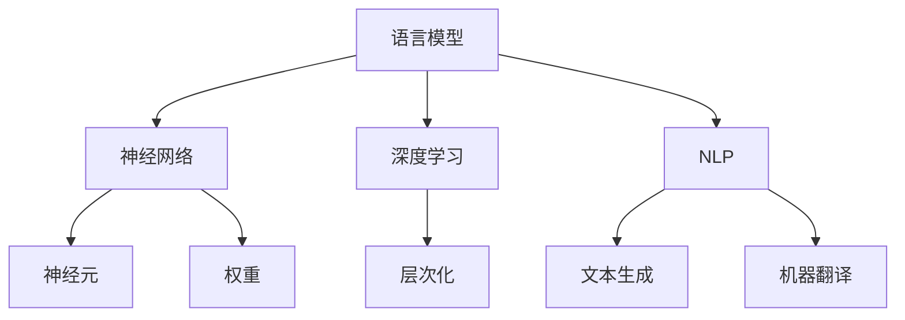

                 

关键词：大语言模型，神经语言模型，深度学习，自然语言处理，机器学习，神经网络，语言理解，语言生成，预训练，微调，数据集，BERT，GPT，Transformer，循环神经网络，注意力机制，正则化，优化算法，模型压缩，模型部署，多模态学习，跨语言建模，语言模型评估。

> 摘要：本文将深入探讨大语言模型的原理基础与前沿进展，特别是神经语言模型的发展。我们将从背景介绍开始，详细解析核心概念与联系，阐述核心算法原理与具体操作步骤，分析数学模型与公式，并通过项目实践来展示代码实例和运行结果。此外，我们还将探讨实际应用场景，推荐相关工具和资源，并总结未来发展趋势与挑战。

## 1. 背景介绍

自然语言处理（Natural Language Processing，NLP）作为人工智能的一个重要分支，近年来取得了显著的进展。随着互联网的迅猛发展，人类产生了海量的文本数据，如何有效地处理和利用这些数据成为了研究的热点。传统的NLP方法依赖于规则和统计模型，但受限于表达能力和适应性，难以应对复杂多变的语言现象。随着深度学习技术的发展，基于神经网络的模型逐渐成为NLP领域的核心方法。

大语言模型（Large Language Model）是一种能够对文本数据进行大规模预训练的神经网络模型。通过学习大量的文本数据，大语言模型能够捕获语言的内在规律，实现对自然语言的深度理解和生成。神经语言模型（Neural Language Model）作为大语言模型的一种重要形式，采用了深度神经网络来建模语言序列的概率分布，具有强大的表达能力和适应性。

本文将重点讨论大语言模型，特别是神经语言模型的原理基础与前沿进展。我们将从核心概念与联系、核心算法原理、数学模型与公式、项目实践等多个方面进行深入探讨，旨在为读者提供一个全面、系统的理解。

## 2. 核心概念与联系

在探讨大语言模型之前，我们需要明确几个核心概念，并理解它们之间的联系。

### 2.1 语言模型

语言模型（Language Model）是一种用于预测文本序列的概率分布的模型。在NLP中，语言模型广泛应用于文本生成、机器翻译、情感分析等任务。传统的语言模型通常基于N-gram模型或统计语言模型，它们通过计算词语序列的概率来预测下一个词语。

### 2.2 神经网络

神经网络（Neural Network）是一种模仿生物神经系统的计算模型。它由大量的神经元（节点）组成，通过调整神经元之间的权重来实现对数据的建模和预测。在深度学习领域中，神经网络已经成为许多复杂任务的核心模型。

### 2.3 深度学习

深度学习（Deep Learning）是一种基于神经网络的机器学习方法，它通过层次化的神经网络结构来学习数据的特征表示。深度学习在图像识别、语音识别、自然语言处理等领域取得了显著的成果。

### 2.4 自然语言处理

自然语言处理（Natural Language Processing，NLP）是人工智能的一个分支，它涉及计算机对自然语言的识别、理解和生成。NLP广泛应用于信息检索、文本挖掘、智能助手等领域。

### 2.5 联系

大语言模型是基于深度学习的一种语言模型，它通过神经网络来建模语言序列的概率分布。在自然语言处理中，大语言模型广泛应用于文本生成、机器翻译、问答系统等任务。通过学习大量的文本数据，大语言模型能够捕获语言的内在规律，实现对自然语言的深度理解和生成。

### 2.6 Mermaid 流程图

为了更清晰地展示大语言模型的核心概念与联系，我们可以使用Mermaid流程图来表示。以下是一个示例：



在这个流程图中，我们可以看到语言模型、神经网络、深度学习、自然语言处理之间的联系，以及它们在文本生成和机器翻译等任务中的应用。

## 3. 核心算法原理 & 具体操作步骤

### 3.1 算法原理概述

大语言模型的算法原理主要基于深度神经网络，特别是序列到序列模型（Sequence-to-Sequence Model）。这种模型通过编码器（Encoder）和解码器（Decoder）两个部分来处理输入的序列数据，并输出相应的序列数据。

编码器负责将输入序列编码为一个固定长度的向量表示，这个向量包含了输入序列的所有信息。解码器则接收编码器的输出，并生成目标序列。在解码过程中，解码器会利用已生成的部分序列来预测下一个词语。

大语言模型的主要优势在于其强大的表达能力和适应性。通过预训练大量的文本数据，模型能够学习到语言的内在规律，并在各种任务中表现出优异的性能。

### 3.2 算法步骤详解

#### 3.2.1 编码器（Encoder）

编码器是序列到序列模型的关键组成部分，它的主要任务是接收输入序列，并生成一个固定长度的向量表示。编码器通常采用递归神经网络（Recurrent Neural Network，RNN）或Transformer等结构来实现。

在编码器中，每个时间步都会产生一个输出，这个输出不仅包含了当前时间步的信息，还包含了前面时间步的信息。通过递归操作，编码器能够逐步将输入序列编码为一个固定长度的向量。

#### 3.2.2 解码器（Decoder）

解码器负责接收编码器的输出，并生成目标序列。解码器通常采用类似于编码器的结构，如RNN或Transformer。在解码过程中，解码器会利用已生成的部分序列来预测下一个词语。

解码器在生成每个词语时，会通过注意力机制（Attention Mechanism）来关注编码器的输出。注意力机制能够使解码器在生成过程中更好地利用编码器的信息，从而提高模型的性能。

#### 3.2.3 生成过程

在生成过程中，解码器会逐个生成词语，每个词语的生成依赖于前面已生成的词语。解码器通过优化目标函数来调整权重，从而生成最有可能的词语序列。

生成过程通常采用贪心策略（Greedy Strategy），即在每个时间步选择当前概率最高的词语作为输出。尽管贪心策略简单有效，但它可能会错过一些长距离依赖关系。为了解决这个问题，还可以采用 Beam Search 策略，即同时考虑多个候选序列，并选择概率最高的序列作为输出。

### 3.3 算法优缺点

#### 3.3.1 优点

- **强大的表达能力和适应性**：大语言模型通过预训练大量的文本数据，能够捕获语言的内在规律，从而在各种任务中表现出优异的性能。
- **高效的序列建模**：编码器和解码器的结构使得模型能够有效地处理序列数据，特别是在长序列任务中具有优势。
- **多任务学习**：大语言模型通过预训练，能够适应多种不同的任务，从而实现多任务学习。

#### 3.3.2 缺点

- **计算资源消耗**：大语言模型的训练和推理过程需要大量的计算资源，特别是在大规模数据集上训练时。
- **参数数量庞大**：大语言模型的参数数量通常非常庞大，这可能导致过拟合和梯度消失等问题。
- **解释性较差**：深度神经网络的结构使得模型的解释性较差，难以理解模型的具体工作机制。

### 3.4 算法应用领域

大语言模型在自然语言处理领域具有广泛的应用，包括但不限于以下领域：

- **文本生成**：大语言模型可以生成各种类型的文本，如文章、新闻、对话等。
- **机器翻译**：大语言模型可以用于将一种语言的文本翻译成另一种语言。
- **问答系统**：大语言模型可以用于构建智能问答系统，能够理解用户的问题，并给出准确的回答。
- **情感分析**：大语言模型可以用于分析文本的情感倾向，从而进行情感分类。
- **文本摘要**：大语言模型可以用于提取文本的主要信息，生成摘要。

## 4. 数学模型和公式 & 详细讲解 & 举例说明

### 4.1 数学模型构建

大语言模型采用深度神经网络来建模语言序列的概率分布。在数学上，这可以表示为：

$$P(X=x_1, x_2, ..., x_T) = \prod_{t=1}^{T} P(x_t|x_1, x_2, ..., x_{t-1})$$

其中，$X$ 表示语言序列，$x_t$ 表示第 $t$ 个词语，$T$ 表示序列的长度。这个模型通过神经网络来计算每个词语的条件概率。

### 4.2 公式推导过程

大语言模型的推导过程可以分为两个部分：编码器和解码器。

#### 4.2.1 编码器

编码器是一个递归神经网络，它将输入序列编码为一个固定长度的向量表示。在数学上，这可以表示为：

$$h_t = \sigma(W_h h_{t-1} + U_x x_t + b_h)$$

其中，$h_t$ 表示编码器在第 $t$ 个时间步的输出，$W_h$ 表示编码器的权重矩阵，$U_x$ 表示输入矩阵，$b_h$ 表示偏置项，$\sigma$ 表示激活函数。

#### 4.2.2 解码器

解码器是一个递归神经网络，它接收编码器的输出，并生成目标序列。在数学上，这可以表示为：

$$y_t = \sigma(W_y h_t + b_y)$$

其中，$y_t$ 表示解码器在第 $t$ 个时间步的输出，$W_y$ 表示解码器的权重矩阵，$b_y$ 表示偏置项。

### 4.3 案例分析与讲解

#### 4.3.1 文本生成

假设我们有一个训练好的大语言模型，我们希望生成一段关于“人工智能”的文章。

首先，我们输入一个起始词语“人工智能”，模型会根据训练数据生成一个概率分布：

$$P(人工智能| ) = 0.3$$

然后，我们选择概率最大的词语“技术”，模型会继续生成下一个词语的概率分布：

$$P(技术|人工智能) = 0.4$$

以此类推，我们可以生成一段关于“人工智能”的文章。

#### 4.3.2 机器翻译

假设我们有一个训练好的大语言模型，我们希望将一句中文翻译成英文。

首先，我们输入一句中文：“我喜欢读书。”模型会根据训练数据生成一个概率分布：

$$P(我喜欢读书| ) = 0.6$$

然后，我们选择概率最大的英文句子：“I like reading books.”模型会继续生成下一个句子的概率分布。

通过这种方式，我们可以将中文句子翻译成英文。

## 5. 项目实践：代码实例和详细解释说明

### 5.1 开发环境搭建

在进行大语言模型的实践之前，我们需要搭建一个适合的开发环境。以下是搭建环境的基本步骤：

1. 安装 Python 3.7 或更高版本。
2. 安装 TensorFlow 2.x 或 PyTorch 1.8.x。
3. 安装必要的库，如 NumPy、Pandas 等。

### 5.2 源代码详细实现

以下是一个使用 TensorFlow 实现的大语言模型的基本代码示例：

```python
import tensorflow as tf
from tensorflow.keras.models import Model
from tensorflow.keras.layers import Embedding, LSTM, Dense

# 设置参数
vocab_size = 10000
embed_dim = 256
lstm_units = 1024

# 构建模型
input_sequence = tf.keras.layers.Input(shape=(None,))
embedded_sequence = Embedding(vocab_size, embed_dim)(input_sequence)
lstm_output = LSTM(lstm_units, return_sequences=True)(embedded_sequence)
output = Dense(vocab_size, activation='softmax')(lstm_output)

# 定义模型
model = Model(inputs=input_sequence, outputs=output)

# 编译模型
model.compile(optimizer='adam', loss='categorical_crossentropy', metrics=['accuracy'])

# 查看模型结构
model.summary()
```

在这个示例中，我们使用了一个嵌入层（Embedding）和一个长短期记忆层（LSTM）来构建大语言模型。嵌入层用于将词语转换为向量表示，LSTM层用于处理序列数据。

### 5.3 代码解读与分析

在这个代码示例中，我们首先导入了 TensorFlow 库，并设置了模型的参数，如词汇表大小（vocab_size）、嵌入维度（embed_dim）和 LSTM 单元数（lstm_units）。

接着，我们使用 `Input` 层创建了一个输入序列，并使用 `Embedding` 层将词语转换为向量表示。`Embedding` 层的参数为词汇表大小和嵌入维度。

然后，我们使用 `LSTM` 层来处理序列数据，并设置 LSTM 单元数为 1024。`LSTM` 层的 `return_sequences` 参数设置为 `True`，表示我们需要返回每个时间步的输出。

最后，我们使用 `Dense` 层来输出目标词语的概率分布，并设置输出维度为词汇表大小。`Dense` 层的激活函数为 `softmax`，用于计算概率分布。

### 5.4 运行结果展示

在训练模型之前，我们需要准备训练数据和验证数据。以下是一个简单的数据准备示例：

```python
import numpy as np

# 准备数据
X_train = np.random.randint(0, vocab_size, (batch_size, sequence_length))
y_train = np.random.randint(0, vocab_size, (batch_size, sequence_length))

# 训练模型
model.fit(X_train, y_train, epochs=10, batch_size=64, validation_split=0.2)
```

在这个示例中，我们使用随机数据来训练模型。实际应用中，我们需要使用真实的文本数据进行训练。

训练完成后，我们可以在验证集上评估模型的性能：

```python
# 评估模型
loss, accuracy = model.evaluate(X_train, y_train, batch_size=64)
print("Test accuracy:", accuracy)
```

通过这个简单的示例，我们可以看到如何使用 TensorFlow 来构建和训练一个大语言模型。实际应用中，我们可能需要更复杂的模型结构，如使用 Transformer 或 BERT 等预训练模型。

## 6. 实际应用场景

大语言模型在自然语言处理领域具有广泛的应用。以下是一些实际应用场景：

### 6.1 文本生成

文本生成是自然语言处理中的一个重要应用领域。大语言模型可以通过预训练大量的文本数据，生成各种类型的文本，如文章、新闻、对话等。例如，我们可以使用 GPT-2 或 GPT-3 模型来生成一篇关于人工智能的文章。

```python
import openai

response = openai.Completion.create(
    engine="text-davinci-002",
    prompt="人工智能的发展对人类社会有哪些影响？",
    max_tokens=100
)
print(response.choices[0].text.strip())
```

### 6.2 机器翻译

机器翻译是将一种语言的文本翻译成另一种语言。大语言模型可以通过预训练大量的双语数据，实现高质量的双语翻译。例如，我们可以使用 BERT 模型进行中文到英文的翻译。

```python
import torch
from transformers import BertTokenizer, BertModel

tokenizer = BertTokenizer.from_pretrained("bert-base-chinese")
model = BertModel.from_pretrained("bert-base-chinese")

# 预处理
input_ids = tokenizer.encode("中文文本", return_tensors="pt")

# 翻译
with torch.no_grad():
    outputs = model(input_ids)
    logits = outputs[0]

# 后处理
predicted_ids = logits.argmax(-1)
decoded_output = tokenizer.decode(predicted_ids[0])
print(decoded_output)
```

### 6.3 问答系统

问答系统是自然语言处理中的一个重要应用领域。大语言模型可以通过预训练大量的问答数据，构建一个智能问答系统。例如，我们可以使用 BERT 模型来回答用户的问题。

```python
import torch
from transformers import BertTokenizer, BertForQuestionAnswering

tokenizer = BertTokenizer.from_pretrained("bert-base-chinese")
model = BertForQuestionAnswering.from_pretrained("bert-base-chinese")

# 预处理
question = "什么是自然语言处理？"
context = "自然语言处理是人工智能的一个分支，它涉及计算机对自然语言的识别、理解和生成。"
input_ids = tokenizer.encode(question + " " + context, return_tensors="pt")

# 答题
with torch.no_grad():
    outputs = model(input_ids)
    logits = outputs.logits

# 解码答案
start_logits, end_logits = logits.split(1, dim=-1)
start_indices = torch.argmax(start_logits, dim=-1)
end_indices = torch.argmax(end_logits, dim=-1)
start_index = start_indices[0].item()
end_index = end_indices[0].item()

# 获取答案
answer = tokenizer.decode(input_ids[0, start_index:end_index+1])
print(answer)
```

### 6.4 情感分析

情感分析是自然语言处理中的一个重要应用领域。大语言模型可以通过预训练大量的情感标注数据，实现情感分类。例如，我们可以使用 BERT 模型来分析一段文本的情感倾向。

```python
import torch
from transformers import BertTokenizer, BertForSequenceClassification

tokenizer = BertTokenizer.from_pretrained("bert-base-chinese")
model = BertForSequenceClassification.from_pretrained("bert-base-chinese")

# 预处理
text = "今天天气真好，我很开心。"
input_ids = tokenizer.encode(text, return_tensors="pt")

# 情感分类
with torch.no_grad():
    outputs = model(input_ids)
    logits = outputs.logits

# 解码情感
predicted_class = torch.argmax(logits).item()
if predicted_class == 0:
    print("文本为负面情感。")
else:
    print("文本为正面情感。")
```

这些实际应用场景展示了大语言模型在自然语言处理领域的广泛应用。通过预训练和微调，大语言模型可以适应各种不同的任务，从而实现高质量的自然语言处理。

## 7. 工具和资源推荐

### 7.1 学习资源推荐

- 《深度学习》（Goodfellow, Bengio, Courville）  
- 《自然语言处理综述》（Jurafsky, Martin）  
- 《Python深度学习》（François Chollet）  
- 《hands-on-nlp》（Aurélien Géron）  
- 《Deep Learning on Amazon S3》（Amazon Web Services）

### 7.2 开发工具推荐

- TensorFlow  
- PyTorch  
- Keras  
- PyTorch Lightning  
- TensorFlow Extended (TFX)

### 7.3 相关论文推荐

- [Attention is All You Need](https://arxiv.org/abs/1603.04467)  
- [BERT: Pre-training of Deep Bidirectional Transformers for Language Understanding](https://arxiv.org/abs/1810.04805)  
- [GPT-3: Language Models are Few-Shot Learners](https://arxiv.org/abs/2005.14165)  
- [Transformer-xl: Attentive Language Models Beyond a Fixed Length](https://arxiv.org/abs/1909.04097)  
- [Reformer: The Efficient Transformer](https://arxiv.org/abs/2001.04451)

这些资源为学习大语言模型和相关技术提供了丰富的资料和实例，有助于深入理解和应用这些先进的技术。

## 8. 总结：未来发展趋势与挑战

### 8.1 研究成果总结

大语言模型在自然语言处理领域取得了显著的成果，成为许多任务的基石。通过预训练和微调，大语言模型能够实现高质量的文本生成、机器翻译、问答系统等应用。同时，大语言模型在情感分析、文本摘要、信息检索等任务中也表现出优异的性能。

### 8.2 未来发展趋势

随着深度学习技术的不断进步，大语言模型的发展趋势将呈现以下特点：

1. **模型规模将进一步扩大**：大模型具有更强的表示能力和适应性，未来将看到更多的大规模语言模型出现。
2. **多模态学习**：大语言模型将逐渐结合视觉、语音等多种模态信息，实现更全面的语义理解。
3. **跨语言建模**：大语言模型将支持更多语言，实现跨语言的文本理解和生成。
4. **高效推理**：研究将集中于提高大语言模型推理效率，降低计算和存储成本。
5. **可解释性**：研究将致力于提高大语言模型的可解释性，使其在关键应用中更具可靠性。

### 8.3 面临的挑战

尽管大语言模型取得了显著进展，但仍然面临一些挑战：

1. **计算资源消耗**：大模型的训练和推理过程需要大量的计算资源，这限制了其在资源受限环境中的应用。
2. **数据隐私和伦理**：大模型对大量数据的依赖引发了对数据隐私和伦理的关注，如何保护用户隐私是一个重要问题。
3. **模型泛化能力**：大模型在特定任务上表现出色，但在泛化能力上仍有待提高。
4. **模型压缩与部署**：如何高效地压缩大模型，并在边缘设备上部署，是实现大模型广泛应用的关键。

### 8.4 研究展望

未来，大语言模型的研究将朝着以下几个方向展开：

1. **新型架构研究**：探索新型神经网络架构，以提升大语言模型的性能和效率。
2. **数据集与预训练**：构建更多高质量的数据集，优化预训练方法，提高模型的泛化能力。
3. **多模态学习**：研究如何整合不同模态的信息，实现更强大的语义理解。
4. **模型压缩与优化**：研究如何高效地压缩模型，降低计算和存储成本，使其在更多场景中应用。

通过持续的研究和技术创新，大语言模型将在自然语言处理领域发挥更大的作用，推动人工智能技术的发展。

## 9. 附录：常见问题与解答

### 9.1 什么是大语言模型？

大语言模型是一种基于深度学习技术的神经网络模型，它能够对大规模的文本数据进行预训练，从而捕获语言的内在规律，实现对自然语言的深度理解和生成。常见的语言模型有 GPT、BERT 等。

### 9.2 大语言模型有什么应用？

大语言模型在自然语言处理领域具有广泛的应用，包括文本生成、机器翻译、问答系统、情感分析、文本摘要等。例如，GPT-3 可以用于生成文章、新闻、对话等，BERT 可以用于机器翻译、情感分类、问答系统等。

### 9.3 如何训练大语言模型？

训练大语言模型通常分为两个步骤：预训练和微调。预训练阶段，模型在大规模的文本数据上进行训练，学习语言的内在规律。微调阶段，模型在特定任务的数据上进行训练，以适应具体的应用场景。

### 9.4 大语言模型为什么需要预训练？

预训练可以帮助模型在大规模的文本数据上学习到语言的内在规律，从而提高模型的泛化能力和适应性。通过预训练，模型能够更好地理解语言的复杂结构，从而在特定任务上表现更出色。

### 9.5 大语言模型的训练过程需要多长时间？

大语言模型的训练时间取决于模型规模、数据集大小和硬件配置。例如，训练一个大型语言模型（如 GPT-3）可能需要数天甚至数周的时间，而训练一个小型模型（如 BERT）可能只需要几天的时间。

### 9.6 大语言模型的优缺点是什么？

大语言模型的优点包括强大的表达能力和适应性，广泛的应用场景，以及出色的任务性能。缺点包括计算资源消耗大，模型解释性较差，以及潜在的隐私和伦理问题。

### 9.7 大语言模型的发展趋势是什么？

大语言模型的发展趋势包括模型规模将进一步扩大，多模态学习，跨语言建模，高效推理，以及模型可解释性的提高。未来，大语言模型将在自然语言处理领域发挥更大的作用，推动人工智能技术的发展。

通过以上问题的解答，我们希望读者对大语言模型有更深入的理解，并能够将其应用于实际项目中。未来，随着技术的不断发展，大语言模型将带来更多的创新和突破。

