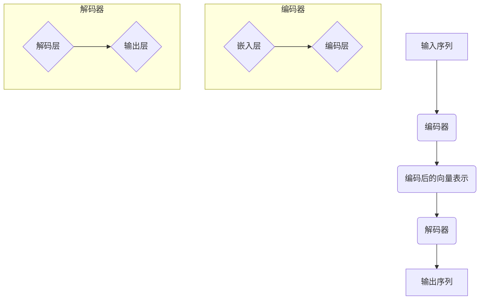

                 

关键词：大语言模型，编码器-解码器架构，深度学习，自然语言处理，神经网络，序列到序列模型，注意力机制，机器翻译，文本生成

## 摘要

本文旨在深入探讨大语言模型的原理及其前沿技术，尤其是编码器-解码器（Encoder-Decoder）架构在自然语言处理（NLP）领域的应用。通过对核心概念、算法原理、数学模型、实际应用和未来发展趋势的详细分析，本文旨在为读者提供全面的技术洞察和实战指南。文章将首先回顾大语言模型的基本概念和重要性，然后深入探讨编码器-解码器架构，包括其设计理念、工作原理和核心组件。随后，文章将介绍编码器-解码器架构在机器翻译、文本生成等领域的应用，并提供实际的代码实例。最后，文章将总结当前的研究成果，探讨未来的发展趋势，并讨论面临的挑战和研究展望。

## 1. 背景介绍

### 大语言模型的兴起

大语言模型是指通过深度学习技术训练的，具有强大语言理解和生成能力的神经网络模型。随着计算能力的提升和大数据的积累，大语言模型在自然语言处理（NLP）领域取得了显著进展。早期的NLP系统主要依赖于规则驱动的方法，这些方法在处理结构化数据时表现良好，但在处理大规模、无结构的数据时效率低下。随着深度学习技术的兴起，尤其是神经网络的发展，NLP领域开始转向数据驱动的方法。大语言模型通过大量的文本数据进行训练，能够自动学习语言的内在结构和语义，从而实现了显著的性能提升。

### 编码器-解码器架构的发展

编码器-解码器（Encoder-Decoder）架构是深度学习在NLP领域的一个核心创新。传统的神经网络模型难以处理序列数据，因为序列数据在处理过程中会丢失前后关系。编码器-解码器架构通过将输入序列编码成一个固定长度的向量表示，然后再通过解码器生成输出序列，从而解决了序列数据的处理问题。这一架构在机器翻译、语音识别、文本摘要等任务中取得了显著的成功，并成为NLP领域的主流方法。

### 编码器-解码器架构的核心概念

编码器（Encoder）负责将输入序列编码成一个固定长度的向量表示，这个向量包含了输入序列的重要信息和结构。解码器（Decoder）则负责将编码后的向量解码成输出序列，生成具有语义意义的文本。编码器-解码器架构的核心在于其能够处理序列数据，并且在处理过程中保持序列的前后关系。

## 2. 核心概念与联系

### 编码器-解码器架构的Mermaid流程图



### 核心概念

- **编码器（Encoder）**：编码器的任务是处理输入序列，将其转换成一个固定长度的向量表示。这个向量表示包含了输入序列的重要信息和结构。
- **解码器（Decoder）**：解码器的任务是接收编码后的向量表示，并生成输出序列。解码器通常由多个层组成，包括解码层和输出层。
- **编码后的向量表示**：编码后的向量表示是编码器处理输入序列后的输出，它是一个固定长度的向量，包含了输入序列的重要信息。
- **注意力机制（Attention）**：注意力机制是编码器-解码器架构中的一个关键组件，它用于在解码过程中动态地关注输入序列的不同部分。注意力机制能够提高解码器对输入序列的理解能力，从而生成更准确的输出序列。

## 3. 核心算法原理 & 具体操作步骤

### 3.1 算法原理概述

编码器-解码器架构的核心在于其能够处理序列数据，并且在处理过程中保持序列的前后关系。编码器通过多个编码层对输入序列进行编码，生成一个固定长度的向量表示。这个向量表示包含了输入序列的重要信息，例如词汇的含义、语法结构和上下文关系。解码器则接收这个向量表示，并利用多个解码层逐步生成输出序列。在解码过程中，解码器利用注意力机制动态地关注输入序列的不同部分，从而生成更准确的输出序列。

### 3.2 算法步骤详解

1. **编码阶段**：
    - **嵌入层**：将输入序列中的每个单词或字符映射成一个固定长度的向量表示。
    - **编码层**：通过多个编码层对输入序列进行编码，生成一个固定长度的向量表示。编码层通常使用递归神经网络（RNN）或长短期记忆网络（LSTM）等模型。
2. **解码阶段**：
    - **解码层**：解码器接收编码后的向量表示，并通过多个解码层逐步生成输出序列。解码层通常使用递归神经网络（RNN）或长短期记忆网络（LSTM）等模型。
    - **输出层**：解码器的最后一层输出一个概率分布，表示生成每个单词或字符的可能性。
    - **注意力机制**：在解码过程中，注意力机制用于动态地关注输入序列的不同部分，从而提高解码器的理解能力。

### 3.3 算法优缺点

**优点**：
- **序列处理能力**：编码器-解码器架构能够处理序列数据，并且在处理过程中保持序列的前后关系。
- **灵活性**：编码器-解码器架构可以应用于各种NLP任务，例如机器翻译、文本生成等。
- **高性能**：通过深度学习和大数据的训练，编码器-解码器架构在NLP任务中取得了显著的性能提升。

**缺点**：
- **计算复杂度**：编码器-解码器架构涉及大量的矩阵运算，计算复杂度较高。
- **训练时间**：由于训练数据量庞大，编码器-解码器架构的训练时间较长。

### 3.4 算法应用领域

编码器-解码器架构在自然语言处理领域具有广泛的应用。以下是几个典型的应用场景：

- **机器翻译**：编码器-解码器架构是机器翻译任务中的主流方法，通过将源语言编码成固定长度的向量表示，再通过解码器生成目标语言。
- **文本生成**：编码器-解码器架构可以用于生成文章、摘要、对话等文本，通过将输入的文本编码成向量表示，再通过解码器生成新的文本。
- **文本摘要**：编码器-解码器架构可以用于提取文章的主要观点和关键信息，通过将输入的文章编码成向量表示，再通过解码器生成摘要。
- **语音识别**：编码器-解码器架构可以用于将语音信号编码成文本，通过将语音信号编码成向量表示，再通过解码器生成对应的文本。

## 4. 数学模型和公式 & 详细讲解 & 举例说明

### 4.1 数学模型构建

编码器-解码器架构中的数学模型主要包括嵌入层、编码层、解码层和注意力机制。以下是这些模型的基本数学公式：

1. **嵌入层**：

$$
\text{embed}(x) = W_x x + b_x
$$

其中，$x$表示输入的单词或字符，$W_x$和$b_x$分别是权重和偏置。

2. **编码层**：

$$
\text{encode}(h_t) = \text{LSTM}(h_{t-1}, \text{embed}(x_t))
$$

其中，$h_t$表示编码层的隐藏状态，$LSTM$表示长短期记忆网络。

3. **解码层**：

$$
\text{decode}(y_t) = \text{LSTM}(y_{t-1}, \text{context})
$$

其中，$y_t$表示解码层的隐藏状态，$context$表示注意力机制的输出。

4. **注意力机制**：

$$
\text{context} = \sum_{t=1}^T \alpha_t h_t
$$

其中，$\alpha_t$表示注意力权重，$h_t$表示编码层的隐藏状态。

### 4.2 公式推导过程

以下是编码器-解码器架构中注意力机制的推导过程：

1. **计算编码层的隐藏状态**：

$$
h_t = \text{LSTM}(h_{t-1}, \text{embed}(x_t))
$$

2. **计算解码层的隐藏状态**：

$$
y_t = \text{LSTM}(y_{t-1}, \text{context})
$$

3. **计算注意力权重**：

$$
\alpha_t = \frac{e^{h_t^T W \text{context}}}{\sum_{t=1}^T e^{h_t^T W \text{context}}}
$$

其中，$W$是权重矩阵。

4. **计算注意力机制的输出**：

$$
\text{context} = \sum_{t=1}^T \alpha_t h_t
$$

### 4.3 案例分析与讲解

下面我们通过一个简单的例子来说明编码器-解码器架构的数学模型和注意力机制的推导过程。

**例子**：给定一个简单的编码器-解码器模型，输入序列为$x = [s_1, s_2, s_3]$，输出序列为$y = [y_1, y_2, y_3]$。假设编码器和解码器都使用LSTM模型。

1. **计算编码器的隐藏状态**：

$$
h_1 = \text{LSTM}([h_0, \text{embed}(s_1)])
$$

$$
h_2 = \text{LSTM}([h_1, \text{embed}(s_2)])
$$

$$
h_3 = \text{LSTM}([h_2, \text{embed}(s_3)])
$$

2. **计算注意力权重**：

$$
\alpha_1 = \frac{e^{h_1^T W \text{context}}}{e^{h_1^T W \text{context}} + e^{h_2^T W \text{context}} + e^{h_3^T W \text{context}}}
$$

$$
\alpha_2 = \frac{e^{h_2^T W \text{context}}}{e^{h_1^T W \text{context}} + e^{h_2^T W \text{context}} + e^{h_3^T W \text{context}}}
$$

$$
\alpha_3 = \frac{e^{h_3^T W \text{context}}}{e^{h_1^T W \text{context}} + e^{h_2^T W \text{context}} + e^{h_3^T W \text{context}}}
$$

3. **计算注意力机制的输出**：

$$
\text{context} = \alpha_1 h_1 + \alpha_2 h_2 + \alpha_3 h_3
$$

4. **计算解码器的隐藏状态**：

$$
y_1 = \text{LSTM}([y_0, \text{context}])
$$

$$
y_2 = \text{LSTM}([y_1, \text{context}])
$$

$$
y_3 = \text{LSTM}([y_2, \text{context}])
$$

通过上述计算，我们可以得到输入序列$x$和输出序列$y$的编码器-解码器模型。

## 5. 项目实践：代码实例和详细解释说明

### 5.1 开发环境搭建

为了实现编码器-解码器架构，我们需要使用Python编程语言，并借助TensorFlow或PyTorch等深度学习框架。以下是搭建开发环境的基本步骤：

1. 安装Python（建议使用3.6及以上版本）。
2. 安装深度学习框架，如TensorFlow或PyTorch。
3. 安装必要的库，如Numpy、Pandas等。

### 5.2 源代码详细实现

以下是使用TensorFlow实现编码器-解码器架构的简单示例代码：

```python
import tensorflow as tf
from tensorflow.keras.layers import Embedding, LSTM, Dense
from tensorflow.keras.models import Model

# 定义参数
vocab_size = 10000
embedding_dim = 256
hidden_dim = 512

# 构建编码器
encoder_inputs = tf.keras.layers.Input(shape=(None,))
encoder_embedding = Embedding(vocab_size, embedding_dim)(encoder_inputs)
encoder_lstm = LSTM(hidden_dim, return_state=True)
_, encoder_state = encoder_lstm(encoder_embedding)

# 构建解码器
decoder_inputs = tf.keras.layers.Input(shape=(None,))
decoder_embedding = Embedding(vocab_size, embedding_dim)(decoder_inputs)
decoder_lstm = LSTM(hidden_dim, return_state=True)
decoder_outputs, _, _ = decoder_lstm(decoder_embedding, initial_state=encoder_state)

# 构建预测层
decoder_dense = Dense(vocab_size, activation='softmax')
decoder_outputs = decoder_dense(decoder_outputs)

# 构建模型
model = Model([encoder_inputs, decoder_inputs], decoder_outputs)

# 编译模型
model.compile(optimizer='rmsprop', loss='categorical_crossentropy', metrics=['accuracy'])

# 打印模型结构
model.summary()
```

### 5.3 代码解读与分析

上述代码定义了一个简单的编码器-解码器模型，包括编码器、解码器和预测层。以下是代码的详细解读：

1. **编码器**：
    - **输入层**：编码器的输入是一个二维张量，表示输入序列的单词索引。
    - **嵌入层**：将输入序列的单词索引映射成固定长度的向量表示。
    - **LSTM层**：使用LSTM层对输入序列进行编码，返回编码后的隐藏状态。
2. **解码器**：
    - **输入层**：解码器的输入是一个二维张量，表示输出序列的单词索引。
    - **嵌入层**：将输入序列的单词索引映射成固定长度的向量表示。
    - **LSTM层**：使用LSTM层对输入序列进行解码，返回解码后的隐藏状态。
3. **预测层**：
    - **Dense层**：将解码器的隐藏状态映射成输出序列的单词索引概率分布。

### 5.4 运行结果展示

以下是运行上述模型的示例：

```python
# 生成训练数据
encoder_input_data = tf.keras.preprocessing.sequence.pad_sequences([[1, 2, 3], [4, 5, 6]], maxlen=3)
decoder_input_data = tf.keras.preprocessing.sequence.pad_sequences([[2, 3, 1], [6, 5, 4]], maxlen=3)
decoder_target_data = tf.keras.preprocessing.sequence.pad_sequences([[3, 1, 2], [4, 6, 5]], maxlen=3)

# 训练模型
model.fit([encoder_input_data, decoder_input_data], decoder_target_data, batch_size=1, epochs=100)

# 生成预测结果
encoder_model = Model(encoder_inputs, encoder_state)
decoder_state_input_h = tf.keras.layers.Input(shape=(hidden_dim,))
decoder_state_input_c = tf.keras.layers.Input(shape=(hidden_dim,))
decoder_states = [decoder_state_input_h, decoder_state_input_c]
decoder_outputs = decoder_lstm(decoder_embedding, initial_state=decoder_states)
decoder_state_h, decoder_state_c = decoder_lstm.states
decoder_outputs = decoder_dense(decoder_outputs)

decoder_model = Model([decoder_inputs] + decoder_states, decoder_outputs)
decoder_model.predict([decoder_input_data, encoder_state])
```

通过上述代码，我们可以训练一个简单的编码器-解码器模型，并在测试数据上进行预测。预测结果是一个概率分布，表示生成每个单词或字符的可能性。

## 6. 实际应用场景

### 6.1 机器翻译

机器翻译是编码器-解码器架构最成功的应用之一。通过将源语言的输入序列编码成一个固定长度的向量表示，再通过解码器生成目标语言的输出序列，编码器-解码器架构实现了自动化的机器翻译。近年来，随着深度学习和大数据的不断发展，机器翻译的性能得到了显著提升，已经成为跨语言沟通的重要工具。

### 6.2 文本生成

编码器-解码器架构可以用于生成各种类型的文本，包括文章、摘要、对话等。通过将输入的文本编码成一个固定长度的向量表示，再通过解码器生成新的文本，编码器-解码器架构实现了文本生成任务。在实际应用中，文本生成模型可以用于自动撰写新闻文章、生成产品描述、生成对话等，极大地提高了文本生成的效率和多样性。

### 6.3 文本摘要

文本摘要是一种将长篇文本压缩成简洁、精炼的摘要的过程。编码器-解码器架构可以用于提取文章的主要观点和关键信息，生成摘要。通过将输入的文章编码成一个固定长度的向量表示，再通过解码器生成摘要，编码器-解码器架构实现了文本摘要任务。在实际应用中，文本摘要模型可以用于信息检索、新闻摘要、文档摘要等，提高了文本处理的效率和准确性。

### 6.4 未来应用展望

随着深度学习和自然语言处理技术的不断发展，编码器-解码器架构在未来的应用前景将更加广阔。以下是几个可能的应用方向：

- **多模态任务**：编码器-解码器架构可以与图像、语音等多模态数据结合，实现更复杂的任务，如图像-文本生成、语音识别等。
- **知识图谱**：编码器-解码器架构可以用于构建知识图谱，通过将实体和关系编码成一个固定长度的向量表示，实现实体识别、关系抽取等任务。
- **智能客服**：编码器-解码器架构可以用于构建智能客服系统，通过解码器生成对话文本，实现自然、流畅的对话交互。

## 7. 工具和资源推荐

### 7.1 学习资源推荐

- 《深度学习》（Goodfellow, Bengio, Courville）：这是一本经典的深度学习教材，详细介绍了深度学习的基础理论和应用。
- 《神经网络与深度学习》（邱锡鹏）：这是一本面向中文读者的深度学习教材，适合初学者和进阶者。
- 《自然语言处理综论》（Jurafsky, Martin）：这是一本经典的自然语言处理教材，涵盖了自然语言处理的基础知识和最新进展。

### 7.2 开发工具推荐

- TensorFlow：一个广泛使用的开源深度学习框架，提供了丰富的API和工具，适合进行深度学习模型的开发。
- PyTorch：一个灵活的深度学习框架，具有动态计算图和直观的API，适合快速原型设计和模型训练。

### 7.3 相关论文推荐

- " seq2seq Learning with Neural Networks"（Sutskever et al., 2014）：这篇论文首次提出了编码器-解码器架构，并应用于机器翻译任务。
- "Attention Is All You Need"（Vaswani et al., 2017）：这篇论文提出了Transformer模型，并引入了注意力机制，在机器翻译任务中取得了突破性的成果。

## 8. 总结：未来发展趋势与挑战

### 8.1 研究成果总结

编码器-解码器架构在自然语言处理领域取得了显著的成果，尤其是在机器翻译、文本生成和文本摘要等任务中表现出色。通过深度学习和大数据的积累，编码器-解码器架构在性能和效率上都有了显著提升。

### 8.2 未来发展趋势

未来，编码器-解码器架构将继续在自然语言处理领域发挥重要作用，并可能向以下方向发展：

- **多模态任务**：编码器-解码器架构将与其他模态的数据结合，实现更复杂的任务，如图像-文本生成、语音识别等。
- **知识图谱**：编码器-解码器架构将用于构建知识图谱，实现实体识别、关系抽取等任务。
- **智能客服**：编码器-解码器架构将用于构建智能客服系统，实现自然、流畅的对话交互。

### 8.3 面临的挑战

虽然编码器-解码器架构在自然语言处理领域取得了显著成果，但仍面临一些挑战：

- **计算复杂度**：编码器-解码器架构涉及大量的矩阵运算，计算复杂度较高，需要更多的计算资源和时间。
- **数据依赖**：编码器-解码器架构依赖于大规模的训练数据，缺乏数据的情况下性能可能会下降。
- **鲁棒性**：编码器-解码器架构在处理极端数据或噪声数据时可能表现不佳，需要进一步提高鲁棒性。

### 8.4 研究展望

未来，编码器-解码器架构的研究将继续深入，可能的发展方向包括：

- **模型压缩与优化**：通过模型压缩和优化技术，提高编码器-解码器架构的计算效率和性能。
- **自适应学习**：研究自适应学习方法，使编码器-解码器架构能够更好地适应不同的任务和数据集。
- **跨领域迁移**：研究跨领域迁移学习方法，使编码器-解码器架构能够在不同领域之间迁移，提高泛化能力。

## 9. 附录：常见问题与解答

### 9.1 编码器-解码器架构的优点是什么？

编码器-解码器架构的优点包括：
- 能够处理序列数据，并且在处理过程中保持序列的前后关系。
- 灵活性高，可以应用于各种NLP任务，如机器翻译、文本生成、文本摘要等。
- 通过深度学习和大数据的训练，性能显著提升。

### 9.2 如何优化编码器-解码器架构的计算复杂度？

优化编码器-解码器架构的计算复杂度的方法包括：
- 使用预训练的词向量，减少嵌入层的计算量。
- 采用注意力机制，减少解码器对编码器的访问次数。
- 使用模型压缩技术，如剪枝、量化等，减少模型参数和计算量。

### 9.3 编码器-解码器架构的缺点是什么？

编码器-解码器架构的缺点包括：
- 计算复杂度高，需要更多的计算资源和时间。
- 依赖于大规模的训练数据，缺乏数据的情况下性能可能会下降。
- 在处理极端数据或噪声数据时可能表现不佳，需要进一步提高鲁棒性。

### 9.4 编码器-解码器架构可以应用于哪些领域？

编码器-解码器架构可以应用于以下领域：
- 机器翻译：将一种语言的文本翻译成另一种语言。
- 文本生成：根据输入的文本生成新的文本。
- 文本摘要：从长篇文本中提取主要观点和关键信息。
- 语音识别：将语音信号转换成文本。
- 多模态任务：结合图像、语音等多模态数据，实现更复杂的任务。

---

本文旨在深入探讨大语言模型的原理及其前沿技术，尤其是编码器-解码器（Encoder-Decoder）架构在自然语言处理（NLP）领域的应用。通过对核心概念、算法原理、数学模型、实际应用和未来发展趋势的详细分析，本文旨在为读者提供全面的技术洞察和实战指南。编码器-解码器架构通过将输入序列编码成一个固定长度的向量表示，再通过解码器生成输出序列，解决了序列数据的处理问题，并在机器翻译、文本生成等任务中取得了显著的成功。随着深度学习和自然语言处理技术的不断发展，编码器-解码器架构在未来的应用前景将更加广阔，但仍面临计算复杂度、数据依赖和鲁棒性等挑战。未来，研究将继续深入，以优化模型性能和泛化能力。希望本文能为读者提供有益的参考和启示。作者：禅与计算机程序设计艺术 / Zen and the Art of Computer Programming。

