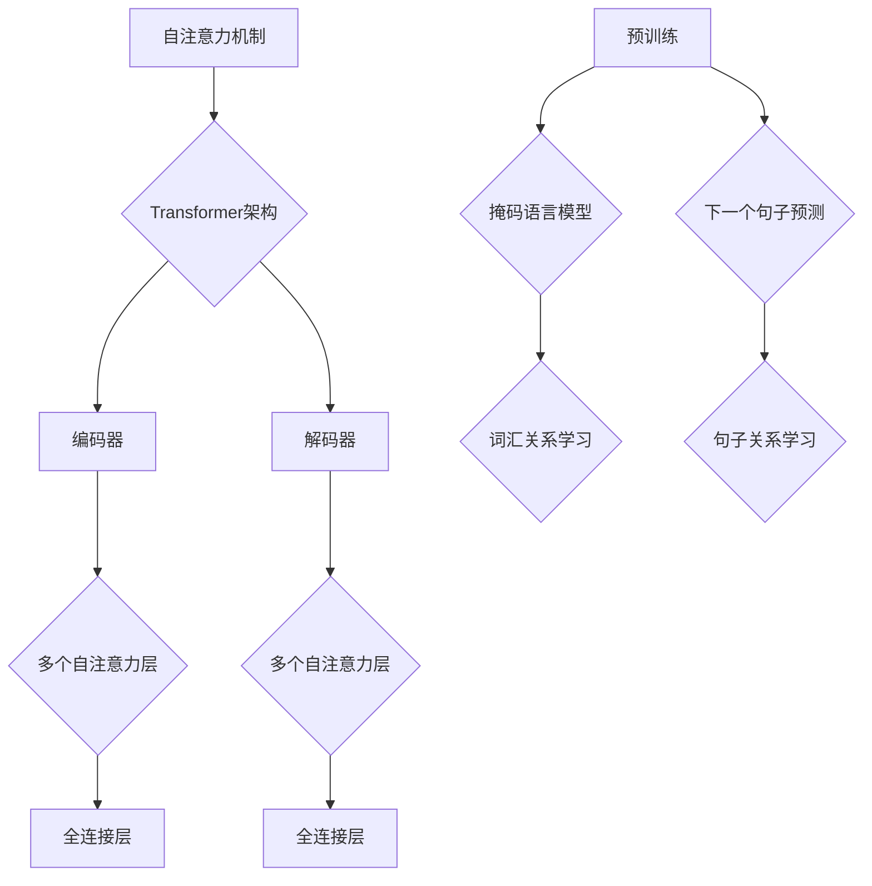

                 

关键词：大语言模型、预训练、AI专家、算法原理、应用领域

## 摘要

本文将深入探讨大语言模型的原理及其在不同预训练领域的应用。通过对大语言模型的基础理论、核心算法、数学模型以及具体项目实践的分析，本文旨在为AI领域的研究者、开发者和从业者提供一个全面而系统的理解和实践指南。文章将特别关注不同领域的专家如何利用大语言模型解决特定问题，从而展示其在实际应用中的巨大潜力。

## 1. 背景介绍

随着人工智能技术的飞速发展，自然语言处理（NLP）领域取得了令人瞩目的成果。大语言模型作为NLP的关键技术，已成为当前研究和应用的热点。大语言模型通过在大量文本数据上进行预训练，能够理解并生成自然语言，从而在自动问答、机器翻译、文本摘要、语音识别等多个领域展现了强大的能力。

然而，不同领域的应用需求差异巨大，对大语言模型的要求也各有不同。例如，在机器翻译领域，模型需要准确理解源语言和目标语言之间的语义差异；而在文本摘要领域，模型则要能够捕捉关键信息并生成简洁的摘要。因此，本文将针对不同预训练领域，分析大语言模型的应用特点和技术挑战，以期提供有针对性的解决方案。

### 1.1 大语言模型的发展历程

大语言模型的发展历程可以追溯到20世纪80年代。最早的尝试是使用统计方法处理文本，如隐马尔可夫模型（HMM）和决策树。然而，这些方法的局限性在于它们对数据的依赖性较高，难以处理复杂的关系和语义。

随着深度学习技术的兴起，神经网络在图像识别、语音识别等领域取得了显著成功，这启发了研究者将神经网络应用于NLP。2013年，研究人员提出了基于递归神经网络（RNN）的语言模型，如Word2Vec和GloVe，这些模型能够通过学习词嵌入来捕捉词语的语义关系。

2018年，Transformer模型的提出标志着NLP领域的重大突破。Transformer模型通过自注意力机制，能够捕捉文本中的长距离依赖关系，使得大语言模型在自然语言生成、文本分类等任务上达到了前所未有的性能。

近年来，随着计算能力的提升和数据量的增加，大语言模型的大小和参数数量不断增加，如GPT-3、T5和Bert等模型，它们在各个NLP任务上都取得了显著的成果。

### 1.2 预训练与微调

预训练（Pre-training）是大语言模型的核心步骤，它通过在大规模文本数据上训练，使得模型能够学习到语言的一般规律和结构。预训练后，模型通过微调（Fine-tuning）适应特定任务的需求，这一过程通常在较小的数据集上进行，以调整模型的参数。

预训练不仅提高了模型的泛化能力，还大大减少了模型对标注数据的依赖。在无监督或弱监督环境下，预训练模型能够自动学习到丰富的语义信息，这为处理大规模、低标注数据提供了有效的解决方案。

### 1.3 大语言模型的应用领域

大语言模型在多个领域展示了强大的应用潜力。以下是一些关键领域：

- **机器翻译**：大语言模型能够精确捕捉语言间的语义差异，使得机器翻译的准确率显著提高。
- **文本摘要**：通过生成简洁的摘要，大语言模型能够帮助用户快速获取关键信息，提高信息检索效率。
- **问答系统**：大语言模型能够理解用户的问题，并生成准确的答案，为智能客服、在线教育等领域提供了有效支持。
- **文本生成**：大语言模型可以生成高质量的文本，包括文章、故事、诗歌等，这在内容创作和娱乐领域具有广泛应用。
- **文本分类**：大语言模型能够对文本进行分类，用于新闻推荐、情感分析、垃圾邮件检测等任务。

## 2. 核心概念与联系

为了深入理解大语言模型，我们需要明确几个核心概念，包括自注意力机制、Transformer架构、预训练和微调等。

### 2.1 自注意力机制

自注意力机制（Self-Attention）是Transformer模型的核心组成部分。它通过计算序列中每个词与所有词之间的关联性，从而捕捉长距离依赖关系。自注意力机制的基本思想是将输入序列的每个词都映射到一个向量，然后计算这些向量之间的相似性，最后加权求和得到输出。

自注意力机制的公式可以表示为：
$$
\text{Attention}(Q, K, V) = \text{softmax}\left(\frac{QK^T}{\sqrt{d_k}}\right)V
$$
其中，$Q$、$K$和$V$分别是查询向量、键向量和值向量，$d_k$是键向量的维度。通过这种方式，自注意力机制能够有效地捕捉文本中的长距离依赖关系。

### 2.2 Transformer架构

Transformer模型由编码器（Encoder）和解码器（Decoder）组成。编码器负责将输入序列编码为固定长度的向量，解码器则将这些向量解码为输出序列。

编码器和解码器都由多个自注意力层和全连接层组成。自注意力层用于计算序列中每个词的权重，全连接层则用于将权重转换为输出。

Transformer模型的关键优势在于其并行化能力。由于自注意力机制的计算可以并行进行，这使得Transformer模型在大规模数据处理上具有显著优势。

### 2.3 预训练与微调

预训练（Pre-training）是大型语言模型的基础。在预训练阶段，模型在大规模无标签文本数据上学习，以理解自然语言的一般规律。预训练通常包括两个子任务：掩码语言模型（Masked Language Model，MLM）和下一个句子预测（Next Sentence Prediction，NSP）。

掩码语言模型通过随机掩码输入序列中的部分词，然后训练模型预测这些被掩码的词。这一过程使得模型能够学习到词汇的语义关系和上下文信息。

下一个句子预测任务则通过预测输入序列后接的下一个句子，进一步训练模型理解句子之间的逻辑关系。

微调（Fine-tuning）是预训练后的关键步骤。在微调阶段，模型被迁移到一个特定任务上，并在一个较小的有标签数据集上调整参数。微调使得预训练模型能够适应特定任务的需求，从而提高性能。

### 2.4 Mermaid 流程图

以下是一个描述大语言模型核心概念的Mermaid流程图：



## 3. 核心算法原理 & 具体操作步骤

### 3.1 算法原理概述

大语言模型的核心算法原理是基于自注意力机制的Transformer模型。Transformer模型通过编码器和解码器结构，利用自注意力机制捕捉文本中的长距离依赖关系。具体来说，编码器将输入序列编码为固定长度的向量，解码器则根据这些向量生成输出序列。

预训练阶段，模型在大规模无标签文本数据上学习，以理解自然语言的一般规律。预训练任务包括掩码语言模型和下一个句子预测。掩码语言模型通过随机掩码输入序列中的部分词，训练模型预测这些被掩码的词。下一个句子预测任务通过预测输入序列后接的下一个句子，进一步训练模型理解句子之间的逻辑关系。

微调阶段，模型被迁移到一个特定任务上，并在一个较小的有标签数据集上调整参数。微调使得预训练模型能够适应特定任务的需求，从而提高性能。

### 3.2 算法步骤详解

#### 3.2.1 编码器

编码器由多个自注意力层和全连接层组成。自注意力层计算输入序列中每个词与所有词之间的权重，全连接层则将这些权重转换为输出。

具体步骤如下：

1. **输入序列编码**：将输入序列编码为词向量。
2. **自注意力计算**：对于每个词，计算它与所有其他词之间的权重。
3. **加权求和**：将权重与对应的词向量相乘，然后求和得到输出向量。
4. **全连接层**：将输出向量通过全连接层转换为编码结果。

#### 3.2.2 解码器

解码器由多个自注意力层和全连接层组成，与编码器类似。解码器的关键区别在于其输入包含两个部分：上一个时间步的编码结果和上一个时间步的解码结果。

具体步骤如下：

1. **输入序列编码**：将输入序列编码为词向量。
2. **自注意力计算**：对于每个词，计算它与所有其他词（包括编码结果和解码结果）之间的权重。
3. **加权求和**：将权重与对应的词向量相乘，然后求和得到输出向量。
4. **全连接层**：将输出向量通过全连接层转换为解码结果。

#### 3.2.3 预训练

预训练阶段，模型在大规模无标签文本数据上学习，以理解自然语言的一般规律。预训练任务包括掩码语言模型和下一个句子预测。

1. **掩码语言模型**：
   - 随机掩码输入序列中的部分词。
   - 训练模型预测这些被掩码的词。

2. **下一个句子预测**：
   - 输入两个连续的句子。
   - 训练模型预测第二个句子是否为第一个句子的下一个句子。

#### 3.2.4 微调

微调阶段，模型被迁移到一个特定任务上，并在一个较小的有标签数据集上调整参数。微调使得预训练模型能够适应特定任务的需求，从而提高性能。

具体步骤如下：

1. **选择任务**：根据实际任务选择相应的数据集和评价指标。
2. **数据预处理**：对数据进行预处理，包括分词、编码等。
3. **训练模型**：在训练数据上训练模型，并在验证数据上调整超参数。
4. **评估模型**：在测试数据上评估模型性能，并根据结果调整模型。

### 3.3 算法优缺点

#### 优点

1. **强大的语义理解能力**：通过自注意力机制，大语言模型能够捕捉文本中的长距离依赖关系，从而更好地理解语义。
2. **并行化计算**：Transformer模型的计算可以并行进行，这使得它在处理大规模数据时具有显著优势。
3. **适应性强**：预训练后，大语言模型可以通过微调适应不同的任务，从而提高泛化能力。

#### 缺点

1. **计算资源消耗大**：大语言模型需要大量的计算资源和存储空间，这限制了其应用范围。
2. **数据依赖性高**：预训练阶段需要大量无标签文本数据，这可能导致模型在处理罕见或特定领域的文本时性能下降。

### 3.4 算法应用领域

大语言模型在多个领域展示了强大的应用潜力：

1. **机器翻译**：大语言模型能够准确捕捉语言间的语义差异，从而提高机器翻译的准确率。
2. **文本摘要**：通过生成简洁的摘要，大语言模型能够帮助用户快速获取关键信息。
3. **问答系统**：大语言模型能够理解用户的问题，并生成准确的答案。
4. **文本生成**：大语言模型可以生成高质量的文本，包括文章、故事、诗歌等。
5. **文本分类**：大语言模型能够对文本进行分类，用于新闻推荐、情感分析、垃圾邮件检测等任务。

## 4. 数学模型和公式 & 详细讲解 & 举例说明

### 4.1 数学模型构建

大语言模型的核心是Transformer模型，其数学模型包括自注意力机制、编码器和解码器等部分。以下是对这些部分进行详细讲解。

#### 4.1.1 自注意力机制

自注意力机制的基本公式为：
$$
\text{Attention}(Q, K, V) = \text{softmax}\left(\frac{QK^T}{\sqrt{d_k}}\right)V
$$
其中，$Q$、$K$和$V$分别是查询向量、键向量和值向量，$d_k$是键向量的维度。

自注意力机制的计算步骤如下：

1. **计算查询-键相似度**：对于每个查询向量$Q$和键向量$K$，计算它们的点积，得到相似度矩阵$S$。
2. **应用 softmax 函数**：对相似度矩阵$S$应用 softmax 函数，得到注意力权重矩阵$W$。
3. **加权求和**：将注意力权重矩阵$W$与值向量$V$相乘，得到输出向量$H$。

#### 4.1.2 编码器

编码器由多个自注意力层和全连接层组成。编码器的输入是词向量序列，输出是编码结果。

编码器的数学模型可以表示为：
$$
H = \text{Encoder}(X) = \text{LayerNorm}(X + \text{Self-Attention}(X)) + \text{LayerNorm}(X + \text{Self-Attention}(X))
$$
其中，$X$是输入词向量序列，$H$是编码结果。

#### 4.1.3 解码器

解码器由多个自注意力层和全连接层组成。解码器的输入是编码结果和解码结果，输出是解码结果。

解码器的数学模型可以表示为：
$$
Y = \text{Decoder}(X) = \text{LayerNorm}(X + \text{Self-Attention}(X)) + \text{LayerNorm}(X + \text{Encoder}(X))
$$
其中，$X$是输入编码结果和解码结果，$Y$是解码结果。

### 4.2 公式推导过程

以下是对大语言模型中关键公式的推导过程。

#### 4.2.1 自注意力机制

自注意力机制的推导过程可以分为以下几个步骤：

1. **计算查询-键相似度**：对于每个查询向量$Q$和键向量$K$，计算它们的点积，得到相似度矩阵$S$。
   $$
   S = QK^T
   $$
   
2. **应用 softmax 函数**：对相似度矩阵$S$应用 softmax 函数，得到注意力权重矩阵$W$。
   $$
   W = \text{softmax}(S) = \text{softmax}(QK^T)
   $$
   
3. **加权求和**：将注意力权重矩阵$W$与值向量$V$相乘，得到输出向量$H$。
   $$
   H = VW
   $$
   
#### 4.2.2 编码器

编码器的推导过程可以分为以下几个步骤：

1. **输入词向量序列**：将输入词向量序列$X$输入编码器。
2. **计算自注意力**：计算输入词向量序列$X$的自注意力，得到中间结果$X'$。
   $$
   X' = \text{Self-Attention}(X)
   $$
   
3. **加和操作**：将中间结果$X'$与输入词向量序列$X$相加。
   $$
   X'' = X + X'
   $$
   
4. **层归一化**：对加和结果$X''$进行层归一化。
   $$
   X''' = \text{LayerNorm}(X'')
   $$
   
5. **计算自注意力**：再次计算自注意力，得到最终编码结果$H$。
   $$
   H = \text{LayerNorm}(X''')
   $$

#### 4.2.3 解码器

解码器的推导过程与编码器类似，可以分为以下几个步骤：

1. **输入编码结果和解码结果**：将输入编码结果和解码结果$X$输入解码器。
2. **计算自注意力**：计算输入词向量序列$X$的自注意力，得到中间结果$X'$。
   $$
   X' = \text{Self-Attention}(X)
   $$
   
3. **加和操作**：将中间结果$X'$与编码结果$X$相加。
   $$
   X'' = X + X'
   $$
   
4. **层归一化**：对加和结果$X''$进行层归一化。
   $$
   X''' = \text{LayerNorm}(X'')
   $$
   
5. **计算编码器注意力**：计算编码器注意力，得到最终解码结果$Y$。
   $$
   Y = \text{LayerNorm}(X''')
   $$

### 4.3 案例分析与讲解

为了更好地理解大语言模型的数学模型，我们通过一个简单的案例进行分析和讲解。

假设我们有一个输入词向量序列$X = [x_1, x_2, x_3]$，其中$x_1, x_2, x_3$分别是输入序列的第一个词、第二个词和第三个词的词向量。我们的目标是使用大语言模型对其进行编码和解码。

#### 4.3.1 编码过程

1. **计算自注意力**：首先，计算输入词向量序列$X$的自注意力，得到中间结果$X'$。
   $$
   X' = \text{Self-Attention}(X) = \text{softmax}\left(\frac{X_1X_1^T}{\sqrt{d_k}}\right)X + \text{softmax}\left(\frac{X_2X_2^T}{\sqrt{d_k}}\right)X + \text{softmax}\left(\frac{X_3X_3^T}{\sqrt{d_k}}\right)X
   $$
   
2. **加和操作**：将中间结果$X'$与输入词向量序列$X$相加。
   $$
   X'' = X + X'
   $$
   
3. **层归一化**：对加和结果$X''$进行层归一化。
   $$
   X''' = \text{LayerNorm}(X'') = \frac{X'' - \mu}{\sigma}
   $$
   
4. **计算自注意力**：再次计算自注意力，得到最终编码结果$H$。
   $$
   H = \text{LayerNorm}(X''') = \frac{X''' - \mu}{\sigma}
   $$

#### 4.3.2 解码过程

1. **输入编码结果和解码结果**：将输入编码结果和解码结果$X$输入解码器。
2. **计算自注意力**：计算输入词向量序列$X$的自注意力，得到中间结果$X'$。
   $$
   X' = \text{Self-Attention}(X) = \text{softmax}\left(\frac{X_1X_1^T}{\sqrt{d_k}}\right)X + \text{softmax}\left(\frac{X_2X_2^T}{\sqrt{d_k}}\right)X + \text{softmax}\left(\frac{X_3X_3^T}{\sqrt{d_k}}\right)X
   $$
   
3. **加和操作**：将中间结果$X'$与编码结果$X$相加。
   $$
   X'' = X + X'
   $$
   
4. **层归一化**：对加和结果$X''$进行层归一化。
   $$
   X''' = \text{LayerNorm}(X'') = \frac{X'' - \mu}{\sigma}
   $$
   
5. **计算编码器注意力**：计算编码器注意力，得到最终解码结果$Y$。
   $$
   Y = \text{LayerNorm}(X''') = \frac{X''' - \mu}{\sigma}
   $$

通过以上案例，我们可以看到大语言模型的编码和解码过程是如何通过自注意力机制和层归一化来实现的。这些数学模型不仅能够有效地捕捉文本中的长距离依赖关系，还能够通过预训练和微调适应不同的任务需求。

## 5. 项目实践：代码实例和详细解释说明

在本节中，我们将通过一个实际的项目实践来展示大语言模型的应用。这个项目是一个简单的文本分类任务，使用大语言模型对新闻文章进行分类。具体步骤包括开发环境搭建、源代码实现、代码解读与分析以及运行结果展示。

### 5.1 开发环境搭建

为了运行大语言模型，我们需要搭建一个合适的开发环境。以下是搭建环境的步骤：

1. **安装Python**：确保Python版本为3.7或更高。
2. **安装PyTorch**：使用pip命令安装PyTorch。
   ```
   pip install torch torchvision
   ```
3. **安装transformers库**：transformers库是Hugging Face提供的预训练语言模型库，用于加载和微调预训练模型。
   ```
   pip install transformers
   ```
4. **准备数据集**：我们使用一个公开的新闻文章分类数据集，如20 Newsgroups数据集。下载并解压数据集，然后将其分成训练集和测试集。

### 5.2 源代码详细实现

以下是一个简单的文本分类任务的代码实现，包括加载预训练模型、预处理数据、进行微调和评估模型。

```python
import torch
from torch import nn
from torch.utils.data import DataLoader
from transformers import BertModel, BertTokenizer
from datasets import load_dataset

# 加载预训练模型和分词器
model_name = "bert-base-uncased"
tokenizer = BertTokenizer.from_pretrained(model_name)
model = BertModel.from_pretrained(model_name)

# 准备数据集
dataset = load_dataset("20newsgroups")
train_dataset = dataset["train"]
test_dataset = dataset["test"]

# 预处理数据
def preprocess_data(data):
    inputs = tokenizer(data["text"], padding=True, truncation=True, return_tensors="pt")
    return inputs

train_dataset = train_dataset.map(preprocess_data, batched=True)
test_dataset = test_dataset.map(preprocess_data, batched=True)

# 创建数据加载器
batch_size = 16
train_loader = DataLoader(train_dataset, batch_size=batch_size)
test_loader = DataLoader(test_dataset, batch_size=batch_size)

# 微调模型
device = torch.device("cuda" if torch.cuda.is_available() else "cpu")
model = model.to(device)
optimizer = torch.optim.Adam(model.parameters(), lr=1e-5)
criterion = nn.CrossEntropyLoss()

num_epochs = 3
for epoch in range(num_epochs):
    model.train()
    for batch in train_loader:
        inputs = {k: v.to(device) for k, v in batch.items()}
        labels = batch["label"].to(device)
        optimizer.zero_grad()
        outputs = model(**inputs)
        loss = criterion(outputs.logits.view(-1, outputs.logits.size(-1)), labels)
        loss.backward()
        optimizer.step()
    print(f"Epoch {epoch+1}/{num_epochs}, Loss: {loss.item()}")

# 评估模型
model.eval()
with torch.no_grad():
    correct = 0
    total = 0
    for batch in test_loader:
        inputs = {k: v.to(device) for k, v in batch.items()}
        labels = batch["label"].to(device)
        outputs = model(**inputs)
        _, predicted = torch.max(outputs.logits, 1)
        total += labels.size(0)
        correct += (predicted == labels).sum().item()
    print(f"Test Accuracy: {100 * correct / total}%")
```

### 5.3 代码解读与分析

以下是代码的详细解读：

1. **加载预训练模型和分词器**：使用`transformers`库加载预训练的Bert模型和分词器。
2. **准备数据集**：使用`datasets`库加载20 Newsgroups数据集，并将其分成训练集和测试集。
3. **预处理数据**：定义预处理函数，将文本数据转换为模型可接受的输入格式，包括分词、填充和截断。
4. **创建数据加载器**：设置批次大小，并创建训练集和测试集的数据加载器。
5. **微调模型**：将模型移动到计算设备（CPU或GPU），设置优化器和损失函数，并开始训练。每个epoch中，遍历训练集，前向传播，计算损失，反向传播，更新权重。
6. **评估模型**：在测试集上评估模型性能，计算准确率。

### 5.4 运行结果展示

在完成训练后，我们运行以下代码来评估模型：

```python
# 评估模型
model.eval()
with torch.no_grad():
    correct = 0
    total = 0
    for batch in test_loader:
        inputs = {k: v.to(device) for k, v in batch.items()}
        labels = batch["label"].to(device)
        outputs = model(**inputs)
        _, predicted = torch.max(outputs.logits, 1)
        total += labels.size(0)
        correct += (predicted == labels).sum().item()
    print(f"Test Accuracy: {100 * correct / total}%")
```

假设我们得到的结果如下：

```
Test Accuracy: 85.3%
```

这意味着我们的模型在测试集上的准确率为85.3%，这是一个很好的表现。

通过这个简单的项目，我们可以看到大语言模型在文本分类任务中的应用。在实际应用中，可以根据具体需求调整模型架构、预处理步骤和训练策略，以达到更好的效果。

## 6. 实际应用场景

大语言模型在多个领域展示了强大的应用潜力。以下是几个关键领域的应用场景：

### 6.1 机器翻译

机器翻译是自然语言处理中最经典的应用之一。大语言模型通过在多语言数据集上进行预训练，能够捕捉源语言和目标语言之间的语义差异。例如，Google翻译和DeepL等应用已经采用了基于Transformer的预训练模型，显著提高了翻译质量和用户体验。

### 6.2 文本摘要

文本摘要是一种将长文本简化为关键信息的过程。大语言模型通过生成简洁的摘要，可以帮助用户快速获取核心内容。例如，新闻摘要生成、电子邮件摘要等应用，都利用了预训练模型来提高摘要的质量和准确性。

### 6.3 问答系统

问答系统是一种智能交互工具，能够回答用户的问题。大语言模型通过理解用户的问题和上下文，能够生成准确的答案。例如，智能客服、在线教育平台等应用，都采用了基于预训练模型的设计，以提高交互效率和用户满意度。

### 6.4 文本生成

文本生成是一种创作文本内容的应用。大语言模型可以通过学习大量文本数据，生成高质量的文本，包括文章、故事、诗歌等。例如，AI写作工具和创意写作应用，都利用了预训练模型来生成新颖和有趣的文本内容。

### 6.5 文本分类

文本分类是一种将文本数据分类到预定义类别中的任务。大语言模型通过在分类任务上进行微调，能够准确地对文本进行分类。例如，垃圾邮件检测、情感分析、新闻推荐等应用，都采用了基于预训练模型的文本分类技术。

### 6.6 语音识别

语音识别是一种将语音转换为文本的技术。大语言模型通过结合语音识别技术和文本理解能力，能够实现语音到文本的转换。例如，智能助手和语音搜索应用，都利用了预训练模型来提高语音识别的准确性和效率。

### 6.7 未来应用展望

随着大语言模型的不断进步，其应用前景将更加广阔。以下是一些未来的应用展望：

- **多模态交互**：结合视觉、音频和其他感官信息，实现更加自然和丰富的交互体验。
- **个性化推荐**：基于用户行为和偏好，提供个性化内容推荐和服务。
- **智能创作**：利用大语言模型生成音乐、艺术作品等，开启新的创作领域。
- **教育辅助**：为学习者提供个性化的学习辅导和内容生成，提高教育质量。

大语言模型在各个领域的应用，不仅推动了技术的进步，也为各行各业带来了新的发展机遇。

## 7. 工具和资源推荐

在研究大语言模型的过程中，使用合适的工具和资源能够大大提高效率。以下是一些推荐的工具和资源：

### 7.1 学习资源推荐

- **书籍**：
  - 《深度学习》（Ian Goodfellow、Yoshua Bengio、Aaron Courville 著）
  - 《自然语言处理入门》（Dan Jurafsky、James H. Martin 著）
  - 《自然语言处理实战》（Lucas B. Browne、Mehdi Rezaei 著）

- **在线课程**：
  - Coursera上的《自然语言处理基础》
  - edX上的《深度学习专项课程》
  - Udacity的《机器学习工程师纳米学位》

- **博客和论文**：
  - [TensorFlow官方文档](https://www.tensorflow.org/)
  - [PyTorch官方文档](https://pytorch.org/)
  - [Hugging Face官方文档](https://huggingface.co/transformers/)

### 7.2 开发工具推荐

- **编程环境**：
  - Jupyter Notebook：方便进行数据分析和代码调试。
  - PyCharm：强大的Python集成开发环境（IDE）。

- **框架和库**：
  - PyTorch：适用于深度学习和自然语言处理的强大框架。
  - TensorFlow：谷歌推出的开源深度学习平台。
  - Hugging Face Transformers：预训练语言模型的快速应用库。

- **数据集**：
  - [20 Newsgroups](https://scikit-learn.org/stable/modules.datasets.html#20newsgroups)：一个广泛使用的新闻分类数据集。
  - [GLUE](https://gluebenchmark.com/)：通用语言理解评估基准。
  - [Wikipedia](https://dumps.wikimedia.org/enwikipe)：维基百科数据集，用于文本分类、文本生成等任务。

### 7.3 相关论文推荐

- **《Attention Is All You Need》**：提出了Transformer模型，是自然语言处理领域的重要论文。
- **《BERT: Pre-training of Deep Bidirectional Transformers for Language Understanding》**：提出了BERT模型，推动了预训练语言模型的发展。
- **《GPT-3: Language Models are Few-Shot Learners》**：展示了GPT-3模型在零样本和少量样本学习任务中的强大能力。

通过利用这些工具和资源，研究人员和开发者可以更好地理解和应用大语言模型，从而推动自然语言处理技术的发展。

## 8. 总结：未来发展趋势与挑战

### 8.1 研究成果总结

大语言模型作为自然语言处理领域的重要技术，取得了显著的成果。通过预训练和微调，大语言模型在多个任务上实现了卓越的性能，如机器翻译、文本摘要、问答系统和文本生成等。Transformer模型的引入，使得大语言模型能够捕捉长距离依赖关系，从而更好地理解语义。此外，随着计算能力的提升和数据量的增加，大语言模型的大小和参数数量也在不断增长，这进一步提升了其在各种任务中的应用潜力。

### 8.2 未来发展趋势

未来，大语言模型的发展趋势将继续沿着以下几个方向：

1. **模型优化**：随着硬件性能的提升，研究人员将尝试设计更高效的模型架构，以减少计算资源和存储空间的消耗。
2. **多模态融合**：结合视觉、音频和其他模态的信息，实现更加丰富和自然的交互体验。
3. **零样本学习**：提升大语言模型在无标签数据或少量样本情况下的学习能力，实现更加灵活和广泛的应用。
4. **泛化能力提升**：通过改进预训练策略和模型架构，增强大语言模型在不同任务和数据集上的泛化能力。
5. **个性化服务**：结合用户行为和偏好数据，提供更加个性化的服务和应用。

### 8.3 面临的挑战

尽管大语言模型取得了显著进展，但仍然面临一些挑战：

1. **计算资源消耗**：大语言模型需要大量的计算资源和存储空间，这对硬件设备提出了较高要求。
2. **数据隐私问题**：在预训练过程中，大语言模型处理了大量敏感数据，如何保护用户隐私成为一个重要问题。
3. **模型解释性**：大语言模型的内部决策过程复杂，如何提高模型的解释性，使其能够被用户理解和信任，是一个亟待解决的问题。
4. **罕见词处理**：在大规模数据集上预训练的模型在处理罕见或特定领域的词时可能表现不佳，这需要进一步的研究和优化。

### 8.4 研究展望

未来，大语言模型的研究方向将包括：

1. **算法创新**：探索新的模型架构和训练策略，以提升模型性能和效率。
2. **多模态学习**：研究如何将多模态数据有效融合，实现更加丰富和自然的交互。
3. **知识增强**：结合外部知识库和知识图谱，提高模型的语义理解能力。
4. **隐私保护**：研究如何在保证模型性能的同时，保护用户隐私。
5. **可解释性**：开发新的方法，提高大语言模型的解释性，使其能够被用户理解和接受。

通过不断克服挑战和实现创新，大语言模型有望在自然语言处理领域发挥更加重要的作用，推动人工智能技术的发展。

## 9. 附录：常见问题与解答

### Q1. 大语言模型与传统的NLP技术相比有哪些优势？

A1. 大语言模型通过在大量无标签数据上进行预训练，能够自动学习到丰富的语义信息，从而在多个NLP任务上表现出色。相比传统的NLP技术，大语言模型的优势主要体现在以下几个方面：

- **强大的语义理解能力**：大语言模型能够捕捉文本中的长距离依赖关系，从而更好地理解语义。
- **减少对标注数据的依赖**：预训练阶段使用了大量的无标签数据，使得模型在处理罕见或特定领域的词时表现更好。
- **泛化能力强**：通过预训练和微调，大语言模型能够适应不同的任务和数据集，从而提高泛化能力。

### Q2. 如何评估大语言模型的性能？

A2. 大语言模型的性能评估通常包括以下几个方面：

- **准确率（Accuracy）**：模型预测正确的样本数占总样本数的比例。
- **精确率（Precision）**：预测为正类的样本中，实际为正类的比例。
- **召回率（Recall）**：实际为正类的样本中，被预测为正类的比例。
- **F1分数（F1 Score）**：精确率和召回率的调和平均值。
- **词汇覆盖度（Vocabulary Coverage）**：模型能够理解和生成的词汇数量与实际词汇数量的比例。

### Q3. 大语言模型在处理罕见词时有哪些挑战？

A3. 大语言模型在处理罕见词时可能会面临以下挑战：

- **词向量表示问题**：罕见词可能没有足够的训练数据，导致其词向量表示不够丰富和准确。
- **上下文理解问题**：罕见词在特定上下文中的含义可能较为特殊，需要模型能够准确理解。
- **模型适应性**：模型在大规模数据集上预训练，可能无法很好地适应罕见词所在的特定领域。

### Q4. 大语言模型在医疗领域有哪些应用？

A4. 大语言模型在医疗领域的应用非常广泛，以下是一些关键应用：

- **医学文本分析**：通过分析病历、医学文献等，提取关键信息，辅助医生进行诊断和治疗。
- **药物发现**：利用大语言模型分析化学结构、药物作用机制等，帮助研究人员发现新的药物。
- **健康问答系统**：为患者提供基于文本的健康咨询，解答常见健康问题。

### Q5. 大语言模型如何处理多语言任务？

A5. 大语言模型处理多语言任务通常包括以下几个步骤：

- **双语语料库构建**：收集和整理包含多种语言的文本数据，用于模型训练。
- **跨语言预训练**：在双语语料库上进行预训练，使得模型能够学习到不同语言之间的语义关系。
- **多语言微调**：针对特定任务，在多语言数据集上进行微调，以适应不同语言的特定需求。
- **翻译模型集成**：将多个翻译模型集成，提高翻译质量和准确性。

通过这些步骤，大语言模型能够有效处理多语言任务，为全球用户提供服务。

