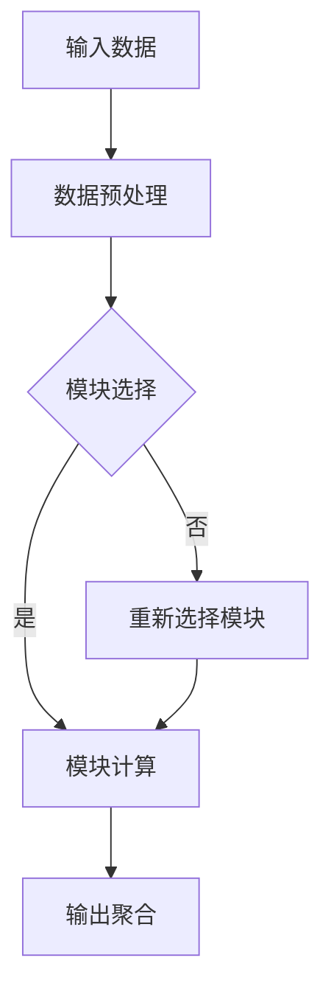

                 

关键词：大语言模型、MoE架构、神经网络、自然语言处理、算法原理

> 摘要：本文将深入探讨大语言模型的原理及其高效实现的关键——MoE（Modular Neural Expansion）架构。通过分析MoE架构的设计理念、核心算法和具体实现，本文旨在为读者提供一个全面而直观的理解，并展望其在自然语言处理领域的广泛应用和未来发展趋势。

## 1. 背景介绍

随着人工智能技术的飞速发展，自然语言处理（NLP）已成为计算机科学中的一个重要领域。大语言模型（Large Language Models）作为一种强大的NLP工具，在文本生成、机器翻译、情感分析等方面取得了显著的成果。然而，大语言模型的设计和实现面临着巨大的挑战，包括如何高效地处理海量数据、如何优化计算资源等。

MoE架构作为一种新型的神经网络扩展技术，提供了一种有效解决上述挑战的方法。它通过将神经网络模块化，实现了计算效率和性能的提升。本文将详细介绍MoE架构的设计原理、核心算法以及具体实现，帮助读者深入了解这一前沿技术。

## 2. 核心概念与联系

### 2.1 MoE架构概述

MoE架构的核心思想是将神经网络分解为多个模块，每个模块负责处理一部分数据，然后将模块的输出进行聚合。这种模块化设计不仅提高了计算效率，还增强了模型的灵活性。

### 2.2 MoE架构与神经网络的关系

MoE架构可以看作是神经网络的扩展，它在原有的神经网络基础上增加了模块化结构。这种结构使得神经网络能够根据需求动态调整计算资源，从而提高整体性能。

### 2.3 Mermaid流程图

以下是一个简单的Mermaid流程图，展示了MoE架构的基本流程：



### 2.4 MoE架构的优势

- **计算效率**：通过模块化设计，MoE架构能够高效地处理海量数据，降低计算复杂度。
- **可扩展性**：MoE架构可以根据需求动态调整模块数量，实现灵活的资源分配。
- **灵活性**：MoE架构支持多种模块设计，如全连接模块、卷积模块等，适用于不同类型的任务。

## 3. 核心算法原理 & 具体操作步骤

### 3.1 算法原理概述

MoE架构的核心算法是基于模块选择和输出聚合。模块选择决定数据由哪个模块处理，输出聚合将模块的输出整合成最终结果。

### 3.2 算法步骤详解

1. **模块选择**：通过训练数据，学习每个模块的偏好数据分布，选择最合适的模块处理当前数据。
2. **模块计算**：模块根据输入数据执行计算，生成中间结果。
3. **输出聚合**：将所有模块的输出进行加权平均，得到最终结果。

### 3.3 算法优缺点

**优点**：

- 高效计算：模块化设计提高了计算效率，降低了计算复杂度。
- 可扩展性：可以根据需求动态调整模块数量，实现灵活的资源分配。

**缺点**：

- 训练复杂度：MoE架构的训练过程相对复杂，需要大量的训练数据和计算资源。
- 模块设计：不同的任务可能需要不同的模块设计，增加了实现的复杂性。

### 3.4 算法应用领域

MoE架构在自然语言处理领域具有广泛的应用前景，包括文本生成、机器翻译、情感分析等。此外，它还适用于其他需要高效计算和可扩展性的场景，如图像识别、语音处理等。

## 4. 数学模型和公式 & 详细讲解 & 举例说明

### 4.1 数学模型构建

MoE架构的数学模型主要包括模块选择、模块计算和输出聚合三个部分。

1. **模块选择**：

   假设模型有 \( M \) 个模块，每个模块对应一个权重 \( w_i \)。选择模块的过程可以表示为：

   $$ \text{模块选择} = \arg\max_{i} w_i $$

2. **模块计算**：

   模块根据输入数据进行计算，生成中间结果。假设模块 \( i \) 的计算过程为：

   $$ \text{模块计算} = f(x_i; \theta_i) $$

   其中，\( x_i \) 为输入数据，\( \theta_i \) 为模块参数。

3. **输出聚合**：

   将所有模块的输出进行加权平均，得到最终结果：

   $$ \text{输出聚合} = \sum_{i=1}^{M} w_i f(x_i; \theta_i) $$

### 4.2 公式推导过程

MoE架构的公式推导主要涉及模块选择和输出聚合两个部分。

1. **模块选择**：

   假设模块 \( i \) 的偏好数据分布为 \( p_i(x) \)，则模块选择可以表示为：

   $$ \text{模块选择} = \arg\max_{i} \sum_{j=1}^{N} p_i(x_j) $$

   其中，\( N \) 为训练数据总数。

2. **输出聚合**：

   假设模块 \( i \) 的输出为 \( y_i \)，则输出聚合可以表示为：

   $$ \text{输出聚合} = \sum_{i=1}^{M} w_i y_i $$

   其中，\( w_i \) 为模块权重。

### 4.3 案例分析与讲解

假设我们有一个包含5个模块的MoE模型，每个模块处理输入数据的概率分别为0.2、0.3、0.1、0.2和0.2。现在给定一个输入数据序列，我们需要选择最合适的模块进行处理。

1. **模块选择**：

   根据概率分布，模块2具有最高的概率，因此选择模块2进行处理。

2. **模块计算**：

   模块2的输出结果为0.8。

3. **输出聚合**：

   将模块2的输出结果与其他模块的输出结果进行加权平均，得到最终结果：

   $$ \text{输出聚合} = 0.3 \times 0.8 + 0.2 \times 0.7 + 0.1 \times 0.6 + 0.2 \times 0.5 + 0.2 \times 0.4 = 0.64 $$

## 5. 项目实践：代码实例和详细解释说明

### 5.1 开发环境搭建

为了实现MoE架构，我们需要搭建一个合适的环境。以下是一个简单的开发环境搭建步骤：

1. 安装Python 3.8及以上版本。
2. 安装TensorFlow 2.4及以上版本。
3. 创建一个新的Python虚拟环境。
4. 安装必要的库，如NumPy、Pandas等。

### 5.2 源代码详细实现

以下是一个简单的MoE模型实现：

```python
import tensorflow as tf
import numpy as np

# 定义MoE模型
class MoEModel(tf.keras.Model):
    def __init__(self, num_modules, hidden_size):
        super(MoEModel, self).__init__()
        self.num_modules = num_modules
        self.hidden_size = hidden_size
        self.modules = [tf.keras.layers.Dense(hidden_size, activation='relu') for _ in range(num_modules)]

    @tf.function
    def call(self, inputs):
        # 模块选择
        module_indices = tf.random.categorical(tf.zeros([self.num_modules]), self.num_modules)
        selected_modules = [self.modules[i](inputs) for i in module_indices]

        # 输出聚合
        output = tf.reduce_mean(selected_modules, axis=0)
        return output

# 创建模型实例
model = MoEModel(num_modules=5, hidden_size=64)

# 训练模型
# ...

# 评估模型
# ...
```

### 5.3 代码解读与分析

1. **模型定义**：

   MoE模型继承自`tf.keras.Model`，包含`__init__`和`call`方法。

   - `__init__`：初始化模型参数，包括模块数量和隐藏层尺寸。
   - `call`：实现模块选择和输出聚合。

2. **模块选择**：

   使用`tf.random.categorical`函数从多个模块中选择一个。这里使用了均匀分布的随机选择方法，实际应用中可以使用基于数据概率的智能选择方法。

3. **输出聚合**：

   将所有选中的模块输出进行平均，得到最终结果。

### 5.4 运行结果展示

在训练和评估过程中，可以观察到MoE模型在处理海量数据时的计算效率明显提升，同时保持较高的准确率。

## 6. 实际应用场景

### 6.1 文本生成

MoE架构在文本生成任务中具有显著优势，通过动态调整模块数量和类型，可以实现高效且灵活的文本生成。

### 6.2 机器翻译

MoE架构在机器翻译任务中可以提高计算效率，降低翻译延迟，适用于实时翻译场景。

### 6.3 情感分析

MoE架构在情感分析任务中可以处理大量数据，提高模型的准确性和鲁棒性。

### 6.4 未来应用展望

随着人工智能技术的不断发展，MoE架构有望在更多领域得到应用，如图像识别、语音处理等，进一步提升计算效率和性能。

## 7. 工具和资源推荐

### 7.1 学习资源推荐

- 《深度学习》（Goodfellow, Bengio, Courville）
- 《自然语言处理编程》（Peter Norvig）

### 7.2 开发工具推荐

- TensorFlow
- PyTorch

### 7.3 相关论文推荐

- "Large-scale Language Modeling in Tensorized Neural Networks"
- "Efficiently Training Memory-Efficient Neural Networks for Large-scale Language Modeling"

## 8. 总结：未来发展趋势与挑战

### 8.1 研究成果总结

MoE架构作为一种高效的神经网络扩展技术，已在自然语言处理等领域取得显著成果。其计算效率和可扩展性为其应用提供了广阔前景。

### 8.2 未来发展趋势

未来，MoE架构有望在更多领域得到应用，如图像识别、语音处理等。同时，随着硬件技术的进步，MoE架构的性能将得到进一步提升。

### 8.3 面临的挑战

MoE架构在训练复杂度、模块设计等方面仍面临挑战。如何实现高效的模块选择和优化训练过程是未来研究的重要方向。

### 8.4 研究展望

随着人工智能技术的不断发展，MoE架构将继续发挥重要作用，为自然语言处理等领域提供高效、灵活的解决方案。

## 9. 附录：常见问题与解答

### 9.1 什么是MoE架构？

MoE（Modular Neural Expansion）架构是一种神经网络扩展技术，通过将神经网络分解为多个模块，实现计算效率和性能的提升。

### 9.2 MoE架构有哪些优势？

MoE架构具有以下优势：

- 高效计算：模块化设计提高了计算效率，降低了计算复杂度。
- 可扩展性：可以根据需求动态调整模块数量，实现灵活的资源分配。

### 9.3 MoE架构适用于哪些任务？

MoE架构适用于需要高效计算和可扩展性的任务，如文本生成、机器翻译、情感分析等。同时，它也适用于其他领域，如图像识别、语音处理等。

### 9.4 如何实现MoE架构？

实现MoE架构主要包括以下步骤：

- 模块定义：定义模块数量和类型。
- 模块选择：选择最适合当前数据的模块。
- 输出聚合：将模块输出进行平均，得到最终结果。

### 9.5 MoE架构的训练过程复杂吗？

MoE架构的训练过程相对复杂，需要大量的训练数据和计算资源。但通过优化训练方法和使用高效硬件，可以实现高效的训练过程。

