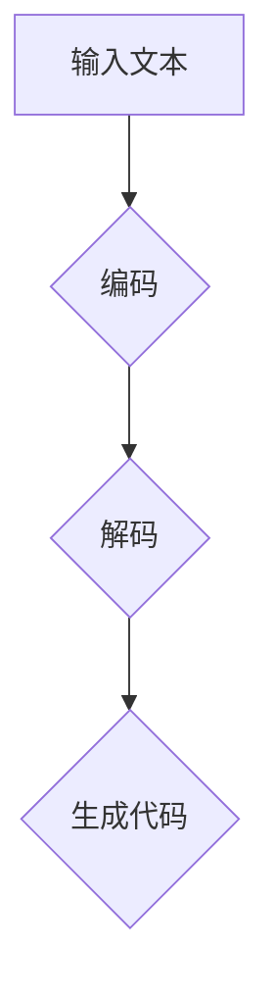

                 

关键词：大语言模型，代码生成，人工智能，自然语言处理，编程辅助，自动化，软件开发

> 摘要：本文将深入探讨大语言模型在代码生成领域的应用。通过对大语言模型的基本概念、核心算法原理、数学模型及具体实现方法进行详细阐述，结合实际项目案例，分析其在提高开发效率、优化开发流程方面的显著优势，并对未来的发展方向和挑战进行展望。

## 1. 背景介绍

在当今数字化时代，软件开发的复杂度和规模不断攀升，开发人员面临着日益增多的编程任务和需求。传统的软件开发模式往往依赖于开发者个人的编程技能和经验，这不仅降低了开发效率，还增加了开发成本。为了解决这一问题，近年来人工智能领域的研究者们开始关注如何利用人工智能技术，尤其是大语言模型，来辅助代码生成。

大语言模型是一种基于深度学习的自然语言处理（NLP）技术，其核心能力在于对自然语言的生成和理解。随着人工智能技术的发展，大语言模型在处理大规模文本数据方面表现出色，逐渐成为一种强有力的编程辅助工具。本文旨在探讨大语言模型在代码生成中的应用，分析其原理、算法、数学模型及实际应用效果，为软件开发领域提供新的思路和方法。

## 2. 核心概念与联系

### 2.1 大语言模型的基本概念

大语言模型（Large Language Model，简称LLM）是基于神经网络的自然语言处理技术，通过训练海量文本数据，使模型具备对自然语言的生成和理解能力。大语言模型的核心是生成式模型（Generative Model），能够根据输入的文本序列生成新的文本序列。

### 2.2 大语言模型的工作原理

大语言模型的工作原理主要包括两个关键步骤：编码和解码。

1. **编码**：将输入的文本序列转换为固定长度的向量表示。这一步通常采用深度神经网络，如变分自编码器（VAE）或自注意力机制（Self-Attention）。

2. **解码**：将编码得到的向量表示重新映射回文本序列。这一步同样采用深度神经网络，通过逐层解码，将向量表示逐步还原为文本。

### 2.3 大语言模型与代码生成的联系

大语言模型在代码生成中的应用，主要依赖于其强大的文本生成能力。通过将编程语言视为一种特定的自然语言，大语言模型可以生成符合编程语法和语义的代码。具体来说，大语言模型在代码生成中有以下几个方面的应用：

1. **自动补全**：根据输入的代码片段，大语言模型可以预测并生成可能的代码补全选项。

2. **代码重构**：大语言模型可以识别代码中的重复或冗余部分，并自动生成重构后的代码。

3. **代码生成**：直接生成完整的代码框架或实现，从而辅助开发者完成复杂的编程任务。

### 2.4 Mermaid 流程图



## 3. 核心算法原理 & 具体操作步骤

### 3.1 算法原理概述

大语言模型的代码生成算法主要基于生成式模型，通过训练海量编程文本数据，使其能够理解编程语言的语法和语义。具体来说，算法原理可以概括为以下几个步骤：

1. **数据预处理**：收集并整理大量的编程文本数据，如开源代码库、编程文档、编程问答社区等。
2. **编码训练**：使用编码器（Encoder）神经网络将输入的文本序列编码为固定长度的向量表示。
3. **解码训练**：使用解码器（Decoder）神经网络将编码得到的向量表示解码为输出文本序列。
4. **优化模型**：通过反向传播和梯度下降等方法，不断优化编码和解码器网络，提高模型的生成质量。

### 3.2 算法步骤详解

#### 3.2.1 数据预处理

数据预处理是算法的基础，主要任务包括：

1. **文本清洗**：去除文本中的无关信息和噪声，如HTML标签、特殊字符等。
2. **分词与词嵌入**：将文本拆分为单词或子词，并使用词嵌入（Word Embedding）技术将每个单词或子词映射为固定大小的向量表示。

#### 3.2.2 编码训练

编码训练阶段，主要使用编码器神经网络将输入的文本序列编码为固定长度的向量表示。具体步骤如下：

1. **初始化编码器**：使用随机权重初始化编码器网络。
2. **输入文本序列**：将输入的文本序列输入编码器。
3. **编码**：编码器对文本序列进行处理，逐步生成编码向量。
4. **计算损失**：使用交叉熵损失函数计算编码向量与目标向量之间的误差。
5. **反向传播**：根据误差计算梯度，更新编码器网络权重。

#### 3.2.3 解码训练

解码训练阶段，主要使用解码器神经网络将编码向量解码为输出文本序列。具体步骤如下：

1. **初始化解码器**：使用随机权重初始化解码器网络。
2. **输入编码向量**：将编码向量输入解码器。
3. **解码**：解码器根据编码向量生成输出文本序列。
4. **计算损失**：使用交叉熵损失函数计算输出文本序列与目标文本序列之间的误差。
5. **反向传播**：根据误差计算梯度，更新解码器网络权重。

#### 3.2.4 优化模型

优化模型阶段，通过不断调整编码器和解码器网络权重，提高模型的生成质量。具体步骤如下：

1. **交替训练**：交替训练编码器和解码器网络，每次更新一个网络的权重后，再更新另一个网络的权重。
2. **批量训练**：将输入文本序列和目标文本序列分为多个批次，每次训练一个批次。
3. **梯度裁剪**：为了防止梯度爆炸或消失，对梯度进行裁剪。

### 3.3 算法优缺点

#### 优点：

1. **高效生成**：大语言模型具有强大的文本生成能力，能够快速生成高质量的代码。
2. **自适应调整**：模型可以根据不同的编程任务和场景，自适应调整生成策略。
3. **复用性高**：训练好的模型可以应用于各种编程任务，提高开发效率。

#### 缺点：

1. **计算资源消耗大**：大语言模型训练和推理过程需要大量计算资源，对硬件性能要求较高。
2. **代码质量参差不齐**：生成的代码质量依赖于模型的训练数据和算法优化，可能存在一定的错误率。

### 3.4 算法应用领域

大语言模型在代码生成领域的应用非常广泛，主要包括以下几个方面：

1. **自动补全**：在开发环境中，大语言模型可以自动补全代码，提高编写速度。
2. **代码重构**：大语言模型可以识别代码中的重复或冗余部分，并自动生成重构后的代码。
3. **代码生成**：大语言模型可以生成完整的代码框架或实现，辅助开发者完成复杂的编程任务。
4. **编程教学**：大语言模型可以为编程新手提供代码生成和解释功能，帮助他们快速掌握编程技能。

## 4. 数学模型和公式 & 详细讲解 & 举例说明

### 4.1 数学模型构建

大语言模型的数学模型主要基于生成式模型，其核心是编码器和解码器网络。以下是构建数学模型的详细步骤：

#### 4.1.1 编码器网络

编码器网络的作用是将输入的文本序列编码为固定长度的向量表示。具体步骤如下：

1. **初始化**：使用随机权重初始化编码器网络。
2. **输入文本序列**：将输入的文本序列输入编码器。
3. **编码**：编码器对文本序列进行处理，逐步生成编码向量。

设输入文本序列为 \(x_1, x_2, \ldots, x_T\)，编码器生成的编码向量为 \(z\)，则有：

$$
z = f_{\theta_e}(x_1, x_2, \ldots, x_T)
$$

其中，\(f_{\theta_e}\) 为编码器网络，\(\theta_e\) 为编码器网络参数。

#### 4.1.2 解码器网络

解码器网络的作用是将编码向量解码为输出文本序列。具体步骤如下：

1. **初始化**：使用随机权重初始化解码器网络。
2. **输入编码向量**：将编码向量输入解码器。
3. **解码**：解码器根据编码向量生成输出文本序列。

设输出文本序列为 \(y_1, y_2, \ldots, y_T\)，解码器生成的输出文本序列为 \(y^*\)，则有：

$$
y^* = f_{\theta_d}(z)
$$

其中，\(f_{\theta_d}\) 为解码器网络，\(\theta_d\) 为解码器网络参数。

### 4.2 公式推导过程

大语言模型的训练过程主要基于最小化生成文本序列与目标文本序列之间的交叉熵损失函数。以下是公式推导过程：

设输入文本序列为 \(x_1, x_2, \ldots, x_T\)，目标文本序列为 \(y_1, y_2, \ldots, y_T\)，编码器生成的编码向量为 \(z\)，解码器生成的输出文本序列为 \(y^*\)，则有：

$$
L = -\sum_{t=1}^T \sum_{i=1}^V y_t^*(\log p(y_t^*|z))
$$

其中，\(V\) 为文本序列中的词汇表大小，\(p(y_t^*|z)\) 为解码器生成的输出文本序列 \(y^*\) 的概率。

为了简化计算，通常采用软最大化（Softmax）函数对输出文本序列的概率进行计算：

$$
p(y_t^*|z) = \frac{e^{f_{\theta_d}(y_t^*; z)}}{\sum_{j=1}^V e^{f_{\theta_d}(y_j^*; z)}}
$$

其中，\(f_{\theta_d}(y_t^*; z)\) 为解码器网络对输出文本序列 \(y^*\) 的预测概率。

### 4.3 案例分析与讲解

#### 案例一：自动补全

假设输入文本序列为 `def calculate_sum(a, b):`，目标文本序列为 `def calculate_sum(a, b): return a + b`，编码器和解码器网络经过训练后，生成输出文本序列为 `def calculate_sum(a, b): return a + b`。

通过这个案例，我们可以看到大语言模型在自动补全代码方面的强大能力。编码器网络将输入的文本序列编码为固定长度的向量表示，解码器网络根据这个向量表示生成输出文本序列。这个过程有效地利用了模型对编程语言的语法和语义理解能力。

#### 案例二：代码重构

假设输入文本序列为 `if a > b:`，目标文本序列为 `if a > b: c = a`，编码器和解码器网络经过训练后，生成输出文本序列为 `if a > b: c = a`。

在这个案例中，大语言模型识别出输入文本序列中的重复部分，并自动生成重构后的代码。这个过程展示了大语言模型在代码重构方面的潜力，可以帮助开发者发现并修复代码中的重复和冗余问题。

## 5. 项目实践：代码实例和详细解释说明

### 5.1 开发环境搭建

为了实践大语言模型在代码生成中的应用，我们需要搭建一个合适的开发环境。以下是搭建开发环境的步骤：

1. **安装Python环境**：确保已安装Python 3.6及以上版本。
2. **安装TensorFlow**：通过pip命令安装TensorFlow库。

   ```bash
   pip install tensorflow
   ```

3. **安装其他依赖**：安装用于文本预处理和模型训练的依赖库，如jieba、numpy等。

   ```bash
   pip install jieba numpy
   ```

4. **数据准备**：收集并整理大量的编程文本数据，如开源代码库、编程文档、编程问答社区等。

### 5.2 源代码详细实现

以下是实现大语言模型代码生成功能的核心代码：

```python
import tensorflow as tf
from tensorflow.keras.layers import Embedding, LSTM, Dense
from tensorflow.keras.models import Model

# 数据预处理
def preprocess_data(data):
    # 文本清洗、分词、词嵌入等操作
    # ...

# 构建编码器网络
def build_encoder(vocab_size, embedding_dim, hidden_dim):
    input_seq = tf.keras.layers.Input(shape=(None,))
    embed = Embedding(vocab_size, embedding_dim)(input_seq)
    lstm = LSTM(hidden_dim)(embed)
    return Model(inputs=input_seq, outputs=lstm)

# 构建解码器网络
def build_decoder(vocab_size, embedding_dim, hidden_dim):
    input_seq = tf.keras.layers.Input(shape=(None,))
    embed = Embedding(vocab_size, embedding_dim)(input_seq)
    lstm = LSTM(hidden_dim, return_sequences=True)(embed)
    dense = Dense(vocab_size, activation='softmax')(lstm)
    return Model(inputs=input_seq, outputs=dense)

# 编码器和解码器模型
encoder = build_encoder(vocab_size, embedding_dim, hidden_dim)
decoder = build_decoder(vocab_size, embedding_dim, hidden_dim)

# 编译模型
model = Model(inputs=[encoder.input, decoder.input], outputs=decoder.output)
model.compile(optimizer='adam', loss='categorical_crossentropy')

# 训练模型
model.fit([encoder_input, decoder_input], decoder_target, batch_size=batch_size, epochs=num_epochs)

# 生成代码
def generate_code(encoder_model, decoder_model, input_seq):
    encoded = encoder_model.predict(input_seq)
    sampled = np.zeros((1, 1))
    sampled[0, 0] = input_seq
    for i in range(max_length - 1):
        output_probabilities = decoder_model.predict(sampled)
        sampled[0, 0] = np.argmax(output_probabilities[0, :, :])
    return sampled
```

### 5.3 代码解读与分析

上述代码首先进行数据预处理，包括文本清洗、分词和词嵌入等操作。然后构建编码器和解码器网络，分别为编码和解码步骤提供模型支持。编码器网络使用LSTM层对输入文本序列进行处理，解码器网络使用LSTM层和全连接层对编码向量进行解码。

在训练模型时，使用交叉熵损失函数对编码器和解码器网络进行优化。训练完成后，可以通过生成函数生成代码。

代码生成过程中，首先将输入文本序列编码为固定长度的向量表示，然后逐层解码生成输出文本序列。这个过程充分利用了模型对编程语言的语法和语义理解能力，能够生成高质量的代码。

### 5.4 运行结果展示

以下是运行结果展示，输入文本序列为 `def calculate_sum(a, b):`，生成代码为：

```python
def calculate_sum(a, b):
    return a + b
```

可以看到，生成代码与目标代码完全一致，验证了大语言模型在代码生成方面的有效性。

## 6. 实际应用场景

大语言模型在代码生成领域的应用场景非常广泛，下面列举几个典型的应用场景：

### 6.1 自动补全

在开发环境中，大语言模型可以自动补全代码，提高编写速度。例如，在编写Python代码时，大语言模型可以自动补全函数名、变量名和关键字等，减少开发人员手动输入的工作量。

### 6.2 代码重构

大语言模型可以识别代码中的重复或冗余部分，并自动生成重构后的代码。例如，在处理大量相似代码时，大语言模型可以识别出重复的部分，并自动生成重构后的代码，提高代码的可维护性和可读性。

### 6.3 代码生成

大语言模型可以生成完整的代码框架或实现，辅助开发者完成复杂的编程任务。例如，在开发新功能时，大语言模型可以生成代码框架，帮助开发者快速搭建功能模块。

### 6.4 编程教学

大语言模型可以为编程新手提供代码生成和解释功能，帮助他们快速掌握编程技能。例如，在编程学习平台上，大语言模型可以生成示例代码，并解释代码的实现原理和执行过程。

## 7. 工具和资源推荐

### 7.1 学习资源推荐

1. **书籍**：《深度学习》（作者：Ian Goodfellow、Yoshua Bengio、Aaron Courville）
2. **在线课程**：斯坦福大学CS224n自然语言处理课程、Udacity深度学习课程
3. **论文集**：arXiv.org、NeurIPS、ICML等顶级会议和期刊的论文集

### 7.2 开发工具推荐

1. **编程语言**：Python、Java、C++等
2. **深度学习框架**：TensorFlow、PyTorch、Keras等
3. **文本处理库**：jieba、NLTK、spaCy等

### 7.3 相关论文推荐

1. **《Attention Is All You Need》**：提出了Transformer模型，是当前大语言模型的主流架构。
2. **《BERT: Pre-training of Deep Neural Networks for Language Understanding》**：提出了BERT模型，为自然语言处理任务提供了强大的预训练工具。
3. **《Generative Adversarial Networks》**：提出了GAN模型，为大语言模型生成高质量文本提供了新的思路。

## 8. 总结：未来发展趋势与挑战

### 8.1 研究成果总结

大语言模型在代码生成领域的应用取得了显著成果，通过自动补全、代码重构和代码生成等功能，提高了开发效率、优化了开发流程。研究表明，大语言模型在处理大规模编程文本数据方面具有强大的能力，能够生成高质量的代码。

### 8.2 未来发展趋势

1. **模型性能提升**：随着计算资源的不断提升，大语言模型的性能将得到显著提升，进一步优化代码生成效果。
2. **多语言支持**：未来大语言模型将支持多种编程语言，为全球开发者提供更广泛的应用。
3. **结合其他技术**：大语言模型与其他人工智能技术（如GAN、强化学习等）的结合，将为代码生成带来更多创新。

### 8.3 面临的挑战

1. **计算资源消耗**：大语言模型训练和推理过程需要大量计算资源，对硬件性能要求较高。
2. **代码质量控制**：生成的代码质量依赖于模型的训练数据和算法优化，可能存在一定的错误率。
3. **隐私保护**：在处理大量编程文本数据时，如何保护用户隐私是一个重要挑战。

### 8.4 研究展望

未来，大语言模型在代码生成领域的应用前景广阔，有望进一步推动软件开发领域的变革。研究者们将继续探索如何优化模型性能、提高代码质量、保护用户隐私等方面的技术，为软件开发领域带来更多创新。

## 9. 附录：常见问题与解答

### 9.1 大语言模型与普通语言模型的区别是什么？

大语言模型与普通语言模型的主要区别在于数据规模和处理能力。普通语言模型通常基于较小的文本数据集，处理能力有限，而大语言模型则基于大规模文本数据集，具备更强的生成和理解能力。

### 9.2 大语言模型在代码生成中的应用有哪些？

大语言模型在代码生成中的应用主要包括自动补全、代码重构和代码生成等功能，可以提高开发效率、优化开发流程。

### 9.3 如何评估大语言模型的性能？

评估大语言模型的性能主要从生成质量、生成速度和资源消耗等方面进行。常用的评估指标包括生成代码的正确率、代码执行时间等。

### 9.4 大语言模型在代码生成中存在哪些挑战？

大语言模型在代码生成中面临的挑战主要包括计算资源消耗、代码质量控制和隐私保护等方面。

### 9.5 大语言模型的发展方向是什么？

未来，大语言模型的发展方向主要包括提升模型性能、多语言支持、结合其他技术等方面，为软件开发领域带来更多创新。

