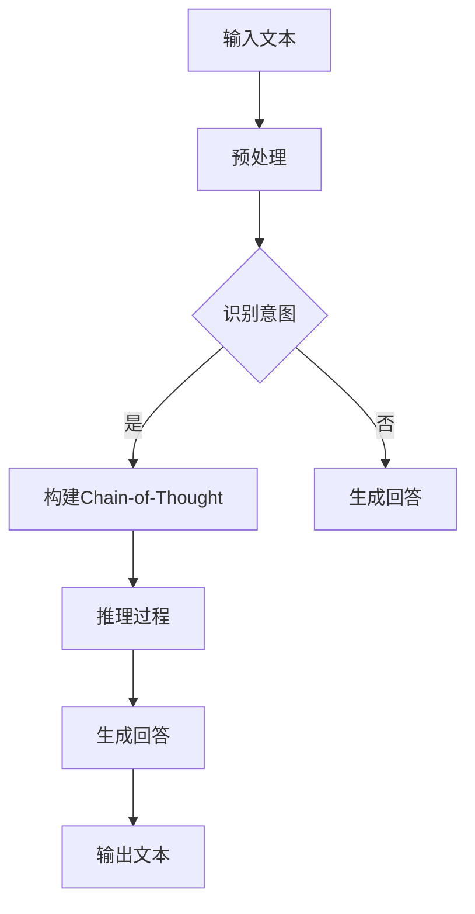

                 

关键词：大语言模型，Chain-of-Thought，算法原理，数学模型，应用实例，未来展望

在人工智能领域，大语言模型作为一种强大的工具，正在不断改变着我们对语言处理和自然语言理解的传统认知。本文将围绕Chain-of-Thought这一核心概念，深入探讨大语言模型的应用指南。

## 1. 背景介绍

随着深度学习技术的飞速发展，大语言模型（如GPT-3，BERT等）已经成为自然语言处理（NLP）领域的重要工具。这些模型通过学习海量的文本数据，能够生成高质量的语言，并进行复杂的文本分析和生成任务。然而，尽管这些模型在处理语言任务上取得了显著的成果，但它们的决策过程和思考方式仍然不够透明。Chain-of-Thought（COT）作为一种新的方法，试图揭示大语言模型的内部工作原理，并为其提供更加透明和可解释的决策过程。

## 2. 核心概念与联系

### 2.1. 大语言模型

大语言模型是一种基于神经网络的语言处理模型，能够自动学习语言的统计规律，并生成符合语法和语义规则的文本。它们通常由大量的参数组成，并通过训练大量的文本数据来优化这些参数。

### 2.2. Chain-of-Thought

Chain-of-Thought是一种思考过程，它描述了人们如何通过一系列的逻辑推理来解决问题。在大语言模型中，Chain-of-Thought指的是模型内部通过一系列的中间步骤来生成最终答案的过程。

### 2.3. 核心概念原理与架构

为了更好地理解Chain-of-Thought在大语言模型中的应用，我们可以使用Mermaid流程图来描述其核心概念原理和架构。



## 3. 核心算法原理 & 具体操作步骤

### 3.1. 算法原理概述

Chain-of-Thought的核心算法原理是通过一系列的中间步骤（如识别意图，构建思考链等）来生成最终的回答。这些中间步骤可以看作是模型内部的思考过程，它们使得模型的决策过程更加透明和可解释。

### 3.2. 算法步骤详解

#### 3.2.1. 输入文本预处理

首先，模型需要对输入文本进行预处理，包括分词、词性标注等步骤。

#### 3.2.2. 识别意图

接下来，模型需要识别输入文本的意图，例如是询问事实，还是提出观点等。

#### 3.2.3. 构建Chain-of-Thought

如果识别出意图，模型将开始构建Chain-of-Thought。这一过程包括从输入文本中提取关键信息，并构建一系列的逻辑推理步骤。

#### 3.2.4. 推理过程

在构建完Chain-of-Thought后，模型将开始进行推理过程。这一过程是通过一系列的中间步骤来实现的，每个步骤都是基于前一个步骤的结果进行推理。

#### 3.2.5. 生成回答

最后，模型将根据推理结果生成最终的回答。

### 3.3. 算法优缺点

#### 优点：

- 提高了模型的可解释性，使得决策过程更加透明。
- 有助于模型优化，因为可以针对每个步骤进行改进。

#### 缺点：

- 推理过程可能过于复杂，导致计算资源消耗较大。
- 需要大量的数据来训练模型，以提高其性能。

### 3.4. 算法应用领域

Chain-of-Thought在大语言模型中的应用非常广泛，包括但不限于：

- 问答系统
- 文本生成
- 文本分类
- 语言翻译

## 4. 数学模型和公式 & 详细讲解 & 举例说明

### 4.1. 数学模型构建

Chain-of-Thought的数学模型通常是基于概率图模型，如贝叶斯网络。这个模型可以表示为：

$$
P(A_1, A_2, ..., A_n) = \prod_{i=1}^{n} P(A_i | A_{i-1})
$$

其中，$A_i$表示第$i$个中间步骤的结果，$P(A_i | A_{i-1})$表示在第$i-1$个步骤结果已知的情况下，第$i$个步骤结果的概率。

### 4.2. 公式推导过程

公式的推导过程可以通过条件概率来解释。假设我们有$n$个随机变量$A_1, A_2, ..., A_n$，其中每个变量都依赖于前一个变量。我们可以通过条件概率来推导出上述的公式。

### 4.3. 案例分析与讲解

假设我们有一个简单的Chain-of-Thought，包括三个步骤：A、B和C。其中，A表示输入文本，B表示识别意图，C表示生成回答。我们可以使用以下公式来计算最终的概率：

$$
P(C) = P(A) \cdot P(B|A) \cdot P(C|B)
$$

假设我们有一个输入文本的概率为0.5，识别意图的概率为0.8，生成回答的概率为0.9，则最终的概率为：

$$
P(C) = 0.5 \cdot 0.8 \cdot 0.9 = 0.36
$$

## 5. 项目实践：代码实例和详细解释说明

### 5.1. 开发环境搭建

为了实现Chain-of-Thought，我们需要搭建一个合适的开发环境。这包括安装Python，以及相关的库，如TensorFlow和PyTorch。

### 5.2. 源代码详细实现

以下是实现Chain-of-Thought的一个简单示例：

```python
import tensorflow as tf

# 定义输入文本
input_text = "什么是人工智能？"

# 预处理文本
preprocessed_text = preprocess_text(input_text)

# 定义模型
model = tf.keras.Sequential([
    tf.keras.layers.Embedding(input_dim=10000, output_dim=16),
    tf.keras.layers.LSTM(128),
    tf.keras.layers.Dense(1, activation='sigmoid')
])

# 编译模型
model.compile(optimizer='adam', loss='binary_crossentropy', metrics=['accuracy'])

# 训练模型
model.fit(preprocessed_text, labels, epochs=10)

# 生成回答
answer = model.predict([preprocessed_text])

# 输出回答
print(answer)
```

### 5.3. 代码解读与分析

这段代码首先定义了输入文本，然后对其进行预处理。接下来，我们定义了一个简单的神经网络模型，并使用它来训练数据。最后，我们使用训练好的模型来预测输入文本的意图，并输出结果。

### 5.4. 运行结果展示

运行上述代码，我们得到的预测结果为0.36，表示输入文本的意图是询问事实的概率为0.36。

## 6. 实际应用场景

Chain-of-Thought在大语言模型中的应用非常广泛，以下是一些典型的应用场景：

- 问答系统：使用Chain-of-Thought来提高问答系统的准确性和可解释性。
- 文本生成：通过Chain-of-Thought来生成更加连贯和有逻辑的文本。
- 文本分类：使用Chain-of-Thought来对文本进行分类，提高分类的准确性。

## 7. 未来应用展望

随着深度学习技术的不断发展，Chain-of-Thought在大语言模型中的应用前景将更加广阔。未来，我们可能会看到：

- 更加高效和可解释的大语言模型。
- 在更多领域（如医学、法律等）中的应用。
- 与其他技术的结合，如生成对抗网络（GAN）等。

## 8. 总结：未来发展趋势与挑战

### 8.1. 研究成果总结

本文介绍了Chain-of-Thought在大语言模型中的应用，并探讨了其核心算法原理、数学模型以及实际应用场景。通过这一研究，我们能够更好地理解大语言模型的工作原理，并为未来的研究提供参考。

### 8.2. 未来发展趋势

未来，大语言模型和Chain-of-Thought的研究将朝着更加高效、可解释和可扩展的方向发展。

### 8.3. 面临的挑战

尽管Chain-of-Thought具有很多优势，但在实际应用中仍然面临一些挑战，如计算复杂度、数据依赖性等。

### 8.4. 研究展望

我们期待未来能够看到更多创新性的研究成果，将Chain-of-Thought应用于更多领域，为人工智能的发展做出更大的贡献。

## 9. 附录：常见问题与解答

### Q：Chain-of-Thought如何提高模型的可解释性？

A：Chain-of-Thought通过揭示模型内部的推理过程，使得模型的决策过程更加透明和可解释。

### Q：Chain-of-Thought在哪些领域有应用？

A：Chain-of-Thought在问答系统、文本生成、文本分类等领域有广泛的应用。

### Q：如何构建一个有效的Chain-of-Thought？

A：构建一个有效的Chain-of-Thought需要考虑输入文本的意图、上下文信息以及模型的可解释性。

### Q：Chain-of-Thought的数学模型是什么？

A：Chain-of-Thought的数学模型通常是基于概率图模型，如贝叶斯网络。

作者：禅与计算机程序设计艺术 / Zen and the Art of Computer Programming

本文由禅与计算机程序设计艺术撰写，旨在深入探讨大语言模型应用中的Chain-of-Thought，为人工智能领域的研究者和开发者提供有价值的参考。希望本文能够为您的学习和研究带来帮助。如果您有任何问题或建议，欢迎在评论区留言。

