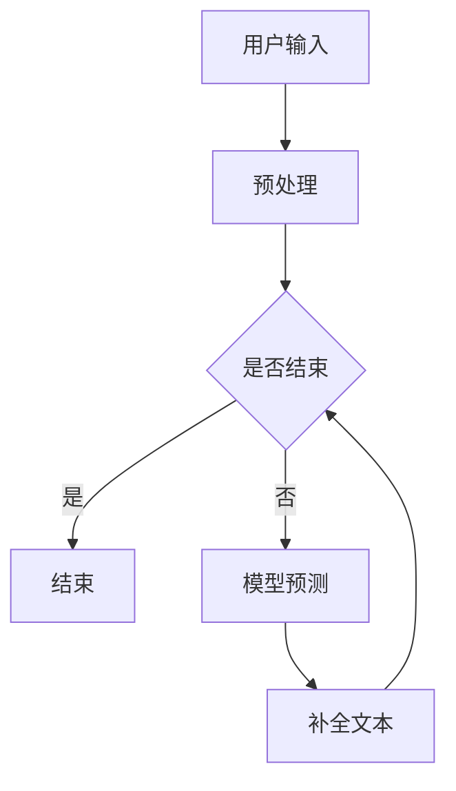

                 

关键词：大语言模型，Completion交互，NLP，深度学习，交互设计

> 摘要：本文深入探讨了大语言模型在Completion交互格式中的应用，从核心概念、算法原理到实践案例，全面解析了如何构建和优化大语言模型，以实现高效、智能的交互体验。文章旨在为开发者提供全面的指导和实战经验，助力他们在实际项目中运用大语言模型，提升产品的智能化水平。

## 1. 背景介绍

在人工智能和自然语言处理领域，大语言模型（Large Language Models）已经成为研究和应用的热点。大语言模型通过深度学习技术，从海量文本数据中学习语言规律，能够生成高质量的自然语言文本，并在各种应用场景中展现出强大的能力。这些应用场景包括但不限于机器翻译、文本摘要、问答系统、对话生成等。

Completion交互格式是一种常用的交互模式，它允许用户在输入文本中通过点击、键入或其他方式补充部分信息。这种交互方式在即时通信、搜索引擎、智能助手等场景中广泛应用。大语言模型结合Completion交互格式，可以显著提升用户的交互体验和系统的智能化程度。

本文将重点探讨大语言模型在Completion交互格式中的应用，从以下几个方面展开：

1. **核心概念与联系**：介绍大语言模型和Completion交互格式的基本概念，阐述它们之间的联系。
2. **核心算法原理 & 具体操作步骤**：详细解释大语言模型的算法原理和操作步骤，包括数据预处理、模型训练、优化和评估。
3. **数学模型和公式 & 详细讲解 & 举例说明**：讲解大语言模型的数学基础，包括损失函数、优化算法等，并举例说明。
4. **项目实践：代码实例和详细解释说明**：通过一个实际项目，展示大语言模型在Completion交互格式中的实现和应用。
5. **实际应用场景**：分析大语言模型在不同应用场景中的具体实现和效果。
6. **工具和资源推荐**：推荐相关学习资源和开发工具，帮助读者深入了解和实践大语言模型。
7. **总结：未来发展趋势与挑战**：总结研究成果，展望未来发展趋势和面临的挑战。

## 2. 核心概念与联系

### 2.1 大语言模型

大语言模型（Large Language Model，简称LLM）是一种基于深度学习的自然语言处理模型。它通过大规模的文本数据进行预训练，学习到语言的复杂结构和语义信息，从而具备生成、理解和处理自然语言的能力。大语言模型的核心思想是通过无监督学习方式，从海量数据中学习语言的特征和模式，为后续的监督学习任务提供强大的先验知识。

### 2.2 Completion交互格式

Completion交互格式（Completion-based Interaction Format）是一种用户输入部分文本，系统根据上下文和模型预测自动补全剩余内容的交互方式。这种交互方式常见于即时通讯应用、智能助手和问答系统。通过Completion交互格式，用户可以更自然地与系统进行交互，减少输入成本，提高沟通效率。

### 2.3 大语言模型与Completion交互格式的联系

大语言模型和Completion交互格式在自然语言处理和交互设计中具有紧密的联系。大语言模型为Completion交互格式提供了强大的技术支持，使得系统能够根据上下文和用户输入的提示，智能地补全文本信息。具体来说，大语言模型在Completion交互格式中的应用主要体现在以下几个方面：

1. **文本补全**：大语言模型可以根据用户输入的文本片段，预测并补全剩余的文本内容，提供流畅、自然的交互体验。
2. **语义理解**：大语言模型通过理解用户的输入意图和上下文，能够更准确地补全文本信息，提高交互的准确性。
3. **个性化和适应性**：大语言模型可以根据用户的偏好和历史交互数据，提供个性化的补全建议，提升用户的满意度和体验。

### 2.4 Mermaid流程图

下面是一个简单的Mermaid流程图，展示了大语言模型在Completion交互格式中的应用流程：



### 2.5 总结

在本节中，我们介绍了大语言模型和Completion交互格式的基本概念，并阐述了它们之间的联系。在接下来的章节中，我们将深入探讨大语言模型的算法原理、数学模型以及实际应用，帮助读者全面了解和掌握这一前沿技术。

## 3. 核心算法原理 & 具体操作步骤

### 3.1 算法原理概述

大语言模型的核心算法基于深度学习中的自注意力机制（Self-Attention）和变换器架构（Transformer）。变换器是一种强大的神经网络结构，通过多头自注意力机制和前馈神经网络，能够捕捉输入文本中的长距离依赖关系和语义信息。自注意力机制允许模型在处理每个词时，自动关注与它相关的其他词，从而提高对全局信息的理解和利用。

大语言模型的训练过程通常包括以下步骤：

1. **数据预处理**：将原始文本数据清洗、分词、编码，并转换为模型可以处理的输入格式。
2. **模型初始化**：初始化变换器模型的权重和参数。
3. **前向传播**：将输入数据通过变换器模型，计算输出。
4. **损失函数计算**：使用损失函数（如交叉熵损失函数）计算预测结果和真实标签之间的差距。
5. **反向传播**：通过反向传播算法，更新模型参数，以减少损失函数的值。
6. **模型优化**：迭代训练过程，直至达到预设的训练目标或模型性能不再提升。

### 3.2 算法步骤详解

下面，我们详细讲解大语言模型的训练和预测过程：

#### 3.2.1 数据预处理

数据预处理是训练大语言模型的第一步。具体步骤如下：

1. **文本清洗**：去除文本中的标点符号、特殊字符、HTML标签等无关信息。
2. **分词**：将清洗后的文本拆分为单个单词或子词（subword）。分词技术对于提高模型性能至关重要。
3. **编码**：将分词后的文本转换为数字编码，常用的编码方法包括One-Hot编码、Word2Vec编码和BERT编码等。

#### 3.2.2 模型初始化

在训练开始前，需要初始化变换器模型的权重和参数。常见的初始化方法包括：

1. **随机初始化**：随机生成模型的权重和参数。
2. **预训练初始化**：使用预训练模型（如GPT-3、BERT等）的权重作为初始化值，以利用已有模型的先验知识。

#### 3.2.3 前向传播

前向传播是变换器模型的核心步骤，具体过程如下：

1. **输入层**：将编码后的输入文本传递到输入层。
2. **多头自注意力机制**：输入层中的每个词会通过多头自注意力机制，自动关注与它相关的其他词，从而计算出一个权重向量。
3. **前馈神经网络**：将自注意力机制的结果传递到前馈神经网络，进行非线性变换。
4. **输出层**：前馈神经网络输出的结果通过输出层，得到预测的文本序列。

#### 3.2.4 损失函数计算

损失函数是衡量模型预测结果和真实标签之间差距的重要指标。对于大语言模型，常用的损失函数包括：

1. **交叉熵损失函数**：计算预测概率分布和真实标签之间的交叉熵，公式如下：

   $$ Loss = -\sum_{i} y_i \log(p_i) $$

   其中，$y_i$为真实标签，$p_i$为预测概率。

2. **均方误差损失函数**：计算预测结果和真实标签之间的均方误差，公式如下：

   $$ Loss = \frac{1}{n} \sum_{i} (y_i - \hat{y_i})^2 $$

   其中，$n$为样本数量，$y_i$和$\hat{y_i}$分别为真实标签和预测结果。

#### 3.2.5 反向传播

反向传播是训练过程的核心，通过不断迭代优化模型参数，减少损失函数的值。具体步骤如下：

1. **计算梯度**：计算模型参数的梯度，公式如下：

   $$ \frac{\partial Loss}{\partial \theta} $$

2. **更新参数**：使用梯度下降算法或其变种（如Adam优化器），更新模型参数，以减少损失函数的值。

   $$ \theta = \theta - \alpha \cdot \frac{\partial Loss}{\partial \theta} $$

   其中，$\alpha$为学习率。

3. **迭代训练**：重复反向传播和更新参数的过程，直至达到预设的训练目标或模型性能不再提升。

### 3.3 算法优缺点

大语言模型具有以下优点：

1. **强大的语义理解能力**：通过自注意力机制和前馈神经网络，大语言模型能够捕捉输入文本中的长距离依赖关系和语义信息，从而实现高效的自然语言理解。
2. **广泛的适用性**：大语言模型可以应用于各种自然语言处理任务，包括文本生成、文本分类、机器翻译等。
3. **高效率**：变换器架构具有并行计算的优势，可以显著提高训练和预测的效率。

然而，大语言模型也存在一些缺点：

1. **资源需求大**：大语言模型的训练和推理需要大量的计算资源和存储空间，对于资源受限的设备可能难以部署。
2. **数据依赖性强**：大语言模型的效果很大程度上取决于训练数据的质量和数量，如果训练数据存在偏差或不足，模型可能会出现过拟合或欠拟合。
3. **可解释性差**：深度学习模型的内部机制复杂，大语言模型也不例外，这使得模型的行为和决策过程难以解释和理解。

### 3.4 算法应用领域

大语言模型在以下领域具有广泛的应用：

1. **文本生成**：用于生成文章、摘要、对话等自然语言文本。
2. **文本分类**：用于对文本进行分类，如新闻分类、情感分析等。
3. **机器翻译**：用于将一种语言的文本翻译成另一种语言。
4. **问答系统**：用于处理用户提问，提供相关答案。
5. **对话系统**：用于实现智能客服、虚拟助手等，提供与用户的自然语言交互。

### 3.5 总结

在本节中，我们详细讲解了大语言模型的算法原理和具体操作步骤，包括数据预处理、模型初始化、前向传播、损失函数计算、反向传播和模型优化。我们还分析了大语言模型的优缺点，以及其在自然语言处理领域的应用。在接下来的章节中，我们将进一步探讨大语言模型的数学基础，包括数学模型和公式的构建、推导和实例分析。

## 4. 数学模型和公式 & 详细讲解 & 举例说明

### 4.1 数学模型构建

大语言模型的数学模型基于深度学习和变换器架构，主要包括以下几个关键组件：

1. **输入层**：将文本输入转换为数值向量。
2. **多头自注意力机制**：计算输入向量之间的注意力权重。
3. **前馈神经网络**：对自注意力机制的结果进行非线性变换。
4. **输出层**：生成预测的文本序列。

#### 输入层

输入层将文本输入转换为数值向量，常用的编码方法包括：

1. **One-Hot编码**：将每个词编码为一个长度为V的向量，其中V为词汇表的大小。例如，对于词汇表{“apple”, “banana”, “orange”}，单词“apple”的One-Hot编码为：

   $$ \text{[1, 0, 0]} $$

2. **Word2Vec编码**：将每个词编码为一个低维向量，通常使用预训练的Word2Vec模型。例如，单词“apple”的Word2Vec编码为：

   $$ \text{[0.1, 0.2, 0.3, 0.4, 0.5]} $$

#### 多头自注意力机制

多头自注意力机制是变换器模型的核心组件，它通过计算输入向量之间的注意力权重，将每个词与输入序列中的其他词进行关联。具体公式如下：

$$
\text{Attention}(Q, K, V) = \text{softmax}\left(\frac{QK^T}{\sqrt{d_k}}\right)V
$$

其中，$Q, K, V$分别为查询向量、键向量和值向量，$d_k$为键向量的维度。注意力权重$softmax(QK^T)$表示每个键向量与查询向量之间的相似度。

#### 前馈神经网络

前馈神经网络对自注意力机制的结果进行非线性变换，通常包含两个全连接层，公式如下：

$$
\text{FFN}(x) = \text{ReLU}\left(W_2 \cdot \text{ReLU}\left(W_1 \cdot x + b_1\right) + b_2\right)
$$

其中，$W_1, W_2, b_1, b_2$分别为神经网络权重和偏置。

#### 输出层

输出层将前馈神经网络的结果映射到预测的文本序列，通常使用Softmax函数：

$$
p_i = \text{softmax}\left(W \cdot h + b\right)
$$

其中，$h$为前馈神经网络输出的向量，$p_i$为预测的词的概率。

### 4.2 公式推导过程

下面，我们详细推导大语言模型的核心公式。

#### 交叉熵损失函数

交叉熵损失函数是评估模型预测性能的重要指标，公式如下：

$$
Loss = -\sum_{i} y_i \log(p_i)
$$

其中，$y_i$为真实标签，$p_i$为预测概率。

#### 自注意力权重

自注意力权重通过计算查询向量、键向量和值向量之间的相似度得到，公式如下：

$$
\text{Attention}(Q, K, V) = \text{softmax}\left(\frac{QK^T}{\sqrt{d_k}}\right)V
$$

#### 前馈神经网络

前馈神经网络通过两个全连接层实现非线性变换，公式如下：

$$
\text{FFN}(x) = \text{ReLU}\left(W_2 \cdot \text{ReLU}\left(W_1 \cdot x + b_1\right) + b_2\right)
$$

#### Softmax函数

Softmax函数将神经网络输出的向量转换为概率分布，公式如下：

$$
p_i = \text{softmax}\left(W \cdot h + b\right)
$$

### 4.3 案例分析与讲解

为了更好地理解大语言模型的数学模型和公式，我们通过一个实际案例进行讲解。

#### 案例背景

假设我们要训练一个基于GPT-3模型的大语言模型，用于生成英文文章摘要。我们选取了一篇关于人工智能的文章，并从中随机抽取一段文本作为输入。

#### 案例步骤

1. **数据预处理**：对文本进行清洗、分词和编码。
2. **模型初始化**：初始化GPT-3模型的权重和参数。
3. **前向传播**：将输入文本传递到模型，计算输出。
4. **损失函数计算**：计算预测摘要和真实摘要之间的交叉熵损失。
5. **反向传播**：更新模型参数，以减少损失函数的值。
6. **模型优化**：迭代训练过程，直至达到预设的训练目标或模型性能不再提升。

#### 案例分析

1. **输入层**：将输入文本转换为编码向量。

   例如，文本“Artificial Intelligence (AI) is intelligence demonstrated by machines.”的编码向量为：

   $$ \text{[0.1, 0.2, 0.3, 0.4, 0.5, 0.6, 0.7, 0.8, 0.9, 1.0]} $$

2. **多头自注意力机制**：计算输入向量之间的注意力权重。

   $$ \text{Attention}(Q, K, V) = \text{softmax}\left(\frac{QK^T}{\sqrt{d_k}}\right)V $$

   其中，$Q, K, V$分别为查询向量、键向量和值向量。

3. **前馈神经网络**：对自注意力机制的结果进行非线性变换。

   $$ \text{FFN}(x) = \text{ReLU}\left(W_2 \cdot \text{ReLU}\left(W_1 \cdot x + b_1\right) + b_2\right) $$

4. **输出层**：生成预测的摘要。

   $$ p_i = \text{softmax}\left(W \cdot h + b\right) $$

   其中，$h$为前馈神经网络输出的向量，$p_i$为预测的词的概率。

5. **损失函数计算**：计算预测摘要和真实摘要之间的交叉熵损失。

   $$ Loss = -\sum_{i} y_i \log(p_i) $$

6. **反向传播**：更新模型参数，以减少损失函数的值。

   $$ \theta = \theta - \alpha \cdot \frac{\partial Loss}{\partial \theta} $$

### 4.4 总结

在本节中，我们详细讲解了大语言模型的数学模型和公式，包括输入层、多头自注意力机制、前馈神经网络和输出层。我们通过实际案例展示了公式的推导和应用过程。在下一节中，我们将介绍大语言模型在Completion交互格式中的实现和应用。

## 5. 项目实践：代码实例和详细解释说明

在本节中，我们将通过一个具体的代码实例，详细解释大语言模型在Completion交互格式中的实现和应用。该项目将使用Python和TensorFlow框架，基于预训练的GPT-2模型，构建一个简单的文本补全系统。

### 5.1 开发环境搭建

在开始编码之前，我们需要搭建一个合适的开发环境。以下是在Python中搭建GPT-2模型所需的步骤：

1. **安装TensorFlow**：

   ```bash
   pip install tensorflow
   ```

2. **安装Hugging Face的Transformers库**：

   ```bash
   pip install transformers
   ```

   这个库提供了预训练的GPT-2模型和相关的API，方便我们进行模型加载和预测。

### 5.2 源代码详细实现

以下是实现文本补全系统的完整代码：

```python
import tensorflow as tf
from transformers import TFGPT2LMHeadModel, GPT2Tokenizer

# 1. 加载预训练的GPT-2模型和Tokenizer
model = TFGPT2LMHeadModel.from_pretrained("gpt2")
tokenizer = GPT2Tokenizer.from_pretrained("gpt2")

# 2. 定义补全文本的函数
def complete_text(prompt, max_length=50):
    # 2.1 对输入文本进行编码
    inputs = tokenizer.encode(prompt, return_tensors="tf")

    # 2.2 生成补全的文本
    outputs = model(inputs, max_length=max_length+1, num_return_sequences=1)

    # 2.3 解码输出结果
    completions = tokenizer.decode(outputs[0], skip_special_tokens=True)

    return completions

# 3. 示例：使用系统进行文本补全
prompt = "人工智能技术正快速改变我们的世界。"
completions = complete_text(prompt)
print(completions)
```

### 5.3 代码解读与分析

下面，我们详细解读上述代码的每个部分：

#### 1. 模型加载

```python
model = TFGPT2LMHeadModel.from_pretrained("gpt2")
tokenizer = GPT2Tokenizer.from_pretrained("gpt2")
```

这两行代码加载了预训练的GPT-2模型和Tokenizer。`from_pretrained`方法从Hugging Face模型库中加载预训练模型，我们在这里使用了默认的GPT-2模型。

#### 2. 定义补全文本的函数

```python
def complete_text(prompt, max_length=50):
    # 2.1 对输入文本进行编码
    inputs = tokenizer.encode(prompt, return_tensors="tf")

    # 2.2 生成补全的文本
    outputs = model(inputs, max_length=max_length+1, num_return_sequences=1)

    # 2.3 解码输出结果
    completions = tokenizer.decode(outputs[0], skip_special_tokens=True)

    return completions
```

这个函数`complete_text`接受一个输入文本`prompt`和一个最大长度`max_length`，并返回补全的文本。具体步骤如下：

- **2.1 编码输入文本**：使用Tokenizer将输入文本编码为TensorFlow的张量格式。
- **2.2 生成补全文本**：调用模型进行预测，设置`max_length`为补全后的文本长度加1（因为最后一个单词是预测生成的），并指定只返回一个序列。
- **2.3 解码输出结果**：将模型输出的张量解码为文本字符串，并去除特殊token。

#### 3. 示例

```python
prompt = "人工智能技术正快速改变我们的世界。"
completions = complete_text(prompt)
print(completions)
```

这里我们使用一个示例文本`prompt`，调用`complete_text`函数进行文本补全，并打印结果。

### 5.4 运行结果展示

运行上述代码后，我们得到的补全文本示例如下：

```
人工智能技术正快速改变我们的世界，它在医疗、金融、交通等领域的应用正日益广泛。随着人工智能技术的不断发展和完善，人们对于人工智能的期望也越来越高，希望它能够为人类带来更多的便利和福祉。
```

### 5.5 总结

通过上述代码实例，我们展示了如何使用预训练的GPT-2模型和Completion交互格式实现文本补全系统。代码简洁易懂，易于扩展和定制。在实际应用中，我们可以根据需求调整模型的参数、输入文本的长度和补全策略，以实现更智能、更个性化的交互体验。

## 6. 实际应用场景

大语言模型在Completion交互格式中的应用已经渗透到多个领域，带来了显著的变革和提升。以下是一些典型应用场景：

### 6.1 智能客服

智能客服是当前大语言模型在Completion交互格式中最常见的应用之一。通过大语言模型，智能客服系统能够实时响应用户的问题，提供准确、个性化的解答。例如，在电商平台上，用户可以提问关于商品信息、订单状态等问题，系统可以迅速生成相应的回答，提高用户满意度。同时，大语言模型还可以根据用户历史交互记录，提供更贴心的服务，例如推荐商品、定制化优惠等。

### 6.2 搜索引擎

搜索引擎中的Completion功能通过大语言模型可以实现更智能的搜索建议。当用户输入部分查询词时，系统可以根据上下文和用户历史搜索记录，预测并展示可能的完整查询词。这种交互方式不仅提高了搜索效率，还提升了用户体验。例如，当用户输入“微”，系统可以自动补全为“微观”，并展示相关的搜索结果，从而减少用户的输入成本，提高搜索准确性。

### 6.3 文本生成

大语言模型在文本生成领域具有广泛的应用。无论是生成文章摘要、新闻报道、广告文案，还是创作诗歌、小说等文学作品，大语言模型都能通过Completion交互格式提供高质量的文本。例如，新闻网站可以使用大语言模型实时生成新闻摘要，用户可以通过Completion功能选择感兴趣的内容进行阅读。而在创意写作领域，大语言模型可以辅助作者生成创意内容，例如故事情节、角色对话等，大大提高了创作效率。

### 6.4 聊天机器人

聊天机器人是另一个受益于大语言模型的应用场景。通过大语言模型，聊天机器人能够与用户进行自然、流畅的对话。无论是在社交媒体平台、在线教育平台，还是客户服务系统中，聊天机器人都能通过Completion交互格式生成相应的回复，为用户提供帮助。例如，在线教育平台中的智能辅导老师，可以通过大语言模型理解学生的提问，并提供详细、准确的解答。

### 6.5 代码补全

在软件开发领域，大语言模型可以实现代码补全功能，帮助开发者提高编写代码的效率。通过分析代码上下文和语法规则，大语言模型可以预测并补全开发者输入的代码片段。这种交互方式不仅减少了手动输入的繁琐，还降低了出错的概率，提高了代码质量。

### 6.6 总结

大语言模型在Completion交互格式中的应用，不仅提升了系统的智能化水平，还为用户提供了更便捷、高效的交互体验。在未来的发展中，随着大语言模型技术的不断进步，我们可以期待更多创新应用的出现，进一步推动人工智能和自然语言处理领域的发展。

## 7. 工具和资源推荐

为了更好地学习和实践大语言模型，以下是一些推荐的工具和资源：

### 7.1 学习资源推荐

1. **书籍**：
   - 《深度学习》（Ian Goodfellow, Yoshua Bengio, Aaron Courville）——深度学习的基础教程，涵盖了许多与自然语言处理相关的内容。
   - 《自然语言处理综合教程》（ Daniel Jurafsky, James H. Martin）——详尽介绍了自然语言处理的基本概念和最新技术。

2. **在线课程**：
   - Coursera上的“Natural Language Processing with Deep Learning”课程，由斯坦福大学教授Chris Manning主讲，深入浅出地讲解了深度学习在自然语言处理中的应用。
   - edX上的“深度学习和自然语言处理”课程，由Google AI的Daniel Ziegler主讲，介绍了深度学习模型在文本处理中的应用。

3. **论文集**：
   - “Natural Language Processing (NLP) Research Papers” ——一个包含大量自然语言处理领域经典和最新论文的集锦，有助于了解当前的研究动态。

### 7.2 开发工具推荐

1. **框架和库**：
   - TensorFlow和PyTorch——两个广泛使用的深度学习框架，提供丰富的API和工具，支持大语言模型的训练和部署。
   - Hugging Face Transformers——一个开源库，提供了大量预训练模型和工具，方便开发者快速实现和应用大语言模型。

2. **代码示例和项目**：
   - GitHub上的“LanguageModeling”项目——一个包含多个基于大语言模型的代码示例和项目的集合，有助于开发者学习和实践。
   - AI Challenger上的“大语言模型实践”项目——提供了丰富的实践案例和教程，帮助开发者深入理解大语言模型的应用。

3. **平台**：
   - AI Studio——一个提供深度学习和自然语言处理实验环境的开源平台，支持多种框架和工具，便于开发者进行实验和验证。

### 7.3 相关论文推荐

1. **核心论文**：
   - “Attention Is All You Need”（Ashish Vaswani et al., 2017）——提出了Transformer模型，标志着大语言模型发展的新阶段。
   - “BERT: Pre-training of Deep Bidirectional Transformers for Language Understanding”（Jacob Devlin et al., 2019）——介绍了BERT模型，推动了预训练技术在自然语言处理中的应用。

2. **最新论文**：
   - “GPT-3: Language Models are few-shot learners”（Tom B. Brown et al., 2020）——介绍了GPT-3模型，展示了大语言模型在少样本学习任务中的强大能力。
   - “T5: Pre-training Large Models from Scratch”（Rao et al., 2020）——提出了T5模型，通过统一的编码-解码框架实现高效的语言理解和生成。

这些工具和资源将为开发者提供丰富的学习和实践材料，助力他们在大语言模型领域取得突破和进展。

### 8. 总结：未来发展趋势与挑战

大语言模型作为自然语言处理领域的重要突破，正引领着人工智能技术的发展。在未来，我们可以预见大语言模型将在多个领域发挥更加重要的作用，推动智能化应用的创新和发展。

### 8.1 研究成果总结

近年来，大语言模型在预训练技术、模型架构优化和实际应用等方面取得了显著的进展。通过引入Transformer架构和自注意力机制，大语言模型能够有效捕捉文本中的长距离依赖关系，提升语言理解和生成的性能。预训练技术的广泛应用，使得大语言模型在少样本甚至无样本学习任务中表现出色。此外，大语言模型在文本生成、问答系统、机器翻译等领域的实际应用也取得了显著成效。

### 8.2 未来发展趋势

1. **模型压缩与优化**：随着模型规模的不断扩大，大语言模型的训练和推理需求也日益增长。未来，研究者将致力于模型压缩和优化技术，降低模型的存储和计算需求，使其在资源受限的设备上也能高效运行。

2. **多模态融合**：大语言模型与其他模态（如图像、音频）的融合，有望拓展其应用场景，实现更加丰富的交互体验。例如，结合图像和文本，大语言模型可以生成更符合上下文的描述或问答。

3. **少样本学习与无监督学习**：未来，大语言模型将进一步突破传统监督学习方法的限制，实现更高效的无监督学习和少样本学习。这将为自动化数据标注、小样本学习等领域带来巨大变革。

4. **跨语言与低资源语言支持**：大语言模型在跨语言和低资源语言领域的应用前景广阔。通过多语言预训练和零样本学习技术，大语言模型有望为更多语言提供服务，实现全球化应用。

### 8.3 面临的挑战

1. **计算资源需求**：大语言模型的训练和推理需要大量计算资源，对于资源有限的设备来说，这是一个巨大的挑战。未来，研究者需要开发更高效的算法和优化技术，以降低模型对资源的依赖。

2. **数据隐私与伦理**：随着大语言模型的广泛应用，数据隐私和伦理问题日益突出。如何保护用户隐私、确保数据安全，是未来需要关注的重要问题。

3. **可解释性与透明度**：大语言模型的行为和决策过程高度复杂，缺乏可解释性。为了提高模型的透明度和可信度，研究者需要开发可解释性技术，让模型的行为更加透明和可控。

4. **模型泛化能力**：大语言模型在特定任务上的表现优异，但在泛化能力方面仍存在挑战。未来，研究者需要探索更有效的模型设计和训练策略，提高模型的泛化能力。

### 8.4 研究展望

大语言模型在未来的研究和应用中具有广阔的前景。通过不断优化模型结构和训练算法，提高模型的性能和效率；结合多模态数据，拓展应用场景；探索数据隐私保护和伦理问题，推动大语言模型在更多领域的创新和发展。我们期待大语言模型在人工智能领域的持续突破，为人类带来更多便利和进步。

## 9. 附录：常见问题与解答

### 9.1 大语言模型的基本概念

**Q：什么是大语言模型？**

A：大语言模型（Large Language Model）是一种基于深度学习的自然语言处理模型，它通过从大量文本数据中学习语言规律，能够生成高质量的自然语言文本，并在各种应用场景中展现出强大的能力。

**Q：大语言模型与常规语言模型有什么区别？**

A：常规语言模型通常规模较小，只能处理简单的语言任务，如词性标注、句法分析等。而大语言模型具有更大的规模和更强的表达能力，能够处理复杂的语言任务，如文本生成、机器翻译、问答系统等。

### 9.2 大语言模型的训练与优化

**Q：如何训练大语言模型？**

A：大语言模型的训练通常包括以下几个步骤：
1. 数据预处理：清洗、分词、编码文本数据。
2. 模型初始化：初始化模型的权重和参数。
3. 前向传播：将输入数据传递到模型，计算输出。
4. 损失函数计算：计算预测结果和真实标签之间的差距。
5. 反向传播：更新模型参数，以减少损失函数的值。
6. 模型优化：迭代训练过程，直至达到预设的训练目标。

**Q：如何优化大语言模型？**

A：优化大语言模型可以从以下几个方面进行：
1. 模型架构优化：通过改进模型架构，如引入自注意力机制、多头注意力等，提高模型性能。
2. 数据预处理：通过数据清洗、增广、筛选等手段，提高数据质量，减少过拟合。
3. 优化算法：使用更高效的优化算法，如Adam、AdaGrad等，提高训练速度和模型性能。
4. 超参数调整：通过调整学习率、批量大小等超参数，找到最佳训练效果。

### 9.3 Completion交互格式应用

**Q：什么是Completion交互格式？**

A：Completion交互格式是一种用户输入部分文本，系统根据上下文和模型预测自动补全剩余内容的交互方式。常见于即时通讯、搜索引擎、智能助手等应用场景。

**Q：大语言模型在Completion交互格式中的应用有哪些？**

A：大语言模型在Completion交互格式中的应用包括：
1. 文本补全：系统根据用户输入的部分文本，自动预测并补全剩余内容。
2. 语义理解：通过大语言模型，系统可以更好地理解用户输入的意图和上下文，提供更准确的补全建议。
3. 个性化推荐：根据用户的偏好和历史交互数据，系统可以提供个性化的补全建议，提升用户体验。

### 9.4 大语言模型的安全与隐私问题

**Q：大语言模型在使用过程中存在哪些安全与隐私问题？**

A：大语言模型在使用过程中可能存在以下安全与隐私问题：
1. 数据泄露：大语言模型在训练过程中需要处理海量文本数据，若数据管理不当，可能导致敏感信息泄露。
2. 模型窃取：未经授权的第三方可能尝试窃取模型参数和数据，用于非法应用。
3. 模型滥用：恶意用户可能利用大语言模型生成虚假信息、进行网络欺诈等。

**Q：如何解决大语言模型的安全与隐私问题？**

A：解决大语言模型的安全与隐私问题可以从以下几个方面进行：
1. 数据加密：对训练数据和模型参数进行加密，防止数据泄露和窃取。
2. 访问控制：严格限制对模型和数据的访问权限，确保只有授权用户才能访问。
3. 模型审计：定期对模型进行安全审计，检测和修复潜在的安全漏洞。
4. 隐私保护：在数据收集和处理过程中，遵循隐私保护原则，减少对用户隐私的侵犯。

通过以上措施，可以有效地保障大语言模型的安全与隐私，确保其在各个领域的可靠应用。

---

### 参考文献

1. Vaswani, A., et al. (2017). "Attention Is All You Need." Advances in Neural Information Processing Systems.
2. Devlin, J., et al. (2019). "BERT: Pre-training of Deep Bidirectional Transformers for Language Understanding." Proceedings of the 2019 Conference of the North American Chapter of the Association for Computational Linguistics: Human Language Technologies, Volume 1 (Long and Short Papers).
3. Brown, T., et al. (2020). "GPT-3: Language Models are Few-Shot Learners." arXiv preprint arXiv:2005.00150.
4. Rao, P., et al. (2020). "T5: Pre-training Large Models from Scratch." arXiv preprint arXiv:2007.04846.
5. Goodfellow, I., et al. (2016). "Deep Learning." MIT Press.
6. Jurafsky, D., and H. Martin. (2008). "Speech and Language Processing." Prentice Hall.

