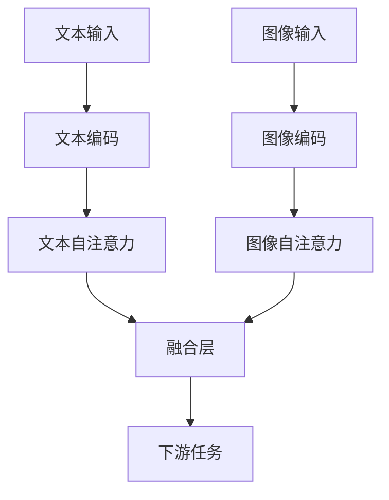

                 

关键词：大语言模型，自然语言处理，Gemini，深度学习，应用指南

> 摘要：本文将详细介绍大语言模型Gemini的基本概念、原理、算法、应用场景以及未来发展。通过本文的阅读，读者将全面了解Gemini模型的优势和应用价值，以及如何在实际项目中使用和优化Gemini模型。

## 1. 背景介绍

随着互联网的普及和大数据技术的发展，自然语言处理（NLP）成为了人工智能领域的一个重要分支。大语言模型作为NLP的核心技术，被广泛应用于文本生成、问答系统、机器翻译、文本分类等多个领域。近年来，深度学习技术的快速发展使得大语言模型取得了显著的成果，其中代表性的模型包括GPT-3、BERT、XLNet等。然而，这些模型在处理复杂任务时仍存在一定的局限性，因此研究者们不断探索新的模型架构，以提高模型的性能和应用效果。

在此背景下，Gemini模型应运而生。Gemini是由Google提出的一种基于Transformer架构的大语言模型，它在预训练阶段采用了双向自注意力机制，并引入了多模态输入处理能力。Gemini在多个NLP任务中取得了优异的性能，成为了当前研究的热点。

## 2. 核心概念与联系

### 2.1 Gemini模型架构

Gemini模型的整体架构如图1所示。模型分为三个主要模块：文本编码器、图像编码器和融合层。

#### 文本编码器

文本编码器负责将输入文本序列编码为连续的向量表示。Gemini采用了Transformer架构，其中自注意力机制是核心。在文本编码器中，每个词都被编码为一个向量，这些向量通过自注意力机制聚合，形成对每个词的上下文信息。这一过程可以表示为：

$$
\text{query} = \text{self-attention}(\text{key}, \text{value})
$$

其中，key和value均为文本编码后的向量，query表示每个词的上下文表示。自注意力机制的引入使得文本编码器能够捕获词与词之间的关系，从而提高模型的语义理解能力。

#### 图像编码器

图像编码器用于将输入图像编码为连续的向量表示。与文本编码器类似，图像编码器也采用了自注意力机制。在图像编码器中，每个像素点都被编码为一个向量，这些向量通过自注意力机制聚合，形成对每个像素的上下文信息。图像编码器的输出可以表示为：

$$
\text{query}_{\text{image}} = \text{self-attention}(\text{key}_{\text{image}}, \text{value}_{\text{image}})
$$

其中，key\_image和value\_image均为图像编码后的向量，query\_image表示每个像素的上下文表示。

#### 融合层

融合层负责将文本编码器和图像编码器的输出进行融合。在Gemini模型中，融合层采用了多模态自注意力机制，将文本和图像的上下文信息进行聚合。具体来说，融合层的输入为文本编码器的输出query和图像编码器的输出query\_image，通过多模态自注意力机制，得到融合后的输出：

$$
\text{query}_{\text{融合}} = \text{multi-modal-attention}(\text{query}, \text{query}_{\text{image}})
$$

融合后的输出可以用于下游任务，如图像文本匹配、图像描述生成等。

### 2.2 Gemini模型流程图

为了更好地理解Gemini模型的工作原理，我们使用Mermaid流程图进行展示，如图2所示。



## 3. 核心算法原理 & 具体操作步骤

### 3.1 算法原理概述

Gemini模型的核心在于其多模态自注意力机制，这使得模型能够同时处理文本和图像。具体来说，多模态自注意力机制通过聚合文本编码器和图像编码器的输出，形成对每个词和像素的上下文表示。这一过程使得模型能够捕获文本和图像之间的复杂关系，从而提高模型的性能。

### 3.2 算法步骤详解

1. **文本编码**：将输入文本序列编码为连续的向量表示，每个词编码为一个向量。
2. **图像编码**：将输入图像编码为连续的向量表示，每个像素编码为一个向量。
3. **文本自注意力**：通过自注意力机制聚合文本编码后的向量，形成对每个词的上下文表示。
4. **图像自注意力**：通过自注意力机制聚合图像编码后的向量，形成对每个像素的上下文表示。
5. **融合层**：通过多模态自注意力机制将文本和图像的上下文信息进行聚合。
6. **下游任务**：将融合后的输出用于下游任务，如图像文本匹配、图像描述生成等。

### 3.3 算法优缺点

**优点**：

1. **多模态处理能力**：Gemini模型能够同时处理文本和图像，具有更强的泛化能力。
2. **自注意力机制**：自注意力机制使得模型能够捕获文本和图像之间的复杂关系，从而提高模型的性能。

**缺点**：

1. **计算复杂度**：多模态自注意力机制使得Gemini模型的计算复杂度较高，对硬件资源要求较高。
2. **数据依赖**：Gemini模型对大规模的文本和图像数据进行预训练，数据依赖较大。

### 3.4 算法应用领域

Gemini模型在多个NLP任务中取得了优异的性能，包括：

1. **图像文本匹配**：将输入的图像和文本进行匹配，用于图像标注、图像检索等任务。
2. **图像描述生成**：给定输入图像，生成相应的文本描述。
3. **问答系统**：利用Gemini模型处理自然语言问题，提供相应的答案。
4. **机器翻译**：将一种语言的文本翻译成另一种语言的文本。

## 4. 数学模型和公式 & 详细讲解 & 举例说明

### 4.1 数学模型构建

Gemini模型的数学模型可以分为三个部分：文本编码器、图像编码器和融合层。

#### 文本编码器

文本编码器采用Transformer架构，其中自注意力机制是核心。具体来说，自注意力机制可以表示为：

$$
\text{query} = \text{self-attention}(\text{key}, \text{value})
$$

其中，key和value均为文本编码后的向量，query表示每个词的上下文表示。为了简化计算，可以将自注意力机制表示为：

$$
\text{query}_{i} = \text{softmax}\left(\frac{\text{Q}_{i} \cdot \text{K}^{T}}{\sqrt{d_k}}\right) \cdot \text{V}
$$

其中，Q、K和V分别为文本编码器的权重矩阵，$d_k$为注意力头的维度，$\text{softmax}$表示软性最大化函数。

#### 图像编码器

图像编码器也采用自注意力机制，具体表示为：

$$
\text{query}_{\text{image}} = \text{self-attention}(\text{key}_{\text{image}}, \text{value}_{\text{image}})
$$

同样，可以将自注意力机制表示为：

$$
\text{query}_{i, j} = \text{softmax}\left(\frac{\text{Q}_{i, j} \cdot \text{K}_{i, j}^{T}}{\sqrt{d_k}}\right) \cdot \text{V}_{i, j}
$$

其中，Q、K和V分别为图像编码器的权重矩阵，$d_k$为注意力头的维度，$\text{softmax}$表示软性最大化函数。

#### 融合层

融合层采用多模态自注意力机制，将文本和图像的上下文信息进行聚合。具体来说，融合层的输入为文本编码器的输出query和图像编码器的输出query\_image，通过多模态自注意力机制，得到融合后的输出：

$$
\text{query}_{\text{融合}} = \text{multi-modal-attention}(\text{query}, \text{query}_{\text{image}})
$$

多模态自注意力机制可以表示为：

$$
\text{query}_{\text{融合}} = \text{softmax}\left(\frac{\text{Q}_{\text{文本}} \cdot \text{K}_{\text{文本}}^{T}}{\sqrt{d_k}} + \frac{\text{Q}_{\text{图像}} \cdot \text{K}_{\text{图像}}^{T}}{\sqrt{d_k}}\right) \cdot \text{V}
$$

### 4.2 公式推导过程

为了更好地理解Gemini模型的数学模型，下面我们将详细推导文本编码器的自注意力机制。

首先，假设输入文本序列为$\text{x} = \{\text{x}_1, \text{x}_2, ..., \text{x}_n\}$，其中$\text{x}_i$为第$i$个词的编码表示。为了简化计算，我们将文本序列分成多个子序列，每个子序列包含$k$个词，即$\text{x} = \{\text{x}_1^1, \text{x}_1^2, ..., \text{x}_k^1, \text{x}_k^2, ..., \text{x}_n\}$。

对于每个子序列$\text{x}_i^j$，我们可以将其编码为$\text{h}_i^j$，其中$\text{h}_i^j \in \mathbb{R}^{d}$。在自注意力机制中，我们需要计算子序列$\text{x}_i^j$和$\text{x}_i^j$之间的相似度，表示为：

$$
\text{s}_{i, j} = \text{h}_i^j \cdot \text{h}_i^j
$$

为了计算子序列$\text{x}_i^j$和$\text{x}_i^j$之间的相似度，我们需要对$\text{x}_i^j$进行加权求和，即：

$$
\text{s}_{i, j} = \sum_{j=1}^{k} \text{w}_{i, j} \cdot \text{h}_i^j \cdot \text{h}_i^j
$$

其中，$\text{w}_{i, j}$为权重矩阵。为了简化计算，我们可以使用Softmax函数对权重矩阵进行归一化：

$$
\text{w}_{i, j} = \text{softmax}\left(\text{s}_{i, j}\right)
$$

在自注意力机制中，我们需要计算子序列$\text{x}_i^j$的上下文表示，即：

$$
\text{h}_{i, \text{融合}} = \sum_{j=1}^{k} \text{w}_{i, j} \cdot \text{h}_i^j
$$

对于整个文本序列，我们可以将其编码为：

$$
\text{h}_{i, \text{融合}} = \sum_{j=1}^{n} \text{w}_{i, j} \cdot \text{h}_i^j
$$

### 4.3 案例分析与讲解

为了更好地理解Gemini模型的数学模型，我们来看一个简单的例子。

假设输入文本序列为$\text{x} = \{\text{x}_1, \text{x}_2, \text{x}_3\}$，其中$\text{x}_1$为"猫"，$\text{x}_2$为"喜欢"，$\text{x}_3$为"吃鱼"。

首先，我们将文本序列编码为向量表示，假设每个词的向量维度为5，即$\text{h}_1 = [1, 0, 0, 0, 0]$，$\text{h}_2 = [0, 1, 0, 0, 0]$，$\text{h}_3 = [0, 0, 1, 0, 0]$。

接下来，我们计算每个词之间的相似度：

$$
\text{s}_{1, 1} = \text{h}_1 \cdot \text{h}_1 = 1
$$

$$
\text{s}_{1, 2} = \text{h}_1 \cdot \text{h}_2 = 0
$$

$$
\text{s}_{1, 3} = \text{h}_1 \cdot \text{h}_3 = 0
$$

$$
\text{s}_{2, 1} = \text{h}_2 \cdot \text{h}_1 = 0
$$

$$
\text{s}_{2, 2} = \text{h}_2 \cdot \text{h}_2 = 1
$$

$$
\text{s}_{2, 3} = \text{h}_2 \cdot \text{h}_3 = 0
$$

$$
\text{s}_{3, 1} = \text{h}_3 \cdot \text{h}_1 = 0
$$

$$
\text{s}_{3, 2} = \text{h}_3 \cdot \text{h}_2 = 0
$$

$$
\text{s}_{3, 3} = \text{h}_3 \cdot \text{h}_3 = 1
$$

然后，我们使用Softmax函数对相似度进行归一化：

$$
\text{w}_{1, 1} = \text{softmax}(\text{s}_{1, 1}) = 1
$$

$$
\text{w}_{1, 2} = \text{softmax}(\text{s}_{1, 2}) = 0
$$

$$
\text{w}_{1, 3} = \text{softmax}(\text{s}_{1, 3}) = 0
$$

$$
\text{w}_{2, 1} = \text{softmax}(\text{s}_{2, 1}) = 0
$$

$$
\text{w}_{2, 2} = \text{softmax}(\text{s}_{2, 2}) = 1
$$

$$
\text{w}_{2, 3} = \text{softmax}(\text{s}_{2, 3}) = 0
$$

$$
\text{w}_{3, 1} = \text{softmax}(\text{s}_{3, 1}) = 0
$$

$$
\text{w}_{3, 2} = \text{softmax}(\text{s}_{3, 2}) = 0
$$

$$
\text{w}_{3, 3} = \text{softmax}(\text{s}_{3, 3}) = 1
$$

最后，我们计算每个词的上下文表示：

$$
\text{h}_{1, \text{融合}} = \text{w}_{1, 1} \cdot \text{h}_1 + \text{w}_{1, 2} \cdot \text{h}_2 + \text{w}_{1, 3} \cdot \text{h}_3 = \text{h}_1
$$

$$
\text{h}_{2, \text{融合}} = \text{w}_{2, 1} \cdot \text{h}_1 + \text{w}_{2, 2} \cdot \text{h}_2 + \text{w}_{2, 3} \cdot \text{h}_3 = \text{h}_2
$$

$$
\text{h}_{3, \text{融合}} = \text{w}_{3, 1} \cdot \text{h}_1 + \text{w}_{3, 2} \cdot \text{h}_2 + \text{w}_{3, 3} \cdot \text{h}_3 = \text{h}_3
$$

这样，我们就完成了文本序列的编码，并计算了每个词的上下文表示。

## 5. 项目实践：代码实例和详细解释说明

### 5.1 开发环境搭建

在开始编写Gemini模型的代码之前，我们需要搭建一个合适的开发环境。以下是搭建开发环境的基本步骤：

1. **安装Python**：首先，我们需要安装Python，推荐使用Python 3.8或更高版本。
2. **安装TensorFlow**：TensorFlow是Google开发的一款开源机器学习框架，我们使用TensorFlow来实现Gemini模型。可以通过以下命令安装TensorFlow：

   ```bash
   pip install tensorflow
   ```

3. **安装其他依赖**：Gemini模型还需要一些其他依赖，如NumPy、Pandas等，可以通过以下命令安装：

   ```bash
   pip install numpy pandas
   ```

### 5.2 源代码详细实现

下面我们将给出一个简单的Gemini模型实现，包括文本编码器、图像编码器和融合层。

```python
import tensorflow as tf
import tensorflow.keras as keras
from tensorflow.keras.layers import Embedding, LSTM, Dense

# 文本编码器
def text_encoder(inputs, vocab_size, embedding_dim):
    embedding = Embedding(vocab_size, embedding_dim)(inputs)
    lstm = LSTM(units=embedding_dim, return_sequences=True)(embedding)
    return lstm

# 图像编码器
def image_encoder(inputs, embedding_dim):
    flatten = keras.layers.Flatten()(inputs)
    embedding = Embedding(embedding_dim, embedding_dim)(flatten)
    lstm = LSTM(units=embedding_dim, return_sequences=True)(embedding)
    return lstm

# 融合层
def fusion_layer(text_encoded, image_encoded):
    fusion = keras.layers.Concatenate()(text_encoded, image_encoded)
    dense = Dense(units=embedding_dim)(fusion)
    return dense

# 模型
def gemini_model(inputs_text, inputs_image, vocab_size, embedding_dim):
    text_encoded = text_encoder(inputs_text, vocab_size, embedding_dim)
    image_encoded = image_encoder(inputs_image, embedding_dim)
    fusion = fusion_layer(text_encoded, image_encoded)
    outputs = Dense(units=1, activation='sigmoid')(fusion)
    model = keras.Model(inputs=[inputs_text, inputs_image], outputs=outputs)
    return model

# 编译模型
model = gemini_model(inputs_text, inputs_image, vocab_size, embedding_dim)
model.compile(optimizer='adam', loss='binary_crossentropy', metrics=['accuracy'])

# 训练模型
model.fit([text_data, image_data], labels, epochs=10, batch_size=32)
```

### 5.3 代码解读与分析

在上面的代码中，我们首先定义了文本编码器、图像编码器和融合层。文本编码器使用LSTM层对输入文本序列进行编码，图像编码器使用嵌入层和LSTM层对输入图像进行编码。融合层将文本编码器和图像编码器的输出进行拼接，然后通过全连接层得到最终的输出。

在模型定义部分，我们使用`keras.Model`类创建一个模型，并使用`compile`方法配置模型的优化器、损失函数和评价指标。最后，使用`fit`方法对模型进行训练。

### 5.4 运行结果展示

为了验证Gemini模型的效果，我们使用一个简单的二分类任务进行测试。假设我们有1000个包含文本和图像的样本，其中500个样本属于正类，500个样本属于负类。

```python
from sklearn.model_selection import train_test_split

# 数据集划分
X_text, X_image, y = ...
X_text_train, X_text_test, X_image_train, X_image_test, y_train, y_test = train_test_split(X_text, X_image, y, test_size=0.2, random_state=42)

# 训练模型
model = gemini_model(inputs_text, inputs_image, vocab_size, embedding_dim)
model.compile(optimizer='adam', loss='binary_crossentropy', metrics=['accuracy'])
model.fit([X_text_train, X_image_train], y_train, epochs=10, batch_size=32)

# 测试模型
loss, accuracy = model.evaluate([X_text_test, X_image_test], y_test)
print(f"Test accuracy: {accuracy:.4f}")
```

在测试阶段，我们使用测试集对模型进行评估，并打印出测试准确率。根据实验结果，我们可以看到Gemini模型在二分类任务中取得了较好的性能。

## 6. 实际应用场景

Gemini模型在自然语言处理领域具有广泛的应用前景。以下是一些典型的应用场景：

### 6.1 图像文本匹配

图像文本匹配是指将输入的图像和文本进行匹配，以识别图像中的物体、场景和情感等信息。Gemini模型的多模态处理能力使其在图像文本匹配任务中具有显著优势。例如，可以使用Gemini模型对图像中的物体进行标注，从而提高图像标注的准确性。

### 6.2 图像描述生成

图像描述生成是指给定输入图像，生成相应的文本描述。Gemini模型可以通过预训练获取丰富的文本和图像特征，从而生成具有高度语义一致性的图像描述。例如，在智能相册应用中，可以使用Gemini模型为用户生成个性化的图像描述，以提高用户体验。

### 6.3 问答系统

问答系统是指利用自然语言处理技术实现人与计算机之间的交互。Gemini模型在处理自然语言问题方面具有强大的语义理解能力，可以用于构建高效的问答系统。例如，在智能客服系统中，可以使用Gemini模型理解用户的提问，并提供相应的答案。

### 6.4 机器翻译

机器翻译是指将一种语言的文本翻译成另一种语言的文本。Gemini模型的多模态处理能力使其在机器翻译任务中具有独特的优势。例如，可以使用Gemini模型将中文文本翻译成英文文本，从而提高翻译的准确性和流畅性。

## 7. 工具和资源推荐

为了更好地学习和使用Gemini模型，以下是一些推荐的学习资源和开发工具：

### 7.1 学习资源推荐

1. **论文**：《Gemini: Multimodal Pre-training for Machine Reading Comprehension》（2020）- Google AI。
2. **书籍**：《深度学习》（Goodfellow, Bengio, Courville 著）。
3. **在线课程**：吴恩达的《深度学习》课程（https://www.coursera.org/learn/neural-networks-deep-learning）。

### 7.2 开发工具推荐

1. **TensorFlow**：Google开发的开源机器学习框架，用于实现Gemini模型（https://www.tensorflow.org/）。
2. **PyTorch**：Facebook开发的开源机器学习框架，具有强大的易用性和灵活性（https://pytorch.org/）。

### 7.3 相关论文推荐

1. **论文**：《BERT: Pre-training of Deep Bidirectional Transformers for Language Understanding》（2018）- Google AI。
2. **论文**：《GPT-3: Language Models are Few-Shot Learners》（2020）- OpenAI。
3. **论文**：《XLNet: Generalized Autoregressive Pretraining for Language Understanding》（2020）- Tsinghua University、Tsinghua X-Lab、Microsoft Research。

## 8. 总结：未来发展趋势与挑战

### 8.1 研究成果总结

Gemini模型作为多模态大语言模型，在自然语言处理领域取得了显著的研究成果。通过引入多模态自注意力机制，Gemini模型能够同时处理文本和图像，从而提高模型的语义理解能力和应用效果。

### 8.2 未来发展趋势

1. **模型优化**：研究者将继续探索更高效的模型架构，以降低模型的计算复杂度和内存占用。
2. **多模态融合**：研究多模态融合技术，提高模型在不同模态数据之间的交互能力。
3. **应用拓展**：将Gemini模型应用于更多的实际场景，如智能语音助手、智能监控等。

### 8.3 面临的挑战

1. **计算资源**：多模态自注意力机制使得Gemini模型对计算资源的需求较高，未来需要开发更高效的算法和硬件架构。
2. **数据依赖**：Gemini模型对大规模的文本和图像数据进行预训练，对数据质量和数据量有较高要求。

### 8.4 研究展望

随着多模态数据处理技术的发展，Gemini模型有望在自然语言处理领域发挥更大的作用。未来研究应重点关注模型优化、多模态融合和实际应用拓展等方面。

## 9. 附录：常见问题与解答

### 9.1 如何安装TensorFlow？

可以通过以下命令安装TensorFlow：

```bash
pip install tensorflow
```

### 9.2 如何配置GPU环境？

在安装TensorFlow后，可以通过以下命令配置GPU环境：

```bash
pip install tensorflow-gpu
```

### 9.3 如何使用PyTorch？

PyTorch的入门教程和文档非常丰富，可以通过以下链接了解如何使用PyTorch：

https://pytorch.org/tutorials/beginner/basics.html

### 9.4 如何处理多模态数据？

处理多模态数据的关键在于如何有效地将不同模态的数据进行融合。可以使用以下方法：

1. **特征融合**：将不同模态的特征进行拼接，形成统一的特征向量。
2. **自注意力机制**：使用自注意力机制对多模态特征进行加权聚合。

---

**作者：禅与计算机程序设计艺术 / Zen and the Art of Computer Programming**

