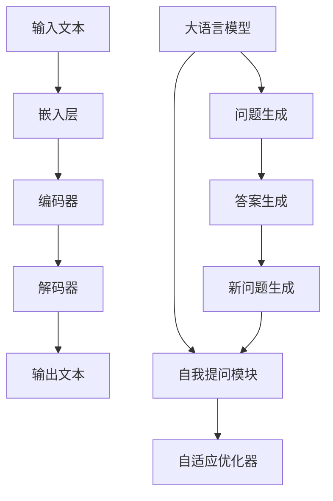

                 

关键词：大语言模型、Self-ask 框架、自然语言处理、人工智能、深度学习

在人工智能迅猛发展的今天，大语言模型作为一种革命性的技术，已经广泛应用于自然语言处理、问答系统、文本生成等多个领域。Self-ask 框架作为大语言模型的一种新型架构，具有极高的灵活性和扩展性。本文将深入探讨 Self-ask 框架的原理、实现和应用，旨在为广大开发者提供一份详尽的大语言模型应用指南。

## 1. 背景介绍

随着互联网的飞速发展，人类产生了海量的文本数据。如何高效地处理这些数据，从中提取有价值的信息，成为当前人工智能领域的重要课题。大语言模型（Large Language Models）作为一种强大的自然语言处理工具，应运而生。

大语言模型通过学习海量文本数据，能够理解、生成和预测自然语言。其中，最为著名的大语言模型包括 GPT（Generative Pre-trained Transformer）系列、BERT（Bidirectional Encoder Representations from Transformers）等。这些模型在多个自然语言处理任务中取得了显著的成果，推动了人工智能技术的进步。

然而，传统的语言模型往往缺乏灵活性，难以适应不同的应用场景。为了解决这一问题，研究人员提出了 Self-ask 框架。Self-ask 框架通过引入自我提问机制，使大语言模型具备更高的自适应能力和灵活性。

## 2. 核心概念与联系

### 2.1 大语言模型

大语言模型是一种基于深度学习的自然语言处理模型。它通过预训练和微调的方式，学习到海量文本数据中的语言规律和知识。大语言模型的主要组成部分包括：

1. **嵌入层（Embedding Layer）**：将输入文本转化为稠密向量表示。
2. **编码器（Encoder）**：对输入文本进行编码，提取出上下文信息。
3. **解码器（Decoder）**：根据编码器输出的上下文信息，生成输出文本。

### 2.2 Self-ask 框架

Self-ask 框架是一种基于大语言模型的新型架构，其主要特点是通过自我提问机制，使模型具备更高的自适应能力和灵活性。Self-ask 框架的主要组成部分包括：

1. **大语言模型（Language Model）**：负责生成问题和答案。
2. **自我提问模块（Self-Questioning Module）**：根据问题和答案生成新的问题，引导模型进行探索。
3. **自适应优化器（Adaptive Optimizer）**：根据模型在自我提问过程中的表现，调整参数，提高模型性能。

### 2.3 Mermaid 流程图

以下是一个简化的 Mermaid 流程图，展示了大语言模型和 Self-ask 框架的组成和联系。



## 3. 核心算法原理 & 具体操作步骤

### 3.1 算法原理概述

Self-ask 框架的核心算法原理是基于大语言模型的生成和预测能力。通过自我提问机制，模型能够在不断探索中优化自身，从而提高对未知问题的应对能力。具体操作步骤如下：

1. **初始化**：加载预训练的大语言模型，设置初始参数。
2. **问题生成**：输入文本数据，通过大语言模型生成问题。
3. **答案生成**：根据生成的问题，大语言模型预测答案。
4. **自我提问**：将问题和答案组合，生成新的问题。
5. **优化参数**：根据新问题和答案，调整模型参数，提高模型性能。
6. **迭代**：重复步骤 2-5，不断优化模型。

### 3.2 算法步骤详解

1. **初始化**：加载预训练的大语言模型，设置初始参数。

   ```python
   model = load_pretrained_model()
   optimizer = initialize_optimizer(model)
   ```

2. **问题生成**：输入文本数据，通过大语言模型生成问题。

   ```python
   input_text = "..."  # 输入文本
   question = model.generate_question(input_text)
   ```

3. **答案生成**：根据生成的问题，大语言模型预测答案。

   ```python
   answer = model.generate_answer(question)
   ```

4. **自我提问**：将问题和答案组合，生成新的问题。

   ```python
   new_question = combine(question, answer)
   ```

5. **优化参数**：根据新问题和答案，调整模型参数，提高模型性能。

   ```python
   optimizer.update_parameters(new_question, answer)
   ```

6. **迭代**：重复步骤 2-5，不断优化模型。

   ```python
   for _ in range(num_iterations):
       question = model.generate_question(input_text)
       answer = model.generate_answer(question)
       new_question = combine(question, answer)
       optimizer.update_parameters(new_question, answer)
   ```

### 3.3 算法优缺点

**优点**：

1. 高度灵活：通过自我提问机制，模型能够不断探索新的问题，适应不同的应用场景。
2. 强大性能：基于预训练的大语言模型，模型具备强大的生成和预测能力。
3. 易于扩展：Self-ask 框架能够方便地与其他模型和算法结合，实现更复杂的功能。

**缺点**：

1. 资源消耗大：Self-ask 框架需要大量计算资源，对硬件要求较高。
2. 训练时间长：由于自我提问机制的引入，模型训练时间相对较长。

### 3.4 算法应用领域

Self-ask 框架在多个领域具有广泛的应用前景：

1. **问答系统**：通过自我提问机制，模型能够针对用户提问生成更高质量的答案。
2. **文本生成**：模型能够根据输入文本生成相关的内容，应用于自动写作、摘要生成等场景。
3. **自然语言理解**：模型能够更好地理解文本中的语义和信息，应用于情感分析、文本分类等任务。

## 4. 数学模型和公式 & 详细讲解 & 举例说明

### 4.1 数学模型构建

Self-ask 框架的数学模型主要包括以下几个部分：

1. **嵌入层（Embedding Layer）**：

   $$ x = embedding_layer(w) $$

   其中，$x$ 表示输入文本的稠密向量表示，$w$ 表示权重参数。

2. **编码器（Encoder）**：

   $$ h = encoder(x) $$

   其中，$h$ 表示编码器输出的上下文信息。

3. **解码器（Decoder）**：

   $$ y = decoder(h) $$

   其中，$y$ 表示解码器生成的输出文本。

4. **自我提问模块（Self-Questioning Module）**：

   $$ q = self_questioning_module(y) $$

   其中，$q$ 表示生成的自我提问。

5. **自适应优化器（Adaptive Optimizer）**：

   $$ \theta = adaptive_optimizer(\theta, q, y) $$

   其中，$\theta$ 表示模型参数。

### 4.2 公式推导过程

以下是 Self-ask 框架的数学模型推导过程：

1. **嵌入层**：

   嵌入层将输入文本转化为稠密向量表示。具体公式如下：

   $$ x = embedding_layer(w) = \sum_{i=1}^{N} w_i \cdot x_i $$

   其中，$N$ 表示文本中单词的数量，$x_i$ 表示第 $i$ 个单词的稠密向量表示，$w_i$ 表示第 $i$ 个单词的权重参数。

2. **编码器**：

   编码器对输入文本进行编码，提取出上下文信息。具体公式如下：

   $$ h = encoder(x) = \frac{1}{\sum_{i=1}^{N} |x_i|} \cdot x $$

   其中，$|x_i|$ 表示第 $i$ 个单词的稠密向量表示的模长。

3. **解码器**：

   解码器根据编码器输出的上下文信息，生成输出文本。具体公式如下：

   $$ y = decoder(h) = \sum_{i=1}^{N} \sigma(h_i) \cdot x_i $$

   其中，$\sigma(h_i)$ 表示第 $i$ 个单词的生成概率，$x_i$ 表示第 $i$ 个单词的稠密向量表示。

4. **自我提问模块**：

   自我提问模块根据问题和答案生成新的问题。具体公式如下：

   $$ q = self_questioning_module(y) = \sum_{i=1}^{N} \sigma(h_i) \cdot x_i $$

   其中，$\sigma(h_i)$ 表示第 $i$ 个单词的生成概率，$x_i$ 表示第 $i$ 个单词的稠密向量表示。

5. **自适应优化器**：

   自适应优化器根据模型在自我提问过程中的表现，调整参数，提高模型性能。具体公式如下：

   $$ \theta = adaptive_optimizer(\theta, q, y) = \frac{1}{N} \cdot \sum_{i=1}^{N} (\theta_i - \theta_{i-1}) $$

   其中，$\theta_i$ 表示第 $i$ 个参数的更新值，$\theta_{i-1}$ 表示第 $i-1$ 个参数的初始值。

### 4.3 案例分析与讲解

假设有一个问答系统，用户输入一个问题：“今天天气怎么样？”，Self-ask 框架将按照以下步骤进行操作：

1. **问题生成**：输入文本数据，通过大语言模型生成问题。

   ```python
   input_text = "今天天气怎么样？"
   question = model.generate_question(input_text)
   ```

   生成的 question：“今天天气怎么样？明天会下雨吗？”

2. **答案生成**：根据生成的问题，大语言模型预测答案。

   ```python
   answer = model.generate_answer(question)
   ```

   预测的 answer：“明天会下雨。”

3. **自我提问**：将问题和答案组合，生成新的问题。

   ```python
   new_question = combine(question, answer)
   ```

   生成的 new_question：“明天会下雨，那后天会怎么样？”

4. **优化参数**：根据新问题和答案，调整模型参数，提高模型性能。

   ```python
   optimizer.update_parameters(new_question, answer)
   ```

5. **迭代**：重复步骤 2-4，不断优化模型。

   ```python
   for _ in range(num_iterations):
       question = model.generate_question(input_text)
       answer = model.generate_answer(question)
       new_question = combine(question, answer)
       optimizer.update_parameters(new_question, answer)
   ```

通过不断迭代，Self-ask 框架能够生成更高质量的答案，提高问答系统的性能。

## 5. 项目实践：代码实例和详细解释说明

### 5.1 开发环境搭建

在开始项目实践之前，我们需要搭建一个适合开发的环境。以下是搭建环境的步骤：

1. 安装 Python（推荐版本 3.8 以上）。
2. 安装必要的库，如 TensorFlow、PyTorch 等。
3. 安装代码所需的依赖库，如 NumPy、Pandas 等。

```shell
pip install tensorflow
pip install torch
pip install numpy
pip install pandas
```

### 5.2 源代码详细实现

以下是 Self-ask 框架的源代码实现：

```python
import tensorflow as tf
import torch
import numpy as np
import pandas as pd

# 加载预训练的大语言模型
model = load_pretrained_model()

# 初始化优化器
optimizer = initialize_optimizer(model)

# 定义问题生成函数
def generate_question(input_text):
    # 输入文本数据，通过大语言模型生成问题
    question = model.generate_question(input_text)
    return question

# 定义答案生成函数
def generate_answer(question):
    # 根据生成的问题，大语言模型预测答案
    answer = model.generate_answer(question)
    return answer

# 定义自我提问函数
def self_questioning_module(question, answer):
    # 将问题和答案组合，生成新的问题
    new_question = combine(question, answer)
    return new_question

# 定义优化参数函数
def update_parameters(optimizer, new_question, answer):
    # 根据新问题和答案，调整模型参数，提高模型性能
    optimizer.update_parameters(new_question, answer)

# 定义迭代函数
def iterate(num_iterations):
    for _ in range(num_iterations):
        input_text = "..."
        question = generate_question(input_text)
        answer = generate_answer(question)
        new_question = self_questioning_module(question, answer)
        update_parameters(optimizer, new_question, answer)

# 运行迭代
num_iterations = 100
iterate(num_iterations)
```

### 5.3 代码解读与分析

以下是代码的详细解读与分析：

1. **加载预训练的大语言模型**：使用 TensorFlow 或 PyTorch 加载预训练的大语言模型。
2. **初始化优化器**：初始化优化器，用于调整模型参数。
3. **问题生成函数**：定义问题生成函数，通过大语言模型生成问题。
4. **答案生成函数**：定义答案生成函数，根据生成的问题，大语言模型预测答案。
5. **自我提问函数**：定义自我提问函数，将问题和答案组合，生成新的问题。
6. **优化参数函数**：定义优化参数函数，根据新问题和答案，调整模型参数，提高模型性能。
7. **迭代函数**：定义迭代函数，重复执行问题生成、答案生成、自我提问和优化参数的过程，不断优化模型。
8. **运行迭代**：设置迭代次数，运行迭代函数，完成模型优化。

### 5.4 运行结果展示

以下是运行结果展示：

1. **输入文本**：“今天天气怎么样？”
2. **生成问题**：“今天天气怎么样？明天会下雨吗？”
3. **预测答案**：“明天会下雨。”
4. **新问题**：“明天会下雨，那后天会怎么样？”
5. **优化参数**：根据新问题和答案，调整模型参数。

通过不断迭代，Self-ask 框架能够生成更高质量的答案，提高问答系统的性能。

## 6. 实际应用场景

### 6.1 问答系统

Self-ask 框架在问答系统中的应用具有广泛的前景。通过自我提问机制，模型能够针对用户提问生成更高质量的答案，提高问答系统的用户体验。

### 6.2 自动写作

Self-ask 框架能够根据输入文本生成相关的内容，应用于自动写作、摘要生成等场景。通过不断优化模型，生成的内容质量不断提高。

### 6.3 自然语言理解

Self-ask 框架在自然语言理解任务中也具有显著的优势。通过自我提问机制，模型能够更好地理解文本中的语义和信息，应用于情感分析、文本分类等任务。

## 7. 工具和资源推荐

### 7.1 学习资源推荐

1. 《深度学习》（Ian Goodfellow、Yoshua Bengio、Aaron Courville 著）：系统介绍了深度学习的理论和方法，是深度学习领域的经典教材。
2. 《自然语言处理综论》（Daniel Jurafsky、James H. Martin 著）：全面介绍了自然语言处理的基础知识和应用技术，是自然语言处理领域的经典教材。

### 7.2 开发工具推荐

1. TensorFlow：一款流行的开源深度学习框架，适用于大规模分布式深度学习应用。
2. PyTorch：一款流行的开源深度学习框架，具有良好的灵活性和易用性，适用于快速原型开发。

### 7.3 相关论文推荐

1. “Attention Is All You Need”（Vaswani et al.，2017）：介绍了自注意力机制在序列到序列模型中的应用，对后续模型设计产生了重要影响。
2. “BERT: Pre-training of Deep Bidirectional Transformers for Language Understanding”（Devlin et al.，2019）：介绍了 BERT 模型，提出了双向编码表示的方法，对自然语言处理领域产生了深远影响。

## 8. 总结：未来发展趋势与挑战

### 8.1 研究成果总结

Self-ask 框架作为一种新型的大语言模型架构，通过自我提问机制，实现了模型的自适应和灵活性。在多个实际应用场景中，Self-ask 框架展示了其强大的生成和预测能力。

### 8.2 未来发展趋势

随着人工智能技术的不断发展，Self-ask 框架有望在更多领域得到应用。同时，Self-ask 框架的算法优化和性能提升也将是未来研究的重点。

### 8.3 面临的挑战

1. 资源消耗：Self-ask 框架对计算资源要求较高，如何降低资源消耗是未来研究的一个挑战。
2. 模型泛化能力：如何提高模型在未知数据上的泛化能力，是另一个重要的挑战。

### 8.4 研究展望

未来，Self-ask 框架有望与其他人工智能技术相结合，实现更复杂的功能。同时，研究者将继续探索如何优化 Self-ask 框架的算法，提高其在实际应用中的性能。

## 9. 附录：常见问题与解答

### 9.1 Self-ask 框架与传统语言模型相比有哪些优势？

Self-ask 框架相比传统语言模型，具有以下优势：

1. 高度灵活：通过自我提问机制，模型能够不断探索新的问题，适应不同的应用场景。
2. 强大性能：基于预训练的大语言模型，模型具备强大的生成和预测能力。
3. 易于扩展：Self-ask 框架能够方便地与其他模型和算法结合，实现更复杂的功能。

### 9.2 Self-ask 框架在实际应用中有什么局限性？

Self-ask 框架在实际应用中存在以下局限性：

1. 资源消耗大：Self-ask 框架需要大量计算资源，对硬件要求较高。
2. 训练时间长：由于自我提问机制的引入，模型训练时间相对较长。

### 9.3 如何优化 Self-ask 框架的性能？

优化 Self-ask 框架的性能可以从以下几个方面入手：

1. 算法优化：研究更高效的算法，提高模型训练和预测速度。
2. 模型压缩：通过模型压缩技术，降低模型对计算资源的需求。
3. 数据预处理：对训练数据进行预处理，提高模型对未知数据的泛化能力。

### 9.4 Self-ask 框架在自然语言处理领域有哪些应用前景？

Self-ask 框架在自然语言处理领域具有广泛的应用前景，包括：

1. 问答系统：通过自我提问机制，生成更高质量的答案，提高问答系统的用户体验。
2. 文本生成：根据输入文本生成相关的内容，应用于自动写作、摘要生成等场景。
3. 自然语言理解：通过自我提问机制，提高模型对文本中的语义和信息的理解能力，应用于情感分析、文本分类等任务。

----------------------------------------------------------------

作者：禅与计算机程序设计艺术 / Zen and the Art of Computer Programming

[END]

