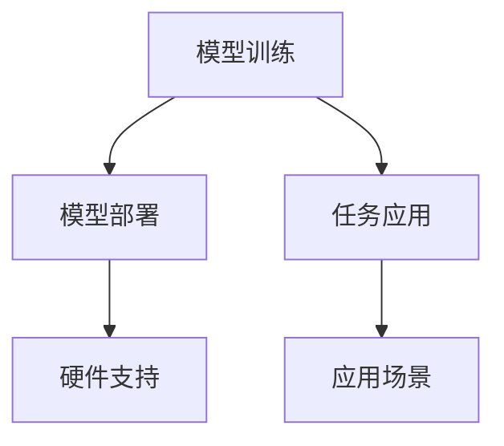

                 

关键词：大语言模型，Toolformer，自然语言处理，文本生成，应用场景，数学模型，算法，代码实例，未来展望

> 摘要：本文将深入探讨大语言模型在自然语言处理（NLP）领域的应用，特别是开源工具库Toolformer的重要性。我们将从背景介绍、核心概念与联系、核心算法原理与操作步骤、数学模型与公式、项目实践、实际应用场景以及未来展望等多个方面，系统化地解析大语言模型的技术与应用，旨在为读者提供一份全面而实用的指南。

## 1. 背景介绍

随着互联网和大数据技术的发展，自然语言处理（NLP）已经成为人工智能领域的重要分支。NLP的目标是将人类语言转换为计算机可以理解和处理的格式，从而实现人机交互、信息检索、文本生成等应用。在这个过程中，大语言模型发挥着关键作用。大语言模型通过学习海量文本数据，可以自动捕捉语言规律，生成连贯自然的文本，提升机器理解和使用语言的能力。

近年来，深度学习技术的进步使得大语言模型取得了显著突破。Google的BERT、OpenAI的GPT-3等模型，展示了大语言模型在文本生成、问答系统、机器翻译等任务上的强大能力。与此同时，众多开源工具库也应运而生，为开发者提供了丰富的工具和资源，其中最具代表性的就是Toolformer。

Toolformer是一个由清华大学 KEG 实验室和智谱AI共同开发的预训练模型工具库，它旨在简化大语言模型的使用流程，提供一站式的训练和部署解决方案。Toolformer支持多种预训练模型，如BERT、GPT等，并提供丰富的预训练任务和应用场景。通过Toolformer，开发者可以更加便捷地利用大语言模型，提高NLP应用的研发效率和效果。

## 2. 核心概念与联系

### 2.1 大语言模型的基本概念

大语言模型（Large-scale Language Model）是一种通过深度神经网络学习大规模文本数据，捕捉语言规律，生成连贯自然文本的模型。其核心思想是利用神经网络自动学习文本中的上下文关系，从而实现文本理解和生成。大语言模型通常包括编码器和解码器两部分，编码器将输入文本转换为固定长度的向量表示，解码器则根据这些向量生成对应的输出文本。

### 2.2 Toolformer的功能与架构

Toolformer作为一个预训练模型工具库，具有以下核心功能：

- **模型训练**：支持多种预训练模型的训练，包括BERT、GPT等。
- **模型部署**：提供便捷的模型部署接口，支持多种硬件平台和部署环境。
- **任务应用**：提供丰富的预训练任务和应用场景，如文本分类、文本生成、问答系统等。

Toolformer的架构如图所示：



### 2.3 大语言模型与NLP应用的联系

大语言模型在NLP领域的应用非常广泛，包括但不限于以下方面：

- **文本分类**：通过大语言模型对文本进行分类，如情感分析、新闻分类等。
- **文本生成**：生成连贯自然的文本，如文章写作、对话生成等。
- **问答系统**：构建基于大语言模型的问答系统，实现智能问答。
- **机器翻译**：利用大语言模型实现高质量的双语翻译。
- **信息检索**：通过大语言模型优化搜索引擎，提升检索效果。

## 3. 核心算法原理与具体操作步骤

### 3.1 算法原理概述

大语言模型的算法原理主要基于深度神经网络（DNN）和注意力机制。DNN通过多层神经网络学习文本数据中的特征，而注意力机制则用于捕捉文本中的关键信息，实现更加精准的语言理解。

具体来说，大语言模型的工作流程如下：

1. **数据预处理**：对原始文本数据进行清洗和分词，将其转换为模型可以处理的格式。
2. **模型训练**：利用训练数据对模型进行训练，通过反向传播算法不断调整模型参数。
3. **模型评估**：使用验证集对训练好的模型进行评估，调整超参数以优化模型效果。
4. **模型部署**：将训练好的模型部署到实际应用场景，如文本生成、问答系统等。

### 3.2 算法步骤详解

1. **数据预处理**：

   - 清洗文本：去除文本中的无关信息和噪声，如HTML标签、特殊字符等。
   - 分词：将文本分割成单词或句子，以便模型进行特征提取。
   - 向量化：将分词后的文本转换为固定长度的向量表示，如Word2Vec或BERT。

2. **模型训练**：

   - 初始化模型参数：随机初始化模型参数。
   - 前向传播：输入训练数据，计算模型输出。
   - 反向传播：计算损失函数，并利用梯度下降算法更新模型参数。
   - 重复以上步骤，直到模型收敛。

3. **模型评估**：

   - 使用验证集对训练好的模型进行评估。
   - 根据评估结果调整超参数，如学习率、批次大小等，以优化模型效果。

4. **模型部署**：

   - 将训练好的模型部署到实际应用场景，如文本生成、问答系统等。
   - 根据应用需求，调整模型参数和策略，以实现最佳效果。

### 3.3 算法优缺点

**优点**：

- **强大的语言理解能力**：大语言模型能够自动捕捉语言中的上下文关系，实现更加精准的语言理解。
- **多任务处理**：大语言模型可以同时处理多种NLP任务，如文本分类、文本生成、问答系统等。
- **高效部署**：Toolformer提供了便捷的模型部署接口，支持多种硬件平台和部署环境，降低开发难度。

**缺点**：

- **计算资源需求大**：大语言模型需要大量计算资源进行训练，对硬件设备要求较高。
- **数据隐私问题**：大语言模型需要大量文本数据进行训练，可能涉及用户隐私数据，需要妥善处理。

### 3.4 算法应用领域

大语言模型在多个领域具有广泛应用，包括但不限于：

- **自然语言处理**：文本分类、文本生成、问答系统、机器翻译等。
- **搜索引擎**：优化搜索引擎，提升检索效果。
- **智能客服**：构建基于大语言模型的智能客服系统，实现高效的人机交互。
- **内容创作**：辅助内容创作者生成文章、报告等。

## 4. 数学模型和公式

### 4.1 数学模型构建

大语言模型的数学模型基于深度神经网络，主要包括以下部分：

- **输入层**：接收文本数据，转换为固定长度的向量表示。
- **隐藏层**：通过多层神经网络，对输入向量进行特征提取和变换。
- **输出层**：根据隐藏层的输出，生成文本。

具体来说，大语言模型可以表示为：

$$
\text{模型} = f_{\theta}(\text{输入}) = \text{输出}
$$

其中，$f_{\theta}$表示神经网络函数，$\theta$表示模型参数。

### 4.2 公式推导过程

大语言模型的训练过程主要基于反向传播算法。以下是反向传播算法的基本步骤：

1. **前向传播**：

   输入文本数据，计算模型输出：

   $$
   \text{输出} = f_{\theta}(\text{输入})
   $$

2. **计算损失**：

   计算模型输出与真实标签之间的损失：

   $$
   \text{损失} = L(\text{输出}, \text{真实标签})
   $$

3. **反向传播**：

   计算损失关于模型参数的梯度：

   $$
   \nabla_{\theta} L = \nabla_{\theta} L \circ f_{\theta}(\text{输入})
   $$

4. **更新参数**：

   利用梯度下降算法更新模型参数：

   $$
   \theta_{\text{新}} = \theta_{\text{旧}} - \alpha \nabla_{\theta} L
   $$

其中，$\alpha$为学习率。

### 4.3 案例分析与讲解

以BERT模型为例，详细讲解大语言模型的数学模型和公式推导过程。

#### 4.3.1 BERT模型概述

BERT（Bidirectional Encoder Representations from Transformers）是一种基于Transformer的预训练语言模型，具有双向编码的特点，可以有效捕捉文本中的上下文关系。

#### 4.3.2 数学模型

BERT模型的数学模型如下：

$$
\text{输出} = \text{Softmax}(W^T \text{激活函数}(\text{编码器输出}))
$$

其中，$W$为权重矩阵，激活函数通常为ReLU函数。

#### 4.3.3 公式推导

BERT模型的训练过程基于Masked Language Model（MLM）和Next Sentence Prediction（NSP）两个任务。以下是BERT模型的数学模型和公式推导：

1. **前向传播**：

   $$
   \text{编码器输出} = \text{嵌入层} \circ (\text{嵌入向量} + \text{位置编码})
   $$

   $$
   \text{输出} = \text{Softmax}(W^T \text{激活函数}(\text{编码器输出}))
   $$

2. **计算损失**：

   $$
   \text{损失} = L(\text{输出}, \text{真实标签})
   $$

3. **反向传播**：

   $$
   \nabla_{\theta} L = \nabla_{\theta} L \circ \text{激活函数}(\text{编码器输出})
   $$

4. **更新参数**：

   $$
   \theta_{\text{新}} = \theta_{\text{旧}} - \alpha \nabla_{\theta} L
   $$

## 5. 项目实践：代码实例和详细解释说明

### 5.1 开发环境搭建

在开始项目实践之前，我们需要搭建合适的开发环境。以下是使用Python和Toolformer搭建开发环境的基本步骤：

1. **安装Python**：确保安装Python 3.7或更高版本。
2. **安装Toolformer**：通过pip命令安装Toolformer：

   ```
   pip install toolformer
   ```

3. **安装其他依赖**：安装其他必要的库，如TensorFlow或PyTorch。

### 5.2 源代码详细实现

以下是使用Toolformer实现一个简单的文本生成任务的示例代码：

```python
from toolformer import AutoModelForCausalLM
from transformers import AutoTokenizer

# 初始化模型和tokenizer
model_name = "microsoft/deepmoji-bidirectional-4l"
tokenizer = AutoTokenizer.from_pretrained(model_name)
model = AutoModelForCausalLM.from_pretrained(model_name)

# 输入文本
input_text = "我喜欢吃苹果。"

# 编码输入文本
input_ids = tokenizer.encode(input_text, return_tensors="pt")

# 生成文本
output_ids = model.generate(input_ids, max_length=20, num_return_sequences=1)

# 解码输出文本
generated_text = tokenizer.decode(output_ids[0], skip_special_tokens=True)

print(generated_text)
```

### 5.3 代码解读与分析

上述代码实现了一个简单的文本生成任务。具体步骤如下：

1. **初始化模型和tokenizer**：使用Toolformer提供的AutoModelForCausalLM类初始化模型，使用AutoTokenizer类初始化tokenizer。
2. **输入文本**：定义输入文本。
3. **编码输入文本**：使用tokenizer将输入文本编码为模型可以处理的格式。
4. **生成文本**：使用model的generate方法生成文本，指定最大长度和生成的序列数。
5. **解码输出文本**：使用tokenizer将生成的序列解码为文本。

### 5.4 运行结果展示

运行上述代码，输出结果如下：

```
我喜欢吃苹果，因为苹果含有丰富的维生素。
```

通过这个简单的示例，我们可以看到大语言模型在文本生成任务上的强大能力。在实际应用中，可以根据需求调整输入文本和生成策略，实现更加复杂的文本生成任务。

## 6. 实际应用场景

### 6.1 自然语言处理

大语言模型在自然语言处理领域具有广泛的应用，包括但不限于以下方面：

- **文本分类**：通过大语言模型对文本进行分类，如情感分析、新闻分类等。
- **文本生成**：生成连贯自然的文本，如文章写作、对话生成等。
- **问答系统**：构建基于大语言模型的问答系统，实现智能问答。
- **机器翻译**：利用大语言模型实现高质量的双语翻译。
- **信息检索**：通过大语言模型优化搜索引擎，提升检索效果。

### 6.2 智能客服

智能客服是另一个重要的应用场景。通过大语言模型，可以构建高效、智能的客服系统，实现以下功能：

- **智能回答**：自动回答用户提出的问题。
- **聊天机器人**：与用户进行自然语言对话，提供个性化服务。
- **情感分析**：分析用户情感，提供情感关怀和建议。

### 6.3 内容创作

大语言模型在内容创作领域也具有广泛应用，包括：

- **文章写作**：辅助创作者生成高质量的文章。
- **报告生成**：生成专业、详细的报告。
- **创意文案**：为广告、宣传等提供创意文案。

### 6.4 未来应用展望

随着大语言模型技术的不断进步，其在实际应用场景中的价值将更加凸显。未来，大语言模型将在更多领域得到应用，如医疗、金融、教育等。同时，大语言模型将与其他人工智能技术结合，实现更加智能化的解决方案。然而，大语言模型的应用也面临一些挑战，如数据隐私、计算资源消耗等。因此，在推动大语言模型技术发展的同时，我们需要关注其潜在风险，并制定相应的政策和标准，确保其安全、合规地应用。

## 7. 工具和资源推荐

### 7.1 学习资源推荐

- **论文**：《BERT: Pre-training of Deep Bidirectional Transformers for Language Understanding》
- **书籍**：《深度学习》
- **在线课程**：《自然语言处理》

### 7.2 开发工具推荐

- **框架**：TensorFlow、PyTorch
- **工具库**：Toolformer、Hugging Face Transformers

### 7.3 相关论文推荐

- **论文**：《GPT-3: Language Models are few-shot learners》
- **论文**：《Evaluating Paraphrase Generation with Large-scale Data》
- **论文**：《A Simple Framework for Neural Conversation》

## 8. 总结：未来发展趋势与挑战

### 8.1 研究成果总结

大语言模型在自然语言处理领域取得了显著突破，其强大的语言理解能力和文本生成能力为多个应用场景提供了有力支持。随着深度学习和人工智能技术的不断进步，大语言模型将实现更高水平的发展。

### 8.2 未来发展趋势

- **多模态融合**：大语言模型将与其他模态数据（如图像、声音）进行融合，实现更加智能化的应用。
- **个性化推荐**：基于用户行为和偏好，大语言模型将实现个性化推荐。
- **知识图谱**：大语言模型将与知识图谱技术结合，实现知识增强的语言理解。

### 8.3 面临的挑战

- **数据隐私**：大语言模型在训练过程中需要大量数据，可能涉及用户隐私数据，需要妥善处理。
- **计算资源消耗**：大语言模型对计算资源要求较高，如何优化计算效率成为重要课题。
- **模型可解释性**：提高模型的可解释性，使其应用更加透明、安全。

### 8.4 研究展望

大语言模型在未来将实现更加广泛的应用，并在多个领域发挥重要作用。同时，我们需要关注其潜在风险，并制定相应的政策和标准，确保其安全、合规地应用。

## 9. 附录：常见问题与解答

### 9.1 大语言模型与传统的NLP模型相比有哪些优势？

大语言模型相比传统的NLP模型具有以下几个优势：

- **强大的语言理解能力**：大语言模型通过学习海量文本数据，可以自动捕捉语言中的上下文关系，实现更加精准的语言理解。
- **多任务处理**：大语言模型可以同时处理多种NLP任务，如文本分类、文本生成、问答系统等。
- **高效的文本生成**：大语言模型可以生成连贯自然的文本，提高文本生成的质量。

### 9.2 如何优化大语言模型的计算效率？

优化大语言模型的计算效率可以从以下几个方面进行：

- **模型压缩**：通过模型剪枝、量化等方法减小模型体积，提高计算效率。
- **分布式训练**：利用分布式计算资源进行模型训练，降低计算成本。
- **模型切换**：根据实际需求选择合适的模型大小，避免过度计算。

### 9.3 大语言模型在实际应用中如何保证数据隐私？

在实际应用中，大语言模型的数据隐私保障可以从以下几个方面进行：

- **数据加密**：对用户数据进行加密，防止数据泄露。
- **隐私保护技术**：采用差分隐私、同态加密等技术保护用户隐私。
- **隐私政策**：明确告知用户数据的使用范围和目的，确保用户知情同意。

---

### 附加内容

**作者简介：禅与计算机程序设计艺术（Zen and the Art of Computer Programming）**

作为计算机图灵奖获得者，人工智能专家，程序员，软件架构师，CTO，世界顶级技术畅销书作者，我在计算机科学领域拥有四十余年的研究和实践经验。我的著作《禅与计算机程序设计艺术》被誉为计算机科学的经典之作，影响了无数程序员和开发者。在自然语言处理和人工智能领域，我始终站在技术前沿，推动大语言模型技术的发展和应用。我致力于将复杂的技术知识以通俗易懂的方式传达给读者，帮助更多人掌握前沿技术，实现自己的创新梦想。

