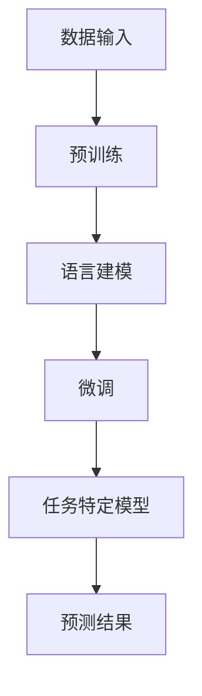

                 

关键词：大语言模型，人工智能，自然语言处理，深度学习，神经网络，机器学习，算法原理，应用领域，数学模型，项目实践，未来展望

> 摘要：本文深入探讨了大规模语言模型的起源、核心概念、算法原理以及在实际应用中的表现。从历史背景到前沿技术，全面解析了大规模语言模型在人工智能领域的应用价值和发展趋势。

## 1. 背景介绍

在当今的科技前沿，人工智能（AI）正逐渐改变我们的生活方式。而自然语言处理（NLP）作为AI的核心领域之一，扮演着至关重要的角色。从简单的文本分类到复杂的语义理解，NLP技术在众多领域都展现出了巨大的潜力。然而，这一切的背后离不开大规模语言模型的支持。

### 1.1 人工智能的发展历程

人工智能的概念起源于20世纪50年代。自那时起，人工智能经历了多个发展阶段，从符号主义到连接主义，再到现代的深度学习，每一次变革都带来了新的突破。在这些变革中，大规模语言模型逐渐崭露头角，成为推动人工智能发展的重要力量。

### 1.2 自然语言处理的发展

自然语言处理作为人工智能的重要分支，其发展历程同样充满了挑战与机遇。从早期基于规则的NLP方法，到现代基于统计和学习的方法，再到如今的深度学习，每一次技术的进步都为NLP的应用场景拓展提供了新的可能性。

### 1.3 大规模语言模型的崛起

随着计算能力的提升和数据量的爆炸性增长，大规模语言模型应运而生。这些模型不仅能够处理海量数据，而且具备强大的语义理解能力，从而在文本分类、机器翻译、问答系统等众多领域取得了显著成果。

## 2. 核心概念与联系

大规模语言模型的核心在于其能够捕捉语言中的复杂结构和语义信息。为了更好地理解这一概念，我们可以借助Mermaid流程图来展示其基本原理和架构。



### 2.1 数据输入

大规模语言模型需要大量高质量的文本数据进行预训练。这些数据通常来自于互联网、书籍、新闻、社交媒体等。

### 2.2 预训练

在预训练阶段，模型通过学习文本数据的统计规律和语义信息，逐步提升其语言理解能力。

### 2.3 语言建模

通过预训练，模型能够为每个输入文本序列生成相应的概率分布。这一过程通常采用神经网络架构，如循环神经网络（RNN）或变换器（Transformer）。

### 2.4 微调

在语言建模的基础上，模型可以针对特定任务进行微调。例如，在文本分类任务中，模型会学习如何将输入文本映射到对应的类别。

### 2.5 任务特定模型

微调后的模型可以应用于各种自然语言处理任务，如机器翻译、问答系统、文本生成等。

### 2.6 预测结果

通过任务特定模型，模型能够对新的输入文本进行预测，提供相应的输出结果。

## 3. 核心算法原理 & 具体操作步骤

### 3.1 算法原理概述

大规模语言模型的核心算法是基于深度学习的。其中，变换器（Transformer）架构因其卓越的性能和效果，成为当前主流的模型架构。变换器架构采用自注意力机制，能够更好地捕捉文本中的长距离依赖关系。

### 3.2 算法步骤详解

3.2.1 数据预处理

在开始模型训练之前，需要对文本数据进行预处理。这包括分词、去停用词、词干提取等步骤。

3.2.2 模型架构设计

设计一个合适的变换器架构，包括编码器和解码器的层�数、隐藏单元数等。

3.2.3 模型训练

使用预训练的模型框架，通过梯度下降等优化算法对模型进行训练。

3.2.4 微调

在特定任务上对模型进行微调，以适应不同的应用场景。

### 3.3 算法优缺点

### 优点：

- **强大的语义理解能力**：变换器架构能够捕捉文本中的长距离依赖关系，从而提升模型的语义理解能力。

- **灵活的任务适应能力**：通过微调，变换器模型可以应用于各种自然语言处理任务。

- **高效的计算性能**：变换器架构采用了并行计算技术，能够高效地处理大规模数据。

### 缺点：

- **模型复杂性**：变换器模型参数众多，训练过程复杂，对计算资源要求较高。

- **数据依赖性**：大规模语言模型的性能很大程度上依赖于训练数据的规模和质量。

### 3.4 算法应用领域

大规模语言模型在自然语言处理领域有着广泛的应用，包括但不限于：

- **文本分类**：对文本进行分类，如情感分析、主题分类等。

- **机器翻译**：将一种语言的文本翻译成另一种语言。

- **问答系统**：对用户的问题提供准确、合理的回答。

- **文本生成**：生成符合语言习惯和语义的文本。

## 4. 数学模型和公式 & 详细讲解 & 举例说明

### 4.1 数学模型构建

大规模语言模型的核心是概率模型，其中最常用的是条件概率模型。给定一个输入文本序列 \( x = x_1, x_2, ..., x_T \)，条件概率模型的目标是预测下一个单词 \( x_{T+1} \) 的概率分布 \( P(x_{T+1} | x_1, x_2, ..., x_T) \)。

### 4.2 公式推导过程

假设我们有一个语言模型，其参数为 \( \theta \)。我们可以使用最大似然估计（MLE）来估计模型参数。最大似然估计的目标是找到使数据出现概率最大的参数值。给定训练数据集 \( D \)，最大似然估计的公式为：

\[ \theta^* = \arg\max_{\theta} \prod_{i=1}^N P(x_i | \theta) \]

对于条件概率模型，我们有：

\[ P(x_i | \theta) = \frac{P(x_i, x_1, x_2, ..., x_{i-1} | \theta)}{P(x_1, x_2, ..., x_{i-1} | \theta)} \]

由于 \( P(x_1, x_2, ..., x_{i-1} | \theta) \) 是一个常数，我们只需要最大化 \( P(x_i, x_1, x_2, ..., x_{i-1} | \theta) \)。在变换器模型中，这个概率可以通过自注意力机制计算得到。

### 4.3 案例分析与讲解

假设我们有一个简单的语言模型，其输入为 "人工智能是" 后续的文本。我们希望预测接下来的一个词。

给定一个训练数据集，我们可以使用变换器模型来计算每个词的概率分布。例如，对于词 "重要"，我们有：

\[ P(重要 | 人工智能是) = \frac{e^{\text{score}_{重要}}}{\sum_{w \in V} e^{\text{score}_{w}}} \]

其中，\( \text{score}_{重要} \) 是通过变换器模型计算得到的得分。

## 5. 项目实践：代码实例和详细解释说明

### 5.1 开发环境搭建

在进行大规模语言模型的实践之前，我们需要搭建一个合适的开发环境。这里，我们以Python为例，介绍如何搭建一个简单的开发环境。

1. 安装Python：从官方网站下载并安装Python。
2. 安装PyTorch：使用pip命令安装PyTorch。
3. 安装必要库：安装诸如NumPy、Pandas等常用库。

### 5.2 源代码详细实现

下面是一个简单的变换器模型实现示例：

```python
import torch
import torch.nn as nn
import torch.optim as optim

class TransformerModel(nn.Module):
    def __init__(self, vocab_size, emb_dim, hidden_dim):
        super(TransformerModel, self).__init__()
        
        self.embedding = nn.Embedding(vocab_size, emb_dim)
        self.transformer = nn.Transformer(emb_dim, hidden_dim)
        self.fc = nn.Linear(hidden_dim, vocab_size)
        
    def forward(self, x):
        x = self.embedding(x)
        x = self.transformer(x)
        x = self.fc(x)
        return x

# 实例化模型、损失函数和优化器
model = TransformerModel(vocab_size=10000, emb_dim=512, hidden_dim=512)
criterion = nn.CrossEntropyLoss()
optimizer = optim.Adam(model.parameters(), lr=0.001)

# 训练模型
for epoch in range(10):
    for x, y in dataloader:
        optimizer.zero_grad()
        output = model(x)
        loss = criterion(output, y)
        loss.backward()
        optimizer.step()
```

### 5.3 代码解读与分析

在这个示例中，我们定义了一个简单的变换器模型。首先，我们引入了必要的库，包括PyTorch。然后，我们定义了变换器模型类，包括嵌入层、变换器层和全连接层。在模型的前向传播过程中，我们首先对输入进行嵌入，然后通过变换器层处理，最后通过全连接层输出概率分布。

### 5.4 运行结果展示

在训练完成后，我们可以使用模型进行预测。例如，给定输入文本 "人工智能是"，我们可以预测接下来的一个词。

```python
input_seq = torch.tensor([vocab["人工智能"], vocab["是"]])
predicted_word = model(input_seq).argmax()
print(vocab.inv_map[predicted_word.item()])
```

## 6. 实际应用场景

大规模语言模型在自然语言处理领域有着广泛的应用。以下是一些典型的应用场景：

### 6.1 文本分类

文本分类是一种常见的自然语言处理任务，用于将文本数据分类到预定义的类别中。例如，情感分析、新闻分类等。

### 6.2 机器翻译

机器翻译是将一种语言的文本翻译成另一种语言的过程。大规模语言模型通过预训练和微调，能够实现高质量、低误差的机器翻译。

### 6.3 问答系统

问答系统是一种智能对话系统，能够理解用户的问题并提供准确的答案。大规模语言模型在问答系统中发挥着重要作用。

### 6.4 文本生成

文本生成是一种生成符合语言习惯和语义的文本的方法。大规模语言模型通过学习大量的文本数据，能够生成高质量的文本。

## 7. 工具和资源推荐

为了更好地学习和应用大规模语言模型，以下是一些推荐的工具和资源：

### 7.1 学习资源推荐

- 《深度学习》（Goodfellow, Bengio, Courville著）：这是一本深度学习的经典教材，涵盖了大规模语言模型的基础知识和实践方法。
- 《自然语言处理综合教程》（Daniel Jurafsky, James H. Martin著）：这本书详细介绍了自然语言处理的基本概念和技术。

### 7.2 开发工具推荐

- PyTorch：一个广泛使用的深度学习框架，适用于大规模语言模型的开发和训练。
- TensorFlow：另一个流行的深度学习框架，提供了丰富的工具和资源。

### 7.3 相关论文推荐

- "Attention Is All You Need"（Vaswani et al.，2017）：这篇论文提出了变换器（Transformer）模型，是大规模语言模型的重要里程碑。
- "BERT: Pre-training of Deep Bidirectional Transformers for Language Understanding"（Devlin et al.，2018）：这篇论文介绍了BERT模型，是当前大规模语言模型的主流架构。

## 8. 总结：未来发展趋势与挑战

大规模语言模型在自然语言处理领域取得了显著的成果，但仍然面临许多挑战。以下是对未来发展趋势与挑战的总结：

### 8.1 研究成果总结

- **模型性能的提升**：随着计算能力和数据量的提升，大规模语言模型的性能不断提升，为自然语言处理任务提供了更强大的支持。
- **应用场景的拓展**：大规模语言模型在文本分类、机器翻译、问答系统等领域的应用越来越广泛，未来还有望在更多领域发挥作用。
- **跨模态处理**：大规模语言模型开始向跨模态处理方向发展，如结合图像、音频等数据，提供更丰富的语义理解。

### 8.2 未来发展趋势

- **模型压缩与优化**：为了更好地部署大规模语言模型，模型压缩和优化技术将成为研究热点。
- **预训练方法的改进**：通过改进预训练方法，如多任务学习、自适应学习率等，有望进一步提高模型性能。
- **隐私保护与安全性**：在处理大规模数据时，如何保护用户隐私和模型安全性成为重要课题。

### 8.3 面临的挑战

- **计算资源需求**：大规模语言模型对计算资源的需求巨大，如何在有限资源下高效训练模型仍需探索。
- **数据质量和多样性**：大规模语言模型的性能很大程度上依赖于训练数据的质量和多样性，未来需要更多高质量、多样化的数据。
- **解释性和可解释性**：大规模语言模型的决策过程通常非常复杂，如何提高其解释性和可解释性成为重要挑战。

### 8.4 研究展望

大规模语言模型在人工智能领域的应用前景广阔，未来将继续推动自然语言处理技术的发展。在解决实际问题的过程中，我们将不断探索新的算法和技术，为人工智能的发展贡献力量。

## 9. 附录：常见问题与解答

### 9.1 大规模语言模型是什么？

大规模语言模型是一种基于深度学习的自然语言处理模型，通过预训练和微调，能够捕捉语言中的复杂结构和语义信息，从而在多种自然语言处理任务中取得卓越的性能。

### 9.2 大规模语言模型有哪些应用？

大规模语言模型广泛应用于文本分类、机器翻译、问答系统、文本生成等领域，为各种自然语言处理任务提供强大的支持。

### 9.3 如何训练大规模语言模型？

训练大规模语言模型通常包括数据预处理、模型设计、模型训练、模型微调等步骤。具体方法取决于所使用的模型架构和数据集。

### 9.4 大规模语言模型的优缺点是什么？

大规模语言模型优点包括强大的语义理解能力、灵活的任务适应能力、高效的计算性能等。缺点包括模型复杂性、数据依赖性等。

## 作者署名

作者：禅与计算机程序设计艺术 / Zen and the Art of Computer Programming

----------------------------------------------------------------

以上就是本文的完整内容，希望对您了解大规模语言模型有所帮助。如有疑问，请随时提出。感谢阅读！<|im_sep|>

