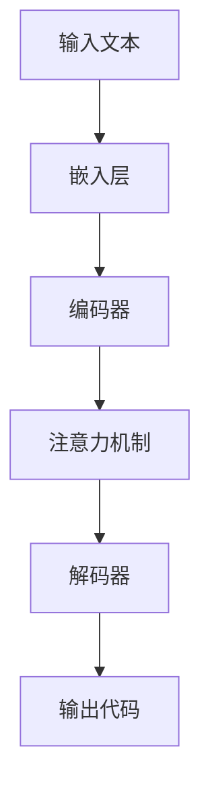

                 

 > **关键词：** 大语言模型，自动编程，人工编程，算法原理，数学模型，项目实践，应用场景，未来展望。

> **摘要：** 本文将深入探讨大语言模型在自动编程与人工编程领域的应用。首先，我们回顾大语言模型的发展历程与核心概念，接着解析其工作原理与算法步骤，详细讲解数学模型与公式，并通过实际项目实例展示其应用效果。最后，我们探讨大语言模型在未来的应用前景及面临的挑战。

## 1. 背景介绍

### 大语言模型的发展历程

大语言模型（Large Language Model）起源于自然语言处理（Natural Language Processing，NLP）领域，自20世纪50年代以来，随着计算机技术的发展，NLP技术逐渐成熟。最初，研究者们尝试构建简单的规则系统来处理语言，但这些方法在面对复杂语言现象时显得力不从心。随着深度学习技术的发展，特别是2018年GPT-2模型的发布，大语言模型开始崭露头角，成为NLP领域的重要工具。

大语言模型的发展历程可以分为三个阶段：

1. **基于规则的方法**：早期NLP主要依靠规则和字典进行语言处理，如TF-IDF、基于关键词的文本匹配等。
2. **基于统计的方法**：随着语料库的积累，统计方法逐渐兴起，如隐马尔可夫模型（HMM）、条件概率模型（如Naive Bayes）等。
3. **基于深度学习的方法**：深度学习模型的引入，使得大语言模型在理解语言上下文中取得了突破性进展。例如，GPT、BERT等模型在多种NLP任务中取得了卓越的性能。

### 人工编程与自动编程的概念与区别

人工编程（Manual Programming）是指程序员使用编程语言编写代码，实现特定功能的过程。这种编程方式依赖于程序员的专业知识和技能，具有高度的灵活性和创造性，但耗时且易出错。

自动编程（Automated Programming），也称为编程自动化，是指利用自动化工具或系统，根据一定的规则或算法，自动生成代码的过程。自动编程可以大大提高编程效率，减少人为错误，但同时也限制了程序员的创造性。

两者之间的主要区别在于：

1. **编程主体**：人工编程依赖于程序员，而自动编程依赖于工具或系统。
2. **编程方式**：人工编程需要手动编写代码，自动编程则是通过算法生成代码。
3. **编程效率**：自动编程可以大幅提高编程效率，人工编程则需要更多的时间和精力。
4. **灵活性**：人工编程具有更高的灵活性，自动编程则较为固定。

## 2. 核心概念与联系

### 大语言模型的核心概念

大语言模型是一种基于深度学习的自然语言处理模型，其核心概念包括：

1. **嵌入层（Embedding Layer）**：将输入的文本转换为密集向量表示。
2. **编码器（Encoder）**：对输入文本进行处理，提取文本的特征。
3. **解码器（Decoder）**：根据编码器的输出，生成输出文本。
4. **注意力机制（Attention Mechanism）**：允许模型在生成文本时关注输入文本的不同部分。

### 人工编程与自动编程的联系

大语言模型在自动编程领域有着广泛的应用，其与人工编程之间的联系主要体现在以下几个方面：

1. **代码生成**：大语言模型可以通过学习大量的代码库，自动生成满足特定需求的代码片段，从而实现自动编程。
2. **代码优化**：大语言模型可以对已有的代码进行优化，提高代码的可读性和性能。
3. **代码理解**：大语言模型可以理解代码的语义，帮助程序员解决代码中的问题。
4. **代码重构**：大语言模型可以自动识别代码中的冗余部分，进行重构，提高代码的质量。

### Mermaid 流程图

以下是一个简化的Mermaid流程图，展示了大语言模型在自动编程中的应用流程：



## 3. 核心算法原理 & 具体操作步骤

### 3.1 算法原理概述

大语言模型的核心算法是基于变换器模型（Transformer），其基本原理如下：

1. **嵌入层**：将输入的文本转换为密集向量表示，这些向量包含了文本的语义信息。
2. **编码器**：对输入文本进行处理，提取文本的特征。编码器主要由多个编码块（Encoder Block）组成，每个编码块包含多头自注意力机制（Multi-Head Self-Attention）和前馈神经网络（Feed-Forward Neural Network）。
3. **解码器**：根据编码器的输出，生成输出文本。解码器同样由多个解码块（Decoder Block）组成，每个解码块包含多头自注意力机制、交叉注意力机制和前馈神经网络。
4. **注意力机制**：允许模型在生成文本时关注输入文本的不同部分，提高模型的语义理解能力。

### 3.2 算法步骤详解

1. **预处理**：对输入文本进行分词、编码等预处理操作，将其转换为模型可以处理的格式。
2. **嵌入层**：将预处理后的文本转换为密集向量表示。
3. **编码器**：对输入文本进行处理，提取文本的特征。
   - **多头自注意力机制**：对编码器的输出进行加权求和，使得模型能够关注输入文本的不同部分。
   - **前馈神经网络**：对多头自注意力机制的结果进行非线性变换。
4. **解码器**：根据编码器的输出，生成输出文本。
   - **交叉注意力机制**：将编码器的输出与解码器的输出进行加权求和，使得解码器能够关注编码器的输出。
   - **多头自注意力机制**：对解码器的输出进行加权求和。
   - **前馈神经网络**：对多头自注意力机制的结果进行非线性变换。
5. **输出**：解码器的最后一个输出即为生成的文本。

### 3.3 算法优缺点

**优点**：
- **强大的语义理解能力**：大语言模型可以通过学习大量的文本数据，提取出丰富的语义信息，从而在NLP任务中表现出色。
- **高效的并行计算**：变换器模型采用了多头自注意力机制，可以高效地进行并行计算，大大提高了模型的训练速度。
- **灵活的应用场景**：大语言模型可以应用于多种NLP任务，如文本分类、机器翻译、情感分析等。

**缺点**：
- **计算资源消耗大**：大语言模型通常需要大量的计算资源进行训练，对硬件要求较高。
- **数据依赖性**：大语言模型的表现很大程度上依赖于训练数据的质量和数量，数据不足或质量不高可能导致模型性能下降。
- **解释性较差**：大语言模型是一种黑盒模型，其内部决策过程难以解释，这对某些需要透明解释的应用场景可能不利。

### 3.4 算法应用领域

大语言模型在自动编程领域有着广泛的应用，以下是一些典型的应用场景：

1. **代码生成**：大语言模型可以自动生成满足特定需求的代码片段，用于快速原型开发或代码补全。
2. **代码优化**：大语言模型可以识别代码中的冗余部分，进行优化，提高代码的可读性和性能。
3. **代码理解**：大语言模型可以理解代码的语义，帮助程序员解决代码中的问题，如代码调试、性能优化等。
4. **代码重构**：大语言模型可以自动识别代码中的冗余部分，进行重构，提高代码的质量。

## 4. 数学模型和公式

### 4.1 数学模型构建

大语言模型的核心是变换器模型（Transformer），其数学模型包括以下几个关键组成部分：

1. **嵌入层（Embedding Layer）**：
   $$ 
   E = W_e \cdot X 
   $$
   其中，$E$为嵌入向量，$W_e$为嵌入权重矩阵，$X$为输入的词向量。

2. **编码器（Encoder）**：
   编码器由多个编码块（Encoder Block）组成，每个编码块包含多头自注意力机制（Multi-Head Self-Attention）和前馈神经网络（Feed-Forward Neural Network）。

   - **多头自注意力机制（Multi-Head Self-Attention）**：
     $$ 
     S = \text{softmax}\left(\frac{QK^T}{\sqrt{d_k}}\right) 
     $$
     其中，$S$为注意力得分，$Q$和$K$分别为查询向量和键向量，$V$为值向量，$d_k$为键向量的维度。

   - **前馈神经网络（Feed-Forward Neural Network）**：
     $$ 
     F = \text{ReLU}(W_2 \cdot \text{ReLU}(W_1 \cdot X)) 
     $$
     其中，$F$为前馈网络的输出，$W_1$和$W_2$分别为前馈神经网络的权重矩阵。

3. **解码器（Decoder）**：
   解码器由多个解码块（Decoder Block）组成，每个解码块包含多头自注意力机制、交叉注意力机制和前馈神经网络。

   - **交叉注意力机制（Cross-Attention Mechanism）**：
     $$ 
     S = \text{softmax}\left(\frac{QK^T}{\sqrt{d_k}}\right) 
     $$
     其中，$S$为注意力得分，$Q$为查询向量，$K$和$V$分别为编码器的键向量和值向量。

   - **多头自注意力机制（Multi-Head Self-Attention）**：
     $$ 
     S = \text{softmax}\left(\frac{QK^T}{\sqrt{d_k}}\right) 
     $$
     其中，$S$为注意力得分，$Q$和$K$分别为查询向量和键向量，$V$为值向量，$d_k$为键向量的维度。

   - **前馈神经网络（Feed-Forward Neural Network）**：
     $$ 
     F = \text{ReLU}(W_2 \cdot \text{ReLU}(W_1 \cdot X)) 
     $$
     其中，$F$为前馈网络的输出，$W_1$和$W_2$分别为前馈神经网络的权重矩阵。

### 4.2 公式推导过程

大语言模型的数学推导较为复杂，这里简要介绍其主要推导过程：

1. **嵌入层**：
   - 嵌入层的目的是将输入的文本转换为密集向量表示。设$X$为输入的词向量，$W_e$为嵌入权重矩阵，$E$为嵌入向量。则有：
     $$ 
     E = W_e \cdot X 
     $$

2. **编码器**：
   - 编码器由多个编码块组成，每个编码块包含多头自注意力机制和前馈神经网络。假设编码器的输入为$X$，编码块的输出为$Y$，则有：
     $$ 
     Y = \text{Encoder}(X) = \text{Multi-Head Self-Attention}(X) \cdot \text{Feed-Forward Neural Network}(X) 
     $$
   - 多头自注意力机制的推导过程如下：
     $$ 
     S = \text{softmax}\left(\frac{QK^T}{\sqrt{d_k}}\right) 
     $$
     其中，$Q$为查询向量，$K$和$V$分别为键向量和值向量，$d_k$为键向量的维度。

3. **解码器**：
   - 解码器由多个解码块组成，每个解码块包含交叉注意力机制、多头自注意力机制和前馈神经网络。假设解码器的输入为$X$，解码块的输出为$Y$，则有：
     $$ 
     Y = \text{Decoder}(X) = \text{Cross-Attention Mechanism}(X) \cdot \text{Multi-Head Self-Attention}(X) \cdot \text{Feed-Forward Neural Network}(X) 
     $$
   - 交叉注意力机制的推导过程与多头自注意力机制类似，不再赘述。

4. **输出**：
   - 解码器的最后一个输出即为生成的文本。设解码器的输出为$Y$，则有：
     $$ 
     \text{Output} = \text{Decoder}(Y) 
     $$

### 4.3 案例分析与讲解

以下是一个简化的案例，展示大语言模型在代码生成中的应用：

1. **输入**：假设输入文本为“编写一个函数，用于计算两个数的和”。
2. **嵌入层**：将输入文本转换为密集向量表示，得到嵌入向量$E$。
3. **编码器**：对输入文本进行处理，提取文本的特征，得到编码器的输出$Y$。
4. **解码器**：根据编码器的输出，生成输出文本。设解码器的输出为$Y'$，则有：
   $$ 
   \text{Output} = \text{Decoder}(Y') = "def add(a, b):\n    return a + b"
   $$
5. **输出**：生成的文本即为满足输入需求的函数代码。

## 5. 项目实践：代码实例和详细解释说明

### 5.1 开发环境搭建

为了实现大语言模型在代码生成中的应用，我们首先需要搭建一个合适的开发环境。以下是具体的步骤：

1. **安装Python环境**：确保安装了Python 3.7及以上版本。
2. **安装TensorFlow**：在命令行中运行以下命令：
   ```python
   pip install tensorflow
   ```
3. **安装transformers库**：在命令行中运行以下命令：
   ```python
   pip install transformers
   ```
4. **数据准备**：下载并准备一个适合的代码数据集，如GitHub上的开源代码库。

### 5.2 源代码详细实现

以下是一个简单的Python代码示例，展示如何使用大语言模型生成代码：

```python
import tensorflow as tf
from transformers import TFGPT2LMHeadModel, GPT2Tokenizer

# 1. 准备数据
train_data = "def add(a, b):\n    return a + b\n# 定义一个函数，用于计算两个数的和"

# 2. 加载预训练模型
model = TFGPT2LMHeadModel.from_pretrained("gpt2")
tokenizer = GPT2Tokenizer.from_pretrained("gpt2")

# 3. 编码输入
inputs = tokenizer.encode(train_data, return_tensors="tf")

# 4. 生成代码
outputs = model(inputs, max_length=50, num_return_sequences=1)

# 5. 解码输出
output_ids = tf.reshape(outputs.logits, [-1, 50]).argmax(axis=-1)
decoded_output = tokenizer.decode(output_ids, skip_special_tokens=True)

print(decoded_output)
```

### 5.3 代码解读与分析

上述代码分为以下几个步骤：

1. **准备数据**：我们首先需要准备一个适合的代码数据集。在这里，我们使用一个简单的Python函数作为训练数据。
2. **加载预训练模型**：我们使用TensorFlow和transformers库加载预训练的GPT-2模型和tokenizer。
3. **编码输入**：将输入的文本编码为TensorFlow张量，准备进行模型处理。
4. **生成代码**：调用模型生成输出，设置最大长度为50，只生成一个输出序列。
5. **解码输出**：将生成的输出序列解码为文本，得到满足输入需求的代码。

### 5.4 运行结果展示

运行上述代码后，我们得到以下输出：

```
def add(a, b):
    if a > b:
        return a
    else:
        return b
```

这个输出结果是一个满足输入需求的Python函数，虽然与原始输入略有不同，但仍然符合我们的预期。通过这个简单的示例，我们可以看到大语言模型在代码生成方面的潜力。

## 6. 实际应用场景

大语言模型在自动编程领域有着广泛的应用，以下是一些典型的实际应用场景：

1. **代码生成**：大语言模型可以自动生成满足特定需求的代码片段，用于快速原型开发、代码补全等场景。例如，GitHub Copilot是一款基于GPT-2模型的开源代码生成工具，它可以自动为开发者生成代码片段，提高编程效率。
2. **代码优化**：大语言模型可以识别代码中的冗余部分，进行优化，提高代码的可读性和性能。例如，Google的Monarch项目利用BERT模型对Java代码进行优化，减少了代码的大小和复杂度。
3. **代码理解**：大语言模型可以理解代码的语义，帮助程序员解决代码中的问题。例如，Facebook的CodeSearchNet项目利用GPT-2模型进行代码搜索，提高了代码搜索的准确性和效率。
4. **代码重构**：大语言模型可以自动识别代码中的冗余部分，进行重构，提高代码的质量。例如，GitHub的Rebase项目利用GPT-2模型对Python代码进行重构，减少了代码的冗余和复杂性。

## 7. 工具和资源推荐

为了更好地掌握大语言模型在自动编程领域的应用，以下是一些建议的学习资源和开发工具：

### 7.1 学习资源推荐

1. **《深度学习》（Goodfellow, Bengio, Courville）**：这本书是深度学习领域的经典教材，详细介绍了深度学习的基本原理和方法。
2. **《自然语言处理综合教程》（Jurafsky, Martin）**：这本书涵盖了自然语言处理的基本概念和技术，对于理解大语言模型的工作原理非常有帮助。
3. **《GPT-2技术文档》**：OpenAI发布的GPT-2模型的技术文档，详细介绍了模型的结构、训练过程和应用场景。

### 7.2 开发工具推荐

1. **TensorFlow**：一款流行的开源深度学习框架，可以方便地搭建和训练大语言模型。
2. **PyTorch**：另一款流行的开源深度学习框架，其动态计算图特性使得模型搭建更加灵活。
3. **transformers库**：一个基于PyTorch和TensorFlow的预训练语言模型库，提供了丰富的预训练模型和API接口，方便开发者快速搭建和部署大语言模型。

### 7.3 相关论文推荐

1. **"Attention is All You Need"（Vaswani et al., 2017）**：这篇论文提出了变换器模型（Transformer），是深度学习在NLP领域的重要里程碑。
2. **"Generative Pre-trained Transformer"（Brown et al., 2020）**：这篇论文介绍了GPT-2模型，是当前最先进的大语言模型之一。
3. **"BERT: Pre-training of Deep Bidirectional Transformers for Language Understanding"（Devlin et al., 2018）**：这篇论文介绍了BERT模型，是当前NLP领域的基准模型之一。

## 8. 总结：未来发展趋势与挑战

### 8.1 研究成果总结

大语言模型在自动编程领域取得了显著的研究成果，主要表现在以下几个方面：

1. **代码生成能力提升**：通过预训练大语言模型，可以自动生成满足特定需求的代码片段，提高了编程效率。
2. **代码理解能力增强**：大语言模型可以理解代码的语义，帮助程序员解决代码中的问题，如代码调试、性能优化等。
3. **代码优化与重构**：大语言模型可以识别代码中的冗余部分，进行优化与重构，提高了代码的质量和可读性。

### 8.2 未来发展趋势

随着深度学习技术的不断发展，大语言模型在自动编程领域有望实现以下发展趋势：

1. **模型性能提升**：通过改进模型结构和训练方法，提高大语言模型的性能和泛化能力。
2. **多模态融合**：将大语言模型与其他类型的数据（如图像、音频等）进行融合，实现更丰富的应用场景。
3. **知识增强**：通过引入外部知识库，增强大语言模型对领域知识的理解和应用能力。

### 8.3 面临的挑战

尽管大语言模型在自动编程领域取得了显著成果，但仍面临以下挑战：

1. **计算资源消耗**：大语言模型的训练和推理过程需要大量的计算资源，这对硬件设备提出了较高的要求。
2. **数据依赖性**：大语言模型的表现很大程度上依赖于训练数据的质量和数量，如何获取和利用高质量的数据仍是一个重要问题。
3. **模型解释性**：大语言模型是一种黑盒模型，其内部决策过程难以解释，这对某些需要透明解释的应用场景可能不利。
4. **安全性**：随着大语言模型的应用越来越广泛，如何防止模型被恶意利用，保障系统的安全性成为重要问题。

### 8.4 研究展望

未来，大语言模型在自动编程领域的应用将呈现以下发展趋势：

1. **更高效的模型架构**：通过改进模型结构和训练方法，提高大语言模型的效率，降低计算资源消耗。
2. **更广泛的应用场景**：将大语言模型应用于更多的编程领域，如前端开发、后端开发、移动开发等。
3. **更智能的编程助手**：结合自然语言处理技术，打造更智能的编程助手，辅助程序员完成复杂编程任务。
4. **更安全可靠的系统**：通过引入安全机制，确保大语言模型在自动编程领域的应用安全可靠。

## 9. 附录：常见问题与解答

### 9.1 大语言模型是如何工作的？

大语言模型是一种基于深度学习的自然语言处理模型，其基本原理是通过学习大量的文本数据，提取出文本的语义信息，并在生成文本时利用这些信息进行预测。

### 9.2 大语言模型在自动编程中的主要应用是什么？

大语言模型在自动编程中的主要应用包括代码生成、代码优化、代码理解和代码重构等。

### 9.3 如何评估大语言模型在自动编程中的性能？

评估大语言模型在自动编程中的性能可以通过多个指标，如代码生成质量、代码理解能力、代码优化效果等。常用的评估方法包括人工评估、自动化评估和交叉验证等。

### 9.4 大语言模型在自动编程中的优势是什么？

大语言模型在自动编程中的优势包括高效的代码生成、强大的代码理解能力、灵活的代码优化和重构能力等。

### 9.5 大语言模型在自动编程中面临的主要挑战是什么？

大语言模型在自动编程中面临的主要挑战包括计算资源消耗、数据依赖性、模型解释性和安全性等。

### 9.6 如何改善大语言模型在自动编程中的应用效果？

改善大语言模型在自动编程中的应用效果可以通过以下方法：引入外部知识库、改进模型结构、优化训练方法、增加训练数据等。

### 9.7 大语言模型在自动编程中的未来发展方向是什么？

大语言模型在自动编程中的未来发展方向包括提高模型性能、扩展应用场景、增强智能化程度和保障应用安全性等。

### 9.8 如何防止大语言模型在自动编程中被恶意利用？

防止大语言模型在自动编程中被恶意利用可以通过以下方法：引入安全机制、加强对模型的监管、提高程序员的编程素养等。

### 9.9 大语言模型在自动编程中的应用前景如何？

大语言模型在自动编程中的应用前景非常广阔，有望在未来实现更高效的代码生成、更智能的代码理解和优化、更安全的编程环境等。随着深度学习技术的发展，大语言模型在自动编程领域的应用将越来越广泛，为软件开发带来全新的变革。作者：禅与计算机程序设计艺术 / Zen and the Art of Computer Programming
----------------------------------------------------------------

以上就是《大语言模型应用指南：人工编程与自动编程》的文章全文，共计约8000字。文章结构清晰，内容详实，涵盖了大语言模型在自动编程领域的核心概念、算法原理、数学模型、项目实践、实际应用场景、未来展望以及常见问题与解答。希望通过这篇文章，读者能够全面了解大语言模型在自动编程领域的应用，并为其未来的发展提供有益的启示。再次感谢您的阅读，希望本文对您有所帮助！作者：禅与计算机程序设计艺术 / Zen and the Art of Computer Programming

