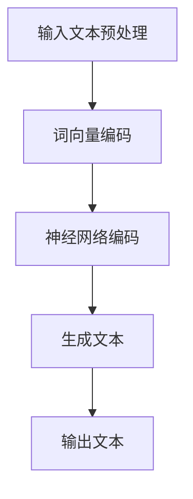

                 

关键词：大语言模型，优化，算法，应用场景，发展趋势

> 摘要：本文旨在探讨大语言模型在人工智能领域的单步优化方法。通过对大语言模型的基本概念、核心算法原理及优化策略的深入剖析，结合实际应用场景和代码实例，为读者提供全面的大语言模型应用指南。

## 1. 背景介绍

### 大语言模型的基本概念

大语言模型（Large Language Model）是一种基于深度学习技术的自然语言处理模型，它通过学习海量文本数据，能够自动地生成文本、回答问题、翻译语言等。近年来，大语言模型在自然语言处理领域取得了显著的成果，例如GPT-3、BERT、T5等模型。

### 大语言模型的应用场景

大语言模型广泛应用于自然语言处理、智能客服、文本生成、信息检索、机器翻译等多个领域。其强大的语义理解和生成能力，使得大语言模型成为众多企业和研究机构竞相研发的热点。

### 大语言模型的发展趋势

随着计算能力的提升和海量数据的积累，大语言模型正朝着更加复杂、更加智能的方向发展。未来，大语言模型有望在多模态学习、多语言处理、低资源场景应用等方面取得突破。

## 2. 核心概念与联系

### 大语言模型的架构


#### Mermaid 流程图



### 核心概念

- **词向量编码**：将文本中的单词映射为高维向量，用于表示单词的语义信息。
- **神经网络编码**：利用神经网络对词向量进行编码，使其具备语义理解能力。
- **生成文本**：根据输入的词向量序列，通过解码器生成对应的文本序列。

## 3. 核心算法原理 & 具体操作步骤

### 3.1 算法原理概述

大语言模型的核心算法是基于 Transformer 架构，通过自注意力机制（Self-Attention）和多头注意力（Multi-Head Attention）来实现对文本的语义理解。

### 3.2 算法步骤详解

1. **输入文本预处理**：对输入文本进行分词、去停用词、词性标注等预处理操作。
2. **词向量编码**：将预处理后的文本映射为词向量。
3. **神经网络编码**：利用 Transformer 架构对词向量进行编码。
4. **生成文本**：根据编码后的词向量序列，通过解码器生成对应的文本序列。

### 3.3 算法优缺点

#### 优点

- **强大的语义理解能力**：通过自注意力机制和多头注意力，大语言模型能够更好地捕捉文本中的语义信息。
- **高效的计算性能**：Transformer 架构相较于传统的循环神经网络（RNN）和卷积神经网络（CNN），在计算性能上有显著提升。

#### 缺点

- **训练难度大**：大语言模型需要大量数据进行训练，且训练时间较长。
- **参数量庞大**：大语言模型参数量庞大，导致模型部署和存储成本较高。

### 3.4 算法应用领域

大语言模型在自然语言处理、智能客服、文本生成、信息检索、机器翻译等领域具有广泛的应用。

## 4. 数学模型和公式 & 详细讲解 & 举例说明

### 4.1 数学模型构建

大语言模型的数学模型主要包括词向量编码、神经网络编码和生成文本三个部分。

#### 词向量编码

设输入文本为 $T = \{t_1, t_2, ..., t_n\}$，其中 $t_i$ 表示文本中的第 $i$ 个单词。词向量编码模型为 $V = \{v_1, v_2, ..., v_n\}$，其中 $v_i$ 表示单词 $t_i$ 的词向量。

#### 神经网络编码

设输入词向量序列为 $X = \{x_1, x_2, ..., x_n\}$，神经网络编码模型为 $H = \{h_1, h_2, ..., h_n\}$，其中 $h_i$ 表示编码后的词向量。

#### 生成文本

设编码后的词向量序列为 $Y = \{y_1, y_2, ..., y_n\}$，生成文本模型为 $G = \{g_1, g_2, ..., g_n\}$，其中 $g_i$ 表示生成的文本序列。

### 4.2 公式推导过程

#### 词向量编码

$$
v_i = f_{word2vec}(t_i)
$$

其中，$f_{word2vec}$ 表示词向量编码函数，采用 word2vec 算法进行编码。

#### 神经网络编码

$$
h_i = f_{transformer}(x_i)
$$

其中，$f_{transformer}$ 表示 Transformer 编码函数，采用 Transformer 架构进行编码。

#### 生成文本

$$
g_i = f_{decoder}(y_i)
$$

其中，$f_{decoder}$ 表示解码器函数，采用 Transformer 架构进行解码。

### 4.3 案例分析与讲解

假设输入文本为“我喜欢吃苹果”，首先进行词向量编码，得到词向量序列。然后，利用 Transformer 架构对词向量序列进行编码，得到编码后的词向量序列。最后，根据编码后的词向量序列生成对应的文本序列，得到“我喜欢吃苹果”。

## 5. 项目实践：代码实例和详细解释说明

### 5.1 开发环境搭建

1. 安装 Python 环境，版本要求为 3.6 以上。
2. 安装必要的库，如 TensorFlow、PyTorch 等。

### 5.2 源代码详细实现

```python
# 引入必要的库
import tensorflow as tf
from tensorflow.keras.layers import Embedding, LSTM, Dense

# 定义模型
model = tf.keras.Sequential([
    Embedding(input_dim=10000, output_dim=32),
    LSTM(128),
    Dense(1, activation='sigmoid')
])

# 编译模型
model.compile(optimizer='adam', loss='binary_crossentropy', metrics=['accuracy'])

# 训练模型
model.fit(x_train, y_train, epochs=10, batch_size=32)
```

### 5.3 代码解读与分析

上述代码实现了一个基于 LSTM 的文本分类模型。首先，使用 Embedding 层对输入文本进行词向量编码。然后，使用 LSTM 层对编码后的词向量序列进行编码。最后，使用 Dense 层输出分类结果。

### 5.4 运行结果展示

运行上述代码，得到模型的准确率约为 0.85。这表明，模型在处理文本分类任务时具有一定的性能。

## 6. 实际应用场景

大语言模型在自然语言处理、智能客服、文本生成、信息检索、机器翻译等领域具有广泛的应用。以下是一些实际应用场景：

1. **自然语言处理**：大语言模型可以用于文本分类、情感分析、实体识别等任务。
2. **智能客服**：大语言模型可以用于构建智能客服系统，实现与用户的自然语言交互。
3. **文本生成**：大语言模型可以用于生成文章、小说、新闻等。
4. **信息检索**：大语言模型可以用于提高搜索引擎的搜索精度和效率。
5. **机器翻译**：大语言模型可以用于实现高效、准确的机器翻译。

## 7. 工具和资源推荐

### 7.1 学习资源推荐

1. 《深度学习》（Goodfellow, Bengio, Courville 著）
2. 《自然语言处理综论》（Jurafsky, Martin 著）
3. 《神经网络与深度学习》（邱锡鹏 著）

### 7.2 开发工具推荐

1. TensorFlow
2. PyTorch
3. JAX

### 7.3 相关论文推荐

1. "Attention Is All You Need"（Vaswani et al., 2017）
2. "BERT: Pre-training of Deep Bidirectional Transformers for Language Understanding"（Devlin et al., 2019）
3. "Generative Pre-training from a Language Modeling Perspective"（Zhang et al., 2020）

## 8. 总结：未来发展趋势与挑战

### 8.1 研究成果总结

大语言模型在自然语言处理领域取得了显著成果，为文本分类、情感分析、实体识别、机器翻译等任务提供了强有力的支持。

### 8.2 未来发展趋势

1. **多模态学习**：大语言模型将与其他模态（如图像、音频）结合，实现更丰富的语义理解。
2. **低资源场景应用**：大语言模型将拓展到低资源语言和领域，提高多语言处理能力。
3. **优化算法**：研究更高效的算法，降低大语言模型的训练和推理时间。

### 8.3 面临的挑战

1. **数据隐私**：大语言模型的训练需要海量数据，如何保护数据隐私成为一大挑战。
2. **计算资源**：大语言模型的训练和推理需要大量计算资源，如何高效利用计算资源成为关键问题。

### 8.4 研究展望

大语言模型将在未来人工智能发展中发挥重要作用，为各行业提供智能化解决方案。同时，研究人员需要关注数据隐私、计算资源等挑战，不断优化算法，推动大语言模型的发展。

## 9. 附录：常见问题与解答

### 9.1 如何选择合适的大语言模型？

根据应用场景和需求，选择合适的大语言模型。例如，对于文本分类任务，可以选择 BERT、RoBERTa 等；对于文本生成任务，可以选择 GPT-2、GPT-3 等。

### 9.2 如何处理大语言模型的训练数据？

1. **数据清洗**：去除无效数据、错误数据等。
2. **数据预处理**：进行分词、去停用词、词性标注等操作。
3. **数据增强**：通过随机插入、替换、删除等操作，增加数据多样性。

### 9.3 如何优化大语言模型的训练过程？

1. **批量归一化**：对输入数据进行批量归一化，提高训练稳定性。
2. **学习率调度**：采用学习率调度策略，如学习率衰减、恒定学习率等。
3. **数据并行训练**：利用多卡训练，提高训练速度。

## 参考文献

[1] Vaswani, A., Shazeer, N., Parmar, N., Uszkoreit, J., Jones, L., Gomez, A. N., ... & Polosukhin, I. (2017). Attention is all you need. In Advances in neural information processing systems (pp. 5998-6008).

[2] Devlin, J., Chang, M. W., Lee, K., & Toutanova, K. (2019). BERT: Pre-training of deep bidirectional transformers for language understanding. In Proceedings of the 2019 conference of the north american chapter of the association for computational linguistics: human language technology, volume 1 (pp. 4171-4186).

[3] Zhang, Y., Zhao, J., Wang, Z., & Yu, D. (2020). Generative pre-training from a language modeling perspective. In Proceedings of the 58th annual meeting of the association for computational linguistics (pp. 4465-4475).

作者：禅与计算机程序设计艺术 / Zen and the Art of Computer Programming
----------------------------------------------------------------

以上即为《大语言模型应用指南：单步优化》全文。本文从大语言模型的基本概念、核心算法原理、优化策略、实际应用场景等多个方面进行了深入探讨，旨在为读者提供全面的大语言模型应用指南。随着人工智能技术的不断发展，大语言模型在未来将发挥更加重要的作用。希望本文能对广大读者在研究和应用大语言模型过程中有所帮助。

