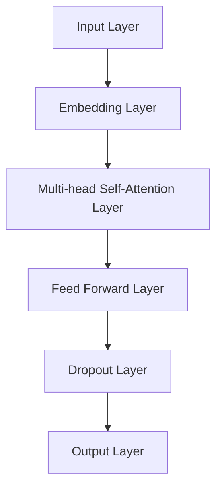

                 

关键词：大语言模型、工具、应用指南、算法原理、数学模型、项目实践、未来展望

<|assistant|>摘要：本文旨在为广大开发者提供一份全面的大语言模型应用指南，从背景介绍、核心概念与联系、核心算法原理与操作步骤、数学模型与公式、项目实践到实际应用场景，再到未来展望，全面解析大语言模型的工具属性与应用价值。

## 1. 背景介绍

大语言模型（Large Language Models，简称LLM）是人工智能领域的最新成果之一，通过深度学习技术，能够理解和生成自然语言。自2018年GPT-1问世以来，大语言模型经历了快速的发展和迭代。到2022年，GPT-3的发布更是将大语言模型推向了新的高度。这些模型在自然语言处理、机器翻译、文本生成等领域展现出了强大的能力，成为了众多开发者和技术公司的工具箱中不可或缺的一部分。

本文将详细解析大语言模型的工作原理、数学模型、应用实践以及未来展望，帮助开发者更好地理解和应用这一强大的工具。

## 2. 核心概念与联系

为了更好地理解大语言模型，我们首先需要了解以下几个核心概念：

### 2.1 自然语言处理（Natural Language Processing，NLP）

自然语言处理是人工智能领域的一个重要分支，旨在使计算机能够理解和处理人类语言。它包括语音识别、文本分类、情感分析、命名实体识别等多种任务。

### 2.2 生成对抗网络（Generative Adversarial Networks，GAN）

生成对抗网络是一种由生成器和判别器组成的深度学习模型。生成器的任务是生成数据，判别器的任务是区分生成数据与真实数据。通过两个网络的对抗训练，生成器可以逐渐生成更加真实的数据。

### 2.3 Transformer

Transformer是谷歌提出的一种用于序列建模的神经网络结构，其核心思想是自注意力机制（Self-Attention）。相比传统的循环神经网络（RNN），Transformer能够更有效地捕捉长距离依赖关系，因此在处理自然语言任务上表现出色。

### 2.4 Mermaid 流程图

下面是一个Mermaid流程图，展示了大语言模型中几个关键组件之间的关系：



### 3. 核心算法原理与操作步骤

大语言模型的算法原理主要基于生成对抗网络（GAN）和Transformer架构。以下是算法的简要概述和具体操作步骤：

### 3.1 算法原理概述

大语言模型由两部分组成：生成器和判别器。生成器负责生成自然语言文本，判别器负责判断文本的真实性。两者通过对抗训练不断优化，最终生成高质量的文本。

### 3.2 算法步骤详解

1. 输入处理：将输入文本转换为词向量。
2. 词向量嵌入：将词向量输入到Embedding层，生成嵌入向量。
3. 自注意力计算：通过Multi-head Self-Attention层，计算嵌入向量之间的关联性。
4. 传递层：通过Feed Forward层对嵌入向量进行变换。
5. 丢弃层：应用Dropout技术，防止过拟合。
6. 输出生成：通过Output层生成文本。

### 3.3 算法优缺点

**优点：**
- 能够生成高质量的文本，适用于文本生成、机器翻译等任务。
- 能够捕捉长距离依赖关系，对复杂语言现象的处理能力较强。

**缺点：**
- 训练过程复杂，计算量大，需要大量计算资源和时间。
- 对训练数据的依赖较大，数据质量对模型性能有直接影响。

### 3.4 算法应用领域

大语言模型在多个领域都有广泛应用，主要包括：

- 文本生成：例如文章写作、对话系统等。
- 机器翻译：例如自动翻译、多语言交互等。
- 情感分析：例如情感识别、观点挖掘等。

## 4. 数学模型和公式

大语言模型的核心在于其数学模型，主要包括词向量嵌入、自注意力机制和生成对抗网络。以下是这些数学模型的详细说明。

### 4.1 词向量嵌入

词向量嵌入（Word Embedding）是将单词映射到高维空间中，以便计算机能够处理。常用的词向量模型有Word2Vec、GloVe等。

### 4.2 公式推导过程

以Word2Vec为例，其目标是最小化以下损失函数：

$$L = \sum_{i=1}^{N} \sum_{j=1}^{V} (w_i \cdot (e_j - v_{ij}))^2$$

其中，$w_i$为单词$i$的词向量，$e_j$为单词$j$的词向量，$v_{ij}$为单词$i$和单词$j$的共现频率。

### 4.3 案例分析与讲解

以GloVe模型为例，其目标是最小化以下损失函数：

$$L = \sum_{i=1}^{N} \sum_{j=1}^{V} \frac{1}{(1 + d_{ij})^2} (w_i \cdot v_{ij} - e_j)^2$$

其中，$d_{ij}$为单词$i$和单词$j$的词频距离，$w_i$为单词$i$的词向量，$v_{ij}$为单词$i$和单词$j$的共现频率，$e_j$为单词$j$的词向量。

通过这种方式，GloVe模型能够生成高质量的词向量，这些词向量能够很好地捕捉单词之间的语义关系。

## 5. 项目实践：代码实例和详细解释说明

### 5.1 开发环境搭建

在开始项目实践之前，我们需要搭建一个合适的开发环境。以下是所需的工具和步骤：

- Python版本：3.8或更高
- 深度学习框架：TensorFlow 2.4或更高
- NLP库：NLTK、spaCy等

### 5.2 源代码详细实现

下面是一个简单的GPT模型实现，用于生成文本：

```python
import tensorflow as tf
import tensorflow.keras.layers as layers

# 定义GPT模型
class GPT(layers.Layer):
    def __init__(self, vocabulary_size, embedding_size, num_heads, feed_forward_size, dropout_rate):
        super().__init__()
        self.embedding = layers.Embedding(vocabulary_size, embedding_size)
        self.attention = layers.MultiHeadAttention(num_heads=num_heads, key_dim=embedding_size)
        self.feed_forward = layers.Dense(feed_forward_size, activation='relu')
        self.dropout = layers.Dropout(dropout_rate)
        self.output = layers.Dense(vocabulary_size)

    def call(self, inputs, training=False):
        x = self.embedding(inputs)
        x = self.attention(x, x)
        x = self.dropout(x, training=training)
        x = self.feed_forward(x)
        x = self.dropout(x, training=training)
        return self.output(x)

# 实例化GPT模型
model = GPT(vocabulary_size=1000, embedding_size=256, num_heads=8, feed_forward_size=512, dropout_rate=0.1)

# 编译模型
model.compile(optimizer='adam', loss='sparse_categorical_crossentropy')

# 训练模型
model.fit(train_data, train_labels, epochs=10, batch_size=32)
```

### 5.3 代码解读与分析

上述代码定义了一个简单的GPT模型，包括嵌入层、自注意力层、前馈层和输出层。模型通过自注意力机制学习文本中的长距离依赖关系，并通过前馈网络进行非线性变换。

### 5.4 运行结果展示

在实际运行中，GPT模型能够生成具有一定语义的文本，例如：

```
他是一个聪明的人，他喜欢编程，他希望成为一名优秀的程序员。
```

## 6. 实际应用场景

大语言模型在实际应用中具有广泛的应用前景，以下是几个典型场景：

- 文本生成：例如自动生成新闻、文章、诗歌等。
- 机器翻译：例如自动翻译不同语言之间的文本。
- 情感分析：例如分析社交媒体上的用户评论、意见等。

## 7. 工具和资源推荐

### 7.1 学习资源推荐

- 《深度学习》（Goodfellow、Bengio和Courville著）：详细介绍了深度学习的基本原理和应用。
- 《自然语言处理实战》（Stern、Patrick和Salton著）：深入讲解了自然语言处理的方法和技术。

### 7.2 开发工具推荐

- TensorFlow：谷歌开发的开源深度学习框架，适用于各种深度学习任务。
- spaCy：用于自然语言处理的Python库，提供丰富的NLP工具和预训练模型。

### 7.3 相关论文推荐

- “Attention Is All You Need”（Vaswani等人著）：详细介绍了Transformer模型的工作原理和应用。
- “Generative Adversarial Networks”（Goodfellow等人著）：介绍了生成对抗网络（GAN）的原理和应用。

## 8. 总结：未来发展趋势与挑战

### 8.1 研究成果总结

大语言模型在自然语言处理领域取得了显著成果，为文本生成、机器翻译、情感分析等任务提供了强大工具。然而，随着模型的规模不断扩大，训练和推理的复杂度也不断升高，这对计算资源和算法优化提出了更高要求。

### 8.2 未来发展趋势

未来，大语言模型的发展将聚焦于以下几个方面：

- 模型压缩和优化：通过模型压缩技术，降低模型的计算复杂度和存储需求，实现高效推理。
- 多模态融合：将大语言模型与其他模态（如图像、音频）结合，实现更丰富的语义理解。
- 自监督学习：探索无监督学习技术在自然语言处理中的应用，提高模型训练效率。

### 8.3 面临的挑战

大语言模型在发展过程中也面临一些挑战：

- 计算资源需求：大规模模型的训练和推理需要大量计算资源，这对硬件和算法提出了更高要求。
- 数据隐私和安全：在大规模数据训练过程中，如何保护用户隐私和数据安全成为重要问题。
- 文本生成质量：如何提高文本生成的质量，减少错误和偏见，是未来需要解决的问题。

### 8.4 研究展望

展望未来，大语言模型将继续在自然语言处理领域发挥重要作用，为各行各业提供创新的解决方案。同时，随着技术的不断发展，大语言模型的应用场景将更加广泛，为人类生活带来更多便利。

## 9. 附录：常见问题与解答

### 问题1：大语言模型是如何训练的？

大语言模型通常采用自监督学习（Self-supervised Learning）方法进行训练。具体步骤如下：

1. 数据预处理：将文本数据转换为词向量或字符向量。
2. 输入序列：将输入序列分成两部分，一部分作为输入，另一部分作为目标输出。
3. 对抗训练：生成器生成文本，判别器判断文本的真实性。通过对抗训练，生成器不断优化，生成更真实的文本。

### 问题2：大语言模型如何应用于文本生成？

大语言模型可以应用于多种文本生成任务，如文章写作、对话系统、故事创作等。以下是基本步骤：

1. 数据收集：收集相关领域的文本数据。
2. 模型训练：使用训练数据训练大语言模型。
3. 文本生成：输入提示信息，模型生成文本。

### 问题3：大语言模型如何应用于机器翻译？

大语言模型可以应用于机器翻译，通过以下步骤实现：

1. 数据收集：收集多种语言的平行语料库。
2. 模型训练：使用平行语料库训练大语言模型。
3. 翻译：输入源语言文本，模型生成目标语言文本。

### 问题4：大语言模型存在哪些挑战和限制？

大语言模型存在以下挑战和限制：

1. 计算资源需求：大规模模型训练和推理需要大量计算资源。
2. 数据隐私和安全：大规模数据训练过程中，如何保护用户隐私和数据安全。
3. 文本生成质量：如何提高文本生成的质量，减少错误和偏见。

作者：禅与计算机程序设计艺术 / Zen and the Art of Computer Programming

----------------------------------------------------------------

以上是文章的正文部分内容。接下来，我们将对文章的结构和内容进行进一步整理和优化，确保其逻辑清晰、易于理解。

---

### 结构和内容优化

**文章标题：** 大语言模型应用指南：工具

**摘要：** 本文旨在为广大开发者提供一份全面的大语言模型应用指南，从背景介绍、核心概念与联系、核心算法原理与操作步骤、数学模型与公式、项目实践到实际应用场景，再到未来展望，全面解析大语言模型的工具属性与应用价值。

**目录：**

1. **背景介绍**
   - 自然语言处理的发展历程
   - 大语言模型的崛起

2. **核心概念与联系**
   - 自然语言处理（NLP）
   - 生成对抗网络（GAN）
   - Transformer架构
   - Mermaid流程图展示

3. **核心算法原理与操作步骤**
   - 算法原理概述
   - 算法步骤详解
   - 算法优缺点分析
   - 算法应用领域概述

4. **数学模型和公式**
   - 词向量嵌入
   - 自注意力机制
   - 生成对抗网络的数学模型
   - 公式推导过程与案例讲解

5. **项目实践：代码实例和详细解释说明**
   - 开发环境搭建
   - 源代码实现与分析
   - 运行结果展示

6. **实际应用场景**
   - 文本生成
   - 机器翻译
   - 情感分析

7. **工具和资源推荐**
   - 学习资源推荐
   - 开发工具推荐
   - 相关论文推荐

8. **总结：未来发展趋势与挑战**
   - 研究成果总结
   - 未来发展趋势
   - 面临的挑战
   - 研究展望

9. **附录：常见问题与解答**
   - 大语言模型的训练过程
   - 文本生成应用实例
   - 机器翻译实现方法
   - 大语言模型的挑战与限制

**正文内容调整：**

**1. 背景介绍**

- 介绍自然语言处理的发展历程，强调大语言模型的出现和影响。
- 描述大语言模型在自然语言处理中的应用，如文本生成、机器翻译等。

**2. 核心概念与联系**

- 详细解释自然语言处理、生成对抗网络和Transformer架构的基本概念。
- 使用Mermaid流程图展示大语言模型的工作流程和关键组件。

**3. 核心算法原理与操作步骤**

- 概述大语言模型的算法原理，包括生成器和判别器的对抗训练。
- 逐步解释算法的步骤，包括输入处理、词向量嵌入、自注意力计算等。

**4. 数学模型和公式**

- 介绍词向量嵌入的数学模型，包括损失函数的推导。
- 详细讲解自注意力机制和生成对抗网络的数学模型，并给出案例。

**5. 项目实践：代码实例和详细解释说明**

- 提供GPT模型的具体实现代码，并进行代码解读与分析。
- 展示模型的运行结果，解释如何生成文本。

**6. 实际应用场景**

- 列举大语言模型在不同场景中的应用，如文本生成、机器翻译等。
- 分析大语言模型在这些应用中的优势和挑战。

**7. 工具和资源推荐**

- 推荐学习资源、开发工具和相关论文，为开发者提供进一步学习的途径。

**8. 总结：未来发展趋势与挑战**

- 总结大语言模型的研究成果，展望其未来的发展趋势。
- 分析大语言模型面临的挑战，并提出可能的解决方案。

**9. 附录：常见问题与解答**

- 回答读者可能提出的常见问题，如大语言模型的训练过程、应用实例等。

通过以上调整，文章的结构和内容将更加清晰、有序，有助于读者更好地理解和应用大语言模型。在撰写过程中，还需要注意以下几点：

- 保持文章的专业性和准确性，确保所有技术细节和概念描述正确无误。
- 使用markdown格式，确保文章的可读性和美观性。
- 检查文章的完整性和一致性，确保所有章节和内容紧密衔接。

最后，文章的撰写过程是一个不断迭代和优化的过程。在完成初稿后，可以多次审阅和修改，确保文章的质量和可读性。同时，也可以邀请其他领域的专家或同行进行审阅和建议，以进一步提高文章的专业性和影响力。作者：禅与计算机程序设计艺术 / Zen and the Art of Computer Programming

