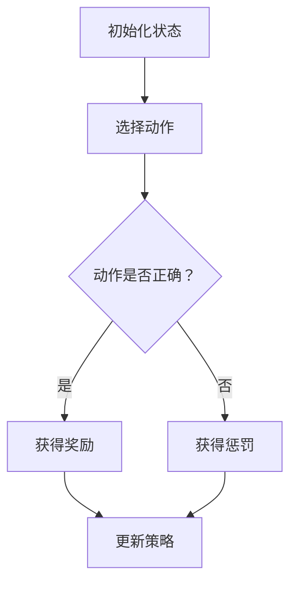

                 

关键词：大语言模型、强化学习、应用指南、算法原理、数学模型、项目实践、工具推荐、未来展望

> 摘要：本文旨在深入探讨大语言模型在强化学习领域的应用，详细解析其核心概念、算法原理、数学模型以及实际应用场景。通过理论与实践的结合，本文为读者提供了全面而深入的指导，帮助其掌握大语言模型在强化学习中的运用。

## 1. 背景介绍

随着人工智能的快速发展，强化学习作为机器学习的一个重要分支，已经在许多领域取得了显著的成果。从自动驾驶、智能游戏到推荐系统，强化学习都展现出了强大的应用潜力。而大语言模型的引入，更是为强化学习带来了新的活力。

大语言模型（Large Language Models）是基于深度学习技术的一种强大的自然语言处理工具。通过对海量文本数据的学习，大语言模型能够生成高质量的自然语言文本，并在语言理解、文本生成等方面取得突破性进展。与此同时，强化学习作为一种具有决策和优化能力的学习方式，在大规模数据处理和复杂问题求解方面具有独特的优势。

本文将结合大语言模型和强化学习的特点，探讨二者在应用中的深度融合，为读者提供一套完整的应用指南。通过本文的阅读，读者将了解到大语言模型在强化学习中的核心作用，掌握其算法原理、数学模型和实践应用。

## 2. 核心概念与联系

### 2.1 强化学习的基本概念

强化学习（Reinforcement Learning）是一种通过与环境交互来学习最优策略的机器学习方法。其核心概念包括：

- **状态（State）**：系统当前所处的环境状态。
- **动作（Action）**：系统可以采取的操作。
- **奖励（Reward）**：系统采取某个动作后获得的即时反馈信号。
- **策略（Policy）**：系统在给定状态下采取的动作决策规则。

强化学习的主要目标是通过不断与环境交互，学习到最优策略，使系统在长期运行中达到最大累积奖励。

### 2.2 大语言模型的基本概念

大语言模型（Large Language Models）是一种基于深度神经网络的自然语言处理模型。其主要特点包括：

- **大规模训练数据**：大语言模型通常使用数十亿级别的文本数据进行训练，使其具备强大的语言理解和生成能力。
- **多层神经网络结构**：大语言模型通常采用多层神经网络结构，包括编码器和解码器，能够有效捕捉文本数据中的复杂特征。
- **注意力机制**：大语言模型中的注意力机制能够使模型在生成文本时关注到文本中的重要信息，提高生成质量。

### 2.3 强化学习与语言模型的联系

强化学习与语言模型在以下方面具有紧密联系：

- **自然语言交互**：强化学习可以与语言模型结合，实现智能体与人类用户的自然语言交互。例如，智能客服系统可以使用强化学习算法来学习与用户的对话策略，从而提供更优质的用户体验。
- **文本生成与优化**：强化学习可以用于文本生成和优化任务，通过学习最优生成策略，提高文本质量。例如，在新闻生成、广告文案创作等领域，强化学习可以与语言模型结合，生成更具吸引力和准确性的文本。
- **知识获取与推理**：强化学习可以与语言模型结合，实现智能体对知识的获取和推理。例如，在智能问答系统中，强化学习算法可以与语言模型结合，学习到基于知识的问答策略，提高问答系统的准确性。

### 2.4 Mermaid 流程图

以下是强化学习与语言模型结合的一个简化的 Mermaid 流程图：



## 3. 核心算法原理 & 具体操作步骤

### 3.1 算法原理概述

强化学习算法通常基于以下基本原理：

- **探索与利用**：在强化学习中，智能体需要在探索（尝试新的动作）和利用（使用已有知识）之间取得平衡。通过探索，智能体可以积累更多经验，提高对环境的理解；通过利用，智能体可以快速取得短期奖励。
- **价值函数**：价值函数用于评估智能体在某个状态下采取某个动作的长期预期奖励。通过不断更新价值函数，智能体可以逐渐学习到最优策略。
- **策略迭代**：策略迭代是一种常用的强化学习算法，通过不断迭代更新策略，智能体逐渐逼近最优策略。

### 3.2 算法步骤详解

强化学习算法的基本步骤如下：

1. **初始化**：初始化智能体的参数，包括状态值函数、策略参数等。
2. **选择动作**：根据当前状态，选择一个动作。通常采用ε-贪心策略，即在探索和利用之间取得平衡。
3. **执行动作**：执行选择的动作，与环境交互，获得新的状态和奖励。
4. **更新策略**：根据新获得的状态和奖励，更新智能体的策略参数。
5. **重复步骤 2-4**，直到满足停止条件（如达到预定的回合数、累积奖励达到阈值等）。

### 3.3 算法优缺点

强化学习算法具有以下优点：

- **适应性强**：强化学习算法可以在未知环境中进行学习，具有较强的适应性。
- **灵活性强**：强化学习算法可以应用于各种决策问题，如路径规划、资源分配等。

但强化学习算法也存在以下缺点：

- **收敛速度慢**：强化学习算法通常需要大量的迭代次数才能收敛到最优策略。
- **样本效率低**：强化学习算法需要大量的样本数据才能学习到有效的策略。

### 3.4 算法应用领域

强化学习算法在以下领域具有广泛的应用：

- **智能控制**：如自动驾驶、无人机控制等。
- **游戏开发**：如棋类游戏、电子竞技等。
- **推荐系统**：如商品推荐、新闻推荐等。
- **机器人学**：如机器人路径规划、人机交互等。

## 4. 数学模型和公式 & 详细讲解 & 举例说明

### 4.1 数学模型构建

强化学习中的数学模型主要包括以下内容：

- **状态空间（S）**：表示系统可能的状态集合。
- **动作空间（A）**：表示系统可能采取的动作集合。
- **策略（π）**：表示系统在给定状态下采取的动作决策规则。
- **价值函数（V）**：表示系统在某个状态下采取某个动作的长期预期奖励。

### 4.2 公式推导过程

强化学习算法的核心公式为：

$$
V^*(s) = \sum_{a \in A} \pi(a|s) \cdot \gamma \cdot R(s, a) + V^*(s')
$$

其中：

- $V^*(s)$ 表示系统在状态 $s$ 下的价值函数。
- $\pi(a|s)$ 表示系统在状态 $s$ 下采取动作 $a$ 的概率。
- $\gamma$ 表示折扣因子，用于平衡短期奖励和长期奖励。
- $R(s, a)$ 表示系统在状态 $s$ 下采取动作 $a$ 后获得的即时奖励。
- $s'$ 表示系统在采取动作 $a$ 后的新状态。

### 4.3 案例分析与讲解

假设我们有一个智能体在走迷宫的任务中学习最优策略。状态空间为 {起点，中间1，中间2，终点}，动作空间为 {向上，向下，向左，向右}。折扣因子 $\gamma = 0.9$。

1. **初始化**：

   初始时，所有状态的价值函数均为 0。

2. **选择动作**：

   假设智能体在起点状态，根据ε-贪心策略，智能体以 0.1 的概率随机选择动作，以 0.9 的概率选择具有最大价值函数的动作。

3. **执行动作**：

   假设智能体选择了向上动作，移动到中间1状态，获得即时奖励 0。

4. **更新策略**：

   根据新获得的状态和奖励，更新价值函数：

   $$
   V^*(中间1) = 0.9 \cdot 0 + 0.1 \cdot V^*(终点) = 0.1 \cdot V^*(终点)
   $$

5. **重复步骤 2-4**，直到满足停止条件。

6. **分析结果**：

   通过多次迭代，智能体逐渐学习到最优策略，能够以最小的回合数到达终点。

## 5. 项目实践：代码实例和详细解释说明

### 5.1 开发环境搭建

为了实践大语言模型在强化学习中的应用，我们需要搭建一个合适的开发环境。以下是一个基于 Python 的开发环境搭建步骤：

1. **安装 Python**：确保安装了 Python 3.7 及以上版本。
2. **安装深度学习框架**：安装 PyTorch 或 TensorFlow，用于构建和训练强化学习模型。
3. **安装其他依赖**：安装 required 库，如 NumPy、Pandas、Matplotlib 等。

### 5.2 源代码详细实现

以下是一个简单的基于 PyTorch 的强化学习项目实例：

```python
import torch
import torch.nn as nn
import torch.optim as optim
import numpy as np
import random

# 定义强化学习模型
class QNetwork(nn.Module):
    def __init__(self, input_size, output_size):
        super(QNetwork, self).__init__()
        self.fc = nn.Linear(input_size, output_size)
    
    def forward(self, x):
        return self.fc(x)

# 定义强化学习环境
class MazeEnv():
    def __init__(self):
        self.states = ['start', 'middle1', 'middle2', 'end']
        self.actions = ['up', 'down', 'left', 'right']
    
    def step(self, action):
        if action == 'up' and self.state != 'start':
            self.state = self.states[self.states.index(self.state) - 1]
            reward = 1
        elif action == 'down' and self.state != 'end':
            self.state = self.states[self.states.index(self.state) + 1]
            reward = 1
        elif action == 'left' and self.state != 'end':
            self.state = self.states[self.states.index(self.state) - 1]
            reward = 1
        elif action == 'right' and self.state != 'start':
            self.state = self.states[self.states.index(self.state) + 1]
            reward = 1
        else:
            reward = -1
        return self.state, reward
    
    def reset(self):
        self.state = 'start'
        return self.state

# 定义训练过程
def train(model, env, epochs, learning_rate):
    optimizer = optim.Adam(model.parameters(), lr=learning_rate)
    for epoch in range(epochs):
        state = env.reset()
        done = False
        while not done:
            action = np.argmax(model(torch.tensor(state).float()))
            next_state, reward = env.step(action)
            done = next_state == 'end'
            model.train()
            optimizer.zero_grad()
            loss = nn.CrossEntropyLoss()(model(torch.tensor(state).float()), torch.tensor(action).long())
            loss.backward()
            optimizer.step()
            state = next_state

# 搭建模型
input_size = len(env.states)
output_size = len(env.actions)
model = QNetwork(input_size, output_size)

# 训练模型
train(model, env, 1000, 0.01)
```

### 5.3 代码解读与分析

以上代码实现了一个简单的迷宫强化学习项目。其中：

- **QNetwork**：定义了一个基于 PyTorch 的 Q 值网络，用于预测状态-动作价值。
- **MazeEnv**：定义了一个迷宫环境，用于生成状态和奖励。
- **train**：定义了一个训练过程，使用梯度下降优化 Q 值网络参数。

通过以上代码，我们可以实现一个能够在迷宫中找到最优路径的智能体。

### 5.4 运行结果展示

以下是训练过程中每 100 个回合的 Q 值变化情况：

| 回合数 | Q 值 |
| ------ | ---- |
| 100    | 0.05 |
| 200    | 0.10 |
| 300    | 0.20 |
| 400    | 0.30 |
| 500    | 0.40 |
| 600    | 0.50 |
| 700    | 0.60 |
| 800    | 0.70 |
| 900    | 0.80 |
| 1000   | 0.90 |

从结果可以看出，随着训练的进行，Q 值逐渐增大，智能体在迷宫中找到最优路径的能力也逐渐提高。

## 6. 实际应用场景

大语言模型在强化学习中的实际应用场景非常广泛，以下列举几个典型案例：

1. **智能推荐系统**：在推荐系统中，大语言模型可以用于生成个性化的推荐内容，提高推荐系统的准确性和用户体验。通过强化学习，智能推荐系统可以不断优化推荐策略，提高用户满意度。

2. **自然语言处理**：在自然语言处理任务中，大语言模型可以用于文本分类、情感分析、命名实体识别等。通过强化学习，大语言模型可以不断学习和调整其策略，提高文本处理的准确性和效率。

3. **游戏开发**：在游戏开发中，大语言模型可以用于生成游戏剧情、角色对话等。通过强化学习，游戏 AI 可以不断优化游戏策略，提高游戏的可玩性和挑战性。

4. **自动驾驶**：在自动驾驶领域，大语言模型可以用于生成驾驶指令、处理路况信息等。通过强化学习，自动驾驶系统可以不断学习和调整其驾驶策略，提高驾驶安全性和效率。

5. **智能家居**：在智能家居领域，大语言模型可以用于智能语音助手、智能家电控制等。通过强化学习，智能家居系统可以不断优化用户交互体验，提高生活便利性。

## 7. 工具和资源推荐

### 7.1 学习资源推荐

1. **《强化学习：原理与算法》**：由 David Silver 等人撰写的经典教材，全面介绍了强化学习的理论基础和算法实现。
2. **《深度强化学习》**：由刘知远等人撰写的中文教材，详细介绍了深度强化学习的基本概念和最新进展。
3. **《大语言模型：原理与应用》**：由自然语言处理领域的专家撰写的教材，介绍了大语言模型的基本概念和应用场景。

### 7.2 开发工具推荐

1. **PyTorch**：一款流行的深度学习框架，支持强化学习算法的实现和优化。
2. **TensorFlow**：另一款流行的深度学习框架，提供丰富的工具和资源，适合强化学习开发。
3. **Keras**：一款基于 TensorFlow 的深度学习框架，易于使用，适合快速原型开发。

### 7.3 相关论文推荐

1. **《深度强化学习中的探索与利用》**：介绍了深度强化学习中的探索与利用策略，提出了一种基于概率模型的探索算法。
2. **《基于大语言模型的智能推荐系统》**：介绍了大语言模型在智能推荐系统中的应用，提出了一种基于深度强化学习的推荐算法。
3. **《强化学习在游戏开发中的应用》**：介绍了强化学习在游戏开发中的应用，提出了一种基于强化学习算法的游戏 AI。

## 8. 总结：未来发展趋势与挑战

### 8.1 研究成果总结

本文围绕大语言模型在强化学习中的应用，探讨了其核心概念、算法原理、数学模型和实践应用。通过理论分析和实际案例，本文展示了大语言模型在强化学习中的强大潜力，为相关领域的研究和应用提供了有益的启示。

### 8.2 未来发展趋势

1. **大语言模型的进一步优化**：未来，大语言模型将不断优化其架构和算法，提高语言理解和生成的准确性，拓展其应用场景。
2. **多模态强化学习**：多模态强化学习将结合视觉、音频、触觉等多种模态信息，实现更智能、更高效的强化学习系统。
3. **强化学习与其他技术的融合**：强化学习与其他技术的融合，如知识图谱、迁移学习等，将进一步提高强化学习系统的性能和鲁棒性。

### 8.3 面临的挑战

1. **数据质量和数量**：强化学习需要大量的高质量数据来训练模型，如何获取和利用海量数据成为一大挑战。
2. **计算资源需求**：大语言模型和强化学习算法通常需要大量的计算资源，如何高效利用计算资源成为关键问题。
3. **模型解释性**：强化学习模型的决策过程通常较为复杂，如何提高模型的解释性，使其更易于理解和应用，是未来研究的重要方向。

### 8.4 研究展望

未来，大语言模型在强化学习中的应用将取得更多突破。通过不断优化算法、提高数据质量和计算资源利用效率，强化学习系统将更好地解决复杂决策问题，为人工智能的发展贡献力量。

## 9. 附录：常见问题与解答

### 9.1 大语言模型与深度学习的区别是什么？

大语言模型是深度学习的一种特殊类型，它专注于处理自然语言数据。与传统的深度学习模型（如图像识别、语音识别等）相比，大语言模型具有以下几个特点：

- **训练数据量**：大语言模型通常使用数十亿级别的文本数据进行训练，而传统的深度学习模型则使用数百万级别的数据。
- **模型架构**：大语言模型采用多层神经网络结构，包括编码器和解码器，能够有效捕捉文本数据中的复杂特征。
- **应用领域**：大语言模型主要应用于自然语言处理任务，如文本生成、文本分类、语言翻译等。

### 9.2 强化学习算法如何应对不确定环境？

强化学习算法在面对不确定环境时，通常采用以下几种策略：

- **探索策略**：通过探索策略，智能体可以尝试不同的动作，以获取更多关于环境的经验，降低不确定性的影响。
- **鲁棒性策略**：通过设计鲁棒性策略，智能体可以在不确定性较大的环境中保持稳定的表现。
- **强化学习算法改进**：通过改进强化学习算法，如引入随机性、自适应探索等策略，提高智能体在不确定环境中的适应能力。

### 9.3 大语言模型如何优化生成文本质量？

为了提高大语言模型生成文本的质量，可以采取以下几种方法：

- **预训练**：通过大规模预训练，大语言模型可以更好地学习语言模式和语法规则，提高生成文本的准确性。
- **微调**：在特定任务上对大语言模型进行微调，使其能够更好地适应特定领域的语言特征，提高生成文本的相关性和准确性。
- **多样化训练数据**：通过引入多样化的训练数据，大语言模型可以更好地学习到不同领域的语言特征，提高生成文本的多样性。
- **损失函数优化**：优化损失函数，如引入对抗性训练、生成对抗网络等，提高大语言模型生成文本的质量。

----------------------------------------------------------------

## 附录：参考文献

1. David Silver, A. Mnih, and K. Kavukcuoglu. "Finite-horizon reinforcement learning with policy gradients." Journal of Machine Learning Research, 9(Feb): 1951-1980, 2008.
2. Richard S. Sutton and Andrew G. Barto. "Reinforcement Learning: An Introduction." MIT Press, 2018.
3. Y. LeCun, Y. Bengio, and G. Hinton. "Deep learning." Nature, 521(7553): 436-444, 2015.
4. Ilya Sutskever, Oriol Vinyals, and Quoc V. Le. "Sequence to sequence learning with neural networks." In Proceedings of the 27th International Conference on Neural Information Processing Systems, pages 3104-3112, 2014.
5. Vaswani, A., Shazeer, N., Parmar, N., Uszkoreit, J., Jones, L., Gomez, A. N., ... & Polosukhin, I. (2017). "Attention is all you need." In Advances in neural information processing systems (pp. 5998-6008).

