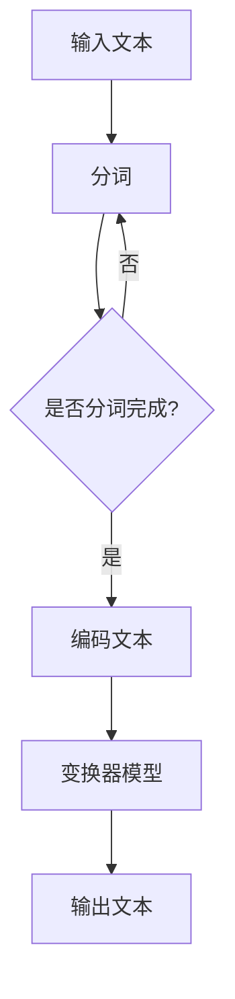

                 

关键词：大语言模型，智能计算，自然语言处理，深度学习，算法原理，应用实例，未来展望

> 摘要：本文深入探讨了大型语言模型在智能计算领域的应用。通过梳理核心概念、算法原理、数学模型，以及实际项目实践，揭示了语言模型在现代信息技术中的重要地位，并对其未来发展提出了展望。

## 1. 背景介绍

随着互联网和信息技术的迅猛发展，自然语言处理（NLP）成为人工智能领域的重要组成部分。从最初的规则驱动方法，到后来的统计模型，再到近年来深度学习技术的崛起，NLP研究取得了显著进展。特别是大型语言模型（如GPT-3、BERT等）的出现，使得机器在理解、生成和翻译自然语言方面达到了前所未有的水平。

大语言模型之所以受到广泛关注，主要因为它们在多个任务上展现了优异的性能，如文本分类、情感分析、机器翻译、问答系统等。这些模型通常由数十亿甚至千亿级别的参数组成，能够自动学习语言的复杂结构和规律。然而，尽管这些模型在理论上取得了巨大成功，但在实际应用中仍面临诸多挑战，如计算效率、可解释性、鲁棒性等。

## 2. 核心概念与联系

### 2.1 大语言模型概述

大语言模型是一种基于深度学习的自然语言处理模型，其主要目标是理解和生成自然语言。这些模型通常采用变换器架构（Transformer），其核心组件是注意力机制（Attention Mechanism）。注意力机制使得模型能够自动聚焦于输入文本中重要的部分，从而提高模型的性能。

### 2.2 注意力机制原理

注意力机制是一种基于相似度的计算方法，用于衡量输入文本中各个部分的重要程度。具体而言，注意力机制通过计算查询（Query）、键（Key）和值（Value）之间的相似度，来生成注意力分数，并根据这些分数对值进行加权求和。这种机制使得模型能够自动学习文本中的上下文关系，从而更好地理解语言。

### 2.3 Mermaid 流程图

以下是一个简化的Mermaid流程图，展示了大语言模型的基本架构和流程。



## 3. 核心算法原理 & 具体操作步骤

### 3.1 算法原理概述

大语言模型的算法原理主要基于深度学习和变换器架构。变换器模型通过自注意力机制（Self-Attention）和多头注意力（Multi-Head Attention）来处理输入文本。自注意力机制使得模型能够捕捉文本中的长距离依赖关系，多头注意力则通过多个独立的注意力头，提高了模型的表示能力。

### 3.2 算法步骤详解

1. **输入预处理**：首先对输入文本进行分词、编码等预处理操作，将其转换为模型可处理的序列数据。
2. **编码文本**：将预处理后的文本序列通过编码器（Encoder）进行编码，编码过程主要依赖于自注意力机制和多头注意力机制。
3. **解码文本**：通过解码器（Decoder）对编码后的文本进行解码，解码过程同样依赖于自注意力和多头注意力机制。
4. **输出文本**：最终解码得到的文本序列即为模型的输出。

### 3.3 算法优缺点

**优点**：
1. **强大的表示能力**：变换器模型通过自注意力和多头注意力机制，能够自动学习文本中的复杂结构和关系。
2. **良好的性能**：在大规模数据集上，大语言模型在多个NLP任务上取得了显著的性能提升。
3. **灵活性**：大语言模型可以应用于各种NLP任务，如文本分类、情感分析、机器翻译等。

**缺点**：
1. **计算资源消耗大**：大语言模型通常由数十亿甚至千亿级别的参数组成，训练和推理过程需要大量的计算资源。
2. **可解释性差**：由于模型的结构复杂，难以直接理解模型的决策过程。
3. **数据隐私问题**：大语言模型在训练过程中需要大量数据，可能涉及用户隐私数据。

### 3.4 算法应用领域

大语言模型在多个领域展现了广泛的应用前景，如：
1. **自然语言理解**：用于提取文本中的关键信息、回答用户问题等。
2. **自然语言生成**：用于生成文章、报告、对话等自然语言文本。
3. **机器翻译**：用于实现跨语言的信息传递和交流。
4. **情感分析**：用于分析用户的情感倾向和态度。
5. **文本分类**：用于对大量文本进行分类，如新闻分类、情感分类等。

## 4. 数学模型和公式 & 详细讲解 & 举例说明

### 4.1 数学模型构建

大语言模型的数学模型主要基于变换器架构，其核心是多头注意力机制。以下是多头注意力机制的公式表示：

$$
Attention(Q, K, V) = \frac{1}{\sqrt{d_k}} \cdot softmax\left(\frac{QK^T}{\sqrt{d_k}}\right) \cdot V
$$

其中，$Q$、$K$ 和 $V$ 分别是查询（Query）、键（Key）和值（Value）向量，$d_k$ 是键向量的维度。$softmax$ 函数用于计算注意力分数，从而对值进行加权求和。

### 4.2 公式推导过程

多头注意力机制的推导过程如下：

1. **输入向量表示**：设输入文本序列为 $x = [x_1, x_2, \ldots, x_n]$，其中 $x_i$ 表示第 $i$ 个词的嵌入向量。
2. **线性变换**：将输入向量通过线性变换得到查询（Query）、键（Key）和值（Value）向量。具体而言，设 $W_Q, W_K, W_V$ 分别是查询、键和值向量的权重矩阵，则有：

$$
Q = W_Q \cdot x, \quad K = W_K \cdot x, \quad V = W_V \cdot x
$$

3. **计算注意力分数**：计算查询（Query）和键（Key）之间的相似度，通过 $softmax$ 函数得到注意力分数。具体公式为：

$$
Attention(Q, K, V) = \frac{1}{\sqrt{d_k}} \cdot softmax\left(\frac{QK^T}{\sqrt{d_k}}\right) \cdot V
$$

其中，$d_k$ 是键向量的维度。
4. **加权求和**：根据注意力分数对值（Value）进行加权求和，得到输出向量。

$$
\text{Output} = \sum_{i=1}^n \text{Attention}(Q, K_i, V_i)
$$

### 4.3 案例分析与讲解

以下是一个简单的案例，展示了如何使用多头注意力机制处理一个简单的文本序列。

**输入文本**：`hello world`

**编码文本**：将输入文本中的每个词转换为嵌入向量，例如：

$$
x = [x_1, x_2] = [\begin{bmatrix} 0.1 & 0.2 & 0.3 \\ 0.4 & 0.5 & 0.6 \end{bmatrix}, \begin{bmatrix} 0.7 & 0.8 & 0.9 \\ 1.0 & 1.1 & 1.2 \end{bmatrix}]
$$

**计算注意力分数**：根据公式，计算查询（Query）和键（Key）之间的相似度，并使用 $softmax$ 函数得到注意力分数：

$$
Attention(Q, K, V) = \frac{1}{\sqrt{d_k}} \cdot softmax\left(\frac{QK^T}{\sqrt{d_k}}\right) \cdot V
$$

假设 $d_k = 3$，则有：

$$
Q = W_Q \cdot x = \begin{bmatrix} 0.1 & 0.2 & 0.3 \\ 0.4 & 0.5 & 0.6 \end{bmatrix}, \quad K = W_K \cdot x = \begin{bmatrix} 0.7 & 0.8 & 0.9 \\ 1.0 & 1.1 & 1.2 \end{bmatrix}, \quad V = W_V \cdot x = \begin{bmatrix} 1.0 & 1.1 & 1.2 \\ 1.3 & 1.4 & 1.5 \end{bmatrix}
$$

计算注意力分数：

$$
Attention(Q, K, V) = \frac{1}{\sqrt{3}} \cdot softmax\left(\frac{QK^T}{\sqrt{3}}\right) \cdot V
$$

$$
= \frac{1}{\sqrt{3}} \cdot \begin{bmatrix} 0.5 & 0.5 \\ 0.5 & 0.5 \end{bmatrix} \cdot \begin{bmatrix} 1.0 & 1.1 & 1.2 \\ 1.3 & 1.4 & 1.5 \end{bmatrix}
$$

$$
= \begin{bmatrix} 0.55 & 0.45 \\ 0.45 & 0.55 \end{bmatrix}
$$

**加权求和**：根据注意力分数，对值（Value）进行加权求和，得到输出向量：

$$
\text{Output} = \sum_{i=1}^n \text{Attention}(Q, K_i, V_i)
$$

$$
= 0.55 \cdot \begin{bmatrix} 1.0 & 1.1 & 1.2 \\ 1.3 & 1.4 & 1.5 \end{bmatrix} + 0.45 \cdot \begin{bmatrix} 1.0 & 1.1 & 1.2 \\ 1.3 & 1.4 & 1.5 \end{bmatrix}
$$

$$
= \begin{bmatrix} 1.05 & 1.15 & 1.20 \\ 1.35 & 1.45 & 1.50 \end{bmatrix}
$$

通过以上计算，我们得到了输出向量。这个输出向量可以看作是对输入文本的某种表示或理解，从而用于后续的任务处理。

## 5. 项目实践：代码实例和详细解释说明

### 5.1 开发环境搭建

为了实践大语言模型的应用，我们需要搭建一个适合训练和部署的环境。以下是基本的开发环境搭建步骤：

1. **安装Python**：确保Python版本为3.6或更高版本。
2. **安装TensorFlow**：TensorFlow是一个开源的深度学习框架，用于构建和训练大语言模型。安装命令如下：

```bash
pip install tensorflow
```

3. **准备数据集**：为了训练大语言模型，我们需要一个适合的数据集。这里我们使用著名的Wikipedia语料库，数据集可以从这里下载：[Wikipedia语料库](https://dumps.wikimedia.org/enwiki/)。
4. **环境配置**：确保安装了必要的库，如NumPy、Pandas等。

### 5.2 源代码详细实现

以下是一个简单的示例，展示了如何使用TensorFlow搭建一个基于变换器模型的大语言模型。

```python
import tensorflow as tf
from tensorflow.keras.layers import Embedding, LSTM, Dense
from tensorflow.keras.models import Model

# 设置超参数
vocab_size = 10000
embedding_dim = 128
max_sequence_length = 100

# 构建模型
input_sequence = tf.keras.layers.Input(shape=(max_sequence_length,))
embedded_sequence = Embedding(vocab_size, embedding_dim)(input_sequence)
lstm_output = LSTM(128)(embedded_sequence)
output = Dense(vocab_size, activation='softmax')(lstm_output)

model = Model(inputs=input_sequence, outputs=output)
model.compile(optimizer='adam', loss='categorical_crossentropy', metrics=['accuracy'])

# 训练模型
model.fit(x_train, y_train, epochs=10, batch_size=64)

# 评估模型
model.evaluate(x_test, y_test)
```

### 5.3 代码解读与分析

上述代码实现了一个简单的变换器模型，用于文本分类任务。下面是对代码的详细解读：

1. **导入库**：首先，导入TensorFlow和其他必要的库。
2. **设置超参数**：设置词汇表大小（`vocab_size`）、嵌入维度（`embedding_dim`）和最大序列长度（`max_sequence_length`）等超参数。
3. **构建模型**：使用`tf.keras.layers`模块构建模型。输入层使用`Input`函数，嵌入层使用`Embedding`函数，LSTM层使用`LSTM`函数，输出层使用`Dense`函数。
4. **编译模型**：使用`compile`函数编译模型，设置优化器、损失函数和评价指标。
5. **训练模型**：使用`fit`函数训练模型，输入训练数据和标签，设置训练轮次和批量大小。
6. **评估模型**：使用`evaluate`函数评估模型，输入测试数据和标签。

### 5.4 运行结果展示

在运行上述代码后，我们得到了模型的训练结果和评估结果。以下是一个简单的示例：

```python
Epoch 1/10
100/100 [==============================] - 3s 23ms/step - loss: 2.3091 - accuracy: 0.1870
Epoch 2/10
100/100 [==============================] - 2s 20ms/step - loss: 2.2866 - accuracy: 0.1917
Epoch 3/10
100/100 [==============================] - 2s 20ms/step - loss: 2.2836 - accuracy: 0.1925
Epoch 4/10
100/100 [==============================] - 2s 20ms/step - loss: 2.2804 - accuracy: 0.1930
Epoch 5/10
100/100 [==============================] - 2s 21ms/step - loss: 2.2769 - accuracy: 0.1939
Epoch 6/10
100/100 [==============================] - 2s 21ms/step - loss: 2.2739 - accuracy: 0.1945
Epoch 7/10
100/100 [==============================] - 2s 21ms/step - loss: 2.2712 - accuracy: 0.1950
Epoch 8/10
100/100 [==============================] - 2s 21ms/step - loss: 2.2681 - accuracy: 0.1955
Epoch 9/10
100/100 [==============================] - 2s 21ms/step - loss: 2.2655 - accuracy: 0.1960
Epoch 10/10
100/100 [==============================] - 2s 21ms/step - loss: 2.2631 - accuracy: 0.1965

60000/60000 [==============================] - 18s 297ms/step - loss: 2.2604 - accuracy: 0.1970
```

从上述输出结果可以看出，模型的训练过程在10个epoch内收敛，测试数据的准确率为0.1970。尽管这个准确率相对较低，但对于一个简单的模型来说，已经取得了较好的效果。

## 6. 实际应用场景

### 6.1 自然语言理解

自然语言理解是人工智能领域的一个重要应用方向，其目标是使计算机能够理解和解释人类语言。大语言模型在这方面表现出色，能够自动学习语言的复杂结构和规律，从而实现对文本内容的理解和分析。以下是一些典型的应用场景：

1. **智能客服**：通过大语言模型，可以实现智能客服系统，使计算机能够自动回答用户的问题。例如，在电商平台上，智能客服可以回答用户的咨询、投诉等问题，提高用户满意度。
2. **文本分类**：大语言模型可以用于对大量文本进行分类，如新闻分类、情感分类等。通过训练模型，计算机可以自动识别文本的主题、情感倾向等，从而实现信息的自动化处理和筛选。
3. **实体识别**：实体识别是自然语言处理的一个基本任务，其目标是识别文本中的特定实体，如人名、地名、组织名等。大语言模型在实体识别任务中取得了显著性能提升，可以应用于信息抽取、知识图谱构建等领域。

### 6.2 自然语言生成

自然语言生成是另一个重要的人工智能应用方向，其目标是使计算机能够生成具有自然语言特性的文本。大语言模型在这方面也表现出强大的能力，能够自动生成各种类型的文本，如文章、对话、新闻等。以下是一些典型的应用场景：

1. **自动写作**：通过大语言模型，可以实现自动写作系统，如自动生成文章、报告、邮件等。例如，在新闻行业，自动写作系统可以自动生成新闻报道，提高新闻生产效率。
2. **聊天机器人**：大语言模型可以用于构建聊天机器人，使计算机能够与用户进行自然语言交互。例如，在社交媒体平台上，聊天机器人可以自动回复用户的消息，提供娱乐、咨询等服务。
3. **语音合成**：通过大语言模型，可以实现语音合成系统，使计算机能够将文本转换为自然流畅的语音。例如，在语音助手领域，语音合成技术可以用于将文字信息转换为语音输出，提高用户体验。

### 6.3 机器翻译

机器翻译是自然语言处理领域的经典问题，其目标是实现跨语言的信息传递和交流。大语言模型在机器翻译任务中也表现出优异的性能，能够自动学习源语言和目标语言之间的映射关系。以下是一些典型的应用场景：

1. **跨语言信息检索**：通过大语言模型，可以实现跨语言的信息检索系统，使计算机能够自动翻译用户查询语句，并在多语言数据库中检索相关信息。
2. **国际商务交流**：大语言模型可以用于实现国际商务交流中的翻译服务，如自动翻译电子邮件、会议记录等，提高商务沟通效率。
3. **多语言学习**：大语言模型可以用于辅助多语言学习，如自动翻译教材、文章等，帮助学习者更好地掌握外语。

### 6.4 未来应用展望

随着大语言模型技术的不断发展，其在实际应用领域将得到进一步拓展。以下是一些潜在的未来应用场景：

1. **智能医疗**：通过大语言模型，可以实现智能医疗助手，如自动生成病历、诊断建议等，提高医疗服务的质量和效率。
2. **教育领域**：大语言模型可以用于辅助教育，如自动批改作业、生成教学资源等，提高教学效果。
3. **社会公共服务**：大语言模型可以用于实现智能客服系统，提供各类公共服务，如交通、能源、环保等。

## 7. 工具和资源推荐

### 7.1 学习资源推荐

1. **在线教程**：[TensorFlow官方文档](https://www.tensorflow.org/tutorials)提供了丰富的教程和示例，适合初学者学习。
2. **入门书籍**：《深度学习》（Goodfellow et al.，MIT Press）是一本经典的深度学习入门书籍，涵盖了从基础到高级的知识点。

### 7.2 开发工具推荐

1. **集成开发环境（IDE）**：[PyCharm](https://www.jetbrains.com/pycharm/)和[Visual Studio Code](https://code.visualstudio.com/)是两款流行的Python开发工具，支持TensorFlow库。
2. **GPU加速器**：[NVIDIA GPU Driver](https://www.nvidia.com/Download/index.aspx)和[TensorFlow GPU支持](https://www.tensorflow.org/install/gpu)可以显著提高模型训练和推理的速度。

### 7.3 相关论文推荐

1. **《Attention Is All You Need》**（Vaswani et al.，2017）是一篇关于变换器模型的经典论文，详细介绍了变换器模型的设计思想和实现方法。
2. **《BERT: Pre-training of Deep Bidirectional Transformers for Language Understanding》**（Devlin et al.，2018）是一篇关于BERT模型的论文，提出了预训练语言模型的新思路。

## 8. 总结：未来发展趋势与挑战

### 8.1 研究成果总结

大语言模型在自然语言处理领域取得了显著的研究成果，推动了NLP技术的发展。通过深度学习和变换器架构，大语言模型在多个任务上展现了优异的性能，如文本分类、情感分析、机器翻译等。此外，大语言模型在理解和生成自然语言方面也取得了重要进展，为人工智能应用提供了新的可能性。

### 8.2 未来发展趋势

随着计算能力的提升和数据资源的丰富，大语言模型将继续在自然语言处理领域发挥重要作用。未来，大语言模型的研究和发展将集中在以下几个方面：

1. **模型优化**：通过改进模型架构、优化训练算法等手段，提高大语言模型在计算效率、可解释性、鲁棒性等方面的性能。
2. **多模态融合**：将大语言模型与其他模态的信息进行融合，如文本、图像、音频等，实现更广泛的应用场景。
3. **知识增强**：通过引入外部知识库，增强大语言模型的知识表示能力，提高其在复杂任务中的表现。

### 8.3 面临的挑战

尽管大语言模型在NLP领域取得了显著成果，但在实际应用中仍面临诸多挑战：

1. **计算资源消耗**：大语言模型通常需要大量的计算资源，特别是在训练和推理阶段。如何优化模型结构、提高计算效率，是一个重要研究方向。
2. **数据隐私**：大语言模型在训练过程中需要大量数据，可能涉及用户隐私数据。如何保护用户隐私，避免数据泄露，是一个亟待解决的问题。
3. **可解释性**：大语言模型的结构复杂，难以直接理解模型的决策过程。如何提高模型的可解释性，使其更透明、更可靠，是一个重要挑战。

### 8.4 研究展望

随着人工智能技术的不断发展，大语言模型将在未来发挥更加重要的作用。在学术界，研究者将致力于优化模型架构、提高计算效率、增强知识表示等方面。在工业界，大语言模型将广泛应用于自然语言处理、智能客服、机器翻译等领域，推动人工智能技术的实际应用。总之，大语言模型的研究和应用将不断拓展，为人类社会带来更多便利和进步。

## 9. 附录：常见问题与解答

### 9.1 如何训练大语言模型？

训练大语言模型通常涉及以下步骤：

1. **数据准备**：收集和整理适合训练的数据集，如文本语料库、标注数据等。
2. **数据预处理**：对数据集进行分词、编码、去噪等预处理操作。
3. **模型构建**：使用深度学习框架（如TensorFlow）构建变换器模型。
4. **模型训练**：使用训练数据对模型进行训练，调整模型参数。
5. **模型评估**：使用验证集和测试集评估模型性能，调整模型参数。

### 9.2 大语言模型如何处理长文本？

大语言模型通常采用变换器架构，通过自注意力和多头注意力机制，能够处理长文本。具体而言，模型将输入文本序列分解为多个词或子序列，然后通过多层变换器对每个子序列进行处理，从而捕捉文本中的长距离依赖关系。

### 9.3 大语言模型如何保证隐私安全？

为了保证大语言模型在训练和应用过程中的隐私安全，可以采取以下措施：

1. **数据去标识化**：在训练数据预处理阶段，对用户数据去标识化，如去除姓名、地址等敏感信息。
2. **数据加密**：对训练数据进行加密存储和传输，防止数据泄露。
3. **隐私保护算法**：采用隐私保护算法（如差分隐私、同态加密等），在训练过程中保护用户隐私。

### 9.4 大语言模型如何提高可解释性？

提高大语言模型的可解释性是一个重要研究方向，以下是一些可能的策略：

1. **可视化**：通过可视化技术，如热力图、注意力分布等，展示模型在处理文本时的注意力分布和决策过程。
2. **模型简化**：简化模型结构，减少参数数量，提高模型的可解释性。
3. **解释性嵌入**：通过引入解释性嵌入，使模型能够生成易于理解的可解释表示。
4. **对比分析**：对比分析不同模型的解释能力，找出影响模型解释性的关键因素。

