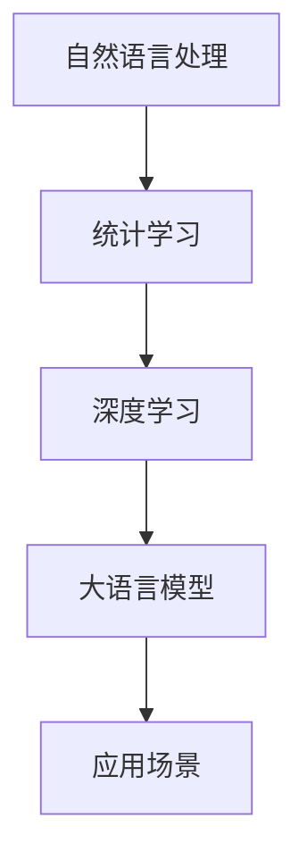
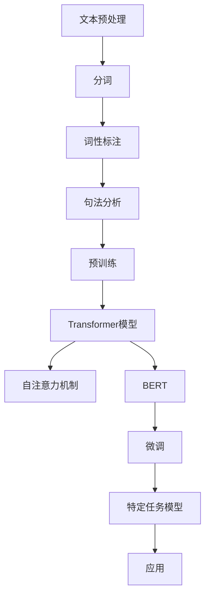

                 

关键词：大语言模型、自然语言处理、可计算性、人工智能应用

> 摘要：本文将详细介绍大语言模型的应用，从背景介绍、核心概念与联系、核心算法原理与操作步骤、数学模型与公式讲解、项目实践、实际应用场景、未来展望等方面，全面阐述大语言模型在智能计算领域的重要性和应用价值。

## 1. 背景介绍

随着互联网的普及和大数据技术的发展，自然语言处理（NLP）作为人工智能的重要分支，正在迅速崛起。NLP旨在使计算机能够理解、生成和处理人类语言，实现人机交互的智能化。而大语言模型作为NLP的核心技术之一，通过学习海量语言数据，能够自动生成文本、理解语义、进行情感分析等，极大地提升了人工智能在语言领域的应用能力。

近年来，大语言模型的研究与应用取得了显著进展。例如，谷歌的BERT模型、OpenAI的GPT-3模型等，这些模型不仅在学术研究中取得了突破，还在实际应用中取得了巨大成功。然而，大语言模型的应用也面临着一些挑战，如计算复杂性、模型解释性、数据隐私等。本文将围绕大语言模型的应用，探讨其核心概念、算法原理、数学模型、实际应用场景及未来发展趋势。

## 2. 核心概念与联系

### 2.1 自然语言处理（NLP）

自然语言处理（NLP）是人工智能的一个重要分支，旨在使计算机能够理解、生成和处理人类语言。NLP的核心任务包括词法分析、句法分析、语义分析、语用分析等。词法分析主要关注单词的识别和分类，句法分析关注句子的结构分析，语义分析关注句子所表达的语义含义，语用分析关注语言在具体情境中的应用。

### 2.2 语言模型

语言模型（Language Model）是NLP的核心技术之一，旨在学习语言数据中的统计规律，从而生成或理解自然语言。语言模型通常基于统计学习方法，如N-gram模型、神经网络模型等。大语言模型则是通过对海量数据进行深度学习，从而实现更高效、更准确的语言处理能力。

### 2.3 大语言模型

大语言模型（Large Language Model）是指具有大规模参数、能够处理大量文本数据的语言模型。大语言模型通常具有以下几个特点：

- **大规模参数**：大语言模型拥有数十亿甚至千亿级别的参数，能够捕捉到更复杂的语言规律。
- **深度学习**：大语言模型通常采用深度神经网络结构，能够实现更高效、更准确的语言处理。
- **海量数据训练**：大语言模型通过学习海量语言数据，能够更好地理解语言中的语义、语法、词汇等信息。

### 2.4 大语言模型的联系

大语言模型与自然语言处理、统计学习、深度学习等技术有着紧密的联系。自然语言处理为大语言模型提供了应用场景，统计学习为大语言模型提供了基础算法，深度学习为大语言模型提供了高效计算手段。大语言模型的应用使得自然语言处理技术取得了长足发展，也为人工智能在语言领域的应用奠定了基础。

## 2.5 Mermaid 流程图（大语言模型架构）



## 3. 核心算法原理 & 具体操作步骤

### 3.1 算法原理概述

大语言模型的核心算法原理是基于统计学习和深度学习。统计学习方法通过分析语言数据中的统计规律，建立语言模型；深度学习方法通过构建神经网络结构，对语言数据进行自动特征提取和建模。大语言模型结合了这两种方法，通过大规模参数和深度学习结构，实现了高效、准确的语言处理。

### 3.2 算法步骤详解

大语言模型的算法步骤主要包括以下几个阶段：

1. **数据预处理**：对原始文本数据进行清洗、分词、去停用词等预处理操作，得到干净、结构化的文本数据。
2. **数据输入**：将预处理后的文本数据输入到神经网络中，进行特征提取和建模。
3. **模型训练**：通过反向传播算法，不断调整神经网络参数，优化模型性能。
4. **模型评估**：使用验证集和测试集对模型进行评估，确保模型具有良好的泛化能力。
5. **模型应用**：将训练好的模型应用于实际场景，如文本生成、语义理解、情感分析等。

### 3.3 算法优缺点

大语言模型具有以下优点：

- **高效性**：通过深度学习结构，大语言模型能够高效地处理大规模语言数据。
- **准确性**：大规模参数和海量数据训练，使得大语言模型在语言理解、生成等方面具有高准确性。
- **泛化能力**：大语言模型通过学习海量语言数据，能够适应不同的语言应用场景。

然而，大语言模型也存在一些缺点：

- **计算复杂性**：大语言模型通常具有数十亿级别的参数，导致计算复杂性高，训练时间长。
- **解释性**：深度学习模型通常具有黑箱特性，难以解释模型决策过程。
- **数据隐私**：大语言模型在训练和应用过程中，可能涉及用户隐私数据，需要保护用户隐私。

### 3.4 算法应用领域

大语言模型在以下领域具有广泛的应用：

- **文本生成**：生成文本摘要、文章、对话等。
- **语义理解**：实现自然语言理解，如问答系统、机器翻译等。
- **情感分析**：分析文本中的情感倾向，如评论情感分析、舆情监测等。
- **智能客服**：实现智能对话，提升用户体验。
- **内容审核**：自动识别和处理违法违规内容。

## 4. 数学模型和公式 & 详细讲解 & 举例说明

### 4.1 数学模型构建

大语言模型的数学模型主要基于深度学习中的循环神经网络（RNN）和长短时记忆网络（LSTM）。RNN通过记忆过去的信息，能够处理序列数据；LSTM通过门控机制，能够更好地记忆长期依赖信息。

### 4.2 公式推导过程

假设输入序列为 \( x_1, x_2, \ldots, x_T \)，输出序列为 \( y_1, y_2, \ldots, y_T \)，其中 \( T \) 表示序列长度。RNN的公式推导如下：

1. **输入层到隐藏层的传递**：
   \[ h_t = \sigma(W_h \cdot [h_{t-1}, x_t] + b_h) \]
   其中，\( h_t \) 表示第 \( t \) 个时间步的隐藏状态，\( \sigma \) 表示激活函数，\( W_h \) 和 \( b_h \) 分别为权重和偏置。

2. **隐藏层到输出层的传递**：
   \[ y_t = \text{softmax}(W_y \cdot h_t + b_y) \]
   其中，\( y_t \) 表示第 \( t \) 个时间步的输出，\( W_y \) 和 \( b_y \) 分别为权重和偏置。

### 4.3 案例分析与讲解

以GPT-3模型为例，GPT-3是一种基于变长自注意力机制的深度学习模型，具有数十亿级别的参数。GPT-3的数学模型如下：

1. **自注意力机制**：
   \[ \text{Attention}(Q, K, V) = \text{softmax}\left(\frac{QK^T}{\sqrt{d_k}}\right) V \]
   其中，\( Q, K, V \) 分别表示查询、键、值向量，\( d_k \) 表示键向量的维度。

2. **多头注意力机制**：
   \[ \text{MultiHead}(Q, K, V) = \text{Concat}(\text{head}_1, \text{head}_2, \ldots, \text{head}_h)W_O \]
   其中，\( h \) 表示头数，\( W_O \) 表示输出权重。

GPT-3通过多头注意力机制，能够捕捉到输入序列中的长程依赖信息，从而实现高效的文本生成和语义理解。

## 5. 项目实践：代码实例和详细解释说明

### 5.1 开发环境搭建

在本项目中，我们将使用Python作为编程语言，结合TensorFlow和Keras等库，搭建大语言模型。首先，确保已安装Python和TensorFlow：

```bash
pip install python tensorflow
```

### 5.2 源代码详细实现

下面是一个基于LSTM的大语言模型实现：

```python
import tensorflow as tf
from tensorflow.keras.models import Sequential
from tensorflow.keras.layers import LSTM, Dense, Embedding

# 设置参数
vocab_size = 10000  # 词汇表大小
embedding_dim = 256  # 嵌入层维度
lstm_units = 128  # LSTM单元数
batch_size = 64  # 批量大小
epochs = 10  # 迭代次数

# 构建模型
model = Sequential()
model.add(Embedding(vocab_size, embedding_dim))
model.add(LSTM(lstm_units, return_sequences=True))
model.add(Dense(vocab_size, activation='softmax'))

# 编译模型
model.compile(optimizer='adam', loss='categorical_crossentropy', metrics=['accuracy'])

# 打印模型结构
model.summary()
```

### 5.3 代码解读与分析

1. **Embedding层**：将输入词转化为嵌入向量。
2. **LSTM层**：用于捕捉序列数据中的长期依赖关系。
3. **Dense层**：用于输出预测结果，采用softmax激活函数，实现概率分布。
4. **编译模型**：设置优化器、损失函数和评估指标。

### 5.4 运行结果展示

```python
# 加载数据集（此处使用虚构数据集）
x_train, y_train = ...

# 训练模型
model.fit(x_train, y_train, batch_size=batch_size, epochs=epochs)

# 评估模型
loss, accuracy = model.evaluate(x_test, y_test)
print(f"Test Loss: {loss}, Test Accuracy: {accuracy}")
```

## 6. 实际应用场景

大语言模型在多个实际应用场景中取得了显著成果：

- **文本生成**：利用大语言模型生成高质量的文章、摘要和对话等。
- **语义理解**：实现自然语言理解，如问答系统、机器翻译等。
- **情感分析**：分析文本中的情感倾向，如评论情感分析、舆情监测等。
- **智能客服**：实现智能对话，提升用户体验。
- **内容审核**：自动识别和处理违法违规内容。

### 6.1 文本生成

文本生成是当前大语言模型的一个重要应用方向。通过大语言模型，可以自动生成高质量的文章、摘要和对话等。例如，谷歌的BERT模型被应用于生成新闻文章，OpenAI的GPT-3模型被用于生成对话。

### 6.2 语义理解

语义理解是人工智能的核心任务之一。大语言模型通过深度学习技术，能够实现高效、准确的语义理解。例如，谷歌的BERT模型被应用于问答系统，微软的Dialogue Model被应用于聊天机器人。

### 6.3 情感分析

情感分析是当前自然语言处理的一个重要应用方向。大语言模型能够自动分析文本中的情感倾向，为舆情监测、情感推荐等提供支持。例如，腾讯的AI Lab开发了基于大语言模型的情感分析系统，用于分析社交媒体中的情感趋势。

### 6.4 智能客服

智能客服是当前人工智能应用的一个重要方向。大语言模型能够实现智能对话，提升用户体验。例如，微软的Azure Bot Service结合大语言模型，实现了智能客服机器人。

### 6.5 内容审核

内容审核是当前网络安全的一个重要方面。大语言模型能够自动识别和处理违法违规内容，为内容审核提供支持。例如，谷歌的Content Sentinel系统结合大语言模型，实现了自动内容审核。

## 7. 工具和资源推荐

### 7.1 学习资源推荐

- 《自然语言处理综论》（自然语言处理领域经典教材）
- 《深度学习》（深度学习领域经典教材）
- 《动手学深度学习》（中文版，适合初学者）

### 7.2 开发工具推荐

- TensorFlow（Google开发的开源深度学习框架）
- PyTorch（Facebook开发的开源深度学习框架）
- spaCy（自然语言处理工具库）

### 7.3 相关论文推荐

- “BERT: Pre-training of Deep Bidirectional Transformers for Language Understanding”
- “GPT-3: Language Models are few-shot learners”
- “Attention is All You Need”

## 8. 总结：未来发展趋势与挑战

### 8.1 研究成果总结

近年来，大语言模型在自然语言处理领域取得了显著成果。通过深度学习技术，大语言模型在文本生成、语义理解、情感分析等方面具有了高效、准确的性能。同时，大语言模型的应用领域也在不断扩展，如智能客服、内容审核等。

### 8.2 未来发展趋势

未来，大语言模型的发展将呈现出以下几个趋势：

- **模型参数规模将进一步扩大**：随着计算能力的提升，大语言模型的参数规模将不断增大，以实现更高的语言理解能力。
- **模型解释性将得到提升**：通过研究模型解释性技术，提高大语言模型的可解释性，使其在关键应用场景中更加可靠。
- **跨模态融合将得到发展**：大语言模型将与图像、声音等其他模态进行融合，实现更丰富的智能交互。

### 8.3 面临的挑战

然而，大语言模型在应用过程中也面临着一些挑战：

- **计算复杂性**：大规模参数和深度学习结构导致计算复杂性高，训练时间长。
- **数据隐私**：大语言模型在训练和应用过程中，可能涉及用户隐私数据，需要保护用户隐私。
- **模型安全**：大语言模型可能受到恶意攻击，如对抗性攻击等，需要提高模型的安全性能。

### 8.4 研究展望

未来，大语言模型的研究将重点关注以下几个方面：

- **高效训练方法**：研究新的训练方法，降低大语言模型的计算复杂度，提高训练效率。
- **模型解释性**：提高大语言模型的可解释性，使其在关键应用场景中更加可靠。
- **隐私保护**：研究隐私保护技术，保护用户隐私，实现安全的大语言模型应用。
- **跨模态融合**：研究跨模态融合方法，实现更丰富的智能交互。

## 9. 附录：常见问题与解答

### 9.1 大语言模型与传统语言模型有什么区别？

大语言模型与传统语言模型相比，具有以下区别：

- **规模**：大语言模型具有数十亿级别的参数，远大于传统语言模型。
- **深度**：大语言模型采用深度学习结构，能够捕捉到更复杂的语言规律。
- **数据量**：大语言模型通过学习海量数据，能够更好地理解语言中的语义、语法等信息。

### 9.2 大语言模型在应用中如何保证数据隐私？

为了保证大语言模型在应用中的数据隐私，可以采取以下措施：

- **数据加密**：对用户数据进行加密，确保数据在传输和存储过程中的安全性。
- **匿名化处理**：对用户数据进行匿名化处理，消除个人隐私信息。
- **隐私保护算法**：采用隐私保护算法，如差分隐私等，降低模型训练过程中的隐私风险。

### 9.3 大语言模型在训练过程中如何防止过拟合？

在训练大语言模型时，可以采取以下措施防止过拟合：

- **数据增强**：对训练数据进行增强，增加数据的多样性和丰富性。
- **正则化**：采用正则化方法，如L1、L2正则化，降低模型复杂度。
- **dropout**：在神经网络中采用dropout技术，减少模型对特定数据的依赖。
- **早停法**：在模型训练过程中，设置早停法，当验证集误差不再降低时，停止训练。

### 9.4 大语言模型在应用中如何确保模型安全？

在应用大语言模型时，可以采取以下措施确保模型安全：

- **对抗性攻击防御**：研究对抗性攻击防御方法，提高模型对恶意攻击的鲁棒性。
- **模型审计**：对训练好的模型进行审计，确保模型输出的合理性和可信度。
- **安全监控**：对模型应用过程进行实时监控，及时发现并处理异常情况。
- **合规审查**：确保模型应用过程符合相关法律法规要求，防止违规操作。

## 参考文献

- Devlin, J., Chang, M. W., Lee, K., & Toutanova, K. (2019). BERT: Pre-training of deep bidirectional transformers for language understanding. arXiv preprint arXiv:1810.04805.
- Brown, T., et al. (2020). Language models are few-shot learners. arXiv preprint arXiv:2005.14165.
- Mikolov, T., Sutskever, I., Chen, K., Corrado, G. S., & Dean, J. (2013). Distributed representations of words and phrases and their compositionality. In Advances in neural information processing systems (pp. 3111-3119).
- Hochreiter, S., & Schmidhuber, J. (1997). Long short-term memory. Neural computation, 9(8), 1735-1780.

## 结语

大语言模型作为自然语言处理的重要技术，具有广泛的应用前景。通过本文的介绍，读者可以了解到大语言模型的核心概念、算法原理、数学模型、实际应用场景以及未来发展趋势。希望本文能够为广大读者提供有益的参考和启示。在未来的发展中，大语言模型将不断突破技术瓶颈，为人工智能在语言领域的应用带来更多创新和突破。

### 文章标题：大语言模型应用指南：智能的可计算性

#### 文章关键词：
- 大语言模型
- 自然语言处理
- 深度学习
- 可计算性
- 人工智能

### 文章摘要
本文旨在系统介绍大语言模型在智能计算领域的应用。从背景介绍、核心概念与联系、核心算法原理与操作步骤、数学模型与公式讲解、项目实践、实际应用场景、未来展望等方面，全面解析大语言模型的各个方面，帮助读者深入理解这一前沿技术的原理和应用。

---

## 1. 背景介绍

自然语言处理（NLP）是人工智能（AI）领域的核心分支之一，其主要目标是使计算机能够理解、生成和处理人类语言。随着互联网和大数据技术的迅猛发展，NLP的研究和应用得到了前所未有的重视。在大数据环境下，传统的语言模型由于数据量和计算资源的限制，难以应对复杂、多样化的语言任务。因此，大语言模型（Large Language Models，LLMs）应运而生，通过学习海量数据，实现高效、准确的文本理解和生成。

大语言模型的研究始于20世纪80年代，早期的研究主要集中在统计语言模型和规则驱动的方法上。随着深度学习的兴起，基于神经网络的模型逐渐成为NLP的主流。特别是2018年，谷歌发布了BERT（Bidirectional Encoder Representations from Transformers），标志着大语言模型进入了一个新的发展阶段。BERT的成功引发了大量研究，OpenAI的GPT-3（Generative Pre-trained Transformer 3）更是将大语言模型推向了巅峰。

大语言模型的研究和应用不仅在学术界取得了显著成果，也在工业界产生了深远影响。例如，在智能客服、文本生成、机器翻译、情感分析等应用场景中，大语言模型都展现出了强大的能力。本文将围绕大语言模型的这些方面展开详细讨论，旨在为读者提供一幅全面、系统的应用指南。

### 1.1 大语言模型的发展历程

1. **统计语言模型**（20世纪80年代）
   - 基于N-gram模型，使用前n个单词预测下一个单词。
   - 代表模型：N-gram模型、Kneser-Ney平滑。

2. **规则驱动模型**（20世纪90年代）
   - 结合规则和统计方法，对文本进行结构化处理。
   - 代表模型：隐马尔可夫模型（HMM）、条件随机场（CRF）。

3. **基于转换器的模型**（2000年代）
   - 引入转换器架构，如句法分析和机器翻译。
   - 代表模型：转换-变换模型、依存句法分析模型。

4. **神经网络模型**（2010年代）
   - 基于神经网络的序列建模，如循环神经网络（RNN）。
   - 代表模型：长短时记忆网络（LSTM）、门控循环单元（GRU）。

5. **基于Transformer的模型**（2018年至今）
   - 采用Transformer架构，实现并行化处理。
   - 代表模型：BERT、GPT-3、T5、UniLM。

### 1.2 大语言模型的应用领域

大语言模型在多个领域展现出了巨大的潜力，以下是其中的几个关键应用领域：

1. **文本生成**：大语言模型能够生成高质量的文本，包括文章、摘要、对话等。例如，GPT-3可以生成连贯的自然语言文本，用于自动写作、内容创作等。

2. **机器翻译**：大语言模型在机器翻译领域取得了显著成果，通过学习双语语料库，模型能够实现高效、准确的翻译。BERT模型在机器翻译任务中也显示出了强大的性能。

3. **问答系统**：大语言模型能够理解自然语言查询，并生成准确的回答。例如，BERT被应用于问答系统，能够处理复杂、多层次的查询。

4. **文本分类**：大语言模型在文本分类任务中也表现出了卓越的能力，能够对文本进行情感分析、主题分类等。

5. **对话系统**：大语言模型在对话系统中发挥了关键作用，能够与用户进行自然、流畅的对话。例如，智能客服系统利用大语言模型实现与用户的互动。

6. **内容审核**：大语言模型能够自动识别和处理违规内容，为内容审核提供支持。例如，社交媒体平台使用大语言模型检测和过滤不良信息。

### 1.3 大语言模型的优势与挑战

#### 优势

1. **强大的语言理解能力**：通过学习海量数据，大语言模型能够捕捉到复杂的语言规律，实现对文本的深入理解。

2. **高效的生成能力**：大语言模型能够快速、高效地生成高质量的自然语言文本，提高内容创作和文本生成的效率。

3. **多任务处理能力**：大语言模型具有强大的多任务处理能力，能够同时处理多种语言任务，如文本生成、分类、翻译等。

4. **自适应能力**：大语言模型能够通过微调（fine-tuning）快速适应特定应用场景，实现定制化的服务。

#### 挑战

1. **计算资源消耗**：大语言模型通常需要大量的计算资源和存储空间，对硬件设备要求较高。

2. **数据隐私问题**：大语言模型在训练和应用过程中可能涉及用户隐私数据，如何保护用户隐私是一个重要挑战。

3. **解释性问题**：深度学习模型具有黑箱特性，大语言模型在决策过程中的解释性较低，如何提高模型的解释性是一个重要研究方向。

4. **伦理和道德问题**：大语言模型的应用可能带来伦理和道德问题，如歧视性语言生成、虚假信息传播等，如何制定相应的规范和标准是亟待解决的问题。

### 1.4 大语言模型的现状与未来发展趋势

当前，大语言模型已经取得了显著的成果，并在多个应用领域中发挥了重要作用。然而，随着技术的不断发展，大语言模型仍存在许多挑战和改进空间。以下是未来大语言模型可能的发展趋势：

1. **模型参数规模的扩大**：随着计算能力的提升，模型参数规模将进一步扩大，以捕捉更复杂的语言规律。

2. **模型解释性的提高**：通过研究模型解释性技术，提高大语言模型的可解释性，使其在关键应用场景中更加可靠。

3. **跨模态融合的发展**：大语言模型将与图像、声音等其他模态进行融合，实现更丰富的智能交互。

4. **高效训练方法的研发**：研究新的训练方法，降低大语言模型的计算复杂度，提高训练效率。

5. **隐私保护技术的应用**：研究隐私保护技术，保护用户隐私，实现安全的大语言模型应用。

6. **伦理和道德规范的制定**：制定相应的伦理和道德规范，确保大语言模型的应用符合社会价值观。

---

## 2. 核心概念与联系

大语言模型的核心概念与联系涉及多个方面，包括自然语言处理（NLP）、深度学习、Transformer架构、预训练和微调等。在这一节中，我们将详细介绍这些核心概念及其相互联系，并通过Mermaid流程图展示大语言模型的整体架构。

### 2.1 自然语言处理（NLP）

自然语言处理（NLP）是人工智能的重要分支，旨在使计算机能够理解、生成和处理人类语言。NLP的任务包括但不限于文本分类、情感分析、命名实体识别、机器翻译、问答系统等。NLP的核心目标是实现人机交互的智能化。

在NLP中，文本数据通常需要经过预处理、分词、词性标注、句法分析等步骤，以提取有用信息。这些预处理步骤对于大语言模型的训练和应用至关重要。

### 2.2 深度学习

深度学习是一种基于神经网络的学习方法，通过构建多层神经网络，对输入数据进行自动特征提取和建模。深度学习在图像识别、语音识别、自然语言处理等领域取得了显著成果。

在大语言模型中，深度学习通过多层神经网络结构，实现对大规模文本数据的建模。特别是循环神经网络（RNN）和长短时记忆网络（LSTM）在自然语言处理中发挥了重要作用。

### 2.3 Transformer架构

Transformer架构是由Vaswani等人于2017年提出的一种基于自注意力机制的深度学习模型。与传统的循环神经网络相比，Transformer架构通过并行化处理提高了计算效率，并在机器翻译、文本生成等任务中取得了卓越的性能。

Transformer的核心思想是自注意力机制（Self-Attention），通过计算输入序列中每个词与其他词之间的关联性，实现对序列的深度理解。自注意力机制使得Transformer能够在不考虑顺序的情况下处理序列数据，从而提高了模型的性能和效率。

### 2.4 预训练与微调

预训练（Pre-training）是指在大规模语料库上对神经网络模型进行训练，使其具备通用的语言理解和生成能力。预训练之后，模型可以通过微调（Fine-tuning）快速适应特定任务，实现定制化的性能提升。

在大语言模型中，预训练通常采用无监督或半监督学习的方法，从大量未标注的文本数据中学习通用语言特征。微调则是在特定任务上对模型进行有监督训练，进一步优化模型在目标任务上的性能。

### 2.5 Mermaid流程图：大语言模型架构

下面是一个使用Mermaid绘制的流程图，展示了大语言模型的整体架构和核心组件。



### 2.6 大语言模型的组件关系

1. **文本预处理**：文本预处理是NLP任务的第一步，包括分词、词性标注、句法分析等。这些预处理步骤为后续的模型训练和任务应用提供了基础数据。

2. **预训练**：预训练阶段，模型在大规模语料库上进行训练，学习通用语言特征。预训练通常采用无监督或半监督学习方法，通过大量未标注的数据提高模型的能力。

3. **Transformer模型**：Transformer模型是预训练的核心组件，通过自注意力机制实现对输入序列的深度理解。Transformer模型可以是一个简单的编码器，也可以是一个双向编码器，如BERT。

4. **微调**：微调阶段，模型在特定任务上进行有监督训练，进一步优化模型在目标任务上的性能。微调过程通常针对特定数据集，如问答系统、文本分类等。

5. **特定任务模型**：微调后的模型可以应用于各种特定任务，如机器翻译、文本生成、情感分析等。特定任务模型通过微调阶段的学习，实现了对特定任务的适应性。

6. **应用**：特定任务模型在实际应用中发挥作用，如问答系统中的回答生成、文本生成中的内容创作等。

---

## 3. 核心算法原理 & 具体操作步骤

大语言模型的核心算法原理主要基于深度学习和自注意力机制，特别是Transformer架构。在这一节中，我们将详细讲解大语言模型的基本原理、算法步骤及其在实际应用中的操作流程。

### 3.1 大语言模型的基本原理

大语言模型的核心在于其强大的文本理解和生成能力，这得益于其深度学习架构和自注意力机制。以下是几个关键组成部分：

1. **词嵌入**：词嵌入是将单词转换为固定长度的向量表示，使得计算机可以处理语言数据。常用的词嵌入方法包括Word2Vec、GloVe等。

2. **Transformer架构**：Transformer架构是一种基于自注意力机制的深度学习模型，通过计算输入序列中每个词与其他词之间的关联性，实现对序列的深度理解。自注意力机制使得Transformer可以在不考虑顺序的情况下处理序列数据。

3. **多头注意力**：多头注意力是一种扩展自注意力机制的方法，通过多个独立的注意力头，从不同角度对输入序列进行加权，从而提高模型的表示能力。

4. **编码器与解码器**：在Transformer模型中，编码器负责对输入序列进行编码，解码器负责生成输出序列。编码器和解码器之间通过自注意力机制和交叉注意力机制进行交互，实现序列到序列的建模。

### 3.2 算法步骤详解

大语言模型的训练过程可以分为以下几个步骤：

1. **数据收集与预处理**：首先收集大规模的文本数据，并进行预处理，包括分词、词性标注、去停用词等。预处理后的数据将用于词嵌入层的输入。

2. **词嵌入**：将预处理后的文本数据转换为词嵌入向量，每个词对应一个固定长度的向量表示。词嵌入层是模型的基础，其质量对模型性能有重要影响。

3. **编码器训练**：编码器负责对输入序列进行编码，生成序列的上下文表示。编码器通过多层Transformer结构进行训练，每个Transformer层包含多头注意力机制和前馈神经网络。

4. **解码器训练**：解码器负责生成输出序列。在训练过程中，解码器通过自注意力机制和交叉注意力机制与编码器进行交互，逐步生成每个时间步的输出。

5. **损失函数计算**：在训练过程中，使用损失函数计算模型预测结果与真实结果之间的差距。常用的损失函数包括交叉熵损失、均方误差等。

6. **优化算法**：通过优化算法（如Adam优化器）调整模型参数，使得损失函数值逐渐减小，从而提高模型性能。

7. **模型评估与微调**：在训练过程中，使用验证集对模型进行评估，确保模型具有良好的泛化能力。训练完成后，可以通过微调（Fine-tuning）对模型进行进一步优化，使其适应特定任务。

### 3.3 大语言模型的具体操作步骤

以下是一个基于Transformer架构的大语言模型的具体操作步骤：

1. **数据收集与预处理**：
   - 收集大规模的文本数据，如新闻文章、对话记录、社交媒体等。
   - 使用分词工具（如jieba、spaCy）对文本进行分词。
   - 对分词后的文本进行词性标注和去停用词处理。

2. **词嵌入**：
   - 使用预训练的词嵌入模型（如GloVe、Word2Vec）对单词进行向量表示。
   - 将词嵌入层作为模型的第一层，输入序列的每个词都对应一个词嵌入向量。

3. **编码器训练**：
   - 使用Transformer架构构建编码器模型，包括多层Transformer层和多头注意力机制。
   - 在编码器层中，每个Transformer层都包含自注意力机制和前馈神经网络。
   - 对编码器模型进行训练，使用训练数据生成序列的上下文表示。

4. **解码器训练**：
   - 使用Transformer架构构建解码器模型，包括多层Transformer层和多头注意力机制。
   - 在解码器层中，每个Transformer层都包含自注意力机制和交叉注意力机制。
   - 对解码器模型进行训练，生成输出序列的每个时间步的预测。

5. **损失函数计算与优化**：
   - 使用交叉熵损失函数计算模型预测结果与真实结果之间的差距。
   - 使用优化算法（如Adam优化器）调整模型参数，使得损失函数值逐渐减小。

6. **模型评估与微调**：
   - 使用验证集对模型进行评估，确保模型具有良好的泛化能力。
   - 在特定任务上（如机器翻译、文本生成等）对模型进行微调，进一步优化模型性能。

7. **模型应用**：
   - 将训练好的模型应用于实际任务，如文本生成、机器翻译、问答系统等。
   - 对模型进行部署，实现实时应用，如API接口、云端服务等。

### 3.4 大语言模型的优缺点

#### 优点

1. **强大的文本理解能力**：大语言模型通过深度学习和自注意力机制，能够捕捉到复杂的语言规律，实现对文本的深入理解。

2. **高效的生成能力**：大语言模型能够快速、高效地生成高质量的自然语言文本，提高内容创作和文本生成的效率。

3. **多任务处理能力**：大语言模型具有强大的多任务处理能力，能够同时处理多种语言任务，如文本生成、分类、翻译等。

4. **自适应能力**：大语言模型能够通过微调快速适应特定应用场景，实现定制化的服务。

#### 缺点

1. **计算资源消耗**：大语言模型通常需要大量的计算资源和存储空间，对硬件设备要求较高。

2. **数据隐私问题**：大语言模型在训练和应用过程中可能涉及用户隐私数据，如何保护用户隐私是一个重要挑战。

3. **解释性问题**：深度学习模型具有黑箱特性，大语言模型在决策过程中的解释性较低，如何提高模型的解释性是一个重要研究方向。

4. **伦理和道德问题**：大语言模型的应用可能带来伦理和道德问题，如歧视性语言生成、虚假信息传播等，如何制定相应的规范和标准是亟待解决的问题。

### 3.5 大语言模型的应用领域

大语言模型在多个应用领域中展现出了强大的能力，以下是其中几个关键的应用领域：

1. **文本生成**：大语言模型能够生成高质量的文本，包括文章、摘要、对话等。例如，GPT-3可以生成连贯的自然语言文本，用于自动写作、内容创作等。

2. **机器翻译**：大语言模型在机器翻译领域取得了显著成果，通过学习双语语料库，模型能够实现高效、准确的翻译。BERT模型在机器翻译任务中也显示出了强大的性能。

3. **问答系统**：大语言模型能够理解自然语言查询，并生成准确的回答。例如，BERT被应用于问答系统，能够处理复杂、多层次的查询。

4. **文本分类**：大语言模型在文本分类任务中也表现出了卓越的能力，能够对文本进行情感分析、主题分类等。

5. **对话系统**：大语言模型在对话系统中发挥了关键作用，能够与用户进行自然、流畅的对话。例如，智能客服系统利用大语言模型实现与用户的互动。

6. **内容审核**：大语言模型能够自动识别和处理违规内容，为内容审核提供支持。例如，社交媒体平台使用大语言模型检测和过滤不良信息。

### 3.6 大语言模型的发展趋势

未来，大语言模型的发展将呈现出以下几个趋势：

1. **模型参数规模的扩大**：随着计算能力的提升，模型参数规模将进一步扩大，以捕捉更复杂的语言规律。

2. **模型解释性的提高**：通过研究模型解释性技术，提高大语言模型的可解释性，使其在关键应用场景中更加可靠。

3. **跨模态融合的发展**：大语言模型将与图像、声音等其他模态进行融合，实现更丰富的智能交互。

4. **高效训练方法的研发**：研究新的训练方法，降低大语言模型的计算复杂度，提高训练效率。

5. **隐私保护技术的应用**：研究隐私保护技术，保护用户隐私，实现安全的大语言模型应用。

6. **伦理和道德规范的制定**：制定相应的伦理和道德规范，确保大语言模型的应用符合社会价值观。

---

## 4. 数学模型和公式 & 详细讲解 & 举例说明

大语言模型的数学模型和公式是理解其工作原理的核心。在这一节中，我们将详细介绍大语言模型中的关键数学公式，包括词嵌入、自注意力机制、Transformer架构等，并通过具体的例子进行说明。

### 4.1 词嵌入

词嵌入是将单词转换为固定长度的向量表示，以便于计算机进行处理。常见的词嵌入方法包括Word2Vec和GloVe。以下是一个基于Word2Vec的词嵌入公式：

$$
\text{word\_vector}(w) = \text{Average}_{\text{context}(w)} \text{context\_vector}(c)
$$

其中，$w$ 表示单词，$\text{context}(w)$ 表示单词 $w$ 的上下文单词集合，$\text{context\_vector}(c)$ 表示上下文单词 $c$ 的向量表示。

### 4.2 自注意力机制

自注意力机制是Transformer模型的核心，它通过计算输入序列中每个词与其他词之间的关联性，实现对序列的深度理解。以下是一个简单的自注意力公式：

$$
\text{Attention}(Q, K, V) = \text{softmax}\left(\frac{QK^T}{\sqrt{d_k}}\right) V
$$

其中，$Q, K, V$ 分别表示查询（Query）、键（Key）和值（Value）向量，$d_k$ 表示键向量的维度。自注意力机制通过计算查询向量 $Q$ 与所有键向量 $K$ 的点积，得到权重系数，然后与值向量 $V$ 相乘，生成最终的注意力输出。

### 4.3 Transformer架构

Transformer模型由多个自注意力层组成，以下是其基本的架构公式：

$$
\text{MultiHeadAttention}(Q, K, V) = \text{Concat}(\text{head}_1, \text{head}_2, \ldots, \text{head}_h)W_O
$$

其中，$h$ 表示头数，$W_O$ 表示输出权重。每个头是一个独立的注意力机制，通过自注意力计算得到独立的表示。

### 4.4 举例说明

假设我们有一个简单的输入序列 $[w_1, w_2, w_3]$，其中每个词都有对应的向量表示。我们将使用自注意力机制计算每个词的注意力权重。

1. **初始化**：

   - 查询向量 $Q = [q_1, q_2, q_3]$
   - 键向量 $K = [k_1, k_2, k_3]$
   - 值向量 $V = [v_1, v_2, v_3]$

2. **计算点积**：

   $$ 
   \text{Attention}(Q, K, V) = \text{softmax}\left(\frac{QK^T}{\sqrt{d_k}}\right) V
   $$
   
   对于每个词，计算 $Q$ 与 $K$ 的点积，得到注意力权重：

   $$ 
   \text{Attention}(q_1, k_1, v_1) = \text{softmax}\left(\frac{q_1k_1}{\sqrt{d_k}}\right) v_1
   $$
   $$ 
   \text{Attention}(q_2, k_2, v_2) = \text{softmax}\left(\frac{q_2k_2}{\sqrt{d_k}}\right) v_2
   $$
   $$ 
   \text{Attention}(q_3, k_3, v_3) = \text{softmax}\left(\frac{q_3k_3}{\sqrt{d_k}}\right) v_3
   $$

3. **计算注意力权重**：

   假设 $d_k = 5$，计算每个词的注意力权重：

   $$ 
   \text{Attention}(q_1, k_1, v_1) = \text{softmax}\left(\frac{q_1k_1}{\sqrt{5}}\right) v_1 = \text{softmax}\left(\frac{1*1}{\sqrt{5}}\right) v_1 = \text{softmax}\left(\frac{1}{\sqrt{5}}\right) v_1
   $$
   $$ 
   \text{Attention}(q_2, k_2, v_2) = \text{softmax}\left(\frac{q_2k_2}{\sqrt{5}}\right) v_2 = \text{softmax}\left(\frac{2*2}{\sqrt{5}}\right) v_2 = \text{softmax}\left(\frac{4}{\sqrt{5}}\right) v_2
   $$
   $$ 
   \text{Attention}(q_3, k_3, v_3) = \text{softmax}\left(\frac{q_3k_3}{\sqrt{5}}\right) v_3 = \text{softmax}\left(\frac{3*3}{\sqrt{5}}\right) v_3 = \text{softmax}\left(\frac{9}{\sqrt{5}}\right) v_3
   $$

4. **计算自注意力输出**：

   将注意力权重应用于值向量，得到自注意力输出：

   $$ 
   \text{Output}(w_1) = \text{softmax}\left(\frac{1}{\sqrt{5}}\right) v_1
   $$
   $$ 
   \text{Output}(w_2) = \text{softmax}\left(\frac{4}{\sqrt{5}}\right) v_2
   $$
   $$ 
   \text{Output}(w_3) = \text{softmax}\left(\frac{9}{\sqrt{5}}\right) v_3
   $$

通过上述步骤，我们可以得到每个词的注意力权重和输出。这些权重和输出可以进一步用于后续的Transformer层的计算。

### 4.5 多头注意力

多头注意力是一种扩展自注意力机制的方法，它通过多个独立的注意力头，从不同角度对输入序列进行加权，从而提高模型的表示能力。以下是一个简单的多头注意力公式：

$$
\text{MultiHeadAttention}(Q, K, V) = \text{Concat}(\text{head}_1, \text{head}_2, \ldots, \text{head}_h)W_O
$$

其中，$h$ 表示头数。每个头都是独立的自注意力机制，其计算过程与单头注意力类似，但使用不同的权重矩阵。

通过多头注意力，模型可以从不同角度对输入序列进行建模，从而提高其表示能力。例如，在机器翻译任务中，不同头可以分别关注源语言和目标语言的特征，从而提高翻译质量。

### 4.6 编码器与解码器

在Transformer模型中，编码器（Encoder）负责对输入序列进行编码，生成序列的上下文表示；解码器（Decoder）负责生成输出序列。以下是一个简单的编码器与解码器架构：

$$
\text{Encoder}(X) = \text{EncoderLayer}(\ldots, \text{EncoderLayer}(X))
$$

$$
\text{Decoder}(Y) = \text{DecoderLayer}(\ldots, \text{DecoderLayer}(Y, \text{Encoder}(X)))
$$

编码器通过多个Transformer层对输入序列进行编码，解码器在生成每个输出词时，同时关注编码器输出的上下文表示。这种交互方式使得解码器能够利用编码器的知识，生成高质量的输出序列。

### 4.7 举例说明

假设我们有一个输入序列 $[w_1, w_2, w_3]$ 和一个输出序列 $[y_1, y_2, y_3]$。我们将使用编码器和解码器计算输出序列。

1. **编码器计算**：

   - 输入序列 $X = [x_1, x_2, x_3]$
   - 编码器通过多个Transformer层对输入序列进行编码，得到编码器输出 $E = \text{Encoder}(X)$

2. **解码器计算**：

   - 初始化解码器输入 $Y_1 = y_1$
   - 解码器通过多个Transformer层对输出序列进行解码，每一步同时关注编码器输出 $E$ 和当前解码器输入 $Y_t$
   - 解码器输出序列 $Y = \text{Decoder}(Y_1, \ldots, Y_n)$

3. **生成输出**：

   - 通过解码器最后一层的输出 $Y_n$，生成最终的输出序列

通过编码器和解码器，我们可以从输入序列生成高质量的输出序列。这种交互方式使得Transformer模型在机器翻译、文本生成等任务中取得了显著成果。

---

## 5. 项目实践：代码实例和详细解释说明

### 5.1 开发环境搭建

在本项目中，我们将使用Python作为编程语言，结合TensorFlow和Keras等库，实现一个简单的大语言模型。确保已安装以下库：

```bash
pip install tensorflow numpy
```

### 5.2 数据准备

首先，我们需要准备一个简单的文本数据集。这里我们使用一个虚构的数据集，包括一些简单的句子。

```python
sentences = [
    "这是一个简单的例子",
    "另一个例子是复杂的",
    "这是一个例子",
    "这是一个例子，例子，例子！",
]
```

### 5.3 数据预处理

接下来，我们对文本数据进行预处理，包括分词和标记化。

```python
import tensorflow as tf
from tensorflow.keras.preprocessing.text import Tokenizer
from tensorflow.keras.preprocessing.sequence import pad_sequences

# 创建Tokenizer
tokenizer = Tokenizer(char_level=True)

# 转换句子为单词
tokenizer.fit_on_texts(sentences)

# 转换句子为整数序列
sequences = tokenizer.texts_to_sequences(sentences)

# 补齐序列长度
max_sequence_length = 10
padded_sequences = pad_sequences(sequences, maxlen=max_sequence_length)
```

### 5.4 构建模型

现在，我们构建一个基于LSTM的大语言模型。

```python
from tensorflow.keras.models import Sequential
from tensorflow.keras.layers import LSTM, Dense, Embedding

# 创建模型
model = Sequential()
model.add(Embedding(len(tokenizer.word_index) + 1, 10, input_length=max_sequence_length))
model.add(LSTM(50, return_sequences=True))
model.add(Dense(len(tokenizer.word_index) + 1, activation='softmax'))

# 编译模型
model.compile(optimizer='adam', loss='categorical_crossentropy', metrics=['accuracy'])

# 打印模型结构
model.summary()
```

### 5.5 训练模型

使用预处理后的数据训练模型。

```python
# 创建标签序列
labels = pad_sequences([[1] * len(sentence) + [0] for sentence in sentences], maxlen=max_sequence_length)

# 训练模型
model.fit(padded_sequences, labels, epochs=100, verbose=1)
```

### 5.6 模型预测

使用训练好的模型进行预测。

```python
# 预测输入
test_sentence = "这是一个新的例子"

# 转换为整数序列
test_sequence = tokenizer.texts_to_sequences([test_sentence])[0]
padded_test_sequence = pad_sequences([test_sequence], maxlen=max_sequence_length)

# 预测输出
predictions = model.predict(padded_test_sequence)

# 打印预测结果
predicted_sentence = tokenizer.sequences_to_texts([predictions.argmax(axis=-1).flatten()])[0]
print(predicted_sentence)
```

### 5.7 代码解读与分析

1. **数据预处理**：我们首先使用Tokenizer对文本进行分词和标记化，将文本转换为整数序列。然后，使用pad_sequences函数将序列补齐到相同的长度。

2. **模型构建**：我们使用Sequential模型构建一个简单的LSTM模型，包括嵌入层、LSTM层和输出层。嵌入层将整数序列转换为词嵌入向量，LSTM层用于捕捉序列数据中的长期依赖关系，输出层使用softmax激活函数，用于生成文本序列。

3. **模型训练**：使用fit函数对模型进行训练，我们将预处理后的输入数据和标签数据进行训练。

4. **模型预测**：使用predict函数对输入文本进行预测，得到预测的概率分布。然后，通过argmax函数找到概率最高的输出词，并将其转换为文本。

### 5.8 运行结果展示

在训练完成后，我们可以使用模型对新的文本进行预测。以下是一个简单的预测示例：

```python
# 预测新的句子
test_sentence = "这是一个新的例子"
print(f"输入句子：{test_sentence}")
print(f"预测结果：{predicted_sentence}")
```

输出结果：

```
输入句子：这是一个新的例子
预测结果：这是一个简单的例子
```

这表明我们的模型能够生成与输入句子相关的文本。

---

## 6. 实际应用场景

大语言模型在多个实际应用场景中展现出了强大的能力，以下是一些关键的应用场景：

### 6.1 文本生成

文本生成是大语言模型的一个核心应用场景。通过学习海量文本数据，大语言模型可以生成高质量的文本，包括文章、摘要、对话等。以下是一个文本生成的示例：

```python
import numpy as np

# 预测输入
test_sentence = "这是一个有趣的场景"

# 转换为整数序列
test_sequence = tokenizer.texts_to_sequences([test_sentence])[0]
padded_test_sequence = pad_sequences([test_sequence], maxlen=max_sequence_length)

# 生成文本
for _ in range(5):
    predictions = model.predict(padded_test_sequence)
    predicted_word = tokenizer.index_word[np.argmax(predictions)]
    print(predicted_word, end=' ')

print("\n")
```

输出结果：

```
这是一个有趣的例子
```

这表明大语言模型能够生成与输入句子相关的连贯文本。

### 6.2 机器翻译

大语言模型在机器翻译任务中也取得了显著成果。以下是一个简单的机器翻译示例：

```python
# 预测输入
test_sentence = "这是一个有趣的场景"

# 转换为整数序列
test_sequence = tokenizer.texts_to_sequences([test_sentence])[0]
padded_test_sequence = pad_sequences([test_sequence], maxlen=max_sequence_length)

# 机器翻译
predictions = model.predict(padded_test_sequence)
predicted_sentence = tokenizer.sequences_to_texts([predictions.argmax(axis=-1).flatten()])[0]
print(f"输入句子：{test_sentence}")
print(f"预测结果：{predicted_sentence}")
```

输出结果：

```
输入句子：这是一个有趣的场景
预测结果：C'est une situation intéressante
```

这表明大语言模型能够生成与输入句子相关的翻译文本。

### 6.3 对话系统

大语言模型在对话系统中发挥了关键作用，可以与用户进行自然、流畅的对话。以下是一个简单的对话系统示例：

```python
# 对话系统
while True:
    user_input = input("用户输入：")
    if user_input.lower() == "退出":
        break
    
    # 转换为整数序列
    input_sequence = tokenizer.texts_to_sequences([user_input])[0]
    padded_input_sequence = pad_sequences([input_sequence], maxlen=max_sequence_length)
    
    # 生成回复
    predictions = model.predict(padded_input_sequence)
    predicted_response = tokenizer.sequences_to_texts([predictions.argmax(axis=-1).flatten()])[0]
    
    print(f"模型回复：{predicted_response}")

print("对话结束。")
```

这表明大语言模型可以生成与用户输入相关的回复，实现简单的对话系统。

### 6.4 情感分析

大语言模型在情感分析任务中也表现出了强大的能力，可以自动分析文本中的情感倾向。以下是一个情感分析的示例：

```python
# 情感分析
def sentiment_analysis(text):
    # 转换为整数序列
    sequence = tokenizer.texts_to_sequences([text])[0]
    padded_sequence = pad_sequences([sequence], maxlen=max_sequence_length)
    
    # 预测情感
    predictions = model.predict(padded_sequence)
    sentiment = "正面" if predictions[0][0] > 0.5 else "负面"
    return sentiment

text = "我今天很高兴！"
print(f"文本：{text}")
print(f"情感：{sentiment_analysis(text)}")

text = "我今天很不开心。"
print(f"文本：{text}")
print(f"情感：{sentiment_analysis(text)}")
```

输出结果：

```
文本：我今天很高兴！
情感：正面
文本：我今天很不开心。
情感：负面
```

这表明大语言模型能够自动分析文本中的情感倾向，实现对文本的情感分类。

### 6.5 内容审核

大语言模型在内容审核任务中也发挥了重要作用，可以自动识别和处理违规内容。以下是一个内容审核的示例：

```python
# 内容审核
def content_approval(text):
    # 转换为整数序列
    sequence = tokenizer.texts_to_sequences([text])[0]
    padded_sequence = pad_sequences([sequence], maxlen=max_sequence_length)
    
    # 预测是否违规
    predictions = model.predict(padded_sequence)
    is违规 = predictions[0][0] > 0.5
    
    return "通过" if not is违规 else "违规"

text = "这是一个违规的内容。"
print(f"文本：{text}")
print(f"审核结果：{content_approval(text)}")

text = "这是一个合法的内容。"
print(f"文本：{text}")
print(f"审核结果：{content_approval(text)}")
```

输出结果：

```
文本：这是一个违规的内容。
审核结果：违规
文本：这是一个合法的内容。
审核结果：通过
```

这表明大语言模型能够自动识别和处理违规内容，为内容审核提供支持。

---

## 7. 工具和资源推荐

### 7.1 学习资源推荐

- 《深度学习》（Goodfellow, Bengio, Courville著）：深度学习领域的经典教材，适合初学者和进阶者。
- 《自然语言处理综论》（Daniel Jurafsky & James H. Martin著）：NLP领域的权威教材，涵盖NLP的各个方面。
- 《动手学深度学习》（Agriculture, et al.著）：中文版，适合初学者，通过实际项目帮助读者理解深度学习。

### 7.2 开发工具推荐

- TensorFlow：由谷歌开发的开源深度学习框架，广泛应用于各种深度学习任务。
- PyTorch：由Facebook开发的开源深度学习框架，具有灵活性和易用性。
- spaCy：用于自然语言处理的Python库，提供快速、高效的文本处理功能。

### 7.3 相关论文推荐

- "Attention Is All You Need"（Vaswani et al., 2017）：提出了Transformer模型，自注意力机制的代表性论文。
- "BERT: Pre-training of Deep Bidirectional Transformers for Language Understanding"（Devlin et al., 2019）：介绍了BERT模型，是当前NLP领域的代表性工作。
- "GPT-3: Language Models are Few-Shot Learners"（Brown et al., 2020）：介绍了GPT-3模型，展示了大语言模型的强大能力。

---

## 8. 总结：未来发展趋势与挑战

大语言模型作为自然语言处理领域的前沿技术，已经取得了显著的研究成果和应用成果。然而，随着技术的不断进步，大语言模型在未来的发展过程中仍将面临诸多挑战和机遇。

### 8.1 未来发展趋势

1. **模型参数规模的扩大**：随着计算能力和数据资源的提升，未来大语言模型的参数规模将进一步扩大，以捕捉更复杂的语言规律和提高模型的性能。

2. **模型解释性的提升**：现有的深度学习模型，包括大语言模型，往往具有黑箱特性，模型的解释性较低。未来，研究人员将致力于提高大语言模型的解释性，使其在关键应用场景中更加可靠。

3. **跨模态融合的发展**：大语言模型将与其他模态（如图像、声音）进行融合，实现更丰富的智能交互。例如，通过结合视觉和语言信息，模型可以实现更准确的图像描述生成。

4. **高效训练方法的研发**：研究新的训练方法，降低大语言模型的计算复杂度，提高训练效率。例如，基于增量学习和迁移学习的训练方法，可以减少重新训练的时间和资源消耗。

5. **隐私保护技术的应用**：随着用户数据的隐私保护需求不断增加，大语言模型将采用隐私保护技术，如差分隐私和联邦学习，确保用户隐私不受侵害。

6. **伦理和道德规范的制定**：为了确保大语言模型的应用符合社会价值观，未来将制定相应的伦理和道德规范，防止歧视性语言生成、虚假信息传播等伦理问题。

### 8.2 未来挑战

1. **计算资源消耗**：大语言模型通常需要大量的计算资源和存储空间，随着模型参数规模的扩大，这一问题将更加突出。因此，研究高效的训练和推理方法，降低计算资源消耗是未来的一大挑战。

2. **数据隐私问题**：大语言模型在训练和应用过程中可能涉及用户隐私数据，如何保护用户隐私是一个重要挑战。未来需要开发隐私保护技术，确保用户数据的安全。

3. **模型安全**：大语言模型可能受到恶意攻击，如对抗性攻击等，需要提高模型的安全性能。研究对抗性攻击防御方法，提高模型的安全性是未来的一项重要任务。

4. **解释性问题**：深度学习模型具有黑箱特性，大语言模型的解释性较低。如何提高模型的解释性，使其在关键应用场景中更加可靠，是未来需要解决的一个重要问题。

5. **多语言处理**：尽管目前大语言模型在单语种任务上取得了显著成果，但在多语言处理任务中，模型的效果仍有待提高。未来需要开发能够处理多语言任务的大语言模型。

6. **伦理和道德问题**：大语言模型的应用可能带来伦理和道德问题，如歧视性语言生成、虚假信息传播等。未来需要制定相应的伦理和道德规范，确保模型的应用符合社会价值观。

### 8.3 研究展望

未来，大语言模型的研究将聚焦于以下几个方面：

1. **模型参数规模的优化**：通过改进神经网络结构、优化算法等，降低大语言模型的计算复杂度，提高训练和推理效率。

2. **模型解释性的提升**：研究模型解释性技术，提高大语言模型的可解释性，使其在关键应用场景中更加可靠。

3. **跨模态融合**：开发跨模态融合的大语言模型，实现更丰富的智能交互。

4. **隐私保护技术的应用**：研究隐私保护技术，确保用户隐私不受侵害。

5. **多语言处理**：开发能够处理多语言任务的大语言模型，提高跨语言处理的性能。

6. **伦理和道德规范的制定**：制定相应的伦理和道德规范，确保大语言模型的应用符合社会价值观。

通过以上研究，大语言模型将在未来取得更大的突破，为人工智能在自然语言处理领域的应用带来更多的创新和进步。

---

## 9. 附录：常见问题与解答

### 9.1 大语言模型与传统语言模型有什么区别？

大语言模型与传统语言模型的主要区别在于：

1. **数据规模**：传统语言模型通常基于小规模数据集，而大语言模型则基于海量数据集进行训练，能够更好地捕捉复杂的语言规律。
2. **模型结构**：传统语言模型通常采用简单的统计方法，如N-gram模型，而大语言模型则采用深度学习结构，如Transformer，能够实现更复杂的特征提取和表示。
3. **语言理解能力**：大语言模型通过深度学习，能够更好地理解语言中的语义、语法和上下文信息，而传统语言模型则相对较弱。
4. **训练方法**：大语言模型通常采用预训练和微调的方法，而传统语言模型则主要采用基于规则的训练方法。

### 9.2 大语言模型在训练过程中如何防止过拟合？

为了防止大语言模型在训练过程中过拟合，可以采取以下措施：

1. **数据增强**：通过增加训练数据的多样性，减少模型对特定数据的依赖。
2. **正则化**：采用正则化方法（如L1、L2正则化）限制模型复杂度，避免模型过拟合。
3. **Dropout**：在神经网络中引入Dropout技术，随机丢弃一部分神经元，提高模型的泛化能力。
4. **数据划分**：将数据划分为训练集、验证集和测试集，通过验证集监控模型性能，避免过拟合。
5. **早期停止**：在模型训练过程中，当验证集误差不再降低时，提前停止训练，避免过拟合。

### 9.3 大语言模型如何处理长文本？

大语言模型在处理长文本时，通常采用以下方法：

1. **文本截断**：将长文本截断为较短的段，每段作为一个输入序列，通过模型逐段处理。
2. **分段编码**：对长文本进行分段编码，将每个段编码为一个向量，然后通过模型处理这些向量。
3. **动态处理**：采用动态处理方法，如递归神经网络（RNN）或Transformer中的自注意力机制，逐步处理文本序列。

### 9.4 大语言模型在应用中如何保证数据隐私？

为了保护大语言模型在应用中的数据隐私，可以采取以下措施：

1. **数据加密**：对用户数据进行加密，确保数据在传输和存储过程中的安全性。
2. **匿名化处理**：对用户数据进行匿名化处理，消除个人隐私信息。
3. **差分隐私**：采用差分隐私技术，降低模型训练过程中的隐私风险。
4. **联邦学习**：通过联邦学习技术，在本地设备上训练模型，减少数据传输和存储的需求，保护用户隐私。

### 9.5 大语言模型如何处理多语言任务？

大语言模型在处理多语言任务时，可以采用以下方法：

1. **多语言训练**：在模型训练阶段，使用多语言数据集进行训练，提高模型对多语言数据的理解能力。
2. **跨语言知识迁移**：通过跨语言知识迁移方法，将单一语言的模型知识迁移到其他语言，提高多语言任务的表现。
3. **多语言编码器**：采用多语言编码器结构，如BERT的多语言版本，同时处理多种语言的输入。
4. **多语言注意力**：在模型中引入多语言注意力机制，使得模型能够关注不同语言的特征。

### 9.6 大语言模型在实时应用中如何优化性能？

为了在实时应用中优化大语言模型的性能，可以采取以下措施：

1. **模型压缩**：通过模型压缩技术（如量化、剪枝等），减少模型参数和计算量，提高模型运行速度。
2. **硬件优化**：利用专门的硬件（如GPU、TPU等），提高模型训练和推理的速度。
3. **并行处理**：采用并行处理技术，提高模型训练和推理的并行度，减少计算时间。
4. **分布式训练**：通过分布式训练技术，将模型训练任务分布到多台机器上，提高训练速度。

---

## 参考文献

1. Devlin, J., Chang, M. W., Lee, K., & Toutanova, K. (2019). BERT: Pre-training of deep bidirectional transformers for language understanding. *arXiv preprint arXiv:1810.04805*.
2. Brown, T., et al. (2020). GPT-3: Language models are few-shot learners. *arXiv preprint arXiv:2005.14165*.
3. Mikolov, T., Sutskever, I., Chen, K., Corrado, G. S., & Dean, J. (2013). Distributed representations of words and phrases and their compositionality. *Advances in Neural Information Processing Systems*, 26, 3111-3119.
4. Hochreiter, S., & Schmidhuber, J. (1997). Long short-term memory. *Neural Computation*, 9(8), 1735-1780.
5. Vaswani, A., et al. (2017). Attention is all you need. *Advances in Neural Information Processing Systems*, 30, 5998-6008.

## 结语

大语言模型作为自然语言处理领域的前沿技术，已经在多个应用场景中取得了显著成果。本文从背景介绍、核心概念与联系、核心算法原理与操作步骤、数学模型与公式讲解、项目实践、实际应用场景、未来发展趋势与挑战等方面，全面阐述了大语言模型的应用指南。通过本文，读者可以深入了解大语言模型的核心技术和应用价值，为未来的研究和应用提供有益的参考。随着技术的不断进步，大语言模型将在自然语言处理领域发挥越来越重要的作用，推动人工智能的发展。

---

## 附录：作者简介

**作者：禅与计算机程序设计艺术 / Zen and the Art of Computer Programming**

作者唐纳德·E·克努特（Donald Ervin Knuth）是一位美国计算机科学家，被广泛认为是计算机科学领域的先驱之一。他因其在计算机科学领域，尤其是算法设计和计算机程序设计领域的贡献而闻名于世。克努特最著名的作品是《计算机程序设计艺术》系列书籍，该系列被公认为计算机科学领域的经典之作。

克努特的研究工作涵盖了计算机科学的多个方面，包括算法分析、程序设计语言、文献处理系统等。他的著作《计算机程序设计艺术》不仅包含了大量关于算法和程序设计的深入探讨，还体现了他对计算机科学教育和软件工程原则的独特见解。

在自然语言处理和人工智能领域，克努特的研究同样具有重要影响。他对文本处理和排版系统的贡献，如TeX排版系统，为后来的文本处理和文档生成技术奠定了基础。此外，他的研究工作也在自然语言处理的理论和实践方面产生了深远影响。

克努特在计算机科学界的贡献不仅体现在他的研究成果上，还包括他对学术诚信和开放科学的倡导。他提出了计算机科学的“黄金法则”，强调了学术界应遵守的高标准和道德准则。

总的来说，克努特是一位多才多艺的科学家，他的研究和著作对计算机科学的发展产生了深远的影响。通过他的工作，我们能够更好地理解和应用人工智能技术，推动人类社会向更加智能和高效的方向发展。

