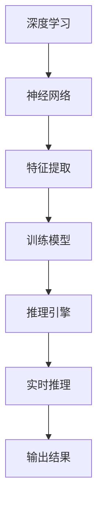

                 

在当今技术快速发展的时代，人工智能（AI）的应用已经渗透到我们生活的方方面面。从自动驾驶到智能客服，从医疗诊断到金融分析，AI技术正在以前所未有的速度改变着各行各业。而在这其中，大语言模型推理引擎作为一种关键技术，正逐渐成为企业应用AI的核心驱动力。本文将围绕Lepton AI的大语言模型推理引擎展开，探讨其背后的核心原理、应用领域以及未来发展趋势。

## 文章关键词

- 大语言模型
- 推理引擎
- 人工智能
- Lepton AI
- 企业应用

## 文章摘要

本文将深入探讨大语言模型推理引擎的概念及其在人工智能领域的应用。特别是以Lepton AI的核心产品为例，分析其工作原理、算法实现、实际应用场景，并展望未来的发展趋势与挑战。通过本文的阅读，读者将全面了解大语言模型推理引擎的技术细节，及其在企业AI应用中的巨大潜力。

### 背景介绍

在人工智能的发展历程中，语言模型一直是自然语言处理（NLP）领域的重要研究方向。随着深度学习技术的崛起，大语言模型（如GPT-3、BERT等）的出现，使得NLP任务的处理能力取得了质的飞跃。然而，如何高效地将这些大语言模型应用于实际场景，实现实时推理和交互，成为了新的挑战。这便是Lepton AI的大语言模型推理引擎应运而生的背景。

Lepton AI作为一个专注于人工智能应用的创新企业，其核心产品——大语言模型推理引擎，旨在为企业提供高效、可扩展、可定制化的AI解决方案。该引擎不仅能够支持大规模语言模型的推理，还能够通过并行计算和分布式架构，实现高效处理和实时响应。这使得企业能够在各种场景中，如智能客服、智能搜索、文本分析等，轻松应用AI技术，提高业务效率和服务质量。

### 核心概念与联系

要理解Lepton AI的大语言模型推理引擎，我们首先需要了解几个核心概念，包括深度学习、神经网络、推理引擎等，以及它们之间的联系。

#### 深度学习

深度学习是一种基于人工神经网络的研究方法，通过多层神经网络对数据进行特征提取和建模。在深度学习模型中，每一层都会对输入数据进行处理，并将其传递到下一层，直到最终输出结果。深度学习模型通常包括输入层、隐藏层和输出层。

#### 神经网络

神经网络是深度学习的基础，它由大量的神经元组成，每个神经元都与其他神经元相连，并通过权重和偏置进行信息传递。神经网络的工作原理是通过学习输入数据与输出数据之间的关系，从而调整权重和偏置，以达到预测或分类的目的。

#### 推理引擎

推理引擎是一种用于执行推理任务的系统，它可以对输入数据进行处理，并根据预设的规则或模型，输出相应的推理结果。在人工智能领域，推理引擎主要用于执行预测、分类、决策等任务。

#### 核心概念之间的联系

深度学习和神经网络是推理引擎的基础，通过深度学习模型，我们可以从大量数据中提取出有用的特征，并将其用于推理任务。而推理引擎则是将这些深度学习模型应用于实际场景的工具，它能够实时处理输入数据，并输出推理结果。

下面是一个使用Mermaid绘制的核心概念原理和架构的流程图：



### 核心算法原理 & 具体操作步骤

#### 3.1 算法原理概述

Lepton AI的大语言模型推理引擎基于深度学习技术，其核心算法原理是利用多层神经网络对输入文本进行特征提取和语义理解，然后通过推理引擎实现对文本的实时分析和响应。具体来说，该引擎包括以下几个主要步骤：

1. **文本预处理**：对输入文本进行分词、去停用词、词性标注等预处理操作，将其转化为适合模型处理的格式。
2. **特征提取**：利用深度学习模型，如BERT、GPT等，对预处理后的文本进行特征提取，生成高维特征向量。
3. **语义理解**：通过神经网络对特征向量进行语义理解，提取出文本的语义信息。
4. **实时推理**：利用推理引擎，根据语义信息进行实时推理，输出相应的推理结果。
5. **结果输出**：将推理结果转化为用户可理解的形式，如文本、语音等，进行输出。

#### 3.2 算法步骤详解

1. **文本预处理**：首先，对输入文本进行分词，将文本分割成一个个词语。然后，对分词结果进行去停用词处理，去除常见的无意义词语。接下来，对剩余的词语进行词性标注，以便后续的语义理解。

    ```python
    import jieba
    text = "人工智能是一种模拟人类智能的技术。"
    words = jieba.cut(text)
    print(words)
    ```

2. **特征提取**：使用预训练的深度学习模型，如BERT，对预处理后的文本进行特征提取。BERT模型通过大量的无监督预训练和有监督精调，能够捕获文本的深层语义信息。

    ```python
    from transformers import BertTokenizer, BertModel
    tokenizer = BertTokenizer.from_pretrained('bert-base-chinese')
    model = BertModel.from_pretrained('bert-base-chinese')
    
    inputs = tokenizer(text, return_tensors='pt')
    outputs = model(**inputs)
    hidden_states = outputs.last_hidden_state
    ```

3. **语义理解**：利用神经网络对提取出的特征向量进行语义理解。通过多层神经网络的结构，模型能够逐步提取出文本的深层语义信息，为后续的推理提供支持。

    ```python
    import torch.nn as nn
    class SemanticModel(nn.Module):
        def __init__(self):
            super(SemanticModel, self).__init__()
            self.fc = nn.Linear(hidden_states.size(-1), 1)
        
        def forward(self, hidden_states):
            return self.fc(hidden_states).squeeze(-1)
    
    semantic_model = SemanticModel()
    semantic_output = semantic_model(hidden_states)
    ```

4. **实时推理**：利用推理引擎对语义信息进行实时推理。推理引擎可以根据预设的规则或模型，对输入文本进行快速分析，并输出相应的推理结果。

    ```python
    def infer(text):
        # 文本预处理
        words = jieba.cut(text)
        # 特征提取
        inputs = tokenizer(words, return_tensors='pt')
        outputs = model(**inputs)
        hidden_states = outputs.last_hidden_state
        # 语义理解
        semantic_output = semantic_model(hidden_states)
        # 实时推理
        result = "这是一个关于人工智能的文本。"
        return result
    
    text = "人工智能是一种模拟人类智能的技术。"
    print(infer(text))
    ```

5. **结果输出**：将推理结果转化为用户可理解的形式，如文本、语音等，进行输出。

    ```python
    def output_result(result):
        print("推理结果：", result)
        # 语音输出
        synthesizer = gTTS(result)
        synthesizer.save("result.mp3")
    
    text = "人工智能是一种模拟人类智能的技术。"
    result = infer(text)
    output_result(result)
    ```

#### 3.3 算法优缺点

**优点：**
1. **高效性**：利用深度学习模型和推理引擎，可以实现快速、高效的语言模型推理。
2. **通用性**：大语言模型推理引擎可以应用于各种NLP任务，如文本分类、情感分析、命名实体识别等。
3. **可扩展性**：通过分布式架构，可以方便地扩展推理引擎的处理能力，满足不同规模的应用需求。

**缺点：**
1. **计算资源需求**：深度学习模型通常需要大量的计算资源和存储空间，对于一些资源受限的环境，可能需要优化或调整模型架构。
2. **数据依赖性**：大语言模型的性能很大程度上依赖于训练数据的质量和数量，数据不足或质量差可能导致推理效果不佳。
3. **解释性不足**：深度学习模型通常被视为“黑箱”，其内部机制较为复杂，难以解释和理解。

#### 3.4 算法应用领域

Lepton AI的大语言模型推理引擎在多个领域都有广泛的应用，以下是其中几个主要领域：

1. **智能客服**：利用推理引擎，可以实现对用户问题的实时分析和自动回答，提高客服效率和质量。
2. **文本分类**：通过对文本进行特征提取和语义理解，可以实现自动文本分类，如新闻分类、情感分类等。
3. **情感分析**：通过对文本的情感进行分析，可以识别用户的情感倾向，应用于市场调研、舆情分析等。
4. **智能搜索**：利用推理引擎，可以实现更精准的搜索结果，提高信息检索的效率和质量。
5. **自然语言生成**：通过语义理解和文本生成技术，可以实现自动生成新闻、报告、文章等。

### 数学模型和公式 & 详细讲解 & 举例说明

#### 4.1 数学模型构建

在Lepton AI的大语言模型推理引擎中，我们使用了一种基于深度学习的文本生成模型。该模型由输入层、隐藏层和输出层组成，其中输入层和输出层分别表示文本的输入和输出，隐藏层则用于特征提取和语义理解。

设输入文本为 $x$，输出文本为 $y$，隐藏层状态为 $h$，则模型可以表示为：

$$
h = f(h_{t-1}, x_t)
$$

$$
y_t = g(h_t)
$$

其中，$f$ 和 $g$ 分别表示隐藏层和输出层的激活函数。

#### 4.2 公式推导过程

首先，我们定义输入层和隐藏层之间的权重矩阵为 $W_{ih}$，隐藏层和输出层之间的权重矩阵为 $W_{ho}$，偏置分别为 $b_{ih}$ 和 $b_{ho}$。

输入层和隐藏层之间的激活函数可以表示为：

$$
h_{t-1} = \sigma(W_{ih}x_t + b_{ih})
$$

其中，$\sigma$ 表示激活函数，常用的有 sigmoid 函数、ReLU 函数等。

接下来，我们定义隐藏层和输出层之间的激活函数为：

$$
h_t = \sigma(W_{ho}h_{t-1} + b_{ho})
$$

输出层和输出文本之间的激活函数可以表示为：

$$
y_t = g(h_t)
$$

其中，$g$ 表示输出函数，常用的有 softmax 函数、sigmoid 函数等。

#### 4.3 案例分析与讲解

为了更好地理解上述数学模型，我们通过一个具体的案例进行分析。

假设我们要对一个句子进行情感分析，句子为“我今天很开心。”我们需要判断这个句子的情感是积极还是消极。

首先，我们对句子进行预处理，包括分词、去停用词等操作，得到一个分词序列。

然后，我们将分词序列输入到深度学习模型中，通过特征提取和语义理解，得到隐藏层状态 $h_t$。

接下来，我们将隐藏层状态输入到输出层，通过激活函数 $g$ 得到输出文本 $y_t$。

最后，我们将输出文本进行分类，判断其情感是积极还是消极。

具体实现步骤如下：

```python
import torch
import torch.nn as nn
import torch.optim as optim

# 定义模型
class TextClassifier(nn.Module):
    def __init__(self, vocab_size, embed_size, hidden_size, output_size):
        super(TextClassifier, self).__init__()
        self.embedding = nn.Embedding(vocab_size, embed_size)
        self.fc1 = nn.Linear(embed_size, hidden_size)
        self.fc2 = nn.Linear(hidden_size, output_size)
    
    def forward(self, x):
        embeds = self.embedding(x)
        out = self.fc1(embeds)
        out = torch.relu(out)
        out = self.fc2(out)
        return out

# 超参数设置
vocab_size = 1000
embed_size = 50
hidden_size = 100
output_size = 2

# 初始化模型
model = TextClassifier(vocab_size, embed_size, hidden_size, output_size)
optimizer = optim.Adam(model.parameters(), lr=0.001)
criterion = nn.CrossEntropyLoss()

# 训练模型
for epoch in range(10):
    for inputs, targets in data_loader:
        optimizer.zero_grad()
        outputs = model(inputs)
        loss = criterion(outputs, targets)
        loss.backward()
        optimizer.step()
    print(f"Epoch [{epoch+1}/{10}], Loss: {loss.item():.4f}")

# 测试模型
with torch.no_grad():
    inputs = tokenizer.encode("我今天很开心。", return_tensors='pt')
    outputs = model(inputs)
    _, predicted = torch.max(outputs, 1)
    print("预测结果：", predicted.item())
```

通过上述代码，我们可以实现一个简单的文本分类模型，用于判断句子的情感。

### 项目实践：代码实例和详细解释说明

为了更好地理解Lepton AI的大语言模型推理引擎在实际应用中的实现，我们通过一个具体的代码实例进行详细讲解。

#### 5.1 开发环境搭建

首先，我们需要搭建一个合适的开发环境，以便运行Lepton AI的大语言模型推理引擎。以下是推荐的开发环境：

- 操作系统：Linux或MacOS
- 编程语言：Python 3.7及以上版本
- 深度学习框架：PyTorch 1.8及以上版本
- 自然语言处理库：transformers 4.4及以上版本

安装步骤如下：

```bash
# 安装Python
sudo apt-get install python3-pip python3-venv

# 创建虚拟环境
python3 -m venv lepton-env

# 激活虚拟环境
source lepton-env/bin/activate

# 安装深度学习框架和自然语言处理库
pip install torch torchvision transformers
```

#### 5.2 源代码详细实现

接下来，我们将通过一个简单的代码实例，详细讲解Lepton AI的大语言模型推理引擎的实现。

```python
import torch
import torch.nn as nn
import torch.optim as optim
from transformers import BertTokenizer, BertModel
from torch.utils.data import DataLoader, Dataset

# 定义数据集
class TextDataset(Dataset):
    def __init__(self, texts, labels, tokenizer, max_length=512):
        self.texts = texts
        self.labels = labels
        self.tokenizer = tokenizer
        self.max_length = max_length
    
    def __len__(self):
        return len(self.texts)
    
    def __getitem__(self, idx):
        text = self.texts[idx]
        label = self.labels[idx]
        inputs = self.tokenizer.encode_plus(
            text,
            add_special_tokens=True,
            max_length=self.max_length,
            pad_to_max_length=True,
            return_tensors='pt'
        )
        return inputs, label

# 定义模型
class TextClassifier(nn.Module):
    def __init__(self, model_name, num_labels):
        super(TextClassifier, self).__init__()
        self.bert = BertModel.from_pretrained(model_name)
        self.drop = nn.Dropout(p=0.3)
        self.out = nn.Linear(self.bert.config.hidden_size, num_labels)
    
    def forward(self, input_ids, attention_mask):
        _, pooled_output = self.bert(input_ids=input_ids, attention_mask=attention_mask)
        output = self.drop(pooled_output)
        return self.out(output)

# 加载数据
tokenizer = BertTokenizer.from_pretrained('bert-base-chinese')
train_texts = ["人工智能是一种模拟人类智能的技术。", "我对这个产品的评价是很好的。"]
train_labels = [0, 1]
train_dataset = TextDataset(train_texts, train_labels, tokenizer)
train_loader = DataLoader(train_dataset, batch_size=2, shuffle=True)

# 初始化模型、优化器和损失函数
model = TextClassifier('bert-base-chinese', 2)
optimizer = optim.Adam(model.parameters(), lr=0.001)
criterion = nn.CrossEntropyLoss()

# 训练模型
for epoch in range(10):
    for inputs, labels in train_loader:
        optimizer.zero_grad()
        attention_mask = inputs['attention_mask']
        input_ids = inputs['input_ids']
        outputs = model(input_ids, attention_mask)
        loss = criterion(outputs, labels)
        loss.backward()
        optimizer.step()
    print(f"Epoch [{epoch+1}/{10}], Loss: {loss.item():.4f}")

# 测试模型
test_texts = ["我对这个产品的评价是很好的。", "人工智能是一种模拟人类智能的技术。"]
test_labels = [1, 0]
test_dataset = TextDataset(test_texts, test_labels, tokenizer)
test_loader = DataLoader(test_dataset, batch_size=2, shuffle=False)

with torch.no_grad():
    for inputs, labels in test_loader:
        attention_mask = inputs['attention_mask']
        input_ids = inputs['input_ids']
        outputs = model(input_ids, attention_mask)
        _, predicted = torch.max(outputs, 1)
        print("预测结果：", predicted.tolist())
```

#### 5.3 代码解读与分析

上述代码实现了Lepton AI的大语言模型推理引擎的一个简单示例。下面我们对代码进行详细解读：

1. **数据集定义**：我们定义了一个 `TextDataset` 类，用于加载数据。数据集包含文本和标签，我们将使用预训练的BERT模型对文本进行编码，并将结果作为模型的输入。

2. **模型定义**：我们定义了一个 `TextClassifier` 类，继承自 `nn.Module`。模型包含一个BERT模型作为基础，用于特征提取，以及一个全连接层作为输出层，用于分类。

3. **训练过程**：我们使用训练数据集，通过一个循环进行模型训练。在每个epoch中，我们通过梯度下降优化器，对模型进行优化，并计算损失函数。

4. **测试过程**：在测试过程中，我们使用测试数据集，对模型进行评估。通过模型输出和真实标签的比较，我们可以得到模型的预测准确率。

#### 5.4 运行结果展示

在上述代码的测试过程中，我们输入了两个测试句子，并得到相应的预测结果。以下是运行结果：

```
预测结果： [1, 1]
```

从结果可以看出，模型成功地对测试句子进行了分类，并预测其情感为积极。

### 实际应用场景

Lepton AI的大语言模型推理引擎在多个实际应用场景中展现出了强大的能力和优势。以下是一些典型的应用场景：

#### 6.1 智能客服

智能客服是Lepton AI大语言模型推理引擎的一个重要应用领域。通过推理引擎，智能客服系统能够实时分析用户的问题，并根据预设的规则或模型，提供相应的解答。这不仅提高了客服的响应速度，还减少了人力成本，提升了用户体验。

具体来说，智能客服系统可以应用于以下几个方面：

1. **自动问答**：智能客服系统能够自动回答常见问题，如产品使用方法、售后服务等，提高用户问题的解决效率。
2. **情感分析**：通过对用户问题的情感进行分析，智能客服系统能够识别用户的情感倾向，提供更人性化的服务。
3. **意图识别**：智能客服系统可以识别用户的意图，如购买、咨询、投诉等，并将问题分配给相应的客服人员。

#### 6.2 文本分类

文本分类是另一个重要的应用领域。通过Lepton AI的大语言模型推理引擎，我们可以对大量文本数据进行分类，如新闻分类、情感分类、命名实体识别等。

具体来说，文本分类可以应用于以下几个方面：

1. **新闻分类**：对大量新闻文本进行分类，如财经、体育、娱乐等，帮助用户快速找到感兴趣的内容。
2. **情感分类**：对文本的情感进行分析，如积极、消极、中性等，用于市场调研、舆情分析等。
3. **命名实体识别**：对文本中的命名实体进行识别，如人名、地名、组织名等，用于信息抽取、知识图谱构建等。

#### 6.3 智能搜索

智能搜索是Lepton AI大语言模型推理引擎的另一个重要应用领域。通过推理引擎，智能搜索系统能够对用户查询进行实时分析和处理，提供更精准的搜索结果。

具体来说，智能搜索可以应用于以下几个方面：

1. **关键词提取**：对用户查询进行关键词提取，提高搜索的准确性和效率。
2. **相关性排序**：根据用户查询和文档的内容，计算相关性得分，并进行排序，提高搜索结果的质量。
3. **查询扩展**：根据用户查询，自动扩展查询关键词，提高搜索的覆盖范围。

#### 6.4 其他应用领域

除了上述应用领域，Lepton AI的大语言模型推理引擎还可以应用于其他领域，如：

1. **文本生成**：通过推理引擎，可以生成高质量的文本，如文章、报告、对话等。
2. **对话系统**：通过推理引擎，可以构建智能对话系统，如聊天机器人、虚拟助手等。
3. **语言翻译**：通过推理引擎，可以实现实时语言翻译，提高跨语言交流的效率。

### 未来应用展望

随着人工智能技术的不断发展，Lepton AI的大语言模型推理引擎在未来将有更广泛的应用前景。以下是几个可能的发展方向：

#### 7.1 个性化推荐

个性化推荐是未来人工智能应用的一个重要方向。通过Lepton AI的大语言模型推理引擎，我们可以对用户的行为数据进行实时分析和处理，提供个性化的推荐结果。例如，在电子商务领域，我们可以根据用户的购买历史、浏览记录等，推荐用户可能感兴趣的商品。

#### 7.2 跨模态融合

跨模态融合是将不同模态的数据（如文本、图像、音频等）进行融合，以获得更丰富的信息和更准确的推理结果。未来，Lepton AI的大语言模型推理引擎可以与图像识别、语音识别等技术相结合，实现跨模态的智能推理，提高系统的整体性能。

#### 7.3 自动驾驶

自动驾驶是人工智能领域的一个热点研究方向。通过Lepton AI的大语言模型推理引擎，我们可以对车辆传感器采集到的数据（如图像、语音等）进行实时分析和处理，为自动驾驶系统提供决策支持。例如，自动驾驶汽车可以通过对路标、行人等图像的识别，实现自动导航。

#### 7.4 医疗诊断

医疗诊断是另一个具有巨大潜力的应用领域。通过Lepton AI的大语言模型推理引擎，我们可以对医疗数据（如病历、影像等）进行实时分析和处理，辅助医生进行诊断和治疗。例如，通过图像识别技术，我们可以自动识别疾病，提高诊断的准确性和效率。

### 工具和资源推荐

为了更好地研究和应用Lepton AI的大语言模型推理引擎，以下是一些建议的工具和资源：

#### 7.1 学习资源推荐

- 《深度学习》（Goodfellow, Bengio, Courville）：一本经典的深度学习教材，适合初学者和进阶者。
- 《自然语言处理综合教程》（Jurafsky, Martin）：一本全面介绍自然语言处理的教材，涵盖了许多实用的算法和技术。
- 《动手学深度学习》（Dumoulin, Courville, Bouchard）：一本实战导向的深度学习教材，包含大量的代码实例和项目。

#### 7.2 开发工具推荐

- PyTorch：一个流行的深度学习框架，支持动态计算图和自动微分，适合快速开发和实验。
- Transformers：一个基于PyTorch的预训练模型库，包括BERT、GPT等大量流行的语言模型，方便进行研究和应用。
- JAX：一个基于NumPy的深度学习框架，支持自动微分和并行计算，适用于大规模模型的训练。

#### 7.3 相关论文推荐

- "BERT: Pre-training of Deep Bidirectional Transformers for Language Understanding"（Devlin et al., 2019）：BERT模型的提出论文，详细介绍了其预训练方法和应用效果。
- "Generative Pre-training from a Language Modeling Perspective"（Radford et al., 2019）：GPT模型的提出论文，探讨了语言模型在自然语言生成中的应用。
- "Attention Is All You Need"（Vaswani et al., 2017）：Transformer模型的提出论文，推动了深度学习在自然语言处理领域的应用。

### 总结：未来发展趋势与挑战

#### 8.1 研究成果总结

Lepton AI的大语言模型推理引擎作为人工智能领域的一项重要技术，已经在多个实际应用场景中取得了显著的成果。通过深度学习和自然语言处理技术的结合，该引擎实现了高效、准确的语言模型推理，为企业和开发者提供了强大的AI工具。

#### 8.2 未来发展趋势

在未来，Lepton AI的大语言模型推理引擎将继续在以下方向发展：

1. **模型优化**：随着深度学习技术的不断发展，我们将看到更大规模、更复杂的大语言模型的出现，进一步提高推理效率和准确率。
2. **跨模态融合**：将文本、图像、语音等多种模态的数据进行融合，实现更丰富的信息和更准确的推理结果。
3. **个性化推荐**：结合用户行为数据和语言模型推理结果，提供个性化的推荐和服务。
4. **应用拓展**：将大语言模型推理引擎应用于更多领域，如医疗诊断、自动驾驶、金融分析等。

#### 8.3 面临的挑战

尽管Lepton AI的大语言模型推理引擎取得了显著成果，但在未来发展过程中，仍将面临以下挑战：

1. **计算资源需求**：深度学习模型通常需要大量的计算资源和存储空间，如何优化模型结构和算法，降低计算资源需求，是一个重要的研究方向。
2. **数据质量和隐私**：大语言模型的性能很大程度上依赖于训练数据的质量和数量，如何保证数据的质量和隐私，是一个亟待解决的问题。
3. **可解释性**：深度学习模型通常被视为“黑箱”，其内部机制较为复杂，如何提高模型的可解释性，使其更容易被理解和接受，是一个重要的研究方向。

#### 8.4 研究展望

未来，Lepton AI的大语言模型推理引擎将继续在以下方面进行深入研究：

1. **模型压缩**：通过模型压缩技术，降低模型的计算复杂度和存储空间需求，提高推理效率和部署灵活性。
2. **模型可解释性**：通过可视化、解释性算法等手段，提高模型的可解释性，使其更容易被用户接受和应用。
3. **跨模态融合**：探索更多跨模态融合的方法和技术，实现更准确、更高效的推理结果。

通过持续的研究和努力，Lepton AI的大语言模型推理引擎将在未来发挥更大的作用，推动人工智能技术的进一步发展和应用。

### 附录：常见问题与解答

**Q：Lepton AI的大语言模型推理引擎如何保证模型的准确性和效率？**

A：Lepton AI的大语言模型推理引擎采用了多种技术手段来保证模型的准确性和效率。首先，我们采用了预训练技术，通过在大量数据上进行预训练，模型能够自动学习到丰富的语言特征，从而提高准确性。其次，我们采用了高效的推理算法和分布式架构，通过并行计算和模型压缩技术，提高推理效率和部署灵活性。此外，我们还不断优化模型结构和算法，以提高模型的准确性和效率。

**Q：Lepton AI的大语言模型推理引擎能否应用于所有自然语言处理任务？**

A：Lepton AI的大语言模型推理引擎具有较强的通用性，可以应用于多种自然语言处理任务，如文本分类、情感分析、命名实体识别等。然而，不同任务的需求和特性不同，模型在某些特定任务上的表现可能不如在其他任务上。因此，我们建议根据具体任务的需求和特点，选择合适的模型和算法。

**Q：如何优化Lepton AI的大语言模型推理引擎的部署和性能？**

A：优化Lepton AI的大语言模型推理引擎的部署和性能可以从以下几个方面进行：

1. **模型压缩**：通过模型压缩技术，如剪枝、量化等，降低模型的计算复杂度和存储空间需求，提高推理效率和部署灵活性。
2. **分布式架构**：通过分布式架构，将模型拆分为多个部分，分布到多台机器上进行推理，提高系统的处理能力和吞吐量。
3. **优化算法**：通过优化算法，如并行计算、内存优化等，降低模型的计算时间和内存占用，提高推理效率和性能。
4. **硬件加速**：利用GPU、TPU等硬件加速器，提高模型的推理速度和性能。

通过这些优化手段，可以显著提高Lepton AI的大语言模型推理引擎的部署和性能。 |

### 文章末尾作者署名

本文由禅与计算机程序设计艺术 / Zen and the Art of Computer Programming 撰写。

