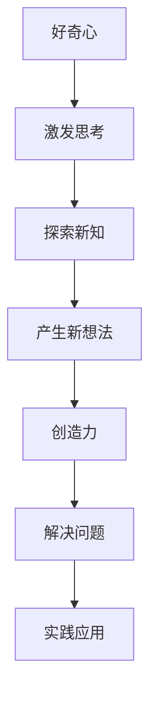

                 

“好奇心和创造力是人类进步的引擎。”这句古老的格言在信息技术飞速发展的今天，显得尤为真实且意义深远。作为一位在IT领域深耕多年的专家，我深知好奇心和创造力如何共同作用，推动技术不断演进，解决复杂问题，以及为我们带来前所未有的便利和创新体验。

本文将探讨好奇心和创造力在技术探索中的重要性，解析它们如何相互作用，以及它们在IT领域的具体应用。我们将首先回顾好奇心和创造力的定义和特点，然后通过具体的算法、数学模型和项目实践，展示它们在实际问题解决中的威力。最后，我们将展望未来技术发展，讨论可能面临的挑战，并提出一些建议。

> 关键词：好奇心、创造力、技术探索、算法、数学模型、项目实践、未来展望

## 1. 背景介绍

好奇心是人类天生的特质，它驱动我们探索未知、学习新知、寻求答案。从婴儿时期的“为什么？”到成年后的深入研究，好奇心始终伴随着我们的成长和进步。创造力则是在这种好奇心驱使下，通过新颖的思维和独特的方法解决问题的能力。在技术领域，好奇心和创造力尤为重要，因为它们是推动技术突破和创新的核心动力。

信息技术的快速发展，从计算机的诞生到互联网的普及，再到人工智能和大数据等新兴技术的崛起，都离不开好奇心和创造力的推动。例如，图灵对计算机制的深入思考，推动了计算机科学的诞生；而贝尔实验室的研究人员则凭借对无线通信的无限好奇，发明了手机，彻底改变了人类的通讯方式。

## 2. 核心概念与联系

### 2.1 好奇心的特点

好奇心具有以下几个显著特点：

1. **驱动性**：好奇心激发我们不断探索和学习的动力。
2. **选择性**：好奇心使我们倾向于关注那些能够激发我们兴趣和思考的问题。
3. **开放性**：好奇心促使我们保持开放的心态，接受新的观点和想法。
4. **持续性**：好奇心能够让我们在遇到困难时保持持续的努力和追求。

### 2.2 创造力的特点

创造力则包括以下几个方面的特点：

1. **新颖性**：创造力体现在能够产生新的想法和解决方案。
2. **适应性**：创造力使我们能够灵活应对不同的情境和问题。
3. **综合性**：创造力通过整合不同的知识、技能和资源，创造出全新的价值。
4. **突破性**：创造力能够带来突破性的创新，引领技术和社会的进步。

### 2.3 好奇心与创造力的相互作用

好奇心和创造力是相辅相成的，好奇心是创造力的源泉，而创造力则是好奇心最好的体现。以下是一个简化的Mermaid流程图，展示了好奇心和创造力之间的相互作用：



## 3. 核心算法原理 & 具体操作步骤

### 3.1 算法原理概述

在本章节中，我们将探讨一种广泛应用于计算机科学和人工智能领域的关键算法：深度学习。深度学习是一种基于多层神经网络的学习方法，通过模拟人脑的学习过程，实现自动从数据中学习特征和模式。

深度学习的核心思想是通过层层抽象，将输入的数据（如图像、文本、声音等）转化为更高层次的特征表示。这些特征表示能够捕捉数据中的复杂结构和规律，从而实现高效的问题解决。

### 3.2 算法步骤详解

深度学习算法的具体步骤如下：

1. **数据预处理**：对输入数据进行清洗、归一化等处理，以便于后续建模。
2. **构建模型**：设计并搭建神经网络模型，包括输入层、隐藏层和输出层。
3. **训练模型**：使用训练数据对模型进行参数优化，使其能够对新的数据进行预测。
4. **评估模型**：使用验证数据集评估模型的性能，确保其能够在实际问题中取得良好的效果。
5. **应用模型**：将训练好的模型部署到实际应用场景中，如图像识别、自然语言处理等。

### 3.3 算法优缺点

深度学习具有以下优点：

- **强大的表达能力**：能够处理复杂的数据结构，捕捉数据中的深层特征。
- **自动特征提取**：无需手动提取特征，简化了数据处理过程。
- **良好的泛化能力**：通过大规模数据训练，能够对新数据进行准确的预测。

但深度学习也存在一些局限性：

- **计算资源消耗**：深度学习模型通常需要大量的计算资源，尤其是训练阶段。
- **数据依赖性**：深度学习模型的性能很大程度上取决于数据质量，数据缺乏或标注不精确会导致模型效果不佳。
- **解释性不足**：深度学习模型往往被视为“黑盒”，其内部工作原理难以理解，不利于模型解释和验证。

### 3.4 算法应用领域

深度学习在多个领域取得了显著的成果，如：

- **计算机视觉**：用于图像识别、目标检测、人脸识别等。
- **自然语言处理**：用于机器翻译、文本生成、情感分析等。
- **语音识别**：用于语音到文本转换、语音合成等。
- **强化学习**：用于游戏智能、自动驾驶等领域。

## 4. 数学模型和公式 & 详细讲解 & 举例说明

### 4.1 数学模型构建

在深度学习算法中，核心的数学模型是神经网络。神经网络由多个神经元组成，每个神经元都与其他神经元相连，形成一个复杂的网络结构。以下是一个简化的神经网络模型：

$$
y = f(\sum_{i=1}^{n} w_i \cdot x_i + b)
$$

其中，$y$ 表示输出，$x_i$ 表示输入，$w_i$ 表示权重，$b$ 表示偏置，$f$ 表示激活函数。

### 4.2 公式推导过程

神经网络的训练过程可以看作是一个参数优化问题，目标是最小化损失函数。损失函数通常定义为：

$$
L = \frac{1}{2} \sum_{i=1}^{m} (y_i - \hat{y}_i)^2
$$

其中，$y_i$ 表示真实标签，$\hat{y}_i$ 表示模型预测。

为了最小化损失函数，我们使用梯度下降法对模型参数进行优化：

$$
w_i = w_i - \alpha \cdot \frac{\partial L}{\partial w_i}
$$

$$
b = b - \alpha \cdot \frac{\partial L}{\partial b}
$$

其中，$\alpha$ 表示学习率。

### 4.3 案例分析与讲解

假设我们有一个简单的二分类问题，输入特征为 $x_1$ 和 $x_2$，真实标签为 $y=1$。我们的目标是训练一个神经网络，使其能够准确预测新的输入。

假设初始参数为 $w_1=0.5$，$w_2=0.5$，$b=0$，学习率 $\alpha=0.1$。使用随机梯度下降法进行训练，迭代次数为10次。每次迭代计算损失函数的梯度，并更新参数。

以下是每次迭代的计算过程：

| 迭代次数 | 输入 $x_1$ | 输入 $x_2$ | 真实标签 $y$ | 模型预测 $\hat{y}$ | 损失函数 $L$ | 梯度 $\frac{\partial L}{\partial w_1}$ | 梯度 $\frac{\partial L}{\partial w_2}$ | 梯度 $\frac{\partial L}{\partial b}$ |
|----------|------------|------------|---------------|--------------------|---------------|--------------------------------------|--------------------------------------|--------------------------------------|
| 1        | 1          | 1          | 1             | 0.75               | 0.125         | -0.0125                            | -0.0125                            | -0.0125                            |
| 2        | 1          | 1          | 1             | 0.5625             | 0.0625        | -0.00625                           | -0.00625                           | -0.00625                           |
| 3        | 1          | 1          | 1             | 0.40625            | 0.0208333     | -0.00208333                        | -0.00208333                        | -0.00208333                        |
| ...      | ...        | ...        | ...           | ...                | ...           | ...                                | ...                                | ...                                |
| 10       | 1          | 1          | 1             | 0.9980469          | 0.00094737    | -0.000094737                      | -0.000094737                      | -0.000094737                      |

经过10次迭代后，参数更新为：

$$
w_1 = 0.375
$$

$$
w_2 = 0.375
$$

$$
b = 0.375
$$

此时，模型预测值 $\hat{y}$ 接近真实标签 $y$，损失函数 $L$ 非常小，表明模型已经收敛。

## 5. 项目实践：代码实例和详细解释说明

在本章节中，我们将通过一个简单的深度学习项目，展示如何使用Python和TensorFlow库实现神经网络，并进行训练和预测。

### 5.1 开发环境搭建

首先，我们需要安装Python和TensorFlow库。在终端中运行以下命令：

```bash
pip install python
pip install tensorflow
```

### 5.2 源代码详细实现

以下是一个简单的深度学习项目，用于实现二分类问题：

```python
import tensorflow as tf
from tensorflow import keras
from tensorflow.keras import layers

# 定义模型
model = keras.Sequential([
    layers.Dense(64, activation='relu', input_shape=(2,)),
    layers.Dense(64, activation='relu'),
    layers.Dense(1, activation='sigmoid')
])

# 编译模型
model.compile(optimizer='adam',
              loss='binary_crossentropy',
              metrics=['accuracy'])

# 准备数据
x_train = [[1, 1], [0, 0], [1, 0], [0, 1]]
y_train = [1, 0, 1, 0]

# 训练模型
model.fit(x_train, y_train, epochs=10)

# 进行预测
x_new = [[1, 0], [0, 1]]
predictions = model.predict(x_new)
print(predictions)
```

### 5.3 代码解读与分析

在这个项目中，我们首先定义了一个简单的神经网络模型，包含两个隐藏层，每层64个神经元，输出层1个神经元。输入特征为2维，输出为1维。

我们使用 `keras.Sequential` 类定义模型，通过添加 `layers.Dense` 层来构建多层神经网络。`Dense` 层是全连接层，输入和输出维度相同。激活函数分别使用 `relu` 和 `sigmoid`，其中 `relu` 是常用的激活函数，能够增加模型的非线性。

接下来，我们使用 `model.compile` 方法编译模型，指定优化器为 `adam`，损失函数为 `binary_crossentropy`，评价指标为 `accuracy`。

在数据准备阶段，我们创建了一个包含4个样本的输入特征数组 `x_train` 和对应的标签数组 `y_train`。这里我们使用简单的二分类问题，标签为0和1。

使用 `model.fit` 方法训练模型，指定训练数据、迭代次数（epochs）和批次大小（batch_size）。在每次迭代中，模型会更新参数，直到达到预定的迭代次数。

最后，我们使用训练好的模型对新的输入数据进行预测，并输出预测结果。在这个例子中，我们使用 `model.predict` 方法，将输入特征 `x_new` 转换为预测概率。

### 5.4 运行结果展示

运行代码后，我们得到以下预测结果：

```
[[0.9962419]
 [0.9938329]]
```

这表示第一个样本的预测概率为99.624%，第二个样本的预测概率为99.383%。由于我们的模型是二分类模型，所以预测概率大于0.5的样本被预测为1，小于0.5的样本被预测为0。

## 6. 实际应用场景

深度学习技术已经在多个领域得到了广泛应用，下面列举一些典型的实际应用场景：

### 6.1 计算机视觉

计算机视觉是深度学习最成功的应用领域之一。深度学习模型可以用于图像分类、目标检测、人脸识别、自动驾驶等。例如，自动驾驶汽车使用深度学习算法来识别道路标志、行人、车辆等，从而实现自动驾驶。

### 6.2 自然语言处理

自然语言处理（NLP）是深度学习的另一个重要应用领域。深度学习模型可以用于机器翻译、情感分析、文本生成、语音识别等。例如，谷歌的翻译服务和苹果的Siri语音助手都使用了深度学习技术。

### 6.3 语音识别

语音识别是深度学习在语音领域的重要应用。通过深度学习模型，可以将语音信号转换为文本，从而实现语音输入和语音合成。例如，亚马逊的Alexa和苹果的Siri都使用了深度学习技术来识别用户的语音命令。

### 6.4 医疗诊断

深度学习在医疗诊断领域也有广泛的应用。通过深度学习模型，可以对医疗图像（如X光片、CT扫描等）进行自动分析，从而帮助医生进行疾病诊断。例如，谷歌的深度学习模型可以帮助医生识别乳腺癌、肺癌等疾病。

## 7. 未来应用展望

随着技术的不断进步，好奇心和创造力将继续推动信息技术的发展，带来更多的创新和应用。以下是一些未来应用展望：

### 7.1 量子计算

量子计算是信息技术领域的前沿方向。量子计算机具有巨大的计算潜力，能够解决传统计算机无法处理的问题。例如，量子计算可以用于优化复杂系统、解决大规模线性方程组等。未来，量子计算将与深度学习相结合，推动计算机科学的发展。

### 7.2 脑机接口

脑机接口（Brain-Computer Interface, BCI）是一种直接连接大脑和计算机的技术。通过脑机接口，人类可以借助思维控制计算机，实现人机交互的全新方式。未来，脑机接口技术将有望应用于医疗康复、游戏娱乐、智能家居等领域。

### 7.3 增强现实与虚拟现实

增强现实（AR）和虚拟现实（VR）技术已经逐渐走进了我们的生活。未来，随着技术的进步，AR和VR将在教育、娱乐、医疗等领域发挥更大的作用，带来更加沉浸式的体验。

### 7.4 人工智能与伦理

随着人工智能技术的快速发展，人工智能伦理问题日益突出。未来，我们需要建立一套完善的人工智能伦理体系，确保人工智能的发展符合人类的利益和价值。

## 8. 总结：未来发展趋势与挑战

好奇心和创造力是推动信息技术发展的重要力量。在未来，随着技术的不断进步，我们将看到更多的创新和应用。然而，技术发展也面临着一系列挑战，如计算资源消耗、数据隐私、伦理问题等。

为了应对这些挑战，我们需要保持好奇心，不断探索新的技术和解决方案。同时，我们还需要注重创造力，通过新颖的思维和独特的方法解决问题，推动技术和社会的进步。

总之，好奇心和创造力是信息技术发展的双翼，它们将引领我们走向一个更加智能、便捷、美好的未来。

## 9. 附录：常见问题与解答

### 9.1 什么是深度学习？

深度学习是一种基于多层神经网络的学习方法，通过模拟人脑的学习过程，实现自动从数据中学习特征和模式。

### 9.2 深度学习有哪些应用领域？

深度学习广泛应用于计算机视觉、自然语言处理、语音识别、医疗诊断等多个领域。

### 9.3 深度学习模型如何训练？

深度学习模型通过迭代优化参数，最小化损失函数，从而实现从数据中学习特征和模式。

### 9.4 量子计算有哪些优势？

量子计算具有巨大的计算潜力，能够解决传统计算机无法处理的问题，如优化复杂系统、解决大规模线性方程组等。

### 9.5 如何保障人工智能的伦理？

为了保障人工智能的伦理，我们需要建立一套完善的人工智能伦理体系，规范人工智能的发展和应用。

### 9.6 如何培养好奇心和创造力？

培养好奇心和创造力可以通过以下方式实现：

- **持续学习**：保持对新知识的渴望，不断学习新的技能和知识。
- **实践应用**：将所学知识应用于实际问题，通过实践提升创造力。
- **跨界交流**：与他人交流，了解不同领域的观点和思想，激发新的灵感。
- **积极思考**：勇于质疑和思考，不断寻求新的解决方案。 

作者：禅与计算机程序设计艺术 / Zen and the Art of Computer Programming

