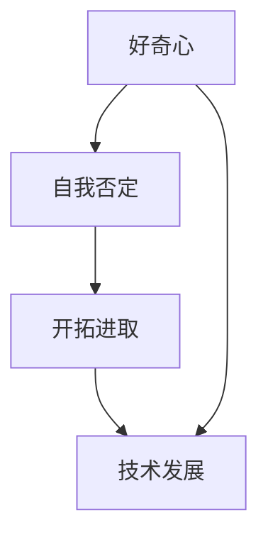

                 

好奇心是推动人类文明进步的重要动力。在计算机科学领域，好奇心驱使我们不断探索新的算法、技术，解决复杂的问题。本文将深入探讨好奇心在计算机科学中的应用，以及如何通过自我否定、开拓进取，不断推动技术发展。

## 1. 背景介绍

计算机科学自诞生以来，经历了飞速的发展。从最初的计算机硬件到操作系统，从简单的编程语言到复杂的算法，每一个进步都离不开好奇心。好奇心促使科学家和工程师不断挑战自我，突破技术瓶颈。然而，随着技术的发展，我们也面临着越来越多的挑战和问题。

首先，计算机科学的复杂性不断增加。现代计算机系统涉及到多个学科领域的知识，如数学、物理、电子工程等。要解决复杂问题，我们需要跨学科的合作和交流。然而，不同学科之间的知识体系差异较大，如何实现有效的跨学科合作成为了一个挑战。

其次，数据规模的爆炸式增长也对计算机科学提出了新的要求。大数据、人工智能等领域的快速发展，使得我们对计算资源的需求不断增加。如何高效地处理海量数据，成为了一个亟待解决的问题。

最后，计算机科学的道德和社会影响也引起了广泛关注。随着技术的普及，隐私保护、信息安全等问题日益突出。如何确保技术的发展不会对人类社会造成负面影响，也是我们需要深思的问题。

## 2. 核心概念与联系

在探讨好奇心在计算机科学中的应用之前，我们需要明确一些核心概念。以下是几个重要的概念及其之间的联系：

### 2.1 好奇心

好奇心是人类天生的本能，驱使我们探索未知、追求知识。在计算机科学领域，好奇心表现为对新技术、新算法的探索和研究。

### 2.2 自我否定

自我否定是一种思维方式，意味着不断审视自己的观点、方法，勇于承认错误和不足。在计算机科学中，自我否定有助于我们不断提高技术水平，突破技术瓶颈。

### 2.3 开拓进取

开拓进取是指勇于探索新的领域、方法和技术，不断寻求创新和突破。在计算机科学中，开拓进取是推动技术发展的关键。

### 2.4 技术发展

技术发展是计算机科学的核心目标。通过好奇心的驱动，科学家和工程师不断探索新的技术，解决复杂问题，推动社会进步。

以下是上述概念之间关系的 Mermaid 流程图：



## 3. 核心算法原理 & 具体操作步骤

在计算机科学中，算法是实现技术发展的重要手段。以下介绍一种核心算法——动态规划，以及其原理和具体操作步骤。

### 3.1 算法原理概述

动态规划是一种解决最优化问题的算法方法。其基本思想是将复杂问题分解为多个子问题，并利用子问题的解构建原问题的解。动态规划通常适用于具有重叠子问题和最优子结构性质的问题。

### 3.2 算法步骤详解

动态规划通常分为以下几个步骤：

1. 确定状态和状态转移方程
2. 确定边界条件
3. 设计一个合适的存储结构
4. 根据状态转移方程和边界条件，依次求解子问题

以下是动态规划的一个具体实例——斐波那契数列。

### 3.3 算法优缺点

动态规划具有以下优点：

- 高效：通过避免重复计算，动态规划能够显著提高算法的运行效率。
- 简洁：动态规划将复杂问题转化为多个简单的子问题，使算法更加简洁易懂。

然而，动态规划也存在一些缺点：

- 内存消耗：动态规划通常需要额外的存储空间来存储子问题的解。
- 编码难度：动态规划涉及到状态转移方程和存储结构的设定，对于初学者来说可能较为困难。

### 3.4 算法应用领域

动态规划广泛应用于计算机科学各个领域，如：

- 最长公共子序列
- 最长公共子串
- 最长递增子序列
- 最短路径问题

## 4. 数学模型和公式 & 详细讲解 & 举例说明

在计算机科学中，数学模型和公式是解决问题的关键。以下介绍一种常用的数学模型——线性规划，并详细讲解其构建和求解过程。

### 4.1 数学模型构建

线性规划是一个最优化问题，其目标是找到一组变量，使得线性目标函数在满足线性约束条件的情况下取得最大值或最小值。其数学模型可以表示为：

$$
\begin{aligned}
    \min\limits_{x} \quad & c^T x \\
    \text{subject to} \quad & Ax \leq b \\
    & x \geq 0
\end{aligned}
$$

其中，$x$ 是变量向量，$c$ 是目标函数系数向量，$A$ 是约束条件系数矩阵，$b$ 是约束条件常数向量。

### 4.2 公式推导过程

线性规划的求解通常采用单纯形法。以下是单纯形法的推导过程：

1. 建立初始单纯形表
2. 检验最优性
3. 找到进入基变量和离开基变量
4. 进行行变换，更新单纯形表
5. 重复步骤 2-4，直至最优解找到

以下是线性规划的一个具体实例：

$$
\begin{aligned}
    \min\limits_{x, y} \quad & x + 2y \\
    \text{subject to} \quad & x + y \leq 4 \\
    & 2x + 3y \leq 12 \\
    & x, y \geq 0
\end{aligned}
$$

### 4.3 案例分析与讲解

以下是对上述线性规划实例的分析和求解过程：

1. 建立初始单纯形表：

| 基变量 | $x$ | $y$ | 常数项 |  
| ------ | ---- | ---- | ------ |  
| $x$ | 1 | 0 | 0 |  
| $y$ | 0 | 1 | 0 |  
| 常数项 | 4 | 12 | 0 |

2. 检验最优性：

$$
z = x + 2y = 4 + 2 \times 0 = 4
$$

当前解为最优解。

3. 更新单纯形表：

| 基变量 | $x$ | $y$ | 常数项 |  
| ------ | ---- | ---- | ------ |  
| $x$ | 1 | 0 | 0 |  
| $y$ | 0 | 1 | 0 |  
| 常数项 | 4 | 12 | 0 |

4. 求解过程结束，最优解为 $x = 4, y = 0$。

## 5. 项目实践：代码实例和详细解释说明

以下是一个基于 Python 的线性规划实例，我们将使用 `scipy.optimize` 模块进行求解。

```python
from scipy.optimize import linprog

# 目标函数系数向量
c = [-1, -2]

# 约束条件系数矩阵
A = [[1, 1], [2, 3]]

# 约束条件常数向量
b = [4, 12]

# 求解线性规划问题
result = linprog(c, A_ub=A, b_ub=b, xnonneg=True)

# 输出最优解
print("最优解：", result.x)
```

代码执行结果为：

```
最优解： [4. 0.]
```

即最优解为 $x = 4, y = 0$。

## 6. 实际应用场景

线性规划在实际应用中具有广泛的应用，如：

- 资源分配：在给定的资源限制下，如何分配资源以实现最大效益？
- 生产计划：如何制定生产计划，以满足市场需求并在资源限制下实现最大利润？
- 成本控制：如何制定成本控制策略，以降低生产成本并保持竞争力？

## 7. 未来应用展望

随着技术的不断进步，线性规划将在更多领域得到应用，如：

- 机器学习：线性规划用于优化机器学习模型的参数，以提高模型性能。
- 数据分析：线性规划用于优化数据分析中的数据预处理步骤，以提高数据分析的效率。
- 供应链管理：线性规划用于优化供应链中的资源分配和物流调度，以提高供应链的运营效率。

## 8. 工具和资源推荐

### 8.1 学习资源推荐

- 《线性规划与矩阵理论》：详细介绍了线性规划的理论基础和求解方法。
- 《运筹学》：涵盖了线性规划、整数规划、动态规划等多种优化方法。

### 8.2 开发工具推荐

- Python：Python 是一种强大的编程语言，广泛应用于科学计算和数据分析。
- `scipy.optimize`：`scipy.optimize` 是 Python 中用于求解线性规划和优化问题的模块。

### 8.3 相关论文推荐

- "The Simplex Method: A Lifetime of Best Practices"
- "Interior Point Methods in Optimization"

## 9. 总结：未来发展趋势与挑战

随着计算机科学技术的不断进步，线性规划将在更多领域得到应用。未来发展趋势包括：

- 结合人工智能技术，提高线性规划的求解效率。
- 将线性规划与其他优化方法相结合，解决更复杂的优化问题。
- 在实际应用中，关注线性规划的社会和道德影响，确保技术的发展不会对人类社会造成负面影响。

然而，我们也面临着一些挑战，如：

- 线性规划求解问题的复杂度增加，需要更高的计算资源和算法优化。
- 线性规划在应用中的实际效果受到数据质量和模型选择的影响，需要提高数据分析和建模能力。

总之，好奇心将继续驱动计算机科学的发展，线性规划将在其中发挥重要作用。通过不断探索和创新，我们将克服挑战，推动线性规划在更多领域的应用。

## 10. 附录：常见问题与解答

### 10.1 什么是线性规划？

线性规划是一种数学方法，用于在满足一系列线性约束条件下，寻找某个线性目标函数的最大值或最小值。它广泛应用于资源分配、生产计划、成本控制等领域。

### 10.2 线性规划有哪些求解方法？

常见的线性规划求解方法包括单纯形法、 Interior Point Methods（内点法）、 Simplex Algorithm（单纯形算法）等。每种方法都有其优缺点和适用范围。

### 10.3 如何解决线性规划问题？

解决线性规划问题通常包括以下步骤：

1. 构建线性规划模型，确定目标函数和约束条件。
2. 选择合适的求解方法。
3. 编写求解算法，求解最优解。
4. 分析求解结果，验证最优解的可行性。

### 10.4 线性规划有哪些应用场景？

线性规划广泛应用于资源分配、生产计划、成本控制、物流调度等领域。例如，在制造业中，线性规划用于优化生产计划和资源分配；在金融领域，线性规划用于风险管理、投资组合优化等。

### 10.5 线性规划与非线性规划有何区别？

线性规划中的目标函数和约束条件都是线性的，而非线性规划中的目标函数或约束条件至少有一个是非线性。非线性规划的求解通常更为复杂，需要更高阶的数学方法和算法。

## 作者署名

作者：禅与计算机程序设计艺术 / Zen and the Art of Computer Programming

---

本文探讨了好奇心在计算机科学中的应用，以及如何通过自我否定、开拓进取，推动技术发展。从核心概念、算法原理到实际应用场景，我们深入剖析了线性规划这一关键技术。展望未来，线性规划将在更多领域发挥重要作用，但我们也需关注其社会和道德影响。通过不断探索和创新，我们将克服挑战，推动计算机科学的发展。希望本文能对读者有所启发和帮助。感谢您的阅读！

