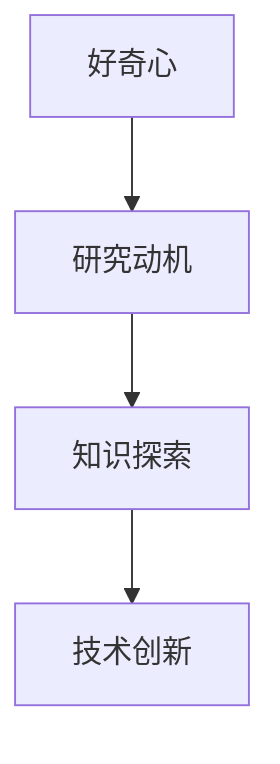
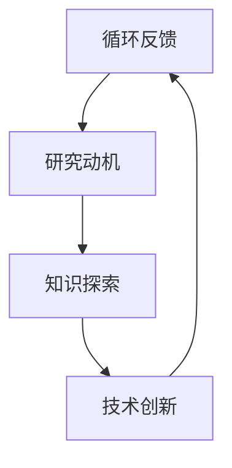

                 

好奇心，如同夜空中的星星，照亮了我们探索未知的道路。在信息技术飞速发展的今天，好奇心更是成为我们理解和驾驭世界的钥匙。本文将探讨好奇心在计算机科学和技术领域的独特作用，通过逻辑清晰、结构紧凑、简单易懂的专业技术语言，帮助读者理解好奇心如何驱动我们的研究和创新。

## 关键词
- 好奇心
- 计算机科学
- 技术创新
- 研究动机
- 知识探索

## 摘要
本文旨在探讨好奇心在计算机科学和技术领域的核心作用。我们将分析好奇心如何激发研究动机、促进知识探索，并最终推动技术创新。通过深入探讨好奇心在技术发展中的重要性，本文旨在为读者提供一种全新的视角，理解好奇心是如何成为探索世界的钥匙。

## 1. 背景介绍
### 1.1 好奇心的定义
好奇心是一种强烈的求知欲和探索欲望，是人类本能中的一种积极情感。它推动着我们不断提问、学习和发现。在计算机科学领域，好奇心表现为对未知技术的探索、对复杂算法的深入研究以及对新型应用的尝试。

### 1.2 好奇心的作用
好奇心不仅激发了个人的研究兴趣，还促进了知识的积累和传播。在计算机科学中，好奇心驱动了算法的创新、编程语言的改进以及计算机架构的优化。例如，图灵对计算机制的思考催生了现代计算机科学的基础，而计算机图形学的发展则源于对现实世界图像的探索。

### 1.3 技术发展的历史
回顾技术发展的历史，我们可以看到好奇心如何成为推动力量。从古代的机械装置到现代的互联网技术，好奇心的驱使使人类不断超越自我，创造了无数的技术奇迹。例如，互联网的诞生源于对全球信息互联的渴望，而智能手机的出现则源于对便捷通信的向往。

## 2. 核心概念与联系
为了更好地理解好奇心在计算机科学中的重要性，我们首先需要了解一些核心概念，并通过Mermaid流程图展示它们之间的联系。

### 2.1 好奇心的核心概念
- **研究动机**：好奇心激发的研究动机是推动科学进步的关键。
- **知识探索**：在探索过程中，新知识不断被发现和积累。
- **技术创新**：基于新知识的应用和改进推动了技术的创新。



### 2.2 核心概念的联系
好奇心通过激发研究动机，引导知识探索，最终实现技术创新。这一过程形成了一个闭环，使得好奇心成为推动技术发展的核心动力。



## 3. 核心算法原理 & 具体操作步骤
### 3.1 算法原理概述
好奇心驱动的算法创新是计算机科学的一个重要领域。以深度学习为例，其原理基于多层神经网络，通过对大量数据的学习，实现图像识别、语音识别等复杂任务。

### 3.2 算法步骤详解
1. **数据收集**：好奇心驱使我们收集大量相关的数据。
2. **模型构建**：基于收集到的数据，构建深度学习模型。
3. **训练**：使用数据对模型进行训练，优化其参数。
4. **测试**：在测试数据集上评估模型性能。
5. **迭代**：根据测试结果，对模型进行调整和优化。

### 3.3 算法优缺点
- **优点**：能够处理复杂数据，实现高效的特征提取。
- **缺点**：对计算资源要求较高，训练过程复杂。

### 3.4 算法应用领域
深度学习在计算机视觉、自然语言处理等领域有广泛的应用，例如自动驾驶、语音助手等。

## 4. 数学模型和公式 & 详细讲解 & 举例说明
### 4.1 数学模型构建
好奇心驱动的算法往往需要复杂的数学模型。以神经网络为例，其基本数学模型包括：

$$
y = \sigma(W \cdot x + b)
$$

其中，$W$ 是权重矩阵，$x$ 是输入特征，$b$ 是偏置项，$\sigma$ 是激活函数。

### 4.2 公式推导过程
神经网络的推导涉及微积分和线性代数的知识。通过反向传播算法，我们可以优化模型的参数，实现训练过程。

### 4.3 案例分析与讲解
以图像识别为例，我们可以使用卷积神经网络（CNN）进行模型构建。通过对大量图像数据的学习，CNN 能够实现高精度的图像分类。

## 5. 项目实践：代码实例和详细解释说明
### 5.1 开发环境搭建
首先，我们需要搭建一个适合深度学习开发的Python环境，包括TensorFlow、Keras等库。

### 5.2 源代码详细实现
以下是一个简单的CNN模型实现：

```python
from tensorflow.keras.models import Sequential
from tensorflow.keras.layers import Conv2D, MaxPooling2D, Flatten, Dense

model = Sequential()
model.add(Conv2D(32, (3, 3), activation='relu', input_shape=(64, 64, 3)))
model.add(MaxPooling2D(pool_size=(2, 2)))
model.add(Flatten())
model.add(Dense(1, activation='sigmoid'))

model.compile(optimizer='adam', loss='binary_crossentropy', metrics=['accuracy'])
```

### 5.3 代码解读与分析
上述代码首先定义了一个简单的CNN模型，包括卷积层、池化层和全连接层。编译模型时，我们使用Adam优化器和二进制交叉熵损失函数。

### 5.4 运行结果展示
通过训练和测试，我们可以得到模型的准确率。以下是一个训练过程的示例：

```python
model.fit(x_train, y_train, epochs=10, batch_size=32)
```

## 6. 实际应用场景
好奇心驱动的技术广泛应用于各个领域。例如，在医疗领域，好奇心推动了基因组学和人工智能的结合，实现了个性化医疗；在能源领域，好奇心促使了可再生能源技术的突破。

### 6.4 未来应用展望
随着好奇心不断驱动技术创新，未来我们将看到更多的跨领域应用。例如，量子计算与人工智能的结合，有望带来全新的计算能力和应用场景。

## 7. 工具和资源推荐
### 7.1 学习资源推荐
- 《深度学习》（Ian Goodfellow、Yoshua Bengio、Aaron Courville 著）
- 《Python深度学习》（François Chollet 著）

### 7.2 开发工具推荐
- TensorFlow
- Keras

### 7.3 相关论文推荐
- “A Theoretical Basis for the Deep Learning Paradigm” (Yosua Bengio, 2009)
- “Deep Learning” (Ian Goodfellow, 2016)

## 8. 总结：未来发展趋势与挑战
### 8.1 研究成果总结
好奇心驱动的研究成果丰硕，从深度学习到人工智能，从基因组学到量子计算，好奇心成为技术创新的核心动力。

### 8.2 未来发展趋势
随着技术的不断进步，好奇心将继续推动新领域的研究和探索。例如，量子计算、脑机接口等领域的突破，有望带来全新的应用场景。

### 8.3 面临的挑战
然而，好奇心驱动的研究也面临挑战，如数据隐私、算法透明度、计算资源等。这些挑战需要我们持续关注和解决。

### 8.4 研究展望
未来，好奇心将继续成为我们探索世界的钥匙。通过不断的研究和创新，我们有望解决更多复杂问题，推动社会的进步。

## 9. 附录：常见问题与解答

### 9.1 好奇心如何激发研究动机？
好奇心激发研究动机主要通过以下几种方式：
1. **问题提出**：好奇心促使我们提出新的问题，驱动研究的开始。
2. **持续探索**：好奇心使我们持续探索问题的解决方案，推动研究的深入。
3. **知识积累**：在探索过程中，好奇心促使我们积累知识，为研究提供支持。

### 9.2 好奇心在技术发展中的具体作用是什么？
好奇心在技术发展中的具体作用包括：
1. **创新驱动**：好奇心激发创新思维，推动技术的突破。
2. **知识积累**：好奇心促使我们不断学习新知识，为技术发展提供支持。
3. **应用拓展**：好奇心驱动新技术在各个领域的应用，推动技术普及。

### 9.3 如何培养好奇心？
培养好奇心可以通过以下几种方式：
1. **广泛阅读**：阅读广泛的书籍和文章，激发对未知领域的兴趣。
2. **实践探索**：通过实际操作和项目实践，培养解决问题的能力。
3. **持续学习**：保持学习的态度，不断提升自己的知识水平。

### 9.4 好奇心在计算机科学中的具体应用？
好奇心在计算机科学中的具体应用包括：
1. **算法创新**：通过好奇心，不断提出新的算法思想和改进。
2. **编程语言发展**：好奇心推动编程语言的设计和改进。
3. **计算机架构优化**：好奇心促使我们对计算机架构进行深入研究和优化。

[作者：禅与计算机程序设计艺术 / Zen and the Art of Computer Programming]（完）

