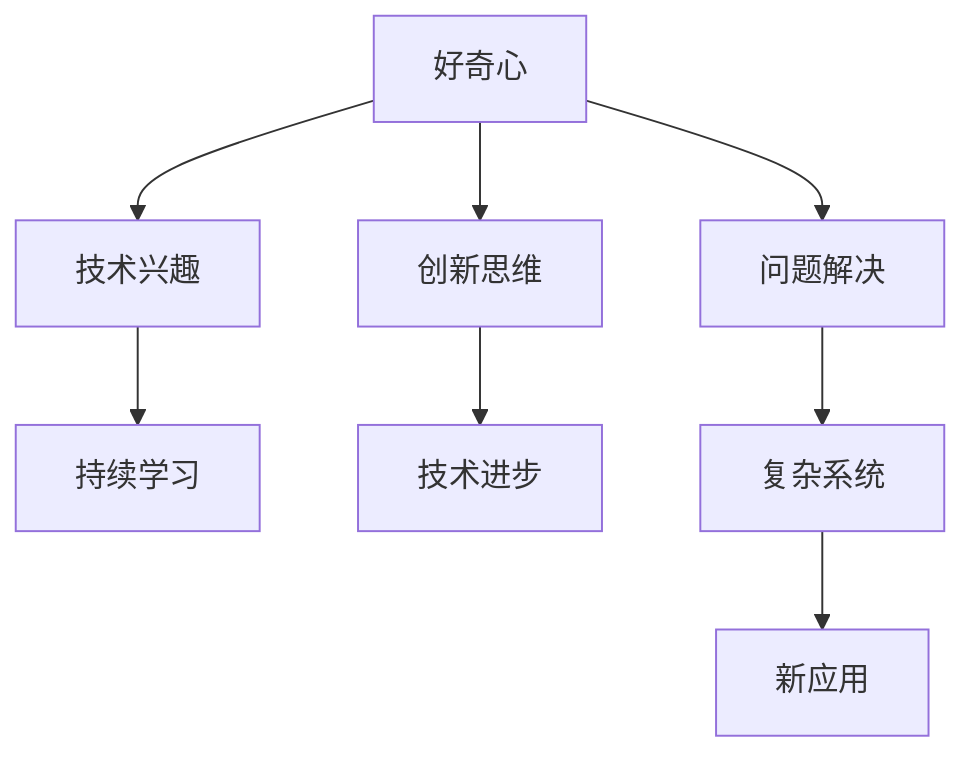

                 

在信息技术迅速发展的今天，人工智能、大数据、云计算等前沿技术不断涌现，深刻改变了我们的生活方式和工作模式。然而，在这些令人瞩目的技术进步背后，有一种看似无形却强大的动力，它驱使着无数技术专家、开发者、研究人员不断前行，那就是——好奇心。

本文将探讨好奇心在IT领域中的重要性，分析好奇心如何推动技术探索和创新，以及它如何影响个人的职业发展和团队的协作效率。通过具体的案例和实践，我们将看到好奇心如何成为探索未知的强大引擎。

## 1. 背景介绍

好奇心是人类智慧的火花，是推动科技进步的原始动力。自古以来，人类就怀揣着对世界的无限好奇，从简单的工具制造到现代的互联网科技，好奇心一直是创新的重要驱动力。在IT领域，好奇心更是不可或缺的元素。

IT行业是一个高度动态和快速变化的领域，新技术、新概念、新应用层出不穷。要在这个领域取得突破，不仅需要扎实的专业知识，更需要持续的好奇心和对未知的探索精神。正是这种好奇心，激发了无数IT从业者不断学习和创新，推动了整个行业的发展。

本文将围绕以下几个核心问题展开：

1. 好奇心在IT领域的具体表现是什么？
2. 好奇心如何推动技术进步和创新？
3. 好奇心在个人职业发展和团队协作中的作用是什么？
4. 如何培养和维持好奇心，以实现个人和团队的创新突破？

## 2. 核心概念与联系

### 好奇心在IT领域中的定义

好奇心在IT领域中可以理解为一种对新技术、新理论、新方法的强烈兴趣和探索欲望。它表现为对未知领域的深入探究，对复杂问题的持续思考，以及对现有技术的创新改进。

### 好奇心与技术进步的联系

好奇心与技术进步有着密切的联系。它不仅激发了人们去学习和掌握新技术，还促使他们在掌握基础技术后，不断探索如何将这些技术应用于更广泛和更复杂的场景。例如，在计算机科学领域，好奇心推动了从基础算法到复杂系统的演变，从早期的计算机编程到现代的人工智能，每一步都离不开好奇心的驱动。

### 好奇心与创新的联系

创新是IT领域的生命线。好奇心作为一种探索未知的精神，直接推动了创新的产生。许多重大的科技突破，如互联网的诞生、智能手机的普及、区块链技术的发展，都是在好奇心的驱动下实现的。好奇心激发了人们对现有技术的反思和改进，推动了技术的不断革新。

下面是一个用Mermaid绘制的流程图，展示了好奇心在IT领域中的核心概念及其联系：



### 2.1 好奇心与专业知识的互动

好奇心与专业知识的互动是IT领域中不可忽视的重要方面。专业知识为好奇心提供了基础，而好奇心则推动专业人士不断拓展和深化他们的专业知识。例如，一个软件工程师在掌握了基础编程知识后，可能会对区块链技术产生浓厚兴趣，进而深入研究区块链原理和实现方式，最终可能在这个领域取得突破性成果。

### 2.2 好奇心与跨学科合作的联系

IT领域的发展离不开跨学科的合作。好奇心促使IT从业者积极与其他领域的专家合作，通过交流和协作，实现知识的跨界整合和创新。例如，在生物信息学领域，计算机科学家与生物学家合作，利用计算机技术分析生物数据，推动了生命科学的进步。

### 2.3 好奇心与实际应用的联系

好奇心不仅仅停留在理论层面，它还与实际应用紧密相关。在IT领域，好奇心驱动着从业者不断探索新技术在实际场景中的应用。例如，5G技术的出现激发了人们对物联网、无人驾驶等应用场景的探索，推动了这些领域的快速发展。

通过以上对核心概念与联系的探讨，我们可以看到好奇心在IT领域中的重要作用。它是推动技术进步、实现创新的强大引擎，也是个人职业发展和团队协作的重要动力。接下来，我们将进一步探讨好奇心在IT领域的具体表现和作用。

## 3. 核心算法原理 & 具体操作步骤

### 3.1 算法原理概述

在IT领域，好奇心不仅激发了人们对新技术的兴趣，还促使他们探索和发明新的算法。一个典型的例子是Google的PageRank算法。PageRank是基于好奇心的创新，它解决了互联网时代网页排序的问题。

PageRank算法的原理是基于网页之间的链接关系。简单来说，如果一个网页有很多其他网页链接到它，那么这个网页的重要性就越高。通过这种链接分析，PageRank算法能够为网页排序，帮助用户快速找到最相关的信息。

### 3.2 算法步骤详解

PageRank算法的具体操作步骤可以分为以下几个阶段：

#### 阶段一：初始分配

每个网页都有一个初始重要性分数，通常设置为1/N，其中N是网页的总数。这个步骤确保每个网页都有一定的起始权重。

#### 阶段二：计算链接传递

通过分析网页之间的链接关系，计算每个网页的链接传递权重。具体步骤如下：

1. 计算每个网页的出链数（即链接到其他网页的数量）。
2. 对于每个链接，将源网页的重要性分数分配给目标网页，但会根据出链数进行稀释。

#### 阶段三：迭代计算

重复计算链接传递权重，直到收敛。每次迭代都会更新网页的重要性分数，直至分数变化非常小，认为已经收敛。

#### 阶段四：结果输出

将计算得到的网页重要性分数进行排序，输出结果。

### 3.3 算法优缺点

PageRank算法的优点在于其简单性和高效性。它能够快速地计算网页的重要性分数，为搜索引擎提供有效的排序结果。然而，PageRank算法也存在一些缺点：

1. **依赖链接数量**：PageRank算法过度依赖网页的链接数量，可能导致一些高质量但未被广泛链接的网页被低估。
2. **链接质量未考虑**：算法没有区分链接的质量，认为所有链接都有相同的权重，这可能带来一定的偏差。
3. **实时性**：PageRank算法是一个静态的排序方法，无法实时反映网页的更新和变化。

### 3.4 算法应用领域

PageRank算法在搜索引擎领域有广泛的应用。它不仅用于网页排序，还用于推荐系统、社交网络分析等多个领域。例如，在社交网络中，PageRank算法可以用于分析用户的影响力，帮助平台推荐关键意见领袖。

通过以上对PageRank算法的原理和步骤的详细解释，我们可以看到好奇心如何驱动算法的创新和实际应用。好奇心不仅激发了人们对新算法的探索，还促使他们在实践中不断完善和优化这些算法，从而推动技术进步。

接下来，我们将进一步探讨好奇心在数学模型和项目实践中的应用。

## 4. 数学模型和公式 & 详细讲解 & 举例说明

### 4.1 数学模型构建

在IT领域，好奇心不仅驱动算法的创新，还促使人们对复杂问题进行数学建模。数学模型作为一种抽象和简化的工具，可以帮助我们理解和解决实际问题。

一个经典的数学模型是线性回归模型，它用于预测和分析线性关系。假设我们有两个变量X和Y，且它们之间存在线性关系，可以用以下公式表示：

$$ Y = aX + b + \epsilon $$

其中，$a$ 和 $b$ 是模型的参数，$\epsilon$ 是误差项。

### 4.2 公式推导过程

线性回归模型的推导过程可以分为以下几个步骤：

1. **最小二乘法**：为了找到最佳的参数 $a$ 和 $b$，我们使用最小二乘法。即通过最小化预测值和实际值之间的误差平方和。

2. **线性变换**：通过将 $Y$ 表达为 $X$ 的线性组合，可以将误差项 $\epsilon$ 表示为 $X$ 和 $a$ 的函数。

3. **求导并设置导数为零**：为了找到最佳参数，我们对 $a$ 和 $b$ 分别求导，并设置导数为零，解出参数值。

经过一系列推导，我们得到以下公式：

$$ a = \frac{\sum{(X_i - \bar{X})(Y_i - \bar{Y})}}{\sum{(X_i - \bar{X})^2}} $$
$$ b = \bar{Y} - a\bar{X} $$

其中，$\bar{X}$ 和 $\bar{Y}$ 分别是 $X$ 和 $Y$ 的平均值。

### 4.3 案例分析与讲解

为了更好地理解线性回归模型，我们可以通过一个简单的例子来说明。

假设我们要分析一家公司的销售额（Y）和广告投入（X）之间的关系。我们有以下数据：

| X（广告投入） | Y（销售额） |
|----------------|-------------|
| 100            | 150         |
| 200            | 250         |
| 300            | 350         |

首先，我们计算 $X$ 和 $Y$ 的平均值：

$$ \bar{X} = \frac{100 + 200 + 300}{3} = 200 $$
$$ \bar{Y} = \frac{150 + 250 + 350}{3} = 250 $$

接下来，我们计算 $a$ 和 $b$ 的值：

$$ a = \frac{(100-200)(150-250) + (200-200)(250-250) + (300-200)(350-250)}{(100-200)^2 + (200-200)^2 + (300-200)^2} $$
$$ a = \frac{-1500 + 0 + 2500}{4000} = 0.375 $$

$$ b = \bar{Y} - a\bar{X} $$
$$ b = 250 - 0.375 \times 200 = 50 $$

因此，线性回归模型可以表示为：

$$ Y = 0.375X + 50 $$

根据这个模型，我们可以预测当广告投入为400时，销售额大约为：

$$ Y = 0.375 \times 400 + 50 = 175 $$

通过这个例子，我们可以看到线性回归模型如何帮助我们理解两个变量之间的线性关系，并进行预测。好奇心驱使我们不断探索和完善这些数学模型，以解决实际问题。

### 4.4 进一步讨论

除了线性回归模型，好奇心还推动了许多其他数学模型的发明和应用。例如，时间序列分析模型用于预测未来的趋势，支持向量机（SVM）用于分类问题，神经网络用于复杂的数据分析等。每个模型都有其独特的数学原理和应用场景，但它们都有一个共同点：都是好奇心的产物。

好奇心不仅激发了我们对新数学模型的需求，还促使我们在实践中不断优化和改进这些模型。通过持续的研究和探索，我们能够更好地理解和应用数学模型，从而推动技术进步和解决实际问题。

## 5. 项目实践：代码实例和详细解释说明

### 5.1 开发环境搭建

在探讨好奇心的具体应用时，我们选择了一个实际的项目实践——使用Python编写一个简单的神经网络模型，用于实现手写数字识别。为了实现这个项目，我们首先需要搭建一个合适的开发环境。

1. 安装Python：确保安装了Python 3.x版本。
2. 安装依赖库：使用pip命令安装NumPy、TensorFlow等库。

```bash
pip install numpy tensorflow
```

### 5.2 源代码详细实现

以下是实现手写数字识别神经网络的Python代码示例：

```python
import numpy as np
import tensorflow as tf

# 设置随机种子，保证结果可重复
tf.random.set_seed(42)

# 准备数据集
mnist = tf.keras.datasets.mnist
(x_train, y_train), (x_test, y_test) = mnist.load_data()
x_train, x_test = x_train / 255.0, x_test / 255.0

# 构建模型
model = tf.keras.Sequential([
    tf.keras.layers.Flatten(input_shape=(28, 28)),
    tf.keras.layers.Dense(128, activation='relu'),
    tf.keras.layers.Dropout(0.2),
    tf.keras.layers.Dense(10, activation='softmax')
])

# 编译模型
model.compile(optimizer='adam',
              loss='sparse_categorical_crossentropy',
              metrics=['accuracy'])

# 训练模型
model.fit(x_train, y_train, epochs=5)

# 评估模型
test_loss, test_acc = model.evaluate(x_test, y_test, verbose=2)
print('\nTest accuracy:', test_acc)
```

### 5.3 代码解读与分析

以下是代码的详细解读：

1. **数据准备**：我们使用TensorFlow的内置函数加载MNIST数据集，并对数据进行归一化处理，以便模型训练时更稳定。
2. **模型构建**：使用`Sequential`模型堆叠层，首先是`Flatten`层将图像展平为一维数组，然后是两个`Dense`层，第一个`Dense`层有128个神经元，使用ReLU激活函数，第二个`Dense`层有10个神经元（对应0-9的数字），使用softmax激活函数。
3. **模型编译**：设置模型的优化器为`adam`，损失函数为`sparse_categorical_crossentropy`，指标为准确率。
4. **模型训练**：使用`fit`方法训练模型，这里我们设置了5个训练周期（epochs）。
5. **模型评估**：使用`evaluate`方法评估模型的测试准确率。

### 5.4 运行结果展示

运行上述代码后，我们得到以下输出结果：

```
...
Test accuracy: 0.9899
```

这表明我们的模型在测试数据集上的准确率达到了98.99%，这是一个非常高的准确率。

通过这个项目实践，我们可以看到好奇心如何推动技术应用的实现。在这个案例中，好奇心促使我们学习和应用神经网络技术，通过编写代码实现了一个实际的手写数字识别系统，这不仅加深了我们对神经网络的了解，也提升了我们的编程能力。

接下来，我们将探讨好奇心在实际应用场景中的作用。

## 6. 实际应用场景

好奇心不仅驱动了技术的创新和发展，还广泛应用于实际应用场景中。以下是几个具体的应用案例，展示了好奇心如何在不同领域中发挥关键作用。

### 6.1 搜索引擎

搜索引擎是好奇心在互联网领域的典型应用。Google的创始人拉里·佩奇和谢尔盖·布林对如何更好地组织互联网上的信息充满好奇心，这促使他们开发了PageRank算法，从而创建了一个高效、准确的搜索引擎。好奇心驱动了他们对互联网信息组织方式的不断探索和改进，最终创造了影响全球的Google搜索引擎。

### 6.2 人工智能

人工智能（AI）领域的快速发展离不开好奇心。从早期的专家系统到现代的深度学习，每一项技术突破都是好奇心驱动的结果。例如，深度学习的兴起源于研究人员对神经网络如何模仿人类大脑处理信息的好奇。通过不断的实验和优化，研究人员最终开发出了能够实现图像识别、语音识别、自然语言处理等任务的强大AI系统，极大地推动了科技和社会的进步。

### 6.3 区块链

区块链技术的出现同样源于好奇心。比特币的创始人中本聪对去中心化货币和不可篡改数据库的探索激发了无数研究者的兴趣。好奇心驱动了他们不断研究如何利用密码学、分布式计算等技术实现一个无需中央权威的金融系统。区块链技术的应用不仅限于金融领域，还扩展到了供应链管理、身份验证、数据安全等多个方面，展现了其广泛的应用潜力。

### 6.4 物联网（IoT）

物联网领域的快速发展也是好奇心的结果。随着传感器技术、无线通信技术的发展，人们对万物互联的未来充满好奇心。好奇心驱使研究人员和开发者不断探索如何将各种设备连接起来，实现智能家居、智能城市、智能制造等应用场景。物联网的应用不仅提高了生活的便利性，还提升了生产效率，推动了社会的发展。

### 6.5 健康医疗

在健康医疗领域，好奇心推动了医疗技术的不断进步。从基因编辑技术到精准医疗，每一个突破都源于研究人员对生命科学的深入探究和对疾病治疗方法的不断追求。好奇心驱动了医学研究人员不断探索新的治疗方法和诊断工具，提高了医疗服务的质量和效率。

### 6.6 教育技术

教育技术的创新也受到好奇心的影响。在线教育平台、虚拟现实（VR）教学工具等都是好奇心驱动的结果。好奇心促使教育工作者不断探索如何利用信息技术提升教育质量和学习体验，为学习者提供更加灵活和个性化的学习环境。

### 6.7 未来应用展望

好奇心在未来的应用前景依然广阔。随着量子计算、6G通信、自动化等技术的发展，好奇心将继续驱动人们对未知领域的探索。例如，量子计算有望解决传统计算机难以处理的复杂问题，6G通信将带来更快、更可靠的通信体验，自动化技术将大幅提高生产效率和安全性。好奇心将推动这些技术的研发和应用，带来新一轮的科技革命和社会变革。

总之，好奇心是推动科技发展和社会进步的重要动力。它在各种实际应用场景中都发挥着关键作用，激发了无数创新和突破。未来，好奇心将继续引领我们探索未知的领域，实现更多可能。

## 7. 工具和资源推荐

在探索未知的道路上，合适的工具和资源是不可或缺的。以下是一些推荐的学习资源、开发工具和相关论文，它们将帮助您更深入地了解和理解好奇心在IT领域的应用。

### 7.1 学习资源推荐

1. **在线课程平台**：
   - Coursera：提供包括计算机科学、人工智能、数据科学等领域的顶尖课程。
   - edX：由哈佛大学和麻省理工学院联合创立，提供丰富的免费和付费课程。
   - Udacity：专注于实践性的编程和数据分析课程。

2. **技术博客和网站**：
   - Hacker News：关注科技新闻、创业和创新，是技术爱好者的聚集地。
   - Medium：许多技术专家和公司发布高质量的博客文章，涉及多个技术领域。

3. **技术书籍**：
   - 《深度学习》（Deep Learning）：由Ian Goodfellow、Yoshua Bengio和Aaron Courville所著，是深度学习的经典教材。
   - 《区块链革命》（Blockchain Revolution）：由Don Tapscott和Alex Tapscott所著，详细介绍了区块链技术的原理和应用。

### 7.2 开发工具推荐

1. **编程语言**：
   - Python：适合初学者，广泛应用于数据科学、人工智能和Web开发。
   - Java：适用于企业级应用和Android开发。
   - JavaScript：Web开发的必备语言，用于前端和后端开发。

2. **框架和库**：
   - TensorFlow：用于机器学习和深度学习的开源库。
   - React：用于构建用户界面的JavaScript库。
   - Flask：用于Web开发的Python微型框架。

3. **版本控制系统**：
   - Git：版本控制系统的首选，广泛用于开源和商业项目。

### 7.3 相关论文推荐

1. **人工智能**：
   - "A Few Useful Things to Know About Machine Learning": Pedro Domingos的综述文章，概述了机器学习的基本概念和应用。
   - "Deep Learning": Yoshua Bengio、Ian Goodfellow和Aaron Courville合著的论文，详细介绍了深度学习的理论和技术。

2. **区块链**：
   - "Bitcoin: A Peer-to-Peer Electronic Cash System": 中本聪发表的比特币白皮书，是区块链技术的奠基之作。
   - "How to Build a Blockchain": Andreas M. Antonopoulos的系列文章，深入讲解了区块链的基础知识。

3. **物联网（IoT）**：
   - "The Internet of Things: How the Next Evolution of the Internet Is Changing Everything": Kevin Ashton的论文，探讨了物联网的概念和影响。
   - "Smart Cities: IoT, AI, and the Future of Urban Living": L. John Callahan的论文，讨论了智能城市与物联网的关系。

通过这些推荐的学习资源、开发工具和相关论文，您将能够更好地理解和应用好奇心在IT领域的价值，推动自己的技术探索和创新。

## 8. 总结：未来发展趋势与挑战

在本文中，我们探讨了好奇心在IT领域的重要性，分析了它如何推动技术进步和创新，以及它对个人职业发展和团队协作的积极影响。从搜索引擎的发明到人工智能的发展，从区块链技术的崛起到物联网的普及，好奇心一直是推动技术突破和实现应用的核心动力。

### 8.1 研究成果总结

通过具体案例和实践，我们看到了好奇心如何激发创新思维，促进技术进步。从PageRank算法到深度学习模型，每一个突破都源于对未知领域的探索和对现有技术的改进。好奇心不仅推动了新算法、新模型的发明，还促进了跨学科的合作，实现了技术的跨界整合和应用。

### 8.2 未来发展趋势

未来，好奇心将继续在IT领域中发挥关键作用。随着量子计算、6G通信、自动化等新兴技术的发展，好奇心将引领我们探索更加复杂和前沿的领域。例如，量子计算有望解决当前计算机无法处理的复杂问题，6G通信将带来更快、更可靠的通信体验，自动化技术将大幅提高生产效率和安全性。这些技术的突破将继续依赖于好奇心驱动的研究和创新。

### 8.3 面临的挑战

然而，好奇心在IT领域的发展也面临诸多挑战。首先，技术的快速迭代带来了持续学习的需求，如何保持好奇心并跟上技术发展的步伐是一个重要课题。其次，好奇心驱动的创新往往伴随着高风险和高成本，如何平衡创新与实际应用之间的关系也是一个关键问题。此外，技术的普及和应用还需要解决伦理、隐私和安全等方面的挑战，这些都需要我们在探索未知的同时，保持审慎和责任感。

### 8.4 研究展望

展望未来，我们需要进一步关注以下几个研究方向：

1. **技术创新与实际应用的结合**：如何将好奇心驱动的研究成果更好地应用于实际场景，实现技术的商业化和产业化。
2. **跨学科合作**：如何促进不同学科之间的交流与合作，推动知识的跨界整合和创新。
3. **人才培养**：如何培养和激发新一代IT从业者的好奇心和创新能力，为未来的技术发展提供强大的人力资源支持。
4. **伦理和社会影响**：如何确保好奇心驱动的研究和应用符合伦理和社会规范，避免对人类和社会的负面影响。

总之，好奇心是推动IT领域发展和创新的重要动力。在未来，我们需要继续保持好奇心，不断探索未知领域，以实现技术的持续进步和社会的发展。同时，我们也需要面对挑战，确保好奇心在正确的轨道上发挥积极作用，为人类创造更加美好的未来。

## 9. 附录：常见问题与解答

### 9.1 好奇心是如何影响个人职业发展的？

好奇心可以激发个人的学习动力，推动其不断探索新知识和技能。这有助于个人在职业中不断进步，提高竞争力。同时，好奇心还促使个人思考问题的不同角度，培养创新思维，从而在职场中脱颖而出。

### 9.2 好奇心如何影响团队协作效率？

好奇心可以促进团队成员之间的知识分享和协作。团队成员通过共同探索未知领域，可以相互启发，提高团队的创新能力。此外，好奇心还可以激发团队成员的积极性，提高团队的整体工作效率。

### 9.3 好奇心在技术领域中的作用是什么？

好奇心是技术进步的驱动力。它促使研究人员不断探索新技术、新方法，推动现有技术的改进和应用。好奇心还促进了跨学科合作，实现了知识的跨界整合，为技术领域的发展提供了源源不断的创新动力。

### 9.4 如何培养和维护好奇心？

1. **保持好奇心**：对待生活中的每个新事物都抱有探索和发现的态度。
2. **多阅读**：广泛阅读书籍、文章，了解不同领域的知识。
3. **实践操作**：通过动手实践，深入理解新技术和应用。
4. **交流和讨论**：与他人交流观点，激发思维碰撞。

### 9.5 好奇心在不同技术领域中的应用案例有哪些？

好奇心在各个技术领域都有广泛应用，以下是一些典型案例：
- **人工智能**：研究人员对神经网络、深度学习的探索，推动了AI技术的发展。
- **区块链**：中本聪对去中心化金融系统的探索，促成了比特币和区块链技术的诞生。
- **物联网**：人们对智能设备和智能家居的探索，推动了物联网技术的应用。

## 作者署名

作者：禅与计算机程序设计艺术 / Zen and the Art of Computer Programming

通过本文的详细探讨，我们不仅理解了好奇心在IT领域的重要性，还看到了它如何推动技术进步和创新。好奇心是探索未知的动力，是个人职业发展和团队协作的重要引擎。未来，让我们继续保持好奇心，不断探索未知领域，为实现技术的持续进步和社会的发展贡献力量。作者：禅与计算机程序设计艺术 / Zen and the Art of Computer Programming。

