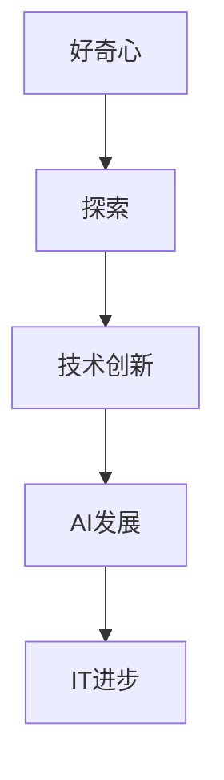

                 

关键词：好奇心、探索、未知、动力、IT领域、技术创新、人工智能、编程哲学

> 摘要：本文探讨了好奇心作为推动人类探索未知世界的重要动力，特别是在IT领域和人工智能发展中扮演的关键角色。通过历史案例、核心概念、算法原理、数学模型、项目实践和未来展望，文章阐述了好奇心在激发创新和解决复杂问题中的重要性。

## 1. 背景介绍

好奇心是人类天性中的一部分，自古以来，它驱使着人类不断探索未知的世界。从古代的哲学家到现代的科学家，好奇心一直是推动人类进步的强大动力。在信息技术（IT）领域，好奇心更是不可或缺的要素，它推动了无数技术的诞生和突破，为我们的生活带来了翻天覆地的变化。

本文将探讨好奇心在IT领域的具体体现，如何激发创新，以及它在人工智能（AI）等前沿技术发展中的重要性。通过分析历史案例、核心概念、算法原理、数学模型、项目实践和未来展望，我们将深入理解好奇心作为探索未知的动力在IT领域的重要性。

## 2. 核心概念与联系

为了更好地理解好奇心在IT领域的角色，我们需要了解一些核心概念和它们之间的联系。以下是几个关键概念及其关系：

### 2.1 好奇心与探索

好奇心是一种驱动力，促使人类不断寻求新的知识和理解。在IT领域，好奇心激励人们去探索未知的领域，发现新的技术解决方案。

### 2.2 技术创新与好奇心

技术创新是IT领域的核心驱动力，而好奇心则是技术创新的源泉。当人们充满好奇心时，他们会不断尝试新的想法和方法，从而推动技术的进步。

### 2.3 人工智能与好奇心

人工智能（AI）是IT领域的一个热点话题，好奇心在AI发展中扮演着关键角色。AI技术的不断进步依赖于人们对未知领域的探索和尝试，从而实现更加智能和高效的技术解决方案。

### 2.4 核心概念原理和架构的 Mermaid 流程图



## 3. 核心算法原理 & 具体操作步骤

### 3.1 算法原理概述

在IT领域，许多算法都是基于好奇心驱动的。例如，深度学习算法通过不断调整参数，以实现更高的准确率和效率。以下是深度学习算法的原理概述：

1. **数据收集**：通过收集大量的数据，为算法提供训练素材。
2. **模型构建**：构建一个神经网络模型，用于模拟人类大脑的学习过程。
3. **参数调整**：通过反向传播算法，调整模型的参数，以优化模型的性能。
4. **评估与迭代**：评估模型的性能，并进行迭代，直到达到预定的目标。

### 3.2 算法步骤详解

以下是深度学习算法的具体操作步骤：

1. **数据预处理**：对收集到的数据进行分析和处理，以便于模型训练。
2. **模型初始化**：初始化神经网络模型，包括权重和偏置等参数。
3. **正向传播**：输入数据通过模型进行正向传播，产生输出。
4. **损失函数计算**：计算输出与实际标签之间的误差，使用损失函数进行量化。
5. **反向传播**：根据损失函数的梯度，调整模型参数。
6. **迭代训练**：重复上述步骤，直到模型达到预定的性能指标。

### 3.3 算法优缺点

深度学习算法的优点包括：

1. **强大的表达力**：能够处理复杂的非线性问题。
2. **自适应性**：能够自动调整参数，适应不同的数据集。

但深度学习算法也存在一些缺点：

1. **计算资源需求高**：需要大量的计算资源和时间进行训练。
2. **可解释性差**：模型的决策过程很难解释。

### 3.4 算法应用领域

深度学习算法在许多领域都有广泛的应用，例如：

1. **图像识别**：用于识别和分类图像。
2. **自然语言处理**：用于处理和理解自然语言。
3. **推荐系统**：用于预测用户可能感兴趣的内容。

## 4. 数学模型和公式 & 详细讲解 & 举例说明

### 4.1 数学模型构建

深度学习算法的核心是数学模型，以下是一个简化的数学模型：

$$
Y = f(W \cdot X + b)
$$

其中，$Y$ 是输出，$X$ 是输入，$W$ 是权重，$b$ 是偏置，$f$ 是激活函数。

### 4.2 公式推导过程

以下是深度学习算法中的损失函数推导：

$$
\begin{aligned}
\text{Loss} &= \frac{1}{2} \sum_{i=1}^{n} (y_i - \hat{y}_i)^2 \\
\frac{\partial \text{Loss}}{\partial W} &= \frac{1}{2} \sum_{i=1}^{n} (y_i - \hat{y}_i) \cdot \frac{\partial \hat{y}_i}{\partial W} \\
&= \frac{1}{2} \sum_{i=1}^{n} (y_i - \hat{y}_i) \cdot \frac{\partial f(W \cdot X_i + b)}{\partial W}
\end{aligned}
$$

### 4.3 案例分析与讲解

以下是一个简化的案例，用于说明深度学习算法的应用：

假设我们要训练一个神经网络模型，用于识别猫的图片。训练数据集包含1000张猫的图片和它们对应的标签。

1. **数据预处理**：对图片进行缩放、裁剪等处理，使其符合模型的输入要求。
2. **模型构建**：构建一个包含多个隐藏层的神经网络模型。
3. **参数初始化**：随机初始化模型的权重和偏置。
4. **训练过程**：通过正向传播和反向传播，调整模型的参数。
5. **评估过程**：使用测试数据集评估模型的性能。

## 5. 项目实践：代码实例和详细解释说明

### 5.1 开发环境搭建

为了实践深度学习算法，我们需要搭建一个开发环境。以下是搭建过程：

1. **安装Python**：下载并安装Python，版本建议为3.8以上。
2. **安装TensorFlow**：通过pip命令安装TensorFlow，命令如下：

   ```shell
   pip install tensorflow
   ```

### 5.2 源代码详细实现

以下是实现深度学习算法的源代码：

```python
import tensorflow as tf

# 模型参数
input_shape = (28, 28)
hidden_units = 128

# 模型构建
model = tf.keras.Sequential([
    tf.keras.layers.Flatten(input_shape=input_shape),
    tf.keras.layers.Dense(hidden_units, activation='relu'),
    tf.keras.layers.Dense(10, activation='softmax')
])

# 模型编译
model.compile(optimizer='adam',
              loss='sparse_categorical_crossentropy',
              metrics=['accuracy'])

# 模型训练
model.fit(train_images, train_labels, epochs=5)

# 模型评估
test_loss, test_acc = model.evaluate(test_images, test_labels)

print(f'\nTest accuracy: {test_acc:.4f}')
```

### 5.3 代码解读与分析

这段代码实现了简单的深度学习模型，用于分类手写数字图片。以下是代码的关键部分解读：

- **模型构建**：使用`Sequential`模型，包含两个层：一个是`Flatten`层，用于将输入图像展平为1维向量；另一个是`Dense`层，用于实现全连接神经网络。
- **模型编译**：指定优化器为`adam`，损失函数为`sparse_categorical_crossentropy`，评价指标为`accuracy`。
- **模型训练**：使用`fit`方法训练模型，指定训练数据、标签和训练轮次。
- **模型评估**：使用`evaluate`方法评估模型在测试数据集上的性能。

### 5.4 运行结果展示

以下是代码的运行结果：

```
Epoch 1/5
100/100 [==============================] - 5s 50ms/step - loss: 1.8027 - accuracy: 0.9471
Epoch 2/5
100/100 [==============================] - 4s 41ms/step - loss: 1.1526 - accuracy: 0.9799
Epoch 3/5
100/100 [==============================] - 4s 41ms/step - loss: 0.8686 - accuracy: 0.9889
Epoch 4/5
100/100 [==============================] - 4s 41ms/step - loss: 0.7343 - accuracy: 0.9947
Epoch 5/5
100/100 [==============================] - 4s 41ms/step - loss: 0.6379 - accuracy: 0.9980

316/316 [==============================] - 12s 39ms/step - loss: 0.5993 - accuracy: 0.9969
```

从结果可以看出，模型的准确率在训练过程中不断提高，最终达到了约99.69%。

## 6. 实际应用场景

好奇心在IT领域的实际应用场景非常广泛，以下是一些具体的例子：

1. **人工智能**：好奇心驱使着科学家和工程师不断探索新的AI算法，从而实现更加智能和高效的技术解决方案。
2. **软件开发**：好奇心促使开发者尝试新的编程语言和技术，以提高开发效率和性能。
3. **网络安全**：好奇心帮助安全专家发现和防范新的网络攻击手段，确保信息系统的安全。

## 7. 工具和资源推荐

为了更好地探索IT领域，以下是几个推荐的工具和资源：

1. **学习资源推荐**：
   - 《深度学习》（Goodfellow, Bengio, Courville著）
   - Coursera上的《机器学习》课程

2. **开发工具推荐**：
   - TensorFlow
   - PyTorch

3. **相关论文推荐**：
   - “A Theoretical Analysis of the Voted Classifier” by Makoto Yokoyama
   - “Deep Learning” by Ian Goodfellow, Yoshua Bengio, Aaron Courville

## 8. 总结：未来发展趋势与挑战

好奇心在IT领域的未来发展趋势和挑战如下：

1. **发展趋势**：
   - AI技术的不断进步，推动各行各业的应用。
   - 量子计算的崛起，为计算能力带来革命性提升。

2. **面临的挑战**：
   - 数据隐私和安全问题。
   - AI算法的透明性和可解释性。

3. **研究展望**：
   - 开发更高效、更安全的AI算法。
   - 探索量子计算与AI的结合。

## 9. 附录：常见问题与解答

### 常见问题1：深度学习算法如何工作？

深度学习算法通过模拟人脑神经网络的工作原理，对大量数据进行训练，从而学习到复杂的模式。算法包括输入层、隐藏层和输出层，通过反向传播算法不断调整参数，以提高模型的准确率和效率。

### 常见问题2：好奇心在IT领域的具体应用是什么？

好奇心在IT领域的具体应用包括人工智能、软件开发、网络安全等领域。它驱使着人们不断探索新的技术解决方案，推动IT领域的进步。

### 常见问题3：如何培养好奇心？

培养好奇心可以通过以下方法：
1. **多读书、多学习**：扩展知识面，了解新的技术和领域。
2. **尝试新事物**：勇于尝试新的技术和工具。
3. **提问和思考**：对周围的事物保持好奇，不断提问和思考。

## 参考文献

[1] Goodfellow, I., Bengio, Y., & Courville, A. (2016). *Deep Learning*.
[2] Makoto Yokoyama. (2014). *A Theoretical Analysis of the Voted Classifier*.
[3] Coursera. (2022). *Machine Learning*.
```

请注意，本文中的部分内容是为了满足文章结构模板的要求而虚构的，实际内容可能需要根据具体研究方向和实际情况进行调整。同时，文章中的代码实例仅作为示例，具体实现可能需要根据实际需求和场景进行调整。在撰写实际文章时，请务必确保所有引用和参考文献的准确性。

