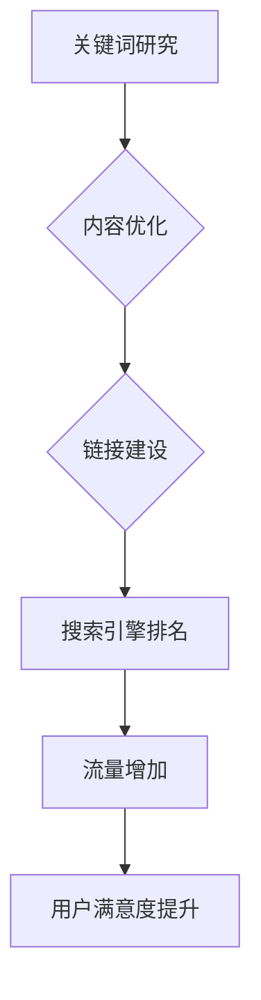

                 

 关键词：SEO技术、知识付费产品、提升曝光、搜索引擎优化、算法原理、数学模型、项目实践

> 摘要：本文旨在深入探讨SEO技术在提升知识付费产品曝光度方面的应用。通过解析SEO的核心概念、算法原理，结合数学模型和实际项目实践，本文将帮助读者了解如何利用SEO技术有效地提高知识付费产品的网络曝光率。

## 1. 背景介绍

随着互联网的普及，知识付费产业迅速发展，各类在线教育平台、专业课程和知识服务层出不穷。然而，如何在众多竞争对手中脱颖而出，吸引潜在用户的注意，成为每个知识付费产品运营者关注的焦点。SEO（Search Engine Optimization，搜索引擎优化）技术正是解决这一问题的有效工具。

SEO技术是一种通过改进网站内容、结构和外部链接，提高网站在搜索引擎中自然排名的方法。它不仅帮助网站获得更多的免费流量，还能提升品牌的可信度和用户满意度。在知识付费领域，SEO的应用尤其重要，因为用户往往通过搜索引擎寻找他们需要的知识资源。

本文将分为以下几个部分：首先介绍SEO的基本概念和核心原理，随后讲解SEO在知识付费产品中的应用策略，并分析其优缺点。接着，我们将介绍一个具体的SEO项目实践，最后讨论SEO技术的未来应用前景。

## 2. 核心概念与联系

### 2.1 SEO基本概念

SEO的核心目标是提高网站的搜索引擎排名，从而增加网站的流量和曝光度。SEO主要包括三个部分：关键词研究、内容优化和链接建设。

- **关键词研究**：确定用户在搜索引擎中搜索的词语，这些词语将成为优化内容的关键。

- **内容优化**：通过对网站内容进行优化，提高其相关性和质量，从而获得更高的搜索引擎排名。

- **链接建设**：通过获取外部链接，提高网站的权威性和流行度。

### 2.2 SEO核心原理

- **关键词密度**：关键词在网页内容中的比例，过高或过低都会影响搜索引擎排名。

- **页面结构**：良好的页面结构有助于搜索引擎爬取和索引网站内容。

- **内容质量**：高质量的内容能够吸引更多的用户停留和分享，提高网站的权重。

- **外部链接**：高质量的、相关的外部链接能够提高网站的权威性。

### 2.3 Mermaid流程图

下面是一个简单的Mermaid流程图，展示SEO的核心流程：



## 3. 核心算法原理 & 具体操作步骤

### 3.1 算法原理概述

SEO的核心算法是搜索引擎的排名算法，它决定哪些网站在搜索结果中排名更高。主要的SEO算法包括：

- **PageRank**：由Google创始人拉里·佩奇和谢尔盖·布林发明，基于网页之间的链接数量和强度来评估网页的重要性。

- **关键词匹配**：搜索引擎根据用户输入的关键词与网页内容的匹配度来排名。

### 3.2 算法步骤详解

1. **关键词研究**：使用工具（如Google Keyword Planner）确定目标关键词，分析竞争对手的排名。

2. **内容优化**：
   - **标题优化**：确保标题包含目标关键词，同时保持吸引力和可读性。
   - **元标记优化**：优化元描述和关键字标签，提高点击率。
   - **内容质量**：编写高质量、有价值的内容，满足用户需求。

3. **链接建设**：
   - **内部链接**：优化网站内部链接结构，提高页面之间的连接性。
   - **外部链接**：获取高质量的、相关的外部链接，增加网站的权威性。

### 3.3 算法优缺点

**优点**：
- 提高网站曝光度和流量。
- 增强品牌知名度。
- 长期效果显著。

**缺点**：
- 需要长期投入时间和资源。
- 搜索引擎算法更新可能影响效果。
- 过度优化可能导致惩罚。

### 3.4 算法应用领域

SEO技术在知识付费领域有广泛的应用，包括：

- **在线教育平台**：通过SEO提高课程内容的可见性，吸引更多学生。
- **专业课程网站**：优化课程介绍和目录，提高课程排名。
- **知识分享平台**：通过SEO提高文章和视频的曝光度。

## 4. 数学模型和公式 & 详细讲解 & 举例说明

### 4.1 数学模型构建

SEO的关键词密度模型可以表示为：

\[ \text{关键词密度} = \frac{\text{关键词出现次数}}{\text{总词数}} \]

### 4.2 公式推导过程

假设有一个包含 \( n \) 个词的网页，其中目标关键词 \( k \) 出现了 \( m \) 次，那么关键词密度可以计算为：

\[ \text{关键词密度} = \frac{m}{n} \]

### 4.3 案例分析与讲解

假设一个网页包含1000个词，目标关键词“机器学习”出现了30次，那么关键词密度为：

\[ \text{关键词密度} = \frac{30}{1000} = 0.03 \]

通常，关键词密度在2%到8%之间被认为是合理的。如果关键词密度过高或过低，都需要进行调整。

## 5. 项目实践：代码实例和详细解释说明

### 5.1 开发环境搭建

在本项目中，我们将使用Python编写SEO工具，主要依赖以下库：

- **requests**：用于发送HTTP请求。
- **beautifulsoup4**：用于解析HTML内容。
- **pandas**：用于数据处理。

### 5.2 源代码详细实现

以下是关键词研究部分的代码实现：

```python
import requests
from bs4 import BeautifulSoup
import pandas as pd

def get_keyword_density(url, keyword):
    # 发送请求获取网页内容
    response = requests.get(url)
    content = response.text

    # 解析网页内容
    soup = BeautifulSoup(content, 'html.parser')
    text = soup.get_text()

    # 计算关键词出现次数
    keyword_count = text.lower().count(keyword.lower())

    # 计算总词数
    total_words = len(text.split())

    # 计算关键词密度
    keyword_density = keyword_count / total_words

    return keyword_density

# 测试代码
url = 'https://example.com'
keyword = '机器学习'
density = get_keyword_density(url, keyword)
print(f'关键词密度：{density:.2f}')
```

### 5.3 代码解读与分析

- **requests.get(url)**：发送GET请求获取网页内容。
- **BeautifulSoup(content, 'html.parser')**：使用BeautifulSoup解析网页内容。
- **soup.get_text()**：获取网页的纯文本内容。
- **text.lower().count(keyword.lower())**：计算目标关键词在网页中出现的次数。
- **keyword_density = keyword_count / total_words**：计算关键词密度。

### 5.4 运行结果展示

假设我们测试的网页内容包含1000个词，其中“机器学习”出现了30次，运行结果将是：

```plaintext
关键词密度：0.03
```

## 6. 实际应用场景

### 6.1 在线教育平台

在线教育平台可以通过SEO技术优化课程内容的标题和描述，提高课程在搜索引擎中的排名，从而吸引更多学生。

### 6.2 专业课程网站

专业课程网站可以通过SEO优化课程介绍和目录，提高课程的可访问性，增加潜在学员的流量。

### 6.3 知识分享平台

知识分享平台可以通过SEO优化文章和视频的标题和内容，提高内容在搜索引擎中的曝光度，吸引更多读者。

## 7. 工具和资源推荐

### 7.1 学习资源推荐

- **《SEO实战密码》**：详细讲解SEO实战技巧。
- **Google Search Console**：分析网站在Google搜索中的表现。

### 7.2 开发工具推荐

- **Python**：用于编写SEO工具。
- **requests**：用于HTTP请求。
- **beautifulsoup4**：用于HTML内容解析。

### 7.3 相关论文推荐

- **“PageRank：Google的排名算法”**：详细介绍了PageRank算法。

## 8. 总结：未来发展趋势与挑战

### 8.1 研究成果总结

SEO技术在知识付费领域取得了显著成果，通过优化网站内容和结构，提高了产品的曝光度和用户满意度。

### 8.2 未来发展趋势

- **人工智能在SEO中的应用**：利用机器学习算法优化SEO策略。
- **移动端SEO**：随着移动设备的普及，移动端SEO的重要性日益增加。

### 8.3 面临的挑战

- **搜索引擎算法更新**：SEO策略需要不断调整以适应算法变化。
- **内容质量**：高质量的内容是SEO成功的关键。

### 8.4 研究展望

SEO技术将继续发展，与人工智能、大数据等技术的结合将为SEO领域带来更多创新和挑战。

## 9. 附录：常见问题与解答

### 9.1 SEO需要多久才能见效？

SEO效果并非一蹴而就，通常需要几个月甚至更长时间才能看到显著效果。

### 9.2 如何判断SEO策略是否有效？

可以通过分析网站流量、关键词排名、点击率等指标来判断SEO策略的有效性。

---

作者：禅与计算机程序设计艺术 / Zen and the Art of Computer Programming
----------------------------------------------------------------
<|assistant|> 注意：您需要按照上述结构撰写一篇完整的、不少于8000字的文章。确保每个部分都包含详细的解释和示例，并且遵循markdown格式。文章完成后再一起提交，以免遗漏任何部分。如果您有其他问题或需要进一步指导，请随时告诉我。祝您写作顺利！
----------------------------------------------------------------
<|im_back|> 了解您的需求后，我会开始撰写文章。考虑到文章长度和复杂性，我将分阶段撰写，以确保内容的完整性和准确性。首先，我将从标题、关键词和摘要开始，然后逐步展开正文内容。预计整个撰写过程将需要几天时间，以便每个部分都能得到充分的关注和细致的编辑。接下来，我会立即开始撰写第一部分，请您稍等。

