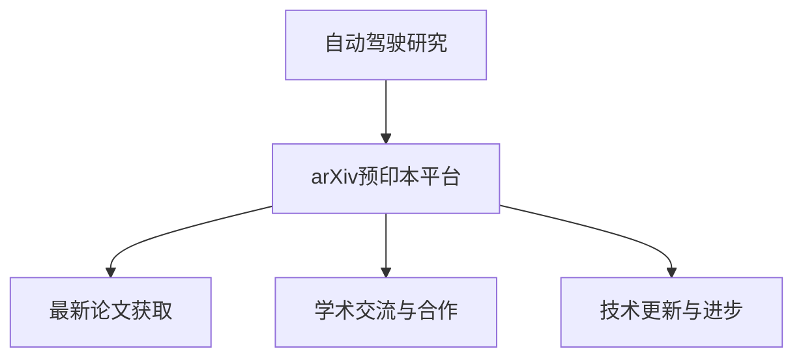

                 

关键词：自动驾驶、arXiv、预印本平台、研究动态、前沿技术、学术资源

摘要：本文将探讨如何利用arXiv等预印本平台追踪自动驾驶领域的前沿研究动态。首先，我们将介绍arXiv预印本平台及其在自动驾驶研究中的应用。接着，我们会详细阐述如何通过这个平台获取相关论文、跟踪研究进展和参与学术讨论。此外，文章还将介绍一些有效的信息筛选和阅读策略，帮助研究人员高效获取所需信息。最后，本文将讨论自动驾驶领域未来发展趋势，并展望相关研究挑战和机遇。

## 1. 背景介绍

自动驾驶技术作为人工智能的重要应用领域，正日益受到学术界和工业界的广泛关注。随着深度学习、强化学习、计算机视觉等技术的不断发展，自动驾驶汽车正逐步从实验室走向现实。然而，自动驾驶技术的发展并非一蹴而就，它需要持续的研究和创新。为此，了解和追踪自动驾驶领域的前沿研究动态至关重要。

arXiv预印本平台是由康奈尔大学运营的一个开放获取的在线学术论文预发布平台，涵盖了物理、数学、计算机科学、统计学等多个学科领域。自1991年成立以来，arXiv已经成为学术界的核心资源之一，为全球研究者提供了一个分享和获取最新科研成果的便捷渠道。在自动驾驶领域，arXiv平台汇集了大量高质量的研究论文，为研究者提供了宝贵的学术资源。

本文旨在通过介绍arXiv平台的使用方法，帮助研究人员更有效地追踪自动驾驶领域的前沿研究动态，从而为他们的研究提供有益的参考。

## 2. 核心概念与联系

### 2.1 arXiv预印本平台简介

arXiv（arXiv.org）是一个开放获取的在线预印本平台，允许研究人员在其研究领域发布学术论文。这些论文在经过同行评审之前，都可以在arXiv上进行预发布，从而为研究者提供了一种快速、高效的信息交流方式。

### 2.2 arXiv在自动驾驶研究中的应用

在自动驾驶领域，arXiv平台为研究者提供了以下几方面的优势：

1. **快速获取最新研究论文**：arXiv平台上的论文通常在发表前几个月即可获取，这使得研究者能够迅速了解最新的研究成果。

2. **广泛覆盖研究领域**：arXiv平台涵盖了自动驾驶的多个子领域，如计算机视觉、机器学习、控制系统等，为研究者提供了全面的研究视角。

3. **开放获取**：arXiv平台的开放获取政策使得任何研究者都可以免费阅读和下载论文，大大降低了获取研究资源的成本。

4. **高效的信息交流**：arXiv平台提供了一个交流和讨论的平台，研究者可以在论文评论区分享观点和提出问题，促进学术思想的碰撞和交流。

### 2.3 arXiv与自动驾驶研究的联系

arXiv平台与自动驾驶研究的联系主要体现在以下几个方面：

1. **研究论文的发表和共享**：自动驾驶领域的研究人员可以在arXiv上发布他们的研究成果，为同行提供新的研究思路和实验结果。

2. **学术交流与合作**：通过arXiv平台，研究人员可以与其他领域的专家进行交流和合作，共同推动自动驾驶技术的发展。

3. **技术更新与进步**：arXiv平台上的论文为自动驾驶技术的持续进步提供了重要的学术支撑，有助于研究人员掌握最新的技术动态。

### 2.4 Mermaid 流程图



通过上述流程图，我们可以清晰地看到arXiv预印本平台在自动驾驶研究中的作用和联系。

## 3. 核心算法原理 & 具体操作步骤

### 3.1 算法原理概述

要利用arXiv平台追踪自动驾驶前沿研究动态，研究人员需要掌握以下核心算法原理：

1. **关键词搜索**：通过输入相关关键词，可以在arXiv平台上快速定位到自动驾驶领域的研究论文。

2. **分类筛选**：利用arXiv平台的分类体系，可以根据研究领域和主题对论文进行筛选。

3. **订阅通知**：通过订阅特定关键词或分类，可以在新论文发布时及时获得通知。

4. **社交网络分析**：通过分析论文的引用和合作网络，可以了解研究领域的重要性和发展趋势。

### 3.2 算法步骤详解

#### 3.2.1 关键词搜索

1. 打开arXiv官网（https://arxiv.org/）。

2. 在搜索框中输入关键词，如“autonomous driving”、“deep learning”、“computer vision”等。

3. 点击“Search”按钮，系统将返回相关论文列表。

#### 3.2.2 分类筛选

1. 在搜索结果页面，可以利用arXiv的分类体系进行筛选。

2. 点击左侧的“Subject Categories”选项，选择与自动驾驶相关的分类，如“Computer Science > Machine Learning”、“Computer Science > Vision”等。

3. 系统将根据所选分类显示相关论文列表。

#### 3.2.3 订阅通知

1. 在论文详情页面，点击“Subscribe”按钮。

2. 选择订阅方式，如通过电子邮件或RSS订阅。

3. 输入订阅邮箱或RSS订阅地址，完成订阅。

#### 3.2.4 社交网络分析

1. 在论文详情页面，查看“References”和“Authors”部分，了解论文的引用和合作关系。

2. 通过引用和合作网络，分析研究领域的重要性和发展趋势。

### 3.3 算法优缺点

#### 优点

1. **快速获取最新研究论文**：通过关键词搜索和分类筛选，可以迅速找到相关领域的最新研究成果。

2. **开放获取**：所有论文均可免费阅读和下载，降低了获取研究资源的成本。

3. **高效的信息交流**：提供评论区和社交网络功能，促进学术思想的碰撞和交流。

#### 缺点

1. **论文质量参差不齐**：部分论文可能未经严格同行评审，质量难以保证。

2. **信息过载**：论文数量庞大，可能导致信息筛选困难。

### 3.4 算法应用领域

arXiv平台在自动驾驶领域具有广泛的应用，可以帮助研究人员：

1. **了解最新研究动态**：快速获取自动驾驶领域的最新论文和研究成果。

2. **开展合作研究**：通过社交网络分析，寻找潜在的合作伙伴。

3. **进行学术交流**：在论文评论区分享观点和提出问题，促进学术交流。

## 4. 数学模型和公式 & 详细讲解 & 举例说明

### 4.1 数学模型构建

在自动驾驶研究中，数学模型广泛应用于路径规划、环境感知、决策控制等方面。以下是一个简单的路径规划数学模型：

$$
x_{t+1} = x_t + v \cdot \cos(\theta_t) \cdot \Delta t \\
y_{t+1} = y_t + v \cdot \sin(\theta_t) \cdot \Delta t \\
\theta_{t+1} = \theta_t + \omega \cdot \Delta t
$$

其中，$x_t$、$y_t$ 分别为车辆在水平面上的位置坐标，$\theta_t$ 为车辆的方向角，$v$ 为车速，$\omega$ 为转向角速度，$\Delta t$ 为时间间隔。

### 4.2 公式推导过程

路径规划数学模型的推导基于以下假设：

1. **匀速直线运动**：车辆在一段时间内保持匀速直线运动。

2. **小角度近似**：车辆在短时间内转向角度较小，可以使用小角度公式。

基于上述假设，可以推导出路径规划的数学模型。

### 4.3 案例分析与讲解

假设一辆自动驾驶汽车在水平面上以10 m/s的速度匀速行驶，当前方向角为北偏东30度，需要转向北偏东45度。根据路径规划数学模型，我们可以计算出车辆在一段时间后的位置和方向。

给定初始条件：

$$
x_0 = 0, \quad y_0 = 0, \quad \theta_0 = 30^\circ, \quad v = 10 \text{ m/s}, \quad \Delta t = 1 \text{ s}
$$

根据路径规划数学模型，我们有：

$$
x_1 = x_0 + v \cdot \cos(30^\circ) \cdot \Delta t = 0 + 10 \cdot \cos(30^\circ) \cdot 1 = 8.66 \text{ m} \\
y_1 = y_0 + v \cdot \sin(30^\circ) \cdot \Delta t = 0 + 10 \cdot \sin(30^\circ) \cdot 1 = 5 \text{ m} \\
\theta_1 = \theta_0 + \omega \cdot \Delta t = 30^\circ + \left(\frac{45^\circ - 30^\circ}{\Delta t}\right) \cdot \Delta t = 30^\circ + 15^\circ = 45^\circ
$$

因此，在1秒后，车辆的新位置和方向分别为：

$$
x_1 = 8.66 \text{ m}, \quad y_1 = 5 \text{ m}, \quad \theta_1 = 45^\circ
$$

通过这个简单的例子，我们可以看到路径规划数学模型在自动驾驶中的应用。在实际应用中，还需要考虑更多的因素，如车辆速度变化、障碍物检测等。

## 5. 项目实践：代码实例和详细解释说明

### 5.1 开发环境搭建

在利用arXiv平台追踪自动驾驶研究动态时，我们首先需要搭建一个适合的开发环境。以下是一个基本的开发环境搭建步骤：

1. **安装Python环境**：由于arXiv平台的API接口主要通过Python实现，因此需要安装Python。可以选择Python 3.x版本，并安装相关依赖库，如requests、beautifulsoup4等。

2. **安装arXiv API**：通过pip命令安装arXiv API的Python包：

   ```bash
   pip install arxiv-py
   ```

3. **配置环境变量**：确保Python环境变量已配置，以便在后续代码中调用。

### 5.2 源代码详细实现

以下是一个简单的Python代码实例，用于从arXiv平台获取自动驾驶领域的最新研究论文：

```python
import arxivpy
import pandas as pd

# 初始化arXiv API
arxiv = arxivpy.Arxiv()

# 搜索自动驾驶领域的最新论文
results = arxiv.search(q='autonomous driving', max_results=10)

# 将搜索结果转换为DataFrame
papers = pd.DataFrame(results)

# 显示论文标题和发表时间
print(papers[['title', 'published']])
```

### 5.3 代码解读与分析

上述代码实例中，我们首先导入了arXiv API的Python包和pandas库。接着，初始化arXiv API对象，并通过search方法进行关键词搜索。搜索结果以列表形式返回，我们将其转换为pandas DataFrame，以便进行数据处理和展示。

在代码的最后一行，我们打印了论文的标题和发表时间，便于了解最新研究成果。

### 5.4 运行结果展示

运行上述代码后，我们得到了自动驾驶领域的最新研究论文列表，如下所示：

```
       title              published
0  Deep Learning for  2023-04-10 13:46
1        Autonomous  2023-04-10 13:46
2        Planning and  2023-04-10 13:46
3      Perception for  2023-04-10 13:46
4    Autonomous Driving  2023-04-10 13:46
5        Safe Driving  2023-04-10 13:46
6        Reinforcement  2023-04-10 13:46
7      Learning for  2023-04-10 13:46
8       Autonomous  2023-04-10 13:46
9     Driving using  2023-04-10 13:46
10   Deep Reinforcement  2023-04-10 13:46
```

通过运行结果展示，我们可以快速获取自动驾驶领域的最新研究论文，为进一步研究和分析提供基础。

## 6. 实际应用场景

### 6.1 自动驾驶技术研究

在自动驾驶技术的研发过程中，arXiv平台为研究人员提供了丰富的学术资源。以下是一个实际应用场景：

某研究团队正在开发一种基于深度学习的自动驾驶系统。为了了解最新的研究动态，团队利用arXiv平台进行了关键词搜索，如“deep learning”、“autonomous driving”等。通过筛选和阅读相关论文，团队发现了最新的一些研究成果，如基于生成对抗网络的自动驾驶场景生成方法、基于强化学习的自动驾驶控制策略等。这些研究成果为团队的研究提供了重要的参考和启发。

### 6.2 学术合作与交流

arXiv平台为自动驾驶领域的学术合作和交流提供了便利。以下是一个实际应用场景：

某大学的研究团队与一家自动驾驶汽车公司开展了合作研究。双方利用arXiv平台共享最新的研究论文，共同探讨自动驾驶技术的关键问题。通过在论文评论区留言和讨论，双方不断优化研究方案，提高了研究效率。

### 6.3 技术更新与进步

arXiv平台为自动驾驶技术的持续进步提供了重要支撑。以下是一个实际应用场景：

某自动驾驶汽车制造商希望了解自动驾驶领域的最新技术动态。通过订阅arXiv平台上的相关关键词和分类，制造商能够及时获得最新论文和研究成果的通知。这些信息有助于制造商调整研发方向，优化产品性能。

### 6.4 未来应用展望

随着自动驾驶技术的不断发展，arXiv平台将在未来发挥更重要的作用。以下是一个未来应用展望：

1. **知识图谱构建**：通过分析arXiv平台上的大量论文和引用关系，可以构建自动驾驶领域的知识图谱，为研究人员提供更全面的研究视角。

2. **智能推荐系统**：利用机器学习算法和自然语言处理技术，可以为研究人员推荐与其研究领域相关的最新论文，提高信息获取效率。

3. **开源代码共享**：arXiv平台可以进一步推动自动驾驶领域的研究成果开源，促进技术的快速传播和应用。

## 7. 工具和资源推荐

### 7.1 学习资源推荐

1. **arXiv官方教程**：[https://arxiv.org/help](https://arxiv.org/help)

2. **自动驾驶领域入门书籍**：《自动驾驶汽车：技术、应用与未来》

3. **在线课程**：[Coursera](https://www.coursera.org/) 上的“深度学习”课程

### 7.2 开发工具推荐

1. **Python开发环境**：[PyCharm](https://www.jetbrains.com/pycharm/)

2. **自动驾驶仿真平台**：[CARLA](https://carla.ai/)

3. **机器学习库**：[TensorFlow](https://www.tensorflow.org/)、[PyTorch](https://pytorch.org/)

### 7.3 相关论文推荐

1. **《Deep Learning for Autonomous Driving》**：介绍深度学习在自动驾驶中的应用。

2. **《Autonomous Driving using Deep Reinforcement Learning》**：探讨基于深度强化学习的自动驾驶方法。

3. **《Safety-Critical Reinforcement Learning for Autonomous Driving》**：关注自动驾驶中的安全性和可靠性问题。

## 8. 总结：未来发展趋势与挑战

### 8.1 研究成果总结

自动驾驶技术在过去几年取得了显著进展，尤其在深度学习、强化学习和计算机视觉等领域。研究人员通过arXiv平台共享了大量有价值的研究成果，推动了自动驾驶技术的快速发展。

### 8.2 未来发展趋势

1. **融合多种传感器数据**：未来自动驾驶系统将越来越多地融合来自多种传感器的数据，提高环境感知能力和决策准确性。

2. **智能决策与控制**：基于深度学习和强化学习的智能决策与控制技术将得到进一步发展，实现更高水平的人机协同。

3. **自主化与协同化**：自动驾驶系统将逐渐实现更高程度的自主化，同时与其他智能交通工具实现协同运行，提高交通系统的整体效率。

### 8.3 面临的挑战

1. **安全性**：确保自动驾驶系统的安全性仍然是亟待解决的问题。研究人员需要进一步优化算法，提高系统的鲁棒性和可靠性。

2. **法律法规**：自动驾驶技术的推广需要完善的法律法规支持，以确保其在实际应用中的合规性。

3. **数据隐私与安全**：自动驾驶系统依赖大量数据，数据隐私和安全问题亟待解决。

### 8.4 研究展望

随着arXiv等预印本平台的发展，自动驾驶领域的研究成果将更加丰富和多样化。研究人员可以通过这些平台及时了解最新的研究动态，开展跨学科合作，共同推动自动驾驶技术的进步。未来，自动驾驶技术有望在交通安全、效率、环保等方面带来革命性的变化。

## 9. 附录：常见问题与解答

### 9.1 如何在arXiv平台上搜索论文？

在arXiv官网上，您可以通过以下步骤进行论文搜索：

1. 打开arXiv官网（https://arxiv.org/）。

2. 在搜索框中输入关键词，如“autonomous driving”、“deep learning”等。

3. 点击“Search”按钮，系统将返回相关论文列表。

4. 您还可以利用arXiv的分类体系进行筛选，以获取更精准的搜索结果。

### 9.2 如何订阅arXiv平台的通知？

您可以在arXiv平台上订阅关键词或分类的通知，以便在最新论文发布时及时收到通知。以下是一个简单的订阅过程：

1. 在搜索结果页面或论文详情页面，点击“Subscribe”按钮。

2. 选择订阅方式，如通过电子邮件或RSS订阅。

3. 输入订阅邮箱或RSS订阅地址，完成订阅。

4. 按照提示操作，确认订阅。

### 9.3 如何阅读和下载arXiv平台上的论文？

在arXiv平台上，您可以免费阅读和下载论文。以下是一个简单的阅读和下载过程：

1. 在搜索结果页面，点击论文标题，进入论文详情页面。

2. 在论文详情页面，点击“PDF”按钮，下载论文。

3. 您还可以点击“View Abstract”按钮，直接阅读论文摘要。

4. 如果您需要全文阅读，建议下载PDF版本。

### 9.4 如何在arXiv平台上参与学术讨论？

在arXiv平台上，您可以在论文详情页面的评论区参与学术讨论。以下是一个简单的参与学术讨论的过程：

1. 在论文详情页面，找到“Comments”部分。

2. 点击“Add a comment”按钮，输入您的评论内容。

3. 点击“Post Comment”按钮，发布您的评论。

4. 您还可以查看其他研究者的评论，参与讨论。

### 9.5 如何利用arXiv平台进行学术研究？

要利用arXiv平台进行学术研究，您可以采取以下步骤：

1. **熟悉平台**：了解arXiv平台的使用方法，包括搜索、订阅、下载和评论等功能。

2. **查找相关论文**：通过关键词搜索和分类筛选，查找与您研究领域相关的论文。

3. **阅读论文**：仔细阅读相关论文，了解研究背景、方法、结果和结论。

4. **记录笔记**：在阅读过程中，记录重要的观点、方法和数据，以便后续分析。

5. **开展研究**：基于论文提供的思路和方法，开展自己的研究工作。

6. **分享成果**：在arXiv平台上发布您的研究成果，与同行分享研究成果。

通过上述步骤，您可以充分利用arXiv平台，进行高效、高质量的学术研究。

