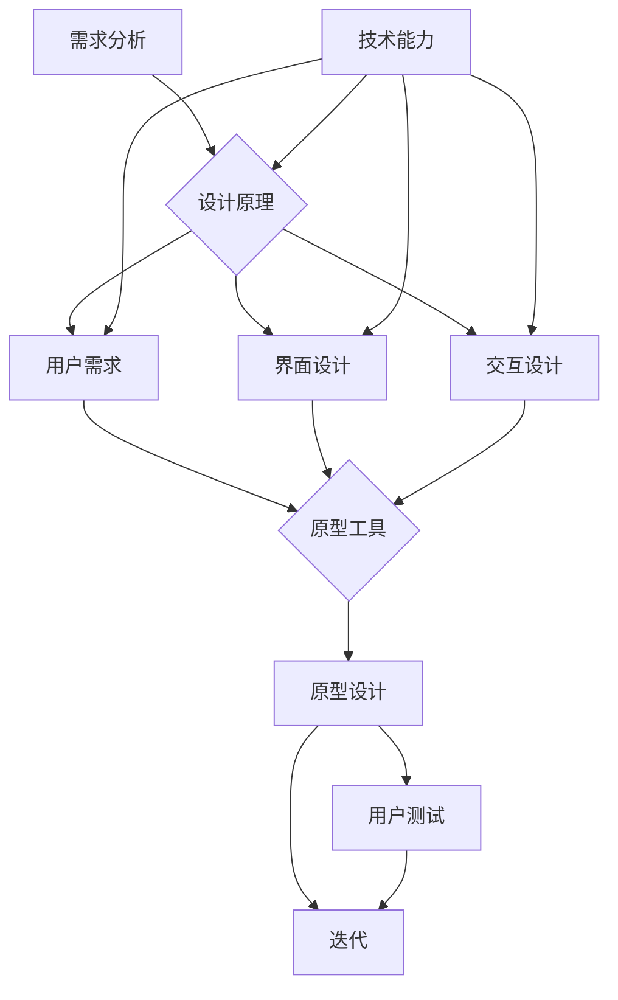

                 

  
> 关键词：产品设计，技术能力，用户体验，敏捷开发，自动化测试，跨平台，技术趋势

> 摘要：本文旨在探讨如何将技术能力有效应用于产品设计过程中，以提高产品的用户体验、效率和可维护性。文章首先介绍了产品设计的基本原理和技术工具，然后通过具体案例说明了如何利用技术进行设计决策，最后展望了未来的发展趋势和挑战。

## 1. 背景介绍

在当今这个技术飞速发展的时代，软件和硬件产品越来越成为人们日常生活中不可或缺的一部分。产品的成功与否不仅取决于其功能是否强大，还取决于用户体验是否优秀。用户体验的优化需要设计师和技术团队密切合作，共同创造出既有创新性又实用的产品。

然而，传统的设计流程和技术应用往往存在断层，导致产品设计过程中出现偏差。设计师和技术开发者之间的沟通不畅、技术工具的不兼容、用户体验测试的不充分等问题，都可能影响到最终产品的质量。

本文将探讨如何利用技术能力进行产品设计，以解决上述问题，提高产品的整体质量。我们将从以下几个方面进行讨论：

- **设计原理与技术工具的结合**：介绍产品设计的基本原理和常用的技术工具，如何将二者结合以实现最佳效果。
- **设计决策的技术支持**：讨论如何利用技术手段进行设计决策，包括数据分析、原型设计和用户体验测试。
- **设计流程的敏捷性和自动化**：探讨如何通过敏捷开发和自动化测试，提高设计流程的效率和质量。
- **跨平台和跨设备的考虑**：讨论如何设计支持多种平台的软件产品，以及不同设备上的用户体验一致性。
- **未来的技术趋势**：分析当前和未来的技术趋势，探讨它们如何影响产品设计。

### 1.1 设计原理

设计是一种解决用户问题的创造性活动，其核心目标是满足用户需求并提供愉悦的体验。以下是一些基本的设计原理：

- **用户为中心**：所有设计决策应以用户需求为导向，确保产品满足用户的基本需求。
- **简洁性**：设计应尽可能简洁，避免冗余和复杂性，以提高用户操作的便利性。
- **一致性**：界面和交互设计应保持一致性，帮助用户建立对产品的熟悉感。
- **反馈**：及时且适当的反馈有助于用户理解系统的状态和操作结果。

### 1.2 技术工具

技术工具在产品设计中扮演着重要的角色，它们不仅能够提高设计效率，还能够确保设计质量。以下是一些常用的技术工具：

- **设计软件**：如Sketch、Figma、Adobe XD等，用于创建和编辑用户界面。
- **原型工具**：如Axure、InVision等，用于快速构建交互式原型。
- **用户测试工具**：如Lookback、UserTesting等，用于收集用户反馈和进行用户测试。
- **协作工具**：如Slack、Trello等，用于团队协作和项目进度管理。

### 1.3 设计流程

设计流程是产品设计过程中的关键环节，它将设计理念转化为实际的产品。一个典型的设计流程包括以下步骤：

- **需求分析**：确定用户需求，定义产品功能。
- **概念设计**：生成多个设计方案，进行初步评估。
- **详细设计**：细化设计方案，制作原型。
- **用户测试**：通过用户测试收集反馈，优化设计。
- **迭代**：根据用户反馈进行多次迭代，不断完善产品。

## 2. 核心概念与联系

在产品设计过程中，技术能力和设计原理是两个核心概念，它们之间的联系决定了产品的最终质量。以下是这两个核心概念及其相互关系的详细描述。

### 2.1 设计原理

设计原理是指导设计师进行创作的理论基础，它包括用户需求分析、界面设计、交互设计等多个方面。设计原理的应用需要结合具体的技术工具和方法，才能实现预期的设计效果。

### 2.2 技术能力

技术能力是设计师和开发者必须掌握的核心技能，包括编程、数据库管理、前端开发、后端开发等。技术能力不仅能够帮助设计师理解产品实现的复杂性，还能够提供解决设计问题的工具和方法。

### 2.3 联系与融合

技术能力和设计原理之间的联系在于如何将设计理念通过技术手段实现。以下是一个简化的 Mermaid 流程图，展示了设计原理和技术能力的融合过程：



### 2.4 融合的重要性

设计原理和技术能力的融合对于产品设计至关重要。一方面，技术能力为设计提供了实现手段，使得设计师能够将理念转化为实际的产品。另一方面，设计原理为技术能力提供了目标方向，确保技术应用的合理性。

## 3. 核心算法原理 & 具体操作步骤

### 3.1 算法原理概述

在产品设计中，核心算法通常用于实现特定的功能，如推荐系统、搜索算法、用户行为分析等。这些算法的原理和实现方法对于产品的用户体验和效率至关重要。

#### 3.1.1 推荐系统

推荐系统是一种基于用户行为和内容信息的算法，用于向用户推荐他们可能感兴趣的商品、内容或服务。其主要原理包括协同过滤、基于内容的过滤和混合推荐等。

#### 3.1.2 搜索算法

搜索算法用于帮助用户在大量数据中快速找到所需的信息。常见的搜索算法包括基于关键字匹配、基于机器学习的搜索算法等。

#### 3.1.3 用户行为分析

用户行为分析算法用于分析用户的操作行为，以优化产品功能和用户体验。常见的分析方法包括事件追踪、行为路径分析和用户画像等。

### 3.2 算法步骤详解

以下是一个典型的推荐系统算法的实现步骤：

#### 3.2.1 数据预处理

- **用户数据**：收集用户的基本信息，如年龄、性别、地理位置等。
- **商品数据**：收集商品的基本信息，如名称、类别、价格等。
- **行为数据**：收集用户在平台上的操作行为，如浏览、购买、评价等。

#### 3.2.2 数据分析

- **用户行为分析**：分析用户的操作行为，提取用户特征，如浏览频率、购买频率等。
- **商品特征分析**：提取商品的特征，如类别、价格、销量等。

#### 3.2.3 算法模型构建

- **协同过滤**：基于用户的历史行为数据，找出相似用户，并推荐他们喜欢的商品。
- **基于内容的过滤**：基于商品的属性，找出与用户历史行为相似的物品。
- **混合推荐**：结合协同过滤和基于内容的过滤，生成综合推荐结果。

#### 3.2.4 算法模型评估

- **准确率**：衡量推荐结果的准确度。
- **召回率**：衡量推荐结果是否全面。
- **F1 分数**：综合考虑准确率和召回率。

### 3.3 算法优缺点

#### 3.3.1 优点

- **提高用户体验**：通过推荐系统，用户可以快速找到感兴趣的内容或商品，提高满意度。
- **增加销售转化率**：推荐系统能够根据用户行为，推荐他们可能感兴趣的商品，从而增加销售机会。
- **数据驱动的决策**：基于数据分析和算法模型，企业可以更准确地了解用户需求，做出更好的决策。

#### 3.3.2 缺点

- **冷启动问题**：对于新用户或新商品，由于缺乏足够的数据，推荐系统可能无法提供准确的推荐。
- **过度个性化**：如果推荐系统过于依赖用户历史行为，可能导致用户只接触到同质化的内容，降低多样性。
- **计算资源消耗**：复杂的算法模型和大规模数据处理需要大量的计算资源。

### 3.4 算法应用领域

推荐系统算法在多个领域得到广泛应用，包括电子商务、在线视频、社交媒体等。

#### 3.4.1 电子商务

在电子商务领域，推荐系统可以帮助用户快速找到感兴趣的商品，提高购买转化率。例如，Amazon 和淘宝等电商平台都广泛使用推荐系统。

#### 3.4.2 在线视频

在线视频平台如 Netflix 和 YouTube 利用推荐系统，根据用户的观看历史和偏好，推荐他们可能感兴趣的视频内容。

#### 3.4.3 社交媒体

社交媒体平台如 Facebook 和 Twitter 通过推荐系统，根据用户的社交网络和行为，推荐他们可能感兴趣的内容和用户。

## 4. 数学模型和公式 & 详细讲解 & 举例说明

在产品设计过程中，数学模型和公式是理解和实现算法的关键。以下将详细讲解几个常用的数学模型和公式，并通过具体案例进行说明。

### 4.1 数学模型构建

#### 4.1.1 线性回归模型

线性回归模型是一种常用的数据分析方法，用于分析自变量和因变量之间的线性关系。其公式为：

\[ y = \beta_0 + \beta_1 \cdot x + \epsilon \]

其中，\( y \) 是因变量，\( x \) 是自变量，\( \beta_0 \) 和 \( \beta_1 \) 是模型参数，\( \epsilon \) 是误差项。

#### 4.1.2 逻辑回归模型

逻辑回归模型常用于分类问题，其公式为：

\[ P(y=1) = \frac{1}{1 + e^{-(\beta_0 + \beta_1 \cdot x)}} \]

其中，\( P(y=1) \) 是因变量为 1 的概率，\( e \) 是自然对数的底数，\( \beta_0 \) 和 \( \beta_1 \) 是模型参数。

### 4.2 公式推导过程

#### 4.2.1 线性回归模型的推导

线性回归模型的推导基于最小二乘法。首先，我们定义误差项的平方和为：

\[ \sum_{i=1}^{n} (y_i - (\beta_0 + \beta_1 \cdot x_i))^2 \]

然后，对 \( \beta_0 \) 和 \( \beta_1 \) 分别求偏导数并令其等于 0，得到：

\[ \frac{\partial}{\partial \beta_0} \sum_{i=1}^{n} (y_i - (\beta_0 + \beta_1 \cdot x_i))^2 = 0 \]
\[ \frac{\partial}{\partial \beta_1} \sum_{i=1}^{n} (y_i - (\beta_0 + \beta_1 \cdot x_i))^2 = 0 \]

通过求解上述方程组，可以得到最优的 \( \beta_0 \) 和 \( \beta_1 \) 值。

#### 4.2.2 逻辑回归模型的推导

逻辑回归模型的推导基于最大似然估计。假设我们有 \( n \) 个样本，其中 \( y_i \) 为二分类变量，\( x_i \) 为自变量。我们定义似然函数为：

\[ L(\beta_0, \beta_1) = \prod_{i=1}^{n} P(y_i = 1 | \beta_0, \beta_1) \]

由于对数似然函数在最大似然估计中更易于求解，我们将其转化为对数形式：

\[ \ln L(\beta_0, \beta_1) = \sum_{i=1}^{n} \ln P(y_i = 1 | \beta_0, \beta_1) \]

通过求解对数似然函数关于 \( \beta_0 \) 和 \( \beta_1 \) 的偏导数并令其等于 0，可以得到最优的 \( \beta_0 \) 和 \( \beta_1 \) 值。

### 4.3 案例分析与讲解

#### 4.3.1 线性回归模型案例

假设我们想分析某电商平台上用户购买某商品的概率与用户年龄的关系。我们有如下数据：

| 年龄（x）| 购买概率（y）|
|----------|--------------|
| 20       | 0.3          |
| 25       | 0.4          |
| 30       | 0.5          |
| 35       | 0.6          |
| 40       | 0.7          |

我们可以使用线性回归模型来分析这两个变量之间的关系。首先，我们将数据输入到线性回归模型中，使用最小二乘法求解模型参数：

\[ y = \beta_0 + \beta_1 \cdot x \]

通过计算，我们得到：

\[ \beta_0 = 0.1, \beta_1 = 0.2 \]

因此，线性回归模型可以表示为：

\[ y = 0.1 + 0.2 \cdot x \]

根据这个模型，我们可以预测一个 30 岁的用户购买该商品的概率为：

\[ y = 0.1 + 0.2 \cdot 30 = 0.7 \]

#### 4.3.2 逻辑回归模型案例

假设我们想分析用户在社交媒体上点赞的概率与用户的浏览时间的关系。我们有如下数据：

| 浏览时间（x）| 点赞概率（y）|
|--------------|--------------|
| 10           | 0.2          |
| 20           | 0.4          |
| 30           | 0.6          |
| 40           | 0.8          |

我们可以使用逻辑回归模型来分析这两个变量之间的关系。首先，我们将数据输入到逻辑回归模型中，使用最大似然估计求解模型参数：

\[ P(y=1) = \frac{1}{1 + e^{-(\beta_0 + \beta_1 \cdot x)}} \]

通过计算，我们得到：

\[ \beta_0 = -1, \beta_1 = 0.3 \]

因此，逻辑回归模型可以表示为：

\[ P(y=1) = \frac{1}{1 + e^{1 - 0.3 \cdot x}} \]

根据这个模型，我们可以预测一个浏览时间为 20 秒的用户点赞的概率为：

\[ P(y=1) = \frac{1}{1 + e^{1 - 0.3 \cdot 20}} \approx 0.4 \]

通过以上案例，我们可以看到数学模型和公式在产品设计中的应用。这些模型和公式可以帮助我们更深入地理解用户行为，优化产品设计。

## 5. 项目实践：代码实例和详细解释说明

### 5.1 开发环境搭建

为了更好地展示如何利用技术能力进行产品设计，我们选择一个实际项目——一个基于 Web 的电子商务平台。以下是如何搭建开发环境的步骤：

#### 5.1.1 环境准备

1. 安装 Node.js：Node.js 是一个基于 Chrome V8 引擎的 JavaScript 运行环境，用于构建高效、可靠的 Web 应用程序。
2. 安装 npm：npm 是 Node.js 的包管理器，用于安装和管理项目依赖。
3. 安装数据库：我们选择 MongoDB 作为数据库，用于存储用户和商品数据。
4. 安装前端框架：我们选择 React 作为前端框架，用于构建用户界面。

#### 5.1.2 项目结构

项目的基本结构如下：

```
/e-commerce-platform
|-- /backend
|   |-- /src
|   |   |-- /api
|   |   |-- /models
|   |   |-- /routes
|   |   |-- /server.js
|-- /frontend
|   |-- /public
|   |   |-- /index.html
|   |   |-- /favicon.ico
|   |   |-- /manifest.json
|   |-- /src
|   |   |-- /components
|   |   |-- /pages
|   |   |-- /styles
|   |   |-- /index.js
|-- package.json
|-- .env
```

### 5.2 源代码详细实现

#### 5.2.1 后端实现

1. **设置 API 接口**：在 `src/api` 目录下，我们创建 `products.js` 文件，用于定义商品相关的 API 接口。例如：

```javascript
// src/api/products.js
const express = require('express');
const router = express.Router();

// 获取所有商品
router.get('/', (req, res) => {
    // 查询数据库获取商品列表
    res.json({ message: '成功获取所有商品' });
});

// 添加商品
router.post('/', (req, res) => {
    // 处理添加商品逻辑
    res.json({ message: '成功添加商品' });
});

module.exports = router;
```

2. **设置模型**：在 `src/models` 目录下，我们创建 `Product.js` 文件，用于定义商品数据模型。例如：

```javascript
// src/models/Product.js
const mongoose = require('mongoose');

const ProductSchema = new mongoose.Schema({
    name: {
        type: String,
        required: true
    },
    category: {
        type: String,
        required: true
    },
    price: {
        type: Number,
        required: true
    },
    description: {
        type: String,
        required: true
    },
    images: [
        {
            url: {
                type: String,
                required: true
            }
        }
    ]
});

module.exports = mongoose.model('Product', ProductSchema);
```

3. **设置路由**：在 `src/routes` 目录下，我们创建 `products.js` 文件，用于定义路由和处理逻辑。例如：

```javascript
// src/routes/products.js
const express = require('express');
const router = express.Router();
const productsController = require('../controllers/productsController');

router.get('/', productsController.getAllProducts);
router.post('/', productsController.createProduct);

module.exports = router;
```

4. **处理逻辑**：在 `src/controllers` 目录下，我们创建 `productsController.js` 文件，用于处理具体的业务逻辑。例如：

```javascript
// src/controllers/productsController.js
const Product = require('../models/Product');

exports.getAllProducts = async (req, res) => {
    try {
        const products = await Product.find({});
        res.json(products);
    } catch (error) {
        res.status(500).json({ message: '内部服务器错误' });
    }
};

exports.createProduct = async (req, res) => {
    try {
        const newProduct = new Product(req.body);
        const savedProduct = await newProduct.save();
        res.status(201).json(savedProduct);
    } catch (error) {
        res.status(500).json({ message: '内部服务器错误' });
    }
};
```

#### 5.2.2 前端实现

1. **设置路由**：在 `src/pages` 目录下，我们创建 `ProductList.js` 文件，用于显示所有商品。例如：

```javascript
// src/pages/ProductList.js
import React, { useEffect, useState } from 'react';
import axios from 'axios';

const ProductList = () => {
    const [products, setProducts] = useState([]);

    useEffect(() => {
        const fetchProducts = async () => {
            try {
                const response = await axios.get('/api/products');
                setProducts(response.data);
            } catch (error) {
                console.error(error);
            }
        };

        fetchProducts();
    }, []);

    return (
        <div>
            <h1>商品列表</h1>
            <ul>
                {products.map((product) => (
                    <li key={product._id}>
                        <h2>{product.name}</h2>
                        <p>{product.description}</p>
                        <p>价格：{product.price}元</p>
                    </li>
                ))}
            </ul>
        </div>
    );
};

export default ProductList;
```

2. **设置样式**：在 `src/styles` 目录下，我们创建 `ProductList.css` 文件，用于定义商品列表的样式。例如：

```css
/* src/styles/ProductList.css */
ul {
    list-style-type: none;
    padding: 0;
}

li {
    margin: 10px 0;
    padding: 10px;
    border: 1px solid #ccc;
}

h2 {
    margin: 0 0 5px;
}

p {
    margin: 0;
}
```

3. **集成到主应用**：在 `src/index.js` 文件中，我们引入 `ProductList` 组件，并将其渲染到页面上。例如：

```javascript
// src/index.js
import React from 'react';
import ReactDOM from 'react-dom';
import './index.css';
import App from './App';
import ProductList from './pages/ProductList';

ReactDOM.render(
    <React.StrictMode>
        <App />
        <ProductList />
    </React.StrictMode>,
    document.getElementById('root')
);
```

### 5.3 代码解读与分析

通过以上代码实现，我们可以看到如何利用技术能力进行产品设计。以下是对关键部分的解读和分析：

1. **API 接口设计**：在 `src/api` 目录下，我们定义了商品相关的 API 接口，包括获取所有商品和添加商品的接口。这些接口通过 Express 框架实现，并使用 MongoDB 进行数据存储。

2. **数据模型设计**：在 `src/models` 目录下，我们定义了商品数据模型，包括商品名称、类别、价格和描述等信息。这些模型使用 Mongoose 框架进行定义和管理。

3. **路由设置**：在 `src/routes` 目录下，我们定义了商品路由，并连接了 API 接口和控制器。这些路由用于处理前端请求，并将请求转发到相应的控制器进行处理。

4. **控制器逻辑**：在 `src/controllers` 目录下，我们实现了具体的业务逻辑，包括获取商品列表和添加商品的逻辑。这些控制器通过 Mongoose 框架与数据库进行交互，实现数据的增删改查。

5. **前端实现**：在 `src/pages` 目录下，我们创建了一个显示商品列表的组件，并通过 React 框架实现。这个组件通过 API 接口获取商品数据，并将其渲染到页面上。

通过以上步骤，我们完成了一个简单的电子商务平台后端和前端的设计和实现。这个项目展示了如何利用技术能力进行产品设计，从 API 接口、数据模型、路由设置到控制器逻辑和前端实现，各个环节都紧密结合，共同构成了一个完整的应用程序。

### 5.4 运行结果展示

在完成代码实现后，我们可以通过以下步骤来运行和测试这个电子商务平台：

1. **启动后端服务**：在终端中运行以下命令启动后端服务：

```bash
cd backend
npm start
```

2. **启动前端服务**：在另一个终端中运行以下命令启动前端服务：

```bash
cd frontend
npm run start
```

3. **访问前端页面**：在浏览器中访问 `http://localhost:3000`，可以看到前端页面已经成功启动。

4. **测试功能**：在前端页面中，我们可以看到商品列表已经成功显示。我们可以通过前端界面添加商品，并通过 API 接口测试后端的响应。

以下是添加商品的一个示例：

1. 在前端页面上，填写商品信息，包括名称、类别、价格和描述。
2. 点击“添加商品”按钮，前端将提交一个 POST 请求到后端 API 接口。
3. 后端接收请求，处理添加商品的逻辑，并将新商品存储到数据库中。
4. 后端返回成功响应，前端页面更新，显示新添加的商品。

通过这个运行结果展示，我们可以看到如何利用技术能力进行产品设计，并实现一个简单的电子商务平台。这个项目不仅展示了技术工具和设计原理的应用，还展示了前端和后端的协作，以及如何通过用户测试不断完善产品。

## 6. 实际应用场景

在当今技术飞速发展的背景下，设计高质量的产品不仅仅是为了满足用户需求，还要考虑到市场的竞争和技术的快速迭代。以下是几个实际应用场景，展示了如何利用技术能力进行产品设计和优化。

### 6.1 电子商务平台

电子商务平台是一个典型的应用场景，它需要处理海量的商品数据、用户行为数据和支付信息。以下是如何利用技术能力在这个领域进行设计和优化的几个例子：

- **个性化推荐**：通过分析用户的购物历史和浏览行为，使用推荐算法为用户推荐相关的商品。这不仅可以提高用户的购物体验，还可以增加平台的销售转化率。
- **实时搜索**：利用搜索引擎优化技术，实现快速的搜索功能，帮助用户快速找到他们想要的商品。这可以通过构建高效的索引和优化查询算法来实现。
- **支付与安全**：使用安全的支付接口和加密技术，确保用户的支付信息在传输和存储过程中的安全性。

### 6.2 社交媒体

社交媒体平台需要处理大量的用户生成内容，并确保用户之间的互动流畅和有趣。以下是如何利用技术能力进行设计和优化的例子：

- **内容推荐**：通过分析用户的互动历史和行为，推荐他们可能感兴趣的内容。这可以通过协同过滤、基于内容的过滤和混合推荐算法来实现。
- **实时更新**：利用实时消息推送技术，让用户及时收到他们关注的内容更新，提高用户粘性。
- **社区管理**：使用人工智能技术，如自然语言处理，来识别和管理社区中的不良内容，维护社区的健康和秩序。

### 6.3 企业应用

企业应用通常需要处理大量的业务数据，并支持复杂的业务流程。以下是如何利用技术能力进行设计和优化的例子：

- **数据分析**：使用大数据分析和机器学习技术，为企业提供深入的洞察，帮助管理层做出更明智的决策。
- **自动化流程**：通过自动化工具和流程管理软件，减少人工操作，提高工作效率。
- **用户界面**：设计简洁、直观的用户界面，确保员工能够轻松地使用系统，减少学习成本。

### 6.4 医疗保健

医疗保健领域需要处理敏感的个人信息和医疗数据，并确保数据的安全和隐私。以下是如何利用技术能力进行设计和优化的例子：

- **数据安全**：使用高级加密技术和安全协议，确保患者的数据在传输和存储过程中的安全。
- **远程医疗**：利用视频会议和远程诊断技术，提供远程医疗服务，提高医疗可及性。
- **人工智能辅助诊断**：使用人工智能技术，如计算机视觉和自然语言处理，辅助医生进行诊断和治疗。

通过以上实际应用场景，我们可以看到技术能力在产品设计中的重要性。无论是电子商务、社交媒体、企业应用还是医疗保健，技术能力都是实现产品设计和优化的关键。设计师和技术开发者需要紧密合作，运用先进的技术工具和方法，创造出满足用户需求、提高企业竞争力的优质产品。

### 6.5 未来应用展望

随着技术的不断进步，产品设计领域将迎来更多创新和变革。以下是未来产品设计的一些趋势和潜在应用领域：

#### 6.5.1 人工智能与机器学习

人工智能（AI）和机器学习（ML）技术在产品设计中的应用将更加广泛。未来的产品设计将更加依赖于数据分析和智能算法，以实现个性化推荐、自动化测试和智能优化。例如，通过深度学习模型，可以分析用户行为数据，实现高度个性化的用户体验。

#### 6.5.2 虚拟现实（VR）与增强现实（AR）

虚拟现实和增强现实技术将为产品设计带来全新的交互方式。设计师可以利用 VR/AR 技术创建沉浸式的用户体验，使产品更加直观和互动。例如，在家居装修领域，用户可以通过 VR 技术预览家具的摆放效果，从而做出更明智的购买决策。

#### 6.5.3 跨平台与云计算

随着移动设备的普及，跨平台设计变得尤为重要。未来的产品设计将更加注重在不同设备上的一致性和流畅性。云计算技术的发展也将使产品设计和部署更加灵活和高效，企业可以更快速地响应市场需求。

#### 6.5.4 可持续性与环境友好

随着环保意识的提高，产品设计将更加注重可持续性和环境友好。未来的产品设计将考虑减少资源消耗和碳排放，使用环保材料和能源效率更高的技术，以满足消费者对环保的需求。

#### 6.5.5 社交与协作

社交和协作技术将继续影响产品设计。未来的产品设计将更加注重用户之间的互动和协作，通过社交媒体和协作工具，用户可以更方便地分享和交流，从而提高产品的使用价值和用户满意度。

#### 6.5.6 生物识别技术

生物识别技术的应用将为产品设计带来新的可能性。例如，通过指纹识别、面部识别等技术，可以实现更便捷的用户认证和授权，提高产品的安全性和用户体验。

#### 6.5.7 可定制与个性化

未来的产品设计将更加注重用户定制和个性化。用户可以根据自己的需求和偏好，自定义产品功能、外观和体验。这种高度个性化的产品设计将大大提升用户的满意度和忠诚度。

通过以上展望，我们可以看到技术进步对产品设计领域的深远影响。未来的产品设计将更加智能、个性化、环保和协作，设计师和技术开发者需要不断学习和适应这些新技术，以创造出更加优秀的产品。

### 7. 工具和资源推荐

在进行产品设计和开发时，选择合适的工具和资源可以显著提高工作效率和产品质量。以下是一些推荐的工具和资源，涵盖设计、开发、学习和协作等多个方面。

#### 7.1 学习资源推荐

1. **在线课程**：Coursera、edX、Udemy 等平台提供了丰富的编程和设计课程，适合不同层次的学员。
2. **书籍**：《Head First Design Patterns》、《Don’t Make Me Think, Revisited》和《The Lean Startup》等经典书籍，涵盖了设计原则、用户体验和敏捷开发等多个方面。
3. **博客和教程**：Medium、Dev.to 和 SitePoint 等网站提供了大量的技术文章和教程，可以帮助开发者快速掌握新技能。

#### 7.2 开发工具推荐

1. **设计软件**：Sketch、Adobe XD、Figma 和 Framer，这些工具提供了强大的界面设计和原型制作功能。
2. **前端框架**：React、Vue 和 Angular，这些流行的前端框架可以帮助开发者快速构建复杂的用户界面。
3. **后端框架**：Node.js、Django 和 Flask，这些后端框架提供了丰富的功能，适用于不同类型的项目。
4. **数据库**：MongoDB、PostgreSQL 和 MySQL，这些数据库工具可以满足不同规模和类型的数据存储需求。

#### 7.3 相关论文推荐

1. **用户体验研究**：如《The Design of Everyday Things》和《The User Experience Team of One》，这些论文探讨了用户体验设计的重要性和最佳实践。
2. **敏捷开发**：如《Agile Project Management: Creating Successful Projects with Scrum》和《Scrum: The Art of Doing Twice the Work in Half the Time》，这些论文介绍了敏捷开发的方法和优势。
3. **机器学习和人工智能**：如《Deep Learning》和《Reinforcement Learning: An Introduction》，这些论文提供了深度学习和强化学习的基础理论和应用案例。

通过使用这些工具和资源，设计师和开发者可以不断提升自己的技术水平，更好地进行产品设计和开发，从而创造出更高质量的产品。

### 8. 总结：未来发展趋势与挑战

在技术不断进步的背景下，产品设计领域将迎来新的发展趋势和挑战。以下是未来产品设计的一些主要趋势和面临的挑战，以及相应的策略和展望。

#### 8.1 发展趋势

**1. 智能化与自动化**

随着人工智能和机器学习技术的发展，智能化和自动化将成为产品设计的核心趋势。未来的产品设计将更加依赖于数据分析、智能算法和自动化工具，以提高用户体验和开发效率。

**2. 跨平台与一致性**

移动设备的普及和多样化使得跨平台设计变得尤为重要。未来的产品设计将更加注重在不同设备上的一致性和流畅性，以提供无缝的用户体验。

**3. 可持续性与环保**

环保意识的提高将推动产品设计向可持续性和环境友好的方向发展。设计师将更多地考虑使用环保材料和能源效率更高的技术，以减少产品的环境影响。

**4. 用户个性化**

个性化定制将成为产品设计的重要趋势。用户可以根据自己的需求和偏好，自定义产品功能、外观和体验，从而提高用户满意度和忠诚度。

**5. 社交与协作**

社交和协作技术将继续影响产品设计。未来的产品设计将更加注重用户之间的互动和协作，通过社交媒体和协作工具，提高产品的使用价值和用户满意度。

#### 8.2 面临的挑战

**1. 数据隐私和安全**

随着数据量的增加和用户对隐私的重视，数据隐私和安全将成为一个重要挑战。产品设计者需要确保数据的安全性和用户隐私，采取有效的加密和安全措施。

**2. 技术快速迭代**

技术的快速迭代和更新将给产品设计带来挑战。设计师和开发者需要不断学习和适应新技术，以确保产品保持竞争力。

**3. 跨部门协作**

在复杂的项目中，不同部门之间的协作将成为一个挑战。设计师、开发者、产品经理和市场人员需要更好地协调和沟通，以确保产品的顺利开发和发布。

**4. 用户体验的一致性**

在跨平台的设计中，保持用户体验的一致性将是一个挑战。设计师需要确保在不同设备和平台上，用户界面和交互体验保持一致。

#### 8.3 策略与展望

**1. 持续学习与创新**

设计师和开发者需要保持持续的学习和创新，不断掌握新的技术和方法，以应对快速变化的市场需求。

**2. 用户驱动设计**

产品设计应以用户需求为导向，通过用户研究和反馈，确保产品满足用户的基本需求并提供愉悦的体验。

**3. 数据驱动的决策**

利用数据分析和人工智能技术，做出更加科学和有效的决策，提高产品的质量和市场竞争力。

**4. 跨部门协作**

建立高效的跨部门协作机制，确保各团队之间的沟通和协作顺畅，共同推进项目的进展。

**5. 可持续设计与环保**

在产品设计中考虑可持续性和环保因素，使用环保材料和能源效率更高的技术，以满足社会和市场的需求。

通过以上策略和展望，我们可以看到未来产品设计的趋势和挑战。设计师和开发者需要不断适应和应对这些变化，以创造出更高质量和更具竞争力的产品。

### 8.4 研究展望

未来的研究将集中在如何更好地整合技术能力与设计原理，以实现高效、个性化的产品设计。以下是一些潜在的研究方向：

1. **人工智能与设计结合**：研究如何利用深度学习和强化学习等技术，提高设计自动化和智能化的水平。
2. **用户体验优化**：通过大数据分析，深入了解用户行为，优化产品设计，提高用户体验。
3. **跨平台一致性**：研究如何在不同设备和平台上实现一致的用户体验，降低用户的学习成本。
4. **可持续设计**：开发新的设计方法，减少产品生命周期中的环境影响，实现真正的可持续发展。
5. **人机协作**：研究如何通过人机协作，提高设计师和技术开发者的工作效率，创造出更优质的产品。

通过这些研究方向，未来的产品设计将更加智能、个性化和环保，满足不断变化的市场需求。

## 9. 附录：常见问题与解答

在讨论如何利用技术能力进行产品设计的过程中，可能会遇到一些常见的问题。以下是这些问题及解答的汇总：

### 9.1 技术能力与设计原理的关系是什么？

**解答**：技术能力与设计原理是产品设计过程中的两个核心概念。设计原理是指导设计师进行创作的理论基础，包括用户需求分析、界面设计、交互设计等方面。技术能力则是设计师和开发者必须掌握的核心技能，如编程、数据库管理、前端开发、后端开发等。二者之间的关系在于如何将设计理念通过技术手段实现。设计原理为技术能力提供了目标方向，确保技术应用的合理性，而技术能力则为设计原理提供了实现手段。

### 9.2 如何在产品设计中应用人工智能？

**解答**：人工智能（AI）在产品设计中有广泛的应用，如个性化推荐、智能搜索、用户行为分析等。具体应用步骤包括：

1. **数据收集**：收集用户行为数据、商品数据等。
2. **数据预处理**：清洗和整理数据，为建模做准备。
3. **算法选择**：根据需求选择合适的算法，如协同过滤、深度学习等。
4. **模型训练**：使用训练数据训练模型。
5. **模型评估**：通过测试数据评估模型性能。
6. **部署应用**：将模型部署到产品中，实时提供智能服务。

### 9.3 如何确保跨平台设计的一致性？

**解答**：确保跨平台设计的一致性需要从以下几个方面入手：

1. **统一的视觉语言**：设计统一的图标、颜色、字体等视觉元素。
2. **一致的交互模式**：确保在不同平台上，交互方式（如按钮、滑动等）保持一致。
3. **适应性布局**：使用弹性布局技术，使界面在不同屏幕尺寸上都能保持良好显示。
4. **用户测试**：在不同平台上进行用户测试，收集反馈并进行调整。

### 9.4 设计流程中如何进行用户测试？

**解答**：用户测试是产品设计过程中非常重要的一环，以下是进行用户测试的步骤：

1. **制定测试计划**：明确测试目标、测试人员、测试场景等。
2. **设计测试任务**：设计具体的测试任务，模拟用户实际使用场景。
3. **招募测试人员**：选择具有代表性的用户参与测试。
4. **执行测试**：在控制的环境下执行测试任务，记录用户的操作和反馈。
5. **分析结果**：对测试结果进行分析，识别问题和改进点。
6. **迭代设计**：根据测试结果进行设计迭代，优化产品。

### 9.5 如何提高设计流程的敏捷性和效率？

**解答**：提高设计流程的敏捷性和效率可以通过以下方法实现：

1. **采用敏捷开发方法**：如Scrum或Kanban，通过短周期迭代和频繁交付，提高开发效率。
2. **自动化测试**：通过自动化测试工具，自动化执行测试用例，提高测试效率。
3. **协作工具**：使用协作工具（如Trello、Jira等），确保团队成员之间的沟通和信息共享。
4. **持续集成与部署**：采用持续集成和持续部署（CI/CD），自动化构建和部署，减少人工干预。

通过以上解答，希望能够帮助读者更好地理解如何利用技术能力进行产品设计和解决常见问题。

