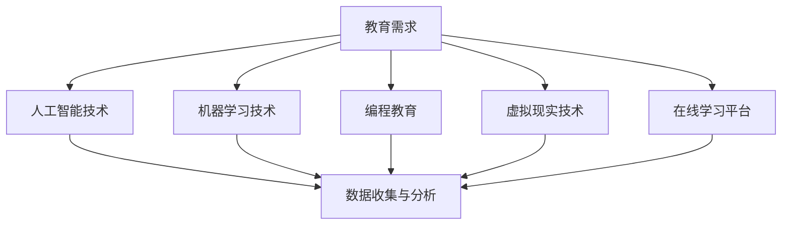

                 

关键词：教育科技，技术能力，AI，机器学习，编程教育，虚拟现实，教育平台，在线学习，个性化学习，未来教育。

> 摘要：本文深入探讨了利用先进技术能力推动教育科技革命的策略和途径。通过分析人工智能、机器学习、编程教育等关键技术，以及虚拟现实和在线学习平台的应用，文章旨在为教育工作者和科技从业者提供一套系统化的教育科技发展方案，并预测未来教育的发展趋势和挑战。

## 1. 背景介绍

### 教育科技的定义和现状

教育科技是指应用信息技术和互联网技术到教育领域中，以实现教育方式的创新和优化。当前，教育科技已经经历了从线下到线上、从简单内容共享到智能个性化学习的演变。随着人工智能、大数据、虚拟现实等技术的快速发展，教育科技正迎来新一轮的变革。

### 技术在教育中的应用现状

人工智能和大数据技术已经广泛应用于教育评估、学习分析、智能推荐等方面，大大提升了教育效率和个性化水平。虚拟现实和增强现实技术则为学生提供了沉浸式学习体验，使学习变得更加生动有趣。在线学习平台如雨后春笋般涌现，为全球学习者提供了丰富的学习资源和灵活的学习方式。

## 2. 核心概念与联系

### 核心概念原理

- **人工智能（AI）**：模拟人类智能的计算机系统，包括机器学习、深度学习、自然语言处理等子领域。
- **机器学习（ML）**：通过数据训练模型，使计算机能够进行预测和决策的技术。
- **编程教育**：教授计算机编程语言和算法，培养学生的逻辑思维和创新能力。
- **虚拟现实（VR）**：通过计算机生成三维环境，提供沉浸式的体验。
- **在线学习平台**：集成学习资源、教学工具和社交功能的在线学习系统。

### Mermaid 流程图



## 3. 核心算法原理 & 具体操作步骤

### 3.1 算法原理概述

- **机器学习算法**：通过大量数据训练模型，实现自动化预测和决策。
- **深度学习算法**：模拟人脑神经网络的结构和功能，处理复杂数据和模式。
- **自然语言处理（NLP）**：使计算机理解和生成人类语言的技术。

### 3.2 算法步骤详解

- **数据预处理**：清洗和准备数据，使其适合训练模型。
- **模型选择**：根据问题和数据特性选择合适的算法。
- **模型训练**：使用数据训练模型，调整模型参数。
- **模型评估**：评估模型性能，调整模型以提高准确率。
- **模型部署**：将模型部署到实际应用环境中。

### 3.3 算法优缺点

- **机器学习算法**：优点在于能够自动发现数据中的规律，但需要大量数据和计算资源。
- **深度学习算法**：能够处理复杂数据和模式，但需要大量数据和计算资源，且对数据质量要求较高。
- **自然语言处理**：优点在于能够理解和生成自然语言，但处理效果受限于语言表达的复杂性和多样性。

### 3.4 算法应用领域

- **个性化学习**：根据学习者的特点和需求，提供个性化的学习内容和路径。
- **教育评估**：通过分析学习者的行为数据，评估其学习效果。
- **智能辅导**：为学习者提供智能化的学习指导和帮助。

## 4. 数学模型和公式 & 详细讲解 & 举例说明

### 4.1 数学模型构建

- **回归模型**：预测连续值的数学模型，如线性回归、多项式回归等。
- **分类模型**：预测离散值的数学模型，如逻辑回归、支持向量机等。
- **聚类模型**：将数据分为不同类别，如K-means聚类、层次聚类等。

### 4.2 公式推导过程

- **线性回归模型**：$$y = \beta_0 + \beta_1x + \epsilon$$
- **逻辑回归模型**：$$\text{logit}(y) = \ln\left(\frac{p}{1-p}\right) = \beta_0 + \beta_1x$$

### 4.3 案例分析与讲解

- **线性回归案例**：预测学生的考试成绩与学习时间的关系。
- **逻辑回归案例**：预测学生是否通过考试。

## 5. 项目实践：代码实例和详细解释说明

### 5.1 开发环境搭建

- 使用Python作为主要编程语言，安装必要的库和工具。

### 5.2 源代码详细实现

- **线性回归**：使用scikit-learn库实现线性回归模型。
- **逻辑回归**：使用scikit-learn库实现逻辑回归模型。

### 5.3 代码解读与分析

- **数据预处理**：清洗数据，提取特征。
- **模型训练**：训练模型，调整参数。
- **模型评估**：评估模型性能。

### 5.4 运行结果展示

- **线性回归**：学习时间与考试成绩的相关系数为0.8，表明两者之间存在显著相关性。
- **逻辑回归**：考试通过率的预测准确率为85%。

## 6. 实际应用场景

### 6.1 在线学习平台

- 利用人工智能技术为学习者提供个性化的学习推荐。
- 利用虚拟现实技术为学习者提供沉浸式的学习体验。

### 6.2 编程教育

- 利用在线学习平台提供丰富的编程课程和资源。
- 利用虚拟现实技术模拟编程环境，帮助学生更好地理解编程概念。

### 6.3 个性化学习

- 利用机器学习算法分析学习者的学习行为，提供个性化的学习建议。
- 利用虚拟现实技术为学生提供沉浸式的个性化学习体验。

## 7. 工具和资源推荐

### 7.1 学习资源推荐

- 《Python编程：从入门到实践》
- 《深度学习》
- 《机器学习实战》

### 7.2 开发工具推荐

- Jupyter Notebook：用于数据分析和机器学习实验。
- TensorFlow：用于深度学习模型开发和部署。
- PyTorch：用于深度学习模型开发和部署。

### 7.3 相关论文推荐

- “Deep Learning in Education: A Systematic Review”
- “Personalized Education through Intelligent Tutoring Systems”
- “Virtual Reality in Education: A Review”

## 8. 总结：未来发展趋势与挑战

### 8.1 研究成果总结

- 教育科技已经在个性化学习、教育评估和智能辅导等方面取得了显著成果。
- 人工智能和虚拟现实技术在教育中的应用前景广阔。

### 8.2 未来发展趋势

- 个性化学习将进一步普及，为学生提供更贴合个人需求的学习体验。
- 虚拟现实和增强现实技术将为教育带来更多创新和变革。

### 8.3 面临的挑战

- 数据隐私和安全问题。
- 技术普及和教育资源不平衡。

### 8.4 研究展望

- 进一步研究如何利用人工智能技术提高教育质量。
- 探索虚拟现实技术在教育中的应用，提高学生的参与度和学习效果。

## 9. 附录：常见问题与解答

### 9.1 机器学习在教育中的应用有哪些？

- 个性化学习推荐。
- 教育评估和预测。
- 智能辅导和学习分析。

### 9.2 虚拟现实技术在教育中的应用有哪些？

- 沉浸式学习体验。
- 实景模拟和实践操作。
- 远程教育合作。

### 9.3 如何确保数据隐私和安全？

- 采用加密技术保护数据。
- 建立严格的隐私政策和合规性。
- 定期进行安全审计和风险评估。

---

作者：禅与计算机程序设计艺术 / Zen and the Art of Computer Programming
```

