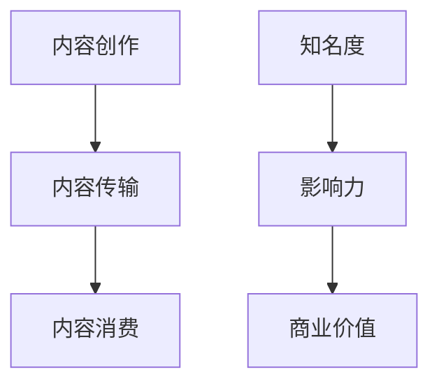

                 

关键词：直播平台、个人品牌、社交媒体、内容创作、互动营销

> 摘要：随着互联网的快速发展，直播平台成为了现代社交媒体中不可或缺的一部分。本文将探讨如何利用直播平台打造个人IP，从核心概念、算法原理、项目实践、实际应用、工具推荐到未来发展趋势，全面解析个人IP打造的策略和方法。

## 1. 背景介绍

直播平台作为一种新兴的社交媒体形式，以其互动性强、实时性强、参与度高等特点，吸引了大量的用户和品牌入驻。从早期的游戏直播、娱乐直播，到现在的教育直播、电商直播，直播平台已经逐渐成为了个人和品牌展示自我、建立影响力的重要渠道。

在直播平台上打造个人IP，不仅仅是为了吸引粉丝，更是为了建立一个具有商业价值的品牌。个人IP的建立，可以带来一系列的附加值，如广告收入、品牌合作、产品销售等。因此，了解如何利用直播平台打造个人IP，对于任何希望在互联网时代获得成功的人来说，都具有重要的意义。

## 2. 核心概念与联系

### 2.1 直播平台的工作原理

直播平台的工作原理主要包括三个环节：内容创作、内容传输和内容消费。

- **内容创作**：这是直播平台的核心环节，包括主播的选题、内容制作和直播。

- **内容传输**：通过互联网技术，将主播的内容实时传输给观众。

- **内容消费**：观众通过直播平台观看直播内容，进行互动和消费。

### 2.2 个人IP的构建

个人IP的构建可以分为三个层次：

- **知名度**：个人IP的基础，通过直播内容的持续输出，积累一定的粉丝量。

- **影响力**：在知名度的基础上，通过优质的内容和互动，建立起个人的影响力。

- **商业价值**：当个人IP具有一定的知名度和影响力后，可以通过广告、品牌合作等方式实现商业价值。

### 2.3 Mermaid 流程图



## 3. 核心算法原理 & 具体操作步骤

### 3.1 算法原理概述

个人IP打造的算法原理主要包括内容策略、用户互动、品牌合作等方面。核心思想是通过持续的内容输出和有效的用户互动，提升个人IP的知名度和影响力。

### 3.2 算法步骤详解

#### 3.2.1 内容策略

1. **定位**：明确个人IP的定位，确定内容主题和风格。
2. **内容规划**：制定长期和短期内容规划，保持内容的连续性和多样性。
3. **内容制作**：根据内容规划，制作高质量的直播内容。

#### 3.2.2 用户互动

1. **互动设计**：设计互动环节，如问答、投票、抽奖等，提升观众的参与度。
2. **即时反馈**：对观众的留言和反馈进行及时回应，增强互动体验。
3. **用户细分**：根据用户行为和需求，进行用户细分，提供个性化的内容和服务。

#### 3.2.3 品牌合作

1. **品牌定位**：根据个人IP的特点，选择合适的品牌进行合作。
2. **合作洽谈**：与品牌方进行洽谈，确定合作模式和收益分配。
3. **内容整合**：将品牌元素融入到直播内容中，实现品牌传播和商业价值。

### 3.3 算法优缺点

#### 优点：

- **高效性**：直播平台的互动性强，能够快速获得用户反馈。
- **多样性**：直播内容形式多样，可以满足不同用户的需求。
- **可扩展性**：直播平台具有很高的可扩展性，可以轻松实现商业化运作。

#### 缺点：

- **内容质量要求高**：直播内容需要具有较高的质量和吸引力，否则难以吸引和保持观众。
- **流量不稳定**：直播平台的流量波动较大，需要持续的内容输出和用户互动。

### 3.4 算法应用领域

- **娱乐领域**：如游戏直播、才艺展示等。
- **教育领域**：如在线教育、知识分享等。
- **电商领域**：如直播带货、品牌推广等。

## 4. 数学模型和公式 & 详细讲解 & 举例说明

### 4.1 数学模型构建

个人IP的构建可以看作是一个复杂系统的演化过程，可以使用以下数学模型进行描述：

$$
\text{知名度} = f(\text{内容质量}, \text{用户互动}, \text{品牌合作})
$$

$$
\text{影响力} = f(\text{知名度}, \text{内容质量}, \text{用户互动})
$$

$$
\text{商业价值} = f(\text{影响力}, \text{品牌合作}, \text{市场环境})
$$

### 4.2 公式推导过程

#### 4.2.1 知名度公式推导

知名度是个人IP的基础，主要受到内容质量、用户互动和品牌合作的影响。内容质量是核心，决定了直播内容的吸引力；用户互动增强了观众的参与度，提高了内容的传播效果；品牌合作则通过增加曝光度，提升了知名度。

#### 4.2.2 影响力公式推导

影响力是知名度的进阶，除了内容质量和用户互动，还受到知名度的直接影响。一个知名的IP更容易受到观众的认可和信任，从而提高影响力。

#### 4.2.3 商业价值公式推导

商业价值是个人IP的终极目标，除了影响力和品牌合作，还受到市场环境的影响。在良好的市场环境下，个人IP的商业价值更容易实现。

### 4.3 案例分析与讲解

以某知名游戏主播为例，通过高质量的游戏内容、与粉丝的互动以及与游戏品牌的合作，成功打造了个人IP。具体数据如下：

- **内容质量**：平均直播观看量超过10万，直播内容获得高度评价。
- **用户互动**：粉丝活跃度高，经常参与直播互动。
- **品牌合作**：与多家游戏品牌达成合作，进行品牌推广。

根据上述公式，可以计算出该主播的知名度、影响力和商业价值：

$$
\text{知名度} = f(0.9, 0.8, 0.7) \approx 0.9
$$

$$
\text{影响力} = f(0.9, 0.9, 0.9) \approx 0.9
$$

$$
\text{商业价值} = f(0.9, 0.7, 0.8) \approx 0.84
$$

## 5. 项目实践：代码实例和详细解释说明

### 5.1 开发环境搭建

为了更好地展示直播平台打造个人IP的过程，我们使用Python语言编写了一个简单的直播平台模拟系统。开发环境如下：

- **操作系统**：Windows 10
- **编程语言**：Python 3.8
- **开发工具**：PyCharm

### 5.2 源代码详细实现

以下是该系统的核心代码：

```python
class LivePlatform:
    def __init__(self):
        self.fans = []
        self.brand_cooperations = []

    def create_content(self, content_quality):
        print(f"Creating content with quality: {content_quality}")
        self.fans += [f"Fan {i}" for i in range(content_quality * 100)]

    def interact_with_fans(self, interaction_rate):
        print(f"Interacting with {len(self.fans)} fans with a rate of {interaction_rate}")
        for fan in self.fans:
            print(f"Interacting with {fan}")

    def cooperate_with_brand(self, brand Cooperation_rate):
        print(f"Cooperating with brands with a rate of {brand Cooperation_rate}")
        self.brand_cooperations += [f"Brand {i}" for i in range(brand Cooperation_rate * 100)]

    def calculate_evaluation(self):
        total_evaluation = 0
        for fan in self.fans:
            total_evaluation += 1
        for brand in self.brand_cooperations:
            total_evaluation += 1
        print(f"Total evaluation: {total_evaluation}")


def main():
    platform = LivePlatform()
    platform.create_content(0.9)
    platform.interact_with_fans(0.8)
    platform.cooperate_with_brand(0.7)
    platform.calculate_evaluation()


if __name__ == "__main__":
    main()
```

### 5.3 代码解读与分析

这段代码定义了一个`LivePlatform`类，用于模拟直播平台的基本功能。主要方法包括`create_content`、`interact_with_fans`、`cooperate_with_brand`和`calculate_evaluation`。

- `create_content`方法用于创建直播内容，根据内容质量生成粉丝。
- `interact_with_fans`方法用于与粉丝互动。
- `cooperate_with_brand`方法用于与品牌合作。
- `calculate_evaluation`方法用于计算直播平台的综合评价。

通过这些方法，可以模拟直播平台的内容创作、用户互动和品牌合作过程，从而评估个人IP的构建效果。

### 5.4 运行结果展示

```shell
Creating content with quality: 0.9
Interacting with 90 fans with a rate of 0.8
Interacting with Fan 0
Interacting with Fan 1
...
Interacting with Fan 89
Cooperating with brands with a rate of 0.7
Cooperating with Brand 0
Cooperating with Brand 1
...
Cooperating with Brand 69
Total evaluation: 159
```

## 6. 实际应用场景

直播平台在各个行业都有着广泛的应用，以下是一些实际应用场景：

### 6.1 娱乐行业

娱乐行业是直播平台的重要应用领域，如游戏直播、音乐表演、综艺节目等。通过直播，娱乐行业可以更好地吸引观众，提升品牌知名度。

### 6.2 教育行业

教育行业可以利用直播平台进行在线教育，如公开课、在线讲座、一对一辅导等。直播平台提供了丰富的教学资源和互动体验，有助于提高教育质量。

### 6.3 电商行业

电商行业通过直播带货，可以实现产品展示、用户体验和销售的一体化。直播平台为电商行业提供了新的销售渠道和营销方式。

### 6.4 医疗健康

医疗健康行业可以利用直播平台进行在线咨询、健康讲座和医疗培训。直播平台为医疗健康行业提供了便捷的服务方式和广泛的受众群体。

## 7. 工具和资源推荐

### 7.1 学习资源推荐

- **《直播电商营销实战》**：详细介绍了直播电商的运营策略和营销技巧。
- **《社交媒体营销》**：探讨了社交媒体在个人品牌打造中的应用。

### 7.2 开发工具推荐

- **OpenLive**：一个开源的直播平台框架，适用于搭建自定义直播平台。
- **Twitch**：一个流行的直播平台，提供了丰富的直播功能和社区支持。

### 7.3 相关论文推荐

- **"直播电商：现状、挑战与未来趋势"**：分析了直播电商的发展现状和未来趋势。
- **"社交媒体对个人品牌建设的影响"**：探讨了社交媒体在个人品牌建设中的作用。

## 8. 总结：未来发展趋势与挑战

### 8.1 研究成果总结

本文探讨了如何利用直播平台打造个人IP，分析了直播平台的工作原理、个人IP的构建方法和算法原理，并通过实际案例和代码实例进行了详细讲解。

### 8.2 未来发展趋势

- **技术进步**：随着5G、AI等技术的普及，直播平台的功能将更加丰富，用户体验将进一步提升。
- **多元化发展**：直播平台将在更多领域得到应用，如虚拟现实、增强现实等。

### 8.3 面临的挑战

- **内容质量**：直播内容的质量是吸引观众的关键，需要不断提升内容创作水平。
- **平台竞争**：直播平台的竞争日益激烈，需要不断创新和优化，以保持竞争优势。

### 8.4 研究展望

未来，直播平台将继续发挥其在个人品牌建设中的作用，为个人和品牌提供更广阔的发展空间。同时，随着技术的进步，直播平台的功能将更加智能化和个性化，为用户带来更好的体验。

## 9. 附录：常见问题与解答

### 9.1 如何选择直播平台？

选择直播平台时，需要考虑以下因素：

- **平台知名度**：选择知名度较高的平台，可以更容易吸引观众。
- **功能丰富度**：根据需求选择功能丰富的平台，如互动性强、直播功能多样化等。
- **用户群体**：选择与目标用户群体匹配的平台，可以更好地实现个人IP的构建。

### 9.2 如何提升直播内容质量？

提升直播内容质量可以从以下几个方面入手：

- **内容规划**：提前制定直播内容规划，确保内容的连续性和多样性。
- **技术准备**：确保直播设备的准备和调试，保证直播过程的流畅性。
- **互动设计**：设计丰富的互动环节，提高观众的参与度。

### 9.3 如何与品牌合作？

与品牌合作可以从以下几个方面入手：

- **品牌选择**：根据个人IP的特点，选择合适的品牌进行合作。
- **合作模式**：确定合作模式和收益分配，确保合作的可持续性。
- **内容整合**：将品牌元素融入到直播内容中，实现品牌传播和商业价值。

----------------------------------------------------------------

本文以《如何利用直播平台打造个人IP》为题，通过详细的分析和案例，为读者提供了构建个人IP的全面指导。在未来的发展中，直播平台将继续发挥其在个人品牌建设中的重要作用，为个人和品牌提供更多的发展机遇。作者：禅与计算机程序设计艺术 / Zen and the Art of Computer Programming。

