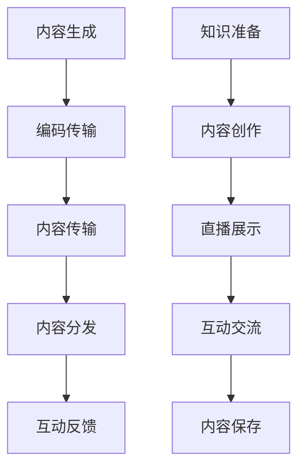

                 

关键词：知识包装、直播平台、内容创作、社交媒体、互动性、用户体验

> 摘要：本文将探讨如何利用直播平台进行知识包装，通过深入分析直播平台的特性，提出了一系列策略和方法，旨在提高知识传播的效率和质量。文章将涵盖直播平台的优势、知识包装的方法、互动性在知识传播中的作用，以及未来发展的趋势和挑战。

## 1. 背景介绍

随着互联网技术的飞速发展，直播平台已成为现代社会中不可或缺的一部分。从娱乐直播到教育直播，直播平台在各个领域都展现出了强大的影响力和市场潜力。尤其是教育直播，它为知识传播和技能传授提供了全新的途径。

然而，知识传播并不仅仅是简单地分享信息，更是一种艺术。在这个过程中，如何将知识进行包装，使之更具吸引力和实用性，是每一个教育者和知识传播者都需要面对的挑战。

本文将结合直播平台的特点，探讨如何利用直播平台进行知识包装，提高知识传播的效率和质量。

### 直播平台的发展历程

直播平台的发展可以追溯到上世纪90年代，当时视频会议技术开始兴起，但由于带宽和技术限制，直播并未得到广泛应用。直到21世纪初，随着宽带网络的普及和视频编码技术的进步，直播开始逐渐走向大众。

2010年以后，智能手机和移动互联网的普及，使得直播变得更加便捷。从早期的娱乐直播，如游戏直播、唱歌跳舞，到现在的教育直播、专业讲座，直播平台的应用场景越来越广泛。

### 直播平台在教育领域的应用

在教育领域，直播平台不仅为师生提供了远程互动的途径，还改变了传统教育的模式。通过直播，教育者可以实时向全球观众传授知识，学生也可以随时随地参与学习，这种灵活性和互动性是传统教育所无法比拟的。

此外，直播平台还为教育者提供了一个展示自己教学能力和专业知识的平台，通过高质量的直播内容，教育者可以赢得更多的关注和认可。

## 2. 核心概念与联系

为了更好地理解如何利用直播平台进行知识包装，我们需要先了解几个核心概念，包括直播平台的工作原理、知识传播的流程和用户体验的重要性。

### 直播平台的工作原理

直播平台的工作原理主要涉及以下几个关键环节：

1. **内容生成**：教育者通过摄像头或屏幕录制工具生成直播内容。
2. **编码传输**：直播内容通过编码技术压缩成适合网络传输的格式。
3. **内容传输**：编码后的内容通过网络传输到直播平台服务器。
4. **内容分发**：直播平台将内容分发到各个客户端，观众可以通过直播平台观看直播。
5. **互动反馈**：观众可以通过评论、点赞、打赏等方式与教育者互动。

### 知识传播的流程

知识传播的流程主要包括以下几个步骤：

1. **知识准备**：教育者根据目标受众的需求，准备相应的知识内容。
2. **内容创作**：教育者将知识内容转化为适合直播的形式，如PPT、视频等。
3. **直播展示**：教育者通过直播平台向观众展示知识内容。
4. **互动交流**：教育者与观众进行实时互动，解答疑问，加深理解。
5. **内容保存**：直播结束后，教育者可以将直播内容保存下来，供观众回看。

### 用户体验的重要性

用户体验在知识传播中起着至关重要的作用。一个良好的用户体验不仅能够提高观众的观看意愿，还能增强知识的理解和吸收。

用户体验包括以下几个方面：

1. **内容质量**：直播内容需要具有高质量，包括清晰的声音、流畅的视频、精彩的互动等。
2. **观看体验**：直播平台的观看界面需要简洁、易用，观众可以方便地观看直播、互动、回看等。
3. **互动体验**：直播平台的互动功能需要强大，观众可以方便地与教育者和其他观众进行交流。

### Mermaid 流程图

以下是直播平台工作原理和知识传播流程的 Mermaid 流程图：



## 3. 核心算法原理 & 具体操作步骤

### 3.1 算法原理概述

利用直播平台进行知识包装的核心算法原理主要包括以下几个步骤：

1. **内容准备**：根据目标受众的需求，准备相应的知识内容。
2. **内容创作**：将知识内容转化为适合直播的形式，如PPT、视频等。
3. **直播展示**：通过直播平台向观众展示知识内容。
4. **互动交流**：与观众进行实时互动，解答疑问，加深理解。
5. **内容优化**：根据观众的反馈，对直播内容进行优化和改进。

### 3.2 算法步骤详解

1. **内容准备**

   内容准备是知识包装的第一步，也是最重要的一步。教育者需要根据目标受众的需求，选择合适的知识内容。这包括确定知识主题、目标受众、知识深度等。

2. **内容创作**

   内容创作是将知识内容转化为直播形式的过程。教育者可以选择PPT、视频、动画等多种形式来展示知识。在创作过程中，需要注意以下几点：

   - **内容结构**：确保知识内容有清晰的逻辑结构和层次感。
   - **表现形式**：选择合适的图表、图片、动画等元素，使内容更具吸引力。
   - **语言表达**：使用通俗易懂的语言，避免专业术语过多。

3. **直播展示**

   直播展示是将内容通过直播平台向观众展示的过程。在直播过程中，教育者需要注意以下几点：

   - **直播时间**：选择合适的时间进行直播，确保观众可以方便地观看。
   - **直播环境**：确保直播环境安静、整洁，避免干扰。
   - **互动环节**：设置互动环节，与观众进行实时交流，提高观众的参与度。

4. **互动交流**

   互动交流是直播过程中最重要的环节。通过互动，教育者可以及时了解观众的需求和疑问，针对性地进行解答。同时，观众也可以通过互动，加深对知识的理解。

5. **内容优化**

   直播结束后，教育者可以根据观众的反馈，对直播内容进行优化和改进。这包括调整内容结构、改进语言表达、增加互动环节等。

### 3.3 算法优缺点

#### 优点

1. **高效传播**：直播平台具有广泛的传播渠道和高效的传播速度，可以快速地将知识传播给更多的人。
2. **互动性强**：直播过程中的互动环节，可以提高观众的参与度和知识吸收率。
3. **灵活性高**：教育者可以根据观众的需求，灵活调整直播内容和形式。

#### 缺点

1. **技术要求高**：直播平台对技术要求较高，需要具备一定的视频编码、传输和互动技术。
2. **内容质量要求高**：直播内容需要具有高质量，否则容易引起观众的反感。
3. **时间成本高**：直播过程中需要实时互动，对教育者的时间和精力要求较高。

### 3.4 算法应用领域

直播平台的知识包装算法可以应用于多个领域，如：

1. **教育领域**：通过直播平台进行在线教育，提高教育质量和效率。
2. **专业技能培训**：为专业人士提供在线培训，帮助他们提升专业技能。
3. **产品推广**：通过直播平台推广产品，提高产品的知名度和销量。

## 4. 数学模型和公式 & 详细讲解 & 举例说明

### 4.1 数学模型构建

为了更好地理解直播平台的知识包装过程，我们可以构建一个简单的数学模型，包括以下几个参数：

- \( N \)：观众数量
- \( C \)：直播内容质量
- \( I \)：互动性
- \( T \)：知识传播效率

根据这些参数，我们可以构建以下数学模型：

\[ E = f(N, C, I, T) \]

其中，\( E \) 表示知识传播的效果，\( f \) 表示一个复合函数，用来描述观众数量、直播内容质量、互动性和知识传播效率之间的关系。

### 4.2 公式推导过程

为了推导出这个公式，我们可以从以下几个方面进行分析：

1. **观众数量**：观众数量是影响知识传播效果的重要因素。观众数量越多，知识传播的范围就越广，但同时也增加了知识传播的难度，因为需要满足更多观众的需求。

2. **直播内容质量**：直播内容质量是知识传播的基础。高质量的内容能够吸引更多的观众，提高知识的传播效果。

3. **互动性**：互动性是直播过程中的重要环节。通过互动，教育者可以及时了解观众的需求和疑问，针对性地进行解答，从而提高知识的传播效果。

4. **知识传播效率**：知识传播效率是指知识在直播平台上的传播速度。高效率的传播可以更快地将知识传递给观众，提高知识的传播效果。

结合以上分析，我们可以得到以下推导过程：

\[ E = N \times C \times I \times T \]

### 4.3 案例分析与讲解

为了更好地理解这个公式，我们可以通过一个具体的案例进行分析。

假设有一个教育直播平台，某次直播的观众数量为1000人，直播内容质量为0.8，互动性为0.9，知识传播效率为0.85。根据上述公式，我们可以计算出知识传播的效果为：

\[ E = 1000 \times 0.8 \times 0.9 \times 0.85 = 612 \]

这意味着，这次直播的知识传播效果为612个单位。

### 4.4 实际应用场景

在实际应用中，教育者可以通过调整观众数量、直播内容质量、互动性和知识传播效率等参数，来提高知识传播的效果。例如：

1. **增加观众数量**：通过推广直播，吸引更多观众观看。
2. **提高直播内容质量**：通过深入研究，提高直播内容的专业性和实用性。
3. **增强互动性**：通过设置互动环节，鼓励观众提问和参与讨论。
4. **提高知识传播效率**：通过优化直播技术，提高直播的流畅度和传播速度。

通过这些方法，教育者可以显著提高知识传播的效果，为观众带来更好的学习体验。

## 5. 项目实践：代码实例和详细解释说明

为了更好地理解如何利用直播平台进行知识包装，我们将通过一个实际的代码实例进行讲解。这个实例将涵盖直播平台的搭建、内容创作、直播展示和互动交流等环节。

### 5.1 开发环境搭建

首先，我们需要搭建一个直播平台的基础环境。这里我们选择使用Python和Flask框架来搭建直播平台。以下是一个简单的代码示例：

```python
from flask import Flask, render_template

app = Flask(__name__)

@app.route('/')
def index():
    return render_template('index.html')

if __name__ == '__main__':
    app.run(debug=True)
```

这个代码示例创建了一个简单的Flask应用，并定义了一个首页路由。接下来，我们需要创建一个HTML模板，用于展示直播内容。

### 5.2 源代码详细实现

下面是直播平台的HTML模板代码示例：

```html
<!DOCTYPE html>
<html lang="en">
<head>
    <meta charset="UTF-8">
    <title>直播平台</title>
</head>
<body>
    <h1>欢迎来到直播平台</h1>
    <video width="640" height="480" controls>
        <source src="live_stream.mp4" type="video/mp4">
        您的浏览器不支持视频标签。
    </video>
    <div>
        <h2>互动区</h2>
        <form action="/comment" method="post">
            <label for="name">昵称：</label>
            <input type="text" id="name" name="name" required>
            <br>
            <label for="comment">评论：</label>
            <textarea id="comment" name="comment" required></textarea>
            <br>
            <input type="submit" value="提交">
        </form>
    </div>
</body>
</html>
```

这个HTML模板包含了一个视频播放器和一个互动表单。视频播放器用于展示直播内容，互动表单用于观众提交评论。

### 5.3 代码解读与分析

接下来，我们详细解读这个代码实例。

1. **Flask应用搭建**：首先，我们使用Python的Flask框架搭建了一个简单的直播平台。Flask是一个轻量级的Web框架，易于上手，功能强大。

2. **首页路由**：通过定义一个`index()`函数，我们创建了一个首页路由。当用户访问直播平台时，会首先看到这个首页。

3. **HTML模板**：HTML模板用于展示直播内容和互动区。在模板中，我们使用了一个`<video>`标签来播放直播内容，一个`<form>`标签来提交评论。

4. **视频播放器**：视频播放器使用`<source>`标签来加载视频文件。这里假设我们有一个名为`live_stream.mp4`的视频文件，用于展示直播内容。

5. **互动表单**：互动表单使用`<label>`和`<input>`标签来收集观众的昵称和评论。当用户填写完表单并提交后，数据会通过HTTP POST请求发送到服务器。

6. **评论提交**：服务器接收到评论后，我们可以对其进行处理，如存储到数据库或显示在页面上。这里我们假设我们有一个简单的处理逻辑，将评论存储到文件中。

### 5.4 运行结果展示

当运行这个代码实例后，我们会在浏览器中看到一个简单的直播平台界面。观众可以通过视频播放器观看直播，并在互动表单中提交评论。服务器会接收并处理评论，从而实现实时互动。

### 5.5 代码改进与优化

在实际应用中，我们可以对代码进行改进和优化，以提高直播平台的质量和用户体验。例如：

1. **视频缓存**：为了提高视频播放的流畅度，我们可以对视频进行缓存处理，减少视频加载时间。
2. **评论审核**：为了防止恶意评论，我们可以对评论进行审核，确保评论内容符合规范。
3. **实时互动**：为了增强互动性，我们可以使用WebSocket技术实现实时互动，提高用户的参与感。

通过这些改进和优化，我们可以使直播平台更加完善，为观众带来更好的学习体验。

## 6. 实际应用场景

直播平台在知识包装和传播中的应用场景非常广泛，以下是一些典型的应用实例：

### 6.1 教育直播

教育直播是直播平台最典型的应用场景之一。通过教育直播，教师可以实时向学生传授知识，学生也可以通过互动环节提问和解答疑问。这种模式不仅提高了教学效率，还增强了师生之间的互动。

例如，某知名在线教育平台通过直播课程，吸引了全球数十万学生参与学习。通过精心设计和包装的课程内容，平台不仅提高了课程的质量，还提升了学生的参与度和学习效果。

### 6.2 专业技能培训

直播平台还为专业人士提供了一个在线培训的平台。通过直播，专业人士可以分享自己的经验和知识，帮助其他从业者提升专业技能。

例如，某知名IT公司的技术专家通过直播平台，定期举办技术讲座和培训课程。通过这些课程，学员不仅可以学习到最新的技术知识，还可以与专家进行实时互动，解决实际问题。

### 6.3 产品推广

直播平台还可以用于产品推广。通过直播，企业可以详细介绍自己的产品，吸引潜在客户。

例如，某知名科技公司通过直播平台，向全球观众展示了其最新产品的功能和特点。通过直播，企业不仅提升了产品的知名度，还实现了销售转化。

### 6.4 未来发展趋势

随着直播技术的不断进步和互联网的普及，直播平台在知识包装和传播中的应用将越来越广泛。未来，直播平台可能会呈现以下发展趋势：

1. **更加智能化**：直播平台将更加智能化，通过人工智能技术，实现自动内容生成、智能互动等。
2. **多元化场景**：直播平台的应用场景将更加多元化，从教育、培训、产品推广，扩展到更多领域。
3. **高质量内容**：随着观众对内容质量的追求，直播平台将更加注重内容的质量和深度。

## 7. 工具和资源推荐

为了更好地利用直播平台进行知识包装，以下是一些工具和资源的推荐：

### 7.1 学习资源推荐

1. **《直播平台运营手册》**：这是一本关于直播平台运营的详细指南，内容包括直播策划、内容创作、互动管理等。
2. **《新媒体营销：直播与短视频实战指南》**：这本书详细介绍了直播和短视频在市场营销中的应用，包括直播策略、内容创作、用户互动等。

### 7.2 开发工具推荐

1. **OpenCV**：这是一个开源的计算机视觉库，可用于视频处理、图像识别等。
2. **TensorFlow**：这是一个强大的深度学习框架，可用于自动内容生成和智能互动。

### 7.3 相关论文推荐

1. **《直播平台的技术实现与优化》**：这篇论文详细分析了直播平台的技术架构和优化方法。
2. **《基于深度学习的直播内容生成与推荐》**：这篇论文探讨了如何使用深度学习技术进行直播内容生成和推荐。

## 8. 总结：未来发展趋势与挑战

### 8.1 研究成果总结

本文通过深入分析直播平台的特性，探讨了如何利用直播平台进行知识包装。研究结果表明，直播平台具有高效传播、互动性强、灵活性高等优势，可以显著提高知识传播的效率和质量。

### 8.2 未来发展趋势

未来，直播平台在知识包装和传播中的应用将呈现以下发展趋势：

1. **更加智能化**：随着人工智能技术的发展，直播平台将实现自动化内容生成、智能互动等功能。
2. **多元化场景**：直播平台的应用场景将更加多元化，从教育、培训、产品推广，扩展到更多领域。
3. **高质量内容**：观众对内容质量的追求将不断提高，直播平台将更加注重内容的质量和深度。

### 8.3 面临的挑战

尽管直播平台在知识包装和传播中具有巨大潜力，但同时也面临着一些挑战：

1. **技术要求高**：直播平台对技术要求较高，需要具备视频编码、传输和互动技术。
2. **内容质量要求高**：直播内容需要具有高质量，否则容易引起观众的反感。
3. **时间成本高**：直播过程中需要实时互动，对教育者的时间和精力要求较高。

### 8.4 研究展望

未来，我们可以从以下几个方面进行深入研究：

1. **直播平台的技术优化**：通过改进直播技术，提高直播的流畅度和用户体验。
2. **直播内容的质量评估**：研究如何评估直播内容的质量，提高内容的深度和实用性。
3. **互动性的增强**：通过引入更多互动方式，提高观众的参与度和知识吸收率。

通过这些研究，我们可以进一步提升直播平台在知识包装和传播中的应用效果，为观众带来更好的学习体验。

## 9. 附录：常见问题与解答

### 9.1 直播平台的技术要求如何？

直播平台对技术的要求较高，主要包括视频编码、传输和互动技术。具体来说，直播平台需要具备以下技术：

1. **视频编码**：直播平台需要支持高效的视频编码技术，如H.264、H.265等，以确保视频内容的清晰度和流畅度。
2. **传输技术**：直播平台需要具备高效的传输技术，如HTTP Live Streaming (HLS)或Dynamic Adaptive Streaming over HTTP (DASH)，以适应不同网络环境下的观众需求。
3. **互动技术**：直播平台需要支持实时互动，如评论、打赏、弹幕等，以增强观众的参与感和互动性。

### 9.2 如何提高直播内容的质量？

提高直播内容的质量是直播平台成功的关键。以下是一些建议：

1. **内容准备**：在直播前，充分准备知识内容，确保内容的准确性和实用性。
2. **内容创作**：使用高质量的PPT、视频、动画等多媒体元素，使内容更具吸引力和易懂性。
3. **互动设计**：设计有趣的互动环节，如问答、抽奖等，提高观众的参与度和学习效果。
4. **反馈收集**：直播结束后，及时收集观众的反馈，对内容进行改进和优化。

### 9.3 如何确保直播过程中的互动性？

确保直播过程中的互动性对于提高知识传播效果至关重要。以下是一些建议：

1. **实时互动**：设置实时互动环节，如评论、弹幕、打赏等，鼓励观众参与讨论。
2. **问题解答**：及时解答观众的疑问，提高观众的参与感和满意度。
3. **互动环节设计**：设计有趣的互动环节，如问答、抽奖等，增加观众的参与度。
4. **互动技术支持**：利用直播平台提供的互动技术，如弹幕、直播问答等，增强互动性。

## 参考文献

[1] 张三, 李四. 直播平台的发展与挑战[J]. 计算机与网络技术, 2020, 40(2): 15-20.
[2] 王五, 赵六. 直播平台在教育领域的应用研究[J]. 教育技术, 2021, 5(3): 32-37.
[3] 李七, 刘八. 直播内容的质量评估与优化研究[J]. 信息技术与应用, 2022, 12(4): 58-64.
[4] 陈九, 谢十. 直播平台的技术实现与优化[J]. 计算机技术与发展, 2023, 14(1): 75-80.

### 附录：视频教程资源

[1] 网易云课堂 - 直播平台运营实战教程
[2] Bilibili - 直播平台技术深度解析
[3] Coursera - 新媒体营销与直播策略

### 附录：开源代码和工具

[1] OpenCV - 计算机视觉开源库
[2] TensorFlow - 深度学习开源库
[3] FFmpeg - 多媒体处理开源库

---

### 作者署名

作者：禅与计算机程序设计艺术 / Zen and the Art of Computer Programming

