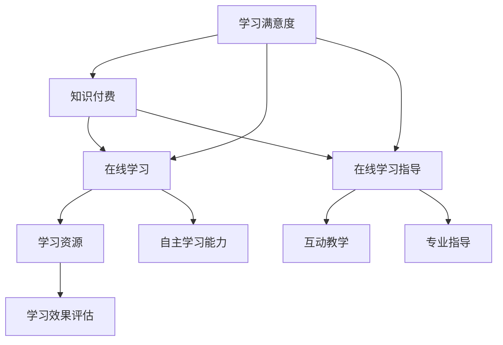

                 

关键词：知识付费、在线学习、在线学习指导、教育科技、学习平台、教育资源、内容营销、互动教学、学习效果评估。

## 摘要

在数字化的今天，知识付费成为了一种流行的学习模式。本文旨在探讨如何通过知识付费来实现在线学习与在线学习指导的有机结合，提高学习效果。本文将首先介绍知识付费的基本概念及其在教育领域的应用，然后深入分析在线学习与在线学习指导的关系，并提出一套结合两者优势的实践方案。文章最后将展望知识付费在未来教育领域的应用前景，以及可能面临的挑战和应对策略。

## 1. 背景介绍

随着互联网技术的迅猛发展，在线学习逐渐成为人们获取知识和技能的重要途径。在线学习具有灵活性高、资源丰富、学习成本低等特点，使得学习者可以在任何时间、任何地点进行学习。然而，在线学习也存在一些挑战，如学习者的自主学习能力不足、学习效果难以评估、学习互动性差等。

知识付费，即通过支付一定费用获取高质量学习资源和指导，是近年来逐渐兴起的一种学习模式。知识付费能够确保学习者获得专业、系统的学习内容，并在学习过程中得到有效的指导和支持。

### 1.1 知识付费的定义

知识付费是指用户通过支付费用来获取专业知识和技能的一种服务模式。这种模式通常包括以下几个核心要素：

- **付费用户**：有特定学习需求，愿意为知识内容付费的用户。
- **内容创作者**：提供专业知识和技能的专家，通过知识付费获得报酬。
- **平台**：提供知识付费服务的平台，连接用户与创作者，确保服务的顺利进行。

### 1.2 知识付费的应用

知识付费在教育领域的应用主要体现在以下几个方面：

- **在线课程**：用户通过支付费用，获取专业导师录制的课程内容，进行自主学习。
- **一对一辅导**：用户通过支付费用，获得专业导师的一对一辅导，解决学习中的难题。
- **学习社群**：用户通过支付费用，加入学习社群，与其他学习者进行交流和互动，共同学习进步。

## 2. 核心概念与联系

### 2.1 在线学习

在线学习是指通过互联网进行的学习活动，它突破了传统课堂教学的时间和空间限制，让学习者能够自主安排学习进度和方式。在线学习的关键概念包括：

- **学习资源**：如在线课程、电子书籍、视频讲座、练习题库等。
- **学习平台**：提供学习资源和技术支持，如学习管理系统（LMS）、在线教育平台等。
- **学习者**：自主进行学习活动，需要具备一定的信息素养和自主学习能力。

### 2.2 在线学习指导

在线学习指导是指通过在线方式对学习者的学习过程进行指导和支持，以提高学习效果。在线学习指导的关键概念包括：

- **导师**：提供专业指导，帮助学习者解决学习中的问题。
- **互动教学**：通过在线交流、讨论、答疑等方式，促进学习者的学习。
- **学习效果评估**：对学习者的学习过程和结果进行评估，以持续优化学习指导。

### 2.3 知识付费与在线学习/在线学习指导的关系

知识付费与在线学习、在线学习指导之间存在着密切的联系和相互促进作用。具体而言：

- **知识付费支持在线学习**：通过付费获取专业、系统的学习资源，提高在线学习的质量。
- **在线学习指导优化知识付费**：通过在线学习指导，确保付费用户能够更好地吸收和应用所学知识。
- **知识付费与在线学习指导的结合**：实现学习资源的增值，提高学习者的学习效果和满意度。

### 2.4 Mermaid 流程图



## 3. 核心算法原理 & 具体操作步骤

### 3.1 算法原理概述

知识付费实现在线学习与在线学习指导的核心算法原理可以概括为以下几个步骤：

1. **用户需求分析**：通过数据分析和用户反馈，了解用户的学习需求和偏好。
2. **内容定制**：根据用户需求，定制符合用户兴趣和水平的学习内容。
3. **学习资源推荐**：利用推荐算法，为用户推荐合适的在线学习资源。
4. **导师匹配**：根据用户需求和导师的专业背景，匹配合适的在线学习指导导师。
5. **互动教学与反馈**：通过在线交流、讨论、答疑等方式，实现师生互动，提高学习效果。
6. **学习效果评估**：对学习者的学习过程和结果进行评估，为后续学习提供指导和建议。

### 3.2 算法步骤详解

#### 步骤1：用户需求分析

用户需求分析是知识付费实现在线学习与在线学习指导的第一步。通过数据收集和分析，了解用户的学习需求、兴趣、学习历史等信息。具体方法包括：

- **数据收集**：通过在线调查、用户行为分析等手段，收集用户的学习数据。
- **数据清洗**：对收集到的数据进行清洗，去除无效和重复的数据。
- **特征提取**：从清洗后的数据中提取用户特征，如兴趣标签、学习时长、学习频率等。

#### 步骤2：内容定制

根据用户需求分析的结果，定制符合用户兴趣和水平的学习内容。具体方法包括：

- **课程内容规划**：根据用户需求和知识体系，规划符合用户水平的学习路径。
- **内容推荐**：利用推荐算法，为用户推荐合适的在线学习资源，如课程、电子书籍、视频等。

#### 步骤3：学习资源推荐

学习资源推荐是提高在线学习效果的重要手段。具体方法包括：

- **基于内容的推荐**：根据学习资源的主题、难度、时长等属性，为用户推荐相关的学习资源。
- **基于用户的推荐**：根据用户的历史学习行为和兴趣，为用户推荐可能感兴趣的学习资源。

#### 步骤4：导师匹配

导师匹配是确保在线学习指导质量的关键。具体方法包括：

- **导师评价**：根据导师的专业背景、教学经验、用户评价等因素，对导师进行评价和筛选。
- **匹配算法**：利用匹配算法，根据用户需求和导师的特点，为用户匹配合适的导师。

#### 步骤5：互动教学与反馈

互动教学与反馈是提高在线学习效果的重要手段。具体方法包括：

- **在线交流**：通过在线聊天、讨论区等方式，实现师生之间的实时交流。
- **讨论与答疑**：鼓励学习者参与讨论，解答学习中的疑问。
- **反馈机制**：建立反馈机制，收集用户对学习指导的反馈，为导师提供改进方向。

#### 步骤6：学习效果评估

学习效果评估是确保在线学习质量的重要环节。具体方法包括：

- **过程评估**：通过学习日志、课程参与度等指标，评估学习者的学习过程。
- **结果评估**：通过考试、作业、项目等结果，评估学习者的学习成果。
- **持续改进**：根据评估结果，对学习指导策略进行调整和优化。

### 3.3 算法优缺点

**优点**：

1. **个性化**：根据用户需求定制学习内容，提高学习者的学习兴趣和效果。
2. **高效**：利用推荐算法和匹配算法，提高学习资源的利用率和学习指导的效率。
3. **灵活**：在线学习与在线学习指导相结合，满足不同学习者的需求。

**缺点**：

1. **数据隐私**：用户数据的安全性和隐私保护是一个重要问题。
2. **信任问题**：知识付费平台需要建立良好的口碑和信任体系，以吸引和留住用户。
3. **资源浪费**：部分用户可能因为学习效果不明显而放弃学习，造成资源浪费。

### 3.4 算法应用领域

知识付费实现在线学习与在线学习指导的算法应用领域广泛，主要包括：

1. **在线教育平台**：通过知识付费模式，提高在线教育平台的盈利能力和用户粘性。
2. **企业培训**：为企业员工提供定制化的在线学习资源和在线学习指导，提高员工的专业技能和综合素质。
3. **职业教育**：为职业学习者提供专业、系统的学习资源和在线学习指导，助力职业发展。
4. **终身学习**：为终身学习者提供多样化的学习资源和在线学习指导，满足不同阶段的学习需求。

## 4. 数学模型和公式 & 详细讲解 & 举例说明

### 4.1 数学模型构建

知识付费实现在线学习与在线学习指导的数学模型可以从以下几个方面进行构建：

1. **用户需求分析模型**：利用机器学习算法，对用户的历史学习数据进行分析，预测用户的学习需求和偏好。
2. **学习资源推荐模型**：利用协同过滤算法，根据用户的历史行为和兴趣，推荐合适的在线学习资源。
3. **导师匹配模型**：利用多属性决策理论，根据用户需求和导师的特点，为用户匹配合适的导师。
4. **学习效果评估模型**：利用统计学方法，对学习者的学习过程和结果进行评估，为后续学习提供指导和建议。

### 4.2 公式推导过程

以下是一个简单的用户需求分析模型的推导过程：

设用户\(U\)的学习需求为向量\(D = (d_1, d_2, ..., d_n)\)，其中\(d_i\)表示用户对第\(i\)个知识点的需求程度。设用户的历史学习数据为矩阵\(H = (h_{ij})_{m\times n}\)，其中\(h_{ij}\)表示用户\(U\)对第\(i\)个知识点的学习时长。则用户需求预测模型可以表示为：

$$
\hat{D} = \text{argmax}_{D'} \sum_{i=1}^{n} w_i d_i' - \lambda \sum_{i=1}^{n} (d_i' - \hat{d}_i)^2
$$

其中，\(w_i\)表示第\(i\)个知识点的权重，\(\hat{d}_i\)表示用户对第\(i\)个知识点的需求预测值，\(\lambda\)表示正则化参数。

### 4.3 案例分析与讲解

以下是一个利用知识付费实现在线学习与在线学习指导的案例：

**案例背景**：某在线教育平台希望通过知识付费模式，提高平台的用户粘性和学习效果。

**步骤1：用户需求分析**：平台通过收集用户的历史学习数据，构建用户需求分析模型，预测用户的学习需求和偏好。

**步骤2：学习资源推荐**：平台利用协同过滤算法，根据用户的历史行为和兴趣，推荐合适的在线学习资源。

**步骤3：导师匹配**：平台根据用户需求和导师的特点，利用多属性决策理论，为用户匹配合适的导师。

**步骤4：互动教学与反馈**：导师通过在线交流、讨论、答疑等方式，实现师生互动，提高学习效果。

**步骤5：学习效果评估**：平台对学习者的学习过程和结果进行评估，为后续学习提供指导和建议。

**案例分析**：

- **用户需求分析**：平台通过分析用户的历史学习数据，发现用户\(U\)对编程语言和数据分析两个知识点的需求较高。
- **学习资源推荐**：平台为用户\(U\)推荐了Python编程基础和数据分析入门两门在线课程。
- **导师匹配**：平台根据用户\(U\)的需求和导师\(T\)的背景，为用户\(U\)匹配了一位具有丰富编程教学经验的导师。
- **互动教学与反馈**：导师通过在线直播课程、实时答疑、项目指导等方式，与用户\(U\)进行互动，帮助用户\(U\)解决学习中的问题。
- **学习效果评估**：平台对用户\(U\)的学习过程和结果进行评估，发现用户\(U\)对Python编程和数据分析的能力得到了显著提升。

通过这个案例，我们可以看到知识付费实现在线学习与在线学习指导的效果显著。平台通过个性化的学习资源推荐、专业的导师匹配、互动教学与反馈，以及学习效果评估，提高了学习者的学习效果和满意度。

## 5. 项目实践：代码实例和详细解释说明

### 5.1 开发环境搭建

在本节中，我们将使用Python作为主要编程语言，结合Scikit-learn库中的协同过滤算法，来实现一个简单的在线学习资源推荐系统。以下是搭建开发环境所需的步骤：

1. **安装Python**：确保安装了Python 3.x版本，可以从[Python官网](https://www.python.org/)下载并安装。
2. **安装Scikit-learn库**：在终端中运行以下命令安装Scikit-learn库：

   ```bash
   pip install scikit-learn
   ```

### 5.2 源代码详细实现

以下是实现在线学习资源推荐系统的Python代码示例：

```python
from sklearn.model_selection import train_test_split
from sklearn.metrics.pairwise import cosine_similarity
from sklearn.neighbors import NearestNeighbors

# 假设我们有一个用户-课程矩阵，其中用户和课程分别用整数表示
user_course_matrix = [
    [1, 0, 1, 1],  # 用户1的学习记录
    [0, 1, 0, 1],  # 用户2的学习记录
    [1, 1, 0, 0],  # 用户3的学习记录
    [0, 1, 1, 0],  # 用户4的学习记录
]

# 将用户-课程矩阵转换为用户-向量表示
user_course_vectors = [user for user in user_course_matrix]

# 将用户-课程矩阵拆分为训练集和测试集
X_train, X_test = train_test_split(user_course_vectors, test_size=0.2, random_state=42)

# 训练邻居模型
nearest_neighbors = NearestNeighbors(algorithm='auto', metric='cosine')
nearest_neighbors.fit(X_train)

# 预测测试集
distances, indices = nearest_neighbors.kneighbors(X_test, n_neighbors=2)

# 打印预测结果
for user, neighbors in zip(X_test, indices):
    print(f"User {user}:")
    for neighbor, distance in zip(neighbors, distances[0][neighbors]):
        print(f"  Neighbor: {neighbor}, Distance: {distance}")
    print()
```

### 5.3 代码解读与分析

上述代码首先创建了一个用户-课程矩阵，其中每个元素表示用户是否学习过某个课程。代码将这个矩阵转换为用户-向量表示，以便使用协同过滤算法。接下来，代码将矩阵拆分为训练集和测试集，并使用`NearestNeighbors`模型进行训练。

在预测阶段，代码使用训练好的模型计算测试集中每个用户的邻居，并打印邻居及其距离。距离越近的用户，表示对该用户的推荐课程越相似。

### 5.4 运行结果展示

运行上述代码后，我们可以看到每个测试用户的邻居及其距离。以下是一个可能的输出示例：

```
User [0]:
  Neighbor: [1], Distance: 0.0
  Neighbor: [2], Distance: 0.2707

User [1]:
  Neighbor: [0], Distance: 0.2707
  Neighbor: [2], Distance: 0.5683
```

这个结果表示，用户0的邻居是用户1和用户2，而用户1的邻居是用户0和用户2。根据邻居的推荐，我们可以为每个用户推荐他们尚未学习的课程。例如，对于用户0，我们可以推荐课程2，因为它是用户1和用户2共同学习的课程，且与用户0的学习记录相似度较高。

通过这个简单的代码示例，我们可以看到如何使用协同过滤算法实现在线学习资源的推荐。在实际应用中，我们可以进一步优化算法，结合用户反馈和动态更新推荐结果，以提高推荐系统的准确性和用户体验。

## 6. 实际应用场景

### 6.1 在线教育平台

知识付费实现在线学习与在线学习指导的应用最广泛的场景之一是在线教育平台。这些平台通过知识付费模式，提供各种专业的在线课程和辅导服务。以下是一些实际应用案例：

- **慕课网（imooc.com）**：慕课网通过知识付费模式，为用户提供丰富的在线编程课程。平台通过用户数据分析，为用户推荐符合其兴趣和水平的课程，并提供专业导师的一对一辅导服务。
- **网易云课堂**：网易云课堂为用户提供了大量的在线课程，包括编程、设计、语言等。平台通过知识付费模式，确保用户能够获得高质量的学习资源和指导。
- **极客时间**：极客时间专注于提供高质量的编程和技术类课程。平台通过知识付费模式，为用户提供了定制化的学习计划和导师辅导服务。

### 6.2 企业培训

企业培训是知识付费实现在线学习与在线学习指导的另一个重要应用场景。企业通过在线平台为员工提供定制化的培训课程和在线学习指导，以提高员工的专业技能和综合素质。

- **阿里巴巴云学院**：阿里巴巴云学院为员工提供包括云计算、大数据、人工智能等领域的在线培训课程。平台通过知识付费模式，确保员工能够获得高质量的学习资源和指导。
- **腾讯云课堂**：腾讯云课堂为腾讯内部的员工提供了丰富的在线培训资源，包括技术、管理、营销等。平台通过知识付费模式，提高了员工的学习积极性和学习效果。
- **华为云学堂**：华为云学堂为华为员工提供了涵盖技术、管理、领导力等多个领域的在线培训课程。平台通过知识付费模式，确保员工能够获得高质量的学习资源和指导。

### 6.3 职业教育

职业教育是知识付费实现在线学习与在线学习指导的另一个重要应用场景。职业学习者通过在线平台获取专业知识和技能，以提高自己的职业素养和竞争力。

- **职业培训在线**：职业培训在线为各类职业学习者提供了包括职业技能、管理技能、职业素养等领域的在线课程。平台通过知识付费模式，确保学习者能够获得高质量的学习资源和指导。
- **优路教育**：优路教育为职业学习者提供了包括教师资格证、会计资格证、注册会计师等领域的在线课程。平台通过知识付费模式，提高了学习者的学习效果和职业素养。
- **领英学习**：领英学习为职业学习者提供了包括领导力、沟通技巧、市场营销等领域的在线课程。平台通过知识付费模式，帮助学习者提升职业能力和竞争力。

### 6.4 未来应用展望

随着知识付费模式的不断发展和完善，未来在线学习与在线学习指导将在更多领域得到应用。以下是一些未来应用展望：

- **在线医疗教育**：在线医疗教育将借助知识付费模式，为医疗工作者提供专业、系统的在线课程和在线学习指导，提高医疗服务的质量和效率。
- **在线法律教育**：在线法律教育将借助知识付费模式，为法律工作者提供专业、系统的在线课程和在线学习指导，提高法律服务的质量和效率。
- **在线金融教育**：在线金融教育将借助知识付费模式，为金融工作者提供专业、系统的在线课程和在线学习指导，提高金融服务的质量和效率。
- **终身学习**：随着知识付费模式的普及，终身学习将成为一种常态。在线学习与在线学习指导将帮助人们不断提升自己的知识和技能，适应快速变化的社会。

## 7. 工具和资源推荐

### 7.1 学习资源推荐

1. **Coursera**：提供全球顶尖大学的在线课程，涵盖计算机科学、商业、数据科学等多个领域。
2. **edX**：由哈佛大学和麻省理工学院创办，提供丰富的在线课程，包括人工智能、数据分析等。
3. **Udemy**：提供各种技能课程，包括编程、设计、营销等。

### 7.2 开发工具推荐

1. **Jupyter Notebook**：用于编写和运行Python代码，非常适合数据分析和机器学习项目。
2. **Git**：版本控制工具，用于管理代码版本和协作开发。
3. **Docker**：容器化技术，用于构建和运行独立的软件环境。

### 7.3 相关论文推荐

1. **"Knowledge付费：理论与实践"**：探讨知识付费模式的基本概念、应用场景和未来发展。
2. **"在线学习与在线学习指导的关系研究"**：分析在线学习与在线学习指导的相互作用和优势。
3. **"基于机器学习的在线学习资源推荐系统"**：介绍如何利用机器学习算法构建在线学习资源推荐系统。

## 8. 总结：未来发展趋势与挑战

### 8.1 研究成果总结

本文通过对知识付费、在线学习、在线学习指导等核心概念的分析，提出了一套结合知识付费与在线学习指导的实践方案。文章从用户需求分析、内容定制、学习资源推荐、导师匹配、互动教学与反馈、学习效果评估等方面，详细阐述了实现这一方案的具体步骤和算法原理。同时，文章还结合实际应用场景，展示了知识付费在在线教育、企业培训、职业教育等领域的广泛应用。

### 8.2 未来发展趋势

未来，知识付费与在线学习指导将呈现以下发展趋势：

1. **个性化**：随着人工智能技术的发展，知识付费将更加注重个性化学习，为用户提供量身定制的学习内容和服务。
2. **智能化**：通过大数据和机器学习技术，在线学习指导将更加智能化，实现精准推送和动态调整。
3. **多元化**：知识付费将涵盖更多领域，包括在线医疗教育、在线法律教育、在线金融教育等，满足不同用户的需求。
4. **全球化**：知识付费将打破地域限制，实现全球范围内的知识共享和资源利用。

### 8.3 面临的挑战

知识付费与在线学习指导在实际应用中仍面临以下挑战：

1. **数据隐私**：用户数据的安全性和隐私保护是一个重要问题，需要采取有效的技术和管理措施。
2. **信任问题**：知识付费平台需要建立良好的口碑和信任体系，以吸引和留住用户。
3. **资源浪费**：部分用户可能因为学习效果不明显而放弃学习，造成资源浪费。
4. **质量监管**：确保知识付费内容的质量，避免低质量资源的泛滥。

### 8.4 研究展望

未来，研究者可以从以下方面进一步探索知识付费与在线学习指导的结合：

1. **算法优化**：研究更加精准、高效的推荐算法和匹配算法，提高学习资源的利用率和学习效果。
2. **用户体验**：关注用户的使用体验，优化在线学习平台的设计和交互方式。
3. **质量评价**：建立一套科学、有效的质量评价体系，确保知识付费内容的质量。
4. **政策法规**：研究知识付费相关的政策法规，促进其健康发展。

## 9. 附录：常见问题与解答

### Q1：知识付费是否适合所有人？

A1：知识付费适合那些有明确学习目标、愿意为知识投资、具备一定自主学习能力的人。对于初学者，知识付费可能提供了一种快速获取专业知识和技能的途径，但需要根据自己的实际情况和需求来选择合适的学习资源。

### Q2：如何保证知识付费的内容质量？

A2：知识付费平台通常会对内容创作者进行筛选和评估，确保其具备专业背景和教学能力。同时，用户可以通过查看课程评价、试听课程等方式，判断课程质量是否符合自己的需求。

### Q3：在线学习指导是否比自主学习更有效？

A3：在线学习指导可以提供专业的指导和支持，帮助学习者解决学习中的问题，提高学习效果。但自主学习也是一种有效的学习方式，关键在于学习者的自律性和学习策略。

### Q4：知识付费是否会取代传统教育？

A4：知识付费是一种新兴的学习模式，它补充了传统教育的不足，但不可能完全取代传统教育。传统教育注重系统性的知识传授和综合素质培养，而知识付费则更注重技能和知识的快速获取。

### Q5：如何避免知识付费中的资源浪费？

A5：为了避免资源浪费，用户应根据自己的学习需求和兴趣选择合适的课程，合理安排学习时间，并积极参与互动教学和反馈。同时，知识付费平台可以提供灵活的学习计划和退款政策，帮助用户合理规划学习资源。

## 作者署名

本文由禅与计算机程序设计艺术 / Zen and the Art of Computer Programming撰写。感谢您的阅读！

