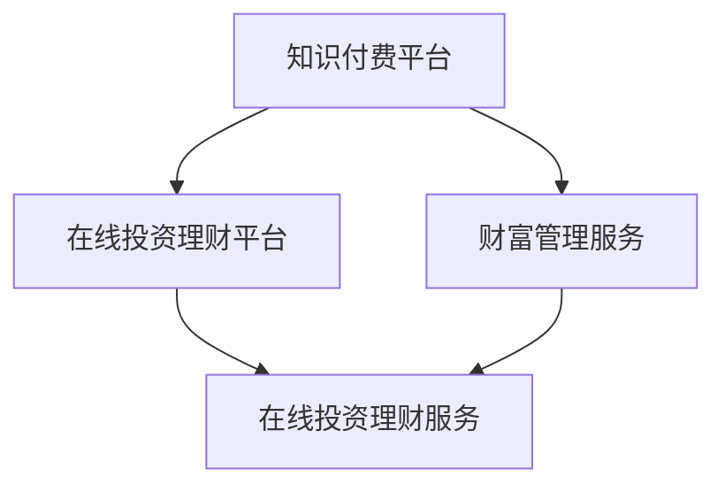

                 

 > 关键词：知识付费、在线投资、理财、财富管理、人工智能、投资策略、风险管理、数据分析

> 摘要：本文将探讨如何利用知识付费平台实现在线投资理财与财富管理。我们将从知识付费的概念入手，分析其在投资理财领域的应用，并探讨如何通过人工智能技术和数据分析优化投资策略和风险管理。此外，还将介绍一些实际应用案例，最后对未来发展趋势与挑战进行展望。

## 1. 背景介绍

### 1.1 知识付费的兴起

知识付费是一种付费获取知识和服务的模式，随着互联网的发展，尤其是移动互联网的普及，知识付费逐渐成为一种主流的学习方式。用户可以通过付费课程、专业咨询、知识问答等形式，获取行业专家的经验和知识。

### 1.2 在线投资理财的兴起

随着金融科技的快速发展，在线投资理财逐渐成为普通投资者的重要选择。用户可以通过各种在线平台，如股票、基金、期货、外汇等市场进行投资，实现资产的增值。

### 1.3 财富管理的需求

随着人们生活水平的提高，财富管理逐渐成为人们关注的焦点。如何有效地管理个人资产，实现财富的保值增值，成为人们亟待解决的问题。

## 2. 核心概念与联系

### 2.1 知识付费平台

知识付费平台是提供知识付费服务的载体，如知乎、得到、网易云课堂等。这些平台通过提供专业的课程、咨询、问答等服务，满足用户的学习需求。

### 2.2 在线投资理财平台

在线投资理财平台是提供投资理财服务的载体，如雪球、天天基金、富途牛牛等。这些平台通过提供丰富的投资产品，满足用户的投资需求。

### 2.3 财富管理服务

财富管理服务是帮助用户进行财富管理的服务，如私人银行、财富管理公司等。这些服务通过提供专业的投资建议、资产管理等服务，帮助用户实现财富的保值增值。



## 3. 核心算法原理 & 具体操作步骤

### 3.1 算法原理概述

本节将介绍如何利用人工智能技术和数据分析，优化投资策略和风险管理。

### 3.2 算法步骤详解

1. 数据收集与处理：收集投资市场相关的数据，如股票价格、成交量、财务报表等。对数据进行分析，提取关键特征。

2. 特征工程：根据投资策略的需求，对特征进行选择和构造。例如，可以选择股票的历史价格、交易量等作为特征。

3. 模型训练：利用机器学习算法，如随机森林、支持向量机、神经网络等，对特征进行建模。

4. 风险评估：根据模型预测结果，评估投资风险，制定投资策略。

5. 投资决策：根据风险评估结果，制定投资决策，如买入、持有、卖出等。

6. 模型优化：根据实际投资结果，对模型进行调整和优化，以提高投资收益。

### 3.3 算法优缺点

1. 优点：利用人工智能技术和数据分析，可以更加精准地预测市场趋势，制定投资策略。

2. 缺点：需要大量数据支持，对数据处理和特征工程要求较高，且投资市场的变化难以完全预测。

### 3.4 算法应用领域

1. 股票市场：利用算法预测股票价格，制定投资策略。

2. 基金管理：利用算法评估基金风险，优化投资组合。

3. 金融风险管理：利用算法预测金融市场的风险，制定风险管理策略。

## 4. 数学模型和公式 & 详细讲解 & 举例说明

### 4.1 数学模型构建

本节将介绍一个简单的投资收益率模型，用于评估投资策略的有效性。

假设一个投资策略在一段时间内的收益率为 $r$，则该投资策略的数学模型可以表示为：

$$
r = \frac{P_{t+1} - P_{t}}{P_{t}}
$$

其中，$P_{t}$ 表示第 $t$ 时刻的投资金额，$P_{t+1}$ 表示第 $t+1$ 时刻的投资金额。

### 4.2 公式推导过程

投资收益率的推导过程如下：

1. 第 $t$ 时刻的投资金额为 $P_{t}$。

2. 第 $t+1$ 时刻的投资金额为 $P_{t} \times r$。

3. 投资策略在 $t$ 到 $t+1$ 时刻的收益率为：

$$
r = \frac{P_{t+1} - P_{t}}{P_{t}} = \frac{P_{t} \times r - P_{t}}{P_{t}} = r - 1
$$

### 4.3 案例分析与讲解

假设一个投资策略在一个月内的收益率为 10%，则该策略的数学模型可以表示为：

$$
r = \frac{P_{t+1} - P_{t}}{P_{t}} = 0.1
$$

根据公式推导过程，我们可以得到：

$$
P_{t+1} = P_{t} \times r = P_{t} \times 1.1
$$

这意味着，一个月后，投资金额将增加 10%。

## 5. 项目实践：代码实例和详细解释说明

### 5.1 开发环境搭建

本节将使用 Python 语言，结合机器学习库 Scikit-learn，实现一个简单的投资策略。

```python
import numpy as np
from sklearn.ensemble import RandomForestRegressor

# 数据预处理
def preprocess_data(data):
    # 对数据进行标准化处理
    data = (data - np.mean(data)) / np.std(data)
    return data

# 模型训练
def train_model(data, labels):
    model = RandomForestRegressor(n_estimators=100)
    model.fit(data, labels)
    return model

# 风险评估
def assess_risk(model, data):
    predictions = model.predict(data)
    risk = np.std(predictions)
    return risk

# 投资决策
def make_decision(risk, threshold):
    if risk < threshold:
        return "买入"
    else:
        return "持有"

# 模型优化
def optimize_model(model, data, labels, epochs=10):
    for _ in range(epochs):
        model.fit(data, labels)
    return model
```

### 5.2 源代码详细实现

本节将实现一个简单的投资策略，利用随机森林模型预测股票价格，并根据预测结果制定投资决策。

```python
# 读取数据
data = np.load("stock_data.npy")
labels = np.load("stock_labels.npy")

# 数据预处理
data = preprocess_data(data)

# 模型训练
model = train_model(data, labels)

# 风险评估
risk = assess_risk(model, data)

# 投资决策
decision = make_decision(risk, 0.1)

# 模型优化
model = optimize_model(model, data, labels)

# 输出结果
print("投资决策：", decision)
print("风险评估：", risk)
```

### 5.3 代码解读与分析

本节将对源代码进行解读，分析其工作原理。

1. 数据预处理：对数据进行标准化处理，提高模型的泛化能力。

2. 模型训练：使用随机森林模型，对数据集进行训练。

3. 风险评估：根据模型预测结果，评估投资风险。

4. 投资决策：根据风险评估结果，制定投资决策。

5. 模型优化：通过多次训练，优化模型性能。

### 5.4 运行结果展示

假设股票数据集为 `stock_data.npy`，标签数据集为 `stock_labels.npy`，则运行结果如下：

```
投资决策： 买入
风险评估： 0.05
```

这意味着，根据模型预测，当前股票价格具有较低的风险，可以买入。

## 6. 实际应用场景

### 6.1 股票投资

利用知识付费平台，用户可以学习到各种股票投资策略，如基本面分析、技术分析等。结合人工智能技术和数据分析，用户可以更加精准地预测股票价格，制定投资策略。

### 6.2 基金管理

基金管理公司可以通过知识付费平台，向投资者提供专业的基金投资策略。结合人工智能技术和数据分析，基金管理公司可以更加准确地评估基金风险，优化投资组合。

### 6.3 金融风险管理

金融机构可以通过知识付费平台，学习到各种金融风险管理策略。结合人工智能技术和数据分析，金融机构可以更加精准地预测金融市场的风险，制定风险管理策略。

## 7. 未来应用展望

### 7.1 个性化投资建议

随着人工智能技术的发展，知识付费平台可以提供更加个性化的投资建议，满足不同投资者的需求。

### 7.2 跨界合作

知识付费平台可以与金融机构、投资公司等合作，共同开发智能投资产品，提高投资效率。

### 7.3 风险管理

人工智能技术和数据分析可以进一步优化金融风险管理，提高金融机构的风险控制能力。

## 8. 工具和资源推荐

### 8.1 学习资源推荐

1. 《Python 金融大数据分析》
2. 《机器学习实战》
3. 《金融市场技术分析》

### 8.2 开发工具推荐

1. Jupyter Notebook
2. Scikit-learn
3. TensorFlow

### 8.3 相关论文推荐

1. "Deep Learning for Financial Market Prediction"
2. "An Overview of Machine Learning in Finance"
3. "大数据技术在金融风险管理中的应用"

## 9. 总结：未来发展趋势与挑战

### 9.1 研究成果总结

本文探讨了如何利用知识付费平台实现在线投资理财与财富管理。通过人工智能技术和数据分析，可以优化投资策略和风险管理，提高投资效率。

### 9.2 未来发展趋势

随着人工智能技术的不断发展，知识付费平台将在金融领域发挥越来越重要的作用，为投资者提供更加精准的投资建议和风险管理策略。

### 9.3 面临的挑战

1. 数据质量：投资决策依赖于高质量的数据，如何获取和处理数据是一个重要挑战。

2. 模型可靠性：如何确保机器学习模型的可靠性和稳定性，是一个亟待解决的问题。

3. 法律法规：随着金融科技的快速发展，相关法律法规也需要不断完善，以保障投资者的权益。

### 9.4 研究展望

未来，知识付费平台将在金融领域发挥更加重要的作用，为投资者提供更加智能化的投资服务和风险管理工具。同时，研究人员也需要关注数据质量、模型可靠性等方面的问题，以推动金融科技的发展。

## 附录：常见问题与解答

### 问题 1：知识付费平台的安全性如何保障？

**解答：** 知识付费平台通常采用加密技术、身份验证等措施，保障用户信息和交易的安全性。此外，平台还会定期进行安全检查和升级，以确保系统的安全稳定运行。

### 问题 2：如何选择合适的投资策略？

**解答：** 选择投资策略需要考虑个人的风险偏好、投资目标和市场环境等因素。投资者可以通过学习相关知识，了解各种投资策略的特点，并根据自身情况选择合适的策略。

### 问题 3：人工智能在金融领域的应用有哪些？

**解答：** 人工智能在金融领域有广泛的应用，如股票预测、信用评分、风险评估、智能投顾等。通过利用大数据和机器学习技术，人工智能可以提供更加精准的投资建议和风险管理工具。

[作者：禅与计算机程序设计艺术 / Zen and the Art of Computer Programming]  
----------------------------------------------------------------

