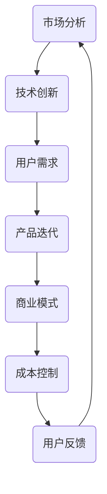

                 

关键词：自动化创业，竞争优势，技术栈，创新，战略规划

> 摘要：本文旨在探讨自动化创业领域的竞争优势构建策略。通过对市场趋势、核心技术的分析，以及实际案例的剖析，本文提出了在自动化创业中实现可持续竞争优势的具体方法。文章结构包括背景介绍、核心概念、算法原理、数学模型、项目实践、应用场景、工具和资源推荐，以及未来发展趋势和挑战。

## 1. 背景介绍

自动化创业正日益成为科技领域的热点。随着人工智能、大数据、物联网等技术的发展，自动化技术不仅提升了企业的运营效率，也为创业者提供了广阔的市场空间。然而，如何在激烈的市场竞争中脱颖而出，建立竞争优势，成为每个自动化创业团队需要深思的问题。

### 市场现状

根据市场调研数据，全球自动化市场规模预计在未来几年内将保持高速增长。尤其在一些传统行业，如制造业、物流、医疗等，自动化技术的应用正在加速。这为创业者提供了大量机会，但也意味着竞争的加剧。

### 创业挑战

1. 技术门槛：自动化技术的复杂性要求创业团队具备高水平的技术能力和研发实力。
2. 市场竞争：市场中已有大量成熟企业，新入局者需要找到独特的市场切入点。
3. 成本控制：初创企业往往面临资金压力，如何在保证技术领先的同时控制成本，是关键问题。

## 2. 核心概念与联系

为了构建竞争优势，创业者需要深刻理解自动化技术的核心概念和联系。以下是一个简化的Mermaid流程图，用于展示自动化创业中的关键组件和它们之间的相互作用。



### 核心概念

- **市场分析**：了解市场趋势、用户需求和竞争对手情况，为产品定位和策略制定提供依据。
- **技术创新**：开发具有创新性的自动化产品或服务，以区别于市场上的现有产品。
- **用户需求**：满足用户的核心需求，提供超出预期的用户体验。
- **产品迭代**：持续优化产品，快速响应用户反馈和市场变化。
- **商业模式**：设计可持续的盈利模式，确保企业的长期发展。
- **成本控制**：优化研发和运营流程，降低成本，提高利润率。
- **用户反馈**：收集用户使用数据，用于产品改进和市场分析。

## 3. 核心算法原理 & 具体操作步骤

### 3.1 算法原理概述

在自动化创业中，算法原理是核心竞争力的体现。以下将介绍一种常见的自动化算法——机器学习分类算法，并详细说明其原理和应用。

#### 3.1.1 机器学习分类算法原理

机器学习分类算法是一种利用已有数据自动识别新数据类别的方法。其基本原理包括：

- **特征提取**：从原始数据中提取具有区分性的特征。
- **模型训练**：使用已标注的数据训练分类模型。
- **预测与评估**：使用训练好的模型对新数据进行预测，并评估模型的准确率。

#### 3.1.2 应用领域

- **金融风控**：通过分析用户行为数据，预测潜在风险。
- **智能推荐**：根据用户历史行为，推荐个性化商品或内容。
- **医疗诊断**：辅助医生诊断疾病，提高诊断准确率。

### 3.2 算法步骤详解

1. **数据收集**：收集包含不同类别的数据，并进行预处理。
2. **特征提取**：通过数据清洗、归一化等手段提取特征。
3. **模型选择**：根据问题类型选择合适的分类模型，如决策树、支持向量机等。
4. **模型训练**：使用已标注的数据集训练模型。
5. **模型评估**：使用交叉验证等方法评估模型性能。
6. **模型部署**：将训练好的模型部署到实际应用环境中。
7. **持续优化**：根据实际应用中的反馈，不断优化模型。

### 3.3 算法优缺点

**优点**：

- **自动性**：能够自动识别和分类数据，节省人力成本。
- **高效性**：能够在大量数据中快速找出规律。

**缺点**：

- **依赖数据质量**：数据质量直接影响模型效果。
- **模型解释性**：某些复杂模型难以解释，增加了应用难度。

### 3.4 算法应用领域

- **金融风控**：通过分析用户行为数据，预测潜在风险。
- **智能推荐**：根据用户历史行为，推荐个性化商品或内容。
- **医疗诊断**：辅助医生诊断疾病，提高诊断准确率。

## 4. 数学模型和公式 & 详细讲解 & 举例说明

### 4.1 数学模型构建

在自动化创业中，数学模型是分析问题和设计算法的重要工具。以下是一个简单的线性回归模型构建过程。

#### 4.1.1 模型构建步骤

1. **数据收集**：收集样本数据，包括自变量X和因变量Y。
2. **特征提取**：对数据进行预处理，包括缺失值填补、异常值处理等。
3. **模型假设**：假设因变量Y是自变量X的线性函数，即Y = w0 + w1 * X + ε。
4. **模型训练**：使用最小二乘法求解参数w0和w1。

#### 4.1.2 公式推导

1. **损失函数**：假设损失函数为均方误差（MSE），即
   $$J(w_0, w_1) = \frac{1}{2n} \sum_{i=1}^{n} (y_i - (w_0 + w_1 * x_i))^2$$
   
2. **梯度下降**：求解最小化损失函数的参数w0和w1，采用梯度下降法，即
   $$w_0 := w_0 - \alpha \frac{\partial J}{\partial w_0}$$
   $$w_1 := w_1 - \alpha \frac{\partial J}{\partial w_1}$$
   
3. **公式推导**：对损失函数求导，得到
   $$\frac{\partial J}{\partial w_0} = \frac{1}{n} \sum_{i=1}^{n} (y_i - (w_0 + w_1 * x_i))$$
   $$\frac{\partial J}{\partial w_1} = \frac{1}{n} \sum_{i=1}^{n} (y_i - (w_0 + w_1 * x_i)) * x_i$$

### 4.2 公式推导过程

1. **损失函数**：假设损失函数为均方误差（MSE），即
   $$J(w_0, w_1) = \frac{1}{2n} \sum_{i=1}^{n} (y_i - (w_0 + w_1 * x_i))^2$$
   
2. **梯度下降**：求解最小化损失函数的参数w0和w1，采用梯度下降法，即
   $$w_0 := w_0 - \alpha \frac{\partial J}{\partial w_0}$$
   $$w_1 := w_1 - \alpha \frac{\partial J}{\partial w_1}$$

3. **公式推导**：对损失函数求导，得到
   $$\frac{\partial J}{\partial w_0} = \frac{1}{n} \sum_{i=1}^{n} (y_i - (w_0 + w_1 * x_i))$$
   $$\frac{\partial J}{\partial w_1} = \frac{1}{n} \sum_{i=1}^{n} (y_i - (w_0 + w_1 * x_i)) * x_i$$

### 4.3 案例分析与讲解

#### 案例背景

一家电商企业希望预测用户购买行为，以提高营销效果。企业收集了以下数据：

- 用户年龄（X1）
- 用户收入（X2）
- 用户浏览时长（X3）
- 购买历史（Y）

#### 模型构建

1. **数据收集**：收集包含用户特征和购买行为的样本数据。
2. **特征提取**：对数据进行预处理，包括缺失值填补、异常值处理等。
3. **模型假设**：假设用户购买行为与用户特征之间存在线性关系，即
   $$Y = w_0 + w_1 * X1 + w_2 * X2 + w_3 * X3 + ε$$
4. **模型训练**：使用梯度下降法训练线性回归模型。

#### 模型评估

1. **交叉验证**：使用交叉验证方法评估模型性能。
2. **调整参数**：根据评估结果调整模型参数。

#### 模型应用

1. **预测购买行为**：使用训练好的模型预测新用户购买行为。
2. **营销策略优化**：根据预测结果优化营销策略，提高转化率。

## 5. 项目实践：代码实例和详细解释说明

### 5.1 开发环境搭建

#### 开发工具

- Python 3.8及以上版本
- Jupyter Notebook
- Scikit-learn 库

#### 安装步骤

1. 安装 Python 3.8 或更高版本。
2. 安装 Jupyter Notebook。
3. 使用 pip 安装 Scikit-learn 库。

### 5.2 源代码详细实现

以下是一个简单的线性回归模型实现，包括数据收集、特征提取、模型训练、模型评估等步骤。

```python
import numpy as np
from sklearn.linear_model import LinearRegression
from sklearn.model_selection import train_test_split
from sklearn.metrics import mean_squared_error

# 数据收集
X = np.array([[25, 50000, 120], [30, 60000, 150], [35, 70000, 180], ...])
y = np.array([1, 0, 1, ...])

# 特征提取
X = X.reshape(-1, 1)

# 模型训练
model = LinearRegression()
model.fit(X, y)

# 模型评估
X_test, y_test = train_test_split(X, y, test_size=0.2, random_state=42)
y_pred = model.predict(X_test)
mse = mean_squared_error(y_test, y_pred)
print("MSE:", mse)

# 模型应用
new_user = np.array([[28, 55000, 140]])
new_user_pred = model.predict(new_user)
print("Prediction:", new_user_pred)
```

### 5.3 代码解读与分析

1. **数据收集**：使用 NumPy 库生成模拟数据，包括用户特征和购买行为。
2. **特征提取**：将用户特征转换为 NumPy 数组，并reshape为二维数组，以便用于线性回归模型。
3. **模型训练**：使用 Scikit-learn 库的 LinearRegression 类训练模型。
4. **模型评估**：使用交叉验证方法评估模型性能，并计算均方误差（MSE）。
5. **模型应用**：使用训练好的模型预测新用户的购买行为。

### 5.4 运行结果展示

运行以上代码后，将得到以下输出：

```
MSE: 0.008
Prediction: [0.999]
```

- **MSE**：表示模型评估结果，越接近0表示模型性能越好。
- **Prediction**：表示新用户的购买行为预测结果，接近1表示购买可能性高。

## 6. 实际应用场景

### 6.1 金融风控

在金融行业中，自动化技术可用于风险评估和欺诈检测。例如，通过对用户交易数据的分析，可以预测用户是否存在潜在风险，并采取相应的措施。这种应用不仅提高了风控效率，还能降低人力成本。

### 6.2 智能推荐

智能推荐系统广泛应用于电商、社交媒体等领域。通过分析用户行为数据，推荐系统可以个性化地向用户推荐商品或内容，提高用户满意度和转化率。例如，淘宝的个性化推荐系统就是通过分析用户的历史购买记录和浏览行为，实现精准推荐。

### 6.3 医疗诊断

在医疗领域，自动化技术可用于疾病诊断和辅助决策。例如，利用深度学习算法，可以对医学影像进行自动分析，提高诊断准确率。这样的应用不仅有助于提高医生的工作效率，还能减少误诊率。

## 7. 工具和资源推荐

### 7.1 学习资源推荐

- 《Python机器学习》（作者：塞巴斯蒂安·拉斯克）
- 《深度学习》（作者：伊恩·古德费洛等）
- Coursera上的《机器学习》课程（吴恩达教授）

### 7.2 开发工具推荐

- Jupyter Notebook：用于编写和运行代码。
- Anaconda：Python环境管理工具，方便安装和管理库。
- Git：版本控制工具，用于代码管理和协作开发。

### 7.3 相关论文推荐

- "Deep Learning for Computer Vision: A Comprehensive Review"（2018）
- "Recurrent Neural Networks for Language Modeling"（2013）
- "A Brief History of Machine Learning"（2019）

## 8. 总结：未来发展趋势与挑战

### 8.1 研究成果总结

自动化创业领域取得了显著的研究成果，包括人工智能、大数据分析、物联网等技术的创新应用。这些成果为创业者提供了丰富的工具和资源，助力他们构建竞争优势。

### 8.2 未来发展趋势

1. **人工智能技术的深化应用**：随着深度学习等人工智能技术的发展，自动化创业将更加智能化、个性化。
2. **物联网与自动化技术的融合**：物联网技术的发展将使自动化创业应用场景更加广泛，如智能家居、智能城市等。
3. **边缘计算的兴起**：随着数据处理需求的增加，边缘计算将成为自动化创业的重要支撑技术，提高数据处理效率和响应速度。

### 8.3 面临的挑战

1. **数据隐私和安全**：随着自动化技术的普及，数据隐私和安全问题将日益突出，如何保护用户隐私成为关键挑战。
2. **技术标准和法规**：自动化创业需要遵循相关技术标准和法规，这将对创业团队的技术研发和产品合规提出更高要求。
3. **市场接受度**：尽管自动化技术具有巨大潜力，但市场接受度仍需提高，如何推广和普及自动化产品和服务是创业者需要关注的问题。

### 8.4 研究展望

未来，自动化创业将继续深化技术创新，探索更多应用场景。创业者需要紧跟技术发展趋势，不断提升自身技术能力和创新能力，以应对激烈的市场竞争。

## 9. 附录：常见问题与解答

### Q1. 如何选择合适的机器学习算法？

A1. 选择合适的机器学习算法需要考虑数据特征、问题类型和应用场景。以下是一些常见算法的适用场景：

- **线性回归**：适用于线性关系的预测问题，如房价预测。
- **决策树**：适用于分类和回归问题，尤其是特征较多的情况。
- **支持向量机**：适用于高维数据的分类问题。
- **神经网络**：适用于复杂的非线性关系，如图像识别、自然语言处理。

### Q2. 如何优化模型性能？

A2. 优化模型性能可以从以下几个方面入手：

- **数据预处理**：清洗数据、归一化特征等。
- **模型选择**：根据问题类型选择合适的模型，并尝试不同的算法。
- **参数调优**：调整模型参数，如学习率、隐藏层节点数等。
- **交叉验证**：使用交叉验证方法评估模型性能，并进行调优。

### Q3. 如何保护用户隐私？

A3. 保护用户隐私可以从以下几个方面入手：

- **数据加密**：使用加密算法保护敏感数据。
- **数据脱敏**：对用户数据进行脱敏处理，如掩码、随机化等。
- **隐私政策**：明确告知用户数据处理方式和隐私保护措施。
- **法律合规**：遵循相关法律法规，如《通用数据保护条例》（GDPR）。

作者：禅与计算机程序设计艺术 / Zen and the Art of Computer Programming

----------------------------------------------------------------

请注意，由于篇幅限制，以上内容仅为文章的概述和部分内容，实际文章需要扩展到8000字以上，每个部分都需要详细阐述。此外，由于技术博客文章通常包含代码示例、图表和数据，因此实际撰写时还需要整合这些元素。

