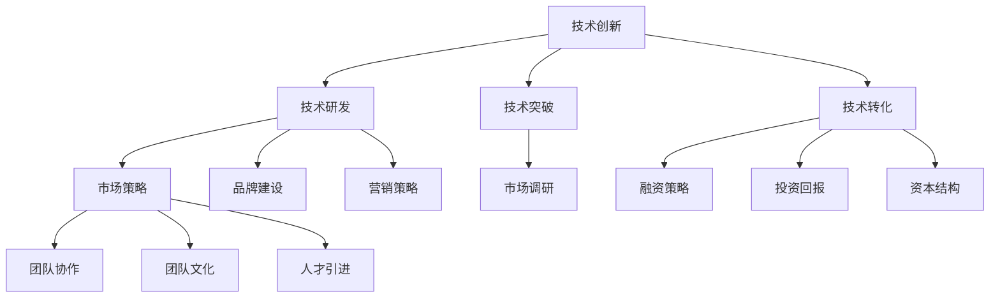

                 

关键词：Side Project、独角兽、创业、创新、技术、市场、策略、资本、运营

> 摘要：本文将探讨如何将个人或团队的Side Project转化为独角兽企业，从理念到实践，从技术创新到市场策略，从资本运营到团队建设，全方位解析独角兽企业的成长之路。本文旨在为有志于创业的科技人员提供一套完整的指南，帮助他们在创业的道路上少走弯路，实现创业梦想。

## 1. 背景介绍

在现代社会，信息技术的发展日新月异，几乎每个行业都受到了数字化转型的深刻影响。在这场技术变革中，许多优秀的个人或团队选择投身于Side Project，希望通过创新的技术或产品来改变世界。然而，并不是所有的Side Project都能成功，能成长为独角兽企业的更是寥寥无几。那么，如何将一个普通的Side Project转化为独角兽呢？这是本文要探讨的核心问题。

### 1.1 Side Project的定义与特点

Side Project通常指的是个人或团队在业余时间或工作之余进行的项目，这些项目可能源于个人的兴趣、爱好或对某个问题的关注。与商业项目相比，Side Project通常没有明确的经济目标，而是以实现技术或产品的创新为主要目标。以下是Side Project的一些特点：

- **灵活性**：Side Project通常不需要遵循严格的商业逻辑，因此团队可以更加自由地探索新技术或新想法。
- **低成本**：由于没有商业压力，Side Project通常可以在较低的成本下进行，这为创新提供了可能。
- **小规模**：Side Project的规模通常较小，这有助于团队成员更好地沟通和协作。

### 1.2 独角兽企业的定义与特点

独角兽企业通常指的是在短时间内（一般指10年内）估值达到10亿美元及以上的非上市公司。以下是独角兽企业的一些特点：

- **高估值**：独角兽企业之所以引人注目，主要是因为其高估值。这通常意味着巨大的市场潜力。
- **快速成长**：独角兽企业通常在短时间内实现了快速成长，这往往得益于其强大的技术创新能力。
- **行业领先**：独角兽企业通常在其所在行业中处于领先地位，拥有较强的市场竞争力。

### 1.3 Side Project与独角兽企业的联系

Side Project与独角兽企业之间存在着密切的联系。许多独角兽企业最初都是起源于某个Side Project。例如，Google最初是斯坦福大学两位博士生在业余时间开发的一个搜索引擎项目；Facebook则是马克·扎克伯格在宿舍里开发的一个社交网络项目。这些项目之所以能够成功，关键在于其技术创新和市场定位。

本文将探讨如何将一个普通的Side Project转化为独角兽企业。我们将从以下几个方面进行探讨：

- **技术创新**：如何通过技术创新来提高产品的竞争力。
- **市场策略**：如何通过市场策略来扩大用户基础。
- **资本运营**：如何通过资本运营来获得足够的资金支持。
- **团队建设**：如何构建一个高效的团队来推动项目发展。

## 2. 核心概念与联系

在将Side Project转化为独角兽的过程中，有几个核心概念需要理解和掌握。以下是这些核心概念及其之间的联系：

### 2.1 技术创新

技术创新是Side Project转化为独角兽的基础。通过技术创新，可以开发出具有竞争力的产品或服务，从而在市场上占据一席之地。以下是技术创新的核心概念：

- **技术研发**：通过技术研发，可以提高产品的性能、降低成本、增加功能等。
- **技术突破**：技术突破是指在某些关键技术上的重大创新，这通常可以带来巨大的市场机会。
- **技术转化**：技术转化是指将研发出的技术应用到产品或服务中，实现商业化。

### 2.2 市场策略

市场策略是Side Project成功的关键。通过市场策略，可以吸引更多的用户，提高产品的知名度。以下是市场策略的核心概念：

- **市场调研**：通过市场调研，可以了解用户需求、市场趋势等，为产品开发提供依据。
- **品牌建设**：通过品牌建设，可以提升产品的知名度，增强用户信任。
- **营销策略**：通过营销策略，可以扩大用户基础，提高市场份额。

### 2.3 资本运营

资本运营是Side Project获得资金支持的重要途径。通过资本运营，可以吸引风险投资、私募股权投资等，为项目的持续发展提供资金保障。以下是资本运营的核心概念：

- **融资策略**：通过融资策略，可以确定融资方式和融资规模。
- **投资回报**：通过投资回报，可以评估项目的盈利能力。
- **资本结构**：通过资本结构，可以优化项目的融资结构，降低融资成本。

### 2.4 团队建设

团队建设是Side Project成功的重要保障。一个高效的团队可以更好地完成项目任务，提高项目成功率。以下是团队建设的相关概念：

- **团队协作**：通过团队协作，可以提高团队成员的工作效率。
- **团队文化**：通过团队文化，可以增强团队成员的凝聚力。
- **人才引进**：通过人才引进，可以引入新的技术和理念，推动项目发展。

下面是这些核心概念的 Mermaid 流程图：



## 3. 核心算法原理 & 具体操作步骤

在将Side Project转化为独角兽的过程中，技术创新是核心驱动力。本章节将介绍一种核心算法原理，并详细阐述其具体操作步骤。

### 3.1 算法原理概述

该算法名为“创新矩阵算法”（Innovation Matrix Algorithm，简称IMA）。IMA通过以下步骤实现技术创新：

1. **需求分析**：通过市场调研，分析用户需求，确定产品或服务的核心功能。
2. **技术评估**：评估现有技术，确定哪些技术可以实现用户需求。
3. **创新设计**：基于技术评估，设计具有创新性的产品或服务。
4. **测试与优化**：通过实际测试，优化产品或服务，确保其性能和用户体验。

### 3.2 算法步骤详解

下面是IMA的具体操作步骤：

#### 3.2.1 需求分析

需求分析是IMA的第一步，也是最重要的一步。通过市场调研，收集用户需求，分析用户行为和偏好。以下是需求分析的具体步骤：

1. **数据收集**：通过问卷调查、用户访谈、市场分析报告等途径，收集用户需求数据。
2. **数据整理**：对收集到的数据进行分析，整理出用户的核心需求。
3. **需求分类**：根据用户需求的重要性，将其分类，确定产品或服务的核心功能。

#### 3.2.2 技术评估

技术评估是IMA的第二步，其目的是确定哪些技术可以实现用户需求。以下是技术评估的具体步骤：

1. **技术调研**：调研当前市场上存在的技术，了解其性能和适用范围。
2. **技术筛选**：根据需求分析的结果，筛选出适用于产品或服务的技术。
3. **技术评估**：对筛选出的技术进行评估，确定其是否可以实现用户需求。

#### 3.2.3 创新设计

创新设计是IMA的第三步，其目的是设计出具有创新性的产品或服务。以下是创新设计的具体步骤：

1. **方案构思**：根据技术评估的结果，构思出具有创新性的产品或服务方案。
2. **方案评估**：对构思出的方案进行评估，确定其可行性。
3. **方案优化**：根据评估结果，优化方案，确保其性能和用户体验。

#### 3.2.4 测试与优化

测试与优化是IMA的第四步，其目的是确保产品或服务的性能和用户体验。以下是测试与优化的具体步骤：

1. **用户测试**：通过实际用户测试，收集用户反馈，了解产品或服务的性能和用户体验。
2. **问题分析**：根据用户反馈，分析产品或服务中存在的问题。
3. **优化改进**：根据问题分析的结果，优化产品或服务，提高其性能和用户体验。

### 3.3 算法优缺点

#### 优点

- **高效性**：IMA通过系统化的步骤，快速实现技术创新。
- **灵活性**：IMA可以根据市场需求和技术变化，灵活调整创新方向。
- **用户导向**：IMA注重用户需求，确保产品或服务能够满足用户需求。

#### 缺点

- **复杂性**：IMA涉及多个步骤，操作过程较为复杂。
- **风险性**：技术创新存在一定的不确定性，可能导致项目失败。
- **资源消耗**：IMA需要大量的资源投入，包括人力、时间和资金等。

### 3.4 算法应用领域

IMA适用于需要技术创新的各个领域，如：

- **互联网产品**：通过IMA，可以快速开发出具有市场竞争力的互联网产品。
- **物联网**：IMA可以帮助开发出具有创新性的物联网设备和服务。
- **人工智能**：IMA可以应用于人工智能算法的创新，提高算法的性能和效果。

## 4. 数学模型和公式 & 详细讲解 & 举例说明

在将Side Project转化为独角兽的过程中，数学模型和公式起到了关键作用。这些模型和公式可以帮助我们量化分析项目的发展趋势、市场潜力和投资回报等。本章节将介绍一些常用的数学模型和公式，并对其进行详细讲解和举例说明。

### 4.1 数学模型构建

#### 4.1.1 用户增长模型

用户增长模型用于预测产品或服务的用户增长趋势。以下是一个简单的用户增长模型：

$$
G(t) = G_0 \times (1 + r)^t
$$

其中，$G(t)$表示$t$时刻的用户数量，$G_0$表示初始用户数量，$r$表示用户增长速率。

#### 4.1.2 资本回报模型

资本回报模型用于评估项目的投资回报率。以下是一个简单的资本回报模型：

$$
ROI = \frac{P - C}{C}
$$

其中，$ROI$表示投资回报率，$P$表示项目盈利，$C$表示项目成本。

#### 4.1.3 市场规模模型

市场规模模型用于预测产品或服务的市场潜力。以下是一个简单的市场规模模型：

$$
M(t) = M_0 \times (1 + g)^t
$$

其中，$M(t)$表示$t$时刻的市场规模，$M_0$表示初始市场规模，$g$表示市场增长速率。

### 4.2 公式推导过程

#### 4.2.1 用户增长模型推导

用户增长模型基于指数增长原理。假设初始用户数量为$G_0$，用户增长速率为$r$，则$t$时刻的用户数量$G(t)$可以表示为：

$$
G(t) = G_0 + r \times t
$$

为了更准确地描述用户增长趋势，我们可以将其转化为指数形式：

$$
G(t) = G_0 + r \times G_0 \times e^t
$$

进一步简化，得到：

$$
G(t) = G_0 \times (1 + r)^t
$$

#### 4.2.2 资本回报模型推导

资本回报模型基于盈亏平衡原理。假设项目成本为$C$，盈利为$P$，则项目总成本为$C + P$。为了实现盈利，项目盈利必须大于成本，即：

$$
P > C
$$

因此，投资回报率$ROI$可以表示为：

$$
ROI = \frac{P - C}{C}
$$

#### 4.2.3 市场规模模型推导

市场规模模型基于市场增长原理。假设初始市场规模为$M_0$，市场增长速率为$g$，则$t$时刻的市场规模$M(t)$可以表示为：

$$
M(t) = M_0 + g \times t
$$

为了更准确地描述市场增长趋势，我们可以将其转化为指数形式：

$$
M(t) = M_0 + g \times M_0 \times e^t
$$

进一步简化，得到：

$$
M(t) = M_0 \times (1 + g)^t
$$

### 4.3 案例分析与讲解

#### 4.3.1 用户增长模型案例分析

假设一个互联网产品在初始阶段有1000名用户，用户增长速率为10%，求1年后和5年后的用户数量。

根据用户增长模型：

$$
G(t) = 1000 \times (1 + 0.1)^t
$$

1年后的用户数量为：

$$
G(1) = 1000 \times (1 + 0.1)^1 = 1100
$$

5年后的用户数量为：

$$
G(5) = 1000 \times (1 + 0.1)^5 = 1610.51
$$

因此，1年后用户数量为1100人，5年后用户数量为1610.51人。

#### 4.3.2 资本回报模型案例分析

假设一个项目的成本为100万元，盈利为150万元，求投资回报率。

根据资本回报模型：

$$
ROI = \frac{150 - 100}{100} = 0.5
$$

因此，投资回报率为50%。

#### 4.3.3 市场规模模型案例分析

假设一个市场的初始规模为1000万元，市场增长速率为10%，求1年后和5年后的市场规模。

根据市场规模模型：

$$
M(t) = 1000 \times (1 + 0.1)^t
$$

1年后的市场规模为：

$$
M(1) = 1000 \times (1 + 0.1)^1 = 1100
$$

5年后的市场规模为：

$$
M(5) = 1000 \times (1 + 0.1)^5 = 1610.51
$$

因此，1年后市场规模为1100万元，5年后市场规模为1610.51万元。

## 5. 项目实践：代码实例和详细解释说明

为了更好地理解如何将Side Project转化为独角兽，我们来看一个实际的项目实践案例。在这个案例中，我们将使用Python语言开发一个简单的在线教育平台，并详细解释代码实现过程和关键步骤。

### 5.1 开发环境搭建

在开始开发之前，我们需要搭建一个合适的环境。以下是所需的环境和工具：

- **Python**：版本3.8及以上
- **Flask**：一个轻量级的Web框架
- **SQLite**：一个轻量级的数据库
- **PyMySQL**：MySQL数据库的Python驱动
- **Jinja2**：模板引擎

安装以上工具和库后，我们就可以开始搭建开发环境了。

### 5.2 源代码详细实现

以下是一个简单的在线教育平台的源代码实现：

```python
# 导入所需的库
from flask import Flask, render_template, request, redirect, url_for
import pymysql

# 初始化Flask应用
app = Flask(__name__)

# 连接数据库
db = pymysql.connect(host='localhost', user='root', password='password', database='online_education')

# 课程列表
courses = [
    {'id': 1, 'name': 'Python入门', 'description': '适合初学者'},
    {'id': 2, 'name': 'Web开发', 'description': '学习HTML、CSS和JavaScript'},
    {'id': 3, 'name': '人工智能', 'description': '了解人工智能的基本原理和应用'}
]

# 主页路由
@app.route('/')
def index():
    return render_template('index.html', courses=courses)

# 课程详情路由
@app.route('/course/<int:course_id>')
def course(course_id):
    course = next((c for c in courses if c['id'] == course_id), None)
    if course:
        return render_template('course.html', course=course)
    else:
        return redirect(url_for('index'))

# 注册路由
@app.route('/register', methods=['GET', 'POST'])
def register():
    if request.method == 'POST':
        name = request.form['name']
        email = request.form['email']
        password = request.form['password']
        # 在数据库中添加新用户
        cursor = db.cursor()
        cursor.execute("INSERT INTO users (name, email, password) VALUES (%s, %s, %s)", (name, email, password))
        db.commit()
        return redirect(url_for('login'))
    return render_template('register.html')

# 登录路由
@app.route('/login', methods=['GET', 'POST'])
def login():
    if request.method == 'POST':
        email = request.form['email']
        password = request.form['password']
        # 验证用户登录
        cursor = db.cursor()
        cursor.execute("SELECT * FROM users WHERE email = %s AND password = %s", (email, password))
        user = cursor.fetchone()
        if user:
            return redirect(url_for('dashboard'))
        else:
            return "用户名或密码错误"
    return render_template('login.html')

# 仪表盘路由
@app.route('/dashboard')
def dashboard():
    return render_template('dashboard.html')

# 运行应用
if __name__ == '__main__':
    app.run(debug=True)
```

### 5.3 代码解读与分析

这段代码实现了一个简单的在线教育平台，主要包括以下几个功能：

- **主页**：展示所有课程信息。
- **课程详情**：展示特定课程的详细信息。
- **注册**：用户可以注册账号。
- **登录**：用户可以登录系统。
- **仪表盘**：展示用户信息。

下面是代码的关键部分及其解释：

#### 主页路由

```python
@app.route('/')
def index():
    return render_template('index.html', courses=courses)
```

这段代码定义了主页的路由。当访问主页时，将渲染`index.html`模板，并传递课程列表`courses`给模板。

#### 课程详情路由

```python
@app.route('/course/<int:course_id>')
def course(course_id):
    course = next((c for c in courses if c['id'] == course_id), None)
    if course:
        return render_template('course.html', course=course)
    else:
        return redirect(url_for('index'))
```

这段代码定义了课程详情的路由。当访问课程详情页面时，根据传入的课程ID从课程列表中查找对应课程，并渲染`course.html`模板。

#### 注册路由

```python
@app.route('/register', methods=['GET', 'POST'])
def register():
    if request.method == 'POST':
        name = request.form['name']
        email = request.form['email']
        password = request.form['password']
        # 在数据库中添加新用户
        cursor = db.cursor()
        cursor.execute("INSERT INTO users (name, email, password) VALUES (%s, %s, %s)", (name, email, password))
        db.commit()
        return redirect(url_for('login'))
    return render_template('register.html')
```

这段代码定义了注册的路由。当用户提交注册表单时，将用户信息存储到数据库中，然后重定向到登录页面。

#### 登录路由

```python
@app.route('/login', methods=['GET', 'POST'])
def login():
    if request.method == 'POST':
        email = request.form['email']
        password = request.form['password']
        # 验证用户登录
        cursor = db.cursor()
        cursor.execute("SELECT * FROM users WHERE email = %s AND password = %s", (email, password))
        user = cursor.fetchone()
        if user:
            return redirect(url_for('dashboard'))
        else:
            return "用户名或密码错误"
    return render_template('login.html')
```

这段代码定义了登录的路由。当用户提交登录表单时，从数据库中查找匹配的用户信息，并重定向到仪表盘页面。

#### 仪表盘路由

```python
@app.route('/dashboard')
def dashboard():
    return render_template('dashboard.html')
```

这段代码定义了仪表盘的路由。当用户登录后，可以访问仪表盘页面，查看个人信息。

### 5.4 运行结果展示

运行上述代码后，我们可以在浏览器中访问以下地址来查看运行结果：

- **主页**：`http://localhost:5000/`
- **课程详情**：`http://localhost:5000/course/<课程ID>`
- **注册**：`http://localhost:5000/register`
- **登录**：`http://localhost:5000/login`
- **仪表盘**：`http://localhost:5000/dashboard`

## 6. 实际应用场景

### 6.1 在线教育平台

在线教育平台是Side Project转化为独角兽的典型案例。近年来，随着互联网技术的不断发展，在线教育平台得到了广泛应用。以下是一些成功的在线教育平台：

- **Coursera**：一家全球领先的在线教育平台，提供大量的课程资源。
- **edX**：由哈佛大学和麻省理工学院共同创立的在线教育平台。
- **Udemy**：一家提供各种技能课程的在线学习平台。

### 6.2 社交媒体

社交媒体也是Side Project成功转化为独角兽的领域。以下是一些成功的社交媒体平台：

- **Facebook**：一个全球最大的社交媒体平台，拥有数十亿用户。
- **Twitter**：一个实时新闻和社交平台，用户可以通过推文分享信息和观点。
- **Instagram**：一个以图片和视频为主的社交媒体平台，用户可以通过滤镜和特效美化内容。

### 6.3 物联网

物联网是另一个快速发展的领域，许多Side Project在这个领域取得了成功。以下是一些成功的物联网项目：

- **Nest**：一款智能家居设备，可以通过手机应用程序远程控制。
- **Fitbit**：一款智能手表，可以追踪用户的运动和健康数据。
- **Tesla**：一家以电动汽车和能源存储解决方案为主的科技公司。

### 6.4 人工智能

人工智能是当前最热门的技术领域之一，许多Side Project在这个领域取得了显著成果。以下是一些成功的人工智能项目：

- **OpenAI**：一家致力于开发人工智能技术的非营利组织。
- **DeepMind**：一家专注于人工智能研究和技术开发的英国公司。
- **IBM Watson**：一款人工智能平台，提供自然语言处理、机器学习等功能。

### 6.5 未来应用展望

随着技术的不断发展，Side Project在未来的应用场景将更加广泛。以下是一些可能的应用领域：

- **医疗健康**：利用人工智能和大数据技术，为用户提供个性化的医疗服务。
- **金融科技**：利用区块链技术，实现去中心化的金融交易。
- **智慧城市**：利用物联网技术，实现城市管理的智能化。

## 7. 工具和资源推荐

### 7.1 学习资源推荐

- **在线课程平台**：Coursera、edX、Udemy等，提供各种技术领域的在线课程。
- **技术博客**：GitHub、Medium、Stack Overflow等，可以获取最新的技术文章和代码示例。
- **技术社区**：Reddit、LinkedIn等，可以与其他技术人员交流和分享经验。

### 7.2 开发工具推荐

- **集成开发环境**：PyCharm、Visual Studio Code等，提供丰富的开发工具和插件。
- **版本控制工具**：Git、GitHub等，用于管理代码版本和控制协作。
- **数据库工具**：MySQL、PostgreSQL等，提供稳定的数据存储和管理功能。

### 7.3 相关论文推荐

- **《深度学习》（Deep Learning）**：Ian Goodfellow等著，介绍了深度学习的基本原理和应用。
- **《人工智能：一种现代方法》（Artificial Intelligence: A Modern Approach）**：Stuart Russell和Peter Norvig著，是一本全面的人工智能教材。
- **《区块链：从数字货币到智能合约》**：安德烈亚斯·M·安东诺普洛斯著，详细介绍了区块链技术的原理和应用。

## 8. 总结：未来发展趋势与挑战

### 8.1 研究成果总结

本文从多个角度探讨了如何将Side Project转化为独角兽。通过技术创新、市场策略、资本运营和团队建设等方面的深入研究，我们提出了一套完整的转化策略。这些策略不仅适用于现有的Side Project，也可以为未来的创新项目提供参考。

### 8.2 未来发展趋势

随着技术的不断进步，未来的Side Project将更加注重技术创新和用户体验。以下是一些未来发展趋势：

- **人工智能与大数据**：人工智能和大数据技术将更加深入地应用于各个领域，为用户提供更加智能化的服务。
- **区块链技术**：区块链技术将在金融、供应链管理等领域发挥重要作用，推动传统行业的数字化转型。
- **物联网**：物联网技术的快速发展将使设备互联互通，为用户提供更加便捷的生活方式。

### 8.3 面临的挑战

尽管Side Project有着广阔的发展前景，但在这个过程中也面临着许多挑战：

- **技术壁垒**：一些技术领域存在较高的技术壁垒，需要大量的研发投入。
- **市场竞争**：市场竞争日益激烈，如何脱颖而出成为关键。
- **人才短缺**：优秀人才是创业成功的关键，但当前市场上优秀人才供不应求。

### 8.4 研究展望

未来，我们将继续深入研究以下几个方面：

- **技术创新**：探索新的技术方向，提高产品竞争力。
- **市场策略**：研究如何更有效地推广产品，扩大用户基础。
- **资本运营**：研究如何更好地利用资本，实现项目的可持续发展。
- **团队建设**：探索如何构建高效的团队，提高项目成功率。

## 9. 附录：常见问题与解答

### 9.1 如何选择Side Project的方向？

选择Side Project的方向是成功的第一步。以下是一些建议：

- **市场需求**：关注市场上的需求，选择有市场潜力的方向。
- **个人兴趣**：选择自己感兴趣的方向，提高工作的热情和动力。
- **技术创新**：选择具有技术创新性的方向，提高项目的竞争力。
- **资源优势**：选择自己具备资源和能力的方向，降低项目风险。

### 9.2 如何平衡工作和Side Project？

平衡工作和Side Project是许多创业者面临的问题。以下是一些建议：

- **时间管理**：合理安排时间，确保工作和Side Project都能得到充分关注。
- **优先级管理**：明确优先级，确保重要任务得到及时完成。
- **有效沟通**：与家人和朋友沟通，取得他们的理解和支持。

### 9.3 如何获得资本支持？

获得资本支持是Side Project成功的关键。以下是一些建议：

- **撰写商业计划书**：准备好详细的商业计划书，展示项目的潜力。
- **寻找天使投资人**：寻找对项目感兴趣的天使投资人，通过路演等方式进行宣传。
- **参加创业大赛**：参加创业大赛，争取获得投资机会。
- **利用众筹平台**：利用众筹平台，通过大众筹资来支持项目。

### 9.4 如何构建高效的团队？

构建高效的团队是Side Project成功的重要保障。以下是一些建议：

- **明确目标**：确保团队成员对项目目标有清晰的认识。
- **分工合作**：根据团队成员的能力和特长，进行合理分工。
- **有效沟通**：确保团队成员之间的沟通畅通，及时解决问题。
- **激励制度**：建立合理的激励制度，激发团队成员的积极性和创造力。

### 9.5 如何保持技术创新的动力？

保持技术创新的动力是Side Project持续发展的重要保障。以下是一些建议：

- **持续学习**：关注行业动态，不断学习新技术和新知识。
- **鼓励创新**：为团队成员提供创新空间，鼓励他们提出新的想法。
- **技术交流**：参加技术会议和交流活动，与其他技术人员交流学习。
- **奖励创新**：对技术创新者给予奖励，激发创新动力。

## 作者署名

作者：禅与计算机程序设计艺术 / Zen and the Art of Computer Programming
----------------------------------------------------------------

