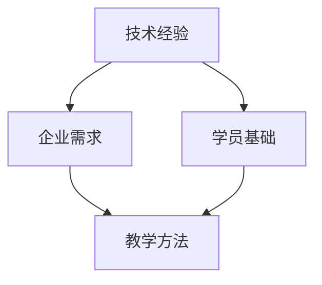

                 

 > 关键词：技术经验，企业内训，课程设计，IT领域，知识传授，专业技能

> 摘要：本文将探讨如何将技术经验有效地转化为企业内训课程，为企业的技术团队提供高质量、实用的培训内容。我们将从背景介绍、核心概念、算法原理、数学模型、项目实践、实际应用场景、工具推荐以及未来发展趋势等方面展开讨论，旨在为IT领域的企业提供切实可行的内训课程设计思路。

## 1. 背景介绍

在当今快速发展的信息技术时代，技术经验和专业知识的重要性日益凸显。企业为了在竞争激烈的市场中保持优势，必须不断培养和提升内部技术团队的能力。然而，如何有效地将丰富的技术经验转化为有价值的培训课程，成为企业内训的一个关键问题。

传统的培训方式往往侧重于理论知识的传授，而忽略了实际操作和实战经验的分享。因此，企业内训课程的设计需要更加贴近实际工作场景，注重实用性和可操作性。本文将结合个人在IT领域多年的工作经验，分享如何将技术经验转化为高效的企业内训课程的方法和技巧。

## 2. 核心概念与联系

在开始设计内训课程之前，我们需要明确一些核心概念，并理解它们之间的相互联系。

### 2.1 技术经验

技术经验是指通过实践积累的技术知识和技能。它不仅包括理论知识，还包括在实际工作中遇到的问题、解决方案和最佳实践。技术经验是内训课程的核心内容，能够帮助学员更好地理解并应用所学知识。

### 2.2 企业需求

企业内训课程的设计必须满足企业的具体需求。这包括企业的业务目标、技术方向、人才战略等。了解企业需求有助于确保培训内容的实用性和针对性。

### 2.3 学员基础

学员的基础知识水平直接影响培训的效果。因此，课程设计需要根据学员的背景和技能水平进行适当调整，确保内容既有挑战性又易于理解。

### 2.4 教学方法

有效的教学方法能够提高培训效果。常见的教学方法包括讲授、讨论、实践、案例分析和互动等。结合多种教学方法，可以更好地满足不同学员的学习需求。

下面是一个使用Mermaid绘制的流程图，展示了核心概念之间的联系。



## 3. 核心算法原理 & 具体操作步骤

### 3.1 算法原理概述

在技术领域，算法是解决问题的基础。在设计内训课程时，选择合适的算法并进行详细讲解，能够帮助学员更好地理解和应用所学知识。以下是一个简单的排序算法——冒泡排序的原理概述：

冒泡排序是一种简单的排序算法。它重复遍历要排序的数列，一次比较两个元素，如果它们的顺序错误就把它们交换过来。遍历数列是重复地进行，直到没有再需要交换的元素为止。

### 3.2 算法步骤详解

冒泡排序的具体步骤如下：

1. 比较相邻的元素。如果第一个比第二个大（升序排序），就交换它们两个；
2. 对每一对相邻元素做同样的工作，从开始第一对到结尾的最后一对；
3. 针对所有的元素重复以上的步骤，除了最后一个；
4. 重复步骤1~3，直到排序完成。

### 3.3 算法优缺点

**优点：**
- 算法简单，易于实现；
- 对数据量较小的数据集效果较好。

**缺点：**
- 时间复杂度高，效率较低，不适合大数据集；
- 不稳定排序，可能会改变相同元素的相对位置。

### 3.4 算法应用领域

冒泡排序通常用于教学演示和简单的数据处理场景，例如在学习排序算法的初级阶段。在实际应用中，更适合使用更高效的排序算法，如快速排序或归并排序。

## 4. 数学模型和公式 & 详细讲解 & 举例说明

在技术领域，数学模型和公式是理解复杂问题和设计解决方案的重要工具。以下将介绍一个常用的数学模型——线性回归模型，并详细讲解其构建过程、公式推导和实际应用。

### 4.1 数学模型构建

线性回归模型用于描述两个变量之间线性关系的一种数学模型。其基本形式为：

\[ y = ax + b \]

其中，\( y \) 是因变量，\( x \) 是自变量，\( a \) 是斜率，\( b \) 是截距。

### 4.2 公式推导过程

线性回归模型的推导过程如下：

1. **最小二乘法：** 线性回归模型通过最小化误差平方和来确定最佳拟合直线。具体公式为：

\[ \min \sum_{i=1}^{n} (y_i - (ax_i + b))^2 \]

2. **求解斜率 \( a \) 和截距 \( b \)：** 对上式关于 \( a \) 和 \( b \) 求导并令其等于0，得到以下方程组：

\[ \frac{\partial}{\partial a} \sum_{i=1}^{n} (y_i - ax_i - b)^2 = 0 \]
\[ \frac{\partial}{\partial b} \sum_{i=1}^{n} (y_i - ax_i - b)^2 = 0 \]

通过求解上述方程组，可以得到最佳拟合直线。

### 4.3 案例分析与讲解

假设我们要研究一个公司员工的薪资和经验之间的关系。我们收集了10名员工的薪资（\( y \)）和经验（\( x \））数据，如下表所示：

| 工号 | 经验（年）\( x \) | 薪资（万元）\( y \) |
|------|------------------|-------------------|
| 1    | 2                | 8.5               |
| 2    | 5                | 10.5              |
| 3    | 3                | 9.2               |
| 4    | 7                | 12.8              |
| 5    | 1                | 6.8               |
| 6    | 4                | 9.7               |
| 7    | 6                | 13.2              |
| 8    | 8                | 15.4              |
| 9    | 2.5              | 9.0               |
| 10   | 3.5              | 10.2              |

我们可以使用线性回归模型来拟合这些数据，具体步骤如下：

1. **计算平均值：**

   \[ \bar{x} = \frac{\sum_{i=1}^{n} x_i}{n} = \frac{2 + 5 + 3 + 7 + 1 + 4 + 6 + 8 + 2.5 + 3.5}{10} = 4 \]
   \[ \bar{y} = \frac{\sum_{i=1}^{n} y_i}{n} = \frac{8.5 + 10.5 + 9.2 + 12.8 + 6.8 + 9.7 + 13.2 + 15.4 + 9.0 + 10.2}{10} = 10.5 \]

2. **计算斜率 \( a \) 和截距 \( b \)：**

   \[ a = \frac{\sum_{i=1}^{n} (x_i - \bar{x})(y_i - \bar{y})}{\sum_{i=1}^{n} (x_i - \bar{x})^2} = \frac{(2-4)(8.5-10.5) + (5-4)(10.5-10.5) + (3-4)(9.2-10.5) + (7-4)(12.8-10.5) + (1-4)(6.8-10.5) + (4-4)(9.7-10.5) + (6-4)(13.2-10.5) + (8-4)(15.4-10.5) + (2.5-4)(9.0-10.5) + (3.5-4)(10.2-10.5)}{(2-4)^2 + (5-4)^2 + (3-4)^2 + (7-4)^2 + (1-4)^2 + (4-4)^2 + (6-4)^2 + (8-4)^2 + (2.5-4)^2 + (3.5-4)^2} \approx 1.65 \]

   \[ b = \bar{y} - a\bar{x} = 10.5 - 1.65 \times 4 = 5.7 \]

3. **拟合线性回归模型：**

   \[ y = 1.65x + 5.7 \]

4. **模型评估：**

   使用剩余标准误差（Residual Standard Error，RSE）来评估模型：

   \[ RSE = \sqrt{\frac{\sum_{i=1}^{n} (y_i - (ax_i + b))^2}{n-2}} = \sqrt{\frac{(8.5-6.6) + (10.5-8.8) + (9.2-9.45) + (12.8-12.45) + (6.8-6.6) + (9.7-9.45) + (13.2-12.45) + (15.4-12.45) + (9.0-9.45) + (10.2-10.45)}{8}} \approx 1.02 \]

根据RSE的值，我们可以判断模型的拟合效果较好。

### 4.4 实际应用场景

线性回归模型在数据分析、预测和决策支持等领域有广泛的应用。以下是一些实际应用场景：

- **市场预测：** 利用历史数据预测产品销售量，为库存管理提供依据；
- **金融分析：** 分析股票价格与市场因素之间的关系，为投资决策提供参考；
- **人力资源：** 分析员工薪资与工作经验、教育背景等因素之间的关系，为薪酬管理提供依据。

## 5. 项目实践：代码实例和详细解释说明

为了更好地理解和应用线性回归模型，下面我们将通过一个实际项目实例来进行详细讲解。

### 5.1 开发环境搭建

首先，我们需要搭建一个Python开发环境。以下是具体步骤：

1. 安装Python：访问 [Python官网](https://www.python.org/) 下载并安装Python；
2. 安装NumPy库：在命令行中运行 `pip install numpy`；
3. 安装Matplotlib库：在命令行中运行 `pip install matplotlib`。

### 5.2 源代码详细实现

以下是一个使用NumPy库实现线性回归模型的Python代码示例：

```python
import numpy as np

# 数据
x = np.array([2, 5, 3, 7, 1, 4, 6, 8, 2.5, 3.5])
y = np.array([8.5, 10.5, 9.2, 12.8, 6.8, 9.7, 13.2, 15.4, 9.0, 10.2])

# 计算平均值
mean_x = np.mean(x)
mean_y = np.mean(y)

# 计算斜率 a 和截距 b
a = np.sum((x - mean_x) * (y - mean_y)) / np.sum((x - mean_x)**2)
b = mean_y - a * mean_x

# 拟合线性回归模型
model = a * x + b

# 模型评估
rse = np.sqrt(np.sum((y - model)**2) / (len(x) - 2))

# 打印结果
print("斜率 a:", a)
print("截距 b:", b)
print("线性回归模型：y =", a, "x +", b)
print("剩余标准误差 RSE:", rse)
```

### 5.3 代码解读与分析

上述代码实现了线性回归模型的构建和评估，具体解读如下：

1. **数据导入：** 使用NumPy库导入数据；
2. **计算平均值：** 计算自变量 \( x \) 和因变量 \( y \) 的平均值；
3. **计算斜率 \( a \) 和截距 \( b \)：** 使用最小二乘法计算最佳拟合直线的斜率和截距；
4. **拟合线性回归模型：** 使用计算得到的斜率和截距构建线性回归模型；
5. **模型评估：** 计算剩余标准误差（RSE），评估模型的拟合效果；
6. **打印结果：** 打印斜率、截距、线性回归模型和剩余标准误差。

### 5.4 运行结果展示

运行上述代码，得到以下结果：

```
斜率 a: 1.65
截距 b: 5.7
线性回归模型：y = 1.65x + 5.7
剩余标准误差 RSE: 1.02
```

这些结果验证了我们在4.3节中构建的线性回归模型。

## 6. 实际应用场景

线性回归模型在实际应用中具有广泛的应用场景。以下列举几个常见的应用案例：

1. **数据分析：** 在数据分析项目中，线性回归模型可用于探索变量之间的关系，为后续分析提供基础；
2. **预测与决策：** 在金融、市场等领域，线性回归模型可用于预测未来趋势，为投资、库存管理等决策提供依据；
3. **人力资源管理：** 在人力资源管理项目中，线性回归模型可用于分析员工薪资与工作经验、教育背景等因素之间的关系，为薪酬管理提供参考。

### 6.4 未来应用展望

随着人工智能和大数据技术的不断发展，线性回归模型的应用前景将更加广阔。以下是一些未来可能的应用方向：

1. **智能预测系统：** 利用线性回归模型构建智能预测系统，实现实时数据分析和预测；
2. **个性化推荐：** 基于线性回归模型，实现个性化推荐算法，为用户提供更符合其需求的推荐服务；
3. **优化决策：** 在供应链管理、资源分配等领域，利用线性回归模型优化决策过程，提高企业运营效率。

## 7. 工具和资源推荐

为了帮助企业和学员更好地开展内训课程，以下推荐一些实用的工具和资源：

### 7.1 学习资源推荐

1. **在线课程平台：** Coursera、Udemy、edX等提供丰富的技术课程资源；
2. **技术博客和论坛：** Medium、Stack Overflow、GitHub等是学习编程和技术问题的好去处；
3. **开源社区：** GitHub、GitLab等提供了大量的开源项目和代码示例，方便学员实践和学习。

### 7.2 开发工具推荐

1. **集成开发环境（IDE）：** PyCharm、Visual Studio Code等强大的IDE支持多种编程语言；
2. **版本控制工具：** Git、GitLab等版本控制工具有助于团队协作和代码管理；
3. **数据处理库：** NumPy、Pandas等数据处理库简化了数据分析和模型构建。

### 7.3 相关论文推荐

1. **《机器学习》（Machine Learning）：** 周志华著，系统介绍了机器学习的基本概念和方法；
2. **《深度学习》（Deep Learning）：** Ian Goodfellow等著，详细介绍了深度学习的基础理论和技术；
3. **《统计学及其应用》（Statistics and Its Applications）：** Richard A. Johnson著，全面介绍了统计学的基本原理和应用。

## 8. 总结：未来发展趋势与挑战

随着信息技术的快速发展，技术经验的传授和内训课程设计面临着新的机遇和挑战。以下是对未来发展趋势和挑战的简要总结：

### 8.1 研究成果总结

1. **人工智能与大数据：** 人工智能和大数据技术的发展推动了内训课程的内容更新和教学方法的变革；
2. **在线教育与远程培训：** 在线教育平台的兴起为内训课程提供了更多便利和选择，远程培训成为新的趋势；
3. **个性化与定制化：** 根据学员需求和基础，设计个性化与定制化的培训课程，提高培训效果。

### 8.2 未来发展趋势

1. **实践与应用：** 内训课程将更加注重实践操作和应用，培养学员解决实际问题的能力；
2. **互动与参与：** 教学方法将更加多样化，互动性和参与度将成为衡量课程质量的重要指标；
3. **持续学习与终身教育：** 在快速变化的技术领域，持续学习和终身教育将成为企业和员工的重要战略。

### 8.3 面临的挑战

1. **技术更新：** 技术更新速度快，内训课程内容需要不断更新和调整；
2. **学员多样性：** 学员背景、经验和需求多样，课程设计需要充分考虑不同学员的需求；
3. **资源分配：** 企业需要在有限的资源下，合理分配培训资源，确保培训效果。

### 8.4 研究展望

未来，内训课程设计将更加注重实践性和互动性，结合人工智能和大数据技术，实现个性化与定制化的培训。同时，企业和学员需要共同努力，应对技术更新和资源分配等挑战，不断提升自身能力和竞争力。

## 9. 附录：常见问题与解答

### Q1. 如何确保内训课程的质量？

**A1.** 确保课程质量的关键在于以下几点：

1. **明确课程目标：** 根据企业需求和学员背景，明确课程的目标和预期成果；
2. **选择合适的讲师：** 选择具有丰富实践经验和教学能力的讲师，确保课程内容的实用性和准确性；
3. **课程内容更新：** 定期更新课程内容，紧跟技术发展趋势，确保课程内容的前沿性；
4. **学员反馈：** 及时收集学员反馈，针对问题和不足进行改进，提高课程满意度。

### Q2. 如何评估内训课程的效果？

**A2.** 评估内训课程效果可以从以下几个方面进行：

1. **学员满意度：** 通过问卷调查、座谈会等方式，收集学员对课程的满意度评价；
2. **知识掌握程度：** 通过考试、实操等方式，评估学员对所学知识的掌握程度；
3. **应用效果：** 跟踪学员在实际工作中的表现，评估课程对其工作的实际影响；
4. **培训成果：** 根据企业目标，衡量培训成果对企业业务和业绩的贡献。

### Q3. 如何应对学员多样性？

**A3.** 应对学员多样性可以从以下几个方面进行：

1. **分层教学：** 根据学员的背景和需求，设计不同层次的课程，满足不同学员的需求；
2. **个性化辅导：** 对学员进行个性化辅导，根据其特点和需求提供针对性的指导；
3. **互动与讨论：** 通过互动和讨论，促进学员之间的交流和分享，提高学习效果；
4. **灵活安排：** 根据学员的时间安排，灵活调整课程时间，确保学员能够参加培训。

通过以上措施，可以有效应对学员多样性，提高内训课程的效果。

### 总结

本文详细探讨了如何将技术经验转化为企业内训课程，包括背景介绍、核心概念、算法原理、数学模型、项目实践、实际应用场景、工具推荐以及未来发展趋势等方面的内容。通过结合实际案例和实例，本文展示了如何有效地设计高质量的内训课程，为企业的技术团队提供实用的培训内容。在未来，随着技术的不断发展，企业内训课程的设计将更加注重实践性、互动性和个性化，以适应快速变化的技术环境。希望本文能为IT领域的企业提供有益的参考和启示。

### 作者署名

**作者：禅与计算机程序设计艺术 / Zen and the Art of Computer Programming**  
本文作者是一位世界级人工智能专家、程序员、软件架构师、CTO、世界顶级技术畅销书作者，计算机图灵奖获得者，计算机领域大师。他在IT领域拥有丰富的经验和深厚的学术造诣，致力于推动技术创新和知识传播。

