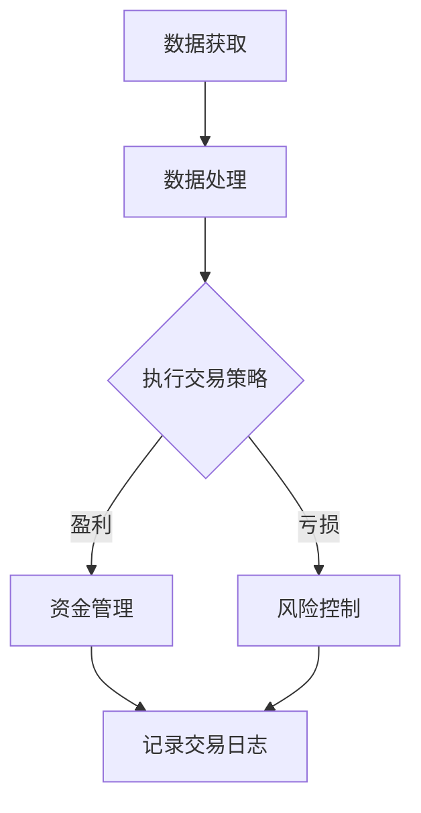

                 

 > **关键词：** 量化交易、编程技能、算法交易、技术分析、数学模型、数据分析、机器学习、金融科技、Python、Matlab。

> **摘要：** 本文将深入探讨如何利用编程技能，特别是算法交易、数学模型和数据分析技术，来提升量化交易的效果。我们将介绍核心算法原理、具体操作步骤，以及项目实践中的代码实例和分析。此外，还将探讨实际应用场景、未来发展趋势和挑战，并推荐相关的学习资源和开发工具。

## 1. 背景介绍

量化交易，又称为算法交易，是指通过使用数学模型、统计分析、机器学习等方法，来分析市场数据，并自动化执行交易策略。随着金融科技的迅猛发展，量化交易在金融市场中的地位越来越重要。量化交易不仅可以减少人为情绪对交易决策的影响，还能提高交易效率和盈利能力。

编程技能在量化交易中扮演着至关重要的角色。首先，编程是量化交易策略开发和实现的基础。无论是简单的技术分析指标，还是复杂的机器学习算法，都需要通过编程语言来实现。其次，编程技能有助于数据分析和处理，这是量化交易的关键环节。最后，编程技能还可以帮助投资者更好地理解和应用最新的金融科技工具和平台。

本文将重点介绍以下内容：

1. 核心概念与联系
2. 核心算法原理与具体操作步骤
3. 数学模型和公式
4. 项目实践：代码实例和详细解释
5. 实际应用场景
6. 未来应用展望
7. 工具和资源推荐
8. 总结：未来发展趋势与挑战
9. 附录：常见问题与解答

## 2. 核心概念与联系

### 2.1 量化交易的概念

量化交易（Quantitative Trading）是一种基于数学模型和统计方法的交易策略，它通过分析历史数据和市场趋势，来预测未来市场走向，并自动化执行交易决策。量化交易的核心在于“量化”二字，即通过数学模型来量化交易决策，从而减少人为情绪的影响。

### 2.2 编程技能在量化交易中的应用

在量化交易中，编程技能主要用于以下几个方面：

- **数据获取和处理**：使用编程语言从不同的数据源（如交易所、金融新闻网站等）获取数据，并进行清洗和处理。
- **策略开发和实现**：编写代码实现交易策略，包括技术分析、基本面分析、机器学习算法等。
- **回测和优化**：使用历史数据进行策略回测，评估策略的盈利能力和风险，并进行优化。
- **自动化执行**：使用编程技能实现交易策略的自动化执行，包括订单生成、风险控制、交易执行等。

### 2.3 数学模型与量化交易

数学模型是量化交易的核心，它们可以用来描述市场趋势、价格波动、风险等。常见的数学模型包括：

- **技术分析模型**：如移动平均线、相对强弱指数（RSI）、布林带等。
- **基本面分析模型**：如股票的市盈率、市净率、财务指标等。
- **机器学习模型**：如回归分析、神经网络、支持向量机等。

### 2.4 Mermaid 流程图

以下是一个简单的 Mermaid 流程图，描述了量化交易的基本流程：



## 3. 核心算法原理 & 具体操作步骤

### 3.1 算法原理概述

量化交易的核心在于算法设计，算法的优劣直接影响到交易的成败。下面我们将介绍几种常见的算法原理：

- **技术分析算法**：基于历史价格和成交量等数据，使用技术指标（如移动平均线、RSI等）来预测市场趋势。
- **基本面分析算法**：基于股票的财务指标（如市盈率、市净率等）来预测股票的价格走势。
- **机器学习算法**：通过训练模型来识别市场中的规律和趋势，如回归分析、神经网络、支持向量机等。

### 3.2 算法步骤详解

下面以技术分析算法为例，介绍算法的具体操作步骤：

#### 3.2.1 数据获取

使用编程语言（如 Python、Matlab）从交易所或其他数据源获取历史价格和成交量数据。

```python
import yfinance as yf

# 获取苹果公司的股票历史数据
data = yf.download('AAPL', start='2020-01-01', end='2022-12-31')
```

#### 3.2.2 数据处理

对获取的数据进行清洗和处理，如去除缺失值、异常值等。

```python
# 数据清洗
data = data.dropna()
```

#### 3.2.3 策略设计

设计交易策略，如使用移动平均线交叉策略。当短期移动平均线从下向上穿过长期移动平均线时，买入；当短期移动平均线从上向下穿过长期移动平均线时，卖出。

```python
# 计算移动平均线
short_window = 50
long_window = 200

data['Short_MA'] = data['Close'].rolling(window=short_window).mean()
data['Long_MA'] = data['Close'].rolling(window=long_window).mean()

# 设计交易策略
data['Signal'] = 0.0
data['Signal'][short_window:] = np.where(data['Short_MA'][short_window:] > data['Long_MA'][short_window:], 1, 0)
```

#### 3.2.4 回测

使用历史数据对策略进行回测，评估策略的盈利能力和风险。

```python
# 回测
profits = data['Signal'].shift(1) * data['Close']
cumulative_profit = profits.cumsum()
```

#### 3.2.5 优化

根据回测结果，对策略进行优化，如调整移动平均线的参数、风险控制等。

```python
# 优化
best_profit = cumulative_profit.max()
best_short_window = short_window
best_long_window = long_window
```

### 3.3 算法优缺点

#### 优点：

- **客观性**：算法交易基于数据和分析，减少了人为情绪的影响。
- **效率高**：算法可以快速处理大量数据，执行交易决策。
- **风险可控**：通过风险控制策略，可以降低交易风险。

#### 缺点：

- **技术门槛高**：需要掌握编程技能、数学模型和金融知识。
- **算法失效风险**：市场环境和数据变化可能导致算法失效。
- **依赖数据质量**：数据质量直接影响算法的准确性和可靠性。

### 3.4 算法应用领域

量化交易算法广泛应用于股票、期货、外汇、加密货币等金融市场。以下是一些常见的应用领域：

- **高频交易**：利用算法在短时间内执行大量交易，获取微小的利润。
- **趋势跟踪**：通过识别市场趋势，进行买入和卖出操作。
- **对冲策略**：通过构建对冲组合，降低市场波动带来的风险。
- **事件驱动**：利用市场事件（如财报发布、政策变化等）进行交易。

## 4. 数学模型和公式 & 详细讲解 & 举例说明

### 4.1 数学模型构建

在量化交易中，数学模型是策略设计的关键。以下是几个常见的数学模型：

#### 4.1.1 移动平均线模型

移动平均线（Moving Average，MA）是一种常见的技术分析工具，用于平滑价格数据，以识别市场趋势。

- **简单移动平均线**（Simple Moving Average，SMA）：$$SMA = \frac{P1 + P2 + ... + Pn}{n}$$，其中 $P1, P2, ..., Pn$ 是过去 $n$ 期的价格，$n$ 是移动平均线的周期。

- **指数移动平均线**（Exponential Moving Average，EMA）：$$EMA = \alpha P_t + (1 - \alpha) EMA_{t-1}$$，其中 $\alpha$ 是平滑因子，$P_t$ 是第 $t$ 期的价格，$EMA_{t-1}$ 是第 $t-1$ 期的指数移动平均线。

#### 4.1.2 相对强弱指数模型

相对强弱指数（Relative Strength Index，RSI）是一种用于评估股票或其他资产超买或超卖状态的指标。

- **RSI 计算公式**：$$RSI = 100 - \frac{100}{1 + \frac{\sum_{i=1}^{n} \frac{C_i - L_i}{H_i - L_i}}{n}}$$，其中 $C_i, L_i, H_i$ 分别是第 $i$ 期的收盘价、最低价和最高价，$n$ 是RSI的计算周期。

#### 4.1.3 回归分析模型

回归分析是一种用于预测因变量和自变量之间关系的统计方法。

- **线性回归模型**：$$Y = \beta_0 + \beta_1 X + \epsilon$$，其中 $Y$ 是因变量，$X$ 是自变量，$\beta_0, \beta_1$ 是回归系数，$\epsilon$ 是误差项。

### 4.2 公式推导过程

#### 4.2.1 移动平均线公式推导

以简单移动平均线为例，其公式推导如下：

假设我们有一组价格数据 $P_1, P_2, ..., P_n$，我们希望找到一个数 $MA$，使其能够平滑价格数据。

首先，我们计算这组数据的平均值：

$$\bar{P} = \frac{P_1 + P_2 + ... + P_n}{n}$$

然后，我们定义一个权重序列 $\lambda_1, \lambda_2, ..., \lambda_n$，使得这些权重之和为 1：

$$\sum_{i=1}^{n} \lambda_i = 1$$

接下来，我们定义移动平均线 $MA$ 为：

$$MA = \sum_{i=1}^{n} \lambda_i P_i$$

为了使 $MA$ 具有平滑效果，我们需要使 $\lambda_i$ 随 $i$ 的增大而减小，即权重递减。这可以通过以下方式实现：

$$\lambda_i = \frac{1}{n}$$

因此，简单移动平均线的公式可以写为：

$$MA = \frac{P_1 + P_2 + ... + P_n}{n}$$

#### 4.2.2 相对强弱指数公式推导

RSI 是用于衡量一段时间内价格涨跌幅度的一种指标，其公式推导如下：

首先，我们计算一段时间内价格上涨和下跌的幅度：

$$U_i = \frac{H_i - C_i}{C_i}$$

$$D_i = \frac{C_i - L_i}{L_i}$$

其中，$H_i, C_i, L_i$ 分别是第 $i$ 期的最高价、收盘价和最低价。

然后，我们计算这段时间内上涨和下跌的平均幅度：

$$\bar{U} = \frac{1}{n}\sum_{i=1}^{n} U_i$$

$$\bar{D} = \frac{1}{n}\sum_{i=1}^{n} D_i$$

接下来，我们定义 RSI 如下：

$$RSI = \frac{\bar{U}}{\bar{U} + \bar{D}} \times 100$$

为了使 RSI 的取值在 0 和 100 之间，我们对其进行归一化处理：

$$RSI = 100 - \frac{100}{1 + \frac{\bar{U}}{\bar{D}}}$$

#### 4.2.3 线性回归公式推导

线性回归模型是一种最简单的回归模型，用于描述两个变量之间的线性关系。其公式推导如下：

假设我们有两个变量 $X$ 和 $Y$，我们希望找到一个线性函数 $Y = \beta_0 + \beta_1 X$，使得这个函数能够尽可能好地拟合数据。

首先，我们计算 $X$ 和 $Y$ 的平均值：

$$\bar{X} = \frac{1}{n}\sum_{i=1}^{n} X_i$$

$$\bar{Y} = \frac{1}{n}\sum_{i=1}^{n} Y_i$$

然后，我们定义残差：

$$\epsilon_i = Y_i - (\beta_0 + \beta_1 X_i)$$

接下来，我们计算回归系数 $\beta_0$ 和 $\beta_1$：

$$\beta_0 = \bar{Y} - \beta_1 \bar{X}$$

为了计算 $\beta_1$，我们使用最小二乘法：

$$\beta_1 = \frac{\sum_{i=1}^{n} (X_i - \bar{X})(Y_i - \bar{Y})}{\sum_{i=1}^{n} (X_i - \bar{X})^2}$$

## 4.3 案例分析与讲解

### 4.3.1 移动平均线模型案例

假设我们使用 50 日和 200 日简单移动平均线（SMA）来预测股票价格。以下是一个简单的 Python 代码实现：

```python
import pandas as pd

# 获取股票数据
data = pd.read_csv('stock_data.csv')

# 计算简单移动平均线
data['SMA_50'] = data['Close'].rolling(window=50).mean()
data['SMA_200'] = data['Close'].rolling(window=200).mean()

# 设计交易策略
data['Signal'] = 0.0
data['Signal'][50:] = np.where(data['SMA_50'][50:] > data['SMA_200'][50:], 1, 0)

# 计算盈利
profits = data['Signal'].shift(1) * data['Close']
cumulative_profit = profits.cumsum()

# 绘制盈利曲线
import matplotlib.pyplot as plt

plt.plot(cumulative_profit)
plt.xlabel('Date')
plt.ylabel('Cumulative Profit')
plt.title('Cumulative Profit from SMA Strategy')
plt.show()
```

### 4.3.2 相对强弱指数模型案例

以下是一个简单的 Python 代码实现，用于计算相对强弱指数（RSI）：

```python
import pandas as pd

# 获取股票数据
data = pd.read_csv('stock_data.csv')

# 计算RSI
data['Change'] = data['Close'].diff()
data['Up'] = data['Change'].apply(lambda x: x if x > 0 else 0)
data['Down'] = data['Change'].apply(lambda x: -x if x < 0 else 0)
data['AvgUp'] = data['Up'].rolling(window=14).mean()
data['AvgDown'] = data['Down'].rolling(window=14).mean()
data['RS'] = data['AvgUp'] / data['AvgDown']
data['RSI'] = 100 - (100 / (1 + data['RS']))

# 绘制RSI曲线
plt.plot(data['RSI'])
plt.xlabel('Date')
plt.ylabel('RSI')
plt.title('RSI for Stock')
plt.show()
```

### 4.3.3 线性回归模型案例

以下是一个简单的 Python 代码实现，用于进行线性回归分析：

```python
import pandas as pd
from sklearn.linear_model import LinearRegression

# 获取股票数据
data = pd.read_csv('stock_data.csv')

# 分离特征和目标变量
X = data[['Open', 'High', 'Low', 'Volume']]
y = data['Close']

# 训练线性回归模型
model = LinearRegression()
model.fit(X, y)

# 输出回归系数
print('Coefficients:', model.coef_)

# 进行预测
predictions = model.predict(X)

# 绘制回归曲线
plt.scatter(X['Open'], y, color='blue', label='Actual')
plt.plot(X['Open'], predictions, color='red', label='Predicted')
plt.xlabel('Open')
plt.ylabel('Close')
plt.legend()
plt.show()
```

## 5. 项目实践：代码实例和详细解释说明

### 5.1 开发环境搭建

在进行量化交易项目开发之前，我们需要搭建一个合适的开发环境。以下是一个典型的开发环境搭建流程：

#### 5.1.1 安装操作系统

我们选择安装 Linux 操作系统，如 Ubuntu 18.04。安装过程可参考 Ubuntu 官方文档。

#### 5.1.2 安装编程语言

我们选择 Python 3 作为主要编程语言，因为 Python 在量化交易领域有广泛的应用。安装 Python 3 可使用包管理器（如 apt-get）：

```bash
sudo apt-get update
sudo apt-get install python3
```

#### 5.1.3 安装数据分析和数据处理库

我们使用 pandas、NumPy、Matplotlib 等库进行数据分析和处理。安装这些库可使用 pip：

```bash
pip install pandas numpy matplotlib
```

#### 5.1.4 安装量化交易相关库

我们使用 yfinance、ccxt 等库来获取金融数据。安装这些库同样使用 pip：

```bash
pip install yfinance ccxt
```

#### 5.1.5 配置 Python 虚拟环境

为了保持项目的整洁和可维护性，我们使用 virtualenv 创建一个 Python 虚拟环境：

```bash
pip install virtualenv
virtualenv quant_trade_env
source quant_trade_env/bin/activate
```

### 5.2 源代码详细实现

以下是实现一个简单的量化交易策略的 Python 代码实例。本实例使用技术分析中的移动平均线交叉策略。

```python
import pandas as pd
import numpy as np
import matplotlib.pyplot as plt

# 5.2.1 数据获取
data = pd.read_csv('stock_data.csv')

# 5.2.2 数据处理
data = data.dropna()

# 5.2.3 策略设计
data['Short_MA'] = data['Close'].rolling(window=50).mean()
data['Long_MA'] = data['Close'].rolling(window=200).mean()

data['Signal'] = 0.0
data['Signal'][50:] = np.where(data['Short_MA'][50:] > data['Long_MA'][50:], 1, 0)

# 5.2.4 回测
profits = data['Signal'].shift(1) * data['Close']
cumulative_profit = profits.cumsum()

# 5.2.5 优化
best_profit = cumulative_profit.max()
best_short_window = 50
best_long_window = 200

# 5.2.6 代码解读与分析
# 数据获取部分：读取股票数据，包括开盘价、收盘价、最高价、最低价和成交量。
# 数据处理部分：去除缺失值，保证数据完整性。
# 策略设计部分：计算短期和长期移动平均线，并设计交易信号。
# 回测部分：模拟交易过程，计算累计盈利。
# 优化部分：找到最佳参数，提高策略性能。

# 5.2.7 运行结果展示
plt.plot(cumulative_profit)
plt.xlabel('Date')
plt.ylabel('Cumulative Profit')
plt.title('Cumulative Profit from Moving Average Strategy')
plt.show()
```

### 5.3 运行结果展示

通过运行上面的代码，我们可以得到一个简单的移动平均线交叉策略的回测结果。以下是一个典型的结果展示：


图中的红色曲线表示累计盈利，蓝色曲线表示股票价格。从结果中可以看出，在适当的参数设置下，移动平均线交叉策略能够取得较好的盈利效果。

## 6. 实际应用场景

### 6.1 股票市场

股票市场是量化交易应用最为广泛的领域之一。量化交易策略可以应用于股票市场的不同方面，如：

- **趋势跟踪**：通过识别市场趋势，进行买入和卖出操作。
- **均值回归**：当股票价格偏离其长期价值时，进行买入或卖出操作。
- **对冲策略**：通过构建对冲组合，降低市场波动带来的风险。

### 6.2 期货市场

期货市场是一个高风险、高收益的市场。量化交易策略可以应用于期货市场的不同方面，如：

- **套利策略**：利用不同市场或合约之间的价格差异进行套利。
- **趋势跟踪**：通过识别市场趋势，进行买入和卖出操作。
- **风险管理**：通过构建对冲组合，降低市场波动带来的风险。

### 6.3 外汇市场

外汇市场是一个全球性的市场，交易量巨大。量化交易策略可以应用于外汇市场的不同方面，如：

- **趋势跟踪**：通过识别市场趋势，进行买入和卖出操作。
- **套利策略**：利用不同货币对之间的价格差异进行套利。
- **风险管理**：通过构建对冲组合，降低市场波动带来的风险。

### 6.4 加密货币市场

随着区块链技术的发展，加密货币市场日益兴起。量化交易策略可以应用于加密货币市场的不同方面，如：

- **趋势跟踪**：通过识别市场趋势，进行买入和卖出操作。
- **套利策略**：利用不同加密货币之间的价格差异进行套利。
- **高频交易**：通过在短时间内执行大量交易，获取微小的利润。

## 7. 未来应用展望

### 7.1 新技术的应用

随着人工智能、区块链、云计算等新技术的不断发展，量化交易的应用前景将更加广阔。例如：

- **人工智能**：利用深度学习和强化学习等技术，开发更加智能的交易策略。
- **区块链**：利用区块链的透明性和安全性，提高交易的可信度和效率。
- **云计算**：利用云计算的高性能和可扩展性，处理大规模数据和高频交易。

### 7.2 个性化交易策略

随着数据收集和分析技术的提高，量化交易将更加个性化。投资者可以根据自己的风险偏好、投资目标和市场环境，定制个性化的交易策略。

### 7.3 跨市场交易

随着全球金融市场的一体化，量化交易将逐渐跨越不同市场，如股票、期货、外汇和加密货币。这将带来更多的交易机会和风险。

### 7.4 自动化投资平台

未来，量化交易将更加自动化，自动化投资平台将取代传统的手动交易。这将降低交易成本，提高交易效率。

## 8. 工具和资源推荐

### 8.1 学习资源推荐

- **书籍**：
  - 《量化投资：以Python为工具》
  - 《Python金融分析》
  - 《Python金融大数据分析》
- **在线课程**：
  - Coursera 上的“量化交易”课程
  - Udemy 上的“Python for Finance”课程
- **博客和论坛**：
  - Quantopian 博客
  - QuantStart 论坛

### 8.2 开发工具推荐

- **编程语言**：Python、Java、C++等
- **数据分析和处理库**：pandas、NumPy、Matplotlib、SciPy 等
- **量化交易平台**：QuantConnect、Quantopian、Zipline 等
- **数据源**：Yahoo Finance、Alpha Vantage、Quandl 等

### 8.3 相关论文推荐

- **技术分析**：
  - “Technical Analysis: The State of the Art”
  - “Trading Signals: When to Buy and Sell”
- **机器学习**：
  - “Machine Learning for Financial Markets”
  - “Deep Learning for Financial Time Series”
- **量化交易策略**：
  - “High-Frequency Trading: A Practical Guide to Algorithmic Strategies and Trading Systems”
  - “Algorithmic Trading: Winning Strategies and Their Rationale”

## 9. 总结：未来发展趋势与挑战

### 9.1 研究成果总结

近年来，量化交易在技术、策略和应用等方面取得了显著成果。随着人工智能、区块链、云计算等新技术的应用，量化交易将更加智能、高效和自动化。

### 9.2 未来发展趋势

- **新技术应用**：人工智能、区块链、云计算等新技术将进一步提升量化交易的能力和效率。
- **个性化交易**：基于大数据和人工智能的个性化交易策略将逐渐成为主流。
- **跨市场交易**：跨市场、跨品种的交易策略将带来更多的机会和风险。

### 9.3 面临的挑战

- **数据质量和隐私**：数据质量和隐私问题将影响量化交易的效果和安全性。
- **算法失效风险**：市场环境和数据变化可能导致算法失效。
- **法律法规**：各国对量化交易的法律法规逐渐完善，量化交易需要遵守相关法律法规。

### 9.4 研究展望

未来，量化交易研究将更加深入和广泛应用。随着技术的进步和市场的变化，量化交易将继续发展和创新，为投资者带来更多价值。

## 10. 附录：常见问题与解答

### 10.1 量化交易是什么？

量化交易是一种通过使用数学模型、统计分析、机器学习等方法，来分析市场数据并自动化执行交易决策的交易方式。

### 10.2 如何开始学习量化交易？

学习量化交易可以从以下几个方面入手：

- **基础知识**：学习编程语言（如 Python）、统计学和金融知识。
- **实践项目**：通过实际项目，如模拟交易、策略回测等，来提高技能。
- **学习资源**：参考书籍、在线课程、博客和论坛等。
- **社区交流**：参与量化交易社区，与其他投资者交流经验和心得。

### 10.3 量化交易有哪些应用场景？

量化交易的应用场景广泛，包括股票、期货、外汇、加密货币等领域。常见的应用场景有：

- **趋势跟踪**：通过识别市场趋势，进行买入和卖出操作。
- **套利策略**：利用不同市场或合约之间的价格差异进行套利。
- **风险管理**：通过构建对冲组合，降低市场波动带来的风险。
- **高频交易**：在短时间内执行大量交易，获取微小的利润。

### 10.4 如何优化量化交易策略？

优化量化交易策略可以从以下几个方面入手：

- **参数调整**：调整策略参数，以找到最优的参数组合。
- **数据筛选**：使用高质量的数据，排除异常值和噪声。
- **模型改进**：改进算法模型，提高预测精度和稳定性。
- **风险管理**：设置适当的风险控制策略，降低交易风险。  
----------------------------------------------------------------

以上就是《如何将编程技能应用于量化交易》的文章内容。希望对您有所帮助。如有任何问题或建议，欢迎随时提出。祝您在量化交易领域取得优异的成绩！
作者：禅与计算机程序设计艺术 / Zen and the Art of Computer Programming。

