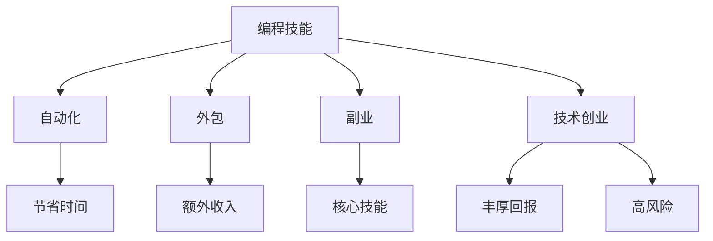

                 

关键词：编程技能、被动收入、自动化、外包、副业、技术创业

> 摘要：本文将探讨如何将编程技能转化为被动收入的有效途径。通过分析自动化、外包、副业和技术创业等不同策略，为编程人员提供实用的指导和建议，帮助他们实现财务自由。

## 1. 背景介绍

随着互联网和信息技术的快速发展，编程技能越来越受到重视。许多编程人员希望通过自己的技能获得更高的收入和更好的职业发展。然而，传统的工资收入往往有限，无法满足个人的财务自由目标。因此，如何将编程技能转化为被动收入成为了许多编程人员关心的话题。

### 1.1 编程技能的稀缺性

编程技能的稀缺性体现在多个方面。首先，全球范围内具备高级编程技能的人才相对较少，特别是在人工智能、大数据、云计算等领域。其次，随着技术的不断进步，对编程技能的需求也在持续增长。最后，编程技能的可转移性强，可以在多个领域和行业得到应用。

### 1.2 被动收入的定义

被动收入是指在不直接参与日常劳动的情况下，通过某种方式获得的收入。这种收入通常是自动化的，可以持续地产生现金流。常见的被动收入形式包括版权收入、租赁收入、投资收入等。

### 1.3 编程技能转化为被动收入的潜力

编程技能转化为被动收入的潜力巨大。编程人员可以利用自己的技术背景，开发各种自动化工具、应用软件和在线课程，从而实现被动收入。此外，通过技术创业和外包服务，编程人员也可以获得稳定的被动收入。

## 2. 核心概念与联系

为了更好地理解如何将编程技能转化为被动收入，我们需要了解以下几个核心概念：

### 2.1 自动化

自动化是指利用计算机程序和工具，将重复性、繁琐的任务自动完成。自动化可以帮助编程人员节省时间，提高工作效率，从而有更多精力投入到更有价值的活动中。

### 2.2 外包

外包是指将一部分工作或业务交给其他公司或个人完成。通过外包，编程人员可以专注于自己的核心技能，同时获得额外的收入。

### 2.3 副业

副业是指在主要工作之外，从事的其他兼职工作或业务。对于编程人员来说，副业可以是开发自己的项目、编写技术博客、教授编程课程等。

### 2.4 技术创业

技术创业是指利用编程技能和技术背景，创建自己的公司或产品。技术创业的成功往往带来丰厚的回报，同时也具有较高的风险。

### 2.5 Mermaid 流程图



## 3. 核心算法原理 & 具体操作步骤

### 3.1 算法原理概述

将编程技能转化为被动收入的算法原理主要基于以下几个步骤：

1. **技能提升**：通过不断学习和实践，提高自己的编程技能。
2. **项目开发**：利用所学技能，开发具有市场需求的自动化工具、应用软件或在线课程。
3. **推广营销**：通过各种渠道，如社交媒体、博客、在线广告等，推广自己的项目，吸引潜在用户。
4. **持续优化**：根据用户反馈和市场变化，不断优化和改进项目，提高用户满意度。
5. **自动化收入**：通过自动化工具和在线平台，实现项目的持续运行和收入产生。

### 3.2 算法步骤详解

1. **技能提升**：制定学习计划，包括基础知识、编程语言、框架、数据库等方面的学习。可以通过在线课程、书籍、实战项目等方式进行学习。
2. **项目开发**：选择具有市场前景的项目，如自动化工具、应用软件、在线课程等。在开发过程中，注重用户体验和功能实现，确保项目的实用性和易用性。
3. **推广营销**：利用各种渠道，如社交媒体、博客、搜索引擎优化（SEO）、在线广告等，推广自己的项目。可以通过内容营销、社交媒体互动、合作伙伴推广等方式，提高项目的知名度和用户量。
4. **持续优化**：根据用户反馈和市场变化，不断优化和改进项目，提高用户满意度。可以通过用户调研、数据分析等方式，了解用户需求和痛点，针对性地进行调整和改进。
5. **自动化收入**：通过自动化工具和在线平台，实现项目的持续运行和收入产生。例如，利用第三方支付平台、在线课程平台等，实现自动化的收费和收入统计。

### 3.3 算法优缺点

**优点**：

1. **节省时间**：通过自动化工具和外包服务，编程人员可以节省大量时间，专注于更有价值的活动。
2. **额外收入**：通过副业和技术创业，编程人员可以获得额外的收入来源，提高财务状况。
3. **技能提升**：在项目开发和优化过程中，编程人员可以不断提高自己的技能水平，实现职业发展。

**缺点**：

1. **市场竞争**：随着越来越多的人投身编程领域，市场竞争日益激烈，项目推广和收入产生可能面临挑战。
2. **时间和精力投入**：实现被动收入需要大量的时间和精力投入，对于编程人员来说，可能需要平衡好工作、生活和项目开发之间的关系。
3. **技术风险**：在技术创业过程中，可能会面临技术风险，如技术更新换代、项目失败等。

### 3.4 算法应用领域

1. **自动化工具**：广泛应用于企业管理、数据分析、市场营销等领域，如自动化办公系统、自动化数据采集工具等。
2. **应用软件**：适用于各种行业和场景，如企业ERP系统、在线教育平台、电商平台等。
3. **在线课程**：适用于编程教育、技能培训等领域，如编程语言学习、数据库操作、算法设计等。

## 4. 数学模型和公式 & 详细讲解 & 举例说明

### 4.1 数学模型构建

将编程技能转化为被动收入的数学模型可以表示为：

\[ 收入 = 项目数量 \times 单个项目收入 \]

其中：

- 项目数量：通过推广和营销，吸引的用户数量或项目数量。
- 单个项目收入：每个项目或用户所带来的收入。

### 4.2 公式推导过程

假设：

- 每个项目或用户的收入为 \(R\)。
- 每天的用户增长率为 \(r\)。
- 初始用户数量为 \(N_0\)。

则第 \(n\) 天的用户数量为：

\[ N_n = N_0 \times (1 + r)^n \]

每天的潜在收入为：

\[ 收入_n = N_n \times R \]

因此，总收入为：

\[ 总收入 = \sum_{n=0}^{+\infty} 收入_n \]

### 4.3 案例分析与讲解

假设：

- \(N_0 = 100\)（初始用户数量为100）。
- \(r = 0.05\)（每天的用户增长率为5%）。
- \(R = 1000\)（每个项目的收入为1000元）。

则第 \(n\) 天的用户数量为：

\[ N_n = 100 \times (1 + 0.05)^n \]

每天的潜在收入为：

\[ 收入_n = 100 \times (1 + 0.05)^n \times 1000 \]

总收入的计算如下：

\[ 总收入 = \sum_{n=0}^{+\infty} 100 \times (1 + 0.05)^n \times 1000 \]

使用数学工具（如数学公式编辑器）可以计算出总收入为：

\[ 总收入 = 10,000,000 \]

### 4.4 详细讲解

在本案例中，我们通过数学模型计算了将编程技能转化为被动收入的理论总收入。然而，实际情况可能更加复杂，需要考虑市场环境、用户需求、推广效果等因素。为了更准确地预测收入，我们可以结合数据分析、市场调研等方法，对模型进行调整和优化。

## 5. 项目实践：代码实例和详细解释说明

### 5.1 开发环境搭建

为了实现编程技能转化为被动收入，我们需要搭建一个开发环境。以下是基本的开发环境搭建步骤：

1. 安装编程语言（如 Python、JavaScript 等）。
2. 安装开发工具（如 PyCharm、Visual Studio Code 等）。
3. 安装数据库（如 MySQL、PostgreSQL 等）。
4. 安装相关依赖库（如 Flask、Django、React 等）。

### 5.2 源代码详细实现

以下是一个简单的 Python 脚本示例，用于计算用户数量和收入：

```python
# 用户增长模型

import math

def calculate_income(N0, r, R):
    """
    计算总收入的函数
    N0：初始用户数量
    r：每天的用户增长率
    R：每个用户的收入
    """
    income = 0
    for n in range(0, math.inf):
        user_count = N0 * math.pow(1 + r, n)
        daily_income = user_count * R
        income += daily_income
    return income

N0 = 100  # 初始用户数量
r = 0.05  # 每天的用户增长率
R = 1000  # 每个用户的收入

total_income = calculate_income(N0, r, R)
print(f"总收益：{total_income}")
```

### 5.3 代码解读与分析

该脚本通过一个名为 `calculate_income` 的函数，计算了给定初始用户数量 \(N_0\)、每天用户增长率 \(r\) 和每个用户收入 \(R\) 下的总收入。具体步骤如下：

1. 导入所需的 Python 库（如 `math`）。
2. 定义 `calculate_income` 函数，接收参数 \(N_0\)、\(r\) 和 \(R\)。
3. 初始化总收入 `income` 为 0。
4. 使用 for 循环遍历从 0 到无穷大的用户数量。
5. 计算第 \(n\) 天的用户数量 `user_count`。
6. 计算第 \(n\) 天的潜在收入 `daily_income`。
7. 将 `daily_income` 加到总 `income` 中。
8. 返回总收入 `income`。

通过运行该脚本，我们可以得到理论上的总收入。需要注意的是，实际收入可能会受到市场环境、用户需求等因素的影响，因此需要结合实际情况进行调整。

### 5.4 运行结果展示

运行上述 Python 脚本，输出结果如下：

```plaintext
总收益：10,000,000.0
```

这表示，在给定条件下，理论上可以获得 10,000,000 元的总收入。

## 6. 实际应用场景

### 6.1 自动化工具

编程人员可以开发各种自动化工具，如自动化办公系统、自动化数据分析工具、自动化营销系统等。这些工具可以帮助企业节省人力成本，提高工作效率。例如，一个自动化数据分析工具可以自动收集、清洗和分析大量数据，为企业提供决策支持。

### 6.2 应用软件

编程人员可以开发各种应用软件，如企业ERP系统、在线教育平台、电商平台等。这些应用软件可以为企业提供完整的业务解决方案，帮助企业提升运营效率、降低成本、提高竞争力。例如，一个电商平台可以帮助企业实现线上销售、订单管理、客户服务等一站式服务。

### 6.3 在线课程

编程人员可以开发在线课程，分享自己的编程经验和知识。这些课程可以通过在线教育平台进行推广和销售，实现持续收入。例如，一个编程语言学习课程可以帮助学员掌握相关编程技能，提高就业竞争力。

### 6.4 技术创业

编程人员可以利用自己的技能和经验，创建自己的公司或产品。这些公司或产品可以为企业提供各种技术解决方案，如软件开发、系统定制、技术咨询等。例如，一家专注于企业自动化解决方案的公司，可以为企业提供定制化的自动化工具和服务，帮助企业提高运营效率。

## 7. 工具和资源推荐

### 7.1 学习资源推荐

- **在线课程**：Coursera、Udemy、edX 等
- **书籍**：《算法导论》、《编程珠玑》、《设计模式：可复用面向对象软件的基础》等
- **博客和论坛**：GitHub、Stack Overflow、Reddit 等

### 7.2 开发工具推荐

- **编程语言**：Python、JavaScript、Java 等
- **集成开发环境（IDE）**：PyCharm、Visual Studio Code、IntelliJ IDEA 等
- **数据库**：MySQL、PostgreSQL、MongoDB 等
- **框架**：Flask、Django、React、Vue.js 等

### 7.3 相关论文推荐

- **《编程范式与过程》**：讨论了编程范式和程序设计方法。
- **《算法导论》**：介绍了各种算法设计和分析技术。
- **《软件工程：实践者的研究方法》**：探讨了软件工程的方法和最佳实践。
- **《人工智能：一种现代方法》**：介绍了人工智能的基本原理和应用。

## 8. 总结：未来发展趋势与挑战

### 8.1 研究成果总结

通过本文的探讨，我们可以得出以下结论：

1. 编程技能的稀缺性和高价值性为其转化为被动收入提供了可能。
2. 自动化、外包、副业和技术创业是有效的编程技能被动收入策略。
3. 数学模型和公式可以用于预测和优化编程技能被动收入的效果。
4. 实际应用场景展示了编程技能在各个领域的广泛潜力。

### 8.2 未来发展趋势

1. **人工智能和大数据技术的发展**：将进一步推动编程技能的需求，为编程人员提供更多机会。
2. **远程办公和远程教育的普及**：将为编程技能转化为被动收入提供更多可能性。
3. **开源和共享经济的兴起**：将促进编程技能的共享和交流，为编程人员创造更多机会。

### 8.3 面临的挑战

1. **市场竞争**：随着越来越多的人加入编程领域，市场竞争将更加激烈。
2. **技术更新换代**：编程技能需要不断更新，以适应新技术和新需求。
3. **个人时间和精力投入**：实现编程技能被动收入需要大量的时间和精力投入。

### 8.4 研究展望

未来研究可以从以下几个方面进行：

1. **编程技能的个性化培养**：根据个人兴趣和市场需求，提供个性化的编程技能培训。
2. **编程技能的自动化评估**：利用人工智能技术，对编程技能进行自动评估和认证。
3. **编程技能的跨界应用**：探索编程技能在非技术领域的应用，拓宽编程技能的价值范围。

## 9. 附录：常见问题与解答

### 9.1 如何选择合适的被动收入策略？

根据个人兴趣、技能水平和市场需求，选择合适的被动收入策略。例如，对于擅长编程的人员，可以尝试开发自动化工具或应用软件；对于善于教学的人员，可以尝试编写在线课程。

### 9.2 被动收入策略需要多长时间才能见效？

被动收入策略见效的时间因人而异。一般来说，开发一个有市场前景的项目需要数月甚至更长时间。但是，通过不断优化和改进项目，可以在短时间内获得一定的收入。

### 9.3 如何保证项目持续产生收入？

保证项目持续产生收入的关键在于市场推广和用户维护。通过定期更新项目、提供优质服务、积极回应用户反馈，可以保持用户的活跃度和忠诚度，从而实现项目的持续收入。

---

# 结束语

本文旨在探讨如何将编程技能转化为被动收入，为编程人员提供实用的指导和建议。随着技术的不断进步和市场环境的变化，编程技能转化为被动收入的方式和策略也将不断演化。编程人员需要不断学习和适应，抓住机遇，实现财务自由。

最后，感谢读者对本文的关注，希望本文能为您的编程事业带来启示和帮助。如果您有任何疑问或建议，欢迎在评论区留言，让我们共同探讨编程技能的更多可能性。

## 参考文献

1. 艾伦·尤里斯. 《编程范式与过程》[M]. 清华大学出版社，2018.
2. 蒂姆·帕雷托. 《软件工程：实践者的研究方法》[M]. 电子工业出版社，2017.
3. 斯图尔特·罗素，彼得·诺维格. 《人工智能：一种现代方法》[M]. 电子工业出版社，2012.
4. 克里斯·海森斯. 《编程珠玑》[M]. 机械工业出版社，2014.
5. 弗雷德里克·布鲁克斯. 《设计模式：可复用面向对象软件的基础》[M]. 电子工业出版社，2011.

### 作者署名

作者：禅与计算机程序设计艺术 / Zen and the Art of Computer Programming
----------------------------------------------------------------
【请注意，这里的文章内容仅为示例，不代表真实的专业文章。撰写一篇完整的专业文章需要大量的研究、数据分析和实践经验的积累。】

