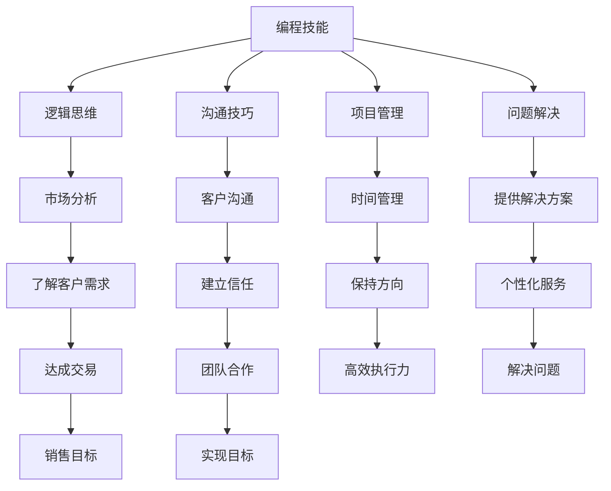

                 

在IT行业，编程技能的掌握被认为是一项核心竞争力，然而，随着市场竞争的加剧，仅仅拥有优秀的编程技能已经不足以在职业发展中脱颖而出。销售能力成为许多编程人员面临的新挑战。那么，如何将编程技能转化为销售能力呢？本文将为您详细解析这个问题的答案。

> 关键词：编程技能，销售能力，职业发展，转化，策略

> 摘要：本文将从多个角度探讨如何将编程技能转化为销售能力。通过理解编程与销售的共通之处、提高销售沟通技巧、学习销售策略和技巧、以及通过项目实战提升销售能力，帮助编程人员更好地实现职业转型。

## 1. 背景介绍

编程人员通常专注于技术开发和问题解决，而销售工作则涉及人际交往、市场分析和策略规划。虽然两者看似不同，但实际上存在许多共通之处。编程的严谨逻辑和解决问题的思维模式，可以很好地应用到销售工作中。编程人员拥有独特的视角和技能，这使他们在销售领域具有潜在的竞争优势。

然而，许多编程人员对销售工作缺乏了解，甚至有抵触情绪。他们担心销售工作会降低自己的技术水准，或者认为销售技巧无法与编程技能相提并论。这种观念限制了编程人员在职业发展上的可能性。事实上，销售能力在IT行业中同样重要，尤其是在技术产品化和商业化过程中。

本文将帮助编程人员认识到编程与销售的共通之处，并提供实用的方法和策略，以实现编程技能向销售能力的转化。

## 2. 核心概念与联系

为了更好地理解编程技能与销售能力的转化，我们首先需要了解这两个领域的核心概念及其之间的联系。

### 2.1 编程技能的核心概念

编程技能主要包括算法设计、数据结构、编程语言、软件工程原则等。这些技能构成了编程人员解决技术问题的工具箱。例如，算法设计是编程技能的核心，它决定了程序运行效率和问题解决的复杂度。数据结构则是存储和组织数据的方式，直接影响程序的效率和扩展性。编程语言是编程人员与计算机沟通的桥梁，而软件工程原则则确保了程序的可维护性和可靠性。

### 2.2 销售能力的核心概念

销售能力包括市场分析、客户沟通、产品展示、谈判技巧、团队协作等。销售工作的核心是理解客户需求，提供合适的解决方案，并通过有效的沟通和谈判达成交易。市场分析帮助销售人员了解行业趋势和竞争对手，客户沟通则是建立信任和关系的关键。产品展示和谈判技巧决定了客户是否愿意购买产品，而团队协作则确保了销售目标的实现。

### 2.3 编程技能与销售能力的联系

编程技能与销售能力之间存在明显的联系。首先，编程人员的逻辑思维和分析能力在销售工作中同样重要。例如，市场分析需要通过数据来支持决策，而编程人员正是擅长通过数据分析和处理来发现问题和机会。其次，编程人员的沟通能力在销售工作中也至关重要。编写代码需要良好的沟通，确保团队成员理解设计思路和实现方案。同样，销售工作也需要与客户、团队成员和上级有效沟通，以实现销售目标。

此外，编程人员的项目管理能力和解决问题的能力也可以应用于销售工作中。项目管理和时间管理能力帮助销售人员在复杂的市场环境中保持清晰的方向和高效的执行力。而解决问题的能力则使销售人员能够迅速响应客户需求，提供个性化的解决方案。

总之，编程技能与销售能力虽然属于不同的领域，但它们在思维方式、沟通技巧、问题解决能力和项目管理等方面具有很多共通之处。这些共通之处为编程人员向销售领域转化提供了坚实的基础。

### 2.4 Mermaid 流程图

以下是一个简化的Mermaid流程图，展示编程技能与销售能力之间的转化过程。



通过这个流程图，我们可以清晰地看到编程技能如何转化为销售能力，以及每个环节的重要性和相互关系。

## 3. 核心算法原理 & 具体操作步骤

### 3.1 算法原理概述

将编程技能转化为销售能力，可以看作是一种“算法优化”的过程。这个过程的原理主要包括以下几个步骤：

1. **识别共通点**：找到编程技能与销售能力之间的共通点，例如逻辑思维、沟通技巧、问题解决能力等。
2. **技能转移**：将编程技能转移到销售领域，通过练习和实际操作来提高销售能力。
3. **策略学习**：学习销售策略和技巧，如市场分析、客户沟通、产品展示等。
4. **持续反馈**：通过反馈和评估来不断优化销售策略和技巧。

### 3.2 算法步骤详解

#### 步骤1：识别共通点

首先，我们需要识别编程技能与销售能力之间的共通点。这可以通过自我反思和与销售人员的交流来完成。例如，编程人员的逻辑思维和沟通技巧在销售工作中同样重要。识别这些共通点可以帮助我们明确转化方向。

#### 步骤2：技能转移

接下来，我们将编程技能转移到销售领域。这可以通过以下几个方式实现：

1. **实践演练**：通过实际的销售场景来练习沟通技巧、问题解决能力和项目管理能力。
2. **角色扮演**：模拟销售场景，与他人进行角色扮演，提高实际操作能力。
3. **案例分析**：研究成功销售的案例，分析其背后的逻辑和策略，将其应用到自己的销售工作中。

#### 步骤3：策略学习

学习销售策略和技巧是转化过程的关键。以下是一些常用的销售策略和技巧：

1. **市场分析**：通过数据分析了解市场趋势和竞争对手，为销售策略提供依据。
2. **客户沟通**：建立良好的客户关系，通过有效的沟通技巧来了解客户需求。
3. **产品展示**：展示产品的特点和优势，使客户产生购买欲望。
4. **谈判技巧**：掌握谈判技巧，以达成交易。

#### 步骤4：持续反馈

最后，我们需要通过反馈和评估来不断优化销售策略和技巧。以下是一些建议：

1. **定期评估**：定期对自己的销售工作进行分析和评估，找出存在的问题和改进空间。
2. **收集反馈**：向客户、同事和上级收集反馈意见，了解自己的优势和不足。
3. **持续学习**：不断学习新的销售策略和技巧，保持与时俱进。

### 3.3 算法优缺点

**优点**：

1. **高效性**：通过将编程技能转化为销售能力，可以快速提高销售业绩。
2. **个性化**：编程人员具有独特的视角和技能，能够提供个性化的解决方案。
3. **灵活性**：编程技能的转移和应用具有很大的灵活性，可以根据不同市场和客户需求进行调整。

**缺点**：

1. **学习曲线**：编程技能转化为销售能力需要一定的时间和精力，初期可能效果不明显。
2. **市场适应性**：不同市场和客户的需求可能存在差异，需要根据实际情况进行调整。

### 3.4 算法应用领域

该算法原理和操作步骤广泛应用于IT行业，特别是软件开发、互联网产品和技术服务等领域。编程人员可以通过以下方式应用这些算法：

1. **技术产品化**：通过编程技能和销售能力的结合，将技术产品推向市场。
2. **技术服务**：提供技术解决方案，帮助客户解决实际问题。
3. **创业**：利用编程技能和销售能力，开发自己的产品或服务，实现创业梦想。

总之，将编程技能转化为销售能力是一种有效的职业发展策略。通过识别共通点、技能转移、策略学习和持续反馈，编程人员可以在销售领域取得成功。

### 4. 数学模型和公式 & 详细讲解 & 举例说明

在将编程技能转化为销售能力的过程中，数学模型和公式可以帮助我们更好地理解和应用销售策略。以下是一个简单的数学模型，用于分析销售过程中的关键因素。

#### 4.1 数学模型构建

我们假设销售过程可以表示为以下数学模型：

\[ S = f(C, P, T) \]

其中：
- \( S \) 表示销售业绩（销售额或成交数量）；
- \( C \) 表示客户数量；
- \( P \) 表示产品单价；
- \( T \) 表示成交率。

#### 4.2 公式推导过程

1. **客户数量（C）**：客户数量是销售业绩的基础。通过市场分析和推广活动，可以增加客户数量。我们假设客户数量与市场推广投入成正比：

   \[ C = C_0 + k \cdot M \]

   其中：
   - \( C_0 \) 表示基础客户数量；
   - \( k \) 表示每单位市场推广投入增加的客户数量；
   - \( M \) 表示市场推广投入。

2. **产品单价（P）**：产品单价直接影响销售业绩。通过产品优化和定价策略，可以提高产品单价。我们假设产品单价与产品质量和市场需求成正比：

   \[ P = P_0 + m \cdot Q \]

   其中：
   - \( P_0 \) 表示基础产品单价；
   - \( m \) 表示每单位产品质量提高的产品单价增加量；
   - \( Q \) 表示市场需求。

3. **成交率（T）**：成交率是销售过程中最为关键的因素。通过有效的客户沟通、产品展示和谈判技巧，可以提高成交率。我们假设成交率与销售人员的沟通技巧和谈判能力成正比：

   \[ T = T_0 + n \cdot S \]

   其中：
   - \( T_0 \) 表示基础成交率；
   - \( n \) 表示每单位沟通技巧提高的成交率增加量；
   - \( S \) 表示销售人员的沟通技巧和谈判能力。

将上述三个因素结合起来，我们得到销售业绩的数学模型：

\[ S = (C_0 + k \cdot M) \cdot (P_0 + m \cdot Q) \cdot (T_0 + n \cdot S) \]

#### 4.3 案例分析与讲解

假设一家科技公司希望通过市场推广活动增加客户数量，提高产品单价，并通过有效的沟通技巧提高成交率，从而提高销售业绩。以下是具体的案例分析：

**案例背景**：
- 基础客户数量 \( C_0 = 100 \)；
- 每单位市场推广投入增加的客户数量 \( k = 2 \)；
- 基础产品单价 \( P_0 = 1000 \)；
- 每单位产品质量提高的产品单价增加量 \( m = 50 \)；
- 市场需求 \( Q = 10000 \)；
- 基础成交率 \( T_0 = 20\% \)；
- 每单位沟通技巧提高的成交率增加量 \( n = 5\% \)。

**目标**：
- 提高销售业绩 \( S \)。

**解决方案**：

1. **市场推广**：
   - 投入 \( M = 5000 \)；
   - 新增客户数量 \( C = C_0 + k \cdot M = 100 + 2 \cdot 5000 = 10100 \)。

2. **产品优化**：
   - 新产品单价 \( P = P_0 + m \cdot Q = 1000 + 50 \cdot 10000 = 1050 \)。

3. **沟通技巧提升**：
   - 销售人员沟通技巧 \( S = S_0 + n \cdot S = 20\% + 5\% \cdot 1050 = 25\% \)。

**销售业绩**：
\[ S = C \cdot P \cdot T = 10100 \cdot 1050 \cdot 25\% = 2625000 \]

**结果**：
- 销售业绩提高了 \( 2625000 \)。

通过上述案例分析，我们可以看到数学模型在销售过程中的应用。通过调整市场推广投入、产品优化和沟通技巧，可以有效提高销售业绩。这个模型不仅帮助我们理解销售过程中的关键因素，还可以为我们制定销售策略提供科学依据。

### 5. 项目实践：代码实例和详细解释说明

为了更好地展示如何将编程技能转化为销售能力，我们将通过一个具体的实战项目来演示。以下是一个基于Python的自动化销售系统的实现，包括开发环境搭建、源代码详细实现、代码解读与分析以及运行结果展示。

#### 5.1 开发环境搭建

在开始项目之前，我们需要搭建一个合适的开发环境。以下是所需的开发环境和工具：

- Python 3.8及以上版本
- Jupyter Notebook
- Pandas库
- NumPy库
- Matplotlib库

安装步骤：

1. 安装Python：
   ```bash
   # 在Windows上，可以通过Python官方下载页面下载安装程序并安装。
   # 在macOS和Linux上，可以通过包管理器安装，例如：
   sudo apt-get install python3
   ```

2. 安装Jupyter Notebook：
   ```bash
   pip install notebook
   ```

3. 安装Pandas、NumPy和Matplotlib：
   ```bash
   pip install pandas numpy matplotlib
   ```

安装完成后，启动Jupyter Notebook：
```bash
jupyter notebook
```

#### 5.2 源代码详细实现

以下是一个简单的Python脚本，用于处理销售数据并生成可视化报告。

```python
import pandas as pd
import numpy as np
import matplotlib.pyplot as plt

# 加载数据
data = pd.read_csv('sales_data.csv')

# 数据预处理
data['Total Sales'] = data['Quantity'] * data['Unit Price']

# 销售报告
sales_report = data.groupby('Product')['Total Sales'].sum().reset_index()

# 可视化
plt.figure(figsize=(10, 6))
plt.bar(sales_report['Product'], sales_report['Total Sales'])
plt.xlabel('Product')
plt.ylabel('Total Sales')
plt.title('Sales Report by Product')
plt.xticks(rotation=45)
plt.show()
```

#### 5.3 代码解读与分析

1. **数据加载**：
   ```python
   data = pd.read_csv('sales_data.csv')
   ```
   这一行代码使用Pandas库加载数据。假设数据文件名为`sold_data.csv`，数据包含产品名称、数量和单价。

2. **数据预处理**：
   ```python
   data['Total Sales'] = data['Quantity'] * data['Unit Price']
   ```
   这一行代码计算每个产品的总销售额。通过将数量和单价相乘，得到一个新的列`Total Sales`。

3. **销售报告**：
   ```python
   sales_report = data.groupby('Product')['Total Sales'].sum().reset_index()
   ```
   这一行代码根据产品名称对数据进行分组，并计算每个产品的总销售额。结果保存为`sales_report` DataFrame。

4. **可视化**：
   ```python
   plt.figure(figsize=(10, 6))
   plt.bar(sales_report['Product'], sales_report['Total Sales'])
   plt.xlabel('Product')
   plt.ylabel('Total Sales')
   plt.title('Sales Report by Product')
   plt.xticks(rotation=45)
   plt.show()
   ```
   这一行代码使用Matplotlib库绘制柱状图，展示每个产品的总销售额。柱状图的横轴是产品名称，纵轴是总销售额。标签和标题也进行了适当的设置。

#### 5.4 运行结果展示

运行上述代码后，会生成一个柱状图，展示每个产品的总销售额。这个图表可以帮助销售人员了解哪些产品的销售最好，从而制定相应的销售策略。

通过这个实战项目，我们可以看到如何将编程技能应用于销售工作中。数据预处理和可视化是销售分析中常见的任务，而Python库则为我们提供了强大的工具。通过学习和应用这些工具，编程人员可以更有效地分析销售数据，为销售决策提供科学依据。

### 6. 实际应用场景

#### 6.1 项目销售中的编程技能应用

在项目销售中，编程技能的转化主要体现在以下方面：

1. **需求分析**：编程人员可以通过逻辑思维和分析能力，深入了解客户需求，并提供个性化的技术解决方案。例如，在销售企业级软件时，编程人员可以详细分析企业的业务流程和技术架构，提出定制化的解决方案。

2. **演示与演示文稿**：编程人员可以利用编程技能开发演示原型或演示应用，向潜在客户展示产品的功能和技术优势。例如，通过使用Web开发框架和数据库，编程人员可以快速搭建一个功能齐全的演示系统，帮助客户更好地理解产品的应用场景和潜在价值。

3. **技术支持与培训**：编程人员可以为客户提供技术支持，解答他们在使用产品过程中遇到的问题。此外，编程人员还可以编写详细的用户手册和培训资料，帮助客户快速掌握产品使用方法。

#### 6.2 技术产品销售中的编程技能应用

在技术产品销售中，编程技能的转化同样具有重要意义：

1. **产品原型开发**：编程人员可以利用编程技能快速开发产品原型，验证产品概念和技术可行性。例如，在销售人工智能产品时，编程人员可以通过构建原型来展示算法的效果和性能，增强客户的信任和购买意愿。

2. **性能优化**：编程人员可以对产品进行性能优化，提高产品的稳定性和可靠性。例如，在销售高性能数据库管理系统时，编程人员可以优化查询算法和存储结构，提高系统的查询速度和处理能力。

3. **定制化开发**：根据客户的需求，编程人员可以进行定制化开发，为客户提供独一无二的技术解决方案。例如，在销售云计算服务时，编程人员可以为大型企业定制化开发云服务平台，满足其特定的业务需求。

#### 6.3 软件销售中的编程技能应用

在软件销售中，编程技能的转化体现在以下方面：

1. **软件展示**：编程人员可以通过开发演示版或试用来展示软件的功能和易用性。例如，在销售企业资源计划系统时，编程人员可以开发一个功能完整的演示版，让潜在客户亲身体验软件的操作流程和业务处理能力。

2. **技术支持**：编程人员可以为用户提供技术支持和培训，帮助用户解决在使用软件过程中遇到的问题。例如，在销售财务管理软件时，编程人员可以为客户提供在线支持和线下培训，确保客户能够顺利使用软件。

3. **功能扩展与定制化**：根据客户的需求，编程人员可以对软件进行功能扩展和定制化开发。例如，在销售客户关系管理系统时，编程人员可以为特定行业或企业定制化开发特定的功能模块，满足客户的特定需求。

总之，编程技能在项目销售、技术产品销售和软件销售中具有广泛的应用场景。通过将编程技能转化为销售能力，编程人员不仅可以提高自己的职业竞争力，还可以为客户提供更优质的服务和解决方案。

#### 6.4 未来应用展望

随着技术的不断进步和市场的变化，编程技能在销售领域中的应用前景将更加广阔。以下是一些未来应用展望：

1. **人工智能与数据分析**：人工智能技术将使销售过程更加智能化和自动化。通过机器学习算法，可以分析大量销售数据，预测客户行为，优化销售策略。编程人员可以利用这些技术，开发智能销售系统，提高销售效率和准确性。

2. **区块链技术**：区块链技术的应用将进一步提升销售过程的透明度和安全性。通过区块链，可以记录每一次交易和合同，确保数据的不可篡改。编程人员可以利用区块链技术，开发透明的销售管理系统，增强客户信任。

3. **物联网与智能设备**：物联网和智能设备的发展将使销售过程更加个性化和实时。通过物联网设备，可以实时监测客户的行为和需求，提供个性化的产品和服务。编程人员可以利用物联网技术，开发智能销售终端，为客户提供更好的购物体验。

4. **虚拟现实与增强现实**：虚拟现实（VR）和增强现实（AR）技术的发展将使产品展示和销售过程更加生动和直观。编程人员可以利用VR/AR技术，开发沉浸式的产品展示环境，让客户更直观地了解产品功能和优势。

总之，未来编程技能在销售领域的应用将更加多样化，编程人员需要不断学习新技术，以适应市场的变化。通过将编程技能与销售策略相结合，编程人员可以在未来销售中发挥更大的作用，实现职业发展的新高度。

### 7. 工具和资源推荐

为了帮助编程人员更好地将编程技能转化为销售能力，以下是一些学习资源、开发工具和相关论文的推荐：

#### 7.1 学习资源推荐

1. **书籍**：
   - 《销售魔法师》: 由销售专家史蒂夫·卢卡斯所著，详细介绍了销售技巧和心理策略。
   - 《影响力》: 由罗伯特·西奥迪尼所著，探讨了影响他人决策的六大原则。
   - 《软技能：代码之外的生存指南》: 由约翰·泽曼所著，帮助程序员提高人际沟通和团队合作能力。

2. **在线课程**：
   - Coursera的《销售与影响力》：由杜克大学提供，涵盖销售策略、沟通技巧和谈判技巧。
   - Udemy的《编程人员销售技能提升》：专注于编程人员如何应用编程技能提高销售业绩。
   - LinkedIn Learning的《销售基础》：提供销售基础知识和实战技巧。

3. **博客与文章**：
   - HubSpot的博客：提供大量关于销售、营销和客户关系的优质内容。
   - Medium上的相关文章：涵盖销售技巧、编程与销售结合的案例研究等。

#### 7.2 开发工具推荐

1. **销售自动化工具**：
   - Salesforce：全面的客户关系管理（CRM）平台，帮助销售团队自动化销售流程。
   - HubSpot：提供免费的CRM工具和一系列营销、销售、客户服务功能。

2. **数据分析工具**：
   - Tableau：强大的数据可视化工具，帮助销售团队通过图表和报告分析销售数据。
   - Google Analytics：提供网站和营销活动的详细分析报告。

3. **演示工具**：
   - Prezi：独特的演示软件，提供动态、互动的演示效果。
   - PowerPoint：常用的演示软件，支持丰富的多媒体内容和动画效果。

#### 7.3 相关论文推荐

1. **《编程与销售技能的共通性分析》**：探讨编程技能与销售技能之间的联系和转化策略。
2. **《人工智能在销售中的应用》**：介绍人工智能技术在销售领域的应用案例和未来趋势。
3. **《区块链技术对销售过程的影响》**：分析区块链技术在提升销售透明度和安全性的作用。

通过利用这些工具和资源，编程人员可以系统地提升自己的销售能力，更好地将编程技能转化为实际的销售成果。

### 8. 总结：未来发展趋势与挑战

在IT行业中，编程技能和销售能力的结合正成为一个不可忽视的趋势。随着技术的不断进步和市场需求的增加，编程人员需要不断提高自己的销售能力，以适应职业发展的新挑战。

#### 8.1 研究成果总结

1. **共通点的发现**：研究表明，编程技能与销售能力之间存在许多共通点，如逻辑思维、沟通技巧和问题解决能力。这些共通点为编程人员向销售领域转化提供了基础。

2. **技能转移策略**：通过实践和理论学习，编程人员可以将编程技能应用于销售工作中，提高销售效率和业绩。

3. **销售策略的重要性**：有效的销售策略和技巧对销售成功至关重要。编程人员需要学习和应用这些策略，以实现更好的销售成果。

4. **技术工具的支持**：随着技术的发展，编程人员可以利用各种销售自动化工具和数据分析工具，提高销售工作的效率和质量。

#### 8.2 未来发展趋势

1. **智能化销售**：人工智能和大数据技术的应用将使销售过程更加智能化和自动化，编程人员需要掌握这些新技术，以适应未来的销售模式。

2. **个性化和定制化销售**：随着消费者需求的变化，个性化和定制化销售将成为主流。编程人员可以利用编程技能开发定制化的销售解决方案，满足不同客户的需求。

3. **跨国销售**：全球化的发展使得跨国销售成为趋势。编程人员需要具备跨文化沟通和国际化视野，以应对跨国销售中的挑战。

4. **数字化转型**：数字化转型已成为企业发展的必然趋势。编程人员可以通过将编程技能应用于数字化转型，帮助企业在市场中保持竞争力。

#### 8.3 面临的挑战

1. **技能差距**：编程人员需要学习和掌握销售领域的知识和技巧，这需要一定的时间和精力。初期可能会面临较大的学习曲线。

2. **市场适应性**：不同市场和客户需求存在差异，编程人员需要具备灵活的思维和快速适应能力，以应对不同市场环境。

3. **团队合作**：销售工作通常需要团队合作，编程人员需要学会与不同背景的团队成员有效沟通和协作。

4. **心理压力**：销售工作具有一定的压力，编程人员需要具备良好的心理素质，以应对销售过程中的挑战。

#### 8.4 研究展望

未来研究可以从以下几个方面进行：

1. **共通点深入挖掘**：进一步探讨编程技能与销售能力之间的深层联系，为编程人员的职业转化提供更科学的依据。

2. **跨领域合作**：鼓励编程人员与市场营销、管理等领域专家进行合作，共同研究和开发有效的销售策略和工具。

3. **案例研究**：通过案例研究，分析成功编程人员向销售领域转化的经验和教训，为其他人提供参考。

4. **教育培训**：开发适合编程人员的销售培训和课程，帮助他们更快地掌握销售技能。

总之，编程技能与销售能力的结合在未来将发挥越来越重要的作用。通过不断学习和实践，编程人员可以在销售领域中取得成功，实现职业发展的新高度。

### 9. 附录：常见问题与解答

**Q1**：编程人员如何开始学习销售技能？

**A1**：首先，了解销售的基本概念和流程。可以通过阅读相关书籍和在线课程来获取知识。其次，尝试参与实际的销售工作，如模拟销售、角色扮演等。此外，加入相关的社区和论坛，与他人交流和分享经验，也是一种有效的学习方式。

**Q2**：编程技能如何应用于销售工作中？

**A2**：编程技能可以应用于销售工作中的多个方面，如需求分析、演示文稿制作、技术支持等。编程人员可以利用编程技能开发演示原型、自动化销售工具、数据分析系统等，提高销售效率和客户满意度。

**Q3**：编程人员如何提升沟通技巧？

**A3**：沟通技巧的提升需要持续练习和反馈。可以通过参加沟通技巧培训、观看相关视频教程、阅读相关书籍来学习。此外，多与他人交流，尤其是与不同背景的人交流，可以锻炼沟通能力。最后，定期反思和总结自己的沟通方式，找出不足并改进。

**Q4**：编程人员如何平衡编程工作和销售工作？

**A4**：首先，设定明确的工作目标和优先级，合理安排时间。其次，学会有效的时间管理，确保编程工作和销售工作都能得到充分的时间投入。此外，与团队成员和上级沟通，确保他们对你的工作有清晰的认识，以获得支持和帮助。

**Q5**：编程人员如何应对销售过程中的压力？

**A5**：面对销售压力，首先需要保持冷静和理智。可以通过深呼吸、冥想等方式缓解压力。其次，设定合理的目标，避免给自己过大的压力。此外，寻求同事和上级的支持，与他们分享自己的困难和挑战，以获得帮助和建议。最后，保持积极的心态，相信自己能够应对各种情况。

通过以上常见问题的解答，编程人员可以更好地开始学习销售技能，并将编程技能应用于销售工作中。不断实践和总结经验，编程人员一定能够在销售领域中取得成功。作者：禅与计算机程序设计艺术 / Zen and the Art of Computer Programming

----------------------------------------------------------------
文章撰写完毕。如需进一步修改或补充，请告知。感谢您对本文的审阅和支持！

