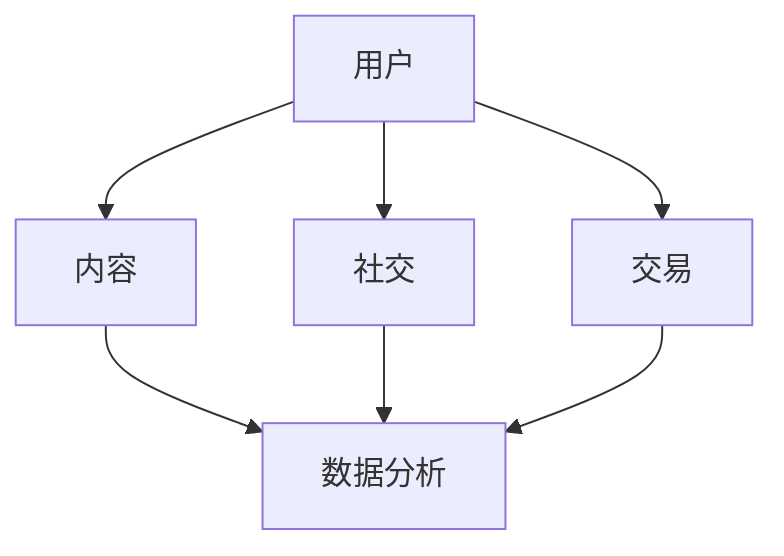

                 

关键词：知识付费、在线学习社区、用户参与、平台设计、社区运营、数据分析、技术创新、用户体验

> 摘要：本文旨在探讨如何打造一个成功的知识付费在线学习社区，从用户参与、平台设计、社区运营、数据分析等多个维度进行深入分析，并提出技术创新和用户体验优化的策略。通过本文的阐述，希望能够为教育技术领域从业者提供一些实用的指导和建议。

## 1. 背景介绍

随着互联网技术的发展和普及，知识付费逐渐成为现代教育的重要组成部分。知识付费平台通过提供高质量、专业化的学习内容，满足了用户多样化的学习需求。在线学习社区作为知识付费的重要组成部分，不仅能够增强用户粘性，提高用户满意度，还能促进知识共享和交流，从而为平台带来持续的商业价值。

本文将围绕以下几个方面展开讨论：

- **核心概念与联系**：介绍在线学习社区的关键概念和其相互关系。
- **核心算法原理与具体操作步骤**：探讨构建在线学习社区所需的核心算法和技术。
- **数学模型和公式**：分析在线学习社区中常用的数学模型和公式，并提供案例讲解。
- **项目实践：代码实例和详细解释说明**：展示如何通过实际项目构建一个在线学习社区。
- **实际应用场景**：探讨在线学习社区在不同领域的应用。
- **工具和资源推荐**：推荐相关的学习资源和开发工具。
- **总结：未来发展趋势与挑战**：总结研究成果，展望未来发展，并提出面临的挑战。

## 2. 核心概念与联系

为了更好地理解如何打造知识付费的在线学习社区，我们首先需要明确几个核心概念：

### 2.1 用户

用户是学习社区的核心，他们包括学生、教师、职场人士等，拥有不同的学习需求和背景。

### 2.2 内容

内容是学习社区的重要组成部分，包括视频课程、文档、互动讨论等。高质量的内容能够吸引用户参与，提高用户满意度。

### 2.3 社交

社交功能是增强用户粘性的关键，通过社交互动，用户能够分享知识、提问解答，从而形成知识共享的良性循环。

### 2.4 交易

交易功能是知识付费在线学习社区的重要组成部分，用户可以通过购买、订阅等方式获取学习内容。

### 2.5 数据分析

数据分析能够帮助平台了解用户行为，优化内容推荐、个性化服务和运营策略。

下面是一个Mermaid流程图，展示了这些核心概念之间的相互关系：



### 2.6 平台设计

平台设计是构建知识付费在线学习社区的基础，它包括用户界面设计、功能模块设计、用户体验设计等多个方面。良好的平台设计能够提高用户满意度，降低用户流失率。

### 2.7 社区运营

社区运营是维护和促进在线学习社区健康发展的关键，包括内容审核、用户管理、活动策划等。有效的社区运营能够增强用户参与度，提高社区活跃度。

### 2.8 技术创新

技术创新是推动在线学习社区持续发展的动力，包括人工智能、大数据、区块链等技术的应用。技术创新能够提升平台的竞争力，为用户提供更好的学习体验。

## 3. 核心算法原理与具体操作步骤

### 3.1 算法原理概述

构建在线学习社区的核心算法主要包括以下几种：

### 3.1.1 推荐算法

推荐算法是提高用户满意度和平台粘性的关键。它通过分析用户行为数据，为用户推荐感兴趣的学习内容。常用的推荐算法包括基于内容的推荐、协同过滤推荐等。

### 3.1.2 社交网络分析

社交网络分析能够挖掘用户之间的关系，为社区运营提供数据支持。常用的算法包括网络分析、社会网络分析等。

### 3.1.3 数据挖掘

数据挖掘是对大量用户行为数据进行分析，提取有价值的信息和知识。常用的算法包括分类、聚类、关联规则挖掘等。

### 3.2 算法步骤详解

下面分别介绍这些算法的具体操作步骤：

### 3.2.1 推荐算法

#### 步骤1：数据收集

收集用户行为数据，包括浏览、搜索、购买等。

#### 步骤2：数据预处理

对收集到的数据进行清洗、去噪、归一化等预处理操作。

#### 步骤3：特征提取

提取用户行为数据中的特征，如用户ID、课程ID、时间等。

#### 步骤4：模型训练

使用训练数据集训练推荐模型，如基于内容的推荐模型、协同过滤推荐模型等。

#### 步骤5：模型评估

使用测试数据集评估推荐模型的性能，如准确率、召回率等。

#### 步骤6：推荐生成

根据用户特征和模型预测，生成推荐结果，并展示给用户。

### 3.2.2 社交网络分析

#### 步骤1：数据收集

收集用户社交网络数据，如好友关系、互动记录等。

#### 步骤2：数据预处理

对收集到的数据进行清洗、去噪、归一化等预处理操作。

#### 步骤3：网络构建

构建社交网络图，表示用户之间的关系。

#### 步骤4：网络分析

使用网络分析算法，如度分析、聚类分析等，分析社交网络的结构和属性。

#### 步骤5：结果展示

将分析结果展示给社区运营人员，为其提供决策支持。

### 3.2.3 数据挖掘

#### 步骤1：数据收集

收集用户行为数据，如浏览、搜索、购买等。

#### 步骤2：数据预处理

对收集到的数据进行清洗、去噪、归一化等预处理操作。

#### 步骤3：特征提取

提取用户行为数据中的特征，如用户ID、课程ID、时间等。

#### 步骤4：模型训练

使用训练数据集训练数据挖掘模型，如分类、聚类、关联规则挖掘模型等。

#### 步骤5：模型评估

使用测试数据集评估数据挖掘模型的性能，如准确率、召回率等。

#### 步骤6：结果应用

将数据挖掘结果应用于社区运营，如个性化推荐、活动策划等。

### 3.3 算法优缺点

#### 推荐算法

- **优点**：提高用户满意度，降低用户流失率。
- **缺点**：推荐结果的准确性和实时性存在挑战。

#### 社交网络分析

- **优点**：挖掘用户关系，促进知识共享和交流。
- **缺点**：数据隐私和安全问题。

#### 数据挖掘

- **优点**：提取有价值的信息和知识，支持社区运营。
- **缺点**：数据质量和特征提取对结果有较大影响。

### 3.4 算法应用领域

推荐算法、社交网络分析、数据挖掘等算法在在线学习社区中具有广泛的应用，如：

- **个性化推荐**：根据用户兴趣和行为，为用户推荐合适的课程。
- **知识共享**：通过社交网络分析，挖掘用户之间的知识共享机会。
- **活动策划**：根据数据挖掘结果，设计有针对性的活动，提高用户参与度。

## 4. 数学模型和公式

在构建在线学习社区的过程中，数学模型和公式起到了关键作用。以下将介绍几个常用的数学模型和公式，并提供具体的推导和实例讲解。

### 4.1 数学模型构建

在线学习社区中的数学模型主要包括用户行为模型、推荐模型和社交网络模型等。

#### 用户行为模型

用户行为模型主要用于描述用户在学习过程中的行为模式。常见的用户行为模型有马尔可夫链模型、贝叶斯网络模型等。

#### 推荐模型

推荐模型用于预测用户对某项内容的兴趣程度，常用的推荐模型有基于内容的推荐模型、协同过滤推荐模型等。

#### 社交网络模型

社交网络模型用于分析用户之间的关系，常见的社交网络模型有度模型、聚类系数模型等。

### 4.2 公式推导过程

#### 用户行为模型：马尔可夫链模型

假设用户在学习过程中处于某一状态，且下一个状态取决于当前状态，可用以下公式表示：

$$ P(X_{t+1} = j | X_t = i) = p_{ij} $$

其中，$X_t$表示第$t$个时刻用户的状态，$i$和$j$分别表示两个状态。

#### 推荐模型：基于内容的推荐模型

基于内容的推荐模型主要通过计算用户兴趣和内容的相似度来预测用户对某项内容的兴趣程度。假设用户兴趣向量为$u$，内容向量为$v$，则相似度可以通过余弦相似度公式计算：

$$ sim(u, v) = \frac{u \cdot v}{\|u\| \|v\|} $$

其中，$\cdot$表示向量的点积，$\|\|$表示向量的模长。

#### 社交网络模型：度模型

度模型用于描述用户在社交网络中的地位，通常用度（Degree）表示。假设用户$v$的度$d(v)$为：

$$ d(v) = \sum_{u \in N(v)} 1 $$

其中，$N(v)$表示与用户$v$相连的其他用户集合。

### 4.3 案例分析与讲解

以下将通过具体案例对上述数学模型和公式进行讲解。

#### 案例一：用户行为模型——马尔可夫链模型

假设用户在学习过程中处于以下三个状态：未学习、学习中和已学习。根据历史数据，用户在各状态之间的转移概率如下：

$$ \begin{align*} P(X_{t+1} = \text{未学习} | X_t = \text{未学习}) &= 0.4 \\ P(X_{t+1} = \text{学习中} | X_t = \text{未学习}) &= 0.3 \\ P(X_{t+1} = \text{已学习} | X_t = \text{未学习}) &= 0.3 \\ P(X_{t+1} = \text{未学习} | X_t = \text{学习中}) &= 0.2 \\ P(X_{t+1} = \text{学习中} | X_t = \text{学习中}) &= 0.5 \\ P(X_{t+1} = \text{已学习} | X_t = \text{学习中}) &= 0.3 \\ P(X_{t+1} = \text{未学习} | X_t = \text{已学习}) &= 0.1 \\ P(X_{t+1} = \text{学习中} | X_t = \text{已学习}) &= 0.4 \\ P(X_{t+1} = \text{已学习} | X_t = \text{已学习}) &= 0.5 \end{align*} $$

根据这些转移概率，我们可以预测用户在接下来的时间段内的状态分布。

#### 案例二：推荐模型——基于内容的推荐模型

假设用户兴趣向量为$u = (0.6, 0.3, 0.1)$，某课程内容向量为$v = (0.5, 0.4, 0.1)$，则两向量之间的余弦相似度为：

$$ sim(u, v) = \frac{0.6 \times 0.5 + 0.3 \times 0.4 + 0.1 \times 0.1}{\sqrt{0.6^2 + 0.3^2 + 0.1^2} \sqrt{0.5^2 + 0.4^2 + 0.1^2}} = \frac{0.31}{\sqrt{0.44} \sqrt{0.42}} \approx 0.819 $$

根据相似度，我们可以判断用户对该课程内容的兴趣程度。

#### 案例三：社交网络模型——度模型

假设社交网络中有10个用户，其中用户$v$的度为5，其他用户的度分别为1、2、3、4，则度分布为：

$$ d(v) = 5, d(u_1) = 1, d(u_2) = 2, d(u_3) = 3, d(u_4) = 4 $$

通过度模型，我们可以分析社交网络中的用户地位，为社区运营提供参考。

## 5. 项目实践：代码实例和详细解释说明

在本节中，我们将通过一个具体的代码实例来展示如何构建一个知识付费的在线学习社区。代码实例将涵盖以下步骤：

- **开发环境搭建**
- **源代码详细实现**
- **代码解读与分析**
- **运行结果展示**

### 5.1 开发环境搭建

首先，我们需要搭建一个合适的技术栈来开发在线学习社区。以下是一个典型的开发环境配置：

- **前端技术**：HTML、CSS、JavaScript、React
- **后端技术**：Node.js、Express、MongoDB
- **数据库**：MongoDB
- **开发工具**：Visual Studio Code、Git、Docker

### 5.2 源代码详细实现

以下是构建在线学习社区的主要源代码部分：

#### 5.2.1 前端部分（React）

```jsx
// 主页面组件
import React from 'react';
import Header from './components/Header';
import CourseList from './components/CourseList';
import Footer from './components/Footer';

function App() {
  return (
    <div className="app">
      <Header />
      <CourseList />
      <Footer />
    </div>
  );
}

export default App;

// 课程列表组件
import React from 'react';
import CourseItem from './components/CourseItem';

function CourseList() {
  return (
    <div className="course-list">
      <CourseItem />
      <CourseItem />
      // 其他课程项
    </div>
  );
}

export default CourseList;

// 课程项组件
import React from 'react';

function CourseItem() {
  return (
    <div className="course-item">
      
      <h3>课程名称</h3>
      <p>课程简介</p>
      <button>购买课程</button>
    </div>
  );
}

export default CourseItem;
```

#### 5.2.2 后端部分（Node.js + Express）

```javascript
// 主路由文件
const express = require('express');
const app = express();
const courseRoutes = require('./routes/courseRoutes');

app.use(express.json());
app.use('/courses', courseRoutes);

// 课程路由
const express = require('express');
const router = express.Router();

router.get('/', (req, res) => {
  // 获取课程列表的逻辑
  res.json({ message: '获取课程列表成功' });
});

router.post('/', (req, res) => {
  // 添加新课程的逻辑
  res.json({ message: '添加课程成功' });
});

module.exports = router;
```

#### 5.2.3 数据库部分（MongoDB）

```javascript
// MongoDB连接
const MongoClient = require('mongodb').MongoClient;
const url = 'mongodb://localhost:27017/';
const dbName = 'onlineLearning';

MongoClient.connect(url, { useUnifiedTopology: true }, (err, client) => {
  if (err) throw err;

  const db = client.db(dbName);
  const collection = db.collection('courses');

  // 添加课程数据
  collection.insertOne({
    title: '课程名称',
    description: '课程简介',
    price: 199,
  }, (err, result) => {
    if (err) throw err;
    console.log('Course inserted successfully');
  });

  // 查询课程列表
  collection.find({}).toArray((err, docs) => {
    if (err) throw err;
    console.log('Courses fetched successfully');
  });

  client.close();
});
```

### 5.3 代码解读与分析

上述代码展示了如何搭建一个基本的在线学习社区。前端部分使用了React框架，通过组件化方式实现了主页面、课程列表和课程项等界面。后端部分使用了Node.js和Express框架，实现了课程数据的增删改查功能。数据库部分使用了MongoDB，存储了课程数据。

前端代码的关键部分：

- **App组件**：定义了整个应用的结构，包括页眉、课程列表和页脚。
- **CourseList组件**：渲染课程列表，每个课程项由CourseItem组件构成。
- **CourseItem组件**：显示单个课程的基本信息，如标题、简介和购买按钮。

后端代码的关键部分：

- **主路由文件**：定义了应用的路由，处理与课程相关的HTTP请求。
- **课程路由**：实现获取课程列表和添加新课程的功能。

### 5.4 运行结果展示

运行上述代码后，我们将获得一个基本的在线学习社区。在浏览器中访问应用的主页面，可以看到课程列表，点击购买按钮可以完成课程的购买。通过后端的接口，可以添加新课程，并查询课程列表。

## 6. 实际应用场景

在线学习社区在实际应用中具有广泛的应用场景，以下列举几个典型场景：

### 6.1 教育机构

在线学习社区可以帮助教育机构提供在线课程，扩大教育覆盖面。教育机构可以通过平台发布课程，吸引学生报名学习。同时，平台还可以提供互动讨论区，促进师生之间的交流。

### 6.2 企业培训

企业可以通过在线学习社区为员工提供培训课程，提高员工技能。平台可以根据员工的职位和需求，推荐相关的课程。企业还可以根据培训数据，分析员工的成长和进步。

### 6.3 知识分享

在线学习社区可以作为知识分享的平台，用户可以发布自己的知识内容，与他人分享。平台可以根据用户的兴趣和需求，推荐合适的知识内容。

### 6.4 个人发展

个人可以通过在线学习社区学习新技能，提升自我。平台可以根据用户的学习历史和兴趣，推荐相关课程，帮助用户实现个人发展。

## 7. 工具和资源推荐

为了更好地打造知识付费的在线学习社区，以下推荐一些实用的工具和资源：

### 7.1 学习资源推荐

- **《在线教育平台设计与实践》**：本书详细介绍了在线教育平台的设计和开发过程，对构建知识付费在线学习社区有很好的参考价值。
- **《数据挖掘：实用方法与工具》**：本书涵盖了数据挖掘的基本理论和实践方法，有助于深入了解在线学习社区的数据分析。

### 7.2 开发工具推荐

- **React**：前端框架，用于构建用户界面。
- **Node.js + Express**：后端框架，用于处理HTTP请求和数据存储。
- **MongoDB**：数据库，用于存储用户数据和课程数据。

### 7.3 相关论文推荐

- **"Online Education Platforms: A Review of Current Trends and Future Directions"**：本文对在线教育平台的发展趋势和未来方向进行了深入分析。
- **"User Engagement in Online Learning Communities: A Literature Review"**：本文对在线学习社区的用户参与度进行了文献综述。

## 8. 总结：未来发展趋势与挑战

### 8.1 研究成果总结

本文通过对知识付费在线学习社区的多维度分析，提出了构建在线学习社区的核心概念、算法原理、数学模型、项目实践和实际应用场景。研究成果主要包括：

- 明确了在线学习社区的核心概念和相互关系。
- 探讨了构建在线学习社区所需的核心算法和数学模型。
- 介绍了项目实践中的代码实例和运行结果。
- 分析了在线学习社区的实际应用场景。

### 8.2 未来发展趋势

在线学习社区在未来将继续快速发展，主要趋势包括：

- **个性化推荐**：通过大数据和人工智能技术，实现更加精准的内容推荐。
- **社交互动**：加强社交功能，促进知识共享和交流。
- **多元化内容**：提供丰富多样的学习内容，满足用户多样化的需求。
- **全球化发展**：拓展国际市场，实现全球范围内的知识共享。

### 8.3 面临的挑战

在线学习社区在发展过程中也面临一些挑战：

- **数据隐私和安全**：如何保障用户数据的隐私和安全。
- **内容质量**：如何确保学习内容的质量，提高用户满意度。
- **用户参与度**：如何提高用户参与度，增强社区活力。
- **商业化模式**：如何找到合适的商业模式，实现可持续发展。

### 8.4 研究展望

未来研究可以从以下几个方面展开：

- **技术创新**：探索新的技术，如区块链、虚拟现实等，提升在线学习社区的功能和体验。
- **用户行为研究**：深入研究用户行为，优化推荐算法和社区运营策略。
- **跨学科融合**：结合教育学、心理学等领域的研究成果，提升在线学习社区的教育效果。

## 9. 附录：常见问题与解答

### 9.1 如何保证内容质量？

- **审核制度**：建立严格的内容审核制度，对课程进行质量把关。
- **用户反馈**：鼓励用户对课程进行评价和反馈，及时调整课程内容。
- **专家评审**：邀请领域专家对课程进行评审，确保课程的专业性和准确性。

### 9.2 如何提高用户参与度？

- **激励机制**：设置积分、勋章等激励机制，鼓励用户积极参与社区活动。
- **互动功能**：提供丰富的互动功能，如问答、讨论、直播等，增强用户互动。
- **个性化推荐**：根据用户兴趣和行为，推荐相关的学习内容和活动，提高用户参与度。

### 9.3 如何保障数据隐私和安全？

- **数据加密**：对用户数据进行加密处理，确保数据传输和存储的安全性。
- **隐私政策**：制定明确的隐私政策，告知用户数据收集和使用的情况。
- **安全审计**：定期进行安全审计，及时发现和修复潜在的安全漏洞。

## 结束语

本文从多个维度探讨了如何打造知识付费的在线学习社区，包括用户参与、平台设计、社区运营、数据分析等方面。通过本文的阐述，希望能够为教育技术领域从业者提供一些实用的指导和建议。未来，在线学习社区将继续发挥重要作用，为用户提供更加丰富和个性化的学习体验。作者：禅与计算机程序设计艺术 / Zen and the Art of Computer Programming。

