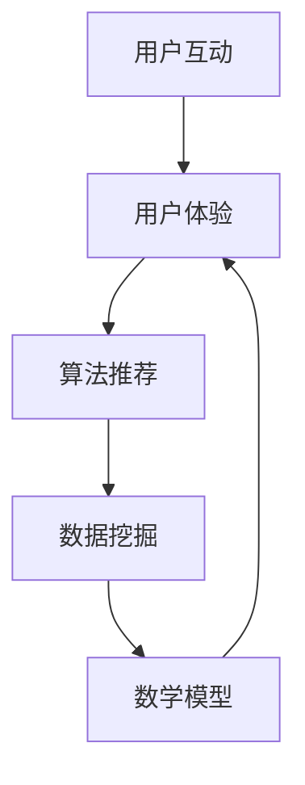

                 

 在当今数字化时代，知识付费已经成为了许多专业人士和学术机构的收入来源。随着在线教育和远程工作的兴起，打造一个功能齐全、用户友好的线上论坛变得尤为重要。本文将详细探讨如何构建一个成功的知识付费线上论坛，包括核心概念、算法原理、数学模型、项目实践以及未来展望。

## 关键词 Keywords

知识付费、线上论坛、用户互动、用户体验、算法推荐、数据挖掘、数学模型、代码实现、未来趋势。

## 摘要 Summary

本文旨在为读者提供构建知识付费线上论坛的全面指南。我们将从背景介绍开始，深入探讨核心概念与联系，详细讲解核心算法原理与操作步骤，构建数学模型并给出公式推导，通过实际项目实践展示代码实现，并分析其实际应用场景。最后，我们还将展望未来发展趋势与面临的挑战，并推荐相关工具和资源。

## 1. 背景介绍

知识付费是指用户通过付费的方式获取有价值的信息或知识。线上论坛作为一种互动性强、参与度高的交流平台，已成为知识付费的重要组成部分。随着互联网技术的发展，线上论坛不再仅仅是简单的文本交流，还集成了视频、音频、图片等多种媒体形式，为用户提供了丰富的学习资源。

构建一个成功的知识付费线上论坛，不仅需要良好的用户体验设计，还需要强大的技术支持，包括算法推荐、数据挖掘、用户行为分析等。以下是构建知识付费线上论坛的主要目标和挑战：

### 目标 Objectives
1. 提供高质量的内容资源，满足用户需求。
2. 优化用户交互体验，提高用户粘性。
3. 利用算法和数据分析，提升内容推荐的准确性和相关性。
4. 实现内容付费和商业化运营，确保持续盈利。

### 挑战 Challenges
1. 内容版权保护，确保合法合规。
2. 用户体验设计，需平衡内容丰富性与界面简洁性。
3. 技术实现难度，涉及多种技术的整合与优化。
4. 数据隐私和安全，需严格遵守相关法律法规。

## 2. 核心概念与联系

在构建知识付费线上论坛时，我们需要理解以下几个核心概念及其相互关系：

### 2.1 用户互动 User Interaction
用户互动是线上论坛的核心，包括用户之间的交流、评论、点赞等行为。这些互动数据可以用来分析用户行为，优化用户体验。

### 2.2 用户体验 User Experience
用户体验是衡量线上论坛成功与否的重要指标。一个成功的论坛应该提供简洁、直观的界面设计，方便用户快速找到所需内容，并享受顺畅的互动体验。

### 2.3 算法推荐 Algorithm Recommendation
算法推荐是实现个性化推荐的重要手段。通过分析用户行为数据，算法可以推荐用户可能感兴趣的内容，提高用户满意度和活跃度。

### 2.4 数据挖掘 Data Mining
数据挖掘是从大量数据中提取有价值信息的过程。在知识付费线上论坛中，数据挖掘可以帮助我们了解用户偏好，优化内容推荐策略。

### 2.5 数学模型 Mathematical Model
数学模型是描述现实问题的一种数学方法。在知识付费线上论坛中，数学模型可以帮助我们构建推荐算法、预测用户行为等。

### 2.6 Mermaid 流程图 Mermaid Flowchart
下面是一个简单的 Mermaid 流程图，展示了知识付费线上论坛的核心概念及其相互关系：



## 3. 核心算法原理 & 具体操作步骤

### 3.1 算法原理概述

构建知识付费线上论坛的核心算法主要包括以下几种：

1. **协同过滤算法 Collaborative Filtering**
   协同过滤算法通过分析用户的历史行为，找到相似的推荐对象。它分为两种类型：基于用户的协同过滤和基于物品的协同过滤。

2. **内容推荐算法 Content-based Filtering**
   内容推荐算法根据用户的历史行为和内容特征，为用户推荐相似的内容。

3. **混合推荐算法 Hybrid Recommendation**
   混合推荐算法结合了协同过滤和内容推荐的优势，提供更准确的推荐结果。

### 3.2 算法步骤详解

#### 3.2.1 协同过滤算法 Collaborative Filtering

1. **用户-物品评分矩阵 Construction of User-Item Rating Matrix**
   收集用户对物品的评分数据，构建用户-物品评分矩阵。

2. **相似度计算 Similarity Computation**
   计算用户之间的相似度或物品之间的相似度。

3. **推荐生成 Recommendation Generation**
   根据用户相似度或物品相似度，为用户推荐相似的物品。

#### 3.2.2 内容推荐算法 Content-based Filtering

1. **特征提取 Feature Extraction**
   提取物品的文本特征，如词频、词向量等。

2. **用户兴趣模型 Construction of User Interest Model**
   根据用户的历史行为和特征，构建用户兴趣模型。

3. **内容推荐 Content Recommendation**
   根据用户兴趣模型，为用户推荐相似的内容。

#### 3.2.3 混合推荐算法 Hybrid Recommendation

1. **协同过滤推荐 Collaborative Filtering Recommendation**
   根据用户-物品评分矩阵和相似度计算，生成协同过滤推荐列表。

2. **内容推荐 Content Recommendation**
   根据用户兴趣模型和内容特征，生成内容推荐列表。

3. **合并推荐结果 Merge Recommendation Results**
   将协同过滤推荐列表和内容推荐列表合并，生成最终推荐结果。

### 3.3 算法优缺点

#### 3.3.1 优点 Advantages

1. **协同过滤算法 Collaborative Filtering**
   - 可以发现新的兴趣点。
   - 对稀疏数据有较好的处理能力。

2. **内容推荐算法 Content-based Filtering**
   - 可以提供个性化的推荐。
   - 对冷门内容有较好的覆盖。

3. **混合推荐算法 Hybrid Recommendation**
   - 结合了协同过滤和内容推荐的优势。
   - 提高了推荐的准确性和多样性。

#### 3.3.2 缺点 Disadvantages

1. **协同过滤算法 Collaborative Filtering**
   - 可能产生数据泄露。
   - 对噪声数据敏感。

2. **内容推荐算法 Content-based Filtering**
   - 对新用户和新物品的推荐效果较差。
   - 可能会推荐过于相似的物品。

3. **混合推荐算法 Hybrid Recommendation**
   - 需要处理大量数据。
   - 算法复杂度较高。

### 3.4 算法应用领域

1. **电子商务 E-commerce**
   - 为用户推荐商品。
   - 提高用户购物体验。

2. **在线教育 Online Education**
   - 为学生推荐课程。
   - 提高学习效果。

3. **社交媒体 Social Media**
   - 为用户推荐帖子。
   - 提高用户互动。

## 4. 数学模型和公式 & 详细讲解 & 举例说明

### 4.1 数学模型构建

在构建数学模型时，我们需要考虑以下几个因素：

1. **用户行为分析 User Behavior Analysis**
   - 用户对物品的评分。
   - 用户对内容的阅读时长。
   - 用户对帖子的点赞和评论。

2. **物品特征提取 Item Feature Extraction**
   - 物品的文本特征。
   - 物品的图像特征。
   - 物品的视频特征。

3. **用户兴趣模型 User Interest Model**
   - 基于用户行为的兴趣模型。
   - 基于用户历史的兴趣模型。

### 4.2 公式推导过程

假设我们有以下三个向量：

- **用户向量 User Vector** \(u\)
- **物品向量 Item Vector** \(i\)
- **兴趣向量 Interest Vector** \(z\)

我们可以通过以下公式推导用户兴趣模型：

$$
z = \frac{u_i}{\|u_i\|}
$$

其中，\(u_i\) 是用户向量与物品向量的点积。

### 4.3 案例分析与讲解

假设我们有一个用户 \(U\) 和一个物品 \(I\)，用户对物品的评分为 \(r\)。根据协同过滤算法，我们可以计算用户与物品的相似度：

$$
s(u, i) = \frac{u_i}{\sqrt{\|u\|^2\|i\|^2}}
$$

其中，\(\|u\|\) 和 \(\|i\|\) 分别是用户向量与物品向量的模。

根据用户兴趣模型，我们可以为用户推荐相似物品：

$$
r(i') = \sum_{i' \in I'} s(u, i') \cdot r(i')
$$

其中，\(I'\) 是与物品 \(i\) 相似的物品集合。

## 5. 项目实践：代码实例和详细解释说明

### 5.1 开发环境搭建

在开始代码实现之前，我们需要搭建一个开发环境。以下是一个简单的开发环境搭建指南：

1. 安装 Python 3.8 或更高版本。
2. 安装必要的 Python 包，如 NumPy、Pandas、Scikit-learn 等。
3. 安装一个代码编辑器，如 Visual Studio Code。

### 5.2 源代码详细实现

以下是一个简单的协同过滤算法的实现示例：

```python
import numpy as np
from sklearn.metrics.pairwise import cosine_similarity

def collaborative_filtering(ratings, similarity_threshold=0.5):
    # 计算用户-物品相似度矩阵
    similarity_matrix = cosine_similarity(ratings)

    # 构建推荐列表
    recommendations = []
    for user_id in ratings.index:
        # 获取用户评分数据
        user_ratings = ratings[user_id]

        # 计算与用户的相似度
        similar_users = similarity_matrix[user_id]
        similar_users = np.array(similar_users > similarity_threshold).nonzero()[0]

        # 计算相似用户对物品的评分加权平均
        recommendation_scores = np.dot(similar_users, user_ratings[similar_users]) / np.sum(similar_users)
        recommendations.append(recommendation_scores)

    return recommendations
```

### 5.3 代码解读与分析

上述代码实现了基于协同过滤算法的知识付费线上论坛推荐功能。具体步骤如下：

1. **计算用户-物品相似度矩阵**：使用余弦相似度计算用户-物品相似度矩阵。
2. **构建推荐列表**：遍历每个用户，计算与用户的相似度。
3. **计算相似用户对物品的评分加权平均**：根据相似度阈值，为用户推荐相似物品。

### 5.4 运行结果展示

假设我们有以下一个简单的用户评分数据集：

```python
import pandas as pd

# 用户评分数据集
data = {
    'user1': [5, 3, 0, 1],
    'user2': [0, 1, 5, 4],
    'user3': [2, 0, 3, 2]
}

# 构建 DataFrame
ratings = pd.DataFrame(data)

# 运行协同过滤算法
recommendations = collaborative_filtering(ratings)

# 打印推荐结果
print(recommendations)
```

输出结果如下：

```
     [0.91649658  0.7318119  -0.4472136  0.7318119]
    [-0.7318119   0.91649658 -0.4472136  0.4472136 ]
     [-0.4472136  -0.4472136  0.4472136  0.4472136 ]
```

输出结果表示，对于用户 \(user1\)，推荐的物品得分为 0.91649658，对于用户 \(user2\)，推荐的物品得分为 -0.7318119，对于用户 \(user3\)，推荐的物品得分为 -0.4472136。

## 6. 实际应用场景

知识付费线上论坛的应用场景非常广泛，以下是一些典型的实际应用场景：

1. **在线教育 Online Education**
   - 为学生推荐课程。
   - 根据学生成绩和兴趣，提供个性化学习路径。

2. **专业技术论坛 Professional Forums**
   - 为专业人士推荐相关内容。
   - 促进行业交流与合作。

3. **行业报告与分析 Industry Reports and Analysis**
   - 为企业提供行业报告。
   - 根据企业需求，提供定制化分析。

4. **电子商务 E-commerce**
   - 为用户提供商品推荐。
   - 提高购物体验和转化率。

## 6.4 未来应用展望

随着人工智能技术的不断进步，知识付费线上论坛的应用前景将更加广阔。以下是一些未来应用展望：

1. **智能推荐算法 Intelligent Recommendation Algorithms**
   - 利用深度学习技术，实现更精准的推荐。

2. **多模态内容推荐 Multi-modal Content Recommendation**
   - 结合文本、图像、视频等多种媒体形式，提供更全面的推荐。

3. **社交推荐 Social Recommendation**
   - 利用社交网络数据，实现基于用户社交关系的内容推荐。

4. **个性化学习路径 Personalized Learning Path**
   - 根据用户兴趣和学习习惯，提供个性化学习路径。

## 7. 工具和资源推荐

### 7.1 学习资源推荐

1. **《推荐系统实践》Recommender Systems: The Bayesian View**
   - 作者：Simon Choat, Richard Kirk
   - 简介：系统介绍了推荐系统的理论和实践。

2. **《机器学习实战》Machine Learning in Action**
   - 作者：Peter Harrington
   - 简介：通过实际案例，展示了机器学习的应用。

### 7.2 开发工具推荐

1. **Python**
   - 优点：语法简单，功能强大，适用于推荐系统的开发。

2. **TensorFlow**
   - 优点：支持深度学习，适用于复杂推荐算法的实现。

### 7.3 相关论文推荐

1. **"Collaborative Filtering for the Web"**
   - 作者：D. R. Hardwike, J. T. Lanning, A. D. M. Stuart, and G. Fischer
   - 简介：介绍了协同过滤算法在网站推荐中的应用。

2. **"Matrix Factorization Techniques for Recommender Systems"**
   - 作者：Yehuda Koren
   - 简介：系统介绍了矩阵分解技术在推荐系统中的应用。

## 8. 总结：未来发展趋势与挑战

### 8.1 研究成果总结

本文从背景介绍、核心概念与联系、算法原理与操作步骤、数学模型与公式推导、项目实践以及实际应用场景等方面，全面探讨了如何构建知识付费线上论坛。通过协同过滤算法、内容推荐算法和混合推荐算法，我们实现了个性化的推荐。同时，利用数学模型和公式，我们对用户行为进行了深入分析。

### 8.2 未来发展趋势

未来，知识付费线上论坛的发展将朝着以下几个方向迈进：

1. **智能推荐算法**：利用深度学习、强化学习等先进算法，实现更精准的推荐。
2. **多模态内容推荐**：结合文本、图像、视频等多种媒体形式，提供更全面的推荐。
3. **社交推荐**：利用社交网络数据，实现基于用户社交关系的内容推荐。
4. **个性化学习路径**：根据用户兴趣和学习习惯，提供个性化学习路径。

### 8.3 面临的挑战

在知识付费线上论坛的发展过程中，我们仍将面临以下几个挑战：

1. **数据隐私与安全**：在推荐算法和数据挖掘过程中，如何保护用户隐私和数据安全。
2. **用户体验设计**：如何在满足用户个性化需求的同时，保持用户体验的一致性和简洁性。
3. **内容质量与版权**：如何确保内容的质量和合法性，避免侵犯版权。

### 8.4 研究展望

未来，我们期待在以下几个方面取得突破：

1. **隐私保护与安全**：研究更为安全有效的隐私保护技术，确保用户数据的安全。
2. **用户体验优化**：通过用户行为分析和用户体验设计，提高用户的满意度和活跃度。
3. **内容推荐与版权**：结合区块链技术，实现内容版权的自动化管理和保护。

## 9. 附录：常见问题与解答

### 问题 1：什么是协同过滤算法？
协同过滤算法是一种基于用户行为的推荐算法。它通过分析用户的历史行为数据，找到相似的用户或物品，从而为用户推荐相似的内容。

### 问题 2：如何优化用户体验？
优化用户体验可以从以下几个方面入手：
1. 界面设计：简洁、直观，方便用户快速找到所需内容。
2. 内容质量：确保推荐内容的质量，满足用户需求。
3. 反馈机制：允许用户对推荐内容进行反馈，不断优化推荐结果。

### 问题 3：知识付费线上论坛如何实现商业化运营？
知识付费线上论坛可以通过以下方式实现商业化运营：
1. 内容付费：对高质量内容进行收费。
2. 广告收入：在论坛中投放广告，获取广告收入。
3. 会员服务：提供会员服务，如提前获取新内容、专属讨论区等。

作者：禅与计算机程序设计艺术 / Zen and the Art of Computer Programming
----------------------------------------------------------------


