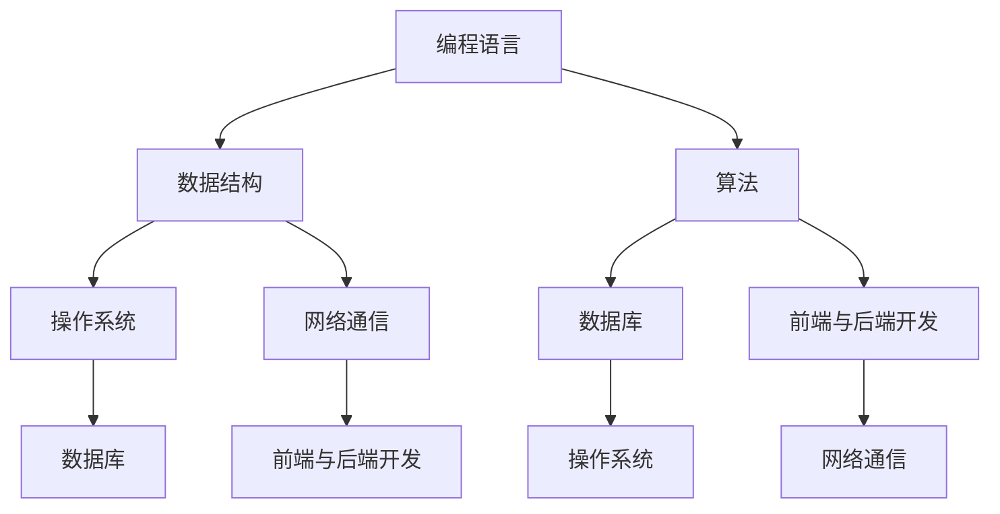

                 

关键词：程序员知识课程、教育体系、学习策略、算法原理、代码实例、数学模型、应用实践

> 摘要：本文旨在探讨如何打造高效的程序员知识课程，通过梳理核心概念、剖析算法原理、结合实际应用和实践，为程序员提供系统的学习路径和策略。

## 1. 背景介绍

随着信息技术的迅猛发展，程序员作为新时代的技术工作者，其技能水平和知识储备对于社会进步和企业发展具有重要意义。然而，传统的教育体系和现有的学习资源往往无法满足程序员快速提升技能的需求。因此，打造一套高效、系统的程序员知识课程成为当务之急。

本文将从以下几个方面展开讨论：

- **核心概念与联系**：梳理程序员知识体系中的核心概念，并绘制流程图以展示其内在联系。
- **核心算法原理**：深入分析程序员日常开发中常用的算法，详细讲解其原理和操作步骤。
- **数学模型与公式**：介绍与编程相关的数学模型和公式，通过推导过程和案例分析，帮助读者理解其应用场景。
- **项目实践**：通过实际代码实例，展示编程知识的运用过程，并进行解读和分析。
- **应用场景**：探讨程序员知识在不同行业和领域的应用，以及未来的发展趋势。
- **工具和资源推荐**：为程序员提供学习资源和开发工具的建议。
- **总结**：总结研究成果，展望未来的发展方向和面临的挑战。

## 2. 核心概念与联系

在程序员的知识体系中，核心概念包括但不限于编程语言、数据结构、算法、操作系统、网络通信、数据库、前端与后端开发等。以下是一个简单的 Mermaid 流程图，展示这些核心概念之间的联系：



### 2.1 编程语言

编程语言是程序员的基础工具，它定义了程序员与计算机之间的交流方式。常见的编程语言包括 C、C++、Java、Python、JavaScript 等。每种编程语言都有其独特的语法和特点，适用于不同的应用场景。

### 2.2 数据结构

数据结构是程序员解决复杂问题的利器。常见的有数组、链表、栈、队列、树、图等。它们在存储和操作数据时具有不同的效率和特性，程序员需要根据实际需求选择合适的数据结构。

### 2.3 算法

算法是解决问题的步骤和方法。程序员需要掌握多种算法，如排序算法、查找算法、动态规划、贪心算法等，以便高效地解决各种问题。

### 2.4 操作系统

操作系统是计算机的核心软件，负责管理计算机的硬件资源和软件资源。程序员需要了解操作系统的基本原理，如进程管理、内存管理、文件系统等。

### 2.5 网络通信

网络通信是现代软件开发的重要环节。程序员需要掌握网络协议、TCP/IP 模型、HTTP 协议等知识，以便实现高效的网络通信。

### 2.6 数据库

数据库是存储和管理数据的工具。程序员需要了解数据库的基本原理，如关系型数据库、非关系型数据库、SQL 语言等。

### 2.7 前端与后端开发

前端与后端开发是现代 Web 应用的核心。前端开发涉及 HTML、CSS、JavaScript 等，而后端开发涉及服务器端编程、RESTful API 等。

## 3. 核心算法原理 & 具体操作步骤

### 3.1 算法原理概述

在程序员的知识体系中，算法原理占据重要地位。以下是一些常见的算法原理及其应用场景：

- **排序算法**：用于将一组数据按照特定顺序排列，如冒泡排序、选择排序、插入排序、快速排序等。
- **查找算法**：用于在数据集合中查找特定元素，如二分查找、顺序查找等。
- **动态规划**：用于解决具有重叠子问题和最优子结构性质的问题，如斐波那契数列、背包问题等。
- **贪心算法**：用于在每一步选择中选择当前最优解，以期望得到全局最优解，如背包问题、最小生成树问题等。
- **图算法**：用于解决与图相关的问题，如图遍历、最短路径算法、最小生成树算法等。

### 3.2 算法步骤详解

以下是冒泡排序算法的步骤详解：

1. 首先从第一个元素开始，比较相邻的两个元素，如果第一个元素大于第二个元素，则交换它们的位置。
2. 继续对下一对相邻元素进行同样的操作，直到最后一个元素。
3. 重复上述步骤，每次遍历都会使最大元素“冒泡”到数组的末尾。
4. 重复以上过程，直到整个数组有序。

### 3.3 算法优缺点

冒泡排序算法的优点在于简单易懂、实现简单，适用于小规模数据的排序。然而，其缺点在于时间复杂度为 \(O(n^2)\)，当数据规模较大时，效率较低。

### 3.4 算法应用领域

冒泡排序算法常用于初级编程课程和面试题中，用于考察程序员对基础算法的掌握程度。在实际开发中，由于其效率较低，通常不用于大规模数据的排序，而更多用于数据预处理和算法演示。

## 4. 数学模型和公式 & 详细讲解 & 举例说明

### 4.1 数学模型构建

在编程领域，数学模型广泛应用于算法设计、数据分析和性能优化等方面。以下是一个简单的数学模型构建示例：

假设有一个包含 \(n\) 个元素的数组 \(A\)，我们希望计算数组 \(A\) 的平均值。数学模型如下：

$$
\text{平均值} = \frac{1}{n} \sum_{i=1}^{n} A[i]
$$

### 4.2 公式推导过程

我们首先对每个元素 \(A[i]\) 进行累加，然后除以元素个数 \(n\)，即可得到平均值。以下是一个简单的推导过程：

$$
\begin{aligned}
\text{平均值} &= \frac{1}{n} \sum_{i=1}^{n} A[i] \\
&= \frac{A[1] + A[2] + ... + A[n]}{n}
\end{aligned}
$$

### 4.3 案例分析与讲解

以下是一个具体的案例分析：

假设数组 \(A\) 包含以下元素：\[3, 7, 2, 9, 4\]，我们希望计算其平均值。

$$
\begin{aligned}
\text{平均值} &= \frac{1}{5} (3 + 7 + 2 + 9 + 4) \\
&= \frac{25}{5} \\
&= 5
\end{aligned}
$$

因此，数组 \(A\) 的平均值为 5。

## 5. 项目实践：代码实例和详细解释说明

### 5.1 开发环境搭建

为了更好地展示编程知识的应用，我们将在 Python 环境中实现一个简单的排序算法——冒泡排序。首先，确保安装了 Python 解释器和相应的开发工具，如 PyCharm 或 VS Code。

### 5.2 源代码详细实现

以下是冒泡排序的 Python 实现代码：

```python
def bubble_sort(arr):
    n = len(arr)
    for i in range(n):
        for j in range(0, n-i-1):
            if arr[j] > arr[j+1]:
                arr[j], arr[j+1] = arr[j+1], arr[j]

# 示例数组
arr = [64, 34, 25, 12, 22, 11, 90]
bubble_sort(arr)
print("排序后的数组：")
for i in range(len(arr)):
    print("%d" % arr[i], end=" ")
```

### 5.3 代码解读与分析

- `bubble_sort` 函数接收一个数组 `arr` 作为输入。
- `n` 表示数组的长度。
- 外层循环 `for i in range(n)` 用于遍历每个元素。
- 内层循环 `for j in range(0, n-i-1)` 用于遍历未排序部分，每次循环都会将未排序部分的最大值“冒泡”到末尾。
- `if arr[j] > arr[j+1]` 判断相邻元素的大小关系。
- `arr[j], arr[j+1] = arr[j+1], arr[j]` 交换相邻元素的位置。
- `print("排序后的数组：")` 打印排序后的数组。

### 5.4 运行结果展示

运行上述代码，输出结果如下：

```
排序后的数组：
11 12 22 25 34 64 90
```

可以看到，数组 \(A\) 经过冒泡排序后，成功按照升序排列。

## 6. 实际应用场景

程序员知识在各个领域都有广泛的应用。以下是一些实际应用场景：

- **Web 开发**：前端开发涉及 HTML、CSS、JavaScript 等技术，后端开发涉及服务器端编程、数据库操作等。
- **人工智能**：算法和数据结构在机器学习和深度学习领域发挥重要作用，如神经网络、决策树、支持向量机等。
- **大数据**：数据结构和算法在数据处理和分析中起到关键作用，如分布式计算、实时数据处理、数据挖掘等。
- **物联网**：网络通信和嵌入式开发是物联网的核心技术，如物联网协议、传感器数据处理等。
- **区块链**：区块链技术涉及密码学、分布式系统、智能合约等，程序员需要掌握相关算法和原理。

## 7. 工具和资源推荐

为了帮助程序员更好地学习编程知识，以下是一些推荐的工具和资源：

- **开发工具**：PyCharm、VS Code、Sublime Text 等。
- **在线编程平台**：LeetCode、HackerRank、Codeforces 等。
- **编程书籍**：《算法导论》、《Python 编程：从入门到实践》、《深入理解计算机系统》等。
- **在线课程**：Coursera、edX、Udemy 等。
- **技术社区**：GitHub、Stack Overflow、Reddit 等。

## 8. 总结：未来发展趋势与挑战

### 8.1 研究成果总结

近年来，程序员知识课程的发展取得了显著成果。在线教育平台的兴起、编程语言和工具的不断更新，使得程序员学习变得更加便捷和高效。同时，大数据、人工智能等新兴技术的崛起，也为程序员知识课程带来了新的机遇。

### 8.2 未来发展趋势

1. **个性化学习**：随着人工智能技术的发展，未来程序员知识课程将更加注重个性化学习，为学习者提供量身定制的学习路径。
2. **理论与实践相结合**：实践性课程和项目将成为程序员知识课程的重要组成部分，帮助学习者将理论知识应用到实际项目中。
3. **跨学科融合**：程序员知识将与其他学科（如数学、物理、经济学等）深度融合，培养具有跨学科背景的复合型人才。

### 8.3 面临的挑战

1. **知识更新速度快**：编程领域知识更新速度快，程序员需要不断学习新知识和技能，以适应技术发展的需求。
2. **学习资源质量参差不齐**：市场上存在大量学习资源，但质量参差不齐，学习者需要具备辨别能力，选择高质量的学习资源。
3. **实践机会有限**：实际项目经验和实践机会对于程序员技能提升至关重要，但学习者在学习过程中往往难以获得足够的实践机会。

### 8.4 研究展望

未来，研究人员和教育工作者的重点应放在以下几个方面：

1. **课程设计与教学方法**：探索更有效的课程设计和教学方法，提高学习者的学习效果。
2. **资源整合与共享**：整合优质学习资源，实现资源的高效共享，降低学习门槛。
3. **跨学科研究**：推动程序员知识与其他学科的融合，培养具备跨学科背景的创新型人才。

## 9. 附录：常见问题与解答

### Q1. 如何选择编程语言学习？

A1. 选择编程语言时，应考虑以下因素：

- **应用场景**：不同编程语言适用于不同的应用场景，如 Web 开发、数据分析、嵌入式开发等。
- **学习资源**：选择具有丰富学习资源和社区支持的语言，有助于快速提高编程技能。
- **个人兴趣**：根据个人兴趣和长期发展目标，选择适合自己的编程语言。

### Q2. 如何在学习过程中保持动力？

A2. 保持学习动力可以从以下几个方面入手：

- **设定明确目标**：明确自己的学习目标和期望成果，有助于保持学习动力。
- **规划学习计划**：制定合理的学习计划，逐步实现学习目标。
- **持续实践**：通过实际项目和实践，将所学知识应用到实际场景中，提高学习兴趣。
- **分享与交流**：加入编程社区，与其他学习者分享经验和心得，互相鼓励和支持。

### Q3. 如何评估自己的编程水平？

A3. 评估自己的编程水平可以从以下几个方面入手：

- **完成项目**：通过实际项目来检验自己的编程能力。
- **参加竞赛**：参加编程竞赛，与其他程序员同场竞技，了解自己的水平。
- **在线测试**：使用在线编程平台，进行各种编程题目的测试。
- **代码审查**：让他人对自己的代码进行审查，听取反馈和建议。

本文从背景介绍、核心概念与联系、核心算法原理、数学模型和公式、项目实践、实际应用场景、工具和资源推荐、总结等多个方面，全面探讨了如何打造高效的程序员知识课程。希望本文能为程序员的学习和发展提供有益的参考和启示。

---

> **作者：禅与计算机程序设计艺术 / Zen and the Art of Computer Programming**

