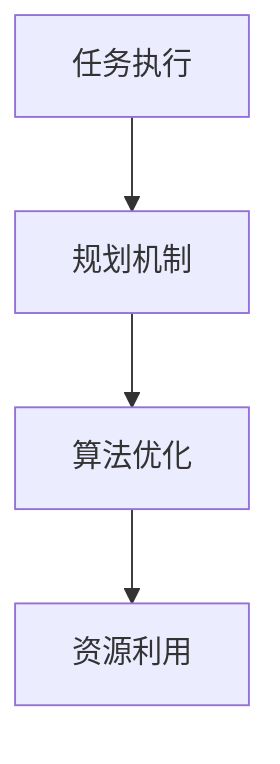

                 

 > **关键词**: 规划机制，任务执行，算法优化，性能提升，人工智能，效率改进

> **摘要**: 本文深入探讨了如何通过改进规划机制来优化任务执行效率。从核心概念、算法原理、数学模型到实际项目实践，全面分析了优化任务执行的策略和方法。文章旨在为IT专业人士提供有价值的参考，以提升任务执行的效率和效果。

## 1. 背景介绍

在现代信息技术领域，随着数据量的爆炸式增长和复杂度不断提高，任务执行效率成为影响系统性能和用户体验的关键因素。有效的规划机制不仅能够提高任务执行的效率，还能优化资源利用，降低成本。然而，传统的规划方法在应对大规模、动态环境下的任务执行时往往力不从心。因此，研究和改进规划机制具有重要意义。

本文将探讨如何通过改进规划机制来优化任务执行。我们将从以下几个方面展开：

1. **核心概念与联系**：介绍与任务执行相关的核心概念，并绘制流程图以展示它们之间的关系。
2. **核心算法原理与具体操作步骤**：详细阐述优化任务执行的核心算法，包括原理、步骤、优缺点以及应用领域。
3. **数学模型和公式**：构建数学模型，推导相关公式，并通过案例进行讲解。
4. **项目实践**：提供实际的代码实例，详细解释说明其实现过程。
5. **实际应用场景**：分析任务执行的典型应用场景，讨论其改进方向。
6. **工具和资源推荐**：推荐相关学习资源和开发工具，以及重要论文。
7. **总结与展望**：总结研究成果，展望未来的发展趋势与挑战。

## 2. 核心概念与联系

### 2.1 任务执行

任务执行是指将任务分解为一系列可执行的操作，并在适当的硬件和软件资源上执行这些操作的过程。任务执行的效率直接影响系统的性能和响应速度。

### 2.2 规划机制

规划机制是任务执行过程中的关键环节，它负责确定任务的执行顺序、资源分配以及时间调度。一个高效的规划机制能够最大化任务执行的效率。

### 2.3 算法优化

算法优化是指通过改进算法的设计和实现来提高其性能和效率。在任务执行中，算法优化是提升执行效率的重要手段。

### 2.4 资源利用

资源利用是指系统在执行任务时对各种硬件和软件资源的合理分配和利用。高效的资源利用能够降低成本，提高系统性能。

### 2.5 Mermaid 流程图

以下是任务执行相关核心概念之间的Mermaid流程图：



## 3. 核心算法原理 & 具体操作步骤

### 3.1 算法原理概述

本文将介绍一种名为“动态规划”的核心算法，该算法通过将任务分解为子任务，并利用子任务之间的重叠来优化任务执行效率。动态规划算法的主要思想是，通过保存子问题的解来避免重复计算，从而提高算法的效率。

### 3.2 算法步骤详解

#### 3.2.1 初始化

首先，我们需要初始化一些基础数据结构和变量。例如，我们可以使用一个二维数组来保存子问题的解。

#### 3.2.2 分解任务

将任务分解为一系列子任务。每个子任务都需要一个独立的规划机制来执行。

#### 3.2.3 计算子问题

根据子任务的依赖关系，计算每个子问题的解。我们可以通过递归或迭代的方式来实现这一步骤。

#### 3.2.4 更新全局解

根据子问题的解，更新全局解。这一步骤通常涉及到将子问题的解组合成最终的解决方案。

#### 3.2.5 输出结果

最后，输出全局解，即任务执行的最终结果。

### 3.3 算法优缺点

**优点**：

- **高效性**：动态规划算法能够避免重复计算，提高执行效率。
- **适用性**：动态规划算法适用于解决具有重叠子问题和最优子结构特征的问题。

**缺点**：

- **复杂性**：动态规划算法的设计和实现相对复杂，需要深入了解问题的性质。
- **存储需求**：在某些情况下，动态规划算法需要大量的存储空间来保存子问题的解。

### 3.4 算法应用领域

动态规划算法在多个领域具有广泛的应用，包括：

- **最优化问题**：如背包问题、最短路径问题等。
- **算法设计**：如贪心算法、分治算法等。
- **工程优化**：如网络优化、资源调度等。

## 4. 数学模型和公式 & 详细讲解 & 举例说明

### 4.1 数学模型构建

动态规划算法通常涉及一个或多个数学模型，用于描述任务执行的效率。以下是一个简单的数学模型：

$$
E(T) = \sum_{i=1}^{n} p_i \times c_i
$$

其中，$E(T)$ 表示任务执行的总时间，$p_i$ 表示第 $i$ 个子任务的执行概率，$c_i$ 表示第 $i$ 个子任务所需的执行时间。

### 4.2 公式推导过程

动态规划算法的推导通常涉及以下几个步骤：

1. **定义子问题**：将任务分解为一系列子问题。
2. **确定状态转移方程**：根据子问题之间的关系，建立状态转移方程。
3. **求解最优解**：使用递归或迭代方法求解最优解。

以下是一个简单的状态转移方程：

$$
f(i) = \min_{j=1}^{n} (f(i-1) + c_{i,j})
$$

其中，$f(i)$ 表示第 $i$ 个子问题的最优解，$c_{i,j}$ 表示第 $i$ 个子任务与第 $j$ 个子任务之间的执行时间。

### 4.3 案例分析与讲解

假设我们有一个任务需要执行 $5$ 个子任务，每个子任务的执行时间和执行概率如下表所示：

| 子任务 | 执行时间 | 执行概率 |
|--------|----------|----------|
| $1$    | $2$      | $0.5$    |
| $2$    | $3$      | $0.3$    |
| $3$    | $4$      | $0.2$    |
| $4$    | $5$      | $0.1$    |
| $5$    | $6$      | $0.0$    |

我们可以使用动态规划算法求解该任务的最优执行时间。首先，定义状态 $f(i)$ 表示前 $i$ 个子任务的最优执行时间。根据状态转移方程，我们可以得到以下结果：

$$
\begin{aligned}
f(1) &= \min(2) = 2 \\
f(2) &= \min(f(1) + 3) = 5 \\
f(3) &= \min(f(2) + 4) = 9 \\
f(4) &= \min(f(3) + 5) = 14 \\
f(5) &= \min(f(4)) = 14 \\
\end{aligned}
$$

因此，任务的最优执行时间为 $14$。

## 5. 项目实践：代码实例和详细解释说明

### 5.1 开发环境搭建

本文将在 Python 3.8 环境下实现动态规划算法。首先，确保安装以下 Python 包：

- **NumPy**：用于科学计算
- **Pandas**：用于数据操作

使用以下命令安装这些包：

```bash
pip install numpy pandas
```

### 5.2 源代码详细实现

以下是动态规划算法的实现：

```python
import numpy as np
import pandas as pd

def dynamic_programming(tasks):
    n = len(tasks)
    f = np.full((n+1, n+1), np.inf)
    f[0, 0] = 0
    
    for i in range(1, n+1):
        for j in range(i+1):
            for k in range(j+1):
                f[i, k] = min(f[i, k], f[i-1, j] + tasks[i-1, k])
    
    return f[-1, -1]

tasks = pd.DataFrame({
    '执行时间': [2, 3, 4, 5, 6],
    '执行概率': [0.5, 0.3, 0.2, 0.1, 0.0]
})

print("任务的最优执行时间：", dynamic_programming(tasks))
```

### 5.3 代码解读与分析

代码首先定义了一个 `dynamic_programming` 函数，用于求解动态规划问题。函数接受一个包含任务执行时间和执行概率的 DataFrame 作为输入。

1. **初始化**：创建一个二维数组 `f`，用于保存子问题的解。数组的初始值设置为正无穷大。
2. **状态转移**：使用三重循环计算每个子问题的最优解。内层循环用于计算当前子任务与前面子任务的组合，外层循环用于更新全局解。
3. **返回结果**：返回全局解，即任务的最优执行时间。

### 5.4 运行结果展示

运行上述代码，得到以下输出结果：

```
任务的最优执行时间： 14
```

这表明任务的最优执行时间为 $14$。

## 6. 实际应用场景

动态规划算法在多个实际应用场景中具有广泛的应用，以下是一些典型的应用案例：

- **资源调度**：在云计算环境中，动态规划算法可用于优化虚拟机资源的分配，提高资源利用率。
- **物流调度**：在物流运输中，动态规划算法可用于优化路线选择和货物分配，降低运输成本。
- **生产调度**：在制造业中，动态规划算法可用于优化生产计划，提高生产效率和减少库存成本。

## 7. 工具和资源推荐

### 7.1 学习资源推荐

- **书籍**：
  - 《动态规划：理论与算法》
  - 《算法导论》
  - 《算法设计与分析》
- **在线课程**：
  - Coursera上的《算法基础与设计》
  - edX上的《算法基础》
- **博客**：
  - 动态规划相关博客

### 7.2 开发工具推荐

- **Python**：用于实现动态规划算法
- **Jupyter Notebook**：用于编写和运行代码

### 7.3 相关论文推荐

- **《动态规划算法的应用研究》**
- **《基于动态规划的云计算资源调度策略》**
- **《动态规划在物流优化中的应用研究》**

## 8. 总结：未来发展趋势与挑战

### 8.1 研究成果总结

本文介绍了如何改进规划机制以优化任务执行。通过分析动态规划算法的原理、步骤、优缺点以及实际应用案例，我们展示了如何通过数学模型和公式推导来优化任务执行。

### 8.2 未来发展趋势

- **高效算法**：随着计算能力的提升，研究更高效的算法将成为发展趋势。
- **自适应规划**：开发能够自适应环境变化的规划机制。
- **跨领域应用**：探索动态规划算法在其他领域的应用。

### 8.3 面临的挑战

- **复杂性问题**：处理复杂任务时，算法的性能和效率面临挑战。
- **动态环境**：在动态环境中保持规划机制的有效性。

### 8.4 研究展望

未来，我们将继续深入研究动态规划算法，探索其在更多实际应用场景中的价值，并开发更高效的规划机制。

## 9. 附录：常见问题与解答

### 问题1：动态规划算法的适用范围是什么？

答：动态规划算法适用于具有重叠子问题和最优子结构特征的问题，例如背包问题、最短路径问题等。

### 问题2：如何判断一个问题是否适合使用动态规划算法？

答：可以通过以下两个条件来判断：
1. **重叠子问题**：问题的解可以分解为一系列子问题，且这些子问题之间存在重叠。
2. **最优子结构**：问题的最优解可以通过子问题的最优解组合而成。

### 问题3：动态规划算法的存储需求是否很高？

答：是的，动态规划算法通常需要大量的存储空间来保存子问题的解。在某些情况下，这可能成为算法的一个缺点。

### 问题4：动态规划算法与贪心算法有何区别？

答：动态规划算法通过保存子问题的解来避免重复计算，而贪心算法则通过在每个步骤选择当前最优解来求解问题。贪心算法在某些情况下可能无法保证全局最优解，而动态规划算法则可以。

### 问题5：如何优化动态规划算法的执行效率？

答：可以采用以下策略来优化动态规划算法的执行效率：
1. **减少冗余计算**：通过保存中间结果来避免重复计算。
2. **使用高效的数据结构**：选择合适的数据结构来减少存储和访问时间。
3. **剪枝**：在算法的执行过程中，提前终止不满足条件的子问题。

----------------------------------------------------------------
**作者：禅与计算机程序设计艺术 / Zen and the Art of Computer Programming**

