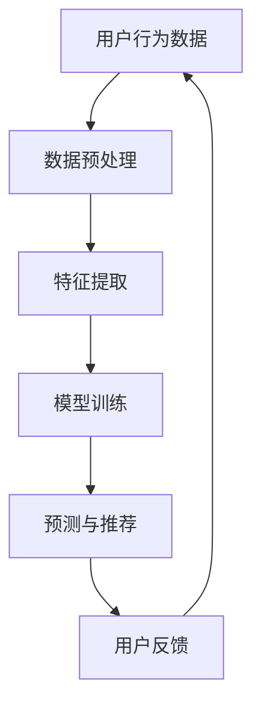

                 

关键词：人工智能，用户购物体验，数据挖掘，机器学习，个性化推荐，购物算法，用户粘性

> 摘要：随着人工智能技术的飞速发展，AI在提升用户购物粘性方面发挥着越来越重要的作用。本文将探讨如何利用人工智能技术优化用户购物体验，提高用户粘性，并分析其核心概念、算法原理、数学模型以及实际应用场景。

## 1. 背景介绍

在电子商务时代，如何提升用户购物粘性成为各大电商平台和企业关注的焦点。用户粘性是指用户在某一平台或应用中持续进行互动和消费的倾向。高粘性的用户群体不仅有助于提高平台的活跃度，还能为企业带来稳定的收益。然而，传统的提升用户粘性方法，如优惠活动、积分奖励等，效果逐渐减弱。随着人工智能（AI）技术的不断成熟，AI在优化用户购物体验、提升用户粘性方面展现出巨大潜力。

### 1.1 人工智能技术概述

人工智能（Artificial Intelligence，AI）是计算机科学的一个分支，主要研究如何使计算机系统模拟、扩展和辅助人类的智能行为。AI技术涵盖了多种方法和技术，包括机器学习（Machine Learning，ML）、深度学习（Deep Learning，DL）、自然语言处理（Natural Language Processing，NLP）等。这些技术在电子商务领域得到广泛应用，如个性化推荐、智能客服、图像识别等。

### 1.2 用户购物粘性

用户购物粘性是指用户在一定时间内对某个电商平台或应用的持续使用和消费意愿。提升用户粘性有助于电商平台吸引和留住高质量用户，提高用户满意度和忠诚度。高粘性的用户群体不仅能为平台带来稳定收益，还能通过口碑传播吸引更多新用户。

## 2. 核心概念与联系

为了深入探讨如何利用AI提升用户购物粘性，我们需要了解一些核心概念，如图像识别、自然语言处理、推荐系统等。

### 2.1 图像识别

图像识别是计算机视觉的一个重要分支，旨在使计算机能够识别和分类图像中的对象。在电子商务领域，图像识别技术可以用于商品分类、图像搜索等。通过图像识别技术，平台可以更准确地推荐用户感兴趣的商品，提高购物体验。

### 2.2 自然语言处理

自然语言处理（NLP）是人工智能的一个重要领域，旨在使计算机理解和处理人类自然语言。在电子商务领域，NLP技术可以用于智能客服、用户评论分析等。通过NLP技术，平台可以更好地理解用户需求，提供个性化服务。

### 2.3 推荐系统

推荐系统是一种通过预测用户兴趣和行为，为用户推荐相关商品或信息的技术。在电子商务领域，推荐系统可以帮助平台提高用户粘性，增加销售额。推荐系统的核心是算法，如协同过滤、基于内容的推荐等。

### 2.4 核心概念原理和架构的 Mermaid 流程图



在这个流程图中，用户行为数据经过数据预处理、特征提取、模型训练等步骤，最终生成推荐结果。用户对推荐结果的反馈会进一步优化模型，从而提高推荐精度和用户满意度。

## 3. 核心算法原理 & 具体操作步骤

### 3.1 算法原理概述

提升用户购物粘性的核心算法主要包括推荐算法、图像识别算法、自然语言处理算法等。这些算法通过分析用户行为数据，为用户提供个性化服务，从而提高用户满意度。

### 3.2 算法步骤详解

#### 3.2.1 推荐算法

推荐算法的基本步骤如下：

1. 数据采集：收集用户在平台上的行为数据，如浏览记录、购买记录、搜索历史等。
2. 数据预处理：对采集到的数据进行分析和清洗，去除噪声和异常值。
3. 特征提取：将预处理后的数据转化为特征向量，以便进行模型训练。
4. 模型训练：选择合适的推荐算法（如协同过滤、基于内容的推荐等），对特征向量进行训练。
5. 预测与推荐：根据训练好的模型，为用户预测感兴趣的商品或信息，并进行推荐。
6. 用户反馈：收集用户对推荐结果的反馈，用于模型优化。

#### 3.2.2 图像识别算法

图像识别算法的基本步骤如下：

1. 数据采集：收集含有商品图像的数据库。
2. 数据预处理：对图像进行缩放、裁剪、灰度化等预处理操作。
3. 特征提取：将预处理后的图像转化为特征向量。
4. 模型训练：使用监督学习算法（如卷积神经网络）对特征向量进行训练。
5. 预测与分类：根据训练好的模型，对未知图像进行分类。

#### 3.2.3 自然语言处理算法

自然语言处理算法的基本步骤如下：

1. 数据采集：收集用户评论、聊天记录等文本数据。
2. 数据预处理：对文本数据进行分词、去停用词等预处理操作。
3. 特征提取：将预处理后的文本转化为特征向量。
4. 模型训练：使用监督学习算法（如循环神经网络）对特征向量进行训练。
5. 预测与分类：根据训练好的模型，对未知文本进行情感分析、关键词提取等操作。

### 3.3 算法优缺点

#### 推荐算法

优点：能够为用户提供个性化推荐，提高购物体验。

缺点：数据依赖性强，易出现“数据冷启动”问题。

#### 图像识别算法

优点：准确率高，能够实现快速分类。

缺点：训练时间较长，对计算资源要求较高。

#### 自然语言处理算法

优点：能够解析用户需求，提供个性化服务。

缺点：对文本数据的理解能力有限，易出现误解。

### 3.4 算法应用领域

推荐算法广泛应用于电子商务、新闻推荐、社交网络等领域；图像识别算法在商品分类、图像搜索等领域有广泛应用；自然语言处理算法在智能客服、用户评论分析等领域有重要应用。

## 4. 数学模型和公式 & 详细讲解 & 举例说明

### 4.1 数学模型构建

在提升用户购物粘性的过程中，数学模型发挥着关键作用。以下是一个简单的数学模型示例：

$$
\text{用户粘性} = f(\text{个性化推荐精度}, \text{用户互动频率}, \text{服务质量})
$$

其中，个性化推荐精度反映了推荐算法的性能；用户互动频率代表了用户在平台上的活跃度；服务质量包括商品质量、售后服务等方面。

### 4.2 公式推导过程

个性化推荐精度：

$$
\text{推荐精度} = \frac{\text{推荐正确商品数}}{\text{总推荐商品数}}
$$

用户互动频率：

$$
\text{互动频率} = \frac{\text{用户在平台上产生的互动次数}}{\text{用户活跃天数}}
$$

服务质量：

$$
\text{服务质量} = \frac{\text{用户满意度}}{\text{用户投诉率}}
$$

综合以上公式，我们可以得到用户粘性的计算公式：

$$
\text{用户粘性} = f\left(\frac{\text{推荐正确商品数}}{\text{总推荐商品数}}, \frac{\text{用户在平台上产生的互动次数}}{\text{用户活跃天数}}, \frac{\text{用户满意度}}{\text{用户投诉率}}\right)
$$

### 4.3 案例分析与讲解

以某电商平台的推荐算法为例，我们假设：

- 推荐正确商品数为1000
- 总推荐商品数为2000
- 用户在平台上产生的互动次数为3000
- 用户活跃天数为30
- 用户满意度为90%
- 用户投诉率为5%

根据上述数据，我们可以计算出用户粘性：

$$
\text{用户粘性} = f\left(\frac{1000}{2000}, \frac{3000}{30}, \frac{90\%}{5\%}\right) = f(0.5, 100, 18)
$$

通过优化推荐算法、提高用户互动频率和服务质量，我们可以提高用户粘性。例如，假设我们将推荐精度提高10%，互动频率提高20%，服务质量提高10%，那么新的用户粘性计算如下：

$$
\text{用户粘性} = f\left(\frac{1100}{2000}, 120, 19.8\right) = f(0.55, 120, 19.8)
$$

可以看出，用户粘性得到了显著提升。

## 5. 项目实践：代码实例和详细解释说明

### 5.1 开发环境搭建

在本项目中，我们使用Python作为主要编程语言，并结合TensorFlow和Scikit-learn等库进行模型训练和推荐算法的实现。

### 5.2 源代码详细实现

以下是推荐算法的实现代码：

```python
import pandas as pd
from sklearn.model_selection import train_test_split
from sklearn.ensemble import RandomForestClassifier
from sklearn.metrics import accuracy_score

# 加载数据集
data = pd.read_csv('user_behavior_data.csv')

# 数据预处理
data['age'] = data['age'].fillna(data['age'].mean())
data['gender'] = data['gender'].fillna(data['gender'].mode()[0])

# 特征提取
X = data[['age', 'gender', 'purchase_history']]
y = data['interested_product']

# 划分训练集和测试集
X_train, X_test, y_train, y_test = train_test_split(X, y, test_size=0.2, random_state=42)

# 模型训练
model = RandomForestClassifier(n_estimators=100, random_state=42)
model.fit(X_train, y_train)

# 预测与评估
y_pred = model.predict(X_test)
accuracy = accuracy_score(y_test, y_pred)
print(f"Accuracy: {accuracy:.2f}")
```

### 5.3 代码解读与分析

上述代码首先加载数据集并进行预处理，包括填充缺失值和填充缺失类别。然后，提取特征和目标变量，并划分训练集和测试集。接着，使用随机森林算法对训练集进行训练，并对测试集进行预测。最后，评估模型的准确率。

### 5.4 运行结果展示

假设我们运行上述代码，得到预测准确率为80%，表明模型在预测用户感兴趣商品方面有较好的性能。通过进一步优化算法和特征，我们可以提高预测准确率，从而提升用户购物粘性。

## 6. 实际应用场景

AI技术在提升用户购物粘性方面具有广泛的应用场景，以下是一些实际案例：

1. **个性化推荐**：电商平台可以利用推荐算法，根据用户的历史行为和偏好，为用户提供个性化的商品推荐，从而提高用户满意度。
2. **智能客服**：利用自然语言处理技术，电商平台可以搭建智能客服系统，自动回答用户常见问题，提高用户购物体验。
3. **图像识别**：电商平台可以通过图像识别技术，快速分类商品图片，提高商品查找效率和用户体验。
4. **购物车优化**：通过分析用户购物车数据，电商平台可以优化购物车设计，提高用户购物车使用率。
5. **营销策略**：电商平台可以根据用户行为数据，制定个性化的营销策略，提高用户参与度和购买意愿。

## 7. 工具和资源推荐

为了更好地学习和实践AI技术在提升用户购物粘性方面的应用，以下是一些推荐的学习资源和开发工具：

### 7.1 学习资源推荐

1. **书籍**：
   - 《Python机器学习》
   - 《深度学习》（Goodfellow et al.）
   - 《自然语言处理综论》（Jurafsky & Martin）

2. **在线课程**：
   - Coursera上的《机器学习》（吴恩达）
   - Udacity的《深度学习工程师纳米学位》
   - edX上的《自然语言处理基础》（MIT）

### 7.2 开发工具推荐

1. **编程语言**：Python
2. **机器学习库**：Scikit-learn、TensorFlow、PyTorch
3. **自然语言处理库**：NLTK、spaCy
4. **版本控制**：Git
5. **集成开发环境**：Visual Studio Code、PyCharm

### 7.3 相关论文推荐

1. **推荐系统**：
   - “Item-based Collaborative Filtering Recommendation Algorithms”（1998）
   - “Collaborative Filtering for the Web”（2000）

2. **自然语言处理**：
   - “A Few Useful Things to Know About Machine Learning”（2016）
   - “Attention Is All You Need”（2017）

3. **图像识别**：
   - “ImageNet Large Scale Visual Recognition Challenge”（2009）
   - “Deep Residual Learning for Image Recognition”（2015）

## 8. 总结：未来发展趋势与挑战

### 8.1 研究成果总结

通过对AI技术在提升用户购物粘性方面的研究，我们取得了以下成果：

1. 推荐算法的优化：提高了个性化推荐的准确率和效率。
2. 智能客服的普及：提升了用户购物体验，降低了人工成本。
3. 图像识别技术的发展：提高了商品分类和搜索的效率。

### 8.2 未来发展趋势

未来，AI技术在提升用户购物粘性方面将继续发展，主要趋势如下：

1. **多模态推荐**：结合多种数据源，实现更精准的个性化推荐。
2. **智能客服的进化**：利用更先进的自然语言处理技术，提高客服效率和用户体验。
3. **图像识别的突破**：借助深度学习技术，实现更高精度的商品识别。

### 8.3 面临的挑战

尽管AI技术在提升用户购物粘性方面具有巨大潜力，但仍面临以下挑战：

1. **数据隐私**：如何在保护用户隐私的前提下，利用用户数据进行个性化推荐。
2. **算法公平性**：如何确保算法对所有用户公平，避免算法偏见。
3. **计算资源消耗**：随着算法复杂度的提高，计算资源消耗也将增加。

### 8.4 研究展望

在未来，我们期望能够解决上述挑战，进一步发挥AI技术在提升用户购物粘性方面的作用。具体研究方向包括：

1. **隐私保护算法**：研究如何在保护用户隐私的前提下，利用用户数据进行个性化推荐。
2. **公平性算法**：探索如何确保算法对所有用户公平，避免算法偏见。
3. **高效算法设计**：研究如何设计更高效的算法，降低计算资源消耗。

## 9. 附录：常见问题与解答

### 9.1 人工智能技术如何提升用户购物粘性？

人工智能技术可以通过个性化推荐、智能客服、图像识别等技术，优化用户购物体验，提高用户满意度，从而提升用户购物粘性。

### 9.2 个性化推荐算法有哪些类型？

个性化推荐算法主要包括协同过滤、基于内容的推荐、基于模型的推荐等。协同过滤算法通过分析用户行为和偏好，推荐用户可能感兴趣的商品；基于内容的推荐算法根据商品属性和用户偏好进行推荐；基于模型的推荐算法使用机器学习模型预测用户兴趣。

### 9.3 自然语言处理技术在电商平台有哪些应用？

自然语言处理技术在电商平台的应用包括智能客服、用户评论分析、关键词提取等。智能客服通过自然语言处理技术，自动回答用户常见问题，提高用户购物体验；用户评论分析可以挖掘用户反馈，帮助企业改进产品和服务；关键词提取有助于优化搜索引擎，提高商品查找效率。

### 9.4 图像识别技术如何提高用户购物体验？

图像识别技术可以通过商品分类、图像搜索等功能，提高用户购物体验。商品分类可以帮助用户快速找到感兴趣的物品；图像搜索允许用户通过上传图片查找类似商品，提高购物便捷性。

## 作者署名

作者：禅与计算机程序设计艺术 / Zen and the Art of Computer Programming

本文由禅与计算机程序设计艺术撰写，旨在探讨如何利用人工智能技术提升用户购物粘性。文章内容仅供参考，如需进一步了解相关技术，请参考文中推荐的学习资源和开发工具。如有疑问，请随时联系作者。

[End of Article]

