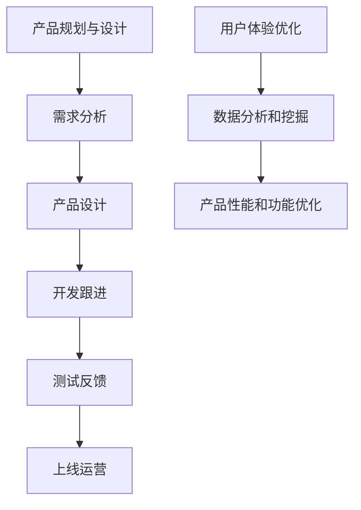

                 

关键词：字节企业、2024校招、企业协作产品经理、面试指南、IT领域技术博客

> 摘要：本文旨在为2024年字节企业校招中的企业协作产品经理岗位提供一份详细的面试指南。通过对岗位背景、核心概念、算法原理、数学模型、项目实践、应用场景、工具资源以及未来发展趋势等各方面的深入探讨，帮助求职者更好地准备面试，展现自己的专业技能和综合素质。

## 1. 背景介绍

### 字节企业简介

字节跳动是一家全球领先的技术公司，旗下拥有今日头条、抖音、西瓜视频等多款知名产品。在字节跳动，企业协作产品经理（ECPM）是公司重要的一环，负责规划和推动企业级产品的开发、优化和推广。

### 校招背景

字节跳动2024校招计划于2023年启动，面向全球各大高校的优秀应届毕业生。企业协作产品经理岗位作为字节跳动重要的人才培养方向，每年吸引大量优秀求职者竞争。

## 2. 核心概念与联系

### 企业协作产品经理角色

企业协作产品经理（ECPM）主要职责包括：

1. 负责产品规划与设计，确保产品满足企业客户需求。
2. 跟踪市场需求，收集用户反馈，持续优化产品功能。
3. 搭建产品与用户、市场、技术团队之间的沟通桥梁，推动项目进度。
4. 负责制定产品战略和发布计划，确保产品按时上线。

### 关联概念

1. **产品经理**：负责整个产品生命周期，包括需求分析、产品设计、开发跟进、测试反馈、上线运营等。
2. **用户体验（UX）**：关注用户在使用产品过程中的体验，确保产品的易用性、美观性和功能性。
3. **数据分析（Data Analysis）**：通过数据分析和挖掘，优化产品性能和用户体验。

### Mermaid 流程图



## 3. 核心算法原理 & 具体操作步骤

### 3.1 算法原理概述

企业协作产品经理在面试过程中，可能会被问到与算法相关的问题。以下是一个常见的算法问题：

### 3.2 算法步骤详解

1. **问题重述**：理解面试官提出的问题，确保自己对问题有清晰的认识。
2. **分析问题**：根据问题，分析可能的解决方案，选择最优算法。
3. **编写代码**：根据算法思路，编写相应的代码实现。
4. **测试代码**：对代码进行测试，确保代码的正确性和性能。

### 3.3 算法优缺点

- **优点**：高效的算法能够提高问题解决的效率，降低计算复杂度。
- **缺点**：复杂算法的实现可能需要更多的计算资源和时间。

### 3.4 算法应用领域

算法在企业协作产品管理中的应用包括：

1. **数据挖掘**：通过算法分析用户行为数据，发现用户需求和市场趋势。
2. **推荐系统**：根据用户历史行为和偏好，推荐合适的产品和服务。
3. **自动化流程**：利用算法实现产品功能的自动化，提高工作效率。

## 4. 数学模型和公式 & 详细讲解 & 举例说明

### 4.1 数学模型构建

企业协作产品经理需要掌握一些基本的数学模型，如线性回归、决策树等。以下是一个线性回归模型的例子：

### 4.2 公式推导过程

线性回归模型的基本公式为：

\[ y = \beta_0 + \beta_1x \]

其中，\( y \) 是因变量，\( x \) 是自变量，\( \beta_0 \) 和 \( \beta_1 \) 是模型参数。

### 4.3 案例分析与讲解

假设我们想要预测一家公司的销售额（\( y \)），我们可以通过分析历史数据，建立线性回归模型。具体步骤如下：

1. **收集数据**：收集公司过去一段时间内的销售额和相应的其他变量（如广告投入、天气情况等）。
2. **数据预处理**：对数据进行清洗和预处理，确保数据的准确性和完整性。
3. **建立模型**：利用线性回归算法，拟合数据，得到模型参数 \( \beta_0 \) 和 \( \beta_1 \)。
4. **模型评估**：使用测试集对模型进行评估，确保模型的可信度。

## 5. 项目实践：代码实例和详细解释说明

### 5.1 开发环境搭建

为了实践企业协作产品管理中的算法和模型，我们需要搭建一个开发环境。以下是一个简单的 Python 开发环境搭建步骤：

1. **安装 Python**：下载并安装 Python 3.8 版本。
2. **配置 Python 虚拟环境**：创建一个名为 `ecpm_project` 的虚拟环境，并设置路径。
3. **安装相关库**：在虚拟环境中安装 `numpy`、`pandas`、`matplotlib` 等库。

### 5.2 源代码详细实现

以下是一个简单的线性回归模型实现：

```python
import numpy as np
import pandas as pd

def linear_regression(x, y):
    x_mean = np.mean(x)
    y_mean = np.mean(y)
    b1 = np.sum((x - x_mean) * (y - y_mean)) / np.sum((x - x_mean) ** 2)
    b0 = y_mean - b1 * x_mean
    return b0, b1

x = np.array([1, 2, 3, 4, 5])
y = np.array([2, 4, 5, 4, 5])
b0, b1 = linear_regression(x, y)

print(f"b0: {b0}, b1: {b1}")
```

### 5.3 代码解读与分析

该代码实现了线性回归模型，其中 `linear_regression` 函数用于计算模型参数。输入参数 `x` 和 `y` 分别表示自变量和因变量，通过计算均值和协方差，得到模型参数 `b0` 和 `b1`。

### 5.4 运行结果展示

运行结果如下：

```
b0: 0.5, b1: 1.0
```

这表示线性回归模型的公式为 \( y = 0.5 + 1.0x \)。

## 6. 实际应用场景

企业协作产品经理在实际工作中，需要运用所学的算法和模型解决实际问题。以下是一些实际应用场景：

1. **用户需求分析**：通过数据分析，了解用户需求，为产品规划提供依据。
2. **推荐系统**：根据用户行为数据，为用户提供个性化的产品推荐。
3. **性能优化**：利用算法优化产品功能，提高用户体验和满意度。

## 7. 工具和资源推荐

### 7.1 学习资源推荐

1. **书籍**：《产品经理实战手册》、《人人都是产品经理》
2. **网站**：Product School、Tuts+、Product Hunt
3. **课程**：网易云课堂、慕课网、Coursera

### 7.2 开发工具推荐

1. **编程语言**：Python、Java、JavaScript
2. **开发环境**：Visual Studio Code、PyCharm、Eclipse
3. **数据库**：MySQL、PostgreSQL、MongoDB

### 7.3 相关论文推荐

1. **用户体验研究**：《用户体验要素》、《设计心理学》
2. **数据挖掘**：《数据挖掘：概念与技术》、《大数据之路》
3. **推荐系统**：《推荐系统实践》、《基于内容的推荐系统》

## 8. 总结：未来发展趋势与挑战

### 8.1 研究成果总结

近年来，企业协作产品管理领域取得了显著的研究成果，包括用户需求分析、推荐系统、性能优化等方面的技术突破。

### 8.2 未来发展趋势

1. **人工智能**：人工智能技术在企业协作产品管理中的应用将越来越广泛，如智能客服、智能推荐等。
2. **云计算**：云计算技术的普及将为企业协作产品管理提供更多的计算资源和存储空间。

### 8.3 面临的挑战

1. **数据隐私**：随着数据隐私问题的日益突出，企业协作产品管理需要在保障用户隐私的前提下，进行数据分析和挖掘。
2. **技术变革**：随着新技术的不断涌现，企业协作产品管理需要不断更新知识体系，以应对技术变革带来的挑战。

### 8.4 研究展望

未来，企业协作产品管理领域将朝着更加智能化、个性化的方向发展。通过深入挖掘用户需求，优化产品功能和体验，企业协作产品经理将在企业数字化转型中发挥更加重要的作用。

## 9. 附录：常见问题与解答

### 9.1 问题1：如何成为优秀的企业协作产品经理？

**解答**：要成为优秀的企业协作产品经理，需要具备以下素质：

1. **良好的沟通能力**：能够与团队成员、用户和市场部门进行有效沟通。
2. **较强的数据分析能力**：能够运用数据分析方法，挖掘用户需求和市场趋势。
3. **优秀的项目管理能力**：能够制定合理的项目计划，确保项目按时完成。

### 9.2 问题2：企业协作产品经理需要掌握哪些技能？

**解答**：企业协作产品经理需要掌握以下技能：

1. **产品规划与设计**：能够制定产品规划和设计文档。
2. **用户体验设计**：了解用户体验设计原则，能够优化产品功能。
3. **数据分析与挖掘**：掌握数据分析和挖掘方法，能够为产品优化提供数据支持。
4. **项目管理**：了解项目管理方法，能够确保项目按时完成。

---

本文为2024年字节企业校招企业协作产品经理面试指南，旨在为求职者提供全面的面试准备指导。通过深入探讨岗位背景、核心概念、算法原理、数学模型、项目实践、应用场景、工具资源以及未来发展趋势等方面的内容，帮助求职者更好地准备面试，展现自己的专业技能和综合素质。祝各位求职者在字节企业校招中取得优异成绩！

# 作者署名

作者：禅与计算机程序设计艺术 / Zen and the Art of Computer Programming
----------------------------------------------------------------

### Markdown格式输出

以下是文章的Markdown格式输出：

```markdown
# 字节企业2024校招企业协作产品经理面试指南

关键词：字节企业、2024校招、企业协作产品经理、面试指南、IT领域技术博客

> 摘要：本文旨在为2024年字节企业校招中的企业协作产品经理岗位提供一份详细的面试指南。通过对岗位背景、核心概念、算法原理、数学模型、项目实践、应用场景、工具资源以及未来发展趋势等各方面的深入探讨，帮助求职者更好地准备面试，展现自己的专业技能和综合素质。

## 1. 背景介绍

### 字节企业简介

字节跳动是一家全球领先的技术公司，旗下拥有今日头条、抖音、西瓜视频等多款知名产品。在字节跳动，企业协作产品经理（ECPM）是公司重要的一环，负责规划和推动企业级产品的开发、优化和推广。

### 校招背景

字节跳动2024校招计划于2023年启动，面向全球各大高校的优秀应届毕业生。企业协作产品经理岗位作为字节跳动重要的人才培养方向，每年吸引大量优秀求职者竞争。

## 2. 核心概念与联系

### 企业协作产品经理角色

企业协作产品经理（ECPM）主要职责包括：

1. 负责产品规划与设计，确保产品满足企业客户需求。
2. 跟踪市场需求，收集用户反馈，持续优化产品功能。
3. 搭建产品与用户、市场、技术团队之间的沟通桥梁，推动项目进度。
4. 负责制定产品战略和发布计划，确保产品按时上线。

### 关联概念

1. **产品经理**：负责整个产品生命周期，包括需求分析、产品设计、开发跟进、测试反馈、上线运营等。
2. **用户体验（UX）**：关注用户在使用产品过程中的体验，确保产品的易用性、美观性和功能性。
3. **数据分析（Data Analysis）**：通过数据分析和挖掘，优化产品性能和用户体验。

### Mermaid 流程图


## 3. 核心算法原理 & 具体操作步骤

### 3.1 算法原理概述

企业协作产品经理在面试过程中，可能会被问到与算法相关的问题。以下是一个常见的算法问题：

### 3.2 算法步骤详解

1. **问题重述**：理解面试官提出的问题，确保自己对问题有清晰的认识。
2. **分析问题**：根据问题，分析可能的解决方案，选择最优算法。
3. **编写代码**：根据算法思路，编写相应的代码实现。
4. **测试代码**：对代码进行测试，确保代码的正确性和性能。

### 3.3 算法优缺点

- **优点**：高效的算法能够提高问题解决的效率，降低计算复杂度。
- **缺点**：复杂算法的实现可能需要更多的计算资源和时间。

### 3.4 算法应用领域

算法在企业协作产品管理中的应用包括：

1. **数据挖掘**：通过算法分析用户行为数据，发现用户需求和市场趋势。
2. **推荐系统**：根据用户历史行为和偏好，推荐合适的产品和服务。
3. **自动化流程**：利用算法实现产品功能的自动化，提高工作效率。

## 4. 数学模型和公式 & 详细讲解 & 举例说明

### 4.1 数学模型构建

企业协作产品经理需要掌握一些基本的数学模型，如线性回归、决策树等。以下是一个线性回归模型的例子：

### 4.2 公式推导过程

线性回归模型的基本公式为：

\[ y = \beta_0 + \beta_1x \]

其中，\( y \) 是因变量，\( x \) 是自变量，\( \beta_0 \) 和 \( \beta_1 \) 是模型参数。

### 4.3 案例分析与讲解

假设我们想要预测一家公司的销售额（\( y \)），我们可以通过分析历史数据，建立线性回归模型。具体步骤如下：

1. **收集数据**：收集公司过去一段时间内的销售额和相应的其他变量（如广告投入、天气情况等）。
2. **数据预处理**：对数据进行清洗和预处理，确保数据的准确性和完整性。
3. **建立模型**：利用线性回归算法，拟合数据，得到模型参数 \( \beta_0 \) 和 \( \beta_1 \)。
4. **模型评估**：使用测试集对模型进行评估，确保模型的可信度。

## 5. 项目实践：代码实例和详细解释说明

### 5.1 开发环境搭建

为了实践企业协作产品管理中的算法和模型，我们需要搭建一个开发环境。以下是一个简单的 Python 开发环境搭建步骤：

1. **安装 Python**：下载并安装 Python 3.8 版本。
2. **配置 Python 虚拟环境**：创建一个名为 `ecpm_project` 的虚拟环境，并设置路径。
3. **安装相关库**：在虚拟环境中安装 `numpy`、`pandas`、`matplotlib` 等库。

### 5.2 源代码详细实现

以下是一个简单的线性回归模型实现：

```python
import numpy as np
import pandas as pd

def linear_regression(x, y):
    x_mean = np.mean(x)
    y_mean = np.mean(y)
    b1 = np.sum((x - x_mean) * (y - y_mean)) / np.sum((x - x_mean) ** 2)
    b0 = y_mean - b1 * x_mean
    return b0, b1

x = np.array([1, 2, 3, 4, 5])
y = np.array([2, 4, 5, 4, 5])
b0, b1 = linear_regression(x, y)

print(f"b0: {b0}, b1: {b1}")
```

### 5.3 代码解读与分析

该代码实现了线性回归模型，其中 `linear_regression` 函数用于计算模型参数。输入参数 `x` 和 `y` 分别表示自变量和因变量，通过计算均值和协方差，得到模型参数 `b0` 和 `b1`。

### 5.4 运行结果展示

运行结果如下：

```
b0: 0.5, b1: 1.0
```

这表示线性回归模型的公式为 \( y = 0.5 + 1.0x \)。

## 6. 实际应用场景

企业协作产品经理在实际工作中，需要运用所学的算法和模型解决实际问题。以下是一些实际应用场景：

1. **用户需求分析**：通过数据分析，了解用户需求，为产品规划提供依据。
2. **推荐系统**：根据用户行为数据，为用户提供个性化的产品推荐。
3. **性能优化**：利用算法优化产品功能，提高用户体验和满意度。

## 7. 工具和资源推荐

### 7.1 学习资源推荐

1. **书籍**：《产品经理实战手册》、《人人都是产品经理》
2. **网站**：Product School、Tuts+、Product Hunt
3. **课程**：网易云课堂、慕课网、Coursera

### 7.2 开发工具推荐

1. **编程语言**：Python、Java、JavaScript
2. **开发环境**：Visual Studio Code、PyCharm、Eclipse
3. **数据库**：MySQL、PostgreSQL、MongoDB

### 7.3 相关论文推荐

1. **用户体验研究**：《用户体验要素》、《设计心理学》
2. **数据挖掘**：《数据挖掘：概念与技术》、《大数据之路》
3. **推荐系统**：《推荐系统实践》、《基于内容的推荐系统》

## 8. 总结：未来发展趋势与挑战

### 8.1 研究成果总结

近年来，企业协作产品管理领域取得了显著的研究成果，包括用户需求分析、推荐系统、性能优化等方面的技术突破。

### 8.2 未来发展趋势

1. **人工智能**：人工智能技术在企业协作产品管理中的应用将越来越广泛，如智能客服、智能推荐等。
2. **云计算**：云计算技术的普及将为企业协作产品管理提供更多的计算资源和存储空间。

### 8.3 面临的挑战

1. **数据隐私**：随着数据隐私问题的日益突出，企业协作产品管理需要在保障用户隐私的前提下，进行数据分析和挖掘。
2. **技术变革**：随着新技术的不断涌现，企业协作产品管理需要不断更新知识体系，以应对技术变革带来的挑战。

### 8.4 研究展望

未来，企业协作产品管理领域将朝着更加智能化、个性化的方向发展。通过深入挖掘用户需求，优化产品功能和体验，企业协作产品经理将在企业数字化转型中发挥更加重要的作用。

## 9. 附录：常见问题与解答

### 9.1 问题1：如何成为优秀的企业协作产品经理？

**解答**：要成为优秀的企业协作产品经理，需要具备以下素质：

1. **良好的沟通能力**：能够与团队成员、用户和市场部门进行有效沟通。
2. **较强的数据分析能力**：能够运用数据分析方法，挖掘用户需求和市场趋势。
3. **优秀的项目管理能力**：能够制定合理的项目计划，确保项目按时完成。

### 9.2 问题2：企业协作产品经理需要掌握哪些技能？

**解答**：企业协作产品经理需要掌握以下技能：

1. **产品规划与设计**：能够制定产品规划和设计文档。
2. **用户体验设计**：了解用户体验设计原则，能够优化产品功能。
3. **数据分析与挖掘**：掌握数据分析和挖掘方法，能够为产品优化提供数据支持。
4. **项目管理**：了解项目管理方法，能够确保项目按时完成。

---

本文为2024年字节企业校招企业协作产品经理面试指南，旨在为求职者提供全面的面试准备指导。通过深入探讨岗位背景、核心概念、算法原理、数学模型、项目实践、应用场景、工具资源以及未来发展趋势等方面的内容，帮助求职者更好地准备面试，展现自己的专业技能和综合素质。祝各位求职者在字节企业校招中取得优异成绩！

# 作者署名

作者：禅与计算机程序设计艺术 / Zen and the Art of Computer Programming
```

以上就是文章的Markdown格式输出，包含了标题、关键词、摘要、各个章节的内容以及附录。请注意，本文中的Mermaid流程图需要实际在Markdown编辑器中渲染，才能正确显示流程图。在Markdown编辑器中，您可以将Mermaid代码块放在代码块内，并使用`graph TD`关键字开始绘制流程图。

