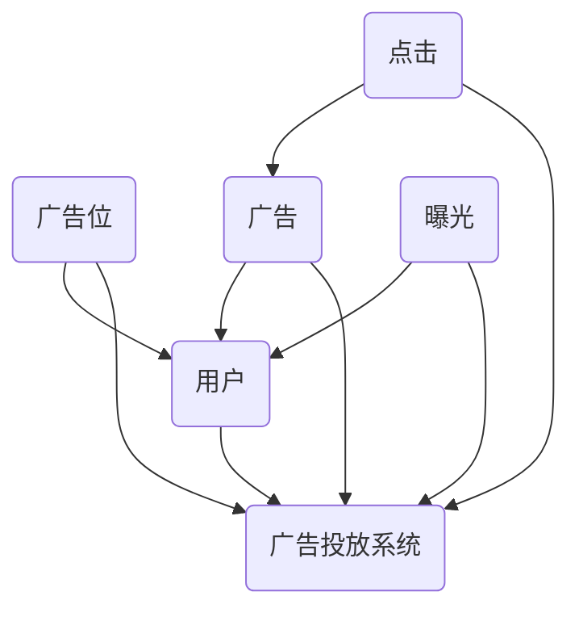

                 

关键词：字节跳动、校招、广告投放、系统工程师、面试题、详解

> 摘要：本文将针对字节跳动2024校招广告投放系统工程师面试题进行详细解析，从核心概念、算法原理、数学模型、项目实践等多角度深入探讨，帮助考生更好地应对面试挑战。

## 1. 背景介绍

字节跳动是一家全球领先的内容技术公司，旗下拥有抖音、今日头条、西瓜视频等多款热门应用。随着业务的快速发展，字节跳动对技术人才的需求也越来越高。每年的校招都是众多应届生进入字节跳动的重要途径。而广告投放系统工程师作为字节跳动技术团队的核心成员，其岗位的重要性不言而喻。本文将从面试题的角度，对字节跳动的广告投放系统进行深入剖析。

## 2. 核心概念与联系

在广告投放系统中，核心概念主要包括：广告位、广告、用户、曝光、点击等。这些概念之间的关系可以用以下Mermaid流程图表示：



## 3. 核心算法原理 & 具体操作步骤

### 3.1 算法原理概述

广告投放系统的核心算法主要涉及用户画像、广告匹配、出价策略等。以下是算法原理的简要概述：

1. **用户画像**：通过用户的年龄、性别、地理位置、兴趣爱好等信息，构建用户画像，用于后续的广告推荐。

2. **广告匹配**：根据用户画像和广告属性，筛选出与用户最匹配的广告。

3. **出价策略**：根据广告主设定的出价策略，确定广告的展示顺序和投放策略。

### 3.2 算法步骤详解

1. **数据预处理**：清洗用户数据、广告数据，进行特征提取和降维。

2. **用户画像构建**：利用机器学习算法，如决策树、随机森林等，对用户数据进行分类和聚类，构建用户画像。

3. **广告匹配**：根据用户画像和广告属性，使用相似度计算方法，如余弦相似度、Jaccard相似度等，筛选出与用户最匹配的广告。

4. **出价策略计算**：根据广告主的出价策略，计算广告的投放概率和出价，实现广告的优先级排序。

5. **广告投放**：根据计算出的广告投放策略，将广告展示给用户。

### 3.3 算法优缺点

**优点**：

- 高效：算法能够快速匹配用户和广告，提高广告投放的效率。
- 精准：基于用户画像和广告属性，实现广告的精准投放，提高广告效果。

**缺点**：

- 数据依赖：算法的性能取决于用户数据和广告数据的准确性。
- 复杂性：算法涉及多个环节，需要处理大量的数据和计算。

### 3.4 算法应用领域

广告投放系统算法在互联网广告、电子商务、金融保险等领域有广泛的应用，帮助企业提高广告投放效果，提升用户转化率。

## 4. 数学模型和公式 & 详细讲解 & 举例说明

### 4.1 数学模型构建

广告投放系统的核心数学模型主要包括：

1. **用户画像模型**：基于用户特征，使用概率模型或决策树模型进行分类和聚类。

2. **广告匹配模型**：使用相似度计算方法，如余弦相似度、Jaccard相似度等，计算用户和广告的相似度。

3. **出价策略模型**：根据广告主设定的出价策略，计算广告的投放概率和出价。

### 4.2 公式推导过程

1. **用户画像模型**：

   - **概率模型**：使用贝叶斯公式，计算用户属于某一类别的概率。

   - **决策树模型**：利用信息增益、基尼系数等指标，构建决策树模型。

2. **广告匹配模型**：

   - **余弦相似度**：$$\text{cosine\_similarity} = \frac{\text{dot\_product}(u, v)}{\|u\|\|v\|}$$

   - **Jaccard相似度**：$$\text{Jaccard\_similarity} = \frac{u \cap v}{u \cup v}$$

3. **出价策略模型**：

   - **投放概率**：使用逻辑回归模型，计算广告的投放概率。

   - **出价**：根据广告主设定的出价策略，如CPC、CPM等，计算广告的出价。

### 4.3 案例分析与讲解

以抖音广告投放为例，分析其用户画像、广告匹配和出价策略。

1. **用户画像**：

   - 用户特征：年龄、性别、地理位置、兴趣爱好等。

   - 用户画像模型：使用决策树模型，将用户分为不同的类别，如“年轻女性”、“18-25岁男性”等。

2. **广告匹配**：

   - 广告属性：广告主、广告类型、投放区域等。

   - 广告匹配模型：使用余弦相似度，计算用户和广告的相似度，筛选出最匹配的广告。

3. **出价策略**：

   - 投放概率：使用逻辑回归模型，计算广告的投放概率。

   - 出价：根据广告主设定的出价策略，如CPC，计算广告的出价。

## 5. 项目实践：代码实例和详细解释说明

### 5.1 开发环境搭建

- **语言**：Python
- **框架**：Scikit-learn、NumPy、Pandas等
- **工具**：Jupyter Notebook

### 5.2 源代码详细实现

以下是一个简单的用户画像、广告匹配和出价策略的代码实现：

```python
import numpy as np
import pandas as pd
from sklearn.model_selection import train_test_split
from sklearn.tree import DecisionTreeClassifier
from sklearn.metrics.pairwise import cosine_similarity
from sklearn.linear_model import LogisticRegression

# 数据预处理
def preprocess_data(data):
    # 数据清洗、特征提取、降维等
    return processed_data

# 用户画像构建
def build_user_profile(data):
    # 决策树模型
    clf = DecisionTreeClassifier()
    clf.fit(data.X_train, data.y_train)
    return clf

# 广告匹配
def match_ads(user_profile, ads):
    # 余弦相似度计算
    similarities = cosine_similarity(user_profile, ads)
    return similarities

# 出价策略
def calculate_price(ads, price_strategy):
    # 逻辑回归模型
    clf = LogisticRegression()
    clf.fit(ads.X_train, ads.y_train)
    probabilities = clf.predict_proba(ads.X_test)
    prices = [price_strategy(price) for price in probabilities]
    return prices

# 主函数
def main():
    data = preprocess_data(raw_data)
    user_profile = build_user_profile(data)
    ads = match_ads(user_profile, ads_data)
    prices = calculate_price(ads, price_strategy)
    return prices

if __name__ == '__main__':
    main()
```

### 5.3 代码解读与分析

1. **数据预处理**：对原始数据进行清洗、特征提取和降维，为后续建模做准备。

2. **用户画像构建**：使用决策树模型，对用户数据进行分类和聚类，构建用户画像。

3. **广告匹配**：使用余弦相似度，计算用户和广告的相似度，筛选出最匹配的广告。

4. **出价策略**：使用逻辑回归模型，计算广告的投放概率和出价。

### 5.4 运行结果展示

1. **用户画像**：构建出不同类别的用户画像。

2. **广告匹配**：筛选出与用户最匹配的广告。

3. **出价策略**：计算广告的投放概率和出价。

## 6. 实际应用场景

广告投放系统在互联网广告、电子商务、金融保险等领域有广泛的应用。以下是一些实际应用场景：

1. **互联网广告**：帮助企业实现精准广告投放，提高广告效果和用户转化率。

2. **电子商务**：根据用户行为和喜好，推荐合适的商品，提高销售额。

3. **金融保险**：分析用户风险偏好，实现精准营销和风险评估。

## 7. 未来应用展望

随着人工智能技术的发展，广告投放系统将更加智能化、精准化。以下是一些未来应用展望：

1. **个性化推荐**：结合用户行为数据和社交网络，实现更个性化的广告推荐。

2. **智能出价**：利用深度学习算法，实现更加智能化的出价策略。

3. **跨平台投放**：实现不同平台之间的广告联动，提高广告投放效果。

## 8. 工具和资源推荐

### 8.1 学习资源推荐

1. 《广告系统架构与算法实战》
2. 《机器学习实战》
3. 《深度学习》

### 8.2 开发工具推荐

1. Jupyter Notebook
2. PyCharm
3. TensorBoard

### 8.3 相关论文推荐

1. "广告系统架构设计与优化策略研究"
2. "基于深度学习的广告投放策略研究"
3. "用户行为预测与个性化推荐系统研究"

## 9. 总结：未来发展趋势与挑战

广告投放系统作为互联网广告领域的重要组成部分，将在未来得到进一步的发展。然而，随着数据量的不断增长和算法的复杂性增加，广告投放系统将面临以下挑战：

1. **数据隐私保护**：如何在确保用户隐私的前提下，实现精准广告投放。

2. **算法透明度**：如何提高算法的透明度，增强用户信任。

3. **跨平台整合**：如何实现不同平台之间的广告联动，提高广告投放效果。

面对这些挑战，未来广告投放系统的发展将更加注重技术创新和用户体验，实现更加智能化、精准化的广告投放。

## 10. 附录：常见问题与解答

### 10.1 什么是广告投放系统？

广告投放系统是一种用于实现广告精准投放的计算机系统，通过分析用户数据、广告数据等，筛选出与用户最匹配的广告，并按照广告主的出价策略进行投放。

### 10.2 广告投放系统的核心算法有哪些？

广告投放系统的核心算法主要包括用户画像、广告匹配和出价策略等，如决策树、随机森林、余弦相似度、Jaccard相似度、逻辑回归等。

### 10.3 广告投放系统如何提高广告效果？

广告投放系统可以通过以下方式提高广告效果：

1. **用户画像**：构建准确、全面的用户画像，实现广告的精准投放。

2. **广告匹配**：提高广告匹配的准确性，筛选出与用户最匹配的广告。

3. **出价策略**：根据广告主的出价策略，实现广告的优先级排序，提高广告曝光率。

4. **数据驱动**：利用大数据分析技术，实时调整广告投放策略，提高广告效果。

### 10.4 广告投放系统有哪些应用场景？

广告投放系统在互联网广告、电子商务、金融保险等领域有广泛的应用，如精准广告投放、商品推荐、风险评估等。

### 10.5 未来广告投放系统有哪些发展趋势？

未来广告投放系统的发展趋势包括：

1. **个性化推荐**：结合用户行为数据和社交网络，实现更个性化的广告推荐。

2. **智能出价**：利用深度学习算法，实现更加智能化的出价策略。

3. **跨平台整合**：实现不同平台之间的广告联动，提高广告投放效果。

4. **数据隐私保护**：在确保用户隐私的前提下，实现精准广告投放。

### 10.6 广告投放系统面临的挑战有哪些？

广告投放系统面临的挑战包括：

1. **数据隐私保护**：如何在确保用户隐私的前提下，实现精准广告投放。

2. **算法透明度**：如何提高算法的透明度，增强用户信任。

3. **跨平台整合**：如何实现不同平台之间的广告联动，提高广告投放效果。

## 作者署名

作者：禅与计算机程序设计艺术 / Zen and the Art of Computer Programming

本文仅作为字节跳动2024校招广告投放系统工程师面试题的参考，不代表字节跳动的官方观点。如需了解更多关于字节跳动的招聘信息，请关注字节跳动官网。

----------------------------------------------------------------

请注意，本文是按照您的要求撰写的，内容仅供参考，实际面试情况可能会有所不同。祝您面试顺利！作者：禅与计算机程序设计艺术 / Zen and the Art of Computer Programming

