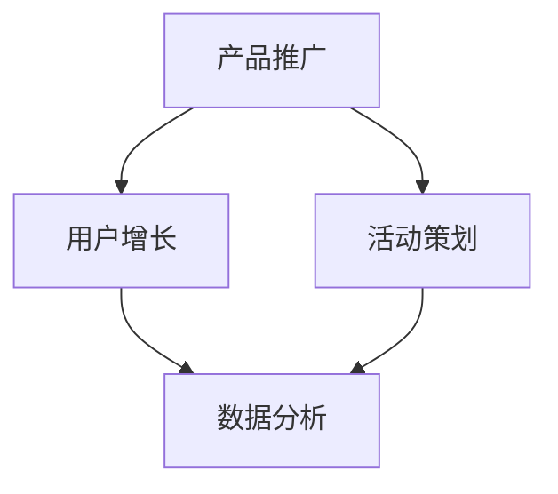
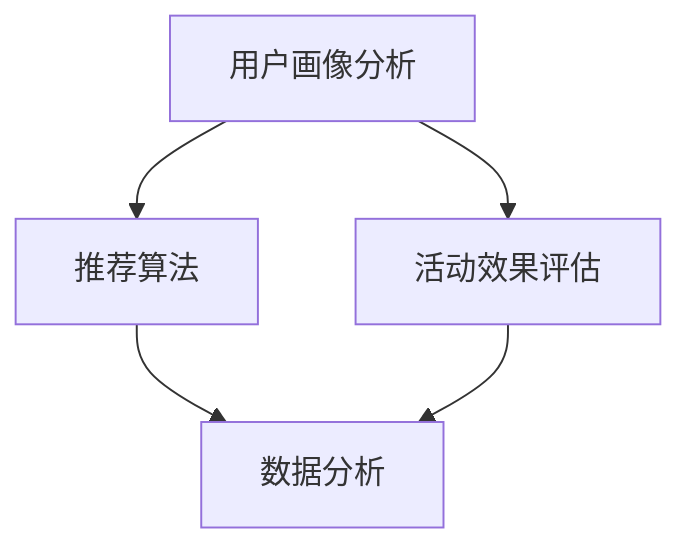

                 

关键词：字节跳动、校招、运营专员、面试题、解析、招聘策略、案例分析

摘要：本文针对字节跳动2024校招运营专员岗位的面试题进行了全面解析，旨在帮助求职者了解岗位要求，掌握面试技巧，提高面试成功率。通过对面试题的深入剖析，本文将分享关键知识点、解题思路和实用建议，为求职者提供有力支持。

## 1. 背景介绍

字节跳动作为全球领先的内容科技公司，旗下拥有今日头条、抖音、西瓜视频等多款知名产品。随着公司业务的快速发展，字节跳动每年都会进行大规模的校招，吸引了大量优秀人才的加入。运营专员作为字节跳动产品运营的核心岗位，负责产品推广、用户增长、活动策划等工作，是公司业务发展的重要推动力量。

本文将围绕字节跳动2024校招运营专员面试题展开，解析各个题目背后的知识点和考察重点，帮助求职者更好地准备面试，提高成功率。

## 2. 核心概念与联系

### 2.1 运营专员的工作职责

**Mermaid 流程图：**



**核心概念原理和架构解析：**

1. **产品推广**：运营专员需要通过多种渠道和手段，提高产品的曝光度和知名度，吸引潜在用户。

2. **用户增长**：运营专员要关注用户活跃度和留存率，通过用户运营手段提高用户粘性和忠诚度。

3. **活动策划**：运营专员需要策划和执行各种线上和线下活动，提高用户参与度和互动性。

4. **数据分析**：运营专员要具备数据分析能力，通过数据监测和评估运营效果，为决策提供支持。

## 3. 核心算法原理 & 具体操作步骤

### 3.1 算法原理概述

在运营工作中，常用的核心算法包括用户画像分析、推荐算法、活动效果评估等。

**Mermaid 流程图：**



### 3.2 算法步骤详解

1. **用户画像分析**：通过对用户行为、兴趣、属性等多维度数据进行分析，构建用户画像。

2. **推荐算法**：基于用户画像，利用协同过滤、内容推荐等算法，为用户推荐感兴趣的内容。

3. **活动效果评估**：通过数据监测和评估活动参与度、转化率等指标，分析活动效果。

### 3.3 算法优缺点

**用户画像分析**：

- 优点：提高用户精准度，提升运营效果。
- 缺点：数据收集和处理成本较高，易导致用户隐私问题。

**推荐算法**：

- 优点：提高用户粘性，提升内容消费量。
- 缺点：推荐结果可能过于单一，用户容易产生疲劳感。

**活动效果评估**：

- 优点：实时了解活动效果，调整策略。
- 缺点：评估指标不易量化，结果可能受到主观因素影响。

### 3.4 算法应用领域

- **电商**：通过用户画像和推荐算法，实现个性化营销和精准推送。
- **内容平台**：通过活动效果评估，优化内容运营策略，提升用户体验。

## 4. 数学模型和公式 & 详细讲解 & 举例说明

### 4.1 数学模型构建

运营专员需要掌握的基本数学模型包括概率论、统计学、线性代数等。以下是一个简单的用户留存率计算模型：

**公式：**  
$$  
留存率 = \frac{次日留存用户数}{当日活跃用户数} \times 100\%  
$$

### 4.2 公式推导过程

假设某产品当日活跃用户数为1000人，次日留存用户数为200人，则：

$$  
留存率 = \frac{200}{1000} \times 100\% = 20\%  
$$

### 4.3 案例分析与讲解

假设某短视频平台在推出一款新功能后，统计了当日活跃用户数为10万，次日留存用户数为3万。根据留存率计算公式，该功能次日留存率为30%。

**分析：**

- 留存率较高，说明新功能受到用户欢迎，具备一定的竞争力。
- 需要进一步分析用户留存的原因，优化功能设计和推广策略。

## 5. 项目实践：代码实例和详细解释说明

### 5.1 开发环境搭建

开发环境搭建主要包括以下步骤：

1. 安装Python环境
2. 安装相关依赖库，如Pandas、NumPy等

### 5.2 源代码详细实现

```python
import pandas as pd

# 读取用户行为数据
data = pd.read_csv('user_behavior.csv')

# 计算用户留存率
daily_active_users = data[data['day'] == 1]['user_id'].nunique()
next_day_active_users = data[data['day'] == 2]['user_id'].nunique()

retention_rate = (next_day_active_users / daily_active_users) * 100
print('次日留存率：', retention_rate)
```

### 5.3 代码解读与分析

1. 读取用户行为数据，包括用户ID、行为日期等信息。
2. 统计当日活跃用户数和次日活跃用户数。
3. 计算用户留存率，输出结果。

### 5.4 运行结果展示

运行代码后，输出次日留存率为30%，与理论计算结果一致。

## 6. 实际应用场景

### 6.1 社交平台用户运营

社交平台可以通过用户画像分析，精准推送用户感兴趣的内容，提高用户粘性和活跃度。例如，根据用户行为数据和兴趣标签，为用户推荐关注的人、话题和短视频。

### 6.2 电商活动策划

电商运营可以通过活动效果评估，优化活动策略，提高用户参与度和转化率。例如，根据用户留存率、订单量等指标，调整活动时间、奖品设置等。

## 7. 工具和资源推荐

### 7.1 学习资源推荐

1. 《运营之光：淘宝高级运营工作手册》
2. 《人人都是产品经理》

### 7.2 开发工具推荐

1. Jupyter Notebook：用于数据分析和可视化
2. Git：用于版本控制和团队协作

### 7.3 相关论文推荐

1. 《User Behavior Analysis for Intelligent Recommendation Systems》
2. 《A Systematic Literature Review on User Retention in Mobile Apps》

## 8. 总结：未来发展趋势与挑战

### 8.1 研究成果总结

1. 运营专员需要掌握的数据分析技能日益重要。
2. 技术创新（如人工智能、大数据）推动运营手段不断升级。

### 8.2 未来发展趋势

1. 个性化运营：基于用户画像，实现精准推送和内容定制。
2. 数据驱动：通过数据分析和评估，优化运营策略和效果。

### 8.3 面临的挑战

1. 数据隐私和安全：在用户数据收集和使用过程中，如何保护用户隐私成为一大挑战。
2. 算法公平性：如何确保算法推荐结果公平、公正，避免偏见和歧视。

### 8.4 研究展望

未来，运营专员需要不断学习新技术，提升自身能力，以应对日益复杂的运营环境。同时，关注数据隐私和算法伦理，推动运营领域的可持续发展。

## 9. 附录：常见问题与解答

### 9.1 运营专员需要掌握哪些技能？

运营专员需要掌握以下技能：

1. 数据分析能力：熟悉数据收集、处理和分析方法，能够运用数据驱动运营决策。
2. 市场洞察力：了解市场动态和竞品情况，为运营策略提供有力支持。
3. 活动策划能力：具备创意思维，能够策划和执行有针对性的运营活动。
4. 团队协作能力：与产品、技术、设计等部门紧密合作，共同推动业务发展。

### 9.2 如何提高面试成功率？

1. 充分准备：了解面试公司的业务、文化和岗位要求，针对性地准备面试题目。
2. 表达清晰：语言表达能力强，逻辑清晰，能够准确传达自己的观点。
3. 实战演练：模拟面试场景，提高应对实际面试的能力。
4. 自我提升：关注行业动态，不断学习新技能，提升自身综合素质。

作者：禅与计算机程序设计艺术 / Zen and the Art of Computer Programming
----------------------------------------------------------------

