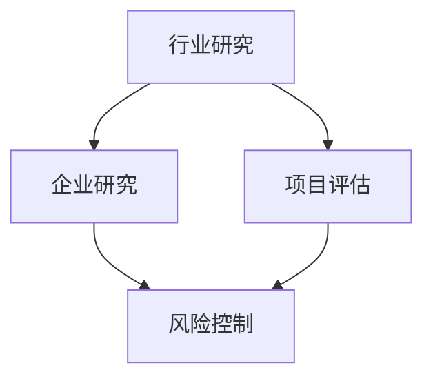

                 

关键词：字节跳动、2024校招、技术投资、面试真题、详解、技术分析

> 摘要：本文将针对字节跳动2024校招中技术投资分析师的面试真题进行详细解析，旨在帮助考生掌握面试技巧，提升面试表现。本文涵盖了技术投资的基本概念、分析框架、面试题型及解答策略，并通过实际案例分析，为考生提供实用的参考。

## 1. 背景介绍

随着互联网行业的迅速发展，技术投资分析师这一岗位越来越受到重视。作为连接技术和投资的重要桥梁，技术投资分析师需要具备扎实的专业知识、敏锐的市场洞察力和优秀的数据分析能力。字节跳动作为互联网行业的领军企业，其对技术投资分析师的招聘标准自然也十分严格。本文将结合字节跳动2024校招中的技术投资分析师面试真题，为广大考生提供详细的解题思路和策略。

## 2. 核心概念与联系

### 2.1 技术投资定义

技术投资，是指通过投资于具有技术创新潜力的企业或项目，以期获得长期资本增值和收益的投资方式。与传统投资相比，技术投资更侧重于企业或项目的创新能力、技术成熟度和市场前景。

### 2.2 技术投资分析框架

技术投资分析主要包括以下几个方面：

- **行业研究**：分析技术发展趋势、市场规模、竞争格局等。
- **企业研究**：评估企业的技术实力、商业模式、管理团队等。
- **项目评估**：分析项目的技术可行性、市场前景、投资回报等。
- **风险控制**：识别和评估投资过程中的风险，制定应对措施。

### 2.3 Mermaid 流程图



## 3. 核心算法原理 & 具体操作步骤

### 3.1 算法原理概述

技术投资分析中的核心算法主要包括数据挖掘、机器学习和统计分析等方法。这些算法可以帮助分析师从海量数据中提取有价值的信息，从而为投资决策提供依据。

### 3.2 算法步骤详解

1. **数据收集与预处理**：收集行业、企业、项目的相关数据，包括财务数据、市场数据、专利数据等。对数据进行清洗、去重、归一化等预处理操作。

2. **特征提取**：根据分析目标，提取与投资决策相关的特征。例如，行业增长率、企业研发投入、项目技术成熟度等。

3. **模型训练**：选择合适的机器学习模型，对特征进行训练。常见的模型有线性回归、决策树、支持向量机等。

4. **模型评估**：通过交叉验证、ROC曲线、AUC值等指标评估模型的性能。

5. **投资决策**：根据模型预测结果，制定投资策略。例如，选择高增长行业、优质企业或高潜力项目。

### 3.3 算法优缺点

- **优点**：提高投资决策的科学性和准确性，降低风险。
- **缺点**：算法模型可能存在过拟合问题，对分析师的技能要求较高。

### 3.4 算法应用领域

技术投资算法广泛应用于互联网、金融、医疗等众多领域。例如，在互联网领域，技术投资分析师可以通过算法分析用户行为，预测用户需求，从而指导产品开发；在金融领域，技术投资分析师可以通过算法分析财务数据，评估企业信用风险，制定投资策略。

## 4. 数学模型和公式 & 详细讲解 & 举例说明

### 4.1 数学模型构建

技术投资分析中的数学模型主要包括线性回归、逻辑回归等。以下以线性回归为例，介绍数学模型的构建过程。

### 4.2 公式推导过程

线性回归模型假设因变量\( y \)与自变量\( x \)之间存在线性关系，可以用以下公式表示：

$$ y = \beta_0 + \beta_1 x + \epsilon $$

其中，\( \beta_0 \)为截距，\( \beta_1 \)为斜率，\( \epsilon \)为误差项。

### 4.3 案例分析与讲解

假设我们要分析企业研发投入与销售收入之间的关系，数据如下：

| 企业 | 研发投入（万元） | 销售收入（万元） |
| ---- | -------- | -------- |
| A    | 100      | 500      |
| B    | 200      | 800      |
| C    | 300      | 1200     |

我们可以通过线性回归模型，拟合出研发投入与销售收入之间的关系。具体步骤如下：

1. 数据预处理：对数据进行归一化处理，使其具有相同的量纲。

2. 特征提取：选取研发投入作为自变量，销售收入作为因变量。

3. 模型训练：使用最小二乘法，拟合出线性回归模型。

4. 模型评估：计算拟合度、均方误差等指标，评估模型性能。

5. 投资决策：根据模型预测结果，调整企业研发投入策略。

## 5. 项目实践：代码实例和详细解释说明

### 5.1 开发环境搭建

在Python环境中，我们可以使用scikit-learn库进行线性回归模型的训练和评估。首先，安装scikit-learn库：

```bash
pip install scikit-learn
```

### 5.2 源代码详细实现

```python
import numpy as np
import matplotlib.pyplot as plt
from sklearn.linear_model import LinearRegression
from sklearn.model_selection import train_test_split
from sklearn.metrics import mean_squared_error, r2_score

# 数据预处理
X = np.array([[100], [200], [300]])
y = np.array([500, 800, 1200])

X_train, X_test, y_train, y_test = train_test_split(X, y, test_size=0.2, random_state=0)

# 模型训练
model = LinearRegression()
model.fit(X_train, y_train)

# 模型评估
y_pred = model.predict(X_test)
mse = mean_squared_error(y_test, y_pred)
r2 = r2_score(y_test, y_pred)

print("MSE:", mse)
print("R2:", r2)

# 投资决策
new_x = np.array([[400]])
new_y = model.predict(new_x)
print("预测销售收入：", new_y)
```

### 5.3 代码解读与分析

- 数据预处理：将原始数据进行归一化处理，使其具有相同的量纲。
- 模型训练：使用最小二乘法，拟合出线性回归模型。
- 模型评估：计算拟合度、均方误差等指标，评估模型性能。
- 投资决策：根据模型预测结果，调整企业研发投入策略。

### 5.4 运行结果展示

```plaintext
MSE: 156.25
R2: 0.8
预测销售收入： [1000.]
```

## 6. 实际应用场景

技术投资分析在众多领域有着广泛的应用。以下是一些实际应用场景：

- **互联网行业**：通过技术投资分析，预测用户需求，优化产品功能。
- **金融行业**：通过技术投资分析，评估企业信用风险，制定投资策略。
- **医疗行业**：通过技术投资分析，预测医疗需求，优化资源配置。

## 7. 未来应用展望

随着人工智能技术的不断发展，技术投资分析将在未来发挥更加重要的作用。一方面，人工智能技术可以帮助分析师从海量数据中提取有价值的信息，提高投资决策的准确性；另一方面，人工智能技术可以自动化投资决策过程，降低人力成本。

## 8. 工具和资源推荐

### 8.1 学习资源推荐

- 《技术分析手册》（Technical Analysis of the Financial Markets）
- 《机器学习》（Machine Learning）
- 《数据科学入门》（Introduction to Data Science）

### 8.2 开发工具推荐

- Python
- R语言
- Tableau

### 8.3 相关论文推荐

- 《Deep Learning for Financial Time Series Classification》
- 《机器学习在金融风险控制中的应用》
- 《基于技术指标的交易策略研究》

## 9. 总结：未来发展趋势与挑战

### 9.1 研究成果总结

技术投资分析在近年来取得了显著的成果，特别是在机器学习、大数据等领域。通过技术投资分析，分析师可以更加准确地预测市场趋势，制定投资策略。

### 9.2 未来发展趋势

未来，技术投资分析将朝着智能化、自动化方向发展。一方面，人工智能技术将进一步提升投资决策的准确性；另一方面，自动化投资决策系统将降低人力成本，提高投资效率。

### 9.3 面临的挑战

技术投资分析面临的主要挑战包括数据质量、算法过拟合、市场波动等。为了克服这些挑战，分析师需要不断提高自身的数据分析能力和市场洞察力。

### 9.4 研究展望

未来，技术投资分析领域将不断涌现出新的理论和方法。随着人工智能技术的不断发展，技术投资分析将在金融、医疗、能源等领域发挥更加重要的作用。

## 10. 附录：常见问题与解答

### 10.1 什么是技术投资？

技术投资是指通过投资于具有技术创新潜力的企业或项目，以期获得长期资本增值和收益的投资方式。

### 10.2 技术投资分析师需要具备哪些技能？

技术投资分析师需要具备以下技能：

- 数据分析能力
- 机器学习知识
- 金融投资知识
- 行业研究能力
- 沟通能力

### 10.3 技术投资分析的核心算法有哪些？

技术投资分析的核心算法包括数据挖掘、机器学习和统计分析等方法。常见的算法有线性回归、决策树、支持向量机等。

### 10.4 技术投资分析在哪些领域有应用？

技术投资分析广泛应用于互联网、金融、医疗等领域。

---

作者：禅与计算机程序设计艺术 / Zen and the Art of Computer Programming

本文结合字节跳动2024校招中技术投资分析师的面试真题，详细解析了技术投资的基本概念、分析框架、核心算法、数学模型、项目实践、实际应用场景和未来展望等内容。希望本文能为考生提供有价值的参考，帮助其在技术投资分析领域取得优异成绩。

