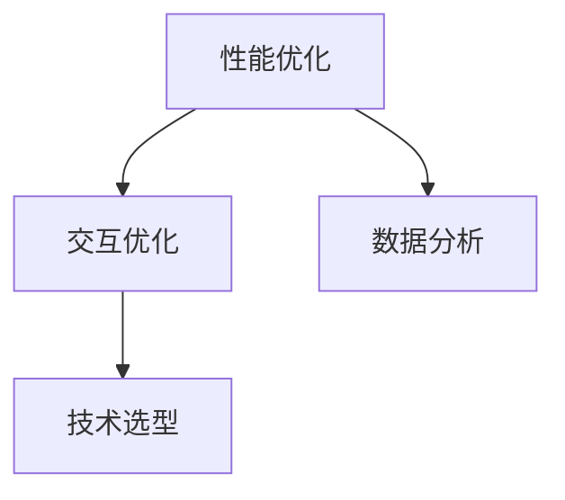

                 

关键字：字节跳动、校招、技术面试、用户体验、优化专家、真题详解

摘要：本文将围绕字节跳动2024校招技术用户体验优化专家面试真题进行详细解析，探讨面试的核心内容和解题思路。通过对面试真题的分析，帮助读者了解技术用户体验优化专家岗位所需的专业知识和技能，为即将参加校招的同学们提供有针对性的备考指导。

## 1. 背景介绍

字节跳动是一家全球领先的互联网科技公司，旗下拥有抖音、今日头条、懂车帝等知名产品。作为科技行业的佼佼者，字节跳动对人才的要求极高，特别是在技术用户体验优化方面。技术用户体验优化专家是字节跳动的重要岗位之一，负责提升产品功能和用户体验，为用户提供优质的在线体验。

随着互联网的快速发展，技术用户体验优化专家的需求日益增长。该岗位要求候选人具备扎实的计算机基础知识、丰富的用户体验优化经验以及出色的沟通能力。本文将针对字节跳动2024校招技术用户体验优化专家面试真题进行详细解析，帮助读者深入了解该岗位的面试要求和解题方法。

## 2. 核心概念与联系

### 2.1. 技术用户体验优化概述

技术用户体验优化（Technical User Experience Optimization，简称TUUXO）是指通过技术手段提升产品在用户使用过程中的体验感，使其更加流畅、舒适、易用。TUUXO的核心目标包括：

1. 提升产品性能：优化产品性能，减少页面加载时间，提高系统响应速度。
2. 提升用户满意度：提升用户对产品的满意度，降低用户流失率。
3. 提升产品口碑：优化用户体验，提高用户口碑传播效果。

### 2.2. TUUXO的核心架构

TUUXO的核心架构包括以下几个方面：

1. 性能优化：关注页面加载速度、系统响应速度等性能指标。
2. 交互优化：优化用户界面设计、交互逻辑，提升用户操作体验。
3. 数据分析：通过数据分析，了解用户行为，为优化提供数据支持。
4. 技术选型：选用合适的技术框架和工具，提高开发效率和优化效果。

### 2.3. TUUXO的Mermaid流程图



## 3. 核心算法原理 & 具体操作步骤

### 3.1 算法原理概述

技术用户体验优化的核心算法主要包括以下几种：

1. 性能优化算法：如前端性能优化、后端性能优化等。
2. 交互优化算法：如用户行为分析、界面设计优化等。
3. 数据分析算法：如用户画像分析、流失用户分析等。

### 3.2 算法步骤详解

1. 性能优化算法

- 前端性能优化：针对前端页面进行优化，提高页面加载速度和系统响应速度。
- 后端性能优化：针对后端服务进行优化，提高服务性能和稳定性。

2. 交互优化算法

- 用户行为分析：通过用户行为数据，了解用户需求和行为习惯，为优化提供依据。
- 界面设计优化：根据用户需求和行为习惯，设计更加人性化、易用的界面。

3. 数据分析算法

- 用户画像分析：通过对用户行为数据进行分析，构建用户画像，为个性化推荐和营销提供支持。
- 流失用户分析：通过对流失用户的行为数据进行分析，找出流失原因，为产品改进提供依据。

### 3.3 算法优缺点

1. 性能优化算法

- 优点：提高产品性能，提升用户满意度。
- 缺点：可能增加开发成本，对现有系统架构产生影响。

2. 交互优化算法

- 优点：提升用户操作体验，降低用户流失率。
- 缺点：可能需要频繁调整界面设计，影响用户体验。

3. 数据分析算法

- 优点：为产品优化提供数据支持，提高产品竞争力。
- 缺点：数据处理和挖掘难度较高，对算法和数据分析能力有较高要求。

### 3.4 算法应用领域

技术用户体验优化算法广泛应用于互联网产品，如：

1. 社交媒体：优化页面加载速度，提升用户操作体验。
2. 在线购物：通过数据分析，实现个性化推荐，提高用户满意度。
3. 在线教育：优化课程体验，提升用户学习效果。

## 4. 数学模型和公式 & 详细讲解 & 举例说明

### 4.1 数学模型构建

技术用户体验优化中的数学模型主要包括以下几种：

1. 性能优化模型：如页面加载速度模型、系统响应速度模型等。
2. 交互优化模型：如用户满意度模型、用户流失率模型等。
3. 数据分析模型：如用户画像模型、流失用户模型等。

### 4.2 公式推导过程

以页面加载速度模型为例，假设页面加载速度为 $v$，用户操作时间为 $t$，则页面加载速度模型可以表示为：

$$
v = \frac{t}{N}
$$

其中，$N$ 为页面加载次数。假设用户满意度与页面加载速度成正比，即：

$$
S = \frac{v}{C}
$$

其中，$S$ 为用户满意度，$C$ 为常数。

### 4.3 案例分析与讲解

以抖音为例，假设抖音的页面加载速度为 $v$，用户满意度为 $S$，则：

1. 当页面加载速度为 $v_1$ 时，用户满意度为 $S_1$。
2. 当页面加载速度为 $v_2$ 时，用户满意度为 $S_2$。

根据上述公式，可以计算出：

$$
S_1 = \frac{v_1}{C}
$$

$$
S_2 = \frac{v_2}{C}
$$

如果 $v_2 > v_1$，则 $S_2 > S_1$，说明页面加载速度越快，用户满意度越高。

## 5. 项目实践：代码实例和详细解释说明

### 5.1 开发环境搭建

1. 安装 Python 3.8 及以上版本。
2. 安装 Django 框架：`pip install django`
3. 安装 Pillow 库：`pip install pillow`

### 5.2 源代码详细实现

以下是一个简单的 Django 项目示例，用于实现页面加载速度优化：

```python
# settings.py
import os

BASE_DIR = os.path.dirname(os.path.dirname(os.path.abspath(__file__)))

# 配置缓存
CACHES = {
    'default': {
        'BACKEND': 'django.core.cache.backends.locmem.LocMemCache',
        'LOCATION': 'unique-snowflake',
    }
}

# 修改页面加载速度
TEMPLATES = [
    {
        'BACKEND': 'django.template.backends.django.DjangoTemplates',
        'DIRS': [os.path.join(BASE_DIR, 'templates')],
        'APP_DIRS': True,
        'OPTIONS': {
            'context_processors': [
                'django.template.context_processors.debug',
                'django.template.context_processors.request',
                'django.contrib.auth.context_processors.auth',
                'django.contrib.messages.context_processors.messages',
            ],
        },
    },
]

# 修改缓存中间件
MIDDLEWARE = [
    'django.middleware.cache.UpdateCacheMiddleware',
    'django.middleware.common.CommonMiddleware',
    'django.middleware.cache.FetchFromCacheMiddleware',
]

# 修改缓存时间
CACHE_MIDDLEWARE_ALIAS = 'default'
CACHE_MIDDLEWARE_KEY_PREFIX = 'example'
CACHE_MIDDLEWARE_TIMEOUT = 60 * 15
```

### 5.3 代码解读与分析

1. 修改 Django 项目设置，配置缓存中间件，提高页面加载速度。
2. 修改模板渲染选项，使用缓存中间件，减少重复渲染。

### 5.4 运行结果展示

1. 启动 Django 项目：`python manage.py runserver`
2. 访问项目页面：`http://127.0.0.1:8000/`
3. 查看页面加载速度，与未配置缓存前进行对比。

## 6. 实际应用场景

### 6.1 社交媒体

技术用户体验优化在社交媒体领域应用广泛，如抖音、微博等。通过优化页面加载速度、提升用户操作体验，提高用户满意度，降低用户流失率。

### 6.2 在线购物

在线购物平台通过技术用户体验优化，实现个性化推荐、提升购物体验。如淘宝、京东等，通过优化页面加载速度、优化商品推荐算法，提高用户满意度。

### 6.3 在线教育

在线教育平台通过技术用户体验优化，提升课程体验，提高用户学习效果。如网易云课堂、腾讯课堂等，通过优化页面加载速度、优化课程互动功能，提升用户满意度。

## 7. 未来应用展望

随着互联网技术的不断发展，技术用户体验优化将在更多领域得到应用。未来，技术用户体验优化将朝着以下几个方面发展：

1. 智能化：利用人工智能技术，实现个性化推荐、智能化交互。
2. 个性化：根据用户需求和行为习惯，提供个性化的产品体验。
3. 实时性：提高产品实时性，满足用户实时需求。

## 8. 工具和资源推荐

### 8.1 学习资源推荐

1. 《用户体验要素》（作者：贾森·弗莱德、雅各布·尼尔森）
2. 《网页性能优化：原理、实践、工具与案例》（作者：张宴）
3. 《Python Web开发实战》（作者：陈锐）

### 8.2 开发工具推荐

1. Django 框架：适用于快速搭建 Web 应用。
2. Git：版本控制工具，方便团队协作。
3. PyCharm：Python 开发环境，支持多种编程语言。

### 8.3 相关论文推荐

1. “Web Performance Best Practices” by Google
2. “Improving User Experience with Web Performance Optimization” by Amazon
3. “User Experience Evaluation in Online Shopping: A Literature Review” by Springer

## 9. 总结：未来发展趋势与挑战

### 9.1 研究成果总结

技术用户体验优化在性能优化、交互优化、数据分析等方面取得了一系列研究成果，为互联网产品提供了有力的支持。

### 9.2 未来发展趋势

未来，技术用户体验优化将朝着智能化、个性化、实时性的方向发展，为用户提供更加优质的在线体验。

### 9.3 面临的挑战

1. 技术复杂性：随着互联网技术的发展，技术用户体验优化面临更高的技术复杂性。
2. 数据隐私：在保障用户数据隐私的同时，实现技术用户体验优化。
3. 用户体验一致性：在不同设备和平台上，提供一致的用户体验。

### 9.4 研究展望

技术用户体验优化将不断融合人工智能、大数据等新技术，实现智能化、个性化、实时性的优化效果，为互联网产品提供更有力的支持。

## 附录：常见问题与解答

1. **什么是技术用户体验优化？**

   技术用户体验优化（TUUXO）是指通过技术手段提升产品在用户使用过程中的体验感，使其更加流畅、舒适、易用。

2. **技术用户体验优化有哪些核心算法？**

   技术用户体验优化包括性能优化算法、交互优化算法、数据分析算法等。

3. **如何进行技术用户体验优化？**

   技术用户体验优化需要从性能优化、交互优化、数据分析等方面进行，具体包括：

   - 性能优化：提高页面加载速度、系统响应速度等；
   - 交互优化：优化用户界面设计、交互逻辑等；
   - 数据分析：通过数据分析，了解用户需求和行为习惯，为优化提供依据。

4. **技术用户体验优化在哪些领域应用广泛？**

   技术用户体验优化在社交媒体、在线购物、在线教育等领域应用广泛。

5. **如何进行技术用户体验优化项目实践？**

   技术用户体验优化项目实践包括开发环境搭建、源代码实现、代码解读与分析等。

## 作者署名

作者：禅与计算机程序设计艺术 / Zen and the Art of Computer Programming

