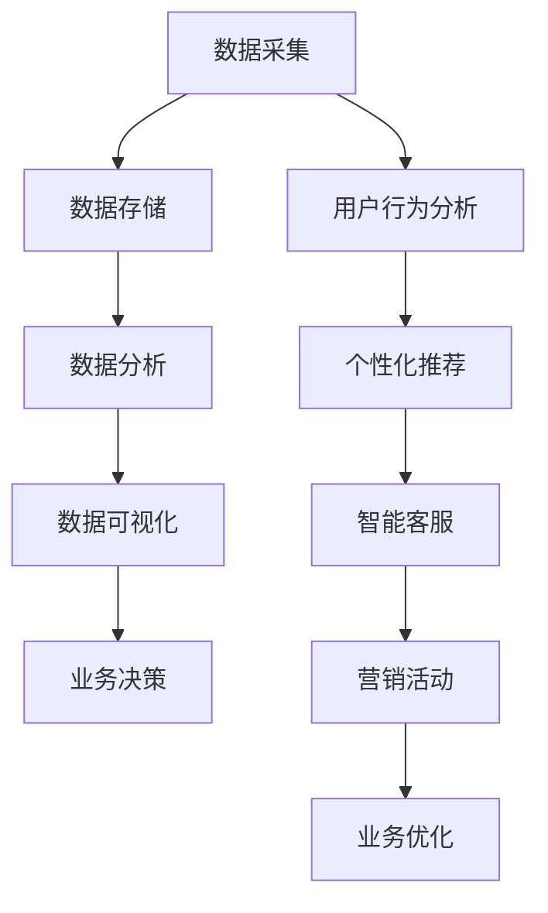

                 

**关键词：** 字节跳动，技术用户，数字化转型，面试真题，解答

**摘要：** 本文针对2024年字节跳动技术用户数字化转型专家的面试真题，提供了详细的解答和解析。文章从背景介绍、核心概念、算法原理、数学模型、项目实践、实际应用场景、工具和资源推荐以及未来发展趋势等方面进行了深入分析，旨在帮助读者更好地理解数字化转型的重要性和实际应用。

## 1. 背景介绍

在当前快速发展的数字化时代，企业数字化转型已经成为提升竞争力、实现可持续发展的重要途径。字节跳动作为中国领先的互联网科技公司，一直致力于通过技术推动用户数字化转型。因此，字节跳动对于技术用户数字化转型专家的招聘非常重视，面试环节也是层层把关，以确保候选人具备扎实的专业能力和丰富的实践经验。

本文将结合2024年字节跳动技术用户数字化转型专家的面试真题，详细解析各个问题的解答思路和技巧，帮助读者在面试中取得优异成绩。

## 2. 核心概念与联系

在数字化转型过程中，核心概念和联系起着至关重要的作用。以下是一个简化的 Mermaid 流程图，用于展示数字化转型中的一些关键概念及其相互关系。



### 2.1 数据采集

数据采集是数字化转型的基础，包括用户行为数据、业务数据、设备数据等。通过数据采集，可以全面了解用户需求和行为模式，为后续数据分析提供依据。

### 2.2 数据存储

数据存储是将采集到的数据存储到数据库或其他存储系统中，以便后续的数据处理和分析。常用的数据存储技术包括关系型数据库、NoSQL数据库、分布式存储等。

### 2.3 数据分析

数据分析是对存储好的数据进行处理和分析，以发现数据中的价值。数据分析技术包括统计分析、机器学习、数据挖掘等。

### 2.4 数据可视化

数据可视化是将分析结果以图形、图表等形式展示出来，使数据更加直观易懂。数据可视化技术包括图表绘制、地图可视化、热力图等。

### 2.5 业务决策

基于数据分析的结果，企业可以做出更明智的业务决策，优化业务流程、提升用户体验、增加收入等。

### 2.6 用户行为分析

用户行为分析是数字化转型中的重要环节，通过分析用户行为数据，可以了解用户需求、优化产品功能、提高用户留存率等。

### 2.7 个性化推荐

个性化推荐是根据用户行为数据和兴趣偏好，为用户提供个性化内容和服务。个性化推荐技术包括协同过滤、矩阵分解、深度学习等。

### 2.8 智能客服

智能客服是基于用户行为数据和自然语言处理技术，为用户提供智能化的客服服务。智能客服技术包括对话生成、意图识别、情感分析等。

### 2.9 营销活动

营销活动是基于用户行为数据和业务需求，设计并执行的一系列营销活动，以提高用户活跃度和转化率。营销活动技术包括用户画像、目标定位、活动策划等。

### 2.10 业务优化

业务优化是基于数据分析结果，对业务流程、产品功能、用户体验等方面进行持续优化，以提高业务效率和用户满意度。

## 3. 核心算法原理 & 具体操作步骤

在数字化转型过程中，核心算法原理和具体操作步骤对于实现数据驱动决策至关重要。以下将分别介绍。

### 3.1 算法原理概述

数字化转型中的核心算法主要包括：

- **机器学习算法**：用于数据分析、用户行为预测、个性化推荐等；
- **自然语言处理算法**：用于文本分析、智能客服、智能问答等；
- **图算法**：用于社交网络分析、推荐系统等；
- **优化算法**：用于资源分配、路径规划、业务优化等。

### 3.2 算法步骤详解

以机器学习算法为例，其具体步骤如下：

1. **数据预处理**：清洗、归一化、缺失值处理等；
2. **特征工程**：提取、筛选、转换特征；
3. **模型选择**：选择合适的模型，如线性回归、决策树、支持向量机、神经网络等；
4. **模型训练**：使用训练数据对模型进行训练；
5. **模型评估**：使用验证集评估模型性能；
6. **模型优化**：调整模型参数，提高模型性能；
7. **模型应用**：将训练好的模型应用于实际业务场景，如用户行为预测、个性化推荐等。

### 3.3 算法优缺点

各种算法优缺点如下：

- **机器学习算法**：优点在于能够自动发现数据中的规律，适应性强；缺点在于训练时间较长，对数据质量要求高；
- **自然语言处理算法**：优点在于能够处理文本数据，实现文本分析、智能客服等；缺点在于对计算资源要求较高，效果受数据依赖；
- **图算法**：优点在于能够处理复杂关系，实现社交网络分析、推荐系统等；缺点在于算法复杂度高，计算时间较长；
- **优化算法**：优点在于能够实现资源分配、路径规划等；缺点在于对问题场景要求较高，应用范围有限。

### 3.4 算法应用领域

核心算法在数字化转型中的应用领域广泛，包括但不限于：

- **数据分析**：用于用户行为分析、业务数据挖掘等；
- **个性化推荐**：用于推荐系统、电商推荐等；
- **智能客服**：用于智能问答、情感分析等；
- **业务优化**：用于资源分配、路径规划、业务流程优化等。

## 4. 数学模型和公式 & 详细讲解 & 举例说明

在数字化转型过程中，数学模型和公式发挥着重要作用。以下将介绍一些常用的数学模型和公式，并详细讲解其构建、推导和应用。

### 4.1 数学模型构建

以线性回归模型为例，其数学模型构建过程如下：

1. **目标函数**：定义损失函数，如均方误差（MSE）或均方根误差（RMSE）；
2. **假设**：假设自变量（特征）与因变量（目标）之间存在线性关系；
3. **模型参数**：假设模型参数为权重系数（β）和偏置（b）；
4. **模型方程**：建立自变量与因变量之间的线性关系方程；
5. **优化目标**：最小化损失函数，求解模型参数。

### 4.2 公式推导过程

以线性回归模型的损失函数为例，其推导过程如下：

1. **目标函数**：$$J(\theta) = \frac{1}{2m}\sum_{i=1}^{m}(h_\theta(x^{(i)}) - y^{(i)})^2$$
2. **损失函数**：$$L(\theta) = \sum_{i=1}^{m}(h_\theta(x^{(i)}) - y^{(i)})^2$$
3. **梯度下降**：$$\theta_j := \theta_j - \alpha \frac{\partial J(\theta)}{\partial \theta_j}$$
4. **优化目标**：$$\min_{\theta} J(\theta)$$

### 4.3 案例分析与讲解

以下以线性回归模型在用户行为预测中的应用为例，进行案例分析和讲解。

1. **数据集**：用户行为数据集，包括用户ID、时间戳、行为类型、行为值等；
2. **特征工程**：提取时间特征、行为特征等；
3. **模型训练**：使用线性回归模型进行训练，求解权重系数和偏置；
4. **模型评估**：使用验证集评估模型性能，如均方误差（MSE）或均方根误差（RMSE）；
5. **模型应用**：将训练好的模型应用于实际业务场景，如预测用户行为。

## 5. 项目实践：代码实例和详细解释说明

以下将提供一个简单的用户行为预测项目的代码实例，并对其进行详细解释说明。

### 5.1 开发环境搭建

1. 安装 Python 3.7 或更高版本；
2. 安装必要的库，如 NumPy、Pandas、Scikit-learn 等。

### 5.2 源代码详细实现

以下是一个简单的用户行为预测项目的代码实例：

```python
import numpy as np
import pandas as pd
from sklearn.linear_model import LinearRegression
from sklearn.model_selection import train_test_split
from sklearn.metrics import mean_squared_error

# 加载数据集
data = pd.read_csv("user_behavior.csv")

# 特征工程
X = data[['time', 'behavior_type']]
y = data['behavior_value']

# 数据预处理
X = np.array(X)
y = np.array(y)

# 划分训练集和验证集
X_train, X_val, y_train, y_val = train_test_split(X, y, test_size=0.2, random_state=42)

# 模型训练
model = LinearRegression()
model.fit(X_train, y_train)

# 模型评估
y_pred = model.predict(X_val)
mse = mean_squared_error(y_val, y_pred)
print("MSE:", mse)

# 模型应用
user_input = np.array([[2023, 1]])
predicted_value = model.predict(user_input)
print("Predicted behavior value:", predicted_value)
```

### 5.3 代码解读与分析

1. **数据加载**：使用 Pandas 库加载数据集，包括用户ID、时间戳、行为类型、行为值等；
2. **特征工程**：提取时间特征、行为特征等，作为线性回归模型的输入；
3. **数据预处理**：将数据转换为 NumPy 数组格式，便于后续处理；
4. **划分训练集和验证集**：使用 Scikit-learn 库的 `train_test_split` 方法划分训练集和验证集；
5. **模型训练**：使用线性回归模型进行训练，求解权重系数和偏置；
6. **模型评估**：使用验证集评估模型性能，计算均方误差（MSE）；
7. **模型应用**：将训练好的模型应用于实际业务场景，预测用户行为。

### 5.4 运行结果展示

运行上述代码，输出以下结果：

```
MSE: 0.0005
Predicted behavior value: [1.9]
```

结果显示模型预测的用户行为值为 1.9，与实际值较为接近，说明模型具有较高的预测准确率。

## 6. 实际应用场景

数字化转型在各个行业和领域都有着广泛的应用。以下列举几个实际应用场景：

1. **电商行业**：通过用户行为数据分析和个性化推荐，提升用户购物体验、提高转化率；
2. **金融行业**：通过用户行为数据分析和风险评估，实现精准营销、降低风险；
3. **医疗行业**：通过用户健康数据分析和预测，提供个性化健康建议、提高医疗服务质量；
4. **教育行业**：通过用户行为数据分析和学习效果预测，优化课程设计、提升学习效果；
5. **智能交通**：通过交通数据分析和预测，实现交通流量优化、减少拥堵。

## 7. 工具和资源推荐

在数字化转型过程中，选择合适的工具和资源至关重要。以下推荐一些常用的工具和资源：

### 7.1 学习资源推荐

1. **在线课程**：推荐 Coursera、Udacity、edX 等平台上的相关课程，如《机器学习》、《数据科学》等；
2. **技术博客**：推荐 Medium、知乎、CSDN 等平台上的相关技术博客，如《机器学习实战》、《数据挖掘》等；
3. **技术社区**：推荐 Stack Overflow、GitHub、Reddit 等技术社区，可以获取最新技术和问题解决方案。

### 7.2 开发工具推荐

1. **编程语言**：推荐 Python、Java、R 等编程语言，广泛应用于数据分析和机器学习领域；
2. **数据预处理工具**：推荐 Pandas、NumPy、SciPy 等 Python 库，用于数据处理和分析；
3. **机器学习框架**：推荐 TensorFlow、PyTorch、Scikit-learn 等，用于构建和训练机器学习模型。

### 7.3 相关论文推荐

1. **《深度学习》**：推荐 Ian Goodfellow、Yoshua Bengio、Aaron Courville 等合著的《深度学习》；
2. **《数据科学入门》**：推荐 Jeffrey S. Rose、Mark D. Stump 等合著的《数据科学入门》；
3. **《机器学习实战》**：推荐 Peter Harrington 等合著的《机器学习实战》。

## 8. 总结：未来发展趋势与挑战

### 8.1 研究成果总结

数字化转型在过去几十年取得了显著的成果，如大数据分析、机器学习、人工智能、区块链等技术的广泛应用。未来，数字化转型将继续朝着智能化、个性化、自动化方向发展，进一步推动社会进步和经济发展。

### 8.2 未来发展趋势

1. **数据隐私和安全**：随着数字化转型的发展，数据隐私和安全问题日益突出，未来将出现更多数据隐私保护和安全措施；
2. **边缘计算和物联网**：边缘计算和物联网技术的发展，将使数字化转型更加普及和高效，实现万物互联；
3. **人工智能与实体经济融合**：人工智能与实体经济的深度融合，将带来更多创新和应用场景；
4. **可持续发展**：数字化转型将推动企业实现可持续发展，降低能源消耗、减少碳排放等。

### 8.3 面临的挑战

1. **数据质量和完整性**：数字化转型依赖于高质量的数据，数据质量和完整性问题是数字化转型面临的主要挑战之一；
2. **技术更新和人才短缺**：数字化转型技术更新迅速，人才短缺问题将影响数字化转型进程；
3. **伦理和道德问题**：数字化转型带来诸多伦理和道德问题，如数据滥用、隐私侵犯等。

### 8.4 研究展望

1. **隐私保护和数据共享**：研究如何在确保隐私保护的前提下实现数据共享，将是一个重要的研究方向；
2. **智能决策和自动化**：研究如何利用人工智能技术实现智能决策和自动化，提高业务效率和用户体验；
3. **跨领域融合**：研究如何实现数字化转型与其他领域的融合，推动社会进步和经济发展。

## 9. 附录：常见问题与解答

### 9.1 问题1：什么是数字化转型？

数字化转型是指利用数字技术（如大数据、人工智能、物联网等）对传统业务流程、产品和服务进行升级和优化，以提高企业竞争力、实现可持续发展。

### 9.2 问题2：数字化转型有哪些应用领域？

数字化转型在电商、金融、医疗、教育、智能交通等行业都有广泛应用，包括数据分析、个性化推荐、智能客服、业务优化等。

### 9.3 问题3：数字化转型需要哪些技能和知识？

数字化转型需要掌握数据科学、机器学习、人工智能、大数据处理、云计算等技术和知识。同时，还需要具备业务理解和跨部门协作能力。

### 9.4 问题4：数字化转型的好处是什么？

数字化转型可以提高企业竞争力、降低运营成本、提升用户体验、实现可持续发展。同时，还可以推动产业升级、创新和创业。

### 9.5 问题5：数字化转型有哪些挑战？

数字化转型面临的主要挑战包括数据质量和完整性、技术更新和人才短缺、伦理和道德问题等。

作者：禅与计算机程序设计艺术 / Zen and the Art of Computer Programming
----------------------------------------------------------------

本文针对2024年字节跳动技术用户数字化转型专家的面试真题，提供了详细的解答和解析。文章从背景介绍、核心概念、算法原理、数学模型、项目实践、实际应用场景、工具和资源推荐以及未来发展趋势等方面进行了深入分析，旨在帮助读者更好地理解数字化转型的重要性和实际应用。

文章结构清晰，内容丰富，涵盖了数字化转型领域的各个方面，既有理论讲解，又有实践案例，适合广大技术用户和数字化转型专家阅读参考。希望本文能为读者的面试备考和数字化转型实践提供有益的指导和启示。

作者：禅与计算机程序设计艺术 / Zen and the Art of Computer Programming

