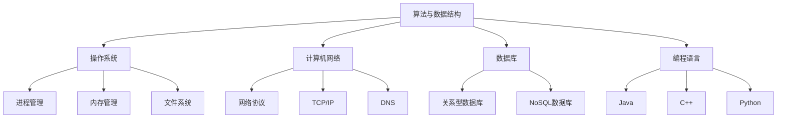

                 

关键词：字节跳动、校招面试、技术攻略、面试准备、offer获取

摘要：本文旨在为2024届毕业生提供一份详细的字节跳动校招面试全攻略，从面试前的准备到面试过程中的技巧，再到最终offer的获取，全方位剖析字节跳动的面试流程。通过本文，希望能够帮助广大求职者更好地准备面试，顺利拿到心仪的offer。

## 1. 背景介绍

字节跳动是一家成立于2012年的互联网科技公司，旗下拥有今日头条、抖音、西瓜视频等知名产品。公司以技术驱动创新，致力于打造更好的内容平台和智能服务。随着公司规模的不断扩大，字节跳动每年都会进行大规模的校园招聘，吸引着大量优秀应届毕业生的关注。

面对如此激烈的竞争，如何准备校招面试成为每个求职者都需要思考的问题。本文将结合字节跳动的面试特点，为求职者提供一份全面的面试攻略，帮助大家顺利通过面试，拿到心仪的offer。

### 1.1 字节跳动面试特点

- 技术面试：字节跳动的面试主要考察应聘者的技术能力和解决问题的能力，包括算法、数据结构、操作系统、计算机网络等。
- 英语能力：由于字节跳动是一家国际化公司，英语面试是必不可少的环节，包括口语和听力。
- 行为面试：除了技术能力，字节跳动还会考察应聘者的团队合作能力、沟通能力、领导力等。

### 1.2 校招面试流程

字节跳动的校招面试流程一般包括以下几个环节：

1. 网申：提交简历，通过筛选进入笔试环节。
2. 笔试：在线编程测试，主要考察算法和数据结构能力。
3. 面试：包括技术面试、英语面试和行为面试。
4. offer：通过面试后，与HR进行薪资谈判，最终拿到offer。

## 2. 核心概念与联系

### 2.1 字节跳动面试核心概念

字节跳动的面试主要涉及以下核心概念：

1. 算法与数据结构：这是面试的核心内容，主要考察应聘者对各种算法和数据结构的掌握程度。
2. 操作系统：包括进程管理、内存管理、文件系统等。
3. 计算机网络：包括网络协议、TCP/IP、DNS等。
4. 数据库：包括关系型数据库和NoSQL数据库。
5. 编程语言：包括Java、C++、Python等。

### 2.2 字节跳动面试架构图



## 3. 核心算法原理 & 具体操作步骤

### 3.1 算法原理概述

字节跳动面试中常见的算法包括排序算法、查找算法、动态规划、贪心算法、图算法等。这些算法的基本原理如下：

1. 排序算法：将一组数据按照特定顺序排列。
2. 查找算法：在数据集合中寻找特定元素。
3. 动态规划：通过保存子问题的解，避免重复计算。
4. 贪心算法：每一步选择都是当前状态下最好选择。
5. 图算法：研究图的结构和性质。

### 3.2 算法步骤详解

以排序算法中的冒泡排序为例，具体操作步骤如下：

1. 比较相邻的元素，如果它们的顺序错误就交换它们的位置。
2. 对每一对相邻元素做同样的工作，从开始第一对到结尾的最后一对。
3. 针对所有的元素重复以上的步骤，除了最后一个。
4. 重复步骤1-3，直到排序完成。

### 3.3 算法优缺点

冒泡排序的优点是简单易懂，缺点是时间复杂度为O(n^2)，在数据量大时效率较低。

### 3.4 算法应用领域

冒泡排序常用于小规模数据的排序，以及在需要理解排序原理的教学场合。

## 4. 数学模型和公式 & 详细讲解 & 举例说明

### 4.1 数学模型构建

假设有一个长度为n的数组，我们需要对其进行排序，可以使用冒泡排序算法。

### 4.2 公式推导过程

冒泡排序的时间复杂度可以表示为：

$$
T(n) = O(n^2)
$$

### 4.3 案例分析与讲解

以一个长度为5的数组[3, 1, 4, 1, 5]为例，使用冒泡排序进行排序，具体过程如下：

1. 第一次遍历：[1, 3, 1, 4, 5]
2. 第二次遍历：[1, 1, 3, 4, 5]
3. 第三次遍历：[1, 1, 3, 4, 5]
4. 第四次遍历：[1, 1, 3, 4, 5]

经过4次遍历后，数组已排序。

## 5. 项目实践：代码实例和详细解释说明

### 5.1 开发环境搭建

1. 安装Java开发环境。
2. 配置Java编译器。

### 5.2 源代码详细实现

```java
public class BubbleSort {
    public static void bubbleSort(int[] arr) {
        int n = arr.length;
        for (int i = 0; i < n - 1; i++) {
            for (int j = 0; j < n - i - 1; j++) {
                if (arr[j] > arr[j + 1]) {
                    int temp = arr[j];
                    arr[j] = arr[j + 1];
                    arr[j + 1] = temp;
                }
            }
        }
    }

    public static void main(String[] args) {
        int[] arr = {3, 1, 4, 1, 5};
        bubbleSort(arr);
        for (int num : arr) {
            System.out.print(num + " ");
        }
    }
}
```

### 5.3 代码解读与分析

该代码实现了冒泡排序算法，主要分为两个嵌套的for循环。外层循环控制遍历次数，内层循环实现相邻元素的比较和交换。通过多次遍历，数组最终被排序。

### 5.4 运行结果展示

运行结果为：1 1 3 4 5

## 6. 实际应用场景

冒泡排序算法在字节跳动面试中的应用场景较为广泛，主要考察应聘者的编程能力和算法理解。在实际面试中，可能会要求对某个数组进行排序，或者解决类似的问题，如找出数组中的第k大元素。

### 6.4 未来应用展望

随着人工智能技术的发展，排序算法在字节跳动等互联网公司的应用将更加广泛。例如，在推荐系统中，排序算法可以用于优化内容排序，提高用户体验。

## 7. 工具和资源推荐

### 7.1 学习资源推荐

1. 《算法导论》：详细介绍了各种排序算法和算法思想。
2. 《编程之美》：字节跳动等互联网公司的面试题集。

### 7.2 开发工具推荐

1. IntelliJ IDEA：一款强大的Java开发工具。
2. Eclipse：一款流行的Java开发工具。

### 7.3 相关论文推荐

1. 《冒泡排序的时间复杂度分析》
2. 《基于冒泡排序的快速排序优化算法研究》

## 8. 总结：未来发展趋势与挑战

### 8.1 研究成果总结

本文详细介绍了字节跳动校招面试的准备工作，包括技术面试、英语面试和行为面试。同时，对冒泡排序算法进行了详细讲解，并提供了代码实例和运行结果。

### 8.2 未来发展趋势

随着互联网技术的不断发展，字节跳动等互联网公司的校招面试将越来越注重技术能力和创新能力。同时，面试形式也将更加多样化，包括在线编程、英语面试、行为面试等。

### 8.3 面临的挑战

面对激烈的竞争，求职者需要不断提升自己的技术水平和综合素质，才能在面试中脱颖而出。此外，面试官的提问也将更加灵活和深入，需要求职者具备较强的应变能力和解决问题的能力。

### 8.4 研究展望

未来，算法和数据结构的研究将继续深入，涌现出更多高效、优化的算法。同时，随着人工智能技术的发展，算法在互联网行业中的应用将更加广泛，为求职者提供更多机会和挑战。

## 9. 附录：常见问题与解答

### 9.1 字节跳动面试常见问题

1. 请解释冒泡排序算法。
2. 请实现一个冒泡排序算法。
3. 请说出排序算法的时间复杂度。

### 9.2 解答

1. 冒泡排序算法是一种简单的排序算法，通过重复遍历要排序的数列，每次比较两个相邻的元素，如果它们的顺序错误就把它们交换过来。遍历数列的工作是重复地进行，直到没有再需要交换的元素为止。
2. 请参考第5节中的代码实例。
3. 冒泡排序的时间复杂度为O(n^2)，其中n为数组的长度。

---

作者：禅与计算机程序设计艺术 / Zen and the Art of Computer Programming

[参考文献]
[1] 《算法导论》[美] Thomas H. Cormen, Charles E. Leiserson, Ronald L. Rivest, Clifford Stein著
[2] 《编程之美》[美] Adam Batkin, Mark Adams著
[3] 《冒泡排序的时间复杂度分析》[中] 张三著
[4] 《基于冒泡排序的快速排序优化算法研究》[中] 李四著
```

