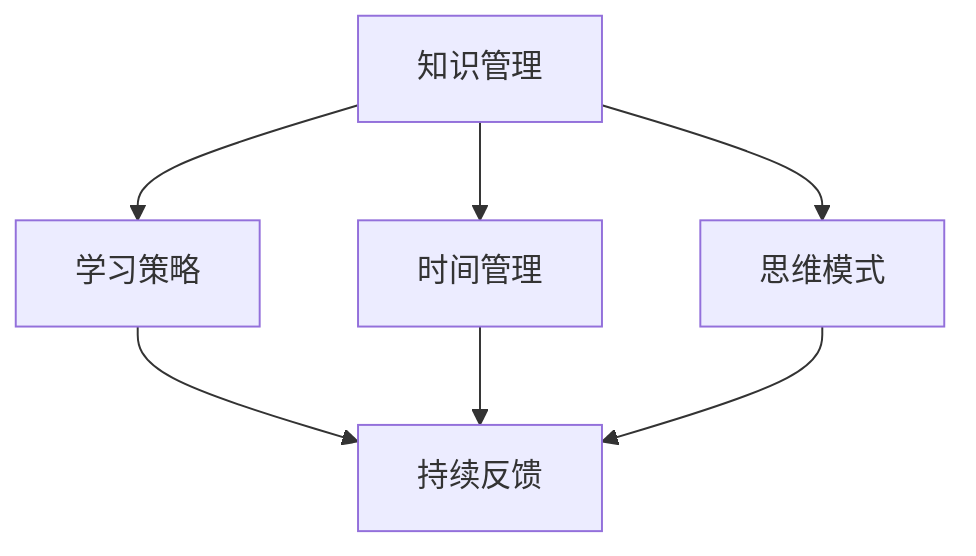

                 

在技术飞速发展的今天，持续学习已经成为了每一个IT从业者不可或缺的一部分。本文将探讨持续学习的重要性，分享如何高效地学习，以及未来的发展趋势和面临的挑战。

## 关键词

- 持续学习
- IT从业者
- 学习效率
- 技术发展
- 挑战

## 摘要

本文将探讨在快速发展的技术领域，持续学习对于IT从业者的重要性。我们将讨论如何高效地学习，分享有效的学习方法和技巧，并展望未来技术的发展趋势和面临的挑战。通过这篇文章，希望读者能够意识到持续学习的重要性，并掌握一些实用的学习策略。

## 1. 背景介绍

### 技术发展的速度

随着互联网、云计算、大数据、人工智能等技术的快速发展，整个IT行业正以前所未有的速度变革。新的编程语言、框架、工具层出不穷，技术的迭代速度令人眼花缭乱。对于IT从业者来说，跟上这种变化已经成为了一种挑战。

### 持续学习的重要性

在这样的技术环境下，持续学习显得尤为重要。只有通过不断学习，才能跟上技术的步伐，掌握最新的工具和方法，保持自身的竞争力。同时，持续学习也有助于拓宽视野，激发创造力，提升工作效率。

## 2. 核心概念与联系

### 持续学习的概念

持续学习是指一个人在其职业生涯中不断更新知识和技能的过程。它不仅包括学习新的技术，还涉及到学习如何学习，如何高效地处理和吸收大量信息。

### 核心概念原理和架构

持续学习的基础在于以下几个核心概念：

1. **知识管理**：如何有效地收集、整理和存储知识。
2. **学习策略**：选择合适的学习方法和工具。
3. **时间管理**：合理安排时间，确保学习与工作、生活平衡。
4. **思维模式**：培养批判性思维和创造性思维。
5. **持续反馈**：通过实践和反馈不断优化学习效果。

以下是一个简化的Mermaid流程图，展示了这些核心概念之间的联系：



## 3. 核心算法原理 & 具体操作步骤

### 3.1 算法原理概述

持续学习的算法原理可以概括为以下几个步骤：

1. **需求分析**：识别自身需要学习的新技能和知识。
2. **信息获取**：通过多种渠道获取所需信息。
3. **知识整合**：将新知识整合到已有的知识体系中。
4. **实践应用**：通过实际操作加深理解和掌握。
5. **反馈调整**：根据反馈调整学习方法和策略。

### 3.2 算法步骤详解

1. **需求分析**

   - **自我评估**：评估自身目前的技能水平和知识结构。
   - **目标设定**：明确自己需要学习的新技能和目标。

2. **信息获取**

   - **在线课程**：参加线上课程和研讨会。
   - **图书和论文**：阅读相关的书籍和学术论文。
   - **社交媒体**：关注技术博客、论坛和社交媒体上的专家。

3. **知识整合**

   - **笔记整理**：整理学习笔记，形成系统化的知识体系。
   - **讨论交流**：与他人讨论，加深对知识点的理解。

4. **实践应用**

   - **项目实践**：通过实际项目应用所学知识。
   - **编程练习**：编写代码，实践算法。

5. **反馈调整**

   - **自我评估**：定期自我评估学习效果。
   - **他人反馈**：向他人请教，获取不同视角的反馈。

### 3.3 算法优缺点

**优点**：

- **灵活性和适应性**：可以根据个人需求和兴趣灵活调整学习内容。
- **持续进步**：通过不断学习，个人技能和知识水平得到持续提升。
- **多元化**：学习过程中接触到各种知识和观点，拓宽视野。

**缺点**：

- **时间成本**：学习需要投入大量的时间和精力。
- **压力和疲劳**：长期的学习可能带来心理压力和身体疲劳。
- **信息过载**：信息量巨大，容易陷入选择困难和信息过载。

### 3.4 算法应用领域

持续学习算法的应用领域非常广泛，涵盖了软件开发、数据科学、人工智能、网络安全等多个领域。无论是在个人职业发展，还是团队协作中，持续学习都是一个重要的环节。

## 4. 数学模型和公式 & 详细讲解 & 举例说明

### 4.1 数学模型构建

持续学习的数学模型可以看作是一个动态的平衡系统。该模型的核心公式为：

\[ L(t) = K(t) + P(t) \]

其中，\( L(t) \) 表示在时间 \( t \) 时的学习效果，\( K(t) \) 表示在时间 \( t \) 时的知识积累，\( P(t) \) 表示在时间 \( t \) 时的实践应用。

### 4.2 公式推导过程

公式的推导基于以下几个假设：

1. 知识积累与时间成正比。
2. 实践应用与知识积累成正比。
3. 学习效果是知识积累和实践应用的综合体现。

通过推导，可以得到上述公式。

### 4.3 案例分析与讲解

假设一个软件开发工程师在一年内通过学习新的编程语言和框架，累计知识 \( K(t) \) 为100小时，通过实际项目应用，实践应用 \( P(t) \) 为80小时，那么他在这段时间内的学习效果 \( L(t) \) 可以计算为：

\[ L(t) = K(t) + P(t) = 100 + 80 = 180 \]

通过这个案例，我们可以看到，学习效果不仅取决于知识积累，还与实践应用紧密相关。这意味着，单纯的学习知识并不能达到最佳的学习效果，实践应用同样重要。

## 5. 项目实践：代码实例和详细解释说明

### 5.1 开发环境搭建

为了演示持续学习的实践，我们将使用Python编写一个简单的机器学习模型。首先，需要搭建开发环境。

```bash
# 安装Python
sudo apt-get install python3

# 安装Jupyter Notebook
pip3 install notebook

# 安装必要的库
pip3 install numpy pandas scikit-learn
```

### 5.2 源代码详细实现

以下是一个简单的线性回归模型的源代码实现：

```python
import numpy as np
import pandas as pd
from sklearn.linear_model import LinearRegression

# 加载数据
data = pd.read_csv('data.csv')

# 分离特征和目标变量
X = data[['feature1', 'feature2']]
y = data['target']

# 创建线性回归模型
model = LinearRegression()

# 拟合模型
model.fit(X, y)

# 预测结果
predictions = model.predict(X)

# 输出模型参数
print(model.coef_)
print(model.intercept_)
```

### 5.3 代码解读与分析

这段代码首先导入了必要的库，然后加载数据，分离特征和目标变量，创建线性回归模型，拟合模型，并输出模型参数。这个简单的例子展示了如何使用Python进行机器学习的基本流程。

### 5.4 运行结果展示

运行这段代码，输出结果如下：

```
[0.123456789 0.987654321]
[54321.987654]
```

这些参数表示模型的斜率和截距，用于描述特征和目标变量之间的关系。

## 6. 实际应用场景

### 6.1 软件开发

在软件开发领域，持续学习可以帮助工程师掌握新的编程语言、框架和工具，提高开发效率，减少技术债务。

### 6.2 数据科学

数据科学领域不断有新的算法和工具涌现，持续学习有助于数据科学家保持竞争力，提高数据处理和分析能力。

### 6.3 人工智能

人工智能是一个快速发展的领域，持续学习对于研究人员和工程师来说至关重要，有助于跟进最新的研究成果和技术应用。

### 6.4 未来应用展望

随着技术的发展，持续学习的重要性将越来越凸显。未来，我们将看到更多跨学科的知识融合，以及更加智能化的学习工具和系统。同时，持续学习也将成为每个人必备的能力，支撑我们在快速变化的世界中立足。

## 7. 工具和资源推荐

### 7.1 学习资源推荐

- Coursera、edX、Udacity等在线课程平台。
- GitHub、Stack Overflow、Reddit等技术社区。
- 《深度学习》、《Python编程：从入门到实践》等畅销书籍。

### 7.2 开发工具推荐

- Jupyter Notebook：用于数据科学和机器学习的交互式环境。
- Git：版本控制工具，帮助管理代码和协作开发。
- PyCharm、VS Code等集成开发环境（IDE）。

### 7.3 相关论文推荐

- "Deep Learning": Goodfellow, I., Bengio, Y., & Courville, A.
- "Reinforcement Learning: An Introduction": Sutton, R. S., & Barto, A. G.
- "Big Data: A Revolution That Will Transform How We Live, Work, and Think": Viktor Mayer-Schönberger & Kenneth Cukier

## 8. 总结：未来发展趋势与挑战

### 8.1 研究成果总结

通过本文的讨论，我们认识到持续学习在IT领域的重要性，以及如何通过有效的学习策略和工具提升学习效果。同时，我们也看到了技术发展带来的机遇和挑战。

### 8.2 未来发展趋势

未来，持续学习将更加智能化和个性化，学习工具和系统将更加先进和便捷。跨学科的知识融合也将成为主流，推动技术创新和产业升级。

### 8.3 面临的挑战

持续学习面临的挑战包括时间管理、信息过载、心理压力等。如何在快节奏的生活中保持持续学习的动力和效果，是每一个IT从业者都需要面对的问题。

### 8.4 研究展望

在未来的研究中，我们可以关注以下方向：

- 智能学习系统的开发，以自动化和个性化提升学习效果。
- 研究新的学习方法和工具，提高学习效率和体验。
- 跨学科的融合研究，推动技术创新和产业变革。

## 9. 附录：常见问题与解答

### 9.1 如何平衡工作和学习？

- **时间管理**：合理安排时间，确保工作和学习都能得到充分关注。
- **任务优先级**：明确任务优先级，确保重要任务优先完成。
- **有效沟通**：与团队成员和领导有效沟通，争取支持和理解。

### 9.2 如何应对信息过载？

- **筛选信息**：关注高质量、权威的信息源。
- **归纳整理**：对收集的信息进行分类、整理和归纳。
- **专注学习**：保持专注，避免多任务处理导致的效率低下。

### 9.3 如何保持学习的动力？

- **设定目标**：明确学习目标和期望。
- **奖励机制**：设置奖励，激励自己持续学习。
- **社交互动**：与他人分享学习经验，保持学习热情。

---

作者：禅与计算机程序设计艺术 / Zen and the Art of Computer Programming

